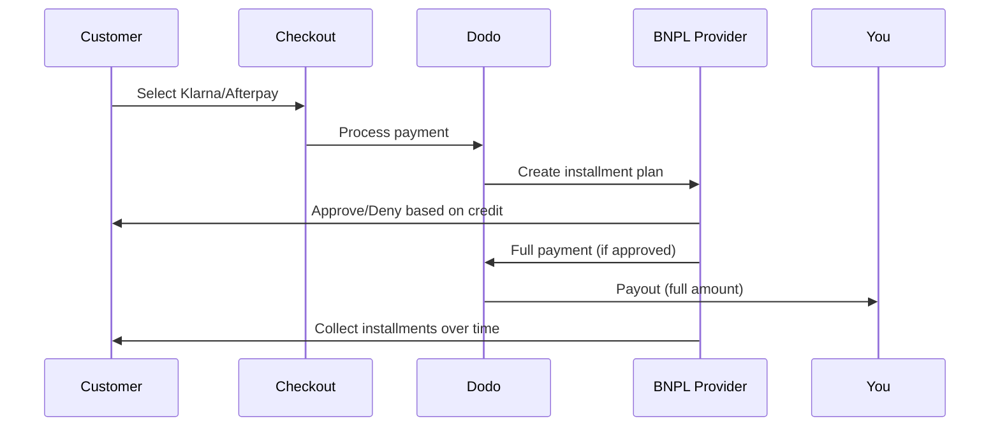

Buy Now Pay Later (BNPL) lets customers split purchases into interest-free installments, increasing average order value by 20-50% and conversion rates by 10-30% for eligible transactions.

## Why Offer BNPL?

<CardGroup cols={3}>
<Card title="Higher AOV" icon="chart-line">
Customers spend more when they can spread payments over time. Average order value increases 20-50%.
</Card>

<Card title="Better Conversion" icon="percent">
Removing payment friction at checkout. Conversion rates improve 10-30% for high-ticket items.
</Card>

<Card title="Zero Risk" icon="shield-check">
BNPL providers handle credit risk and collections. You receive full payment upfront.
</Card>
</CardGroup>

## Supported Providers

### Klarna

| Feature | Details |
| :------ | :------ |
| **Availability** | US + 19 European countries |
| **Currencies** | USD, EUR, GBP, DKK, NOK, SEK, CZK, RON, PLN, CHF |
| **Minimum** | $50.01 (or equivalent) |
| **Subscriptions** | No |

**Supported Countries:** Austria, Belgium, Czech Republic, Denmark, Finland, France, Germany, Greece, Ireland, Italy, Netherlands, Norway, Poland, Portugal, Romania, Spain, Sweden, Switzerland, United Kingdom, United States

**Payment Options:**
- **Pay in 4** — Split into 4 interest-free payments
- **Pay in 30 days** — Full payment due in 30 days
- **Financing** — Longer-term installment plans

### Afterpay (Clearpay)

| Feature | Details |
| :------ | :------ |
| **Availability** | US, UK |
| **Currencies** | USD, GBP |
| **Minimum** | $50.01 (or equivalent) |
| **Subscriptions** | No |

**Payment Options:**
- **Pay in 4** — 4 interest-free payments every 2 weeks

<Note>
In the UK, Afterpay operates as "Clearpay" but uses the same API type (`afterpay_clearpay`).
</Note>

### Billie

| Feature | Details |
| :------ | :------ |
| **Availability** | Global |
| **Currencies** | GBP |
| **Minimum** | None |
| **Subscriptions** | No |

**About Billie:**
Billie is a B2B Buy Now Pay Later solution that enables businesses to offer flexible payment terms to their customers. It's designed for business-to-business transactions where buyers need invoice-based payment options.

**Payment Options:**
- **Invoice Payment** — Pay within agreed payment terms
- **Flexible Terms** — Business-friendly payment schedules

## Configuration

### API Method Types

| Type | Provider |
| :--- | :------- |
| `klarna` | Klarna |
| `afterpay_clearpay` | Afterpay / Clearpay |
| `billie` | Billie (B2B) |

### Example

```javascript
const session = await client.checkoutSessions.create({
  product_cart: [{ product_id: 'prod_123', quantity: 1 }],
  allowed_payment_method_types: [
    'klarna',
    'afterpay_clearpay',
    'credit',
    'debit'
  ],
  customer: {
    email: 'customer@example.com',
    name: 'Jane Smith'
  },
  billing_address: {
    country: 'US',
    zipcode: '10001'
  },
  return_url: 'https://example.com/success'
});
```

<Warning>
Always include `credit` and `debit` as fallbacks. Not all customers are eligible for BNPL, and transactions below $50.01 won't qualify.
</Warning>

## Minimum Transaction Amount

**Both Klarna and Afterpay require a minimum of $50.01 USD** (or equivalent in supported currencies).

Transactions below this threshold:
- BNPL options won't appear at checkout
- No error is thrown — options simply don't show
- Card payments remain available

This is expected behavior. Don't include BNPL in `allowed_payment_method_types` for products under $50.

## How Installments Work



**Key points:**
- You receive the **full payment upfront** from the BNPL provider
- The BNPL provider handles **credit risk and collections**
- Customer pays the provider directly over **4 installments** (typically)
- **No chargebacks** from installment failures — that's the provider's risk

## Testing

### Klarna Test Data

Use these details in test mode:

| Field | Approved | Denied |
| :---- | :------- | :----- |
| **Date of Birth** | 07-10-1970 | 07-10-1970 |
| **First Name** | Test | Test |
| **Last Name** | Person-us | Person-us |
| **Email** | customer@email.us | customer+denied@email.us |
| **Street** | Amsterdam Ave | Amsterdam Ave |
| **House Number** | 509 | 509 |
| **City** | New York | New York |
| **State** | New York | New York |
| **Postal Code** | 10024-3941 | 10024-3941 |
| **Phone** | +13106683312 | +13106354386 |

<Note>
Transaction must be at least $50 for Klarna to appear as an option.
</Note>

### Afterpay Testing

<Steps>
<Step title="Select Afterpay">
Choose Afterpay in checkout and click Pay.
</Step>

<Step title="Successful payment">
Use any valid email and shipping address.
</Step>

<Step title="Failed authentication">
To test failure: close the Afterpay modal on the redirect page. Payment status transitions to `requires_payment_method`.
</Step>
</Steps>

## Best Practices

<AccordionGroup>
<Accordion title="Target high-ticket items">
BNPL works best for products $100-$1000. The value proposition of "pay over time" is most compelling in this range.
</Accordion>

<Accordion title="Show installment amounts">
"4 payments of $25" is more compelling than "$100 with Klarna". Display the per-payment amount when possible.
</Accordion>

<Accordion title="Don't force BNPL for low-value products">
Under $50, BNPL won't appear anyway. Under $100, most customers prefer cards. Focus BNPL promotion on higher-ticket items.
</Accordion>

<Accordion title="Collect billing address">
BNPL providers require billing information for credit checks. Ensure your checkout collects full address details.
</Accordion>

<Accordion title="Set clear expectations">
Customers should understand they're entering a credit agreement with Klarna/Afterpay, not with you.
</Accordion>
</AccordionGroup>

## Limitations

### No Subscriptions
BNPL payment methods **do not support recurring payments**. For subscription products, use cards or other recurring-compatible methods.

### Credit-Based Approval
BNPL providers perform instant credit checks. Not all customers will be approved. Approval rates vary by:
- Customer credit history with the provider
- Transaction amount
- Customer location

### Currency Restrictions
| Provider | Currencies |
| :------- | :--------- |
| Klarna | USD, EUR, GBP, DKK, NOK, SEK, CZK, RON, PLN, CHF |
| Afterpay | USD, GBP |

## Troubleshooting

<AccordionGroup>
<Accordion title="BNPL not appearing at checkout">
**Check:**
1. Transaction amount at least $50.01?
2. Customer location in supported country?
3. Currency supported by BNPL provider?
4. BNPL method included in `allowed_payment_method_types`?

**Solution:** Most commonly, the transaction is below minimum. Verify amount meets $50.01 threshold.
</Accordion>

<Accordion title="Customer denied by BNPL provider">
**Causes:**
- Insufficient credit history with provider
- Too many active installment plans
- Failed identity verification

**Solution:** This is expected for some customers. Ensure card fallbacks are available. Don't expose specific denial reasons.
</Accordion>

<Accordion title="Payment stuck in pending">
**Cause:** Customer didn't complete authentication flow with BNPL provider.

**Solution:** Payment will timeout and fail. Customer can retry or use a different method.
</Accordion>
</AccordionGroup>

## Related Pages

<CardGroup cols={2}>
<Card title="Payment Methods Overview" icon="credit-card" href="/features/payment-methods">
See all supported payment methods.
</Card>

<Card title="Checkout Guide" icon="book" href="/developer-resources/checkout-session">
Complete checkout implementation guide.
</Card>

<Card title="Testing Process" icon="flask" href="/miscellaneous/testing-process">
All test data for payment methods.
</Card>

<Card title="Adaptive Currency" icon="globe" href="/features/adaptive-currency">
Currency support and conversion.
</Card>
</CardGroup>