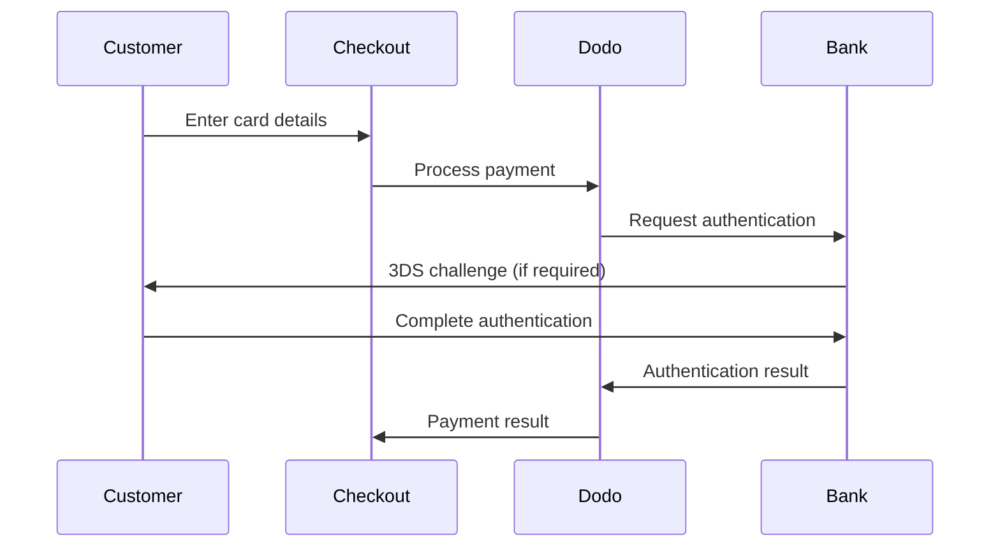

Card payments are the foundation of online payments, accepted globally and trusted by customers worldwide. Dodo Payments supports all major card networks with built-in fraud protection and PCI compliance.

## Supported Card Networks

<CardGroup cols={2}>
<Card title="Global Networks">
- **Visa** — Global leader with 4B+ cards
- **Mastercard** — Global reach, strong security
- **American Express** — Premium cardholders
- **Discover** — US-focused, growing globally
- **JCB** — Leading in Japan, expanding Asia
- **UnionPay** — Dominant in China (8B+ cards)
- **Diners Club** — Premium international
</Card>

<Card title="Regional Networks">
- **Interac** — Canada's debit network
- **Cartes Bancaires** — France's national network
- **Korean Local Cards** — Korean domestic networks
- **Rupay** — India's national network (see <a href="/features/payment-methods/india">India page</a>)
</Card>
</CardGroup>

## Configuration

### API Method Types

Use these values in `allowed_payment_method_types`:

| Type | Description |
| :--- | :---------- |
| `credit` | All credit cards |
| `debit` | All debit cards |

### Example

```javascript
const session = await client.checkoutSessions.create({
  product_cart: [{ product_id: 'prod_123', quantity: 1 }],
  allowed_payment_method_types: ['credit', 'debit'],
  return_url: 'https://example.com/success'
});
```

<Tip>
Include both `credit` and `debit` unless you have a specific reason to exclude one. Debit cards are preferred by many customers and often have lower fees.
</Tip>

## 3D Secure Authentication

3D Secure (3DS) adds an authentication layer that reduces fraud and chargebacks by verifying the cardholder's identity.

### How It Works



### Enabling 3DS

3DS is automatically triggered when:
- Required by the card network
- Required by regional regulations (e.g., PSD2 in Europe)
- The transaction is flagged as high-risk

You can force 3DS on all transactions:

```javascript
const session = await client.checkoutSessions.create({
  product_cart: [{ product_id: 'prod_123', quantity: 1 }],
  force_3ds: true, // Always require 3DS
  return_url: 'https://example.com/success'
});
```

<Note>
Enabling 3DS for all transactions reduces fraud but may slightly decrease conversion as some customers abandon during authentication.
</Note>

## Saved Payment Methods

Customers can save their cards for faster future checkouts. Saved cards are:
- **Tokenized** — Original card numbers never stored
- **PCI Compliant** — Dodo handles all compliance
- **Customer-Scoped** — Cards tied to specific customers

### Enabling Saved Cards

```javascript
const session = await client.checkoutSessions.create({
  product_cart: [{ product_id: 'prod_123', quantity: 1 }],
  show_saved_payment_methods: true, // Show customer's saved cards
  customer: {
    customer_id: 'cus_existing_123'
  },
  return_url: 'https://example.com/success'
});
```

### Using Saved Cards for One-Click Purchases

```javascript
// Get customer's saved payment methods
const methods = await client.customers.getPaymentMethods('cus_123');

// Use saved card for instant checkout
const session = await client.checkoutSessions.create({
  product_cart: [{ product_id: 'prod_123', quantity: 1 }],
  customer: { customer_id: 'cus_123' },
  payment_method_id: methods[0].payment_method_id,
  confirm: true, // Process immediately
  return_url: 'https://example.com/success'
});
```

<Card title="Upsells & Downsells" icon="arrow-up-right-dots" href="/features/upsells-and-downsells">
Learn how to use saved payment methods for one-click upsells and cross-sells.
</Card>

## Testing

Use these test card numbers in test mode:

### Successful Payments

| Region | Brand | Card Number | Expiry | CVV |
| :----- | :---- | :---------- | :----- | :-- |
| US | Visa | `4242424242424242` | 06/32 | 123 |
| US | Mastercard | `5555555555554444` | 06/32 | 123 |
| India | Visa | `4576238912771450` | 06/32 | 123 |
| India | Mastercard | `5409162669381034` | 06/32 | 123 |

### Declined Payments

| Region | Brand | Card Number | Scenario |
| :----- | :---- | :---------- | :------- |
| US | Visa | `4000000000000002` | Generic decline |
| US | Mastercard | `4000000000009995` | Insufficient funds |
| India | Visa | `4706131211212123` | Generic decline |
| India | Mastercard | `5105105105105100` | Generic decline |

<Warning>
Test cards only work in test mode. Never use them for production transactions.
</Warning>

## Security & Compliance

### PCI DSS Compliance
Dodo Payments is PCI DSS Level 1 compliant — the highest level of certification. Your integration never handles raw card data.

### Tokenization
All card details are immediately tokenized. The original card number is never stored in our systems or accessible via API.

### Fraud Prevention
- Real-time fraud scoring
- Address Verification Service (AVS)
- CVV validation
- 3D Secure authentication
- Machine learning risk models

## Best Practices

<AccordionGroup>
<Accordion title="Accept all major networks">
Don't restrict card types unless necessary. Customers expect their preferred card to work.
</Accordion>

<Accordion title="Display card logos">
Show Visa, Mastercard, Amex logos on your checkout to build trust and set expectations.
</Accordion>

<Accordion title="Handle declines gracefully">
Show clear error messages and suggest alternatives. Don't expose raw error codes to customers.
</Accordion>

<Accordion title="Consider saved cards for returning customers">
Enabling saved payment methods can significantly boost conversion for repeat purchases.
</Accordion>

<Accordion title="Monitor chargeback rates">
Track chargebacks by card network. High rates may indicate fraud patterns or unclear billing descriptors.
</Accordion>
</AccordionGroup>

## Troubleshooting

<AccordionGroup>
<Accordion title="Card declined">
**Common causes:**
- Insufficient funds
- Card expired
- Incorrect CVV
- Bank fraud protection triggered
- Card blocked for online purchases

**Solution:** Ask customer to verify details or try a different card. Never expose the specific decline reason.
</Accordion>

<Accordion title="3DS authentication failed">
**Common causes:**
- Customer abandoned authentication
- Bank's 3DS system unavailable
- Timeout during authentication

**Solution:** Retry the payment or ask customer to contact their bank.
</Accordion>

<Accordion title="Card not supported">
**Common causes:**
- Regional card not supported (e.g., local-only cards)
- Prepaid card restrictions
- Corporate card limitations

**Solution:** Customer should try a different card from a major network.
</Accordion>
</AccordionGroup>

## Related Pages

<CardGroup cols={2}>
<Card title="Payment Methods Overview" icon="credit-card" href="/features/payment-methods">
See all supported payment methods.
</Card>

<Card title="Upsells & Downsells" icon="arrow-up-right-dots" href="/features/upsells-and-downsells">
Use saved cards for one-click purchases.
</Card>

<Card title="Testing Process" icon="flask" href="/miscellaneous/testing-process">
Complete testing guide with all test cards.
</Card>

<Card title="Subscriptions" icon="repeat" href="/features/subscription">
Use cards for recurring billing.
</Card>
</CardGroup>