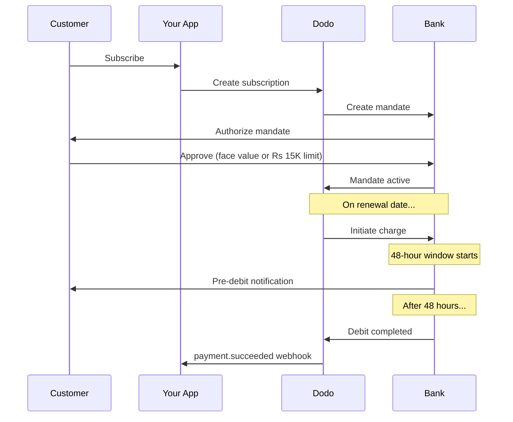

India has unique payment infrastructure dominated by UPI (60%+ of digital transactions) and Rupay cards. Dodo Payments supports both with full RBI compliance for subscription mandates.

## Why India Payment Methods Matter

<CardGroup cols={3}>
<Card title="UPI Dominance" icon="mobile">
UPI processes 10B+ transactions/month. Many Indian customers don't have international cards.
</Card>

<Card title="Low Transaction Costs" icon="indian-rupee-sign">
UPI has near-zero transaction fees. Excellent for high-volume, lower-value transactions.
</Card>

<Card title="Subscription Support" icon="repeat">
Unlike most alternative payment methods, UPI and Rupay support recurring payments via RBI mandates.
</Card>
</CardGroup>

## Supported Methods

| Method | Type | Subscriptions | Min Amount |
| :----- | :--- | :-----------: | :--------- |
| **UPI Collect** | QR code / VPA | Yes* | ₹1 |
| **Rupay Credit** | Card | Yes* | ₹1 |
| **Rupay Debit** | Card | Yes* | ₹1 |

*Subscriptions require RBI-compliant mandates with special processing rules.

## Configuration

### API Method Types

| Type | Description |
| :--- | :---------- |
| `upi_collect` | UPI via QR code or VPA entry |
| `credit` | Credit cards including Rupay |
| `debit` | Debit cards including Rupay |

### Example: India-Focused Checkout

```javascript
const session = await client.checkoutSessions.create({
  product_cart: [{ product_id: 'prod_123', quantity: 1 }],
  allowed_payment_method_types: [
    'upi_collect',
    'credit',
    'debit'
  ],
  billing_currency: 'INR',
  customer: {
    email: 'customer@example.in',
    name: 'Priya Sharma',
    phone_number: '+919876543210'
  },
  billing_address: {
    country: 'IN',
    zipcode: '560001'
  },
  return_url: 'https://example.com/success'
});
```

### Requirements for UPI

For UPI to appear at checkout:
1. **Billing country** must be India (`IN`)
2. **Currency** must be INR
3. For non-Indian merchants: **Adaptive Currency** must be enabled

<Warning>
If you're a non-Indian merchant and Adaptive Currency is not enabled, UPI will not be available to your customers.
</Warning>

## Subscriptions with RBI Mandates

Indian payment method subscriptions operate under RBI (Reserve Bank of India) regulations with unique requirements.

### How RBI Mandates Work



### Mandate Types

| Subscription Amount | Mandate Type | Limit |
| :------------------ | :----------- | :---- |
| **Below Rs 15,000** | On-demand mandate | Rs 15,000 |
| **Rs 15,000 or above** | Fixed-amount mandate | Exact subscription amount |

**Important for plan changes:** If an upgrade results in a charge exceeding the existing mandate limit, the charge will fail and the customer must re-authorize.

### The 48-Hour Processing Delay

This is the most important difference from international card payments:

<Steps>
<Step title="Charge Initiated (Day 0)">
On the scheduled renewal date, Dodo initiates the charge with the bank.
</Step>

<Step title="Pre-Debit Notification">
Customer receives notification from their bank about the upcoming debit.
</Step>

<Step title="48-Hour Window">
Customer can cancel the mandate during this period via their banking app.
</Step>

<Step title="Debit Completed (~48-51 hours)">
After 48 hours (plus up to 3 additional hours for bank processing), funds are debited.
</Step>

<Step title="Webhook Sent">
`payment.succeeded` webhook is sent after actual debit, not at initiation.
</Step>
</Steps>

<Warning>
**Do not grant benefits at charge initiation.** Wait for the `payment.succeeded` webhook, which arrives ~48-51 hours after the scheduled charge date.
</Warning>

### Handling the 48-Hour Window

```javascript
// DON'T do this:
async function handleSubscriptionRenewal(subscription) {
  // ❌ Bad: Granting access immediately when charge is initiated
  grantPremiumAccess(subscription.customer_id);
}

// DO this:
async function handlePaymentWebhook(event) {
  if (event.type === 'payment.succeeded') {
    // ✅ Good: Only grant access after payment is confirmed
    grantPremiumAccess(event.data.customer_id);
  }
  
  if (event.type === 'payment.failed') {
    // Handle failed payment (mandate cancelled, insufficient funds)
    revokePremiumAccess(event.data.customer_id);
  }
}
```

### Webhook Events for Indian Subscriptions

| Event | When | Action |
| :---- | :--- | :----- |
| `subscription.active` | Mandate authorized | Record subscription start |
| `payment.succeeded` | ~48h after charge date | Grant/continue access |
| `payment.failed` | Debit failed | Notify customer, pause access |
| `subscription.on_hold` | Payment failed | Prompt for payment method update |
| `subscription.active` | Reactivated after payment | Restore access |

## Testing

### UPI Test IDs

| Status | UPI ID |
| :----- | :----- |
| Success | `success@upi` |
| Failure | `failure@upi` |

### Indian Card Test Numbers

| Brand | Scenario | Card Number | Expiry | CVV |
| :---- | :------- | :---------- | :----- | :-- |
| Visa | Success | `4576238912771450` | 06/32 | 123 |
| Visa | Declined | `4706131211212123` | 06/32 | 123 |
| Mastercard | Success | `5409162669381034` | 06/32 | 123 |
| Mastercard | Declined | `5105105105105100` | 06/32 | 123 |

## Best Practices

<AccordionGroup>
<Accordion title="Plan for the 48-hour delay">
Build your application to handle the gap between charge initiation and actual payment. Consider:
- Grace periods for subscription access
- Clear communication to customers about processing time
- Webhook-driven fulfillment, not date-driven
</Accordion>

<Accordion title="Handle mandate cancellations">
Customers can cancel mandates via their bank apps at any time. Monitor `subscription.on_hold` webhooks and prompt customers to re-subscribe or update payment methods.
</Accordion>

<Accordion title="Set appropriate mandate amounts">
For variable pricing (e.g., usage-based), consider whether a Rs 15,000 on-demand mandate is sufficient. If charges might exceed this, customers will need to re-authorize.
</Accordion>

<Accordion title="Offer UPI prominently">
For Indian customers, UPI should be the primary payment option. Many users prefer it over cards due to familiarity and lower friction.
</Accordion>
</AccordionGroup>

## Troubleshooting

<AccordionGroup>
<Accordion title="UPI not appearing at checkout">
**Check:**
1. Billing country set to `IN`?
2. Currency set to `INR`?
3. If non-Indian merchant: Adaptive Currency enabled?
4. `upi_collect` included in `allowed_payment_method_types`?

**Solution:** Verify billing address has `country: "IN"` and `billing_currency: "INR"`.
</Accordion>

<Accordion title="Subscription charge failed after upgrade">
**Cause:** New charge amount exceeds existing mandate limit (Rs 15,000 threshold).

**Solution:** Customer must update payment method to establish a new mandate with the correct limit.
</Accordion>

<Accordion title="Subscription on hold but customer claims they didn't cancel">
**Cause:** Customer may have cancelled the mandate during the 48-hour window, or their bank declined the debit.

**Solution:** Customer needs to re-authorize the mandate or update their payment method.
</Accordion>

<Accordion title="Payment deduction delayed beyond 48 hours">
**Cause:** Bank API delays can extend processing by 2-3 additional hours.

**Solution:** This is expected. Build your system to handle variable delays up to ~51 hours total.
</Accordion>

<Accordion title="Mandate cancelled but subscription still active">
**Cause:** Edge case in RBI regulations — mandate cancellation during processing window doesn't immediately cancel subscription.

**Solution:** The next charge will fail and subscription will move to `on_hold`. Monitor webhooks for `payment.failed`.
</Accordion>
</AccordionGroup>

## Related Pages

<CardGroup cols={2}>
<Card title="Payment Methods Overview" icon="credit-card" href="/features/payment-methods">
See all supported payment methods.
</Card>

<Card title="Subscriptions" icon="repeat" href="/features/subscription">
Complete subscription documentation including RBI mandates.
</Card>

<Card title="Webhooks" icon="webhook" href="/developer-resources/webhooks">
Webhook handling for payment events.
</Card>

<Card title="Testing Process" icon="flask" href="/miscellaneous/testing-process">
All test data including UPI IDs and Indian cards.
</Card>
</CardGroup>