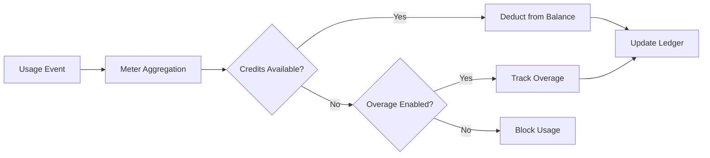

<Info>
Meters convert raw events into billable quantities. They filter events and apply aggregation functions (Count, Sum, Max, Last) to calculate usage per customer.
</Info>

<Frame>

</Frame>

## API Resources

<AccordionGroup>
<Accordion title="View Meter API References">
<CardGroup cols={2}>
<Card title="Create Meter" icon="plus" href="/api-reference/meters/create-meter">
Create meters programmatically via API.
</Card>

<Card title="List Meters" icon="list" href="/api-reference/meters/get-meters">
Retrieve all meters in your account.
</Card>

<Card title="Get Meter" icon="eye" href="/api-reference/meters/retrieve-meter">
Fetch details for a specific meter by ID.
</Card>

<Card title="Archive Meter" icon="arrow-rotate-right" href="/api-reference/meters/archive-meter">
Archive a meter to stop tracking usage.
</Card>

<Card title="Unarchive Meter" icon="arrow-rotate-left" href="/api-reference/meters/unarchive-meter">
Restore an archived meter to resume tracking.
</Card>
</CardGroup>
</Accordion>
</AccordionGroup>

## Creating a Meter

<Steps>
<Step title="Basic Information">
<ParamField path="Meter Name" type="string" required>
Descriptive name (e.g., "API Requests", "Token Usage")
</ParamField>

<ParamField path="Event Name" type="string" required>
Exact event name to match (case-sensitive). Examples: `api.call`, `image.generated`
</ParamField>
</Step>

<Step title="Aggregation">
<ParamField path="Aggregation Type" type="string" required>
Choose how events are aggregated:

- **Count**: Total number of events (API calls, uploads)
- **Sum**: Add numeric values (tokens, bytes)
- **Max**: Highest value in period (peak users)
- **Last**: Most recent value
</ParamField>

<ParamField path="Over Property" type="string">
Metadata key to aggregate (required for all types except Count). Examples: `tokens`, `bytes`, `duration_ms`
</ParamField>

<ParamField path="Measurement Unit" type="string" required>
Unit label for invoices. Examples: `calls`, `tokens`, `GB`, `hours`
</ParamField>
</Step>

<Step title="Filtering (Optional)">
<Frame>

</Frame>

Add conditions to filter which events are counted:
- **AND logic**: All conditions must match
- **OR logic**: Any condition can match

**Comparators**: equals, not equals, greater than, less than, contains

Enable filtering, choose logic, add conditions with property key, comparator, and value.
</Step>

<Step title="Create">
Review configuration and click **Create Meter**.
</Step>
</Steps>

## Viewing Analytics

<Frame>

</Frame>

Your meter dashboard shows:
- **Overview**: Total usage and usage chart
- **Events**: Individual events received
- **Customers**: Per-customer usage and charges

## Billing in Credits Instead of Currency

By default, meters charge customers per-unit in dollars (or your configured currency). You can instead configure a meter to **deduct from a credit balance** — so usage consumes credits rather than generating a monetary charge.

<Info>
Credit-based deduction requires a [Credit Entitlement](/features/credit-based-billing) attached to the same product. Create your credit first, then link it to the meter.
</Info>

### When to Use Credit-Based Deduction

| Scenario | Standard (currency) | Credit-based |
|----------|-------------------|--------------|
| Simple per-unit pricing ($0.01/call) | ✅ Best fit | Unnecessary overhead |
| Prepaid credit packs (buy 10K tokens, use over time) | ❌ Can't express | ✅ Best fit |
| Bundled usage with subscriptions (Pro plan includes 100K calls) | Possible via free threshold | ✅ Better — credits roll over, expire, show in portal |
| Multi-meter products sharing a credit pool | ❌ Each meter bills separately | ✅ All meters deduct from one balance |

### Configuring a Meter to Deduct Credits

<Steps>
<Step title="Create a Credit Entitlement">
First, create a credit in **Products → Credits**. Define the unit (e.g., "API Calls", "Tokens"), precision, and lifecycle settings (expiry, rollover, overage).

See the [Credit-Based Billing guide](/features/credit-based-billing) for detailed instructions.
</Step>

<Step title="Create or Edit a Usage-Based Product">
Go to your usage-based product and open the **Meter** configuration section.
</Step>

<Step title="Add a Meter">
Click the **+** button to attach a meter. Configure the event name, aggregation type, and measurement unit as usual.
</Step>

<Step title="Enable 'Bill Usage in Credits'">
Toggle **Bill usage in Credits** on the meter configuration. This reveals the credit settings:

<Frame caption="Toggle 'Bill usage in Credits' to switch from currency-based to credit-based deduction.">

</Frame>

<ParamField path="Credit Entitlement" type="string" required>
Select which credit entitlement this meter should deduct from.
</ParamField>

<ParamField path="Meter units per credit" type="number" required>
The number of usage units required to deduct 1 credit. For example:
- `1` = each meter event deducts 1 credit
- `100` = 100 meter events deduct 1 credit
- `1000` = 1,000 API calls consume 1 credit
</ParamField>
</Step>

<Step title="Set the Free Threshold">
The **Free Threshold** still applies — events below this threshold don't deduct credits.

**Example**: With a free threshold of 1,000 and meter-units-per-credit of 1:
- Customer uses 2,500 API calls
- First 1,000 are free
- Remaining 1,500 deduct 1,500 credits from their balance
</Step>
</Steps>

### How Credit Deduction Works

Once configured, the deduction pipeline runs automatically:

1. **Events arrive** — Your application sends usage events via the [Event Ingestion API](/features/usage-based-billing/event-ingestion)
2. **Meter aggregates** — Events are aggregated per your meter configuration (Count, Sum, Max, Last)
3. **Background worker processes** — Every minute, a worker fetches new events since the last checkpoint
4. **Credits are deducted** — Aggregated usage is converted to credits using the `meter_units_per_credit` rate and deducted using **FIFO ordering** (oldest grants consumed first)
5. **Overage tracked** — If the balance hits zero and overage is enabled, usage continues and overage is recorded for end-of-cycle billing

<Warning>
Credit deduction runs asynchronously (every ~1 minute). There may be a brief delay between event ingestion and balance deduction. Design your application to handle this delay — don't rely on real-time balance checks for access control on individual requests.
</Warning>

### Multiple Meters, One Credit Pool

You can link multiple meters on the same product to the **same credit entitlement**. All meters deduct from one shared balance.

**Example**: An AI platform with two meters:
- `text.generation` — 1 credit per 1,000 tokens
- `image.generation` — 10 credits per image

Both deduct from the same "AI Credits" pool. The customer sees a single unified balance in their portal.

<Tip>
Use different `meter_units_per_credit` rates across meters to express relative costs. Expensive operations (image generation) cost fewer meter units per credit than cheap ones (text completion).
</Tip>

## Troubleshooting

<AccordionGroup>
<Accordion title="Events not appearing">
- Event name must match exactly (case-sensitive)
- Check meter filters aren't excluding events
- Verify customer IDs exist
- Temporarily disable filters to test
</Accordion>

<Accordion title="Aggregation not working">
- Verify Over Property matches metadata key exactly
- Use numbers, not strings: `tokens: 150` not `"150"`
- Include required properties in all events
</Accordion>

<Accordion title="Filters not working">
- Match case exactly
- Use correct operators for data type
- Ensure events include filtered properties
</Accordion>

<Accordion title="Wrong usage totals">
- Check Events tab to count actual events received
- Verify aggregation type (Count vs Sum)
- Ensure values are numeric for Sum/Max
</Accordion>
</AccordionGroup>

## Next Steps

<CardGroup cols={2}>

<Card title="Send Events" icon="bolt" href="/features/usage-based-billing/event-ingestion">
Start sending usage events from your application to your meters.
</Card>

<Card title="View Blueprints" icon="copy" href="/features/usage-based-billing/ingestion-blueprints">
Use ready-made meter configurations for common use cases.
</Card>
</CardGroup>

