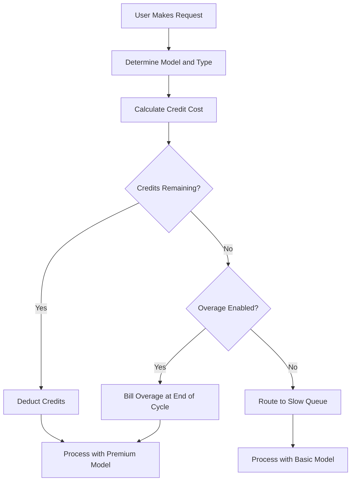

## Comment Cursor facture

Cursor utilise un modèle hybride qui combine un abonnement mensuel avec une réserve de crédits dégressifs. Cette approche offre un prix prévisible pour les utilisateurs tout en gérant les coûts variables des différents modèles d'IA.

**Niveaux de tarification** : Cursor propose des niveaux allant de Hobby à Ultra, équilibrant l'accès premium et standard pour s'adapter à différents flux de travail.

| Forfait | Tarif | Requêtes premium | Requêtes lentes |
| :--- | :--- | :--- | :--- |
| Hobby | Gratuit | 50/mois | Illimité |
| Pro | \$20/mois | 500/mois | Illimité |
| Pro+ | \$60/mois | Premium illimité | - |
| Ultra | \$200/mois | Premium illimité | - |

**Déplétion pondérée selon le modèle** : Différentes requêtes consomment différentes quantités de crédits en fonction du coût du modèle sous-jacent. Cela permet à Cursor d'offrir un abonnement unique couvrant plusieurs fournisseurs tout en tenant compte des opérations coûteuses.

| Type de requête | Modèle | Coût en crédits |
| :--- | :--- | :--- |
| Tab Completion | Default | 0 |
| Chat | GPT-4o Mini | 1 |
| Chat | Claude 3.5 Sonnet | 1 |
| Composer | GPT-4o | 5 |
| Agent | Claude 3.5 Sonnet | 10 |
| Agent | o1-preview | 25 |

**Épuisement des crédits et dépassements** : lorsque les crédits sont épuisés, les utilisateurs passent dans une file d'attente « lente » avec des modèles moins coûteux au lieu d'être coupés. Alternativement, ils peuvent activer des dépassements basés sur l’usage pour conserver l'accès premium à un coût fixe par requête.



4. **Enterprise et Business** : Les équipes utilisent une consommation mutualisée où toute l'organisation partage un seul bucket de crédits. Cela simplifie la gestion et garantit que les gros consommateurs n'atteignent pas les limites individuelles pendant que d'autres ont de la capacité inutilisée.

## Ce qui le rend unique

Le modèle de Cursor équilibre l'expérience utilisateur et les coûts d'infrastructure en résolvant des problèmes que les modèles de facturation SaaS traditionnels peinent à gérer.
- **Abstraction des fournisseurs** : Un seul abonnement englobe plusieurs fournisseurs de LLM comme OpenAI et Anthropic, gérant en coulisses la tarification complexe et les clés API.
- **Déplétion pondérée** : Les coûts correspondent à la valeur en facturant davantage les modèles puissants, rendant la tarification juste et transparente pour tous les utilisateurs.
- **Dégradation progressive** : La file d'attente « lente » évite les coupures brutales, gardant les utilisateurs dans le produit et les incitant à passer à un niveau supérieur sans pénalité.
- **Crédits mutualisés** : Les buckets au niveau équipe réduisent les frictions pour les clients enterprise en permettant un partage efficace des ressources au sein de l'organisation.

## Recréez cela avec Dodo Payments

Vous pouvez reproduire ce modèle exact en utilisant les droits de crédit et la facturation basée sur l’usage de Dodo Payments. Les étapes suivantes vous guideront dans la mise en œuvre.

<Steps>
  <Step title="Create a Custom Unit Credit Entitlement">
    Définissez d'abord le système de crédits dans le tableau de bord Dodo. Ce droit représentera les « Requêtes premium » que les utilisateurs obtiennent avec leur abonnement.

    *   **Type de crédit :** Unité personnalisée
    *   **Nom de l’unité :** « Requêtes premium »
    *   **Précision :** 0 (car vous ne pouvez pas utiliser une demi-requête)
    *   **Expiration des crédits :** 30 jours (cela garantit que les crédits se réinitialisent à chaque cycle de facturation)
    *   **Report :** Désactivé (les requêtes non utilisées ne sont pas reportées au mois suivant)
    *   **Dépassement :** Activé
    *   **Prix par unité :** 0,04 $ (le coût de chaque requête une fois le pool initial épuisé)
    *   **Comportement des dépassements :** Facturer les dépassements lors de la facturation (cela ajoute le coût de dépassement à la facture suivante)

    Cette configuration garantit que les utilisateurs disposent d'un nombre fixe de requêtes chaque mois, avec la possibilité d'en payer davantage si nécessaire. C'est la base du modèle de facturation hybride.
  </Step>

  <Step title="Create Subscription Products">
    Créez des produits distincts pour chaque niveau. Associez le même droit de crédit à chaque produit, mais avec des montants différents. Cela vous permet de gérer tous les niveaux avec un seul système de crédits, facilitant la montée en gamme ou la rétrogradation des utilisateurs.

    *   **Hobby :** 0 $/mois, 50 crédits/cycle
    *   **Pro :** 20 $/mois, 500 crédits/cycle
    *   **Pro+ :** 60 $/mois, 5000 crédits/cycle (effectivement illimité pour la plupart)
    *   **Ultra :** 200 $/mois, 50000 crédits/cycle (effectivement illimité)

    Lorsqu'un utilisateur s'abonne à l'un de ces produits, Dodo attribue automatiquement le nombre de crédits correspondant à son compte. Cela se produit instantanément, offrant une expérience d'accueil fluide.
  </Step>

  <Step title="Create a Usage Meter Linked to Credits">
    Créez un compteur nommé `ai.request` avec une agrégation **Sum** sur la propriété `credit_cost`. Reliez ce compteur à votre droit de crédit en activant l'interrupteur « Bill usage in Credits ». Réglez l'unité du compteur par crédit à 1.

    Pour gérer la déplétion pondérée par modèle, vous gérerez le coût en crédits au niveau de l’application. Lorsqu'un utilisateur effectue une requête, votre application détermine le coût en fonction du modèle ou du type d'action.

    ```typescript
    import DodoPayments from 'dodopayments';
    
    /**
     * Determines the credit cost for a given request type and model.
     * This logic lives in your application and can be updated without
     * changing your billing configuration.
     */
    function getCreditCost(requestType: string, model: string): number {
      const costs: Record<string, Record<string, number>> = {
        'tab_completion': { 'default': 0 },
        'chat': { 'gpt-4o-mini': 1, 'gpt-4o': 1, 'claude-sonnet': 1 },
        'composer': { 'gpt-4o-mini': 2, 'gpt-4o': 5, 'claude-sonnet': 5 },
        'agent': { 'gpt-4o': 10, 'claude-sonnet': 10, 'o1': 25 }
      };
      
      // Default to 1 credit if the combination isn't found
      return costs[requestType]?.[model] ?? 1;
    }
    
    /**
     * Ingests usage events into Dodo Payments.
     * For weighted requests, we send multiple events or use a sum aggregation.
     */
    async function trackRequest(customerId: string, requestType: string, model: string) {
      const creditCost = getCreditCost(requestType, model);
      
      // Tab completions are free, so we don't need to track them for billing
      if (creditCost === 0) return;
      
      const client = new DodoPayments({
        bearerToken: process.env.DODO_PAYMENTS_API_KEY,
      });
      
      await client.usageEvents.ingest({
        events: [{
          event_id: `req_${Date.now()}_${Math.random().toString(36).slice(2)}`,
          customer_id: customerId,
          event_name: 'ai.request',
          timestamp: new Date().toISOString(),
          metadata: {
            request_type: requestType,
            model: model,
            credit_cost: creditCost
          }
        }]
      });
    }
    ```

    <Tip>
      Si vous souhaitez utiliser un seul événement pour les requêtes pondérées, définissez l'agrégation de votre compteur sur **Sum** et utilisez une propriété comme `credit_cost` comme valeur à sommer. Cela est souvent plus efficace pour une ingestion à fort volume et simplifie la logique de votre application.
    </Tip>
  </Step>

  <Step title="Handle Credit Exhaustion (Slow Queue)">
    Écoutez le webhook `credit.balance_low` de Dodo. Lorsqu'un utilisateur a ses crédits presque à zéro, vous pouvez le basculer vers une file d'attente lente dans votre application. C'est là que vous implémentez la logique de « dégradation progressive ».

    ```typescript
    import DodoPayments from 'dodopayments';
    import express from 'express';
    
    const app = express();
    app.use(express.raw({ type: 'application/json' }));
    
    const client = new DodoPayments({
      bearerToken: process.env.DODO_PAYMENTS_API_KEY,
      webhookKey: process.env.DODO_PAYMENTS_WEBHOOK_KEY,
    });
    
    app.post('/webhooks/dodo', async (req, res) => {
      try {
        const event = client.webhooks.unwrap(req.body.toString(), {
          headers: {
            'webhook-id': req.headers['webhook-id'] as string,
            'webhook-signature': req.headers['webhook-signature'] as string,
            'webhook-timestamp': req.headers['webhook-timestamp'] as string,
          },
        });
        
        if (event.type === 'credit.balance_low') {
          const customerId = event.data.customer_id;
          await updateUserTier(customerId, 'slow');
          await notifyUser(customerId, 'You have used most of your premium requests. Switching to standard models.');
        }
        
        res.json({ received: true });
      } catch (error) {
        res.status(401).json({ error: 'Invalid signature' });
      }
    });
    
    /**
     * Routes a request based on the user's current tier.
     * This function is called before every AI request to determine the model and queue.
     */
    async function routeRequest(customerId: string, requestType: string) {
      const tier = await getUserTier(customerId);
      
      if (tier === 'slow') {
        // Route to a cheaper model and a lower priority queue
        // This saves costs while keeping the user active in the product
        return { model: 'gpt-4o-mini', queue: 'standard' };
      }
      
      // Premium routing for users with remaining credits
      // This provides the best possible performance and model quality
      return { model: 'claude-sonnet', queue: 'priority' };
    }
    ```

  </Step>

  <Step title="Create Checkout">
    Enfin, générez une session de paiement pour que l'utilisateur s'abonne à un plan. Dodo gère automatiquement le traitement du paiement, la conformité fiscale et l’attribution des crédits.

    ```typescript
    import DodoPayments from 'dodopayments';
    
    const client = new DodoPayments({
      bearerToken: process.env.DODO_PAYMENTS_API_KEY,
    });
    
    /**
     * Creates a checkout session for a new subscription.
     * This is typically called when a user clicks an "Upgrade" button.
     */
    const session = await client.checkoutSessions.create({
      product_cart: [
        { product_id: 'prod_cursor_pro', quantity: 1 }
      ],
      customer: { email: 'developer@example.com' },
      return_url: 'https://yourapp.com/dashboard'
    });
    ```

  </Step>
</Steps>

## Accélérez avec le blueprint d'ingestion LLM

La facturation pondérée par les crédits ci-dessus gère votre monétisation de base. Pour des analyses plus approfondies sur la consommation réelle de tokens par fournisseur, le [LLM Ingestion Blueprint](/developer-resources/ingestion-blueprints/llm) peut fonctionner en parallèle de votre système de crédits.

```bash
npm install @dodopayments/ingestion-blueprints
```

```typescript
import { createLLMTracker } from '@dodopayments/ingestion-blueprints';
import OpenAI from 'openai';
import Anthropic from '@anthropic-ai/sdk';

// Track raw token usage for analytics alongside credit-weighted billing
const openaiTracker = createLLMTracker({
  apiKey: process.env.DODO_PAYMENTS_API_KEY,
  environment: 'live_mode',
  eventName: 'analytics.openai_tokens',
});

const anthropicTracker = createLLMTracker({
  apiKey: process.env.DODO_PAYMENTS_API_KEY,
  environment: 'live_mode',
  eventName: 'analytics.anthropic_tokens',
});

const openai = new OpenAI({ apiKey: process.env.OPENAI_API_KEY });
const anthropic = new Anthropic({ apiKey: process.env.ANTHROPIC_API_KEY });

// Wrap each provider separately
const trackedOpenAI = openaiTracker.wrap({ client: openai, customerId: 'customer_123' });
const trackedAnthropic = anthropicTracker.wrap({ client: anthropic, customerId: 'customer_123' });

// Token tracking is automatic, credit deduction still uses your weighted system
const response = await trackedOpenAI.chat.completions.create({
  model: 'gpt-4o',
  messages: [{ role: 'user', content: 'Hello!' }],
});
```

Cela vous offre deux couches de données : une facturation pondérée par crédits pour la monétisation et des comptes de tokens bruts pour l'analyse des coûts et le suivi des marges.

<Tip>
Le blueprint LLM prend en charge OpenAI, Anthropic, Groq, Google Gemini, et plus encore. Consultez la [documentation complète du blueprint](/developer-resources/ingestion-blueprints/llm) pour connaître tous les fournisseurs pris en charge.
</Tip>

## Crédits mutualisés pour les équipes (Enterprise)

Les plans Business et Enterprise de Cursor mutualisent les crédits au sein d'une équipe. Vous pouvez l'implémenter avec Dodo en créant un seul abonnement pour l’organisation plutôt que pour des utilisateurs individuels. Cela garantit que l’usage de l’équipe est consolidé et géré comme une seule entité, ce qui est une exigence majeure pour les clients de grande taille.

### Stratégie de mise en œuvre

1.  **Client au niveau organisationnel :** Créez un seul `customer_id` dans Dodo pour l’ensemble de l’organisation. Ce client représente l'entité facturante de l'équipe et détient le pool de crédits partagé. Toutes les factures et attributions de crédits sont liées à cet ID.
2.  **Facturation par siège :** Utilisez les modules complémentaires de Dodo pour facturer un frais par utilisateur. Lorsqu’une équipe ajoute un nouveau membre, vous mettez à jour la quantité de l’add-on « Seat ». Cela garantit que vos revenus évoluent avec le nombre d’utilisateurs tout en gardant le pool de crédits séparé. C’est une manière propre de gérer une facturation multidimensionnelle.
3.  **Suivi de l’usage partagé :** Toutes les requêtes des membres de l'équipe sont ingestées en utilisant l'`customer_id` de l'organisation. Cela garantit que chaque requête de n'importe quel membre dégrade le même pool de crédits central. Vous pouvez toujours suivre l’usage individuel en incluant un `user_id` dans les métadonnées de l’événement pour les rapports internes et l’analytique.

Cette approche vous offre le meilleur des deux mondes : un frais prédictible par utilisateur pour la plateforme et un pool de crédits partagé pour les ressources d’IA coûteuses. Elle simplifie également l’expérience utilisateur pour les membres de l’équipe, car ils n’ont pas à gérer leurs propres limites individuelles.

## Comparaison avec la facturation SaaS traditionnelle

La facturation SaaS traditionnelle repose généralement sur des niveaux à tarif fixe (par ex., 10 $/mois pour 100 unités). Si un utilisateur a besoin de 101 unités, il doit souvent passer à un niveau à 50 $/mois. Cela crée des effets de « falaise » qui peuvent frustrer les utilisateurs et provoquer des désabonnements. Cela ne tient également pas compte du coût variable des différents types d’usage, ce qui est critique dans l’univers de l’IA.

Le modèle de Cursor, propulsé par Dodo, est bien plus flexible et juste :

- **Pas d'effets de « falaise » :** Les utilisateurs n'ont pas à passer à un niveau supérieur simplement parce qu'ils ont atteint une limite. Ils peuvent payer des dépassements ou accepter des performances plus lentes. Cela les maintient dans le produit et réduit les frictions, conduisant à une satisfaction client plus élevée et à un taux de désabonnement plus faible.
- **Alignement des coûts :** Vos revenus évoluent directement avec vos coûts d'infrastructure. Si un utilisateur utilise des modèles coûteux, il paye plus (via les crédits ou les dépassements). Cela protège vos marges et vous permet d'offrir durablement des fonctionnalités à fort coût sans mettre en péril votre modèle économique.
- **Meilleure rétention :** En ne coupant pas les utilisateurs, vous les gardez engagés avec votre produit même lorsqu'ils ont atteint leur limite. Ils peuvent continuer à travailler, ce qui renforce la fidélité sur le long terme et augmente la valeur vie client. C’est gagnant-gagnant pour l’utilisateur et le fournisseur.

## Gérer les mises à jour et l’évolution des modèles

L'un des défis de la facturation IA est que les modèles sont constamment mis à jour ou remplacés. De nouveaux modèles peuvent avoir des structures de coût ou des caractéristiques de performance différentes. Avec le système de crédits de Dodo, vous pouvez gérer cela élégamment au niveau de l'application sans avoir besoin de migrer vos données de facturation.

Si vous introduisez un nouveau modèle plus coûteux, il vous suffit de mettre à jour votre fonction `getCreditCost` pour lui attribuer un coût plus élevé. Vous n'avez pas besoin de modifier votre configuration de facturation ni de mettre à jour les abonnements existants. Ce découplage entre la facturation et la logique applicative est un avantage majeur, car il vous permet d’itérer sur votre produit à la vitesse de l’IA sans être contraint par votre système de facturation.

## Notifications utilisateur et transparence

Pour offrir une excellente expérience utilisateur, il est important de tenir les utilisateurs informés de leur consommation de crédits. La transparence instaure la confiance et aide les utilisateurs à gérer efficacement leurs coûts. Vous pouvez utiliser les webhooks de Dodo pour déclencher des notifications à différents seuils (par ex., 50 %, 80 % et 100 % d’utilisation).

Ces notifications peuvent être envoyées par e-mail, alertes in-app ou messages Slack. En fournissant un retour en temps réel sur la consommation, vous incitez les utilisateurs à gérer leur consommation ou à passer à un plan supérieur avant d'atteindre la « file d'attente lente ». Cette approche proactive réduit les tickets de support et améliore l'expérience globale, donnant à votre produit une dimension plus professionnelle et centrée sur l’utilisateur.

## Sécurité et prévention de la fraude

Lors de la mise en œuvre d’un système basé sur les crédits, il est important de penser à la sécurité et à la prévention de la fraude. Les crédits ayant une valeur monétaire directe, ils peuvent être la cible d’abus.

- **Idempotence :** Utilisez toujours des `event_id` uniques lorsque vous ingestiez des événements d’usage pour éviter les doubles comptages. L’API d’ingestion de Dodo gère l’idempotence automatiquement si vous fournissez un ID unique, garantissant qu’une nouvelle tentative réseau ne facture pas deux fois l’utilisateur.
- **Limitation de débit :** Mettez en place une limitation de débit au niveau de l’application pour empêcher un seul utilisateur d’épuiser trop rapidement ses crédits (ou votre budget API). Cela protège votre infrastructure et le portefeuille de l’utilisateur.
- **Surveillance :** Surveillez les schémas d’usage pour détecter des anomalies pouvant indiquer un partage de compte ou un abus automatisé. Les analyses de Dodo peuvent vous aider à identifier ces schémas, vous permettant d’agir avant qu’ils ne deviennent un problème majeur.

## Bonnes pratiques pour les systèmes de crédits

Lors de la construction d’un système de facturation basé sur les crédits, gardez à l’esprit ces bonnes pratiques :

1.  **Restez simple :** Ne rendez pas votre système de crédits trop complexe. Les utilisateurs doivent pouvoir comprendre facilement combien coûte une requête et combien de crédits il leur reste.
2.  **Apportez de la valeur :** Assurez-vous que les crédits offrent une vraie valeur à l’utilisateur. Si le coût d’une requête est trop élevé, les utilisateurs auront l’impression de se faire arnaquer.
3.  **Soyez transparent :** Affichez toujours à l’utilisateur son solde actuel et l’historique d’usage des crédits. Cela instaure la confiance et réduit la confusion.
4.  **Automatisez tout :** Utilisez les webhooks et API de Dodo pour automatiser autant que possible le processus de facturation. Cela réduit le travail manuel et garantit que votre facturation est toujours précise.

## Fonctionnalités clés de Dodo utilisées

<CardGroup cols={2}>
  <Card title="Credit-Based Billing" icon="coins" href="/features/credit-based-billing">
    Gérez des pools de crédits dégressifs et les dépassements avec des unités personnalisées.
  </Card>
  <Card title="Subscriptions" icon="calendar" href="/features/subscription">
    Configurez la facturation récurrente pour différents niveaux avec des crédits intégrés.
  </Card>
  <Card title="Usage-Based Billing" icon="chart-line" href="/features/usage-based-billing/introduction">
    Suivez les événements et facturez en temps réel selon la consommation.
  </Card>
  <Card title="Event Ingestion" icon="bolt" href="/features/usage-based-billing/event-ingestion">
    Envoyez des données d’usage à fort volume à Dodo avec une faible latence.
  </Card>
  <Card title="Webhooks" icon="webhook" href="/developer-resources/webhooks/intents/credit">
    Réagissez aux changements de solde de crédits et automatisez le classement des utilisateurs par niveau.
  </Card>
  <Card title="LLM Ingestion Blueprint" icon="brain-circuit" href="/developer-resources/ingestion-blueprints/llm">
    Suivi automatique des tokens sur plusieurs fournisseurs de LLM.
  </Card>
</CardGroup>
