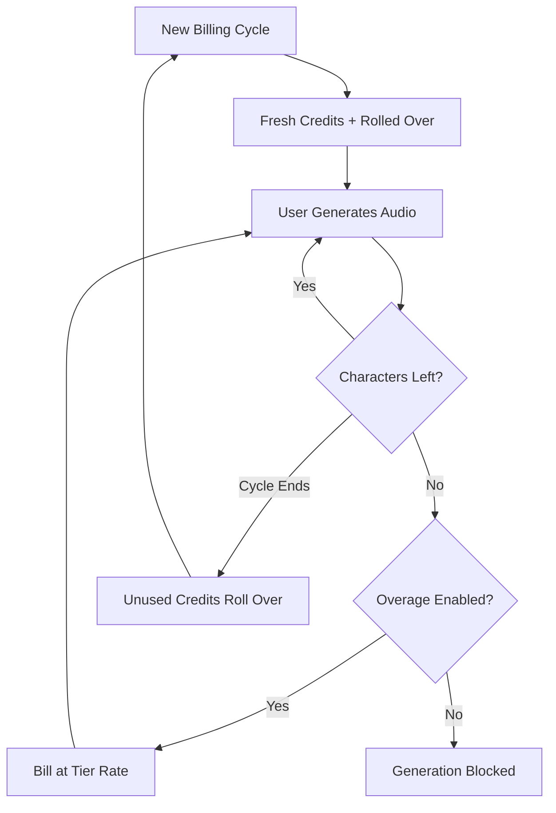

ElevenLabs s’est imposé comme un acteur dominant dans le domaine de la voix IA en rendant leur facturation aussi fluide que leur synthèse vocale. Leur modèle repose sur une seule unité de valeur : le caractère. Que vous génériez de la synthèse vocale, cloniez une voix ou doubliez une vidéo, vous utilisez un pool unifié de crédits de caractères.

## Comment ElevenLabs facture

La structure tarifaire d’ElevenLabs utilise des quotas mensuels fixes liés aux niveaux d’abonnement. À mesure que les utilisateurs passent aux niveaux supérieurs, ils obtiennent plus de caractères et accèdent à des fonctionnalités avancées comme le clonage vocal professionnel ou les droits commerciaux.

| Plan | Prix | Caractères/mois | Tarif de dépassement |
| :--- | :--- | :--- | :--- |
| Gratuit | \$0 | 10 000 | Non disponible |
| Starter | \$5/mois | 30 000 | ~\$0.30/1K caractères |
| Creator | \$22/mois | 100 000 | ~\$0.24/1K caractères |
| Pro | \$99/mois | 500 000 | ~\$0.15/1K caractères |
| Scale | \$330/mois | 2 000 000 | ~\$0.10/1K caractères |

1. **Tarification basée sur les caractères** : les caractères sont la monnaie universelle sur la plateforme. Synthèse vocale, doublage et clonage de voix utilisent tous ce même solde, simplifiant le suivi de consommation.
2. **Mécanismes de report** : les caractères non utilisés sont reportés sur le cycle de facturation suivant au lieu d’expirer. ElevenLabs applique un plafond pour éviter une accumulation infinie, garantissant que les utilisateurs conservent la valeur de leur abonnement.
3. **Dépassements par paliers** : les dépassements sont gérés en fonction du niveau d’abonnement. Les plans inférieurs ont les dépassements désactivés par défaut pour plus de sécurité, tandis que les niveaux supérieurs permettent des prélèvements optionnels afin de maintenir la continuité du service.

## Ce qui le rend unique

Plusieurs choix stratégiques rendent le modèle de facturation d’ElevenLabs particulièrement efficace pour fidéliser les utilisateurs et encourager les montées en gamme.

- **Report des caractères** : les crédits reportés réduisent l’angoisse du « l’utiliser ou le perdre » en transférant les investissements inutilisés. Cela préserve la valeur de l’abonnement même lors de périodes d’activité réduite.
- **Tarification par paliers pour les dépassements** : les tarifs de dépassement diminuent à mesure que la taille du plan augmente, créant un fort incitatif à monter en gamme. Les utilisateurs trouvent souvent les niveaux supérieurs plus attractifs en raison du coût réduit d’utilisation supplémentaire.
- **Consommation unifiée** : un seul pool de caractères pour tous les services élimine la charge cognitive de devoir gérer plusieurs quotas. Les utilisateurs n’ont à suivre qu’un seul chiffre pour comprendre leur capacité restante.
- **Dépassements optionnels** : les utilisateurs professionnels peuvent activer les dépassements pour préserver la continuité, tandis que les utilisateurs occasionnels bénéficient de la sécurité d’un plafond strict.



## Reproduire cela avec Dodo Payments

Vous pouvez reproduire ce modèle sophistiqué en utilisant la facturation par crédits et la mesure d’usage de Dodo Payments.

<Steps>
<Step title="Create a Custom Unit Credit Entitlement">
Commencez par définir l’unité « Caractères » qui servira de monnaie sur votre plateforme.

1. Allez dans **Droits** (Entitlements) sur votre tableau de bord Dodo.
2. Créez un nouveau **Droit au crédit**.
3. Réglez le **Type de crédit** sur **Unité personnalisée**.
4. Nommez l’unité « Caractères ».
5. Définissez la **Précision** à 0, car les caractères sont toujours des unités entières.
6. Définissez la **Durée de validité du crédit** à 30 jours pour correspondre au cycle de facturation mensuel.
7. Activez le **Report** avec ces paramètres :
    - **Pourcentage maximal de report** : 100 % (permet à tous les caractères inutilisés d’être reportés).
    - **Période de report** : 1 mois.
    - **Nombre maximal de reports** : 1 (les crédits peuvent être reportés une fois, puis ils expirent).
</Step>

<Step title="Create Tiered Subscription Products">
Créez cinq produits d’abonnement. Vous attacherez le même droit « Caractères » à chacun, mais avec des configurations propres à chaque palier.

| Produit | Prix | Crédits/cycle | Dépassement activé | Prix de dépassement (par 1K caractères) |
| :--- | :--- | :--- | :--- | :--- |
| Gratuit | \$0/mois | 10 000 | Non | - |
| Starter | \$5/mois | 30 000 | Oui (optionnel) | \$0.30 |
| Creator | \$22/mois | 100 000 | Oui | \$0.24 |
| Pro | \$99/mois | 500 000 | Oui | \$0.15 |
| Scale | \$330/mois | 2 000 000 | Oui | \$0.10 |

Lorsque vous rattachez le droit au crédit à chaque produit, décochez **Importer les paramètres par défaut du crédit**. Cela vous permet de définir le **Prix par unité** spécifique aux dépassements de ce niveau. Réglez le **Comportement de dépassement** sur **Facturer le dépassement à la facturation** et configurez un **Seuil de solde faible** à 10 % du quota du niveau.

</Step>

<Step title="Create a Usage Meter">
Le compteur d’usage connecte l’activité de votre application au système de crédits.

1. Créez un nouveau compteur nommé `tts.characters`.
2. Réglez l’**Agrégation** sur **Somme**. Cela additionnera la propriété `characters` de chaque événement que vous envoyez.
3. Reliez ce compteur à votre droit « Caractères ».
4. Réglez **Unités du compteur par crédit** sur 1. Cela garantit qu’un caractère utilisé dans votre application équivaut à un crédit déduit du solde.

</Step>

<Step title="Send Usage Events">
Intégrez le suivi d’usage dans votre code applicatif. Chaque fois qu’un utilisateur génère de l’audio, envoyez un événement à Dodo.

```typescript
import DodoPayments from 'dodopayments';

async function trackGeneration(
  customerId: string,
  text: string, 
  service: 'tts' | 'dubbing' | 'cloning'
) {
  const characterCount = text.length;

  const client = new DodoPayments({
    bearerToken: process.env.DODO_PAYMENTS_API_KEY,
  });

  await client.usageEvents.ingest({
    events: [{
      event_id: `gen_${Date.now()}_${Math.random().toString(36).slice(2)}`,
      customer_id: customerId,
      event_name: 'tts.characters',
      timestamp: new Date().toISOString(),
      metadata: {
        characters: characterCount,
        service: service,
        voice_id: 'voice_abc123'
      }
    }]
  });
}
```

</Step>

<Step title="Handle Low Balance and Overage">
Utilisez les webhooks pour tenir vos utilisateurs informés de leur consommation de caractères.

```typescript
import DodoPayments from 'dodopayments';
import express from 'express';

const app = express();
app.use(express.raw({ type: 'application/json' }));

const client = new DodoPayments({
  bearerToken: process.env.DODO_PAYMENTS_API_KEY,
  webhookKey: process.env.DODO_PAYMENTS_WEBHOOK_KEY,
});

app.post('/webhooks/dodo', async (req, res) => {
  try {
    const event = client.webhooks.unwrap(req.body.toString(), {
      headers: {
        'webhook-id': req.headers['webhook-id'] as string,
        'webhook-signature': req.headers['webhook-signature'] as string,
        'webhook-timestamp': req.headers['webhook-timestamp'] as string,
      },
    });

    switch (event.type) {
      case 'credit.balance_low':
        await notifyUser(event.data.customer_id, 
          'You are running low on characters. Consider upgrading your plan for more characters and lower overage rates.'
        );
        break;
      case 'credit.deducted':
        await logUsage(event.data);
        break;
      case 'credit.overage_charged':
        await notifyUser(event.data.customer_id,
          'You have exceeded your character quota. Overage charges will appear on your next invoice.'
        );
        break;
    }

    res.json({ received: true });
  } catch (error) {
    res.status(401).json({ error: 'Invalid signature' });
  }
});
```

</Step>

<Step title="Create Checkout">
Quand un utilisateur est prêt à s’abonner, créez une session de paiement pour le niveau choisi.

```typescript
const session = await client.checkoutSessions.create({
  product_cart: [
    { product_id: 'prod_elevenlabs_pro', quantity: 1 }
  ],
  customer: { email: 'creator@example.com' },
  return_url: 'https://yourapp.com/dashboard'
});
```

</Step>
</Steps>

## Accélérez avec le plan Stream Ingestion

Pour suivre la sortie audio en parallèle de la facturation basée sur les caractères, le [plan Stream Ingestion](/developer-resources/ingestion-blueprints/stream) fournit un moyen simplifié de mesurer la consommation de bande passante.

```bash
npm install @dodopayments/ingestion-blueprints
```

```typescript
import { Ingestion, trackStreamBytes } from '@dodopayments/ingestion-blueprints';

const ingestion = new Ingestion({
  apiKey: process.env.DODO_PAYMENTS_API_KEY,
  environment: 'live_mode',
  eventName: 'tts.audio_bytes',
});

// After generating audio, track the output size
const audioBuffer = await generateSpeech(text, voiceId);

await trackStreamBytes(ingestion, {
  customerId: customerId,
  bytes: audioBuffer.byteLength,
  metadata: {
    voice_id: voiceId,
    service: 'tts',
    format: 'mp3',
  },
});
```

Utilisez le plan Stream pour suivre la bande passante audio en complément de votre système de crédits basé sur les caractères. Cela vous donne de la visibilité sur les coûts d’infrastructure réels par génération.

<Tip>
Le plan Stream prend également en charge le traitement par lots dans les scénarios à haut volume. Consultez la [documentation complète du plan](/developer-resources/ingestion-blueprints/stream) pour des modèles d’utilisation avancés.
</Tip>

## Incitation à l’upgrade : tarification des dépassements par paliers

La partie la plus brillante du modèle ElevenLabs est la manière dont ils utilisent les tarifs de dépassement pour stimuler les montées en gamme. En rendant le coût par caractère moins cher sur les niveaux supérieurs, ils changent la question de « de combien ai-je besoin ? » à « combien puis-je économiser ? »

| Niveau | Caractères inclus | Dépassement (par 1K) | Coût effectif à 500K caractères |
| :--- | :--- | :--- | :--- |
| Creator | 100 000 | \$0.24 | \$22 + (400 * \$0.24) = \$118 |
| Pro | 500 000 | \$0.15 | \$99 (pas de dépassement) |

Un utilisateur qui consomme régulièrement 500 000 caractères sur le plan Creator paie \$118 par mois en abonnement plus les dépassements. Passer au plan Pro couvre la même consommation pour \$99, ce qui représente \$19 d’économies par mois. Le tarif de dépassement inférieur sur les niveaux supérieurs signifie qu’à mesure que la consommation augmente, la montée en gamme devient la décision financière évidente.

Avec Dodo Payments, vous implémentez cela en décochant la case **Importer les paramètres par défaut du crédit** lorsque vous rattachez les crédits à vos produits d’abonnement. Cela vous donne un contrôle total sur le **Prix par unité** pour chaque niveau spécifique, vous permettant de récompenser vos clients les plus importants avec les meilleurs tarifs.
