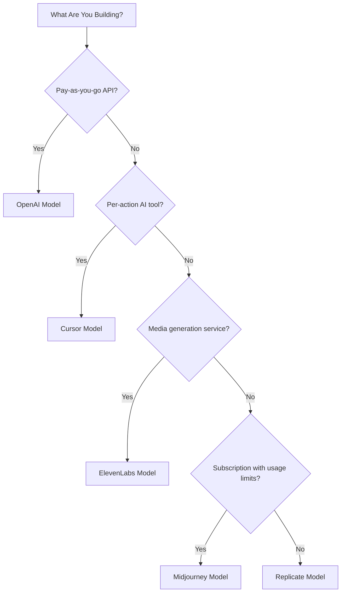

## Les cinq modèles

| App | Métrique principale | Innovation unique | Fonction Dodo |
| :--- | :--- | :--- | :--- |
| OpenAI | Jetons (libellés en monnaie fiduciaire) | Crédits fiduciaires prépayés avec solde jamais expirant | Credit-Based Billing (Fiat Credits) |
| Cursor | Requêtes premium | Épuisement pondéré des crédits selon le modèle (coûts différents par modèle) | Credit-Based Billing (Custom Unit) |
| ElevenLabs | Caractères | Quotas de caractères avec report et tarification de dépassement par paliers | Credit-Based Billing (Rollover + Overage) |
| Midjourney | Temps GPU | Mode Relax : secours illimité après le quota | Subscription + Usage Meters |
| Replicate | Secondes d'exécution | Mesure pure par seconde spécifique au matériel | Pure Usage-Based Billing |

## Comprendre les modèles de crédits

| Modèle | Exemple | Fonction Dodo | Type d'unité |
| :--- | :--- | :--- | :--- |
| Crédits fiduciaires prépayés | API OpenAI (rechargement de 5 $ de crédit, sans retrait) | Credit-Based Billing (Fiat Credits) | Unités virtuelles libellées en dollars |
| Crédits d'utilisation virtuels | Requêtes premium Cursor, Caractères ElevenLabs | Credit-Based Billing (Custom Unit) | Unités arbitraires (requêtes, caractères) |
| Mesure pure de la consommation | Facturation par seconde de Replicate | Usage-Based Billing (Meters) | Mesure directe (secondes, octets) |
| Abonnement + dépassement mesuré | Heures rapides Midjourney avec secours Relax | Subscription + Usage Meters | Basé sur le temps avec seuil gratuit |

<Info>
Les crédits fiduciaires dans la facturation basée sur les crédits de Dodo représentent des valeurs libellées en dollars au sein de la plateforme, sans valeur monétaire en dehors de votre écosystème. Les clients ne peuvent pas les retirer en espèces.
</Info>

## Quel modèle devriez-vous utiliser ?

- Construire une plateforme API à la consommation : modèle OpenAI (Fiat Credits)
- Concevoir un outil d'IA avec tarification à l'action : modèle Cursor (Custom Unit Credits)
- Mettre en place un service de génération média : modèle ElevenLabs (Rollover Credits)
- Lancer un service d'abonnement avec limites de consommation : modèle Midjourney (Subscription + Usage Meters)
- Déployer une plateforme d'infrastructure/compute : modèle Replicate (Pure Metering)

<CardGroup cols={2}>
  <Card title="OpenAI" icon="/images/logos/openai.svg" href="/developer-resources/billing-deconstructions/openai">
    Reproduisez le modèle de crédits prépayés basés sur les jetons.
  </Card>
  <Card title="Cursor" icon="/images/logos/cursor.svg" href="/developer-resources/billing-deconstructions/cursor">
    Établissez des limites d'utilisation pondérées par modèle.
  </Card>
  <Card title="ElevenLabs" icon="/images/logos/elevenlabs.svg" href="/developer-resources/billing-deconstructions/elevenlabs">
    Mettez en œuvre des quotas de caractères avec report et dépassements.
  </Card>
  <Card title="Midjourney" icon="/images/logos/midjourney.svg" href="/developer-resources/billing-deconstructions/midjourney">
    Combinez des abonnements avec un secours basé sur l'utilisation.
  </Card>
  <Card title="Replicate" icon="/images/logos/replicate.svg" href="/developer-resources/billing-deconstructions/replicate">
    Configurez une mesure pure de la consommation par seconde.
  </Card>
</CardGroup>

## Fonctionnalités Dodo

<CardGroup cols={2}>
  <Card title="Credit-Based Billing" href="/features/credit-based-billing">
    Gérez les crédits prépayés et les unités virtuelles.
  </Card>
  <Card title="Usage-Based Billing" href="/features/usage-based-billing/introduction">
    Mesurez la consommation en temps réel.
  </Card>
  <Card title="Subscriptions" href="/features/subscription">
    Gérez la facturation récurrente et l'administration des forfaits.
  </Card>
  <Card title="Hybrid Billing" href="/features/hybrid-billing">
    Combinez plusieurs modèles de facturation pour une flexibilité maximale.
  </Card>
</CardGroup>

## Plans d'ingestion

Chaque déconstruction inclut une intégration avec les [plans d'ingestion](/features/usage-based-billing/ingestion-blueprints) de Dodo, des SDK prêts à l'emploi qui gèrent automatiquement le suivi des événements. Plutôt que de construire manuellement les événements d'utilisation, utilisez un plan pour obtenir une mesure prête pour la production en quelques minutes.

<CardGroup cols={3}>
  <Card title="LLM Blueprint" icon="brain-circuit" href="/developer-resources/ingestion-blueprints/llm">
    Suivi automatique des jetons pour OpenAI, Anthropic, Groq et autres.
  </Card>
  <Card title="Stream Blueprint" icon="tower-broadcast" href="/developer-resources/ingestion-blueprints/stream">
    Suivez la bande passante des flux audio et vidéo.
  </Card>
  <Card title="Time Range Blueprint" icon="clock" href="/developer-resources/ingestion-blueprints/time-range">
    Facturez selon la durée de calcul jusqu'à la milliseconde.
  </Card>
</CardGroup>
