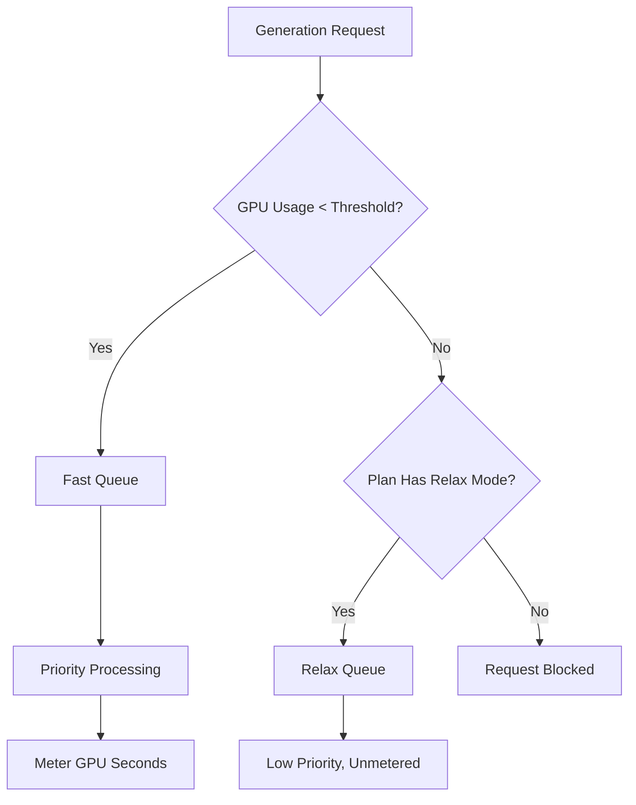

Midjourney est une plateforme d’IA générative qui utilise un modèle de facturation unique basé sur le temps de GPU plutôt que sur un simple décompte par image. Cette approche garantit que les rendus complexes en haute résolution coûtent plus que les brouillons rapides en basse résolution.

## Comment Midjourney facture

Les abonnements Midjourney accordent aux utilisateurs un nombre spécifique d’« heures GPU rapides » chaque mois. Ces heures représentent le temps de calcul réel consacré à vos générations.

| Plan | Prix | Heures GPU rapides | Relax Mode | Stealth Mode |
| :--- | :--- | :--- | :--- | :--- |
| Basic | \$10/mois | ~3,3 h | Non | Non |
| Standard | \$30/mois | 15 h | Illimité | Non |
| Pro | \$60/mois | 30 h | Illimité | Oui |
| Mega | \$120/mois | 60 h | Illimité | Oui |

1. **Niveaux de tarification** : Midjourney propose quatre niveaux d’abonnement allant de \$10 à \$120 par mois, chacun fournissant un nombre défini d’heures GPU rapides.
2. **Relax Mode** : Les plans Standard et supérieurs incluent des générations illimitées via une file à basse priorité une fois les heures rapides épuisées, garantissant que les utilisateurs ne rencontrent jamais de coupure brutale d’usage.
3. **Heures GPU supplémentaires** : Les utilisateurs peuvent acheter du temps GPU rapide additionnel pour environ \$4 par heure s’ils ont besoin de résultats immédiats après avoir épuisé leur quota mensuel.
4. **Mesure en secondes GPU** : L’utilisation est suivie par le temps de calcul réel consacré aux générations, ce qui signifie que les rendus complexes coûtent plus que les brouillons simples.
5. **Boucle communautaire** : Les utilisateurs actifs peuvent gagner des heures GPU bonus en notant les images de la galerie, ce qui aide à entraîner les modèles tout en récompensant la communauté.
## Ce qui le rend unique

Le modèle Midjourney est efficace parce qu’il aligne le coût sur la valeur et l’utilisation des ressources.

* **La facturation en temps GPU** aligne le coût sur l’utilisation des ressources, garantissant que les rendus complexes sont tarifés équitablement par rapport aux brouillons simples.
* **Relax Mode** offre une solution de secours illimitée qui réduit le taux d’attrition en maintenant l’accès au service même après l’atteinte des limites mensuelles.
* **La séparation Fast vs Relax** incite aux montées en gamme en proposant un traitement prioritaire aux utilisateurs qui privilégient la rapidité et les résultats instantanés.
* **Les heures GPU supplémentaires** offrent une option de rechargement flexible pour les utilisateurs intensifs qui ont besoin de capacité prioritaire supplémentaire en cours de mois.

## Reproduire cela avec Dodo Payments

Vous pouvez reproduire ce modèle avec Dodo Payments en combinant des abonnements avec des compteurs d’usage et de la logique applicative.

<Steps>

<Step title="Create a Usage Meter">

Tout d’abord, créez un compteur pour suivre les secondes GPU utilisées par chaque client.

* **Nom du compteur** : `gpu.fast_seconds`
* **Agrégation** : **Somme** (additionnez la propriété `gpu_seconds` de chaque événement)

Vous ne suivrez que les événements où le mode de génération est « fast ». Les générations en mode Relax ne sont pas mesurées à des fins de facturation.

</Step>

<Step title="Create Subscription Products with Usage Pricing">

Créez vos produits d’abonnement et attachez-y le compteur d’usage avec un seuil gratuit.

| Produit | Prix de base | Seuil gratuit (secondes) | Tarif de dépassement |
| :--- | :--- | :--- | :--- |
| Basic | \$10/mois | 12 000 (3,3 h) | N/A (plafond strict) |
| Standard | \$30/mois | 54 000 (15 h) | \$0,00 (Relax Mode) |
| Pro | \$60/mois | 108 000 (30 h) | \$0,00 (Relax Mode) |
| Mega | \$120/mois | 216 000 (60 h) | \$0,00 (Relax Mode) |

Pour le plan Basic, vous désactiverez les dépassements pour appliquer un plafond strict. Pour les autres plans, le « Relax Mode » est géré par la logique applicative lorsque le compteur indique que le seuil est dépassé.

</Step>

<Step title="Implement Application-Level Relax Mode">

L’insight clé est que Relax Mode n’est pas une fonctionnalité de facturation. C’est votre application qui redirige les requêtes vers une file plus lente lorsque le compteur d’usage Dodo indique que le seuil est atteint.

```typescript
async function handleGenerationRequest(customerId: string, prompt: string) {
  const usage = await getCustomerUsage(customerId, 'gpu.fast_seconds');
  const subscription = await getSubscription(customerId);
  const threshold = getThresholdForPlan(subscription.product_id);
  
  if (usage.current >= threshold) {
    if (subscription.product_id === 'prod_basic') {
      throw new Error('Fast GPU hours exhausted. Upgrade to Standard for Relax Mode.');
    }
    
    // Relax Mode. Route to low-priority queue
    return await queueGeneration(customerId, prompt, {
      priority: 'low',
      mode: 'relax',
      model: 'standard'
    });
  }
  
  // Fast Mode. Priority processing
  return await queueGeneration(customerId, prompt, {
    priority: 'high',
    mode: 'fast',
    model: 'premium'
  });
}
```

</Step>

<Step title="Send Usage Events (Fast Mode Only)">

N’envoyez des événements d’usage à Dodo que lorsqu’une génération est effectuée en mode Fast.

```typescript
import DodoPayments from 'dodopayments';

async function trackFastGeneration(customerId: string, gpuSeconds: number, jobId: string) {
  // Only track Fast mode generations. Relax mode is free and unlimited
  const client = new DodoPayments({
    bearerToken: process.env.DODO_PAYMENTS_API_KEY,
  });

  await client.usageEvents.ingest({
    events: [{
      event_id: `gen_${jobId}`,
      customer_id: customerId,
      event_name: 'gpu.fast_seconds',
      timestamp: new Date().toISOString(),
      metadata: {
        gpu_seconds: gpuSeconds,
        resolution: '1024x1024',
        mode: 'fast'
      }
    }]
  });
}
```

</Step>

<Step title="Sell Extra Fast Hours (One-Time Top-Up)">

Créez un produit de paiement unique pour « Heure GPU rapide supplémentaire » à \$4. Lorsqu’un client l’achète, vous pouvez accorder un seuil supplémentaire ou des crédits dans votre application.

```typescript
// After customer purchases extra hours
const session = await client.checkoutSessions.create({
  product_cart: [
    { product_id: 'prod_extra_gpu_hour', quantity: 5 }
  ],
  customer: { customer_id: customerId },
  return_url: 'https://yourapp.com/dashboard'
});
```

</Step>

<Step title="Create Checkout for Subscription">

Enfin, créez une session de paiement pour le plan d’abonnement.

```typescript
const session = await client.checkoutSessions.create({
  product_cart: [
    { product_id: 'prod_mj_standard', quantity: 1 }
  ],
  customer: { email: 'artist@example.com' },
  return_url: 'https://yourapp.com/studio'
});
```

</Step>

</Steps>

## Accélérez avec le blueprint Time Range Ingestion

Le [Time Range Ingestion Blueprint](/developer-resources/ingestion-blueprints/time-range) simplifie le suivi du temps GPU en fournissant des assistants dédiés à la facturation basée sur la durée.

```bash
npm install @dodopayments/ingestion-blueprints
```

```typescript
import { Ingestion, trackTimeRange } from '@dodopayments/ingestion-blueprints';

const ingestion = new Ingestion({
  apiKey: process.env.DODO_PAYMENTS_API_KEY,
  environment: 'live_mode',
  eventName: 'gpu.fast_seconds',
});

// Track generation time after a Fast mode job completes
const startTime = Date.now();
const result = await runGeneration(prompt, settings);
const durationMs = Date.now() - startTime;

await trackTimeRange(ingestion, {
  customerId: customerId,
  durationMs: durationMs,
  metadata: {
    mode: 'fast',
    resolution: '1024x1024',
  },
});
```

Le blueprint gère la conversion de durée et le formatage des événements. Vous devez uniquement fournir l’ID du client et le temps écoulé.

<Tip>
Le Time Range Blueprint prend en charge les millisecondes, les secondes et les minutes. Consultez la [documentation complète du blueprint](/developer-resources/ingestion-blueprints/time-range) pour toutes les options de durée et les meilleures pratiques.
</Tip>

## L’architecture Fast vs Relax

Le système à double file fonctionne en routant les requêtes en fonction de l’état d’utilisation actuel.



1. Toutes les requêtes passent par votre application.
2. L’application compare le compteur d’usage Dodo au seuil gratuit du plan.
3. Si l’utilisation est inférieure au seuil, la requête est envoyée à la file Fast et est mesurée.
4. Si l’utilisation dépasse le seuil, la requête est dirigée vers la file Relax, qui n’est pas mesurée et a une priorité moindre.
5. Le plan Basic n’a pas de bascule Relax, donc les requêtes sont bloquées une fois la limite atteinte.

<Info>
Relax Mode est un schéma au niveau applicatif, pas une fonctionnalité de facturation Dodo. Dodo suit votre utilisation GPU rapide et vous informe lorsque le seuil est dépassé. Votre application décide d’empêcher l’utilisateur ou de le rediriger vers une file plus lente.
</Info>

## Fonctionnalités clés de Dodo utilisées

<CardGroup cols={2}>
  <Card title="Subscriptions" icon="calendar" href="/features/subscription">
    Gérer la facturation récurrente et les niveaux de plan.
  </Card>
  <Card title="Usage-Based Billing" icon="bolt" href="/features/usage-based-billing/introduction">
    Suivre et facturer en fonction de la consommation réelle des ressources.
  </Card>
  <Card title="Event Ingestion" icon="input-pipe" href="/features/usage-based-billing/event-ingestion">
    Envoyer des événements d’usage à haut volume vers l’API Dodo.
  </Card>
  <Card title="Meters" icon="gauge" href="/features/usage-based-billing/meters">
    Définir comment les événements d’usage sont agrégés et facturés.
  </Card>
  <Card title="One-Time Payments" icon="credit-card" href="/features/one-time-payment-products">
    Vendre des heures supplémentaires ou des recharges comme achats ponctuels.
  </Card>
  <Card title="Time Range Blueprint" icon="clock" href="/developer-resources/ingestion-blueprints/time-range">
    Simplifier le suivi du temps GPU avec des assistants basés sur la durée.
  </Card>
</CardGroup>
