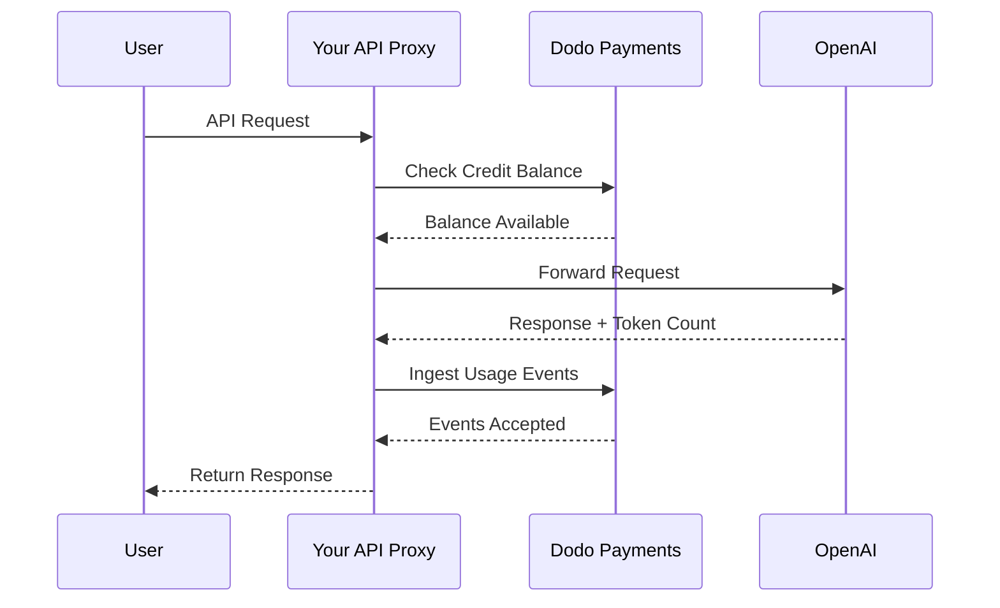
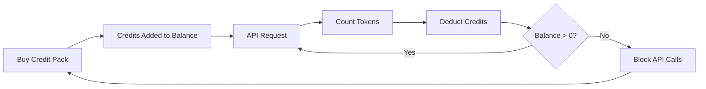

Le modèle de facturation d'OpenAI est la référence pour les entreprises d'IA. Il combine des crédits fiat prépayés pour l'utilisation de l'API avec des abonnements à tarif fixe pour les produits grand public. Cette approche hybride assure des revenus prévisibles tout en permettant aux développeurs de faire évoluer leur usage sans friction.

## Pourquoi le modèle d'OpenAI est la référence

L'industrie de l'IA fait face à des défis uniques que la facturation SaaS traditionnelle ne résout pas toujours. Le modèle d'OpenAI résout plusieurs de ces problèmes simultanément.

1. **Revenu prévisible et faible risque** : En exigeant des crédits prépayés pour l'utilisation de l'API, OpenAI élimine le risque que les utilisateurs accumulent des factures massives qu'ils ne peuvent pas payer. Vous encaissez l'argent à l'avance et l'utilisateur obtient le service au fur et à mesure.
2. **Scalabilité pour les développeurs** : Un rechargement de 5 $ est une faible barrière à l'entrée. À mesure que leur application se développe, les développeurs peuvent automatiser les rechargements ou acheter des packs plus importants. La friction de démarrage est quasiment nulle, mais la croissance est illimitée.
3. **Psychologie des utilisateurs** : Libeller les crédits en devise (USD) plutôt qu'en « jetons » ou « points » abstraits rend la valeur claire. Cela ressemble à un compte bancaire pour les services d'IA, ce qui renforce la confiance et facilite la budgétisation pour les entreprises.

## Comment OpenAI facture

OpenAI exploite deux modèles de facturation distincts qui répondent à des besoins différents.

1. **API (Paiement à l'utilisation)** : L'API utilise des crédits prépayés libellés en devise fiat. Les utilisateurs alimentent leurs comptes avec 5 $, 10 $, 50 $ ou plus. Ces crédits affichent une valeur en dollars mais n'ont aucune valeur monétaire en dehors d'OpenAI. OpenAI facture au jeton avec des tarifs différents pour les jetons d'entrée et de sortie. Les crédits n'expirent jamais et lorsque le solde d'un utilisateur atteint 0 $, ses appels API échouent immédiatement.
2. **ChatGPT Plus, Team et Enterprise** : Ce sont des abonnements à tarif fixe. ChatGPT Plus coûte 20 $ par mois, tandis que le plan Team est à 25 $ par utilisateur et par mois. Ces plans ont des plafonds souples où les utilisateurs sont rétrogradés vers un modèle plus petit au lieu d'être bloqués.
3. **Paliers basés sur les dépenses** : Au fur et à mesure que vous dépensez plus d'argent au total, vous débloquez des limites de taux API supérieures. Il s'agit d'un système d'accès évolutif basé sur la confiance lié directement à votre historique de facturation.

| Modèle | Tarification | Jetons d'entrée | Jetons de sortie |
| :--- | :--- | :--- | :--- |
| GPT-4o | Usage-based | $2.50 / 1M | $10.00 / 1M |
| GPT-4o-mini | Usage-based | $0.15 / 1M | $0.60 / 1M |
| o1 | Usage-based | $15.00 / 1M | $60.00 / 1M |

| Plan | Prix | Type |
| :--- | :--- | :--- |
| Gratuit | $0 | Accès limité |
| Plus | $20 / mois | Abonnement avec plafonds souples |
| Team | $25 / utilisateur / mois | Abonnement par siège |
| Enterprise | Personnalisé | Facturation sur facture |
## Ce qui rend cela unique

La stratégie de facturation d'OpenAI présente plusieurs caractéristiques clés qui la rendent efficace pour les services d'IA.

- **Crédits libellés en fiat** : Les crédits ressemblent à de l'argent car ils sont libellés en USD. Cela rend la tarification transparente et facile à comprendre pour les développeurs.
- **Pas d'expiration** : Des soldes qui n'expirent jamais réduisent la pression du « utilise ou perds ». Les utilisateurs se sentent à l'aise de recharger des montants plus importants car ils savent que la valeur ne disparaîtra pas.
- **Mesure multidimensionnelle** : Les jetons d'entrée et de sortie sont suivis séparément mais déduits du même solde de crédits. Cela permet à OpenAI de tarifer différemment les jetons de sortie coûteux par rapport aux jetons d'entrée moins chers.
- **Paliers de confiance** : Lier les limites de taux aux dépenses totales encourage les utilisateurs à rester sur la plateforme et récompense les clients fidèles avec une meilleure performance.

Ce modèle crée un puissant cercle vertueux. Des coûts d'entrée faibles attirent les développeurs. Les crédits prépayés apportent un flux de trésorerie immédiat. La montée en charge basée sur l'utilisation garantit que plus les développeurs réussissent, plus OpenAI réussit. Le volet abonnement fournit une base de revenus stable et prévisible provenant des non-développeurs.

## Reproduire cela avec Dodo Payments

<Steps>
  <Step title="Create a Fiat Credit Entitlement">
    Vous pouvez reproduire le modèle de facturation d'OpenAI avec Dodo Payments. Nous utiliserons la facturation par crédits pour l'API et des abonnements classiques pour la partie ChatGPT Plus.

    Commencez par créer une attribution de crédits dans votre tableau de bord Dodo Payments. Cela servira de solde central pour vos utilisateurs.

    * **Type de crédit** : Crédits fiat (USD)
    * **Expiration des crédits** : Jamais
    * **Report** : Non nécessaire (puisqu'ils n'expirent jamais)
    * **Débordement** : Désactivé

    Désactiver le dépassement garantit que les appels API échouent lorsque le solde atteint 0 $, exactement comme chez OpenAI.

  <Step title="Create Top-Up Products">
    Créez des produits de paiement ponctuel pour différents packs de crédits. Vous pouvez proposer des options à 5 $, 10 $, 50 $ et 100 $. Associez votre attribution de crédits fiat à chaque produit.

    Définissez le nombre de crédits émis par produit en cents. Pour un pack à 50 $, vous émettrez 5000 crédits.

    ```typescript
    import DodoPayments from 'dodopayments';

    const client = new DodoPayments({
      bearerToken: process.env.DODO_PAYMENTS_API_KEY,
    });

    const session = await client.checkoutSessions.create({
      product_cart: [
        { product_id: 'prod_credit_pack_50', quantity: 1 }
      ],
      customer: { email: 'developer@example.com' },
      return_url: 'https://yourapp.com/dashboard'
    });
    ```

  </Step>

  <Step title="Create Usage Meters">
    Créez deux compteurs séparés pour suivre l'utilisation des jetons.

    * `llm.input_tokens` : Agrégation de somme sur la propriété `tokens`.
    * `llm.output_tokens` : Agrégation de somme sur la propriété `tokens`.

    Liez les deux compteurs à votre attribution de crédits fiat. Vous devrez configurer les « unités de compteur par crédit » pour chacun.

    ### Calcul des unités du compteur par crédit

    Pour correspondre à la tarification GPT-4o d'OpenAI (2,50 $ par 1M de jetons d'entrée), vous devez calculer combien de jetons équivalent à 1 $ (100 cents).

    * **Jetons d'entrée** : 1 000 000 de jetons / 2,50 $ = 400 000 jetons par 1 $.
    * **Jetons de sortie** : 1 000 000 de jetons / 10,00 $ = 100 000 jetons par 1 $.

    Dans le tableau de bord Dodo, vous réglerez les « unités de compteur par crédit » à 400 000 pour l'entrée et 100 000 pour la sortie.

  </Step>
  <Step title="Send Usage Events">
    Après chaque requête LLM, envoyez les données d'utilisation à Dodo Payments. Vous pouvez envoyer les événements d'entrée et de sortie dans une seule requête.

    ```typescript
    await client.usageEvents.ingest({
      events: [{
        event_id: `req_${requestId}`,
        customer_id: customerId,
        event_name: 'llm.input_tokens',
        timestamp: new Date().toISOString(),
        metadata: {
          model: 'gpt-4o',
          tokens: 1500
        }
      }, {
        event_id: `req_${requestId}_out`,
        customer_id: customerId,
        event_name: 'llm.output_tokens',
        timestamp: new Date().toISOString(),
        metadata: {
          model: 'gpt-4o',
          tokens: 800
        }
      }]
    });
    ```

  </Step>

  <Step title="Handle Balance Depletion">
    Vous devez vérifier le solde de l'utilisateur avant de traiter une requête API. Si le solde est nul ou négatif, renvoyez une erreur 402.

    ```typescript
    async function checkCreditsBeforeRequest(customerId: string) {
      const balance = await client.creditEntitlements.balances.retrieve(customerId, {
        credit_entitlement_id: 'credit_entitlement_id',
      });

      if (balance.available <= 0) {
        throw new Error('Insufficient credits. Please top up your account.');
      }
    }
    ```

    ### Gestion des webhooks de faible solde

    N'attendez pas que l'utilisateur atteigne 0 $ pour le prévenir. Utilisez des webhooks pour déclencher un e-mail ou une notification in-app lorsque son solde descend en dessous d'un certain seuil.

    ```typescript
    import DodoPayments from 'dodopayments';
    import express from 'express';

    const app = express();
    app.use(express.raw({ type: 'application/json' }));

    const client = new DodoPayments({
      bearerToken: process.env.DODO_PAYMENTS_API_KEY,
      webhookKey: process.env.DODO_PAYMENTS_WEBHOOK_KEY,
    });

    app.post('/webhooks/dodo', async (req, res) => {
      try {
        const event = client.webhooks.unwrap(req.body.toString(), {
          headers: {
            'webhook-id': req.headers['webhook-id'] as string,
            'webhook-signature': req.headers['webhook-signature'] as string,
            'webhook-timestamp': req.headers['webhook-timestamp'] as string,
          },
        });

        if (event.type === 'credit.balance_low') {
          const { customer_id, available_balance } = event.data;
          await sendLowBalanceEmail(customer_id, available_balance);
        }

        res.json({ received: true });
      } catch (error) {
        res.status(401).json({ error: 'Invalid signature' });
      }
    });
    ```

    <Tip>
      OpenAI envoie ces e-mails lorsque le solde d'un utilisateur est presque épuisé, ce qui lui laisse le temps de recharger sans interruption de service.
    </Tip>

  </Step>
  <Step title="Build the ChatGPT Subscription Side (Optional)">
    Si vous souhaitez proposer un plan d'abonnement comme ChatGPT Plus, créez un produit d'abonnement séparé dans Dodo Payments. Ceux-ci n'ont pas besoin d'attributions de crédits.

    Pour un plan Team, utilisez la facturation par siège en ajoutant des modules complémentaires pour chaque utilisateur supplémentaire.

    ```typescript
    const session = await client.checkoutSessions.create({
      product_cart: [
        { product_id: 'prod_plus_subscription', quantity: 1 }
      ],
      customer: { email: 'user@example.com' },
      return_url: 'https://yourapp.com/billing'
    });
    ```

    ### Mise en œuvre des plafonds souples

    Pour reproduire les plafonds souples d'OpenAI, vous pouvez suivre l'utilisation de vos abonnés avec les mêmes compteurs mais sans les lier à une attribution de crédits. Dans la logique de votre application, vérifiez l'utilisation pour la période de facturation en cours.

    ```typescript
    async function checkSubscriptionUsage(customerId: string) {
      const usage = await getUsageForCurrentPeriod(customerId);
      
      if (usage > SOFT_CAP_THRESHOLD) {
        // Route to a smaller model instead of blocking
        return 'gpt-4o-mini';
      }
      
      return 'gpt-4o';
    }
    ```

  </Step>
</Steps>

## Accélérez avec le blueprint d'ingestion LLM

Les étapes ci-dessus montrent comment construire manuellement et envoyer des événements d'utilisation. Pour les déploiements en production, le [LLM Ingestion Blueprint](/developer-resources/ingestion-blueprints/llm) fournit un suivi automatique des jetons qui enveloppe directement votre client OpenAI.

```bash
npm install @dodopayments/ingestion-blueprints
```

```typescript
import { createLLMTracker } from '@dodopayments/ingestion-blueprints';
import OpenAI from 'openai';

const openai = new OpenAI({ apiKey: process.env.OPENAI_API_KEY });

const tracker = createLLMTracker({
  apiKey: process.env.DODO_PAYMENTS_API_KEY,
  environment: 'live_mode',
  eventName: 'llm.chat_completion',
});

const trackedClient = tracker.wrap({
  client: openai,
  customerId: customerId,
});

// Every API call now automatically tracks token usage
const response = await trackedClient.chat.completions.create({
  model: 'gpt-4o',
  messages: [{ role: 'user', content: prompt }],
});

// inputTokens, outputTokens, and totalTokens are sent automatically
console.log('Tokens used:', response.usage);
```

Le blueprint capture `inputTokens`, `outputTokens` et `totalTokens` de chaque réponse API et les envoie comme métadonnées d'événement. Configurez votre compteur pour agréger la propriété de jetons appropriée.

<Tip>
Le blueprint LLM prend en charge OpenAI, Anthropic, Groq, Google Gemini, OpenRouter et le SDK Vercel AI. Consultez la [documentation complète du blueprint](/developer-resources/ingestion-blueprints/llm) pour des exemples par fournisseur et une configuration avancée.
</Tip>

## Mise en œuvre des paliers de tarification basés sur les dépenses

Les paliers de tarification d'OpenAI sont un moyen puissant de gérer la capacité. Vous pouvez mettre cela en œuvre en suivant la dépense totale à vie d'un client.

1. **Suivre les dépenses à vie** : Écoutez les webhooks `payment.succeeded` et mettez à jour un champ `total_spend` dans votre base de données pour ce client.
2. **Définir les paliers** : Créez une correspondance entre les montants dépensés et les limites de taux.
   * Niveau 1 : 0 $ - 50 $ -> 3 RPM
   * Niveau 2 : 50 $ - 250 $ -> 10 RPM
   * Niveau 3 : 250 $+ -> 50 RPM
3. **Appliquer les limites** : Dans le middleware de votre API, vérifiez le palier du client et appliquez la limite de taux correspondante.

```typescript
async function getRateLimitForCustomer(customerId: string) {
  const customer = await db.customers.findUnique({ where: { id: customerId } });
  const totalSpend = customer.total_spend;

  if (totalSpend >= 25000) return TIER_3_LIMITS; // $250.00
  if (totalSpend >= 5000) return TIER_2_LIMITS;  // $50.00
  return TIER_1_LIMITS;
}
```

## Exemple d'implémentation complète : le proxy API

Dans un scénario réel, vous aurez probablement un proxy API entre vos utilisateurs et le fournisseur LLM. Ce proxy gère l'authentification, les vérifications de crédits et le reporting d'utilisation.



```typescript
import DodoPayments from 'dodopayments';
import OpenAI from 'openai';

const client = new DodoPayments({
  bearerToken: process.env.DODO_PAYMENTS_API_KEY,
});
const openai = new OpenAI({ apiKey: process.env.OPENAI_API_KEY });

export async function handleApiRequest(req, res) {
  const { customerId, prompt, model } = req.body;

  try {
    // 1. Check credit balance
    const balance = await client.creditEntitlements.balances.retrieve(customerId, {
      credit_entitlement_id: 'credit_entitlement_id',
    });

    if (balance.available <= 0) {
      return res.status(402).json({ error: 'Insufficient credits. Please top up.' });
    }

    // 2. Call OpenAI
    const completion = await openai.chat.completions.create({
      model: model,
      messages: [{ role: 'user', content: prompt }],
    });

    const { prompt_tokens, completion_tokens } = completion.usage;

    // 3. Ingest usage events to Dodo
    await client.usageEvents.ingest({
      events: [
        {
          event_id: `req_${completion.id}_in`,
          customer_id: customerId,
          event_name: 'llm.input_tokens',
          timestamp: new Date().toISOString(),
          metadata: { model, tokens: prompt_tokens }
        },
        {
          event_id: `req_${completion.id}_out`,
          customer_id: customerId,
          event_name: 'llm.output_tokens',
          timestamp: new Date().toISOString(),
          metadata: { model, tokens: completion_tokens }
        }
      ]
    });

    // 4. Return response to user
    res.json(completion);

  } catch (error) {
    console.error('API Error:', error);
    res.status(500).json({ error: 'Internal server error' });
  }
}
```

## Gérer les cas limites

Lorsque vous construisez un système de facturation aussi complexe que celui d'OpenAI, vous rencontrerez plusieurs cas limites qui nécessitent une gestion attentive.

### Conditions de concurrence

Si un utilisateur a un solde très faible et envoie plusieurs requêtes simultanément, il pourrait dépasser sa limite de crédits avant que le premier événement ne soit traité. Pour éviter cela, vous pouvez mettre en place un petit « tampon » ou utiliser un verrou distribué sur le solde du client pendant la requête.

### Latence d'ingestion des événements

Dodo Payments traite les événements de manière asynchrone. Cela signifie qu'il peut y avoir un léger délai entre un appel API et la déduction de crédits. Pour la plupart des cas d'utilisation, cela est acceptable. Si vous avez besoin d'une application en temps réel stricte, vous pouvez maintenir un cache local du solde de l'utilisateur et le mettre à jour de manière optimiste.

### Gestion des remboursements

Si vous remboursez l'achat d'un pack de crédits, Dodo Payments gérera automatiquement l'attribution de crédits si elle est configurée. Toutefois, vous devez vous assurer que la logique de votre application reflète immédiatement ce changement pour éviter que les utilisateurs n'utilisent des crédits qu'ils n'ont plus.

### Prise en charge de plusieurs modèles

Si vous supportez plusieurs modèles avec des tarifications différentes, vous avez deux options :
1. **Compteurs séparés** : Créez des compteurs séparés pour chaque modèle (par exemple, `gpt-4o.input_tokens`, `gpt-4o-mini.input_tokens`).
2. **Événements pondérés** : Utilisez un seul compteur mais multipliez la valeur `tokens` par un poids avant de l'envoyer à Dodo. Par exemple, si GPT-4o coûte 10 fois plus cher que GPT-4o-mini, vous pourriez envoyer 10 fois les jetons pour les requêtes GPT-4o.

OpenAI utilise l'approche des compteurs séparés en interne pour conserver des enregistrements clairs d'utilisation par modèle.

## Aperçu de l'architecture



Les compteurs suivent les jetons et déduisent la valeur correspondante du solde de crédits de l'utilisateur en fonction de vos tarifs configurés.

## Conclusion

Reproduire le modèle de facturation d'OpenAI avec Dodo Payments vous offre le meilleur des deux mondes : la flexibilité de la facturation à l'utilisation et la prévisibilité des crédits prépayés. En suivant ce guide, vous pouvez construire un système de facturation qui évolue avec vos utilisateurs tout en protégeant vos marges.

Que vous construisiez le prochain grand LLM ou un outil d'IA de niche, ces modèles vous aideront à créer une expérience professionnelle et conviviale pour les développeurs. Cette approche garantit que votre infrastructure de facturation est aussi évolutive et fiable que les modèles d'IA que vous fournissez à vos clients.

## Principales fonctionnalités Dodo utilisées

Explorez les fonctionnalités qui rendent cette mise en œuvre possible.

<CardGroup cols={2}>
  <Card title="Credit-Based Billing" icon="coins" href="/features/credit-based-billing">
    Gérez des crédits fiat prépayés et leurs droits pour vos utilisateurs.
  </Card>
  <Card title="Usage-Based Billing" icon="chart-line" href="/features/usage-based-billing/introduction">
    Suivez les utilisations granulaires comme les jetons et facturez-les en temps réel.
  </Card>
  <Card title="One-Time Payments" icon="credit-card" href="/features/one-time-payment-products">
    Vendez des packs de crédits et des recharges avec un processus de paiement simple.
  </Card>
  <Card title="Event Ingestion" icon="bolt" href="/features/usage-based-billing/event-ingestion">
    Envoyez facilement des données d'utilisation à fort volume à Dodo Payments.
  </Card>
  <Card title="Webhooks" icon="webhook" href="/developer-resources/webhooks/intents/credit">
    Restez informé des changements de solde de crédits et des alertes de solde faible.
  </Card>
  <Card title="LLM Ingestion Blueprint" icon="brain-circuit" href="/developer-resources/ingestion-blueprints/llm">
    Suivi automatique des jetons pour OpenAI et d'autres fournisseurs de LLM.
  </Card>
</CardGroup>
