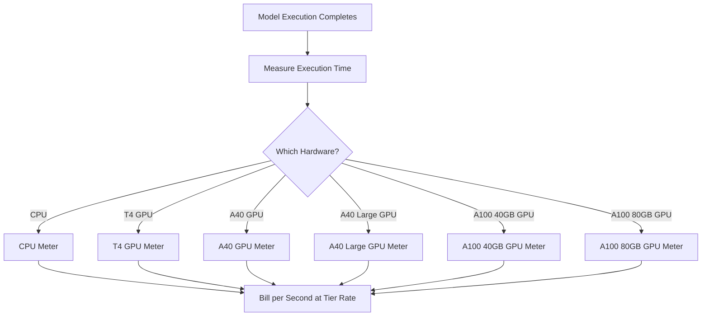

Replicate est une plateforme qui exécute des modèles d’apprentissage automatique open source dans le cloud. Leur modèle de facturation est l’un des exemples les plus purs de tarification basée sur l’usage dans l’industrie de l’IA. Il n’y a pas de frais d’abonnement mensuel ni de tarif fixe par exécution de modèle. À la place, ils facturent le temps de calcul exact consommé, au rythme de la seconde, avec des tarifs qui varient selon le matériel sous-jacent.

Cette approche fonctionne bien pour les charges de travail en IA parce que les temps d’exécution sont imprévisibles. Un utilisateur peut exécuter un modèle léger pendant quelques secondes ou un modèle génératif massif pendant plusieurs minutes. En liant le coût aux ressources de calcul plutôt qu’au modèle lui-même, Replicate maintient une tarification transparente et évolutive.

## Comment Replicate facture

La tarification de Replicate est découplée du modèle spécifique exécuté. Que vous génériez une image avec SDXL ou que vous exécutiez Llama 3, la facturation dépend du niveau de matériel et de la durée d’exécution. Cela leur permet d’héberger des milliers de modèles open source sans avoir besoin d’un plan tarifaire séparé pour chacun.

| Matériel | Prix par seconde | Prix par heure |
| :--- | :--- | :--- |
| CPU NVIDIA | \$0.000100 | \$0.36 |
| GPU NVIDIA T4 | \$0.000225 | \$0.81 |
| GPU NVIDIA A40 | \$0.000575 | \$2.07 |
| GPU NVIDIA A40 (Large) | \$0.000725 | \$2.61 |
| GPU NVIDIA A100 (40GB) | \$0.001150 | \$4.14 |
| GPU NVIDIA A100 (80GB) | \$0.001400 | \$5.04 |



1. **Tarifs spécifiques au matériel** : le coût par seconde varie en fonction des ressources de calcul requises. Chaque niveau matériel a un prix différent.
2. **Modèle purement basé sur l’usage** : il n’y a pas de frais mensuels, pas de dépassements et pas de limites. Les utilisateurs sont facturés pour le temps de calcul exact (par ex. « 12,4 secondes sur une A100 ») plutôt que par génération.
3. **Granularité à la seconde** : les fournisseurs cloud traditionnels facturent à l’heure ou à la minute, ce qui engendre du gaspillage pour les tâches de courte durée. La facturation à la seconde élimine cette inefficacité pour les petits tests comme pour les charges de production importantes.

<Info>
Les démarrages à froid sont également facturables. La première requête vers un modèle prend souvent 10 à 30 secondes pour charger le modèle en mémoire. Ce temps de chargement est facturé au même tarif que le temps d’exécution.
</Info>
## Ce qui le rend unique

* **Mesure spécifique au matériel :** le même modèle coûte plus cher sur du matériel plus performant. Les utilisateurs choisissent entre rapidité et coût. Un GPU T4 convient aux tâches non sensibles au temps, tandis qu’une A100 gère les applications en temps réel.
* **Granularité à la seconde :** la facturation est calculée seconde par seconde, de sorte que les utilisateurs ne paient jamais trop pour les tâches courtes.
* **Pas d’abonnement :** aucun engagement pour commencer. Cela s’adapte infiniment à l’usage, ce qui en fait une solution idéale pour les startups et les développeurs qui expérimentent différents modèles.
* **Agnostique au modèle :** la logique de facturation reste la même quel que soit le type de tâche (génération d’images, traitement de texte, transcription audio ou synthèse vidéo). Cela permet à la plateforme de prendre en charge un vaste écosystème de modèles sans tables tarifaires complexes.

## Construisez cela avec Dodo Payments

Vous pouvez reproduire ce modèle de facturation en utilisant les fonctionnalités de facturation basée sur l’usage de Dodo Payments. L’essentiel est d’utiliser plusieurs compteurs pour suivre les différents niveaux matériels et de les associer à un seul produit.

<Steps>
  <Step title="Create Usage Meters (One Per Hardware Class)">
    Créez des compteurs séparés pour chaque niveau matériel. Chaque type de matériel a un coût par seconde différent, donc la mesure indépendante permet à Dodo de tarifer chaque niveau différemment et de proposer une facturation détaillée.

    | Nom du compteur | Nom de l’événement | Agrégation | Propriété |
    | :--- | :--- | :--- | :--- |
    | CPU Compute | `compute.cpu` | Sum | `execution_seconds` |
    | GPU T4 Compute | `compute.gpu_t4` | Sum | `execution_seconds` |
    | GPU A40 Compute | `compute.gpu_a40` | Sum | `execution_seconds` |
    | GPU A40 Large Compute | `compute.gpu_a40_large` | Sum | `execution_seconds` |
    | GPU A100 40GB Compute | `compute.gpu_a100_40` | Sum | `execution_seconds` |
    | GPU A100 80GB Compute | `compute.gpu_a100_80` | Sum | `execution_seconds` |

    L’agrégation `Sum` sur la propriété `execution_seconds` calcule le temps total de calcul par niveau matériel pendant la période de facturation.
  </Step>

  <Step title="Create a Usage-Based Product">
    Créez un nouveau produit dans le tableau de bord Dodo Payments :

    * **Type de tarification :** Facturation basée sur l’usage
    * **Prix de base :** \$0/mois (pas de frais d’abonnement)
    * **Fréquence de facturation :** Mensuelle

    Associez tous les compteurs avec leur tarification par unité :

    | Compteur | Prix par unité (par seconde) |
    | :--- | :--- |
    | compute.cpu | \$0.000100 |
    | compute.gpu_t4 | \$0.000225 |
    | compute.gpu_a40 | \$0.000575 |
    | compute.gpu_a40_large | \$0.000725 |
    | compute.gpu_a100_40 | \$0.001150 |
    | compute.gpu_a100_80 | \$0.001400 |

    Réglez le **Seuil gratuit** à 0 pour tous les compteurs. Chaque seconde d’exécution est facturable.
  </Step>

  <Step title="Send Usage Events">
    Envoyez des événements d’usage à Dodo chaque fois qu’une exécution de modèle est terminée. Incluez un `event_id` unique pour chaque prédiction afin d’assurer l’idempotence.

    ```typescript
    import DodoPayments from 'dodopayments';

    type HardwareTier = 'cpu' | 'gpu_t4' | 'gpu_a40' | 'gpu_a40_large' | 'gpu_a100_40' | 'gpu_a100_80';

    const client = new DodoPayments({
      bearerToken: process.env.DODO_PAYMENTS_API_KEY,
    });

    async function trackModelExecution(
      customerId: string,
      modelId: string,
      hardware: HardwareTier,
      executionSeconds: number,
      predictionId: string
    ) {
      const eventName = `compute.${hardware}`;

      await client.usageEvents.ingest({
        events: [{
          event_id: `pred_${predictionId}`,
          customer_id: customerId,
          event_name: eventName,
          timestamp: new Date().toISOString(),
          metadata: {
            execution_seconds: executionSeconds,
            model_id: modelId,
            hardware: hardware
          }
        }]
      });
    }

    // Example: SDXL image generation on A100
    await trackModelExecution(
      'cus_abc123',
      'stability-ai/sdxl',
      'gpu_a100_80',
      8.3,  // 8.3 seconds of A100 time
      'pred_xyz789'
    );
    ```

  </Step>

  <Step title="Measure Execution Time Precisely">
    Encapsulez l’exécution du modèle avec un chronométrage précis en utilisant `performance.now()`. Arrondissez à la dixième de seconde la plus proche pour la facturation.

    ```typescript
    async function runModelWithMetering(
      customerId: string,
      modelId: string,
      hardware: HardwareTier,
      input: Record<string, unknown>
    ) {
      const predictionId = `pred_${Date.now()}`;
      const startTime = performance.now();

      try {
        const result = await executeModel(modelId, input, hardware);
        const executionSeconds = (performance.now() - startTime) / 1000;
        const billedSeconds = Math.round(executionSeconds * 10) / 10;

        await trackModelExecution(
          customerId,
          modelId,
          hardware,
          billedSeconds,
          predictionId
        );

        return result;
      } catch (error) {
        // Still bill for compute time even on failure
        const executionSeconds = (performance.now() - startTime) / 1000;
        if (executionSeconds > 1) {
          await trackModelExecution(
            customerId,
            modelId,
            hardware,
            Math.round(executionSeconds * 10) / 10,
            predictionId
          );
        }
        throw error;
      }
    }
    ```

  </Step>

  <Step title="Create Checkout">
    Lorsqu’un utilisateur s’inscrit, créez une session de paiement pour le produit basé sur l’usage. Dodo gère automatiquement la facturation récurrente et la facturation.

    ```typescript
    const session = await client.checkoutSessions.create({
      product_cart: [
        { product_id: 'prod_compute_payg', quantity: 1 }
      ],
      customer: { email: 'ml-engineer@company.com' },
      return_url: 'https://yourplatform.com/dashboard'
    });
    ```

  </Step>
</Steps>
## Accélérez avec le Time Range Ingestion Blueprint

Le [Time Range Ingestion Blueprint](/developer-resources/ingestion-blueprints/time-range) simplifie le suivi du calcul à la seconde. Créez une instance d’ingestion par niveau matériel et utilisez `trackTimeRange` pour des soumissions d’événements plus propres.

```bash
npm install @dodopayments/ingestion-blueprints
```

```typescript
import { Ingestion, trackTimeRange } from '@dodopayments/ingestion-blueprints';

// Create one ingestion instance per hardware tier
function createHardwareIngestion(hardware: string) {
  return new Ingestion({
    apiKey: process.env.DODO_PAYMENTS_API_KEY,
    environment: 'live_mode',
    eventName: `compute.${hardware}`,
  });
}

const ingestions: Record<string, Ingestion> = {
  cpu: createHardwareIngestion('cpu'),
  gpu_t4: createHardwareIngestion('gpu_t4'),
  gpu_a40: createHardwareIngestion('gpu_a40'),
  gpu_a40_large: createHardwareIngestion('gpu_a40_large'),
  gpu_a100_40: createHardwareIngestion('gpu_a100_40'),
  gpu_a100_80: createHardwareIngestion('gpu_a100_80'),
};

// Track execution after a model run completes
const startTime = performance.now();
const result = await executeModel(modelId, input, hardware);
const durationMs = performance.now() - startTime;

await trackTimeRange(ingestions[hardware], {
  customerId: customerId,
  durationMs: durationMs,
  metadata: {
    model_id: modelId,
    hardware: hardware,
  },
});
```

Le blueprint gère le formatage de la durée et la construction des événements. Associé à des instances d’ingestion par matériel, ce modèle correspond parfaitement à la mesure multi-niveaux de Replicate.

<Tip>
Pour les tâches de longue durée, combinez le Time Range Blueprint avec le suivi par intervalles de battements (heartbeat). Consultez la [documentation complète du blueprint](/developer-resources/ingestion-blueprints/time-range) pour les modèles avancés.
</Tip>
## Estimation des coûts pour les utilisateurs

Comme la facturation basée sur l’usage peut être imprévisible, fournissez aux utilisateurs des estimations de coûts avant qu’ils n’exécutent un modèle. Cela réduit les surprises sur les factures et renforce la confiance.

### Exemple de calculs de coûts

| Modèle | Matériel | Temps moyen | Coût par exécution |
| :--- | :--- | :--- | :--- |
| SDXL (image) | A100 80GB | ~8 s | ~\$0.0112 |
| Llama 3 (texte) | A100 40GB | ~3 s | ~\$0.0035 |
| Whisper (audio) | GPU T4 | ~15 s | ~\$0.0034 |

### Construction d’un calculateur de coûts

```typescript
function estimateCost(hardware: HardwareTier, estimatedSeconds: number): number {
  const rates: Record<HardwareTier, number> = {
    'cpu': 0.000100,
    'gpu_t4': 0.000225,
    'gpu_a40': 0.000575,
    'gpu_a40_large': 0.000725,
    'gpu_a100_40': 0.001150,
    'gpu_a100_80': 0.001400
  };

  return Number((rates[hardware] * estimatedSeconds).toFixed(4));
}

// Show the user before running: "This will cost approximately $0.0098"
const estimate = estimateCost('gpu_a100_80', 8.5);
```

## Entreprise : Capacité réservée

Pour les clients entreprises qui ont besoin d’une disponibilité garantie et sans démarrages à froid, Replicate propose des « instances privées » à un tarif horaire fixe.

Avec Dodo Payments, modélisez cela comme un produit d’abonnement :

* **Type de produit :** Abonnement
* **Prix :** Prix mensuel fixe (par ex. « Instance A100 réservée - \$500/mois »)
* **Cycle de facturation :** Mensuel

Vous pouvez toujours envoyer des événements d’usage pour le suivi et l’analyse, mais l’abonnement couvre les coûts. À mesure que le volume d’un utilisateur augmente, passer du mode pay-as-you-go à la capacité réservée devient souvent plus rentable.

## Avancé : Mesure par heartbeat

Pour les tâches qui durent plusieurs minutes ou heures, envoyer un seul événement à la fin est risqué. Si le processus plante, vous perdez les données d’usage. Une meilleure approche consiste à envoyer des événements d’usage toutes les 30 à 60 secondes pendant l’exécution.

```typescript
async function runLongTaskWithHeartbeat(
  customerId: string,
  modelId: string,
  hardware: HardwareTier
) {
  const predictionId = `pred_${Date.now()}`;
  let totalSeconds = 0;

  const heartbeatInterval = setInterval(async () => {
    try {
      await trackModelExecution(
        customerId,
        modelId,
        hardware,
        30,
        `${predictionId}_${totalSeconds}`
      );
      totalSeconds += 30;
    } catch (error) {
      console.error('Heartbeat tracking failed:', error, { predictionId, totalSeconds });
    }
  }, 30000);

  try {
    await executeLongTask();
  } finally {
    clearInterval(heartbeatInterval);
  }
}
```

## Principales fonctionnalités Dodo utilisées

<CardGroup cols={2}>
  <Card title="Usage-Based Billing" icon="chart-line" href="/features/usage-based-billing/introduction">
    Configurez des produits qui facturent selon la consommation.
  </Card>
  <Card title="Meters" icon="gauge" href="/features/usage-based-billing/meters">
    Définissez les métriques que vous souhaitez suivre et facturer.
  </Card>
  <Card title="Event Ingestion" icon="bolt" href="/features/usage-based-billing/event-ingestion">
    Envoyez les données d’usage à Dodo en temps réel.
  </Card>
  <Card title="Subscriptions" icon="calendar" href="/features/subscription">
    Gérez la facturation récurrente pour la capacité réservée et les plans entreprises.
  </Card>
  <Card title="Time Range Blueprint" icon="clock" href="/developer-resources/ingestion-blueprints/time-range">
    Suivi du calcul à la seconde avec des assistants de durée.
  </Card>
</CardGroup>

## Key Dodo Features Used

<CardGroup cols={2}>
  <Card title="Usage-Based Billing" icon="chart-line" href="/features/usage-based-billing/introduction">
    Set up products that bill based on consumption.
  </Card>
  <Card title="Meters" icon="gauge" href="/features/usage-based-billing/meters">
    Define the metrics you want to track and bill for.
  </Card>
  <Card title="Event Ingestion" icon="bolt" href="/features/usage-based-billing/event-ingestion">
    Send usage data to Dodo in real-time.
  </Card>
  <Card title="Subscriptions" icon="calendar" href="/features/subscription">
    Manage recurring billing for reserved capacity and enterprise plans.
  </Card>
  <Card title="Time Range Blueprint" icon="clock" href="/developer-resources/ingestion-blueprints/time-range">
    Per-second compute tracking with duration helpers.
  </Card>
</CardGroup>
