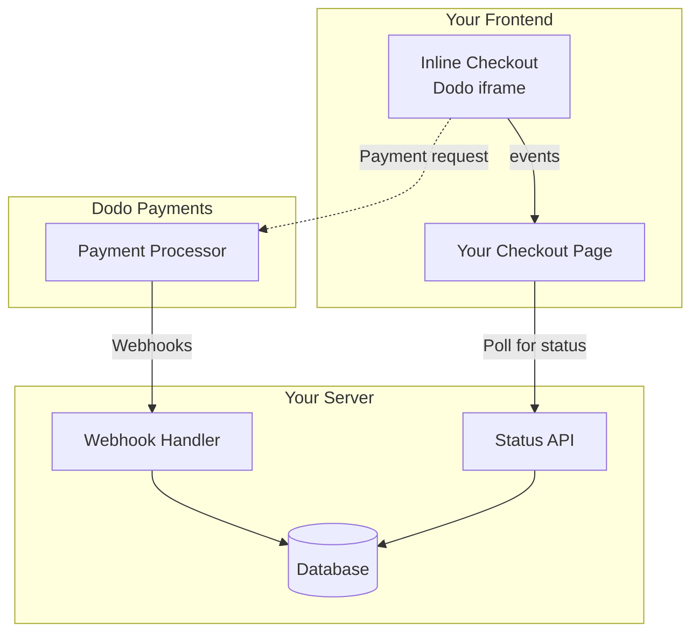

## Aperçu

Le paiement intégré vous permet de créer des expériences de paiement entièrement intégrées qui se fondent parfaitement dans votre site Web ou votre application. Contrairement au [paiement en superposition](/developer-resources/overlay-checkout), qui s'ouvre en tant que modal au-dessus de votre page, le paiement intégré intègre le formulaire de paiement directement dans la mise en page de votre page.

En utilisant le paiement intégré, vous pouvez :

- Créer des expériences de paiement entièrement intégrées à votre application ou site Web
- Permettre à Dodo Payments de capturer en toute sécurité les informations client et de paiement dans un cadre de paiement optimisé
- Afficher des articles, des totaux et d'autres informations de Dodo Payments sur votre page
- Utiliser des méthodes et des événements SDK pour construire des expériences de paiement avancées

<Frame>
    
</Frame>

## Comment ça fonctionne

Le paiement intégré fonctionne en intégrant un cadre sécurisé de Dodo Payments dans votre site Web ou votre application.

Le cadre de paiement gère la collecte des informations client et la capture des détails de paiement. Votre page affiche la liste des articles, les totaux et les options pour modifier ce qui se trouve dans le paiement. Le SDK permet à votre page et au cadre de paiement d'interagir l'un avec l'autre.

Dodo Payments crée automatiquement un abonnement lorsque le paiement est terminé, prêt à être provisionné.

<Note>
Le cadre de paiement intégré gère de manière sécurisée toutes les informations sensibles de paiement, garantissant la conformité PCI sans certification supplémentaire de votre part.
</Note>

## Qu'est-ce qui fait un bon paiement intégré ?

Il est important que les clients sachent qui ils achètent, ce qu'ils achètent et combien ils paient.

Pour construire un paiement intégré conforme et optimisé pour la conversion, votre mise en œuvre doit inclure :

<Frame caption="Example inline checkout layout showing required elements">
    
</Frame>

1. **Informations récurrentes** : Si récurrent, à quelle fréquence cela se reproduit et le total à payer lors du renouvellement. Si un essai, combien de temps dure l'essai.
2. **Descriptions des articles** : Une description de ce qui est acheté.
3. **Totaux de transaction** : Totaux de transaction, y compris le sous-total, la taxe totale et le total général. Assurez-vous d'inclure la devise également.
4. **Pied de page Dodo Payments** : Le cadre de paiement intégré complet, y compris le pied de page de paiement qui contient des informations sur Dodo Payments, nos conditions de vente et notre politique de confidentialité.
5. **Politique de remboursement** : Un lien vers votre politique de remboursement, si elle diffère de la politique de remboursement standard de Dodo Payments.

<Warning>
Affichez toujours le cadre de paiement intégré complet, y compris le pied de page. Supprimer ou masquer les informations légales enfreint les exigences de conformité.
</Warning>

## Parcours client

Le flux de paiement est déterminé par la configuration de votre session de paiement. Selon la façon dont vous configurez la session de paiement, les clients vivront un paiement qui peut présenter toutes les informations sur une seule page ou à travers plusieurs étapes.

<Steps>
<Step title="Customer opens checkout">

Vous pouvez ouvrir le paiement en ligne en passant des articles ou une transaction existante. Utilisez le SDK pour afficher et mettre à jour les informations sur la page, et les méthodes du SDK pour mettre à jour les articles en fonction de l'interaction du client.
    

</Step>

<Step title="Customer enters their details">

Le paiement intégré demande d'abord aux clients de saisir leur adresse e-mail, de sélectionner leur pays et (si nécessaire) de saisir leur code postal. Cette étape recueille toutes les informations nécessaires pour déterminer les taxes et les options de paiement disponibles.

Vous pouvez préremplir les détails du client et présenter des adresses enregistrées pour simplifier l'expérience.

</Step>

<Step title="Customer selects payment method">

Après avoir saisi leurs informations, les clients se voient présenter les modes de paiement disponibles et le formulaire de paiement. Les options peuvent inclure carte de crédit ou de débit, PayPal, Apple Pay, Google Pay et d'autres méthodes de paiement locales en fonction de leur emplacement.

Affichez les modes de paiement enregistrés si disponibles pour accélérer le paiement.


</Step>

<Step title="Checkout completed">

Dodo Payments achemine chaque paiement vers le meilleur acquéreur pour cette vente afin d'obtenir la meilleure chance de succès possible. Les clients entrent dans un flux de succès que vous pouvez construire.


</Step>

<Step title="Dodo Payments creates subscription">

Dodo Payments crée automatiquement un abonnement pour le client, prêt à être provisionné. Le mode de paiement utilisé par le client est conservé pour les renouvellements ou les modifications d'abonnement.


</Step>
</Steps>

## Démarrage rapide

Commencez avec le paiement en ligne Dodo en quelques lignes de code :

```typescript
import { DodoPayments } from "dodopayments-checkout";

// Initialize the SDK for inline mode
DodoPayments.Initialize({
  mode: "test",
  displayType: "inline",
  onEvent: (event) => {
    console.log("Checkout event:", event);
  },
});

// Open checkout in a specific container
DodoPayments.Checkout.open({
  checkoutUrl: "https://test.dodopayments.com/session/cks_123",
  elementId: "dodo-inline-checkout" // ID of the container element
});
```

<Tip>
Assurez-vous de disposer d'un élément conteneur avec le correspondant `id` sur votre page : `<div id="dodo-inline-checkout"></div>`.
</Tip>

## Guide d'intégration étape par étape

<Steps>
<Step title="Install the SDK">

Installez le SDK de paiement Dodo :

<CodeGroup>

```bash npm
npm install dodopayments-checkout
```

```bash yarn
yarn add dodopayments-checkout
```

```bash pnpm
pnpm add dodopayments-checkout
```

</CodeGroup>

</Step>

<Step title="Initialize the SDK for Inline Display">

Initialisez le SDK et spécifiez `displayType: 'inline'`. Vous devriez également écouter l'événement `checkout.breakdown` pour mettre à jour votre interface avec les calculs de taxes et totaux en temps réel.

```typescript
import { DodoPayments } from "dodopayments-checkout";

DodoPayments.Initialize({
  mode: "test",
  displayType: "inline",
  onEvent: (event) => {
    if (event.event_type === "checkout.breakdown") {
      const breakdown = event.data?.message;
      // Update your UI with breakdown.subTotal, breakdown.tax, breakdown.total, etc.
    }
  },
});
```

</Step>

<Step title="Create a Container Element">

Ajoutez un élément à votre HTML où le cadre de paiement sera injecté :

```html
<div id="dodo-inline-checkout"></div>
```

</Step>

<Step title="Open the Checkout">

Appelez `DodoPayments.Checkout.open()` avec le `checkoutUrl` et le `elementId` de votre conteneur :

```typescript
DodoPayments.Checkout.open({
  checkoutUrl: "https://test.dodopayments.com/session/cks_123",
  elementId: "dodo-inline-checkout"
});
```

</Step>

<Step title="Test Your Integration">

1. Démarrez votre serveur de développement :

```bash
npm run dev
```

2. Testez le flux de paiement :
   - Entrez votre email et vos coordonnées dans le cadre en ligne.
   - Vérifiez que votre résumé de commande personnalisé se met à jour en temps réel.
   - Testez le flux de paiement en utilisant des identifiants de test.
   - Confirmez que les redirections fonctionnent correctement.

<Check>
Vous devriez voir des événements `checkout.breakdown` enregistrés dans la console de votre navigateur si vous avez ajouté un console log dans le rappel `onEvent`.
</Check>

</Step>

<Step title="Go Live">

Lorsque vous êtes prêt pour la production :

1. Changez le mode en `'live'` :

```typescript
DodoPayments.Initialize({
  mode: "live",
  displayType: "inline",
  onEvent: (event) => {
    // Handle events
  }
});
```

2. Mettez à jour vos URL de paiement pour utiliser des sessions de paiement en direct depuis votre backend.
3. Testez le flux complet en production.

</Step>
</Steps>

## Exemple complet en React

Cet exemple montre comment implémenter un résumé de commande personnalisé en parallèle avec le paiement intégré, en les synchronisant à l’aide de l’événement `checkout.breakdown`.

```tsx
"use client";

import { useEffect, useState } from 'react';
import { DodoPayments, CheckoutBreakdownData } from 'dodopayments-checkout';

export default function CheckoutPage() {
  const [breakdown, setBreakdown] = useState<Partial<CheckoutBreakdownData>>({});

  useEffect(() => {
    // 1. Initialize the SDK
    DodoPayments.Initialize({
      mode: 'test',
      displayType: 'inline',
      onEvent: (event) => {
        // 2. Listen for the 'checkout.breakdown' event
        if (event.event_type === "checkout.breakdown") {
          const message = event.data?.message as CheckoutBreakdownData;
          if (message) setBreakdown(message);
        }
      }
    });

    // 3. Open the checkout in the specified container
    DodoPayments.Checkout.open({
      checkoutUrl: 'https://test.dodopayments.com/session/cks_123',
      elementId: 'dodo-inline-checkout'
    });

    return () => DodoPayments.Checkout.close();
  }, []);

  const format = (amt: number | null | undefined, curr: string | null | undefined) => 
    amt != null && curr ? `${curr} ${(amt/100).toFixed(2)}` : '0.00';

  const currency = breakdown.currency ?? breakdown.finalTotalCurrency ?? '';

  return (
    <div className="flex flex-col md:flex-row min-h-screen">
      {/* Left Side - Checkout Form */}
      <div className="w-full md:w-1/2 flex items-center">
        <div id="dodo-inline-checkout" className='w-full' />
      </div>

      {/* Right Side - Custom Order Summary */}
      <div className="w-full md:w-1/2 p-8 bg-gray-50">
        <h2 className="text-2xl font-bold mb-4">Order Summary</h2>
        <div className="space-y-2">
          {breakdown.subTotal && (
            <div className="flex justify-between">
              <span>Subtotal</span>
              <span>{format(breakdown.subTotal, currency)}</span>
            </div>
          )}
          {breakdown.discount && (
            <div className="flex justify-between">
              <span>Discount</span>
              <span>{format(breakdown.discount, currency)}</span>
            </div>
          )}
          {breakdown.tax != null && (
            <div className="flex justify-between">
              <span>Tax</span>
              <span>{format(breakdown.tax, currency)}</span>
            </div>
          )}
          <hr />
          {(breakdown.finalTotal ?? breakdown.total) && (
            <div className="flex justify-between font-bold text-xl">
              <span>Total</span>
              <span>{format(breakdown.finalTotal ?? breakdown.total, breakdown.finalTotalCurrency ?? currency)}</span>
            </div>
          )}
        </div>
      </div>
    </div>
  );
}

```

## Référence API

### Configuration

#### Options d'initialisation

```typescript
interface InitializeOptions {
  mode: "test" | "live";
  displayType: "inline"; // Required for inline checkout
  onEvent: (event: CheckoutEvent) => void;
}
```

| Option | Type | Obligatoire | Description |
|--------|------|-------------|-------------|
| `mode` | `"test" \| "live"` | Yes | Mode d'environnement. |
| `displayType` | `"inline" \| "overlay"` | Yes | Doit être réglé sur `"inline"` pour intégrer le paiement. |
| `onEvent` | `function` | Yes | Fonction de rappel pour gérer les événements du paiement. |

#### Options de paiement

```typescript
export type FontSize = "xs" | "sm" | "md" | "lg" | "xl" | "2xl";
export type FontWeight = "normal" | "medium" | "bold" | "extraBold";

interface CheckoutOptions {
  checkoutUrl: string;
  elementId: string; // Required for inline checkout
  options?: {
    showTimer?: boolean;
    showSecurityBadge?: boolean;
    manualRedirect?: boolean;
    payButtonText?: string;
    fontSize?: FontSize;
    fontWeight?: FontWeight;
  };
}
```

| Option | Type | Requis | Description |
|--------|------|----------|-------------|
| `checkoutUrl` | `string` | Oui | URL de session de paiement. |
| `elementId` | `string` | Oui | Le `id` de l’élément DOM où le paiement doit être rendu. |
| `options.showTimer` | `boolean` | Non | Affiche ou masque le minuteur de paiement. Valeur par défaut : `true`. Lorsqu’il est désactivé, vous recevrez l’événement `checkout.link_expired` lorsque la session expire. |
| `options.showSecurityBadge` | `boolean` | Non | Affiche ou masque le badge de sécurité. Valeur par défaut : `true`. |
| `options.manualRedirect` | `boolean` | Non | Lorsqu’activé, le paiement ne redirige plus automatiquement après la finalisation. Vous recevrez à la place les événements `checkout.status` et `checkout.redirect_requested` pour gérer vous-même la redirection. |
| `options.payButtonText` | `string` | Non | Texte personnalisé à afficher sur le bouton payer. |
| `options.fontSize` | `FontSize` | Non | Taille de police globale pour le paiement. |
| `options.fontWeight` | `FontWeight` | Non | Épaisseur de police globale pour le paiement. |

### Méthodes

#### Ouvrir le paiement

Ouvre le cadre de paiement dans le conteneur spécifié.

```typescript
DodoPayments.Checkout.open({
  checkoutUrl: "https://test.dodopayments.com/session/cks_123",
  elementId: "dodo-inline-checkout"
});
```

Vous pouvez également passer des options supplémentaires pour personnaliser le comportement du paiement :

```typescript
DodoPayments.Checkout.open({
  checkoutUrl: "https://test.dodopayments.com/session/cks_123",
  elementId: "dodo-inline-checkout",
  options: {
    showTimer: false,
    showSecurityBadge: false,
    manualRedirect: true,
    payButtonText: "Pay Now",
  },
});
```

Lorsque vous utilisez `manualRedirect`, gérez l’achèvement du paiement dans votre rappel `onEvent` :

```typescript
DodoPayments.Initialize({
  mode: "test",
  displayType: "inline",
  onEvent: (event) => {
    if (event.event_type === "checkout.status") {
      const status = event.data?.message?.status;
      // Handle status: "succeeded", "failed", or "processing"
    }
    if (event.event_type === "checkout.redirect_requested") {
      const redirectUrl = event.data?.message?.redirect_to;
      // Redirect the customer manually
      window.location.href = redirectUrl;
    }
    if (event.event_type === "checkout.link_expired") {
      // Handle expired checkout session
    }
  },
});
```

#### Fermer le paiement

Supprime le cadre de paiement par programme et nettoie les écouteurs d'événements.

```typescript
DodoPayments.Checkout.close();
```

#### Vérifier le statut

Renvoie si le cadre de paiement est actuellement injecté.

```typescript
const isOpen = DodoPayments.Checkout.isOpen();
// Returns: boolean
```

### Événements

Le SDK fournit des événements en temps réel via le rappel `onEvent`. Pour le paiement intégré, `checkout.breakdown` est particulièrement utile pour synchroniser votre interface.

| Type d'événement | Description |
|------------------|-------------|
| `checkout.opened` | Le cadre de paiement a été chargé. |
| `checkout.form_ready` | Le formulaire de paiement est prêt à recevoir des saisies utilisateur. Utile pour masquer les états de chargement et afficher l'interface de paiement. |
| `checkout.breakdown` | Déclenché lorsque les prix, taxes ou remises sont mis à jour. |
| `checkout.customer_details_submitted` | Les informations client ont été soumises. |
| `checkout.pay_button_clicked` | Déclenché lorsque le client clique sur le bouton de paiement. Utile pour l'analyse et le suivi des entonnoirs de conversion. |
| `checkout.redirect` | Le paiement effectuera une redirection (par exemple vers une page bancaire). |
| `checkout.error` | Une erreur s'est produite pendant le paiement. |
| `checkout.link_expired` | Déclenché lorsque la session de paiement expire. Reçu uniquement lorsque `showTimer` est défini sur `false`. |
| `checkout.status` | Déclenché lorsque `manualRedirect` est activé. Contient le statut du paiement (`succeeded`, `failed` ou `processing`). |
| `checkout.redirect_requested` | Déclenché lorsque `manualRedirect` est activé. Contient l'URL vers laquelle rediriger le client. |

#### Données de répartition du paiement

L'événement `checkout.breakdown` fournit les données suivantes :

```typescript
interface CheckoutBreakdownData {
  subTotal?: number;          // Amount in cents
  discount?: number;         // Amount in cents
  tax?: number;              // Amount in cents
  total?: number;            // Amount in cents
  currency?: string;         // e.g., "USD"
  finalTotal?: number;       // Final amount including adjustments
  finalTotalCurrency?: string; // Currency for the final total
}
```

#### Données d'événement de statut de paiement

Lorsque `manualRedirect` est activé, vous recevez l'événement `checkout.status` avec les données suivantes :

```typescript
interface CheckoutStatusEventData {
  message: {
    status?: "succeeded" | "failed" | "processing";
  };
}
```

#### Données d'événement de redirection de paiement demandée

Lorsque `manualRedirect` est activé, vous recevez l'événement `checkout.redirect_requested` avec les données suivantes :

```typescript
interface CheckoutRedirectRequestedEventData {
  message: {
    redirect_to?: string;
  };
}
```

#### Comprendre l'événement de répartition

L'événement `checkout.breakdown` est le moyen principal de garder l'interface de votre application synchronisée avec l'état du paiement Dodo Payments.

**Quand il se déclenche :**
- **À l'initialisation** : Immédiatement après que le cadre de paiement est chargé et prêt.
- **Lors du changement d'adresse** : Chaque fois que le client sélectionne un pays ou entre un code postal qui entraîne un recalcul de la taxe.

**Détails des champs :**

| Champ | Description |
|-------|-------------|
| `subTotal` | La somme de toutes les lignes de la session avant que les remises ou taxes ne soient appliquées. |
| `discount` | La valeur totale de toutes les remises appliquées. |
| `tax` | Le montant de taxe calculé. En mode `inline`, ce champ se met à jour dynamiquement à mesure que l'utilisateur interagit avec les champs d'adresse. |
| `total` | Le résultat mathématique de `subTotal - discount + tax` dans la devise de base de la session. |
| `currency` | Le code de devise ISO (par exemple, `"USD"`) pour les valeurs de sous-total standard, remise et taxe. |
| `finalTotal` | Le montant réel facturé au client. Cela peut inclure des ajustements de change ou des frais de méthode de paiement locale qui ne font pas partie du détail de prix de base. |
| `finalTotalCurrency` | La devise dans laquelle le client paie réellement. Cela peut différer de `currency` si la parité de pouvoir d'achat ou la conversion de devise locale est active. |

**Conseils d'intégration clés :**

1.  **Formatage des devises** : Les prix sont toujours renvoyés sous forme d'entiers dans la plus petite unité de devise (par exemple, centimes pour USD, yens pour JPY). Pour les afficher, divisez par 100 (ou la puissance de 10 appropriée) ou utilisez une bibliothèque de formatage comme `Intl.NumberFormat`.
2.  **Gestion des états initiaux** : Lorsque le paiement se charge pour la première fois, `tax` et `discount` peuvent être `0` ou `null` jusqu'à ce que l'utilisateur fournisse ses informations de facturation ou applique un code. Votre interface doit gérer ces états avec élégance (par exemple, afficher un tiret `—` ou masquer la ligne).
3.  **« Total final » vs « Total »** : Alors qu'`total` vous donne le calcul de prix standard, `finalTotal` est la source de vérité pour la transaction. Si `finalTotal` est présent, il reflète exactement ce qui sera débité sur la carte du client, y compris les ajustements dynamiques. 
4.  **Retour en temps réel** : Utilisez le champ `tax` pour montrer aux utilisateurs que les taxes sont calculées en direct. Cela donne un ressenti « live » à votre page de paiement et réduit les frictions pendant la saisie de l'adresse.

## Options d'implémentation

### Installation via le gestionnaire de paquets

Installez via npm, yarn ou pnpm comme indiqué dans le [Guide d'intégration étape par étape](#step-by-step-integration-guide).

### Implémentation CDN

Pour une intégration rapide sans étape de construction, vous pouvez utiliser notre CDN :

```html
<!DOCTYPE html>
<html lang="en">
<head>
    <meta charset="UTF-8">
    <meta name="viewport" content="width=device-width, initial-scale=1.0">
    <title>Dodo Payments Inline Checkout</title>
    
    <!-- Load DodoPayments -->
    <script src="https://cdn.jsdelivr.net/npm/dodopayments-checkout@latest/dist/index.js"></script>
    <script>
        // Initialize the SDK
        DodoPaymentsCheckout.DodoPayments.Initialize({
            mode: "test",
            displayType: "inline",
            onEvent: (event) => {
                console.log('Checkout event:', event);
            }
        });
    </script>
</head>
<body>
    <div id="dodo-inline-checkout"></div>

    <script>
        // Open the checkout
        DodoPaymentsCheckout.DodoPayments.Checkout.open({
            checkoutUrl: "https://test.dodopayments.com/session/cks_123",
            elementId: "dodo-inline-checkout"
        });
    </script>
</body>
</html>
```

## Mise à jour du moyen de paiement

Le paiement en ligne prend en charge les **mises à jour de moyen de paiement** pour les abonnements. Lorsqu’un client doit mettre à jour son moyen de paiement — que ce soit pour un abonnement actif ou pour réactiver un abonnement en attente — vous pouvez intégrer le flux de mise à jour directement dans la mise en page de votre page.

### Comment cela fonctionne

1. Appelez l’[API de mise à jour du moyen de paiement](/features/subscription#update-payment-method-for-active-subscription) pour obtenir un `payment_link` :

```typescript
const response = await client.subscriptions.updatePaymentMethod('sub_123', {
  type: 'new',
  return_url: 'https://example.com/return'
});
```

2. Passez le `payment_link` retourné comme `checkoutUrl` pour ouvrir le paiement en ligne :

```typescript
DodoPayments.Checkout.open({
  checkoutUrl: response.payment_link,
  elementId: "dodo-inline-checkout"
});
```

Le cadre intégré affiche uniquement le formulaire de collecte du moyen de paiement. Les clients peuvent saisir de nouvelles coordonnées de carte ou sélectionner un moyen de paiement enregistré sans quitter votre page.

### Pour les abonnements en attente

Lors de la mise à jour du moyen de paiement d’un abonnement en statut `on_hold`, Dodo Payments crée automatiquement une charge pour les sommes dues restantes. Surveillez les webhooks `payment.succeeded` et `subscription.active` pour confirmer la réactivation.

```typescript
const response = await client.subscriptions.updatePaymentMethod('sub_123', {
  type: 'new',
  return_url: 'https://example.com/return'
});

if (response.payment_id) {
  // Charge created for remaining dues
  // Open inline checkout for payment collection
  DodoPayments.Checkout.open({
    checkoutUrl: response.payment_link,
    elementId: "dodo-inline-checkout"
  });
}
```

<Tip>
Vous pouvez également utiliser un moyen de paiement enregistré existant au lieu de collecter de nouvelles informations en passant `type: 'existing'` avec un `payment_method_id` à l’API de mise à jour du moyen de paiement.
</Tip>

## Gestion des erreurs

Le SDK fournit des informations détaillées sur les erreurs via le système d’événements. Implémentez toujours une gestion appropriée des erreurs dans votre rappel `onEvent` :

```typescript
DodoPayments.Initialize({
  mode: "test",
  displayType: "inline",
  onEvent: (event: CheckoutEvent) => {
    if (event.event_type === "checkout.error") {
      console.error("Checkout error:", event.data?.message);
      // Handle error appropriately
    }
  }
});
```

<Warning>
Gérez toujours l’événement `checkout.error` pour offrir une bonne expérience utilisateur lorsque des problèmes surviennent.
</Warning>

## Bonnes pratiques

1. **Design réactif** : assurez-vous que votre élément conteneur dispose d’une largeur et d’une hauteur suffisantes. L’iframe s’étendra généralement pour remplir son conteneur.
2. **Synchronisation** : utilisez l’événement `checkout.breakdown` pour garder votre résumé de commande personnalisé ou vos tableaux de tarification synchronisés avec ce que l’utilisateur voit dans le cadre de paiement.
3. **États squelettes** : affichez un indicateur de chargement dans votre conteneur jusqu’à ce que l’événement `checkout.opened` se déclenche.
4. **Nettoyage** : appelez `DodoPayments.Checkout.close()` lorsque votre composant est démonté pour nettoyer l’iframe et les écouteurs d’événements.

<Info>
Pour les implémentations en mode sombre, il est recommandé d’utiliser `#0d0d0d` comme couleur d’arrière-plan pour une intégration visuelle optimale avec le cadre de paiement en ligne.
</Info>

## Validation du statut de paiement

<Warning>
Ne vous fiez pas uniquement aux événements du paiement en ligne pour déterminer le succès ou l’échec d’un paiement. Implémentez toujours une validation côté serveur à l’aide des webhooks et/ou de la mise en file d’attente.
</Warning>

### Pourquoi la validation côté serveur est essentielle

Bien que les événements du paiement en ligne comme `checkout.status` fournissent un retour en temps réel, ils ne doivent **pas** être votre seule source de vérité pour le statut du paiement. Des problèmes réseau, des plantages de navigateur ou la fermeture de la page par les utilisateurs peuvent faire manquer des événements. Pour garantir une validation fiable du paiement :

1. **Votre serveur doit écouter les événements de webhook** – Dodo Payments envoie des webhooks pour les changements de statut de paiement
2. **Implémentez un mécanisme de sondage** – Votre frontend doit interroger votre serveur pour les mises à jour de statut
3. **Combinez les deux approches** – Utilisez les webhooks comme source principale et le sondage comme secours

### Architecture recommandée



### Étapes de mise en œuvre

**1. Écoutez les événements de paiement** – Lorsque l’utilisateur clique sur Payer, commencez à préparer la vérification du statut :

```typescript
onEvent: (event) => {
  if (event.event_type === 'checkout.status') {
    // Start polling your server for confirmed status
    startPolling();
  }
}
```

**2. Interrogez votre serveur** – Créez un point de terminaison qui vérifie votre base de données pour le statut de paiement (mis à jour par les webhooks) :

```typescript
// Poll every 2 seconds until status is confirmed
const interval = setInterval(async () => {
  const { status } = await fetch(`/api/payments/${paymentId}/status`).then(r => r.json());
  if (status === 'succeeded' || status === 'failed') {
    clearInterval(interval);
    handlePaymentResult(status);
  }
}, 2000);
```

**3. Gérez les webhooks côté serveur** – Mettez à jour votre base de données lorsque Dodo envoie les webhooks `payment.succeeded` ou `payment.failed`. Consultez notre [documentation sur les webhooks](/developer-resources/webhooks) pour plus de détails.

### Gestion des redirections (3DS, Google Pay, UPI)

Lors de l’utilisation de `manualRedirect: true`, certaines méthodes de paiement nécessitent de rediriger l’utilisateur hors de votre page pour l’authentification :

- **3D Secure (3DS)** – Authentification de carte
- **Google Pay** – Authentification du portefeuille sur certains flux
- **UPI** – Redirections des méthodes de paiement indiennes

Lorsqu’une redirection est nécessaire, vous recevrez l’événement `checkout.redirect_requested`. Redirigez l’utilisateur vers l’URL fournie :

```typescript
if (event.event_type === 'checkout.redirect_requested') {
  const redirectUrl = event.data?.message?.redirect_to;
  // Save payment ID before redirect, then redirect
  sessionStorage.setItem('pendingPaymentId', paymentId);
  window.location.href = redirectUrl;
}
```

Après l’authentification (réussite ou échec), l’utilisateur revient sur votre page. **Ne supposez pas le succès simplement parce que l’utilisateur est revenu.** Faites plutôt :

1. Vérifiez si l’utilisateur revient d’une redirection (par exemple via `sessionStorage`)
2. Commencez à interroger votre serveur pour obtenir le statut de paiement confirmé
3. Affichez un état « Vérification du paiement… » pendant la mise en file d’attente
4. Affichez l’interface de réussite/échec en fonction du statut confirmé par le serveur

<Tip>
Vérifiez toujours le statut de paiement côté serveur après les redirections. Le retour de l’utilisateur sur votre page signifie seulement que l’authentification est terminée ; cela n’indique pas si le paiement a réussi ou échoué.
</Tip>

## Dépannage

<AccordionGroup>
<Accordion title="Checkout frame is not appearing">
- Vérifiez que `elementId` correspond au `id` d’un `div` qui existe réellement dans le DOM.
- Assurez-vous que `displayType: 'inline'` a été transmis à `Initialize`.
- Vérifiez que le `checkoutUrl` est valide.
</Accordion>

<Accordion title="Taxes are not updating in my UI">
- Assurez-vous d’écouter l’événement `checkout.breakdown`.
- Les taxes ne sont calculées qu’après que l’utilisateur ait saisi un pays et un code postal valides dans le cadre de paiement.
</Accordion>
</AccordionGroup>

## Activation des portefeuilles numériques

Pour des informations détaillées sur la configuration d’Apple Pay, Google Pay et d’autres portefeuilles numériques, consultez la page <a href="/features/payment-methods/digital-wallets">Portefeuilles numériques</a>.

### Configuration rapide pour Apple Pay

<Steps>
<Step title="Download domain association file">
Téléchargez le [fichier d’association de domaine Apple Pay](http://checkout.dodopayments.com/.well-known/apple-developer-merchantid-domain-association).
</Step>

<Step title="Request activation">
Envoyez un e-mail à **support@dodopayments.com** avec l’URL de votre domaine de production et demandez l’activation d’Apple Pay.
</Step>

<Step title="Test after confirmation">
Une fois confirmé, vérifiez qu’Apple Pay apparaît dans le paiement et testez le flux complet.
</Step>
</Steps>

<Warning>
Apple Pay nécessite une vérification de domaine avant d’apparaître en production. Contactez le support avant de passer en production si vous prévoyez d’offrir Apple Pay.
</Warning>

## Prise en charge des navigateurs

Le SDK Dodo Payments Checkout prend en charge les navigateurs suivants :

- Chrome (dernier)
- Firefox (dernier)
- Safari (dernier)
- Edge (dernier)
- IE11+

## Paiement en ligne vs paiement en superposition

Choisissez le type de paiement approprié à votre cas d’utilisation :

| Fonctionnalité | Paiement en ligne | Paiement en superposition |
|---------|-----------------|------------------|
| Profondeur d’intégration | Entièrement intégré à la page | Modale au-dessus de la page |
| Contrôle de la mise en page | Contrôle total | Limité |
| Image de marque | Transparent | Séparé de la page |
| Effort d’implémentation | Plus élevé | Moins élevé |
| Idéal pour | Pages de paiement personnalisées, flux à haute conversion | Intégration rapide, pages existantes |

<Tip>
Utilisez **le paiement en ligne** lorsque vous souhaitez un contrôle maximal de l’expérience de paiement et une marque homogène. Utilisez **le paiement en superposition** pour une intégration plus rapide avec un minimum de modifications sur vos pages existantes.
</Tip>

## Ressources associées

<CardGroup cols={2}>
<Card title="Overlay Checkout" icon="layer-group" href="/developer-resources/overlay-checkout">
    Utilisez le paiement en superposition pour une intégration rapide basée sur une modale.
</Card>

<Card title="Checkout Sessions API" icon="code" href="/api-reference/checkout-sessions/create">
    Créez des sessions de paiement pour alimenter vos expériences de paiement.
</Card>

<Card title="Webhooks" icon="webhook" href="/developer-resources/webhooks">
    Gérez les événements de paiement côté serveur avec des webhooks.
</Card>

<Card title="Integration Guide" icon="book" href="/developer-resources/integration-guide">
    Guide complet pour intégrer Dodo Payments.
</Card>
</CardGroup>

Pour plus d’aide, visitez notre [communauté Discord](https://discord.gg/bYqAp4ayYh) ou contactez notre équipe de support développeur.
