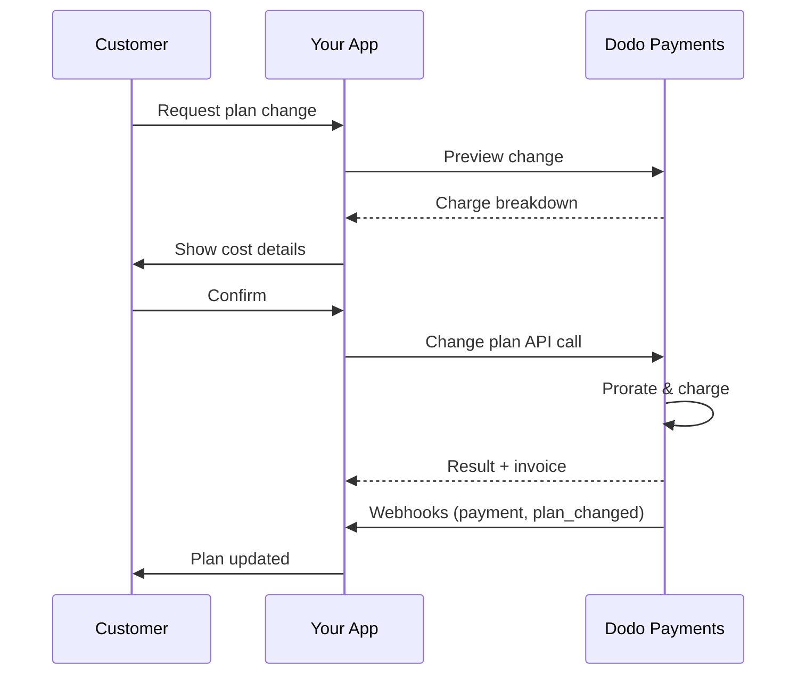
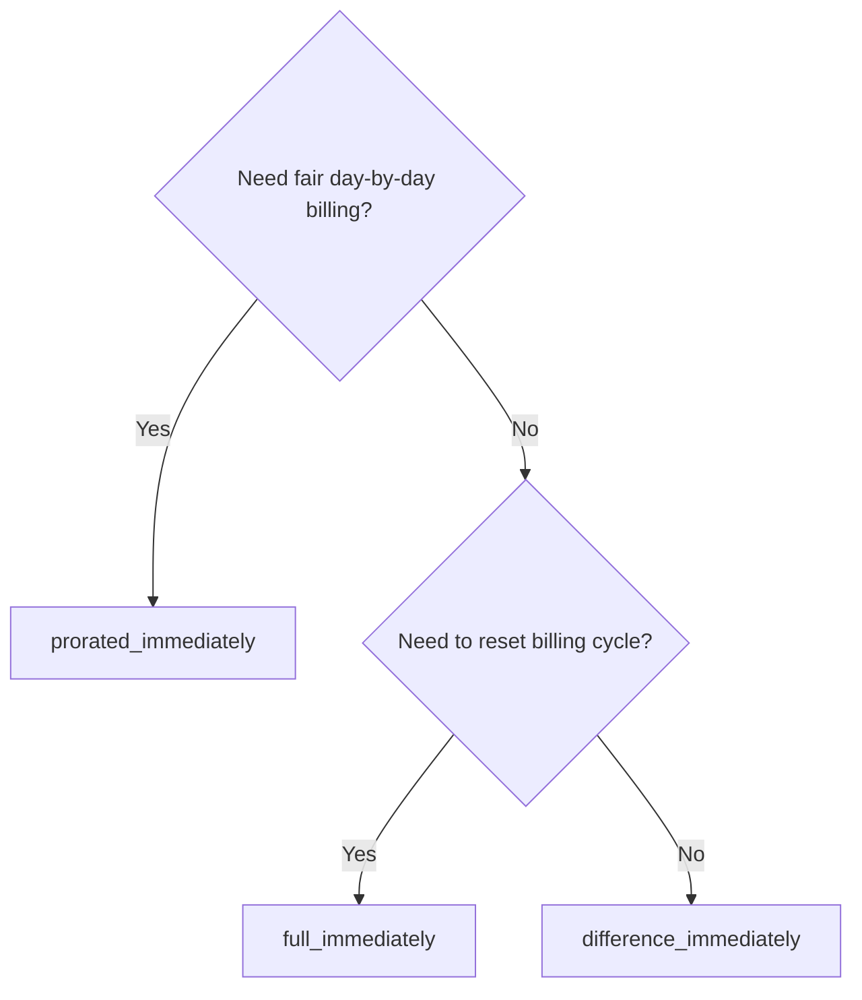
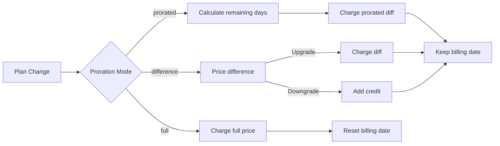

{/* LOCKED_PATTERN_6d744560e4135463c359b094ae69cd5f */}
{/* LOCKED_PATTERN_e019618386b2aca726eb1801e3e74076 */}
  Documentation API complète pour la mise à jour des abonnements.
</Card>
{/* LOCKED_PATTERN_1e8b2499d330dcc44e5e284a3600fd11 */}
  Consultez les montants facturés avant de modifier les offres.
</Card>
{/* LOCKED_PATTERN_782a37ccd4cc5a4159c5497e7f1d4c54 */}
  Configuration de l'abonnement étape par étape.
</Card>
</CardGroup>

## Qu'est-ce qu'une mise à niveau ou une rétrogradation d'abonnement ?

Modifier un plan permet de déplacer un client entre différents niveaux ou quantités d'abonnement. Utilisez-le pour :
- Adapter les tarifs à l'utilisation ou aux fonctionnalités
- Passer de mensuel à annuel (ou inversement)
- Ajuster la quantité pour les produits basés sur les sièges

<Info>
Les changements de plan peuvent déclencher une facturation immédiate selon le mode de prorata choisi.
</Info>

## Quand utiliser les changements de plan

- Mettre à niveau lorsqu'un client a besoin de plus de fonctionnalités, d'utilisation ou de sièges
- Rétrograder lorsque l'utilisation diminue
- Migrer les utilisateurs vers un nouveau produit ou tarif sans annuler leur abonnement

## Flux de changement de plan



## Prérequis

Avant de mettre en œuvre des changements de plan d'abonnement, assurez-vous d'avoir :

- Un compte marchand Dodo Payments avec des produits d'abonnement actifs
- Des identifiants API (clé API et clé secrète de webhook) depuis le tableau de bord
- Un abonnement actif existant à modifier
- Un point de terminaison de webhook configuré pour gérer les événements d'abonnement

<Info>
Pour des instructions d'installation détaillées, consultez notre [Guide d'intégration](/developer-resources/integration-guide#dashboard-setup).
</Info>

## Guide de Mise en Œuvre Étape par Étape

Suivez ce guide complet pour mettre en œuvre des changements de plan d'abonnement dans votre application :

<Steps>
{/* LOCKED_PATTERN_b0d6d45bb453480975a9fb2d18d04caf */}
Avant de mettre en œuvre, déterminez :
- Quels produits d'abonnement peuvent être changés vers quels autres
- Quel mode de prorata convient à votre modèle commercial
- Comment gérer élégamment les changements de plan échoués
- Quels événements webhook suivre pour la gestion d'état

<Tip>
Testez soigneusement les changements de plan en mode test avant de les déployer en production.
</Tip>
</Step>

{/* LOCKED_PATTERN_44f780199a4b76d6c063b33d8f599e9a */}
Choisissez l'approche de facturation qui correspond aux besoins de votre entreprise :

<Tabs>
<Tab title="prorated_immediately">
Idéal pour : les applications SaaS qui souhaitent facturer équitablement le temps inutilisé
- Calcule le montant exact au prorata en fonction du temps restant du cycle
- Facture un montant au prorata basé sur le temps inutilisé restant dans le cycle
- Offre une facturation transparente aux clients
</Tab>

<Tab title="difference_immediately">
Idéal pour : les scénarios d'augmentation ou de diminution clairs
- Mise à niveau : facturer immédiatement la différence (par ex. 30 $→80 $ = facturation de 50 $)
- Rétrogradation : créditer la valeur restante pour les futurs renouvellements
- Simplifie la logique de facturation et la communication client
</Tab>

<Tab title="full_immediately">
Idéal pour : lorsque vous souhaitez réinitialiser le cycle de facturation
- Facture immédiatement le montant total du nouveau plan
- Ignore le temps restant du plan précédent
- Utile pour les transitions d'annuel à mensuel
</Tab>
</Tabs>
</Step>

{/* LOCKED_PATTERN_62685552c5becb87cfeddbb400a3e69b */}
Utilisez l'API de changement de plan pour modifier les détails d'un abonnement :

<ParamField path="subscription_id" type="string" required>
L'ID de l'abonnement actif à modifier.
</ParamField>

<ParamField path="product_id" type="string" required>
Le nouvel ID de produit vers lequel changer l'abonnement.
</ParamField>

<ParamField path="quantity" type="integer" default="1">
Nombre d'unités pour le nouveau plan (pour les produits basés sur les sièges).
</ParamField>

<ParamField path="proration_billing_mode" type="string" required>
Comment gérer la facturation immédiate : `prorated_immediately`, `full_immediately` ou `difference_immediately`.
</ParamField>

<ParamField path="addons" type="array">
Modules complémentaires facultatifs pour le nouveau plan. Laisser vide supprime tout module complémentaire existant.
</ParamField>

{/* LOCKED_PATTERN_dbe6ce0c854d65ccfe8e10a6cd58e3a8 */}
Contrôle le comportement lorsque le paiement du changement de plan échoue :
- `prevent_change` : maintenir l'abonnement sur le plan actuel jusqu'à la réussite du paiement
- `apply_change` (par défaut) : appliquer immédiatement le changement de plan quel que soit le résultat du paiement

Si non spécifié, utilise le paramètre par défaut au niveau de l'entreprise.
</ParamField>
</Step>

{/* LOCKED_PATTERN_5c8c73c93c2f49c93ec60fbfa164dd3a */}
Configurez la gestion des webhooks pour suivre les résultats des changements de plan :

- `subscription.active` : changement de plan réussi, abonnement mis à jour
- `subscription.plan_changed` : plan d'abonnement modifié (mise à niveau/rétrogradation/mise à jour des modules complémentaires)
- `subscription.on_hold` : facturation du changement de plan échouée, abonnement suspendu
- `payment.succeeded` : facturation immédiate du changement de plan réussie
- `payment.failed` : facturation immédiate échouée

<Warning>
Vérifiez toujours les signatures webhook et implémentez un traitement idempotent des événements.
</Warning>
</Step>

{/* LOCKED_PATTERN_df7c84793753eaba82a0d637e200faa6 */}
En fonction des événements webhook, mettez à jour votre application :
- Accorder/révoquer des fonctionnalités en fonction du nouveau plan
- Mettre à jour le tableau de bord client avec les détails du nouveau plan
- Envoyer des e-mails de confirmation concernant les changements de plan
- Enregistrer les modifications de facturation à des fins d'audit
</Step>

{/* LOCKED_PATTERN_bee75f9c04c9720f2dc211cbed62a7c6 */}
Testez minutieusement votre implémentation :
- Testez tous les modes de prorata avec différents scénarios
- Vérifiez que la gestion des webhooks fonctionne correctement
- Surveillez les taux de réussite des changements de plan
- Configurez des alertes pour les changements de plan échoués
<Check>

<Check>
Votre implémentation de changement de plan d'abonnement est maintenant prête pour une utilisation en production.
</Check>
</Step>
</Steps>

## Prévisualiser les changements de plan

Avant de confirmer un changement de plan, utilisez l'API de prévisualisation pour montrer aux clients exactement ce qui leur sera facturé :

<Tabs>
{/* LOCKED_PATTERN_573fa7de86a9721b274af7c1d996a8cf */}

```javascript
const preview = await client.subscriptions.previewChangePlan('sub_123', {
  product_id: 'prod_pro',
  quantity: 1,
  proration_billing_mode: 'prorated_immediately'
});

// Show customer the charge before confirming
console.log('Immediate charge:', preview.immediate_charge.summary);
console.log('New plan details:', preview.new_plan);
```

</Tab>

{/* LOCKED_PATTERN_ddd4e9e5c4aa7b97d8e7e84baf4f5d90 */}

```python
preview = client.subscriptions.preview_change_plan(
    subscription_id="sub_123",
    product_id="prod_pro",
    quantity=1,
    proration_billing_mode="prorated_immediately"
)

# Show customer the charge before confirming
print("Immediate charge:", preview.immediate_charge.summary)
print("New plan details:", preview.new_plan)
```

</Tab>
</Tabs>

<Tip>
Utilisez l'API de prévisualisation pour créer des boîtes de dialogue de confirmation qui montrent aux clients le montant exact qu'ils seront facturés avant qu'ils ne confirment un changement de plan.
</Tip>

## API de changement de plan

Utilisez l'API de changement de plan pour modifier le produit, la quantité et le comportement de prorata d'un abonnement actif.

### Exemples de démarrage rapide

<Tabs>
  {/* LOCKED_PATTERN_573fa7de86a9721b274af7c1d996a8cf */}

    ```javascript
    import DodoPayments from 'dodopayments';

    const client = new DodoPayments({
      bearerToken: process.env.DODO_PAYMENTS_API_KEY,
      environment: 'test_mode', // defaults to 'live_mode'
    });

    async function changePlan() {
      const result = await client.subscriptions.changePlan('sub_123', {
        product_id: 'prod_new',
        quantity: 3,
        proration_billing_mode: 'prorated_immediately',
        on_payment_failure: 'prevent_change', // Optional: control behavior on payment failure
      });
      console.log(result.status, result.invoice_id, result.payment_id);
    }

    changePlan();
    ```

  </Tab>
  {/* LOCKED_PATTERN_ddd4e9e5c4aa7b97d8e7e84baf4f5d90 */}

    ```python
    import os
    from dodopayments import DodoPayments

    client = DodoPayments(
        bearer_token=os.environ.get("DODO_PAYMENTS_API_KEY"),
        environment="test_mode",  # defaults to "live_mode"
    )

    result = client.subscriptions.change_plan(
        subscription_id="sub_123",
        product_id="prod_new",
        quantity=3,
        proration_billing_mode="prorated_immediately",
        on_payment_failure="prevent_change",  # Optional: control behavior on payment failure
    )
    print(result.status, result.get("invoice_id"), result.get("payment_id"))
    ```

  </Tab>
  {/* LOCKED_PATTERN_99967a329f56c2cf8e8bdc3c71d1dcc5 */}

    ```go
    package main

    import (
      "context"
      "fmt"
      "github.com/dodopayments/dodopayments-go"
      "github.com/dodopayments/dodopayments-go/option"
    )

    func main() {
      client := dodopayments.NewClient(option.WithBearerToken("YOUR_TOKEN"))
      res, err := client.Subscriptions.ChangePlan(context.TODO(), dodopayments.SubscriptionChangePlanParams{
        SubscriptionID: dodopayments.F("sub_123"),
        ProductID:             dodopayments.F("prod_new"),
        Quantity:              dodopayments.F(int64(3)),
        ProrationBillingMode:  dodopayments.F(dodopayments.SubscriptionChangePlanParamsProrationBillingModeProratedImmediately),
        OnPaymentFailure:      dodopayments.F(dodopayments.OnPaymentFailurePreventChange), // Optional
      })
      if err != nil { panic(err) }
      fmt.Println(res.Status, res.InvoiceID, res.PaymentID)
    }
    ```

  </Tab>
  <Tab title="HTTP">

    ```bash
    curl -X POST "$DODO_API_BASE/subscriptions/sub_123/change-plan" \
      -H "Authorization: Bearer $DODO_PAYMENTS_API_KEY" \
      -H "Content-Type: application/json" \
      -d '{
        "product_id": "prod_new",
        "quantity": 3,
        "proration_billing_mode": "prorated_immediately",
        "on_payment_failure": "prevent_change"
      }'
    ```

  </Tab>
</Tabs>

```json Success
{
  "status": "processing",
  "subscription_id": "sub_123",
  "invoice_id": "inv_789",
  "payment_id": "pay_456",
  "proration_billing_mode": "prorated_immediately"
}
```

<Note>
Des champs comme <code>invoice_id</code> et <code>payment_id</code> ne sont renvoyés que lorsqu'une facturation immédiate et/ou une facture est créée lors du changement de plan. Fiez-vous toujours aux événements webhook (par ex. <code>payment.succeeded</code>, <code>subscription.plan_changed</code>) pour confirmer les résultats.
</Note>

<Warning>
Si la facturation immédiate échoue, l'abonnement peut passer à `subscription.on_hold` jusqu'à ce que le paiement réussisse.
</Warning>

## Gestion des modules complémentaires

Lors du changement de plan d'abonnement, vous pouvez également modifier les modules complémentaires :

```javascript
// Add addons to the new plan
await client.subscriptions.changePlan('sub_123', {
  product_id: 'prod_new',
  quantity: 1,
  proration_billing_mode: 'difference_immediately',
  addons: [
    { addon_id: 'addon_123', quantity: 2 }
  ]
});

// Remove all existing addons
await client.subscriptions.changePlan('sub_123', {
  product_id: 'prod_new',
  quantity: 1,
  proration_billing_mode: 'difference_immediately',
  addons: [] // Empty array removes all existing addons
});
```

<Info>
Les modules complémentaires sont inclus dans le calcul de prorata et seront facturés selon le mode de prorata sélectionné.
</Info>

## Modes de prorata

Choisissez comment facturer le client lors du changement de plan :

#### `prorated_immediately`
- Facture la différence partielle dans le cycle en cours
- En période d'essai, facture immédiatement et bascule sur le nouveau plan maintenant
- Rétrogradation : peut générer un crédit au prorata appliqué aux renouvellements futurs

#### `full_immediately`
- Facture immédiatement le montant total du nouveau plan
- Ignore le temps restant du plan précédent

<Info>
Les crédits créés par les rétrogradations utilisant <code>difference_immediately</code> ont une portée sur l'abonnement et sont distincts des <a href="/features/customer-credit">crédits client</a>. Ils s'appliquent automatiquement aux renouvellements futurs du même abonnement et ne sont pas transférables entre abonnements.
</Info>

#### `difference_immediately`
- Mise à niveau : facturer immédiatement la différence de prix entre les anciens et nouveaux plans
- Rétrogradation : ajouter la valeur restante comme crédit interne à l'abonnement et l'appliquer automatiquement lors des renouvellements

| Fonctionnalité | `prorated_immediately` | `difference_immediately` | `full_immediately` |
|---------|----------------------|------------------------|-------------------|
| **Facturation en cas de montée en gamme** | Différence proratisée pour les jours restants | Différence de prix totale entre les plans | Prix total du nouveau plan |
| **Crédit en cas de rétrogradation** | Crédit proratisé pour les jours restants | Différence de prix totale en tant que crédit | Aucun crédit |
| **Cycle de facturation** | Inchangé | Inchangé | Réinitialise à aujourd'hui |
| **Comportement pendant l'essai** | Met fin à l'essai, facture immédiatement | Met fin à l'essai, facture immédiatement | Met fin à l'essai, facture le montant total |
| **Idéal pour** | Facturation équitable basée sur le temps | Calcul simple pour mises à niveau/rétrogradations | Réinitialisation des cycles de facturation |
| **Complexité** | Moyenne (calcul par jour) | Faible (soustraction simple) | Faible (facturation complète) |



### Scénarios exemples

Utilisez ces chiffres canoniques de manière cohérente :
- Plan actuel : **Basic** à **30 $/mois**
- Objectif de montée en gamme : **Pro** à **80 $/mois**
- Objectif de rétrogradation (depuis Pro) : **Starter** à **20 $/mois**
- Cycle de facturation : **30 jours**, débuté le **1er janvier**
- Le changement de plan a lieu le **16 janvier** (15 jours restants, 15 jours utilisés)

<AccordionGroup>
  {/* LOCKED_PATTERN_1a58b4dbcc060de029ff28c82c80a6fe */}

    ```
    Step 1: Calculate unused credit from current plan
      Unused days = 15 out of 30 days
      Credit = $30 × (15/30) = $15.00

    Step 2: Calculate prorated cost of new plan
      Remaining days = 15 out of 30 days
      New plan cost = $80 × (15/30) = $40.00

    Step 3: Calculate immediate charge
      Charge = New plan cost − Credit
      Charge = $40.00 − $15.00 = $25.00

    → Customer pays $25.00 now
    → Next renewal (Feb 1): $80.00/month
    ```

    ```javascript
    await client.subscriptions.changePlan('sub_123', {
      product_id: 'prod_pro',
      quantity: 1,
      proration_billing_mode: 'prorated_immediately'
    })
    ```

  </Accordion>

  {/* LOCKED_PATTERN_807a82fa1b52ee9a606ce1f9c1d8b613 */}

    ```
    Step 1: Calculate unused credit from current plan
      Unused days = 15 out of 30 days
      Credit = $80 × (15/30) = $40.00

    Step 2: Calculate prorated cost of new plan
      Remaining days = 15 out of 30 days
      New plan cost = $20 × (15/30) = $10.00

    Step 3: Calculate credit balance
      Credit = $40.00 − $10.00 = $30.00

    → No charge — $30.00 credit added to subscription
    → Credit auto-applies to future renewals
    → Next renewal (Feb 1): $20.00 − $30.00 credit = $0.00
    → Following renewal (Mar 1): $20.00 − $10.00 remaining credit = $10.00
    ```

    ```javascript
    await client.subscriptions.changePlan('sub_123', {
      product_id: 'prod_starter',
      quantity: 1,
      proration_billing_mode: 'prorated_immediately'
    })
    ```

  </Accordion>

  {/* LOCKED_PATTERN_67905dd0e892a1412bd0f1a567dd0a62 */}

    ```
    Immediate charge = New plan price − Old plan price
                     = $80 − $30
                     = $50.00

    → Customer pays $50.00 now (regardless of cycle position)
    → Next renewal (Feb 1): $80.00/month
    ```

    ```javascript
    await client.subscriptions.changePlan('sub_123', {
      product_id: 'prod_pro',
      quantity: 1,
      proration_billing_mode: 'difference_immediately'
    })
    ```

  </Accordion>

  {/* LOCKED_PATTERN_b17ed67d3062fadb798904adf781b844 */}

    ```
    Credit = Old plan price − New plan price
           = $80 − $20
           = $60.00

    → No charge — $60.00 credit added to subscription
    → Credit auto-applies to future renewals
    → Next renewal: $20.00 − $20.00 (from credit) = $0.00
    → Following renewal: $20.00 − $20.00 (from credit) = $0.00
    → Third renewal: $20.00 − $20.00 (from remaining credit) = $0.00
    ```

    ```javascript
    await client.subscriptions.changePlan('sub_123', {
      product_id: 'prod_starter',
      quantity: 1,
      proration_billing_mode: 'difference_immediately'
    })
    ```

  </Accordion>

  {/* LOCKED_PATTERN_0cb1a5657302a3970059ca925841dcd5 */}

    ```
    Immediate charge = Full new plan price = $80.00

    → Customer pays $80.00 now
    → No credit for unused time on old plan
    → Billing cycle resets to today (January 16)
    → Next renewal: February 16 at $80.00/month
    ```

    ```javascript
    await client.subscriptions.changePlan('sub_123', {
      product_id: 'prod_pro',
      quantity: 1,
      proration_billing_mode: 'full_immediately'
    })
    ```

  </Accordion>

  {/* LOCKED_PATTERN_6edab7762bdaeaf6cef5f85bafdb8832 */}

    ```
    Current: Basic plan ($30/month), no add-ons
    New: Pro plan ($80/month) + Extra Seats add-on ($10/seat × 3 seats = $30/month)
    Change on day 16 of 30 (15 days remaining)

    Step 1: Credit from current plan
      Credit = $30 × (15/30) = $15.00

    Step 2: Prorated cost of new plan + add-ons
      New plan = $80 × (15/30) = $40.00
      Add-ons = $30 × (15/30) = $15.00
      Total new = $55.00

    Step 3: Immediate charge
      Charge = $55.00 − $15.00 = $40.00

    → Customer pays $40.00 now
    → Next renewal: $80.00 + $30.00 = $110.00/month
    ```

    ```javascript
    await client.subscriptions.changePlan('sub_123', {
      product_id: 'prod_pro',
      quantity: 1,
      proration_billing_mode: 'prorated_immediately',
      addons: [
        { addon_id: 'addon_seats', quantity: 3 }
      ]
    })
    ```

  </Accordion>
</AccordionGroup>

### Comment chaque mode traite la facturation



<Tip>
Choisissez `prorated_immediately` pour une comptabilité équitable basée sur le temps ; optez pour `full_immediately` pour redémarrer la facturation ; utilisez `difference_immediately` pour des mises à niveau simples et un crédit automatique sur les rétrogradations.
</Tip>

## Gestion des échecs de paiement

Contrôlez ce qui se passe lorsque le paiement d'un changement de plan échoue en utilisant le paramètre `on_payment_failure`.

### Modes d'échec de paiement

<Tabs>
{/* LOCKED_PATTERN_9a289e347ae0d2762cd8b5bae425d96d */}
**Comportement** : Maintenir l'abonnement sur son plan actuel jusqu'à la réussite du paiement.

- Le changement de plan est marqué comme « en attente »
- Le client conserve l'accès à son plan actuel
- L'abonnement passe à l'état `active` seulement après un paiement réussi
- Utile lorsque vous souhaitez garantir le paiement avant d'accorder des fonctionnalités améliorées

```javascript
await client.subscriptions.changePlan('sub_123', {
  product_id: 'prod_pro',
  quantity: 1,
  proration_billing_mode: 'prorated_immediately',
  on_payment_failure: 'prevent_change'
});
```

</Tab>

{/* LOCKED_PATTERN_389bf4efb62466ceba65070629169973 */}
**Comportement** : Appliquer immédiatement le changement de plan quel que soit le résultat du paiement.

- Le changement de plan est appliqué même si le paiement échoue
- Le client accède immédiatement au nouveau plan
- L'abonnement peut passer à `on_hold` si le paiement échoue
- Idéal pour les mises à niveau non critiques ou lorsque vous faites confiance au client

```javascript
await client.subscriptions.changePlan('sub_123', {
  product_id: 'prod_pro',
  quantity: 1,
  proration_billing_mode: 'prorated_immediately',
  on_payment_failure: 'apply_change' // This is the default
});
```

</Tab>
</Tabs>

<Info>
Si non spécifié, le paramètre `on_payment_failure` utilise le réglage par défaut au niveau de l'entreprise configuré dans le tableau de bord.
</Info>

### Quand utiliser chaque mode

| Scénario | Mode recommandé | Raison |
|----------|------------------|--------|
| Montée en gamme vers des fonctionnalités premium | `prevent_change` | Garantir le paiement avant d'accorder l'accès |
| Augmentation de quantité (plus de sièges) | `prevent_change` | Empêcher l'utilisation sans paiement |
| Rétrogradation de plans | `apply_change` | Le client réduit ses dépenses |
| Clients d'entreprise de confiance | `apply_change` | Risque de non-paiement plus faible |
| Conversion de l'essai vers payant | `prevent_change` | Moment critique pour le paiement |

## Gestion des webhooks

Suivez l'état des abonnements via les webhooks pour confirmer les changements de plan et les paiements.

### Types d'événements à gérer
- `subscription.active` : abonnement activé
- `subscription.plan_changed` : plan d'abonnement modifié (mise à niveau/rétrogradation/modifications de modules complémentaires)
- `subscription.on_hold` : facturation échouée, abonnement suspendu
- `subscription.renewed` : renouvellement réussi
- `payment.succeeded` : paiement pour un changement de plan ou un renouvellement réussi
- `payment.failed` : paiement échoué

<Info>
Nous recommandons de baser la logique métier sur les événements d'abonnement et d'utiliser les événements de paiement pour la confirmation et la réconciliation.
</Info>

### Vérifiez les signatures et gérez les intentions

<Tabs>
  {/* LOCKED_PATTERN_ad56e9578b99d8d029bf3ec794be6fc4 */}

    ```javascript
    import { NextRequest, NextResponse } from 'next/server';
    
    export async function POST(req) {
      const webhookId = req.headers.get('webhook-id');
      const webhookSignature = req.headers.get('webhook-signature');
      const webhookTimestamp = req.headers.get('webhook-timestamp');
      const secret = process.env.DODO_WEBHOOK_SECRET;
    
      const payload = await req.text();
      // verifySignature is a placeholder – in production, use a Standard Webhooks library
      const { valid, event } = await verifySignature(
        payload,
        { id: webhookId, signature: webhookSignature, timestamp: webhookTimestamp },
        secret
      );
      if (!valid) return NextResponse.json({ error: 'Invalid signature' }, { status: 400 });
    
      switch (event.type) {
        case 'subscription.active':
          // mark subscription active in your DB
          break;
        case 'subscription.plan_changed':
          // refresh entitlements and reflect the new plan in your UI
          break;
        case 'subscription.on_hold':
          // notify user to update payment method
          break;
        case 'subscription.renewed':
          // extend access window
          break;
        case 'payment.succeeded':
          // reconcile payment for plan change
          break;
        case 'payment.failed':
          // log and alert
          break;
        default:
          // ignore unknown events
          break;
      }
    
      return NextResponse.json({ received: true });
    }
    ```

  </Tab>
  <Tab title="Express.js">

    ```javascript
    import express from 'express';
    
    const app = express();
    app.post('/webhooks/dodo', express.raw({ type: 'application/json' }), async (req, res) => {
      const webhookId = req.header('webhook-id');
      const webhookSignature = req.header('webhook-signature');
      const webhookTimestamp = req.header('webhook-timestamp');
      const secret = process.env.DODO_WEBHOOK_SECRET;
      const payload = req.body.toString('utf8');
    
      const { valid, event } = await verifySignature(
        payload,
        { id: webhookId, signature: webhookSignature, timestamp: webhookTimestamp },
        secret
      );
      if (!valid) return res.status(400).send('Invalid signature');
    
      // handle events like above
      res.json({ received: true });
    });
    
    app.listen(3000);
    ```

  </Tab>
</Tabs>

<Note>
Pour des schémas de charge utile détaillés, consultez les <a href="/developer-resources/webhooks/intents/subscription">charges utiles des webhooks d'abonnement</a> et les <a href="/developer-resources/webhooks/intents/payment">charges utiles des webhooks de paiement</a>.
</Note>

## Meilleures pratiques

Suivez ces recommandations pour des changements de plan d'abonnement fiables :

### Stratégie de changement de plan
- **Tester en profondeur** : testez toujours les changements de plan en mode test avant la production
- **Choisir le prorata avec soin** : sélectionnez le mode de prorata qui correspond à votre modèle commercial
- **Gérer les échecs élégamment** : implémentez une gestion des erreurs et une logique de nouvelle tentative appropriées
- **Surveiller les taux de réussite** : suivez les taux de réussite/échec des changements de plan et investiguez les problèmes

### Mise en œuvre des webhooks
- **Vérifier les signatures** : validez toujours les signatures webhook pour garantir l'authenticité
- **Implémenter l'idempotence** : gérez les événements webhook en double de manière élégante
- **Traiter de manière asynchrone** : n'encombrez pas les réponses webhook avec des opérations lourdes
- **Tout enregistrer** : conservez des journaux détaillés pour le débogage et l'audit

### Expérience utilisateur
- **Communiquer clairement** : informez les clients des changements et de leur calendrier
- **Fournir des confirmations** : envoyez des e-mails de confirmation pour les changements de plan réussis
- **Gérer les cas limites** : prenez en compte les périodes d'essai, les prorata et les paiements échoués
- **Mettre à jour l'interface immédiatement** : reflétez les changements de plan dans votre interface applicative

## Problèmes courants et solutions

Résolvez les problèmes typiques rencontrés lors des changements de plan d'abonnement :

<AccordionGroup>
{/* LOCKED_PATTERN_112861435a085998aa537e347e24f368 */}
**Symptômes** : l'appel API réussit mais l'abonnement reste sur l'ancien plan

**Causes fréquentes** :
- Le traitement du webhook a échoué ou a été retardé
- L'état de l'application n'a pas été mis à jour après réception des webhooks
- Problèmes de transaction de base de données lors de la mise à jour de l'état

**Solutions** :
- Mettez en place une gestion robuste des webhooks avec une logique de nouvelle tentative
- Utilisez des opérations idempotentes pour les mises à jour d'état
- Ajoutez une surveillance pour détecter et alerter sur les événements webhook manqués
- Vérifiez que le point de terminaison webhook est accessible et répond correctement
</Accordion>

{/* LOCKED_PATTERN_653656c823b0f191581a523ab18f0f3f */}
**Symptômes** : le client rétrograde mais ne voit pas le solde de crédit

**Causes fréquentes** :
- Attentes liées au mode de prorata : les rétrogradations créditent la différence totale de prix avec `difference_immediately`, tandis qu'`prorated_immediately` crée un crédit proratisé basé sur le temps restant dans le cycle
- Les crédits sont spécifiques à l'abonnement et ne se transfèrent pas entre abonnements
- Le solde de crédit n'est pas visible dans le tableau de bord client

**Solutions** :
- Utilisez `difference_immediately` pour les rétrogradations lorsque vous souhaitez des crédits automatiques
- Expliquez aux clients que les crédits s'appliquent aux renouvellements futurs du même abonnement
- Mettez en place un portail client pour afficher les soldes de crédits
- Vérifiez la prévisualisation de la prochaine facture pour voir les crédits appliqués
</Accordion>

{/* LOCKED_PATTERN_1b0516ec68b4083dc4d6ae9b330f3f1a */}
**Symptômes** : les événements webhook sont rejetés à cause d'une signature invalide

**Causes fréquentes** :
- Clé secrète webhook incorrecte
- Corps de requête brut modifié avant la vérification de la signature
- Mauvais algorithme de vérification de signature

**Solutions** :
- Vérifiez que vous utilisez la bonne `DODO_WEBHOOK_SECRET` depuis le tableau de bord
- Lisez le corps de la requête brut avant tout middleware d'analyse JSON
- Utilisez la bibliothèque standard de vérification des webhooks pour votre plateforme
- Testez la vérification de la signature webhook en environnement de développement
</Accordion>

{/* LOCKED_PATTERN_638d7c911003cceda8c7d34ff8a2c381 */}
**Symptômes** : l'API renvoie une erreur 422 Entité non traitable

**Causes fréquentes** :
- ID d'abonnement ou de produit invalide
- Abonnement non actif
- Paramètres requis manquants
- Produit non disponible pour les changements de plan

**Solutions** :
- Vérifiez que l'abonnement existe et est actif
- Vérifiez que l'ID du produit est valide et disponible
- Assurez-vous que tous les paramètres requis sont fournis
- Consultez la documentation de l'API pour les exigences de paramètres
</Accordion>

{/* LOCKED_PATTERN_7917a64bf4b26c933f2e4649e9278a56 */}
**Symptômes** : le changement de plan est lancé mais la facturation immédiate échoue

**Causes fréquentes** :
- Fonds insuffisants sur le moyen de paiement du client
- Moyen de paiement expiré ou invalide
- La banque a refusé la transaction
- La détection de fraude a bloqué la facturation

**Solutions** :
- Gérez correctement les événements `payment.failed`
- Informez le client de mettre à jour son moyen de paiement
- Implémentez une logique de nouvelle tentative pour les échecs temporaires
- Envisagez d'autoriser les changements de plan malgré les facturations immédiates échouées
</Accordion>

{/* LOCKED_PATTERN_20276630e99e95ac9f5cdd0b347713bb */}
**Symptômes** : la facturation du changement de plan échoue et l'abonnement passe à l'état `on_hold`

**Ce qui se passe** :
Lorsque la facturation d'un changement de plan échoue, l'abonnement est automatiquement placé dans l'état `on_hold`. Il ne sera pas renouvelé automatiquement tant que le moyen de paiement n'est pas mis à jour.

**Solution** : mettez à jour le moyen de paiement pour réactiver l'abonnement

Pour réactiver un abonnement depuis l'état `on_hold` après un changement de plan échoué :

1. **Mettez à jour le moyen de paiement** en utilisant l'API de mise à jour du moyen de paiement
2. **Création automatique de la facture** : l'API crée automatiquement une facture pour les sommes restantes
3. **Génération de facture** : une facture est générée pour la facturation
4. **Traitement du paiement** : le paiement est traité avec le nouveau moyen de paiement
5. **Réactivation** : après un paiement réussi, l'abonnement est réactivé à l'état `active`

<CodeGroup>

```javascript Node.js
// Reactivate subscription from on_hold after failed plan change
async function reactivateAfterFailedPlanChange(subscriptionId) {
  // Update payment method - automatically creates charge for remaining dues
  const response = await client.subscriptions.updatePaymentMethod(subscriptionId, {
    type: 'new',
    return_url: 'https://example.com/return'
  });
  
  if (response.payment_id) {
    console.log('Charge created for remaining dues:', response.payment_id);
    console.log('Payment link:', response.payment_link);
    
    // Redirect customer to payment_link to complete payment
    // Monitor webhooks for:
    // 1. payment.succeeded - charge succeeded
    // 2. subscription.active - subscription reactivated
  }
  
  return response;
}

// Or use existing payment method if available
async function reactivateWithExistingPaymentMethod(subscriptionId, paymentMethodId) {
  const response = await client.subscriptions.updatePaymentMethod(subscriptionId, {
    type: 'existing',
    payment_method_id: paymentMethodId
  });
  
  // Monitor webhooks for payment.succeeded and subscription.active
  return response;
}
```

```python Python
# Reactivate subscription from on_hold after failed plan change
def reactivate_after_failed_plan_change(subscription_id):
    # Update payment method - automatically creates charge for remaining dues
    response = client.subscriptions.update_payment_method(
        subscription_id=subscription_id,
        type="new",
        return_url="https://example.com/return"
    )
    
    if response.payment_id:
        print("Charge created for remaining dues:", response.payment_id)
        print("Payment link:", response.payment_link)
        
        # Redirect customer to payment_link to complete payment
        # Monitor webhooks for:
        # 1. payment.succeeded - charge succeeded
        # 2. subscription.active - subscription reactivated
    
    return response

# Or use existing payment method if available
def reactivate_with_existing_payment_method(subscription_id, payment_method_id):
    response = client.subscriptions.update_payment_method(
        subscription_id=subscription_id,
        type="existing",
        payment_method_id=payment_method_id
    )
    
    # Monitor webhooks for payment.succeeded and subscription.active
    return response
```

</CodeGroup>

**Événements webhook à surveiller** :
- `subscription.on_hold` : abonnement mis en attente (reçu lorsque la facturation du changement de plan échoue)
- `payment.succeeded` : paiement des sommes restantes réussi (après mise à jour du moyen de paiement)
- `subscription.active` : abonnement réactivé après un paiement réussi

**Meilleures pratiques** :
- Informez immédiatement les clients lorsqu'une facturation de changement de plan échoue
- Fournissez des instructions claires pour mettre à jour leur moyen de paiement
- Surveillez les événements webhook pour suivre le statut de réactivation
- Envisagez d'implémenter une logique de nouvelle tentative automatique pour les échecs de paiement temporaires

{/* LOCKED_PATTERN_d215ea1d00e95d5e9d5b4b6085f2443f */}
Consultez la documentation API complète pour la mise à jour des moyens de paiement et la réactivation des abonnements.
</Card>
</Accordion>
</AccordionGroup>

## Tester votre implémentation

Suivez ces étapes pour tester minutieusement votre implémentation de changement de plan d'abonnement :

<Steps>
{/* LOCKED_PATTERN_f5ce79c6f425de558f6fdd6cea5793f5 */}
- Utilisez des clés API de test et des produits de test
- Créez des abonnements de test avec différents types de plans
- Configurez un point de terminaison webhook de test
- Configurez la surveillance et la journalisation
</Step>

{/* LOCKED_PATTERN_3705b8701c8873992c57281c42adf8d6 */}
- Testez `prorated_immediately` avec différentes positions du cycle de facturation
- Testez `difference_immediately` pour les montées et rétrogradations
- Testez `full_immediately` pour réinitialiser les cycles de facturation
- Vérifiez que les calculs de crédit sont corrects
</Step>

{/* LOCKED_PATTERN_9fb1eaf73e8951f61d7daf19366cdfdf */}
- Vérifiez que tous les événements webhook pertinents sont reçus
- Testez la vérification des signatures webhook
- Gérez élégamment les événements webhook en double
- Testez les scénarios d'échec du traitement webhook
</Step>

{/* LOCKED_PATTERN_7d448c9309210902a86e740b08deae34 */}
- Testez avec des IDs d'abonnement invalides
- Testez avec des moyens de paiement expirés
- Testez les défaillances réseau et les délais d'attente
- Testez avec des fonds insuffisants
</Step>

{/* LOCKED_PATTERN_099bec4eb7633497929a085e7b0160cd */}
- Configurez des alertes pour les changements de plan échoués
- Surveillez les temps de traitement des webhooks
- Suivez les taux de réussite des changements de plan
- Examinez les tickets du support client concernant les problèmes de changement de plan
</Step>
</Steps>

## Gestion des erreurs

Gérez élégamment les erreurs d'API courantes dans votre implémentation :

### Codes d'état HTTP

<AccordionGroup>
<Accordion title="200 OK">
La demande de changement de plan a été traitée avec succès. L'abonnement est en cours de mise à jour et le traitement du paiement a commencé.
</Accordion>

<Accordion title="400 Bad Request">
Paramètres de requête invalides. Vérifiez que tous les champs requis sont fournis et correctement formatés.
</Accordion>

{/* LOCKED_PATTERN_618fe88bddcc0059b0b92c4342a4dcfc */}
Clé API invalide ou manquante. Vérifiez que votre `DODO_PAYMENTS_API_KEY` est correcte et dispose des autorisations adéquates.
</Accordion>

<Accordion title="404 Not Found">
ID d'abonnement introuvable ou n'appartenant pas à votre compte.
</Accordion>

<Accordion title="422 Unprocessable Entity">
L'abonnement ne peut pas être modifié (par ex. déjà annulé, produit non disponible, etc.).
</Accordion>

<Accordion title="500 Internal Server Error">
Une erreur serveur est survenue. Réessayez la requête après un bref délai.
</Accordion>
</AccordionGroup>

### Format de réponse d'erreur

```json
{
  "error": {
    "code": "subscription_not_found",
    "message": "The subscription with ID 'sub_123' was not found",
    "details": {
      "subscription_id": "sub_123"
    }
  }
}
```

## Étapes suivantes

- Consultez l'<a href="/api-reference/subscriptions/change-plan">API de changement de plan</a>
- Explorez les <a href="/features/customer-credit">crédits client</a>
- Mettez en place des alertes pour `subscription.on_hold`
- Découvrez notre <a href="/developer-resources/webhooks">Guide d'intégration des webhooks</a>
