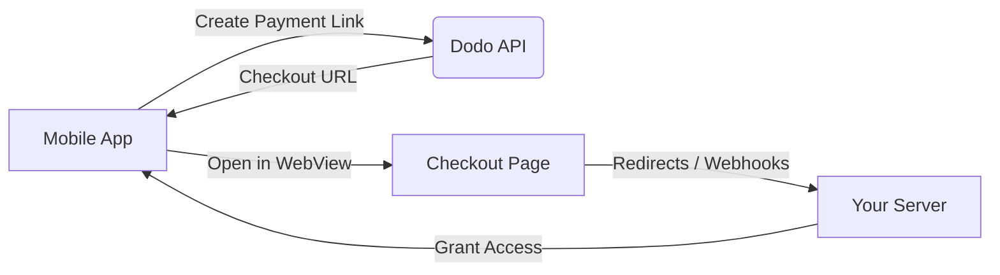

## Introduction

Dodo Payments permet aux développeurs de vendre des biens et services numériques dans des applications iOS, en gérant des aspects complexes tels que la conformité fiscale, la conversion de devises et les paiements. Ce guide complet détaille comment intégrer Dodo Payments dans votre application iOS, spécifiquement pour les outils SaaS, les abonnements de contenu et les utilitaires numériques.

## Aperçu

Dodo Payments agit en tant que **Marchand de Registre (MoR)**, gérant des aspects critiques de votre entreprise numérique :

<Tabs>
<Tab title="What We Handle">
- Collecte et reversement des taxes (VAT, GST et autres taxes régionales)
- Paiements mondiaux conformément aux politiques et aux méthodes de paiement locales
- Conversion de devises et échange de devises étrangères
- Contre-passations (chargebacks) et prévention des fraudes
- Facturation et reçus pour les clients finaux
- Conformité aux réglementations régionales
</Tab>

<Tab title="What You Get">
- Une API unifiée pour les plateformes web et mobiles
- Support des paiements intégrés (UPI, cartes, portefeuilles, BNPL)
- Prise en charge des paiements mondiaux (Payoneer, Wise, virements bancaires locaux)
- Tableau de bord d'analyse et de rapports
- Traitement sécurisé des paiements
</Tab>
</Tabs>

## Cas d'utilisation

<CardGroup cols={2}>
<Card title="Subscriptions" icon="repeat">
- Accès à du contenu ou à des fonctionnalités premium
- Facturation récurrente avec options flexibles, essais gratuits, prorata ou améliorations et rétrogradations
</Card>

<Card title="Courses and Learning" icon="graduation-cap">
- Accès au cours à la carte
- Packs de contenu groupé
- Licences à vie ou renouvelables
- Intégration du suivi de progression
</Card>

<Card title="Digital Downloads" icon="download">
- Achats ponctuels (PDF, musique, outils)
- Distribution d'actifs numériques
- Gestion des clés de licence
</Card>

<Card title="SaaS Tools" icon="screwdriver-wrench">
- Abonnements Software-as-a-Service
- Facturation à l'utilisation
- Offres pour équipes et entreprises
</Card>
</CardGroup>

## Flux d'intégration

Vous pouvez intégrer Dodo Payments dans votre application en utilisant notre solution de paiement hébergée ou de navigateur intégré.

### Étapes d'intégration

<Steps>
<Step title="Mobile App to Dodo API">
Le processus commence lorsque l'application mobile crée un lien de paiement en interagissant avec l'API Dodo.
</Step>

<Step title="Dodo API to Mobile App">
L'API Dodo répond en fournissant une URL de paiement à l'application mobile.
</Step>

<Step title="Mobile App to Checkout Page">
L'application mobile ouvre ensuite cette URL de paiement dans une WebView, conduisant l'utilisateur vers la page de paiement.
</Step>

<Step title="Checkout Page to Your Server">
Une fois le processus de paiement terminé, la page de paiement communique avec votre serveur via des redirections ou des webhooks.
</Step>

<Step title="Your Server to Mobile App">
Enfin, votre serveur accorde l'accès au contenu ou service acheté, complétant ainsi le cycle de transaction dans l'app mobile.
</Step>
</Steps>

<Card title="Mobile Integration Guide" icon="mobile" href="/developer-resources/mobile-integration">
Pour un guide complet destiné aux développeurs, explorez notre Mobile Integration Guide.
</Card>

## Disponibilité régionale

Dodo Payments permet des flux d'achat in-app alternatifs uniquement dans les régions de l'App Store où Apple autorise explicitement les paiements externes, ou là où un régulateur ou un ordre judiciaire l'exige.

### Régions prises en charge

<AccordionGroup>
<Accordion title="United States">
Pris en charge dans la mesure permise par les ordonnances judiciaires en vigueur et les directives mises à jour d'Apple.

- Disponible en vertu de dispositions spécifiques ordonnées par un tribunal
- Sous réserve du respect par Apple des exigences légales
- Doit suivre les directives de mise en œuvre d'Apple
</Accordion>

<Accordion title="European Union (EU) App Store">
Pris en charge via les Conditions alternatives de l'UE d'Apple et l'autorisation d'achat externe.

- Activé via les Conditions alternatives de l'UE d'Apple
- Nécessite l'approbation de l'autorisation d'achat externe
- Doit respecter les exigences du Digital Markets Act de l'UE
</Accordion>

<Accordion title="South Korea">
Pris en charge via l'autorisation d'achat externe StoreKit pour les binaires destinés uniquement à la Corée.

- Disponible via l'autorisation d'achat externe StoreKit
- Nécessite un binaire d'application spécifique à la Corée
- Doit se conformer à la loi coréenne sur les télécommunications
</Accordion>
</AccordionGroup>

<Warning>
Examinez toujours et respectez les autorisations spécifiques à chaque région d'Apple et les exigences d'App Store Connect avant d'activer Dodo Payments pour une boutique en ligne. L'utilisation de flux de paiement alternatifs dans des régions non prises en charge peut entraîner le rejet ou la suppression de l'application.
</Warning>

<Note>
Pour certains modèles commerciaux — comme les services ou certaines catégories de contenu — Apple peut ne pas exiger l'utilisation des achats intégrés (IAP). Dodo Payments prend également en charge ces modèles. Vérifiez toujours la classification de votre application et les dernières directives d'Apple pour déterminer si l'IAP est obligatoire pour votre cas d'utilisation.
</Note>

### En savoir plus

Pour une analyse détaillée des politiques mondiales, des précédents juridiques et des approches stratégiques pour contourner les frais de l'App Store, consultez notre guide complet :

<Card title="Bypassing App Store & Play Store Fees: A Strategic and Legal Playbook" icon="shield-check" href="/features/bypassing-app-store-fees">
Découvrez où et comment vous pouvez légalement mettre en œuvre des flux de paiement alternatifs, avec des conseils à jour par région et des recommandations de conformité.
</Card>