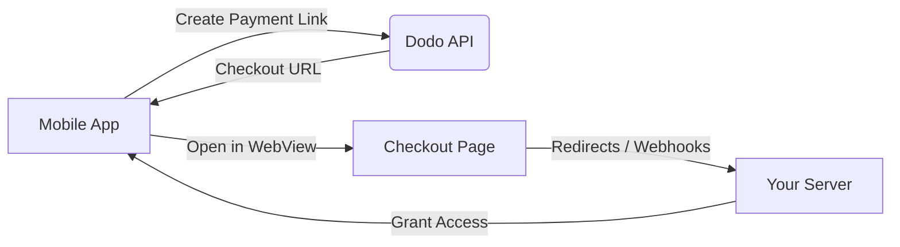

## Introduction

Dodo Payments permet aux développeurs de vendre des biens et services numériques dans des applications iOS, en gérant des aspects complexes tels que la conformité fiscale, la conversion de devises et les paiements. Ce guide complet détaille comment intégrer Dodo Payments dans votre application iOS, spécifiquement pour les outils SaaS, les abonnements de contenu et les utilitaires numériques.

## Aperçu

Dodo Payments agit en tant que **Marchand de Registre (MoR)**, gérant des aspects critiques de votre entreprise numérique :

<Tabs>
<Tab title="Ce que nous gérons">
- Collecte et versement des taxes (TVA, GST et autres taxes régionales)
- Paiements mondiaux selon les politiques et méthodes de paiement locales
- Conversion de devises et change
- Remboursements et prévention de la fraude
- Facturation et reçus pour le client final
- Conformité avec les réglementations régionales
</Tab>

<Tab title="Ce que vous obtenez">
- Une API unifiée pour les plateformes web et mobiles
- Support pour les paiements intégrés (UPI, cartes, portefeuilles, BNPL)
- Support de paiement mondial (Payoneer, Wise, virements bancaires locaux)
- Tableau de bord d'analytique et de reporting
- Traitement des paiements sécurisé
</Tab>
</Tabs>

## Cas d'utilisation

<CardGroup cols={2}>
<Card title="Abonnements" icon="repeat">
- Accès à du contenu ou des fonctionnalités premium
- Facturation récurrente avec options flexibles, essais gratuits, prorata, ou mises à niveau et rétrogradations
</Card>

<Card title="Cours et Apprentissage" icon="graduation-cap">
- Accès payant par cours
- Paquets de contenu groupés
- Licences à vie ou renouvelables
- Intégration du suivi des progrès
</Card>

<Card title="Téléchargements numériques" icon="download">
- Achats uniques (PDF, musique, outils)
- Livraison d'actifs numériques
- Gestion des clés de licence
</Card>

<Card title="Outils SaaS" icon="screwdriver-wrench">
- Abonnements Software-as-a-Service
- Facturation basée sur l'utilisation
- Plans d'équipe et d'entreprise
</Card>
</CardGroup>

## Flux d'intégration

Vous pouvez intégrer Dodo Payments dans votre application en utilisant notre solution de paiement hébergée ou de navigateur intégré.

### Étapes d'intégration

<Steps>
<Step title="Application mobile vers Dodo API">
Le processus commence par l'application mobile créant un lien de paiement en interagissant avec l'API Dodo.
</Step>

<Step title="Dodo API vers Application mobile">
L'API Dodo répond en fournissant une URL de paiement à l'application mobile.
</Step>

<Step title="Application mobile vers Page de paiement">
L'application mobile ouvre ensuite cette URL de paiement dans un WebView, conduisant l'utilisateur à la page de paiement.
</Step>

<Step title="Page de paiement vers Votre serveur">
Une fois le processus de paiement terminé, la page de paiement communique avec votre serveur via des redirections ou des webhooks.
</Step>

<Step title="Votre serveur vers Application mobile">
Enfin, votre serveur accorde l'accès au contenu ou service acheté, complétant le cycle de transaction dans l'application mobile.
</Step>
</Steps>

<Card title="Guide d'intégration mobile" icon="mobile" href="/developer-resources/mobile-integration">
Pour un guide complet pour les développeurs, explorez notre Guide d'intégration mobile.
</Card>

## Disponibilité régionale

Dodo Payments permet des flux d'achat in-app alternatifs uniquement dans les régions de l'App Store où Apple autorise explicitement les paiements externes, ou là où un régulateur ou un ordre judiciaire l'exige.

### Régions prises en charge

<AccordionGroup>
<Accordion title="États-Unis">
Soutenu dans la mesure permise par les ordres judiciaires actuels et les directives mises à jour d'Apple.

- Disponible sous des dispositions spécifiques imposées par le tribunal
- Soumis à la conformité d'Apple avec les exigences légales
- Doit suivre les directives de mise en œuvre d'Apple
</Accordion>

<Accordion title="App Store de l'Union Européenne (UE)">
Soutenu via les Conditions Alternatives de l'UE d'Apple et le Droit d'Achat Externe.

- Activé par les Conditions Alternatives de l'UE d'Apple
- Nécessite l'approbation du Droit d'Achat Externe
- Doit se conformer aux exigences de la Loi sur les Marchés Numériques de l'UE
</Accordion>

<Accordion title="Corée du Sud">
Soutenu via le Droit d'Achat Externe de StoreKit pour les binaires uniquement coréens.

- Disponible via le Droit d'Achat Externe de StoreKit
- Nécessite un binaire d'application spécifique à la Corée
- Doit se conformer à la loi coréenne sur les télécommunications
</Accordion>
</AccordionGroup>

<Warning>
Vérifiez toujours et respectez les droits spécifiques à chaque région d'Apple et les exigences de l'App Store Connect avant d'activer Dodo Payments pour tout point de vente. L'utilisation de flux de paiement alternatifs dans des régions non prises en charge peut entraîner le rejet ou la suppression de l'application.
</Warning>

<Note>
Pour certains modèles commerciaux - tels que les services ou certaines catégories de contenu - Apple peut ne pas exiger l'utilisation de l'achat in-app (IAP) du tout. Dodo Payments prend également en charge ces modèles. Vérifiez toujours la classification de votre application et les dernières directives d'Apple pour déterminer si l'IAP est obligatoire pour votre cas d'utilisation.
</Note>

### En savoir plus

Pour une analyse détaillée des politiques mondiales, des précédents juridiques et des approches stratégiques pour contourner les frais de l'App Store, consultez notre guide complet :

<Card title="Contourner les frais de l'App Store et du Play Store : Un manuel stratégique et juridique" icon="shield-check" href="/features/bypassing-app-store-fees">
Découvrez où et comment vous pouvez légalement mettre en œuvre des flux de paiement alternatifs, avec des conseils de conformité et des orientations régionales à jour.
</Card>