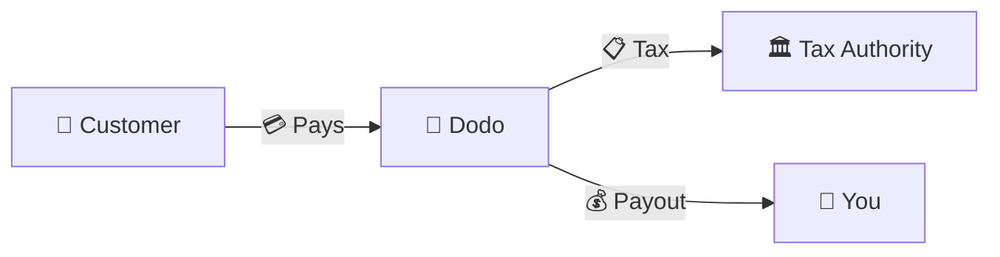
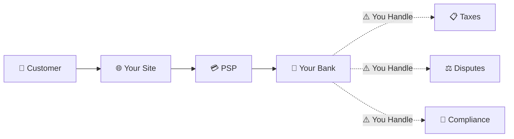
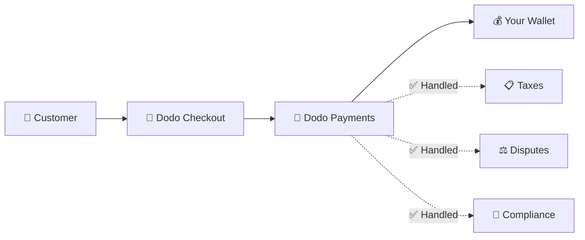
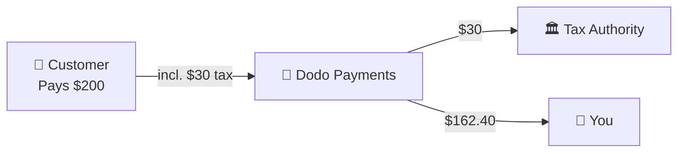

Dodo Payments opère en tant que **Marchand de Registre (MoR)** — nous devenons le vendeur légal de vos produits numériques, prenant en charge la responsabilité des paiements, des taxes, de la fraude et de la conformité afin que vous puissiez vous concentrer entièrement sur la construction de votre produit.

<CardGroup cols={3}>
<Card title="220+ Regions" icon="globe">
Conformité fiscale gérée automatiquement
</Card>

<Card title="30+ Payment Methods" icon="credit-card">
Cartes, portefeuilles et méthodes locales
</Card>

<Card title="Zero Tax Filing" icon="file-invoice">
Nous gérons toutes les remises
</Card>
</CardGroup>

## Qu'est-ce qu'un Marchand de Registre ?

Un **Marchand de Registre** est l'entité légale qui apparaît sur l'état de compte de la carte de crédit de votre client et assume la responsabilité de la transaction. Lorsque vous utilisez Dodo Payments comme votre MoR :

- **Nous sommes le vendeur légal** — Dodo apparaît sur les relevés bancaires et les reçus
- **Vous êtes le créateur du produit** — Vous construisez, fixez le prix et livrez votre produit
- **Nous gérons le back office** — Taxes, litiges, conformité et support de facturation
- **Vous recevez des paiements nets** — Revenus déposés directement sur votre compte

<Note>
Considérez un Merchant of Record comme l’embauche d’une équipe financière mondiale qui gère la facturation, les taxes et le paiement dans chaque pays — sans que vous n’ayez à lever le petit doigt.
</Note>

## Pourquoi utiliser un Marchand de Registre ?

Vendre des produits numériques à l'échelle mondiale signifie naviguer dans la TVA en Europe, la GST en Australie, la taxe de vente aux États-Unis et d'innombrables autres exigences. Chaque juridiction a des règles, des taux, des seuils et des délais de déclaration différents.

| Votre Responsabilité | Sans MoR | Avec Dodo comme MoR |
|---------------------|:-----------:|:----------------:|
| Enregistrement TVA/GST | ❌ Vous | ✅ Dodo |
| Calcul des Taxes | ❌ Vous | ✅ Dodo |
| Déclaration & Paiement des Taxes | ❌ Vous | ✅ Dodo |
| Responsabilité des Remboursements | ❌ Vous | ✅ Dodo |
| Conformité PCI | ❌ Vous | ✅ Dodo |
| Support Multi-Devises | ❌ Complexe | ✅ Intégré |
| Méthodes de Paiement Locales | ❌ Intégrer Chaque | ✅ 30+ Inclus |

<Tip>
**Exemple** : Vendre un abonnement à 50 €/mois à un client français ?

**Sans MoR** : Enregistrez-vous pour la TVA française, facturez 60 € (20 % de TVA), déposez des déclarations trimestrielles françaises, gérez les audits — en français.

**Avec Dodo** : Nous collectons 60 €, versons 10 € de TVA à la France, et vous versons 50 € moins les frais. Vous écrivez le code.
</Tip>

## PSP vs. MoR : Différences Clés

Comprendre la différence entre un **Fournisseur de Services de Paiement** (comme Stripe) et un **Marchand de Registre** est essentiel.

### Fournisseur de Services de Paiement (PSP)

Un PSP traite les transactions mais vous laisse en tant que vendeur légal :

<Warning>
Avec un PSP, **vous** êtes responsable de l’enregistrement fiscal, de la collecte, des déclarations et du reversement dans chaque juridiction où vous avez des clients.
</Warning>

### Marchand de Registre (Dodo)

Un MoR devient le vendeur légal, gérant la conformité de bout en bout :

<Check>
Avec Dodo en tant que MoR, nous gérons les taxes, les litiges et la conformité. Vous recevez des paiements nets sans paperasse.
</Check>

### Comparaison Côté à Côté

| Aspect | PSP (Stripe, etc.) | MoR (Dodo) |
|--------|:------------------:|:----------:|
| Vendeur Légal | Votre Entreprise | Dodo |
| Sur l'État de Compte Client | Votre Nom | Dodo |
| Enregistrement Fiscal | ❌ Vous | ✅ Dodo |
| Calcul des Taxes | ❌ Vous | ✅ Dodo |
| Paiement des Taxes | ❌ Vous | ✅ Dodo |
| Risque de Remboursement | ❌ Vous | ✅ Dodo |
| Conformité PCI | ❌ Vous | ✅ Dodo |
| Configuration pour le Global | Complexe | Simple |

<Info>
**Important** : Les PSP et les MoR gèrent tous deux le traitement des paiements. La différence clé est **qui est légalement responsable** de la conformité fiscale et de la responsabilité des transactions.
</Info>

## Comment fonctionne la conformité fiscale

Dodo gère l'ensemble du cycle de vie fiscal automatiquement :

<Steps>
<Step title="Customer Location">
Nous détectons le pays du client et déterminons les règles fiscales applicables — TVA, GST, taxe de vente ou autres exigences locales.
</Step>

<Step title="Rate Calculation">
Le bon taux d’imposition est calculé en fonction du type de produit, de la localisation du client et du statut B2B/B2C. Les clients professionnels de l’UE disposant d’un numéro de TVA valide bénéficient de l’autoliquidation.
</Step>

<Step title="Collection at Checkout">
La taxe est clairement affichée et perçue à la caisse. Les clients voient exactement ce qu’ils paient.
</Step>

<Step title="Filing & Remittance">
Nous déposons les déclarations et versons les taxes collectées aux autorités compétentes selon le calendrier. Vous ne voyez jamais un formulaire fiscal.
</Step>
</Steps>

## Flux de Revenus

Voici comment l'argent passe du client à votre compte :

### Exemple de Répartition des Paiements

| Élément | Montant |
|-----------|-------:|
| Paiement Client | 200,00 $ |
| Taxe de Vente (15 % TVA) | −30,00 $ |
| Frais de Plateforme Dodo (4 %) | −8,00 $ |
| Traitement des Paiements | −0,60 $ |
| **Votre Paiement** | **162,40 $** |

## Quand Choisir MoR vs. PSP

<Tabs>
<Tab title="Choose Dodo (MoR)">
**Dodo Payments est idéale si vous :**

- Vendez des produits numériques, des SaaS ou des abonnements
- Avez des clients dans de nombreux pays
- Souhaitez éviter les casse-têtes liés aux enregistrements fiscaux
- Privilégiez une conformité externalisée et prévisible
- Valorisez la rapidité de mise sur le marché plutôt que le contrôle maximal
- Ne souhaitez pas gérer les litiges et la fraude
</Tab>

<Tab title="Consider a PSP">
**Un PSP peut vous convenir si vous :**

- Opérez principalement dans un seul pays
- Disposez d’équipes internes finance et conformité
- Avez besoin d’un contrôle absolu sur l’UX de paiement
- Travaillez avec des marges extrêmement faibles
- Vendez des biens physiques (les MoR se concentrent sur le numérique)
</Tab>
</Tabs>

<Note>
Beaucoup d’entreprises commencent avec un PSP puis passent à un MoR lorsqu’elles s’internationalisent. Dodo propose un accompagnement pour rendre cette transition transparente.
</Note>

## Questions Fréquemment Posées

<AccordionGroup>
<Accordion title="What appears on my customer's credit card statement?">
Dodo Payments apparaît en tant que commerçant. Nous incluons la référence à votre produit ou marque lorsque les limites de caractères le permettent, et les clients reçoivent des reçus détaillés indiquant vos informations produits.
</Accordion>

<Accordion title="Do I still own the customer relationship?">
Oui. Vous contrôlez les prix, le branding, la livraison des produits et la communication directe. Dodo gère la mécanique de facturation, mais les clients savent qu’ils achètent chez vous. Votre marque apparaît en évidence dans la caisse, les emails et les factures.
</Accordion>

<Accordion title="How does B2B VAT reverse charge work?">
Pour les ventes B2B dans l’UE, les clients peuvent saisir leur numéro de TVA à la caisse. Nous le validons et appliquons automatiquement l’autoliquidation — la taxe est reportée sur la déclaration TVA de l’acheteur au lieu d’être perçue.
</Accordion>

<Accordion title="Can I use my own payment processor?">
Dodo fonctionne comme une solution complète en utilisant notre infrastructure de paiement. Cette intégration permet d’assumer la responsabilité fiscale et la lutte contre la fraude. Nous travaillons à proposer une intégration avec d’autres processeurs de paiement à l’avenir.
</Accordion>

<Accordion title="How do refunds work?">
Initiez les remboursements depuis votre tableau de bord. Nous traitons le remboursement selon le moyen de paiement et la devise d’origine du client. Les montants de taxe sont automatiquement ajustés et rapprochés.
</Accordion>

<Accordion title="What about my income tax?">
Dodo gère **les taxes de vente** (TVA, GST, Sales Tax) sur les transactions clients. Vous restez responsable de l’impôt sur le revenu, de l’impôt sur les sociétés et des obligations fiscales liées aux paiements que vous recevez.
</Accordion>

<Accordion title="Which countries can I sell to?">
Nous acceptons les paiements de plus de 220 pays et régions en expansion continue. Voir la liste complète :

<Card title="Supported Regions" icon="globe" href="/miscellaneous/list-of-countries-we-accept-payments-from">
Voir les plus de 220 pays et régions où nous acceptons les paiements.
</Card>
</Accordion>
</AccordionGroup>

## Commencer

<CardGroup cols={2}>
<Card title="Create Account" icon="rocket" href="https://app.dodopayments.com/signup">
Inscrivez-vous gratuitement et acceptez les paiements mondiaux en quelques minutes.
</Card>

<Card title="MoR vs PG Deep Dive" icon="scale-balanced" href="/features/mor-vs-pg">
Comparaison détaillée avec exemples et cas d’usage.
</Card>

<Card title="Acceptance Policy" icon="building-shield" href="/miscellaneous/merchant-acceptance">
Découvrez quelles entreprises nous accompagnons.
</Card>

<Card title="Talk to Us" icon="envelope" href="mailto:founders@dodopayments.com">
Obtenez des conseils personnalisés de notre équipe.
</Card>
</CardGroup>
