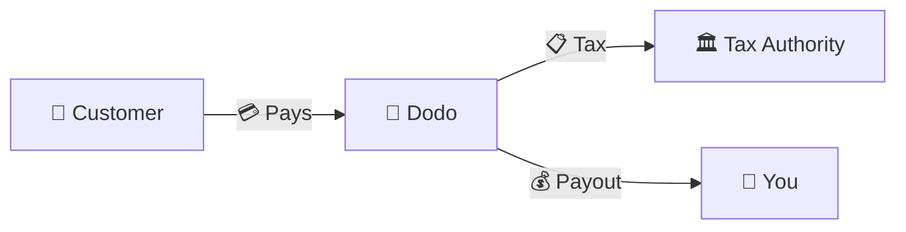
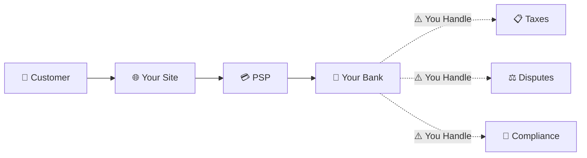
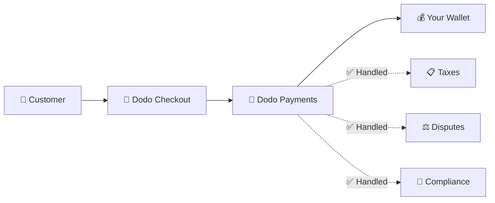
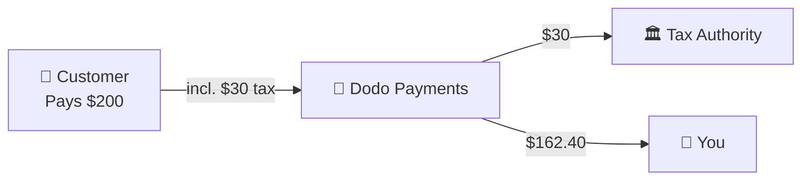

Dodo Payments opère en tant que **Marchand de Registre (MoR)** — nous devenons le vendeur légal de vos produits numériques, prenant en charge la responsabilité des paiements, des taxes, de la fraude et de la conformité afin que vous puissiez vous concentrer entièrement sur la construction de votre produit.

<CardGroup cols={3}>
<Card title="220+ Régions" icon="globe">
Conformité fiscale gérée automatiquement
</Card>

<Card title="30+ Méthodes de Paiement" icon="credit-card">
Cartes, portefeuilles et méthodes locales
</Card>

<Card title="Aucune Déclaration Fiscale" icon="file-invoice">
Nous gérons tous les paiements
</Card>
</CardGroup>

## Qu'est-ce qu'un Marchand de Registre ?

Un **Marchand de Registre** est l'entité légale qui apparaît sur l'état de compte de la carte de crédit de votre client et assume la responsabilité de la transaction. Lorsque vous utilisez Dodo Payments comme votre MoR :

- **Nous sommes le vendeur légal** — Dodo apparaît sur les relevés bancaires et les reçus
- **Vous êtes le créateur du produit** — Vous construisez, fixez le prix et livrez votre produit
- **Nous gérons le back office** — Taxes, litiges, conformité et support de facturation
- **Vous recevez des paiements nets** — Revenus déposés directement sur votre compte

<Note>
Pensez à un Marchand de Registre comme à l'embauche d'une équipe financière mondiale qui gère la facturation, les taxes et la facturation dans chaque pays — sans que vous ayez à lever le petit doigt.
</Note>

## Pourquoi utiliser un Marchand de Registre ?

Vendre des produits numériques à l'échelle mondiale signifie naviguer dans la TVA en Europe, la GST en Australie, la taxe de vente aux États-Unis et d'innombrables autres exigences. Chaque juridiction a des règles, des taux, des seuils et des délais de déclaration différents.

| Votre Responsabilité | Sans MoR | Avec Dodo comme MoR |
|---------------------|:-----------:|:----------------:|
| Enregistrement TVA/GST | ❌ Vous | ✅ Dodo |
| Calcul des Taxes | ❌ Vous | ✅ Dodo |
| Déclaration & Paiement des Taxes | ❌ Vous | ✅ Dodo |
| Responsabilité des Remboursements | ❌ Vous | ✅ Dodo |
| Conformité PCI | ❌ Vous | ✅ Dodo |
| Support Multi-Devises | ❌ Complexe | ✅ Intégré |
| Méthodes de Paiement Locales | ❌ Intégrer Chaque | ✅ 30+ Inclus |

<Tip>
**Exemple** : Vendre un abonnement de 50 €/mois à un client français ?

**Sans MoR** : Enregistrez-vous pour la TVA française, facturez 60 € (20 % de TVA), déposez des déclarations trimestrielles françaises, gérez les audits — en français.

**Avec Dodo** : Nous collectons 60 €, remettons 10 € de TVA à la France et vous payons 50 € moins les frais. Vous écrivez du code.
</Tip>

## PSP vs. MoR : Différences Clés

Comprendre la différence entre un **Fournisseur de Services de Paiement** (comme Stripe) et un **Marchand de Registre** est essentiel.

### Fournisseur de Services de Paiement (PSP)

Un PSP traite les transactions mais vous laisse en tant que vendeur légal :

<Warning>
Avec un PSP, **vous** êtes responsable de l'enregistrement fiscal, de la collecte, du dépôt et du paiement dans chaque juridiction où vous avez des clients.
</Warning>

### Marchand de Registre (Dodo)

Un MoR devient le vendeur légal, gérant la conformité de bout en bout :

<Check>
Avec Dodo comme MoR, nous gérons les taxes, les litiges et la conformité. Vous recevez des paiements nets sans paperasse.
</Check>

### Comparaison Côté à Côté

| Aspect | PSP (Stripe, etc.) | MoR (Dodo) |
|--------|:------------------:|:----------:|
| Vendeur Légal | Votre Entreprise | Dodo |
| Sur l'État de Compte Client | Votre Nom | Dodo |
| Enregistrement Fiscal | ❌ Vous | ✅ Dodo |
| Calcul des Taxes | ❌ Vous | ✅ Dodo |
| Paiement des Taxes | ❌ Vous | ✅ Dodo |
| Risque de Remboursement | ❌ Vous | ✅ Dodo |
| Conformité PCI | ❌ Vous | ✅ Dodo |
| Configuration pour le Global | Complexe | Simple |

<Info>
**Important** : Les PSP et les MoR gèrent tous deux le traitement des paiements. La principale différence est **qui est légalement responsable** de la conformité fiscale et de la responsabilité des transactions.
</Info>

## Comment fonctionne la conformité fiscale

Dodo gère l'ensemble du cycle de vie fiscal automatiquement :

<Steps>
<Step title="Localisation du Client">
Nous détectons le pays du client et déterminons quelles règles fiscales s'appliquent — TVA, GST, taxe de vente ou autres exigences locales.
</Step>

<Step title="Calcul du Taux">
Le taux de taxe correct est calculé en fonction du type de produit, de la localisation du client et du statut B2B/B2C. Les clients professionnels de l'UE avec des numéros de TVA valides bénéficient d'un mécanisme d'autoliquidation.
</Step>

<Step title="Collecte au Moment du Paiement">
La taxe est clairement affichée et collectée au moment du paiement. Les clients voient exactement ce qu'ils paient.
</Step>

<Step title="Déclaration & Paiement">
Nous déposons les déclarations et payons les taxes collectées aux autorités compétentes dans les délais. Vous ne voyez jamais de formulaire fiscal.
</Step>
</Steps>

## Flux de Revenus

Voici comment l'argent passe du client à votre compte :

### Exemple de Répartition des Paiements

| Élément | Montant |
|-----------|-------:|
| Paiement Client | 200,00 $ |
| Taxe de Vente (15 % TVA) | −30,00 $ |
| Frais de Plateforme Dodo (4 %) | −8,00 $ |
| Traitement des Paiements | −0,60 $ |
| **Votre Paiement** | **162,40 $** |

## Quand Choisir MoR vs. PSP

<Tabs>
<Tab title="Choisissez Dodo (MoR)">
**Dodo Payments est idéal si vous :**

- Vendez des produits numériques, SaaS ou des abonnements
- Avez des clients dans plusieurs pays
- Voulez éviter les tracas d'enregistrement fiscal
- Préférez une conformité externalisée et prévisible
- Valorisez la rapidité de mise sur le marché plutôt que le contrôle maximal
- Ne voulez pas gérer les litiges et la fraude
</Tab>

<Tab title="Considérez un PSP">
**Un PSP pourrait vous convenir si vous :**

- Opérez principalement dans un seul pays
- Avez des équipes financières et de conformité internes
- Avez besoin d'un contrôle absolu sur l'expérience de paiement
- Travaillez avec des marges extrêmement faibles
- Vendez des biens physiques (les MoR se concentrent sur le numérique)
</Tab>
</Tabs>

<Note>
De nombreuses entreprises commencent avec un PSP et passent à un MoR à mesure qu'elles se développent à l'international. Dodo propose un support de migration pour rendre cette transition fluide.
</Note>

## Questions Fréquemment Posées

<AccordionGroup>
<Accordion title="Que figure sur l'état de compte de la carte de crédit de mon client ?">
Dodo Payments apparaît comme le marchand. Nous incluons votre référence produit/marque lorsque les limites de caractères le permettent, et les clients reçoivent des reçus détaillés montrant les informations de votre produit.
</Accordion>

<Accordion title="Est-ce que je possède toujours la relation client ?">
Oui. Vous contrôlez les prix, la marque, la livraison du produit et la communication directe. Dodo gère les mécanismes de facturation, mais les clients savent qu'ils achètent chez vous. Votre marque apparaît en évidence lors du paiement, dans les e-mails et sur les factures.
</Accordion>

<Accordion title="Comment fonctionne le mécanisme d'autoliquidation de la TVA B2B ?">
Pour les ventes B2B dans l'UE, les clients peuvent entrer leur numéro de TVA au moment du paiement. Nous le validons et appliquons automatiquement l'autoliquidation — la taxe est transférée à la déclaration de TVA de l'acheteur au lieu d'être collectée.
</Accordion>

<Accordion title="Puis-je utiliser mon propre processeur de paiement ?">
Dodo fonctionne comme une solution complète utilisant notre infrastructure de paiement. Cette intégration est ce qui nous permet d'assumer la responsabilité fiscale et de fraude. Nous travaillons à fournir une intégration avec d'autres processeurs de paiement à l'avenir.
</Accordion>

<Accordion title="Comment fonctionnent les remboursements ?">
Initiez des remboursements depuis votre tableau de bord. Nous traitons le remboursement dans le mode de paiement et la devise d'origine du client. Les montants de taxe sont automatiquement ajustés et réconciliés.
</Accordion>

<Accordion title="Qu'en est-il de mon impôt sur le revenu ?">
Dodo gère les **taxes de vente** (TVA, GST, taxe de vente) sur les transactions des clients. Vous restez responsable de l'impôt sur le revenu de votre entreprise, de l'impôt sur les sociétés et des obligations fiscales sur les paiements que vous recevez.
</Accordion>

<Accordion title="Dans quels pays puis-je vendre ?">
Nous acceptons des paiements de plus de 220 pays et régions avec une expansion continue. Voir la liste complète :

<Card title="Régions Supportées" icon="globe" href="/miscellaneous/list-of-countries-we-accept-payments-from">
Voir tous les 220+ pays et régions où nous acceptons des paiements.
</Card>
</Accordion>
</AccordionGroup>

## Commencer

<CardGroup cols={2}>
<Card title="Créer un Compte" icon="rocket" href="https://app.dodopayments.com/signup">
Inscrivez-vous gratuitement et acceptez des paiements mondiaux en quelques minutes.
</Card>

<Card title="Analyse Approfondie MoR vs PG" icon="scale-balanced" href="/features/mor-vs-pg">
Comparaison détaillée avec exemples et cas d'utilisation.
</Card>

<Card title="Politique d'Acceptation" icon="building-shield" href="/miscellaneous/merchant-acceptance">
Découvrez les entreprises que nous soutenons.
</Card>

<Card title="Parlez-nous" icon="envelope" href="mailto:founders@dodopayments.com">
Obtenez des conseils personnalisés de notre équipe.
</Card>
</CardGroup>
