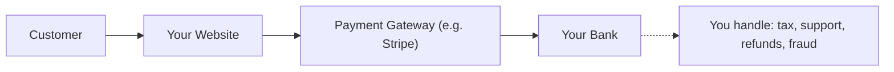
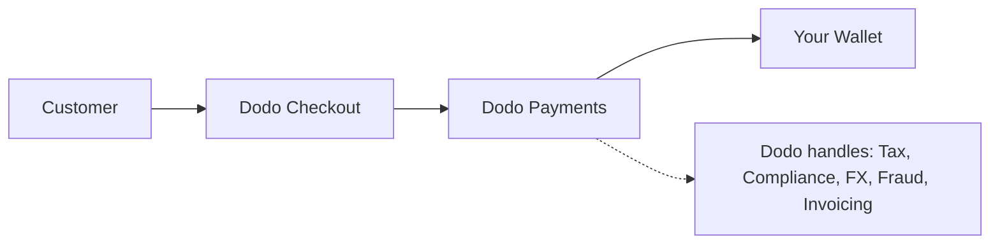

## Introduction

Ce guide compare le modèle MoR avec l'approche traditionnelle de la passerelle de paiement, vous aidant à comprendre les avantages que Dodo Payments apporte à votre entreprise.

## La Différence Principale

| Fonctionnalité                     | MoR (Dodo Payments)         | Passerelle de Paiement (PG Traditionnelle)           |
|------------------------------------|--------------------------------------------|--------------------------------------------|
| Vendeur Légal                      | Dodo Payments (MoR)                        | Votre Entreprise                               |
| Collecte et Remboursement de Taxes | Géré par Dodo                            | Vous êtes responsable                        |
| Charge de Conformité & Réglementaire | Dodo assume la responsabilité                     | Vous gérez les lois locales et les rétrofacturations      |
| Devise de Règlement                | USD, EUR, INR, et 25+ autres supportés    | Dépend de votre compte marchand           |
| Gestion des Risques                | Protection intégrée contre la fraude et les rétrofacturations   | Vous configurez vos propres outils (ex. : Stripe Radar) |
| Paiements                          | Paiements globaux agrégés et simplifiés   | Directement de la PG vers vous, avec configuration bancaire     |

## Ce Que Cela Signifie Pour Vous

Avec **Dodo en tant que MoR**, nous devenons le vendeur légal pour vos clients, vous permettant de :

- Éviter de créer des entités locales
- Ne pas gérer la TVA, la GST ou la taxe de vente
- Offrir plus de méthodes de paiement à l'échelle mondiale
- Réduire le risque légal
- Lancer plus rapidement sur de nouveaux marchés

<Note>
Imaginez vendre un abonnement numérique à un utilisateur en France. Avec Dodo Payments, nous collectons le paiement, déclarons la TVA aux autorités françaises et vous versons les revenus nets. Pas de casse-tête fiscal. Pas d’avocats. Juste de la croissance.
</Note>

De plus, le modèle MoR simplifie l'ensemble de votre back-office. En tant que votre MoR, Dodo gère la conformité PCI, la détection de fraude, la conversion de devises, et même le support de facturation client, libérant votre équipe pour se concentrer sur le produit et la croissance.

## Comparaison Visuelle

**Flux de Revenus : Passerelle de Paiement**

**Flux de Revenus : Merchant of Record (Dodo)**

## Pourquoi Cela Compte Pour les Entreprises SaaS & Numériques

À mesure que votre entreprise se développe, la gestion des taxes, de la conformité et des préférences de paiement mondiales peut devenir écrasante. Avec une passerelle de paiement, vous êtes responsable de :

- Enregistrement et déclaration de la TVA/GST dans plusieurs juridictions
- Gestion de la conversion de devises et des rétrofacturations
- Fournir un processus de paiement et des méthodes de paiement localisées

Avec Dodo Payments en tant que votre MoR :
- Vous vous développez à l'international sans créer d'entités locales
- Les taxes sont calculées, collectées et remises en votre nom
- Vous accédez à une bibliothèque de méthodes de paiement adaptées à vos clients
- Nous agissons comme votre tampon légal et partenaire opérationnel

<Tip>
« Imaginez une passerelle de paiement comme un tunnel. Maintenant, imaginez le marchand de référence comme un tunnel, un train, un conducteur et l’équipe billetterie réunis. »
</Tip>

## Qui Devrait Utiliser MoR ?

Dodo Payments est parfait pour :
- Les entreprises SaaS et de produits numériques
- Les créateurs indépendants et les solopreneurs
- Les entreprises mondiales avec des clients dans plus de 100 pays
- Les entreprises qui ne souhaitent pas gérer les taxes et la conformité en interne

Si vous vous développez à l'international, vendez des abonnements, ou souhaitez simplement réduire les maux de tête opérationnels, MoR est le choix le plus judicieux.

## Quand Utiliser Une Passerelle de Paiement À la Place

Il existe des cas où l'utilisation d'une simple passerelle de paiement peut avoir du sens :
- Votre entreprise n'opère que dans un seul pays
- Vous disposez déjà de ressources internes en finance et conformité
- Vous exigez un contrôle total sur l'expérience de facturation client
- Vous êtes très sensible aux coûts avec des marges serrées à grande échelle

<Note>
Pour de nombreuses startups, utiliser une passerelle peut suffire au départ, mais à mesure que la complexité augmente, passer à un MoR permet d’économiser du temps, de réduire les risques et d’accélérer la croissance internationale.
</Note>

## Pourquoi Choisir Dodo Payments

Dodo Payments offre :
- Une solution tout-en-un pour les paiements, les taxes et la conformité
- Support en temps réel pour les devises et multi-devises
- Accès à plus de 30 méthodes de paiement
- Facturation basée sur les sièges, abonnements et paiements uniques
- Gestion automatisée des taxes dans plus de 150 pays
- Prévention intégrée de la fraude et conformité PCI

Que vous soyez un fondateur solo ou une équipe SaaS en pleine croissance, Dodo simplifie les complexités de la vente à l'échelle mondiale.

## En Savoir Plus

<CardGroup cols={2}>
{/* LOCKED_PATTERN_255f37658964531eef93d79ee5d8bb7a */}
Découvrez comment Dodo propose automatiquement les prix dans les devises locales de vos clients
</Card>

{/* LOCKED_PATTERN_9bf5b254a8af251551af21558f3421ad */}
Découvrez les plus de 30 méthodes de paiement disponibles avec Dodo Payments
</Card>
</CardGroup>

## Prêt à Changer ?

Rejoignez plus de 3 000 entreprises numériques utilisant Dodo Payments pour vendre à l'échelle mondiale, sans frontières ni goulets d'étranglement.

<CardGroup cols={2}>
{/* LOCKED_PATTERN_2d2ae952f85e9d3c5861b83c7818a666 */}
Créez votre compte Dodo Payments et commencez à vendre dans le monde entier dès aujourd’hui
</Card>

{/* LOCKED_PATTERN_f3b5e9c6689a9ef5e4b14f5eeed286a7 */}
Bénéficiez de conseils personnalisés de la part de notre équipe
</Card>
</CardGroup>

<Tip>
Laissez Dodo gérer les tâches compliquées – afin que vous puissiez vous concentrer sur la création d’un excellent produit.
</Tip>