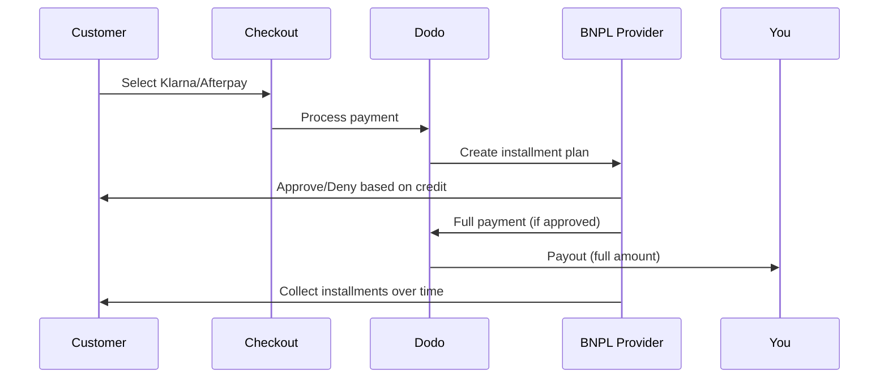

Achetez maintenant, payez plus tard (BNPL) permet aux clients de répartir leurs achats en versements sans intérêt, augmentant ainsi la valeur moyenne des commandes de 20 à 50 % et les taux de conversion de 10 à 30 % pour les transactions éligibles.

## Pourquoi proposer BNPL ?

<CardGroup cols={3}>
<Card title="Valeur Moyenne de Commande Plus Élevée" icon="chart-line">
Les clients dépensent plus lorsqu'ils peuvent étaler les paiements dans le temps. La valeur moyenne des commandes augmente de 20 à 50 %.
</Card>

<Card title="Meilleure Conversion" icon="percent">
Éliminer les frictions de paiement au moment du passage à la caisse. Les taux de conversion s'améliorent de 10 à 30 % pour les articles de haute valeur.
</Card>

<Card title="Aucun Risque" icon="shield-check">
Les fournisseurs de BNPL gèrent le risque de crédit et les recouvrements. Vous recevez le paiement intégral d'avance.
</Card>
</CardGroup>

## Fournisseurs Pris en Charge

### Klarna

| Caractéristique | Détails |
| :------ | :------ |
| **Disponibilité** | É.-U. + 19 pays européens |
| **Devises** | USD, EUR, GBP, DKK, NOK, SEK, CZK, RON, PLN, CHF |
| **Minimal** | 50,01 $ (ou équivalent) |
| **Abonnements** | Non |

**Pays pris en charge :** Autriche, Belgique, République tchèque, Danemark, Finlande, France, Allemagne, Grèce, Irlande, Italie, Pays-Bas, Norvège, Pologne, Portugal, Roumanie, Espagne, Suède, Suisse, Royaume-Uni, États-Unis

**Options de Paiement :**
- **Paiement en 4** — Répartissez en 4 paiements sans intérêts
- **Paiement dans 30 jours** — Paiement intégral dû dans 30 jours
- **Financement** — Plans de versements à plus long terme

### Afterpay (Clearpay)

| Caractéristique | Détails |
| :------ | :------ |
| **Disponibilité** | É.-U., Royaume-Uni |
| **Devises** | USD, GBP |
| **Minimal** | 50,01 $ (ou équivalent) |
| **Abonnements** | Non |

**Options de Paiement :**
- **Paiement en 4** — 4 paiements sans intérêts tous les 2 semaines

<Note>
Au Royaume-Uni, Afterpay est connu sous le nom de "Clearpay" mais utilise le même type d'API (`afterpay_clearpay`).
</Note>

### Billie

| Caractéristique | Détails |
| :------ | :------ |
| **Disponibilité** | Mondial |
| **Devises** | GBP |
| **Minimal** | Aucun |
| **Abonnements** | Non |

**À propos de Billie :**
Billie est une solution B2B d'Achetez maintenant, payez plus tard qui permet aux entreprises d'offrir des conditions de paiement flexibles à leurs clients. Elle est conçue pour les transactions inter-entreprises où les acheteurs ont besoin d'options de paiement basées sur des factures.

**Options de Paiement :**
- **Paiement par facture** — Payez dans les conditions de paiement convenues
- **Conditions Flexibles** — Calendriers de paiement adaptés aux entreprises

## Configuration

### Types de Méthodes API

| Type | Fournisseur |
| :--- | :------- |
| `klarna` | Klarna |
| `afterpay_clearpay` | Afterpay / Clearpay |
| `billie` | Billie (B2B) |

### Exemple

```javascript
const session = await client.checkoutSessions.create({
  product_cart: [{ product_id: 'prod_123', quantity: 1 }],
  allowed_payment_method_types: [
    'klarna',
    'afterpay_clearpay',
    'credit',
    'debit'
  ],
  customer: {
    email: 'customer@example.com',
    name: 'Jane Smith'
  },
  billing_address: {
    country: 'US',
    zipcode: '10001'
  },
  return_url: 'https://example.com/success'
});
```

<Warning>
Incluez toujours `credit` et `debit` comme solutions de secours. Tous les clients ne sont pas éligibles pour BNPL, et les transactions en dessous de 50,01 $ ne seront pas qualifiées.
</Warning>

## Montant Minimum de Transaction

**Klarna et Afterpay exigent un minimum de 50,01 $ USD** (ou équivalent dans les devises prises en charge).

Les transactions en dessous de ce seuil :
- Les options BNPL n'apparaîtront pas lors de la validation
- Aucun message d'erreur n'est affiché - les options ne s'affichent tout simplement pas
- Les paiements par carte restent disponibles

C'est un comportement attendu. N'incluez pas BNPL dans `allowed_payment_method_types` pour les produits sous 50 $.

## Comment fonctionnent les versements



**Points clés :**
- Vous recevez le **paiement intégral d'avance** du fournisseur BNPL
- Le fournisseur BNPL gère le **risque de crédit et les recouvrements**
- Le client paie directement le fournisseur en **4 versements** (en général)
- **Aucun rétrofacturation** en cas d'échec de paiement - c'est le risque du fournisseur

## Tests

### Données de Test Klarna

Utilisez ces détails en mode test :

| Champ | Approuvé | Refusé |
| :---- | :------- | :----- |
| **Date de Naissance** | 07-10-1970 | 07-10-1970 |
| **Prénom** | Test | Test |
| **Nom de Famille** | Person-us | Person-us |
| **Email** | customer@email.us | customer+denied@email.us |
| **Rue** | Amsterdam Ave | Amsterdam Ave |
| **Numéro de Maison** | 509 | 509 |
| **Ville** | New York | New York |
| **État** | New York | New York |
| **Code Postal** | 10024-3941 | 10024-3941 |
| **Téléphone** | +13106683312 | +13106354386 |

<Note>
La transaction doit être d'au moins 50 $ pour que Klarna apparaisse comme option.
</Note>

### Test d'Afterpay

<Steps>
<Step title="Sélectionnez Afterpay">
Choisissez Afterpay lors du passage à la caisse et cliquez sur Payer.
</Step>

<Step title="Paiement réussi">
Utilisez n'importe quel email valide et adresse de livraison.
</Step>

<Step title="Échec de l'authentification">
Pour tester l'échec : fermez la modal Afterpay sur la page de redirection. L'état de paiement passe à `requires_payment_method`.
</Step>
</Steps>

## Meilleures Pratiques

<AccordionGroup>
<Accordion title="Ciblez les articles de haute valeur">
BNPL fonctionne mieux pour les produits de 100 à 1000 $. La proposition de valeur "payer au fil du temps" est la plus convaincante dans cette gamme.
</Accordion>

<Accordion title="Affichez les montants des versements">
"4 paiements de 25 $" est plus persuasif que "$100 avec Klarna". Affichez le montant par paiement lorsque c'est possible.
</Accordion>

<Accordion title="Ne forcez pas BNPL pour les produits à faible valeur">
En dessous de 50 $, BNPL n'apparaîtra de toute façon pas. En dessous de 100 $, la plupart des clients préfèrent les cartes. Concentrez la promotion BNPL sur les articles de plus haute valeur.
</Accordion>

<Accordion title="Collectez l'adresse de facturation">
Les fournisseurs de BNPL nécessitent des informations de facturation pour les vérifications de crédit. Assurez-vous que votre processus de validation collecte les détails d'adresse complets.
</Accordion>

<Accordion title="Fixez des attentes claires">
Les clients doivent comprendre qu'ils entrent dans un accord de crédit avec Klarna/Afterpay, pas avec vous.
</Accordion>
</AccordionGroup>

## Limitations

### Aucun Abonnement
Les méthodes de paiement BNPL **ne prennent pas en charge les paiements récurrents**. Pour les produits d'abonnement, utilisez des cartes ou d'autres méthodes compatibles avec les paiements récurrents.

### Approbation Basée sur le Crédit
Les fournisseurs de BNPL effectuent des vérifications de crédit instantanées. Tous les clients ne seront pas approuvés. Les taux d'approbation varient selon :
- L'historique de crédit du client avec le fournisseur
- Le montant de la transaction
- La localisation du client

### Restrictions Monétaires
| Fournisseur | Devises |
| :------- | :--------- |
| Klarna | USD, EUR, GBP, DKK, NOK, SEK, CZK, RON, PLN, CHF |
| Afterpay | USD, GBP |

## Dépannage

<AccordionGroup>
<Accordion title="BNPL n'apparaît pas lors du passage à la caisse">
**Vérifiez :**
1. Montant de la transaction d'au moins 50,01 $ ?
2. Localisation du client dans un pays pris en charge ?
3. Devise prise en charge par le fournisseur BNPL ?
4. Méthode BNPL incluse dans `allowed_payment_method_types` ?

**Solution :** La plupart du temps, la transaction est en dessous du minimum. Vérifiez que le montant respecte le seuil de 50,01 $.
</Accordion>

<Accordion title="Client refusé par le fournisseur BNPL">
**Causes :**
- Historique de crédit insuffisant avec le fournisseur
- Trop de plans de versements actifs
- Vérification d'identité échouée

**Solution :** C'est à prévoir pour certains clients. Assurez-vous que des solutions de secours par carte sont disponibles. Ne révélez pas les raisons spécifiques de refus.
</Accordion>

<Accordion title="Paiement bloqué en attente">
**Cause :** Le client n'a pas complété le processus d'authentification avec le fournisseur BNPL.

**Solution :** Le paiement expirera et échouera. Le client peut réessayer ou utiliser une méthode différente.
</Accordion>
</AccordionGroup>

## Pages Associées

<CardGroup cols={2}>
<Card title="Vue d'ensemble des Méthodes de Paiement" icon="credit-card" href="/features/payment-methods">
Voir toutes les méthodes de paiement prises en charge.
</Card>

<Card title="Guide de Validation" icon="book" href="/developer-resources/checkout-session">
Guide complet pour la mise en œuvre de la validation.
</Card>

<Card title="Processus de Test" icon="flask" href="/miscellaneous/testing-process">
Toutes les données de test pour les méthodes de paiement.
</Card>

<Card title="Monnaie Adaptive" icon="globe" href="/features/adaptive-currency">
Support monétaire et conversion.
</Card>
</CardGroup>