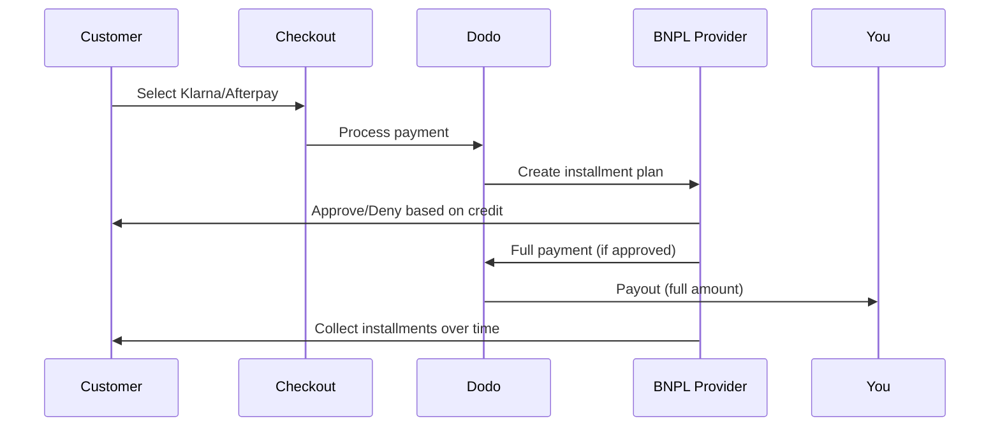

Achetez maintenant, payez plus tard (BNPL) permet aux clients de répartir leurs achats en versements sans intérêt, augmentant ainsi la valeur moyenne des commandes de 20 à 50 % et les taux de conversion de 10 à 30 % pour les transactions éligibles.

## Pourquoi proposer BNPL ?

<CardGroup cols={3}>
<Card title="Higher AOV" icon="chart-line">
Les clients dépensent plus lorsqu'ils peuvent étaler les paiements dans le temps. La valeur moyenne des commandes augmente de 20 à 50%.
</Card>

<Card title="Better Conversion" icon="percent">
Éliminer les frictions de paiement au checkout. Les taux de conversion augmentent de 10 à 30% pour les articles à fort montant.
</Card>

<Card title="Zero Risk" icon="shield-check">
Les fournisseurs de BNPL gèrent le risque de crédit et les recouvrements. Vous recevez le paiement complet à l'avance.
</Card>
</CardGroup>

## Fournisseurs Pris en Charge

### Klarna

| Caractéristique | Détails |
| :------ | :------ |
| **Disponibilité** | É.-U. + 19 pays européens |
| **Devises** | USD, EUR, GBP, DKK, NOK, SEK, CZK, RON, PLN, CHF |
| **Minimal** | 50,01 $ (ou équivalent) |
| **Abonnements** | Non |

**Pays pris en charge :** Autriche, Belgique, République tchèque, Danemark, Finlande, France, Allemagne, Grèce, Irlande, Italie, Pays-Bas, Norvège, Pologne, Portugal, Roumanie, Espagne, Suède, Suisse, Royaume-Uni, États-Unis

**Options de Paiement :**
- **Paiement en 4** — Répartissez en 4 paiements sans intérêts
- **Paiement dans 30 jours** — Paiement intégral dû dans 30 jours
- **Financement** — Plans de versements à plus long terme

### Afterpay (Clearpay)

| Caractéristique | Détails |
| :------ | :------ |
| **Disponibilité** | É.-U., Royaume-Uni |
| **Devises** | USD, GBP |
| **Minimal** | 50,01 $ (ou équivalent) |
| **Abonnements** | Non |

**Options de Paiement :**
- **Paiement en 4** — 4 paiements sans intérêts tous les 2 semaines

<Note>
Au Royaume-Uni, Afterpay opère sous le nom de « Clearpay » mais utilise le même type d'API (`afterpay_clearpay`).
</Note>

### Billie

| Caractéristique | Détails |
| :------ | :------ |
| **Disponibilité** | Mondial |
| **Devises** | GBP |
| **Minimal** | Aucun |
| **Abonnements** | Non |

**À propos de Billie :**
Billie est une solution B2B d'Achetez maintenant, payez plus tard qui permet aux entreprises d'offrir des conditions de paiement flexibles à leurs clients. Elle est conçue pour les transactions inter-entreprises où les acheteurs ont besoin d'options de paiement basées sur des factures.

**Options de Paiement :**
- **Paiement par facture** — Payez dans les conditions de paiement convenues
- **Conditions Flexibles** — Calendriers de paiement adaptés aux entreprises

## Configuration

### Types de Méthodes API

| Type | Fournisseur |
| :--- | :---------- |
| `klarna` | Klarna |
| `afterpay_clearpay` | Afterpay / Clearpay |
| `billie` | Billie (B2B) |

### Exemple

```javascript
const session = await client.checkoutSessions.create({
  product_cart: [{ product_id: 'prod_123', quantity: 1 }],
  allowed_payment_method_types: [
    'klarna',
    'afterpay_clearpay',
    'credit',
    'debit'
  ],
  customer: {
    email: 'customer@example.com',
    name: 'Jane Smith'
  },
  billing_address: {
    country: 'US',
    zipcode: '10001'
  },
  return_url: 'https://example.com/success'
});
```

<Warning>
Incluez toujours `credit` et `debit` comme solutions de secours. Tous les clients ne sont pas éligibles au BNPL, et les transactions inférieures à 50,01 $ ne seront pas qualificatives.
</Warning>

## Montant Minimum de Transaction

**Klarna et Afterpay exigent un minimum de 50,01 $ USD** (ou équivalent dans les devises prises en charge).

Les transactions en dessous de ce seuil :
- Les options BNPL n'apparaîtront pas lors de la validation
- Aucun message d'erreur n'est affiché - les options ne s'affichent tout simplement pas
- Les paiements par carte restent disponibles

Ce comportement est attendu. N'incluez pas le BNPL dans `allowed_payment_method_types` pour les produits à moins de 50 $.

## Comment fonctionnent les versements



**Points clés :**
- Vous recevez le **paiement intégral d'avance** du fournisseur BNPL
- Le fournisseur BNPL gère le **risque de crédit et les recouvrements**
- Le client paie directement le fournisseur en **4 versements** (en général)
- **Aucun rétrofacturation** en cas d'échec de paiement - c'est le risque du fournisseur

## Tests

### Données de Test Klarna

Utilisez ces détails en mode test :

| Champ | Approuvé | Refusé |
| :---- | :------- | :----- |
| **Date de Naissance** | 07-10-1970 | 07-10-1970 |
| **Prénom** | Test | Test |
| **Nom de Famille** | Person-us | Person-us |
| **Email** | customer@email.us | customer+denied@email.us |
| **Rue** | Amsterdam Ave | Amsterdam Ave |
| **Numéro de Maison** | 509 | 509 |
| **Ville** | New York | New York |
| **État** | New York | New York |
| **Code Postal** | 10024-3941 | 10024-3941 |
| **Téléphone** | +13106683312 | +13106354386 |

<Note>
La transaction doit être d'au moins 50 $ pour que Klarna apparaisse comme option.
</Note>

### Test d'Afterpay

<Steps>
<Step title="Select Afterpay">
Sélectionnez Afterpay dans le checkout et cliquez sur Payer.
</Step>

<Step title="Successful payment">
Utilisez un email et une adresse de livraison valides.
</Step>

<Step title="Failed authentication">
Pour tester un échec : fermez la fenêtre modale Afterpay sur la page de redirection. L'état du paiement passe à `requires_payment_method`.
</Step>
</Steps>

## Meilleures Pratiques

<AccordionGroup>
<Accordion title="Target high-ticket items">
Le BNPL fonctionne mieux pour des produits entre 100 $ et 1 000 $. La proposition de valeur du « payer dans le temps » est la plus convaincante dans cette fourchette.
</Accordion>

<Accordion title="Show installment amounts">
« 4 paiements de 25 $ » est plus convaincant que « 100 $ avec Klarna ». Affichez le montant par paiement quand c'est possible.
</Accordion>

<Accordion title="Don't force BNPL for low-value products">
En dessous de 50 $, le BNPL n'apparaît pas de toute façon. Sous 100 $, la plupart des clients préfèrent les cartes. Concentrez la promotion du BNPL sur les articles à prix élevé.
</Accordion>

<Accordion title="Collect billing address">
Les fournisseurs de BNPL exigent les informations de facturation pour les vérifications de crédit. Assurez-vous que votre checkout collecte l'adresse complète.
</Accordion>

<Accordion title="Set clear expectations">
Les clients doivent comprendre qu'ils concluent un contrat de crédit avec Klarna/Afterpay, et non avec vous.
</Accordion>
</AccordionGroup>

## Limitations

### Aucun Abonnement
Les méthodes de paiement BNPL **ne prennent pas en charge les paiements récurrents**. Pour les produits d'abonnement, utilisez des cartes ou d'autres méthodes compatibles avec les paiements récurrents.

### Approbation Basée sur le Crédit
Les fournisseurs de BNPL effectuent des vérifications de crédit instantanées. Tous les clients ne seront pas approuvés. Les taux d'approbation varient selon :
- L'historique de crédit du client avec le fournisseur
- Le montant de la transaction
- La localisation du client

### Correspondance des devises et des pays

Chaque devise est limitée à sa région correspondante :

| Devise | Pays pris en charge |
| :------ | :------------------ |
| **USD** | États-Unis uniquement |
| **EUR** | Tous les pays européens pris en charge (Autriche, Belgique, République tchèque, Danemark, Finlande, France, Allemagne, Grèce, Irlande, Italie, Pays-Bas, Norvège, Pologne, Portugal, Roumanie, Espagne, Suède, Suisse) |
| **GBP** | Royaume-Uni et tous les pays européens pris en charge |

D'autres devises prises en charge par Klarna (DKK, NOK, SEK, CZK, RON, PLN, CHF) fonctionnent dans leurs pays respectifs.

<Info>
Par exemple, une transaction en USD n'affichera les options BNPL qu'aux clients aux États-Unis. Une transaction en EUR affichera les options BNPL dans tous les pays européens pris en charge. Une transaction en GBP affichera les options BNPL aux clients au Royaume-Uni et dans tous les pays européens pris en charge.
</Info>

| Fournisseur | Devises prises en charge |
| :---------- | :----------------------- |
| Klarna | USD, EUR, GBP, DKK, NOK, SEK, CZK, RON, PLN, CHF |
| Afterpay | USD (US), GBP (UK) |

## Dépannage

<AccordionGroup>
<Accordion title="BNPL not appearing at checkout">
**Vérification :**
1. Le montant de la transaction est-il d'au moins 50,01 $ ?
2. Le client est-il situé dans un pays pris en charge ?
3. La devise est-elle prise en charge par le fournisseur BNPL ?
4. La méthode BNPL est-elle incluse dans `allowed_payment_method_types` ?

**Solution :** Dans la plupart des cas, la transaction est inférieure au minimum. Vérifiez que le montant respecte le seuil de 50,01 $.
</Accordion>

<Accordion title="Customer denied by BNPL provider">
**Causes :**
- Historique de crédit insuffisant avec le fournisseur
- Trop de plans de paiement en cours
- Échec de la vérification d'identité

**Solution :** C'est attendu pour certains clients. Assurez-vous que des solutions de repli par carte sont disponibles. N'exposez pas de raisons spécifiques de refus.
</Accordion>

<Accordion title="Payment stuck in pending">
**Cause :** Le client n'a pas complété le flux d'authentification avec le fournisseur BNPL.

**Solution :** Le paiement expirera et échouera. Le client peut réessayer ou utiliser une autre méthode.
</Accordion>
</AccordionGroup>

## Pages associées

<CardGroup cols={2}>
<Card title="Payment Methods Overview" icon="credit-card" href="/features/payment-methods">
Consultez toutes les méthodes de paiement prises en charge.
</Card>

<Card title="Checkout Guide" icon="book" href="/developer-resources/checkout-session">
Guide complet de mise en œuvre du checkout.
</Card>

<Card title="Testing Process" icon="flask" href="/miscellaneous/testing-process">
Toutes les données de test pour les méthodes de paiement.
</Card>

<Card title="Adaptive Currency" icon="globe" href="/features/adaptive-currency">
Prise en charge des devises et conversion.
</Card>
</CardGroup>