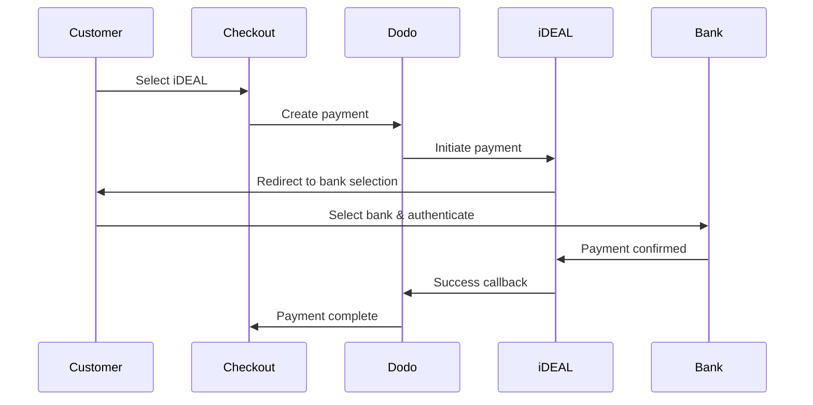

Les clients européens préfèrent fortement les méthodes de paiement locales qui s'intègrent à leurs systèmes bancaires. Offrir ces méthodes peut augmenter les taux de conversion de 20 à 40 % sur les marchés cibles.

## Pourquoi des méthodes de paiement locales européennes ?

<CardGroup cols={3}>
<Card title="Higher Conversion" icon="chart-line">
iDEAL capte ~60 % des paiements en ligne néerlandais. Ne pas le proposer signifie perdre des clients.
</Card>

<Card title="Lower Fraud" icon="shield-check">
Les paiements authentifiés par la banque présentent des taux de fraude quasi nuls et aucun rétrofacturation.
</Card>

<Card title="Real-Time Settlement" icon="bolt">
La plupart des méthodes européennes fournissent une confirmation de paiement instantanée.
</Card>
</CardGroup>

## Méthodes prises en charge

| Méthode | Pays | Part de marché | Devise | Abonnements |
| :----- | :------ | :----------- | :------- | :-----------: |
| **iDEAL** | Pays-Bas | ~60% | EUR | Non |
| **Bancontact** | Belgique | ~50% | EUR | Non |
| **EPS** | Autriche | ~30% | EUR | Non |
| **Multibanco** | Portugal | ~40% | EUR | Non |

## iDEAL (Pays-Bas)

iDEAL est la méthode de paiement en ligne dominante aux Pays-Bas, se connectant directement à toutes les banques néerlandaises majeures.

### Comment ça fonctionne



### Banques prises en charge

Toutes les grandes banques néerlandaises sont prises en charge :
- ABN AMRO
- ASN Bank
- Bunq
- ING
- Knab
- Rabobank
- RegioBank
- Revolut
- SNS
- Triodos Bank
- Van Lanschot

### Configuration

```javascript
const session = await client.checkoutSessions.create({
  product_cart: [{ product_id: 'prod_123', quantity: 1 }],
  allowed_payment_method_types: ['ideal', 'credit', 'debit'],
  billing_currency: 'EUR',
  billing_address: {
    country: 'NL',
    zipcode: '1012JS'
  },
  return_url: 'https://example.com/success'
});
```

## Bancontact (Belgique)

Bancontact est le système de paiement national de la Belgique, utilisé par pratiquement toutes les banques belges pour les paiements en ligne.

### Caractéristiques
- Fonctionne avec des cartes de débit belges existantes
- Support pour applications mobiles (Payconiq par Bancontact)
- Confirmation de paiement instantanée
- Pas d'enregistrement supplémentaire nécessaire pour les clients

### Configuration

```javascript
const session = await client.checkoutSessions.create({
  product_cart: [{ product_id: 'prod_123', quantity: 1 }],
  allowed_payment_method_types: ['bancontact_card', 'credit', 'debit'],
  billing_currency: 'EUR',
  billing_address: {
    country: 'BE',
    zipcode: '1000'
  },
  return_url: 'https://example.com/success'
});
```

## EPS (Autriche)

EPS (Electronic Payment Standard) permet des transferts bancaires directs en ligne pour les clients autrichiens.

### Caractéristiques
- Intégration directe avec les banques autrichiennes
- Confirmation de paiement en temps réel
- Haute confiance parmi les consommateurs autrichiens
- Pas de rétrofacturations

### Banques prises en charge

Principales banques autrichiennes, y compris :
- Erste Bank
- Bank Austria
- Raiffeisen
- BAWAG
- Volksbank

### Configuration

```javascript
const session = await client.checkoutSessions.create({
  product_cart: [{ product_id: 'prod_123', quantity: 1 }],
  allowed_payment_method_types: ['eps', 'credit', 'debit'],
  billing_currency: 'EUR',
  billing_address: {
    country: 'AT',
    zipcode: '1010'
  },
  return_url: 'https://example.com/success'
});
```

## Multibanco (Portugal)

Multibanco est le réseau interbancaire du Portugal, offrant à la fois des paiements en ligne et des paiements via DAB.

### Options de paiement

1. **Banque en ligne** — Transfert bancaire direct via la banque en ligne
2. **Paiement DAB** — Le client reçoit une référence à payer dans n'importe quel DAB Multibanco
3. **Banque mobile** — Paiement via des applications bancaires mobiles

### Comment fonctionne le paiement DAB

Pour les paiements DAB, les clients reçoivent une référence de paiement :

```
Entity: 12345
Reference: 123 456 789
Amount: €50.00
Expiry: 24 hours
```

Le client peut payer dans n'importe quel DAB portugais ou via la banque en ligne en utilisant cette référence.

### Configuration

```javascript
const session = await client.checkoutSessions.create({
  product_cart: [{ product_id: 'prod_123', quantity: 1 }],
  allowed_payment_method_types: ['multibanco', 'credit', 'debit'],
  billing_currency: 'EUR',
  billing_address: {
    country: 'PT',
    zipcode: '1000-001'
  },
  return_url: 'https://example.com/success'
});
```

<Note>
Les paiements Multibanco aux distributeurs automatiques peuvent présenter un délai entre la validation et le paiement effectif. Surveillez les webhooks pour confirmer le paiement.
</Note>

## Types de méthodes API

| Type | Méthode | Pays |
| :--- | :----- | :------ |
| `ideal` | iDEAL | Pays-Bas |
| `bancontact_card` | Bancontact | Belgique |
| `eps` | EPS | Autriche |
| `multibanco` | Multibanco | Portugal |

## Checkout multi-pays européen

Pour les entreprises servant plusieurs pays européens, incluez toutes les méthodes régionales :

```javascript
const session = await client.checkoutSessions.create({
  product_cart: [{ product_id: 'prod_123', quantity: 1 }],
  allowed_payment_method_types: [
    'ideal',           // Netherlands
    'bancontact_card', // Belgium
    'eps',             // Austria
    'multibanco',      // Portugal
    'credit',          // Fallback
    'debit'            // Fallback
  ],
  billing_currency: 'EUR',
  return_url: 'https://example.com/success'
});
```

Dodo affiche automatiquement uniquement les méthodes pertinentes en fonction de l'emplacement du client. Un client néerlandais verra iDEAL ; un client belge verra Bancontact.

## Tests

Les méthodes de paiement européennes peuvent être testées en mode sandbox. Le flux de test simule le processus d'authentification bancaire.

<Steps>
<Step title="Enable test mode">
Utilisez vos clés API de test Dodo Payments.
</Step>

<Step title="Set appropriate billing address">
Définissez le pays de l’adresse de facturation pour qu’il corresponde à la méthode de paiement :
- `NL` pour iDEAL
- `BE` pour Bancontact
- `AT` pour EPS
- `PT` pour Multibanco
</Step>

<Step title="Complete the test flow">
Suivez le flux d’authentification bancaire simulé dans l’environnement de test.
</Step>
</Steps>

## Meilleures pratiques

<AccordionGroup>
<Accordion title="Always include regional methods for target markets">
Si vous vendez aux clients néerlandais, incluez iDEAL. Ne pas le faire revient à ne pas accepter Visa aux États-Unis — vous perdrez des ventes importantes.
</Accordion>

<Accordion title="Match currency to region">
Les méthodes de paiement européennes requièrent l’EUR. Assurez-vous que vos prix prennent en charge les transactions en euros.
</Accordion>

<Accordion title="Handle redirects gracefully">
Toutes les méthodes européennes impliquent une redirection vers les sites des banques. Veillez à ce que votre gestion des URL de retour soit robuste et prenne en compte les utilisateurs qui abandonnent en cours de parcours.
</Accordion>

<Accordion title="Provide card fallbacks">
Tous les clients européens n’ont pas accès à ces méthodes régionales (touristes, expatriés, etc.). Incluez toujours `credit` et `debit` comme solutions de secours.
</Accordion>

<Accordion title="Consider Multibanco timing">
Les paiements Multibanco aux distributeurs peuvent prendre des heures à se finaliser. Ne bloquez pas l’exécution tant que le paiement n’est pas immédiat — utilisez les webhooks pour la confirmation asynchrone.
</Accordion>
</AccordionGroup>

## Dépannage

<AccordionGroup>
<Accordion title="European method not appearing">
**Vérifier :**
1. Le pays de facturation du client correspond-il au pays de la méthode ?
2. La devise est-elle réglée sur l’EUR ?
3. La méthode est-elle incluse dans `allowed_payment_method_types` ?

**Solution :** Les méthodes européennes sont strictement régionales. Un client dont le pays de facturation est `DE` (Allemagne) ne verra pas iDEAL, qui est réservé aux Pays-Bas.
</Accordion>

<Accordion title="Bank authentication failed">
**Causes :**
- Le client a annulé pendant l’authentification bancaire
- Le système d’authentification de la banque est temporairement indisponible
- Le client a saisi des identifiants incorrects

**Solution :** Le client doit réessayer. Si le problème persiste, suggérez d’essayer un autre moyen de paiement.
</Accordion>

<Accordion title="Redirect not completing">
**Causes :**
- Le client a fermé le navigateur pendant la redirection bancaire
- Problèmes réseau lors de l’authentification
- URL de retour mal configurée

**Solution :** Vérifiez que l’URL de retour est correcte et accessible. Veillez à ce qu’elle gère les états de succès et d’échec.
</Accordion>

<Accordion title="Multibanco payment pending">
**Cause :** Le client a reçu la référence de paiement mais n’a pas encore payé.

**Solution :** Cela est attendu pour les paiements via distributeurs. Attendez la confirmation via webhook. La référence expire généralement après 24 à 72 heures.
</Accordion>
</AccordionGroup>

## Conformité PSD2

Toutes les méthodes de paiement européennes sont conformes aux réglementations PSD2 (Directive sur les services de paiement 2) :

- **Authentification forte du client (SCA)** — Intégrée dans le flux d'authentification bancaire
- **Communication sécurisée** — Toutes les données sont transmises via des canaux sécurisés
- **Protection des consommateurs** — Conformité totale aux droits des consommateurs de l'UE

## Pages connexes

<CardGroup cols={2}>
<Card title="Payment Methods Overview" icon="credit-card" href="/features/payment-methods">
Consultez toutes les méthodes de paiement prises en charge.
</Card>

<Card title="Adaptive Currency" icon="globe" href="/features/adaptive-currency">
Prise en charge des devises et conversion automatique.
</Card>

<Card title="Checkout Guide" icon="book" href="/developer-resources/checkout-session">
Guide complet de mise en œuvre du paiement.
</Card>

<Card title="Webhooks" icon="webhook" href="/developer-resources/webhooks">
Gérez les confirmations de paiement de manière asynchrone.
</Card>
</CardGroup>