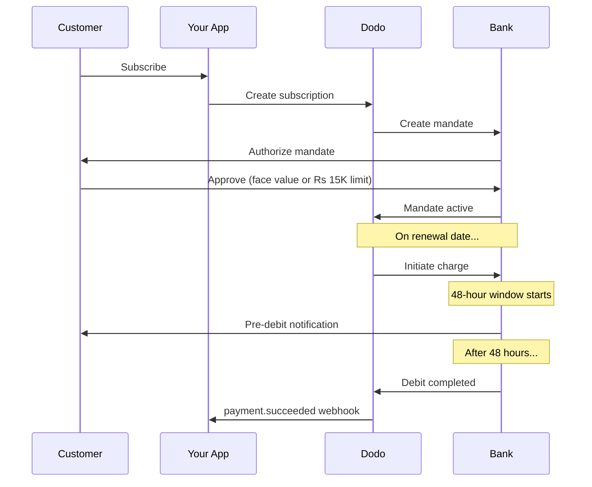

L'Inde dispose d'une infrastructure de paiement unique dominée par l'UPI (plus de 60 % des transactions numériques) et les cartes Rupay. Dodo Payments prend en charge les deux avec une conformité totale à la RBI pour les mandats d'abonnement.

## Pourquoi les Méthodes de Paiement en Inde Comptent

<CardGroup cols={3}>
{/* LOCKED_PATTERN_fef1794963d9b6cdb65542c69efa8053 */}
UPI traite plus de 10 milliards de transactions par mois. De nombreux clients indiens ne possèdent pas de cartes internationales.
</Card>

{/* LOCKED_PATTERN_b5f6c506ac5b1c8b661845e44f7fdc6c */}
UPI présente des frais de transaction quasi nuls. Excellent pour les transactions à volume élevé et faibles montants.
</Card>

{/* LOCKED_PATTERN_4d6aa00708c7fde98b8f2cfed63c3234 */}
Contrairement à la plupart des méthodes de paiement alternatives, UPI et Rupay prennent en charge les paiements récurrents via les mandats de la RBI.
</Card>
</CardGroup>

## Méthodes Pris en Charge

| Méthode | Type | Abonnements | Montant Min |
| :----- | :--- | :-----------: | :--------- |
| **UPI Collect** | QR code / VPA | Oui* | ₹1 |
| **Rupay Crédit** | Carte | Oui* | ₹1 |
| **Rupay Débit** | Carte | Oui* | ₹1 |

*Les abonnements nécessitent des mandats conformes à la RBI avec des règles de traitement spéciales.

## Configuration

### Types de Méthodes API

| Type | Description |
| :--- | :---------- |
| `upi_collect` | UPI via code QR ou saisie VPA |
| `credit` | Cartes de crédit, y compris Rupay |
| `debit` | Cartes de débit, y compris Rupay |

### Exemple : Checkout axé sur l'Inde

```javascript
const session = await client.checkoutSessions.create({
  product_cart: [{ product_id: 'prod_123', quantity: 1 }],
  allowed_payment_method_types: [
    'upi_collect',
    'credit',
    'debit'
  ],
  billing_currency: 'INR',
  customer: {
    email: 'customer@example.in',
    name: 'Priya Sharma',
    phone_number: '+919876543210'
  },
  billing_address: {
    country: 'IN',
    zipcode: '560001'
  },
  return_url: 'https://example.com/success'
});
```

### Exigences pour l'UPI

Pour que UPI apparaisse lors du paiement :
1. **Le pays de facturation** doit être l’Inde (`IN`)
2. **La devise** doit être INR
3. Pour les commerçants non indiens : **Adaptive Currency** doit être activée

<Warning>
Si vous êtes un commerçant non indien et que **Adaptive Currency** n’est pas activée, UPI ne sera pas disponible pour vos clients.
</Warning>

## Abonnements avec Mandats de la RBI

Les abonnements par méthode de paiement indienne fonctionnent selon les règlements de la RBI (Réserve Bank of India) avec des exigences uniques.

### Comment Fonctionnent les Mandats de la RBI



### Types de Mandats

| Montant de l'Abonnement | Type de Mandat | Limite |
| :------------------ | :----------- | :---- |
| **En dessous de Rs 15,000** | Mandat à la demande | Rs 15,000 |
| **Rs 15,000 ou plus** | Mandat à montant fixe | Montant exact de l'abonnement |

**Important pour les changements de plan :** Si une mise à niveau entraîne un montant dépassant la limite du mandat en cours, le paiement échouera et le client devra réautoriser.

### Le Délai de Traitement de 48 Heures

C'est la principale différence par rapport aux paiements par carte internationale :

<Steps>
{/* LOCKED_PATTERN_1168a75869d212ca7106c3911617bd37 */}
À la date de renouvellement prévue, Dodo initie le prélèvement auprès de la banque.
</Step>

{/* LOCKED_PATTERN_303e0505fa00f1fe9b5d2ed06a9b7975 */}
Le client reçoit une notification de sa banque concernant le prochain débit.
</Step>

{/* LOCKED_PATTERN_ccf36ccdabfae2684bf414d6b78bda31 */}
Le client peut annuler le mandat pendant cette période via son application bancaire.
</Step>

{/* LOCKED_PATTERN_171b46159c8bf2894fdd8df12890dd5f */}
Après 48 heures (plus jusqu’à 3 heures supplémentaires pour le traitement bancaire), les fonds sont débités.
</Step>

{/* LOCKED_PATTERN_183bd9c4ee3d030e8b4107a7afb42a77 */}
Le webhook `payment.succeeded` est envoyé après le débit effectif, pas lors de l’initiation.
</Step>
</Steps>

<Warning>
**N’accordez pas d’avantages lors de l’initiation du prélèvement.** Attendez le webhook `payment.succeeded`, qui arrive environ 48 à 51 heures après la date prévue du prélèvement.
</Warning>

### Gestion de la Fenêtre de 48 Heures

```javascript
// DON'T do this:
async function handleSubscriptionRenewal(subscription) {
  // ❌ Bad: Granting access immediately when charge is initiated
  grantPremiumAccess(subscription.customer_id);
}

// DO this:
async function handlePaymentWebhook(event) {
  if (event.type === 'payment.succeeded') {
    // ✅ Good: Only grant access after payment is confirmed
    grantPremiumAccess(event.data.customer_id);
  }
  
  if (event.type === 'payment.failed') {
    // Handle failed payment (mandate cancelled, insufficient funds)
    revokePremiumAccess(event.data.customer_id);
  }
}
```

### Événements Webhook pour les Abonnements Indiens

| Événement | Quand | Action |
| :---- | :--- | :----- |
| `subscription.created` | Mandat autorisé | Enregistrer le début de l’abonnement |
| `payment.succeeded` | ~48 h après la date du prélèvement | Accorder/poursuivre l’accès |
| `payment.failed` | Débit échoué | Notifier le client, suspendre l’accès |
| `subscription.on_hold` | Paiement échoué | Inviter à mettre à jour le moyen de paiement |
| `subscription.active` | Réactivé après paiement | Restaurer l’accès |

## Tests

### Identifiants de Test UPI

| Statut | ID UPI |
| :----- | :----- |
| Succès | `success@upi` |
| Échec | `failure@upi` |

### Numéros de Test de Cartes Indiennes

| Marque | Scénario | Numéro de carte | Expiration | CVV |
| :---- | :------- | :---------- | :----- | :-- |
| Visa | Succès | `4576238912771450` | 06/32 | 123 |
| Visa | Refusée | `4706131211212123` | 06/32 | 123 |
| Mastercard | Succès | `5409162669381034` | 06/32 | 123 |
| Mastercard | Refusée | `5105105105105100` | 06/32 | 123 |

## Meilleures Pratiques

<AccordionGroup>
{/* LOCKED_PATTERN_221aaba4b8e7504ee0b95e31b042b2fd */}
Concevez votre application pour gérer le délai entre l’initiation du prélèvement et le paiement effectif. Envisagez :
- Des délais de grâce pour l’accès aux abonnements
- Une communication claire aux clients sur le temps de traitement
- Un traitement piloté par les webhooks, pas par une date
</Accordion>

{/* LOCKED_PATTERN_ba2df03fe2862fb850b01eef0893fa6f */}
Les clients peuvent annuler les mandats via leurs applications bancaires à tout moment. Surveillez les webhooks `subscription.on_hold` et invitez les clients à se réabonner ou à mettre à jour leurs moyens de paiement.
</Accordion>

{/* LOCKED_PATTERN_e710fb81847c744d4006e4fca6c121cf */}
Pour une tarification variable (par exemple à l’usage), réfléchissez à savoir si un mandat à la demande de 15 000 Rs est suffisant. Si les prélèvements risquent de dépasser ce montant, les clients devront réautoriser.
</Accordion>

{/* LOCKED_PATTERN_3761baecc3c28c65031747389aa832d0 */}
Pour les clients indiens, UPI devrait être l’option de paiement principale. De nombreux utilisateurs la préfèrent aux cartes en raison de la familiarité et d’une moindre friction.
</Accordion>
</AccordionGroup>

## Dépannage

<AccordionGroup>
{/* LOCKED_PATTERN_13ae9b97a0d5eeadd371a86881f06ee7 */}
**Vérification :**
1. Pays de facturation défini sur `IN` ?
2. Devise réglée sur `INR` ?
3. Si commerçant non indien : Adaptive Currency activée ?
4. `upi_collect` inclus dans `allowed_payment_method_types` ?

**Solution :** Vérifiez que l’adresse de facturation contient `country: "IN"` et `billing_currency: "INR"`.
</Accordion>

{/* LOCKED_PATTERN_1f64fa5b04b26f30c279116fbd022060 */}
**Cause :** Le nouveau montant dépasse la limite du mandat existant (seuil de 15 000 Rs).

**Solution :** Le client doit mettre à jour son moyen de paiement pour établir un nouveau mandat avec la limite appropriée.
</Accordion>

{/* LOCKED_PATTERN_69921150c2a11d99e3416ff7a65f0f34 */}
**Cause :** Le client a peut-être annulé le mandat pendant la fenêtre de 48 heures, ou sa banque a refusé le débit.

**Solution :** Le client doit réautoriser le mandat ou mettre à jour son moyen de paiement.
</Accordion>

{/* LOCKED_PATTERN_36c4e373527e46486381ecf56059b96b */}
**Cause :** Des ralentissements de l’API bancaire peuvent prolonger le traitement de 2 à 3 heures supplémentaires.

**Solution :** Cela est prévu. Concevez votre système pour gérer des délais variables allant jusqu’à environ 51 heures au total.
</Accordion>

{/* LOCKED_PATTERN_8c8856d83fe8bccc50ae2ce27bf29465 */}
**Cause :** Cas exceptionnel dans les réglementations de la RBI — l’annulation du mandat pendant la fenêtre de traitement n’annule pas immédiatement l’abonnement.

**Solution :** Le prélèvement suivant échouera et l’abonnement passera en `on_hold`. Surveillez les webhooks pour `payment.failed`.
</Accordion>
</AccordionGroup>

## Pages Connexes

<CardGroup cols={2}>
{/* LOCKED_PATTERN_014d7e4ef5d99df996cbbae24da710a6 */}
Consultez tous les moyens de paiement pris en charge.
</Card>

{/* LOCKED_PATTERN_a10e92592ab9390be911120f2bcecbd0 */}
Documentation complète sur les abonnements, y compris les mandats de la RBI.
</Card>

<Card title="Webhooks" icon="webhook" href="/developer-resources/webhooks">
Gestion des webhooks pour les événements de paiement.
</Card>

{/* LOCKED_PATTERN_969f11f876a6712c92c3c11cb433bf1f */}
Toutes les données de test, y compris les identifiants UPI et les cartes indiennes.
</Card>
</CardGroup>
