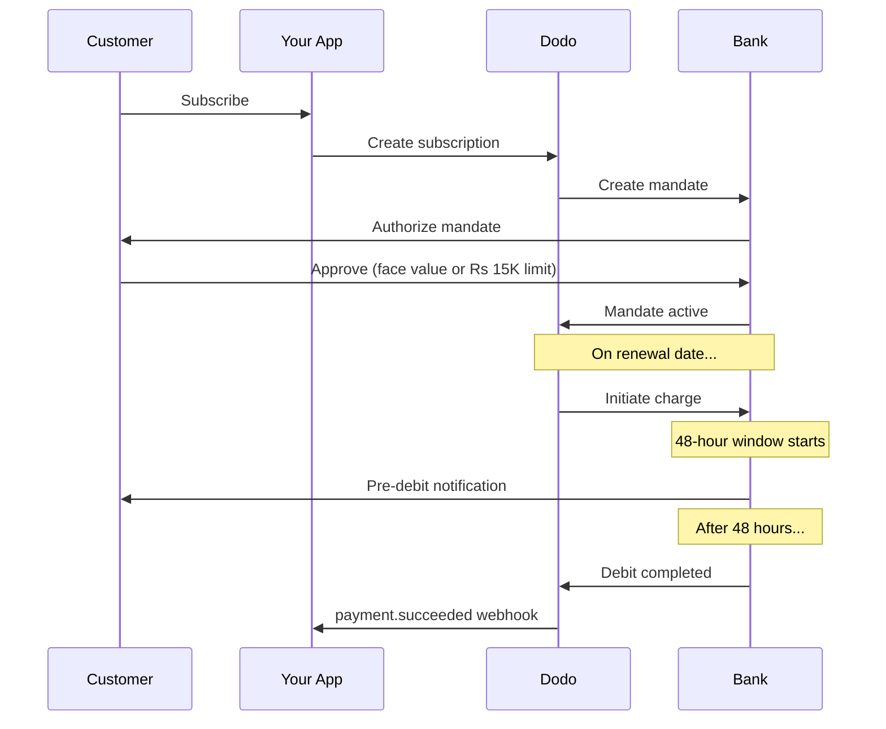

L'Inde dispose d'une infrastructure de paiement unique dominée par l'UPI (plus de 60 % des transactions numériques) et les cartes Rupay. Dodo Payments prend en charge les deux avec une conformité totale à la RBI pour les mandats d'abonnement.

## Pourquoi les Méthodes de Paiement en Inde Comptent

<CardGroup cols={3}>
<Card title="Dominance de l'UPI" icon="mobile">
L'UPI traite plus de 10 milliards de transactions par mois. De nombreux clients indiens n'ont pas de cartes internationales.
</Card>

<Card title="Frais de Transaction Faibles" icon="symbole-de-rupee-indien">
L'UPI a des frais de transaction presque nuls. Excellent pour des transactions de faible valeur en volume élevé.
</Card>

<Card title="Support des Abonnements" icon="repeat">
Contrairement à la plupart des autres méthodes de paiement, l'UPI et Rupay prennent en charge les paiements récurrents via les mandats de la RBI.
</Card>
</CardGroup>

## Méthodes Pris en Charge

| Méthode | Type | Abonnements | Montant Min |
| :----- | :--- | :-----------: | :--------- |
| **UPI Collect** | QR code / VPA | Oui* | ₹1 |
| **Rupay Crédit** | Carte | Oui* | ₹1 |
| **Rupay Débit** | Carte | Oui* | ₹1 |

*Les abonnements nécessitent des mandats conformes à la RBI avec des règles de traitement spéciales.

## Configuration

### Types de Méthodes API

| Type | Description |
| :--- | :---------- |
| `upi_collect` | UPI via QR code ou saisie de VPA |
| `credit` | Cartes de crédit y compris Rupay |
| `debit` | Cartes de débit y compris Rupay |

### Exemple : Checkout axé sur l'Inde

```javascript
const session = await client.checkoutSessions.create({
  product_cart: [{ product_id: 'prod_123', quantity: 1 }],
  allowed_payment_method_types: [
    'upi_collect',
    'credit',
    'debit'
  ],
  billing_currency: 'INR',
  customer: {
    email: 'customer@example.in',
    name: 'Priya Sharma',
    phone_number: '+919876543210'
  },
  billing_address: {
    country: 'IN',
    zipcode: '560001'
  },
  return_url: 'https://example.com/success'
});
```

### Exigences pour l'UPI

Pour que l'UPI apparaisse au moment du paiement :
1. **Pays de facturation** doit être l'Inde (`IN`)
2. **Monnaie** doit être l'INR
3. Pour les commerçants non indiens : **Monnaie Adaptative** doit être activée

<Warning>
Si vous êtes un commerçant non indien et que la Monnaie Adaptative n'est pas activée, l'UPI ne sera pas disponible pour vos clients.
</Warning>

## Abonnements avec Mandats de la RBI

Les abonnements par méthode de paiement indienne fonctionnent selon les règlements de la RBI (Réserve Bank of India) avec des exigences uniques.

### Comment Fonctionnent les Mandats de la RBI



### Types de Mandats

| Montant de l'Abonnement | Type de Mandat | Limite |
| :------------------ | :----------- | :---- |
| **En dessous de Rs 15,000** | Mandat à la demande | Rs 15,000 |
| **Rs 15,000 ou plus** | Mandat à montant fixe | Montant exact de l'abonnement |

**Important pour les changements de plan :** Si une mise à niveau entraîne un montant dépassant la limite du mandat en cours, le paiement échouera et le client devra réautoriser.

### Le Délai de Traitement de 48 Heures

C'est la principale différence par rapport aux paiements par carte internationale :

<Steps>
<Step title="Charge Initiée (Jour 0)">
À la date de renouvellement prévue, Dodo initie la charge auprès de la banque.
</Step>

<Step title="Notification Pré-Débit">
Le client reçoit une notification de sa banque concernant le prochain débit.
</Step>

<Step title="Fenêtre de 48 Heures">
Le client peut annuler le mandat durant cette période via son application bancaire.
</Step>

<Step title="Débit Complété (~48-51 heures)">
Après 48 heures (plus jusqu'à 3 heures supplémentaires pour le traitement bancaire), les fonds sont débités.
</Step>

<Step title="Webhook Envoyé">
`payment.succeeded` le webhook est envoyé après le débit réel, et non à l'initiation.
</Step>
</Steps>

<Warning>
**Ne pas accorder de bénéfices lors de l'initiation de la charge.** Attendez le webhook `payment.succeeded`, qui arrive ~48-51 heures après la date de charge prévue.
</Warning>

### Gestion de la Fenêtre de 48 Heures

```javascript
// DON'T do this:
async function handleSubscriptionRenewal(subscription) {
  // ❌ Bad: Granting access immediately when charge is initiated
  grantPremiumAccess(subscription.customer_id);
}

// DO this:
async function handlePaymentWebhook(event) {
  if (event.type === 'payment.succeeded') {
    // ✅ Good: Only grant access after payment is confirmed
    grantPremiumAccess(event.data.customer_id);
  }
  
  if (event.type === 'payment.failed') {
    // Handle failed payment (mandate cancelled, insufficient funds)
    revokePremiumAccess(event.data.customer_id);
  }
}
```

### Événements Webhook pour les Abonnements Indiens

| Événement | Quand | Action |
| :---- | :--- | :----- |
| `subscription.created` | Mandat autorisé | Enregistrer le début de l'abonnement |
| `payment.succeeded` | ~48h après la date de charge | Accorder/continuer l'accès |
| `payment.failed` | Débit échoué | Informer le client, suspendre l'accès |
| `subscription.on_hold` | Paiement échoué | Demander une mise à jour du mode de paiement |
| `subscription.active` | Réactivé après paiement | Restaurer l'accès |

## Tests

### Identifiants de Test UPI

| Statut | ID UPI |
| :----- | :----- |
| Succès | `success@upi` |
| Échec | `failure@upi` |

### Numéros de Test de Cartes Indiennes

| Marque | Scénario | Numéro de Carte | Expiration | CVV |
| :---- | :------- | :---------- | :----- | :-- |
| Visa | Succès | `4576238912771450` | 06/32 | 123 |
| Visa | Rejeté | `4706131211212123` | 06/32 | 123 |
| Mastercard | Succès | `5409162669381034` | 06/32 | 123 |
| Mastercard | Rejeté | `5105105105105100` | 06/32 | 123 |

## Meilleures Pratiques

<AccordionGroup>
<Accordion title="Planifiez le délai de 48 heures">
Construisez votre application pour gérer le délai entre l'initiation de la charge et le paiement réel. Pensez à :
- Périodes de grâce pour l'accès aux abonnements
- Communication claire aux clients concernant le temps de traitement
- Remplissage basé sur les webhooks, et non sur les dates
</Accordion>

<Accordion title="Gérer les annulations de mandat">
Les clients peuvent annuler les mandats via leurs applications bancaires à tout moment. Surveillez les webhooks `subscription.on_hold` et incitez les clients à se réabonner ou à mettre à jour leurs modes de paiement.
</Accordion>

<Accordion title="Définir des montants de mandat appropriés">
Pour la tarification variable (par exemple, basée sur l'utilisation), considérez si un mandat à la demande de Rs 15,000 est suffisant. Si les frais pourraient dépasser cela, les clients devront réautoriser.
</Accordion>

<Accordion title="Proposez l'UPI de manière proéminente">
Pour les clients indiens, l'UPI devrait être l'option de paiement principale. De nombreux utilisateurs préfèrent l'UPI aux cartes en raison de la familiarité et de la moindre friction.
</Accordion>
</AccordionGroup>

## Dépannage

<AccordionGroup>
<Accordion title="L'UPI n'apparaît pas au moment du paiement">
**Vérifiez :**
1. Pays de facturation défini sur `IN`?
2. Monnaie définie sur `INR`?
3. Si commerçant non indien : Monnaie Adaptative activée ?
4. `upi_collect` inclus dans `allowed_payment_method_types`?

**Solution :** Vérifiez que l'adresse de facturation a `country: "IN"` et `billing_currency: "INR"`.
</Accordion>

<Accordion title="Échec de la charge d'abonnement après mise à niveau">
**Cause :** Le montant de la nouvelle charge dépasse la limite de mandat existante (seuil de Rs 15,000).

**Solution :** Le client doit mettre à jour le mode de paiement pour établir un nouveau mandat avec la limite correcte.
</Accordion>

<Accordion title="Abonnement en attente mais le client prétend ne pas avoir annulé">
**Cause :** Le client a peut-être annulé le mandat durant la fenêtre de 48 heures, ou sa banque a rejeté le débit.

**Solution :** Le client doit réautoriser le mandat ou mettre à jour son mode de paiement.
</Accordion>

<Accordion title="Délai de prélèvement de paiement dépassé 48 heures">
**Cause :** Les retards de l'API bancaire peuvent prolonger le traitement de 2 à 3 heures supplémentaires.

**Solution :** C'est attendu. Concevez votre système pour gérer des retards variables jusqu'à ~51 heures au total.
</Accordion>

<Accordion title="Mandat annulé mais abonnement toujours actif">
**Cause :** Cas particulier dans les règlements de la RBI — l'annulation de mandat durant la fenêtre de traitement n'annule pas immédiatement l'abonnement.

**Solution :** La prochaine charge échouera et l'abonnement passera en `on_hold`. Surveillez les webhooks pour `payment.failed`.
</Accordion>
</AccordionGroup>

## Pages Connexes

<CardGroup cols={2}>
<Card title="Vue d'ensemble des Méthodes de Paiement" icon="carte-de-crédit" href="/features/payment-methods">
Voir toutes les méthodes de paiement prises en charge.
</Card>

<Card title="Abonnements" icon="repeat" href="/features/subscription">
Documentation complète sur les abonnements y compris les mandats de la RBI.
</Card>

<Card title="Webhooks" icon="webhook" href="/developer-resources/webhooks">
Gestion des webhooks pour les événements de paiement.
</Card>

<Card title="Processus de Test" icon="flacon" href="/miscellaneous/testing-process">
Toutes les données de test y compris les ID UPI et les cartes indiennes.
</Card>
</CardGroup>
