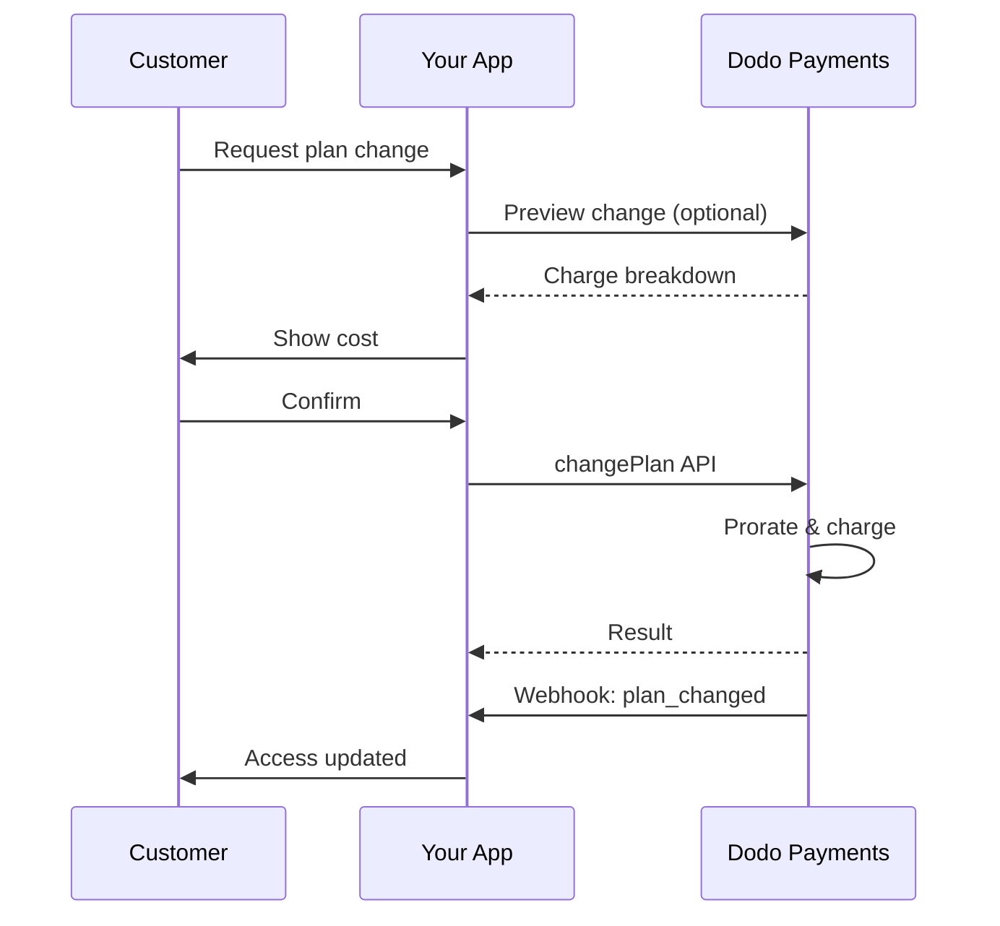
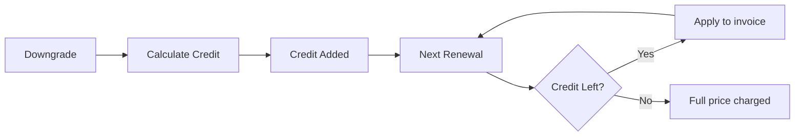

<Info>
Les abonnements vous permettent de vendre un accès continu avec des renouvellements automatisés. Utilisez des cycles de facturation flexibles, des essais gratuits, des modifications de plan et des extensions pour adapter les prix à chaque client.
</Info>

<CardGroup cols={2}>
<Card title="Upgrade & Downgrade" icon="repeat" href="/developer-resources/subscription-upgrade-downgrade">
Contrôlez les modifications de plan avec la proratisation et les mises à jour de quantité.
</Card>

<Card title="On‑Demand Subscriptions" icon="bolt" href="/developer-resources/ondemand-subscriptions">
Autorisez un mandat maintenant et facturez plus tard avec des montants personnalisés.
</Card>

<Card title="Customer Portal" icon="id-card" href="/features/customer-portal">
Permettez aux clients de gérer les plans, la facturation et les annulations.
</Card>

<Card title="Subscription Webhooks" icon="code" href="/developer-resources/webhooks/intents/subscription">
Réagissez aux événements du cycle de vie tels que créé, renouvelé et annulé.
</Card>
</CardGroup>

## Qu'est-ce que les Abonnements ?

Les abonnements sont des produits récurrents que les clients achètent selon un calendrier. Ils sont idéaux pour :

- **Licences SaaS** : Applications, API ou accès à des plateformes
- **Adhésions** : Communautés, programmes ou clubs
- **Contenu numérique** : Cours, médias ou contenu premium
- **Plans de support** : SLA, packages de réussite ou maintenance

## Avantages Clés

- **Revenus prévisibles** : Facturation récurrente avec renouvellements automatisés
- **Cycles flexibles** : Mensuels, annuels, intervalles personnalisés et essais
- **Agilité des plans** : Prorata pour les mises à niveau et rétrogradations
- **Options supplémentaires et sièges** : Attachez des mises à niveau optionnelles et quantifiables
- **Paiement sans friction** : Paiement hébergé et portail client
- **Orienté développeur** : API claires pour la création, les changements et le suivi d'utilisation

## Création d'Abonnements

Créez des produits d'abonnement dans votre tableau de bord Dodo Payments, puis vendez-les via le paiement ou votre API. Séparer les produits des abonnements actifs vous permet de versionner les prix, d'attacher des options supplémentaires et de suivre les performances de manière indépendante.

### Création de produit d'abonnement

Configurez les champs dans le tableau de bord pour définir comment votre abonnement se vend, se renouvelle et se facture. Les sections ci-dessous correspondent directement à ce que vous voyez dans le formulaire de création.

#### Détails du produit

- **Nom du produit** (obligatoire) : Le nom affiché dans le paiement, le portail client et les factures.
- **Description du produit** (obligatoire) : Une déclaration de valeur claire qui apparaît dans le paiement et les factures.
- **Image du produit** (obligatoire) : PNG/JPG/WebP jusqu'à 3 Mo. Utilisé dans le paiement et les factures.
- **Marque** : Associez le produit à une marque spécifique pour le thème et les e-mails.
- **Catégorie fiscale** (obligatoire) : Choisissez la catégorie (par exemple, SaaS) pour déterminer les règles fiscales.

<Tip>
Choisissez la catégorie fiscale la plus précise pour garantir une collecte correcte des taxes par région.
</Tip>

#### Tarification

- **Type de tarification** : Choisissez <b>Abonnement</b> (ce guide). Les alternatives sont Paiement unique et Facturation basée sur l'utilisation.
- **Prix** (obligatoire) : Prix de base récurrent avec devise.
- **Remise applicable (%)** : Pourcentage de remise optionnel appliqué au prix de base ; reflété dans le processus de paiement et les factures.
- **Répéter le paiement tous les** (obligatoire) : Intervalle pour les renouvellements, par exemple, tous les 1 mois. Sélectionnez la cadence (mois ou années) et la quantité.
- **Période d'abonnement** (obligatoire) : Durée totale pendant laquelle l'abonnement reste actif (par exemple, 10 ans). Après cette période, les renouvellements s'arrêtent à moins d'être prolongés.
- **Jours de période d'essai** (obligatoire) : Définissez la durée de l'essai en jours. Utilisez 0 pour désactiver les essais. Le premier prélèvement se produit automatiquement à la fin de l'essai.
- **Sélectionner un add-on** : Attachez jusqu'à 10 add-ons que les clients peuvent acheter en plus du plan de base.

<Warning>
Modifier les tarifs d’un produit actif impacte les nouveaux achats. Les abonnements existants suivent vos paramètres de changement de plan et de proratisation.
</Warning>

<Info>
Les extensions sont idéales pour des extras quantifiables comme des sièges ou du stockage. Vous pouvez contrôler les quantités autorisées et le comportement de proratisation lorsque les clients les modifient.
</Info>

#### Paramètres avancés

- **Tarification incluant les taxes** : Affichez les prix incluant les taxes applicables. Le calcul final des taxes varie toujours selon l'emplacement du client.
- **Générer des clés de licence** : Émettez une clé unique à chaque client après achat. Consultez le guide des <a href="/features/license-keys">Clés de licence</a>.
- **Livraison de produit numérique** : Livrez des fichiers ou du contenu automatiquement après achat. En savoir plus dans <a href="/features/digital-product-delivery">Livraison de produit numérique</a>.
- **Métadonnées** : Attachez des paires clé-valeur personnalisées pour le marquage interne ou les intégrations client. Consultez <a href="/api-reference/metadata">Métadonnées</a>.

<Tip>
Utilisez les métadonnées pour stocker les identifiants de votre système (par ex., accountId) afin de pouvoir rapprocher ultérieurement les événements et les factures.
</Tip>

## Essais d'Abonnement

Les essais permettent aux clients d'accéder aux abonnements sans paiement immédiat. Le premier prélèvement se produit automatiquement à la fin de l'essai.

### Configuration des Essais

Définissez **Trial Period Days** dans la section tarification du produit (utilisez `0` pour désactiver). Vous pouvez outrepasser cela lors de la création d’abonnements :

```typescript
// Via subscription creation
const subscription = await client.subscriptions.create({
  customer_id: 'cus_123',
  product_id: 'prod_monthly',
  trial_period_days: 14  // Overrides product's trial period
});

// Via checkout session
const session = await client.checkoutSessions.create({
  product_cart: [{ product_id: 'prod_monthly', quantity: 1 }],
  subscription_data: { trial_period_days: 14 }
});
```

<Warning>
La valeur `trial_period_days` doit être comprise entre 0 et 10 000 jours.
</Warning>

### Détection de l'État d'Essai

<Warning>
Actuellement, il n’existe aucun champ direct pour détecter le statut d’essai. Voici une solution de contournement nécessitant de requêter les paiements, ce qui est inefficace. Nous travaillons sur une solution plus efficiente.
</Warning>

Pour déterminer si un abonnement est en période d'essai, récupérez la liste des paiements pour l'abonnement. S'il y a exactement un paiement d'un montant de 0, l'abonnement est en période d'essai :

```typescript
const subscription = await client.subscriptions.retrieve('sub_123');
const payments = await client.payments.list({
  subscription_id: subscription.subscription_id
});

// Check if subscription is in trial
const isInTrial = payments.items.length === 1 && 
                  payments.items[0].total_amount === 0;
```

### Mise à Jour de la Période d'Essai

Prolongez la période d’essai en mettant à jour `next_billing_date` :

```typescript
await client.subscriptions.update('sub_123', {
  next_billing_date: '2025-02-15T00:00:00Z'  // New trial end date
});
```

<Warning>
Vous ne pouvez pas définir `next_billing_date` sur une date passée. La date doit être dans le futur.
</Warning>

## Changements de Plan d'Abonnement

Les changements de plan vous permettent de mettre à niveau ou de rétrograder des abonnements, d'ajuster les quantités ou de migrer vers différents produits. Chaque changement déclenche un prélèvement immédiat basé sur le mode de prorata que vous sélectionnez.

<Tip>
Vous pouvez changer les plans d’abonnement et mettre à jour la prochaine date de facturation directement depuis le tableau de bord Dodo Payments. Cela offre un moyen rapide d’ajuster les abonnements pour des demandes du support client, des promotions ou des migrations de plan sans passer par des appels API.
</Tip>

<Tip>
**Activez les modifications de plan en self-service :** Vous souhaitez que les clients améliorent ou dégradent eux-mêmes leurs abonnements via le Portail client ? Ajoutez vos produits d’abonnement à une Collection de produits et activez « Allow Subscription Updates » dans vos Paramètres d’abonnement.
</Tip>



<Card title="Product Collections" icon="layer-group" href="/features/product-collections">
  Regroupez les produits liés dans des collections pour permettre des parcours de montée/descente en gamme fluides dans le Portail client.
</Card>

### Modes de proratisation

Choisissez comment les clients sont facturés lors d’un changement de plan :

<Info>
**Comparaison rapide des trois modes de proratisation :**

| | `prorated_immediately` | `difference_immediately` | `full_immediately` |
|---|---|---|---|
| **Montée en gamme** | Facturation proratisée pour les jours restants | Différence de prix intégrale facturée | Montant total du nouveau plan facturé |
| **Descente en gamme** | Crédit proratisé pour les jours restants | Différence de prix intégrale sous forme de crédit | Aucun crédit, facturation complète |
| **Cycle de facturation** | Reste inchangé | Reste inchangé | Réinitialisé à aujourd’hui |
| **Idéal pour** | Facturation équitable basée sur le temps | Changements de niveau simples | Réinitialiser le cycle de facturation |
</Info>

#### `prorated_immediately`
Facture le montant proratisé en fonction du temps restant dans le cycle de facturation actuel. Idéal pour une facturation équitable qui tient compte du temps non utilisé.

```typescript
await client.subscriptions.changePlan('sub_123', {
  product_id: 'prod_pro',
  quantity: 1,
  proration_billing_mode: 'prorated_immediately'
});
```

#### `difference_immediately`
Facture immédiatement la différence de prix (upgrade) ou ajoute un crédit pour les prochains renouvellements (downgrade). Idéal pour des scénarios de montée/descente en gamme simples.

```typescript
// Upgrade: charges $50 (difference between $30 and $80)
// Downgrade: credits remaining value, auto-applied to renewals
await client.subscriptions.changePlan('sub_123', {
  product_id: 'prod_pro',
  quantity: 1,
  proration_billing_mode: 'difference_immediately'
});
```

<Info>
Les crédits provenant des descentes en gamme avec `difference_immediately` sont liés à l’abonnement et appliqués automatiquement aux renouvellements futurs. Ils diffèrent des <a href="/features/customer-credit">Crédits client</a>.
</Info>

Lorsqu'un client effectue une descente en gamme avec `difference_immediately`, la valeur inutilisée devient un crédit lié à l’abonnement qui compense automatiquement les renouvellements futurs :



#### `full_immediately`
Facture immédiatement le montant total du nouveau plan, en ignorant le temps restant. Idéal pour réinitialiser les cycles de facturation.

```typescript
await client.subscriptions.changePlan('sub_123', {
  product_id: 'prod_monthly',
  quantity: 1,
  proration_billing_mode: 'full_immediately'
});
```

<AccordionGroup>
<Accordion title="Example: Prorated upgrade calculation">

**Scénario** : Un client sur Basic (30 $/mois) passe à Pro (80 $/mois) le jour 16 d’un cycle de 30 jours en utilisant `prorated_immediately`.

```
Unused credit from Basic = $30 × (15 remaining / 30 total) = $15.00
Prorated cost of Pro     = $80 × (15 remaining / 30 total) = $40.00
────────────────────────────────────────────────────────────────────
Immediate charge         = $40.00 − $15.00 = $25.00
```

Renouvellement suivant à la date de facturation initiale : **80,00 $/mois**.

<Tip>
Pour des exemples de calcul plus détaillés et des cas limites, consultez notre [Guide de montée/descente en gamme](/developer-resources/subscription-upgrade-downgrade).
</Tip>

</Accordion>
<Accordion title="Example: Downgrade credit calculation">

**Scénario** : Un client sur Pro (80 $/mois) descend vers Starter (20 $/mois) en utilisant `difference_immediately`.

```
Credit = Old plan − New plan = $80 − $20 = $60.00
```

Le crédit de 60 $ s’applique automatiquement aux renouvellements futurs :
- Renouvellement 1 : 20 $ − 20 $ (crédit) = **0,00 $** (40 $ de crédit restants)
- Renouvellement 2 : 20 $ − 20 $ (crédit) = **0,00 $** (20 $ de crédit restants)  
- Renouvellement 3 : 20 $ − 20 $ (crédit) = **0,00 $** (crédit épuisé)
- Renouvellement 4 : **20,00 $** (prix total)

<Info>
En savoir plus sur la gestion des crédits dans le [Guide de montée/descente en gamme](/developer-resources/subscription-upgrade-downgrade).
</Info>

</Accordion>
</AccordionGroup>

### Modifier les plans avec des extensions

Modifiez les extensions lors des changements de plan. Les extensions sont incluses dans les calculs de proratisation :

```typescript
await client.subscriptions.changePlan('sub_123', {
  product_id: 'prod_pro',
  quantity: 1,
  proration_billing_mode: 'difference_immediately',
  addons: [{ addon_id: 'addon_extra_seats', quantity: 2 }]  // Add add-ons
  // addons: []  // Empty array removes all existing add-ons
});
```

<Info>
Les changements de plan déclenchent des prélèvements immédiats. En cas d’échec, l’abonnement peut passer en état `on_hold`. Suivez les modifications via les événements webhook `subscription.plan_changed`.
</Info>

### Prévisualisation des changements de plan

Avant de valider un changement de plan, prévisualisez le montant exact et l’abonnement résultant :

```typescript
const preview = await client.subscriptions.previewChangePlan('sub_123', {
  product_id: 'prod_pro',
  quantity: 1,
  proration_billing_mode: 'prorated_immediately'
});

// Show customer the charge before confirming
console.log('You will be charged:', preview.immediate_charge.summary);
```

<Card title="Preview Change Plan API" icon="eye" href="/api-reference/subscriptions/preview-change-plan">
  Prévisualisez les changements de plan avant de les valider.
</Card>

## États de l’abonnement

Les abonnements peuvent passer par différents états au cours de leur cycle de vie :

- **`active`** : L’abonnement est actif et se renouvelle automatiquement
- **`on_hold`** : L’abonnement est mis en pause à cause d’un paiement échoué. Une mise à jour du moyen de paiement est nécessaire pour réactiver
- **`cancelled`** : L’abonnement est annulé et ne se renouvellera pas
- **`expired`** : L’abonnement a atteint sa date de fin
- **`pending`** : L’abonnement est en cours de création ou de traitement

### État en pause

Un abonnement passe en état `on_hold` lorsque :

- Un paiement de renouvellement échoue (fonds insuffisants, carte expirée, etc.)
- La facturation d’un changement de plan échoue
- L’autorisation du moyen de paiement échoue

<Warning>
Lorsqu’un abonnement est en état `on_hold`, il ne se renouvelle pas automatiquement. Vous devez mettre à jour le moyen de paiement pour réactiver l’abonnement.
</Warning>

### Réactiver depuis l’état en pause

Pour réactiver un abonnement en état `on_hold`, mettez à jour le moyen de paiement. Cela permet automatiquement :

1. Crée un prélèvement pour le solde restant
2. Génère une facture
3. Traite le paiement avec le nouveau moyen de paiement
4. Réactive l’abonnement vers l’état `active` après paiement réussi

```typescript
// Reactivate subscription from on_hold
const response = await client.subscriptions.updatePaymentMethod('sub_123', {
  type: 'new',
  return_url: 'https://example.com/return'
});

// For on_hold subscriptions, a charge is automatically created
if (response.payment_id) {
  console.log('Charge created:', response.payment_id);
  // Redirect customer to response.payment_link to complete payment
  // Monitor webhooks for payment.succeeded and subscription.active
}
```

<Info>
Après avoir mis à jour avec succès le moyen de paiement d’un abonnement `on_hold`, vous recevrez les événements webhook `payment.succeeded` suivis de `subscription.active`.
</Info>

## Gestion de l’API

<AccordionGroup>
<Accordion title="Create subscriptions">
Utilisez `POST /subscriptions` pour créer des abonnements de manière programmatique à partir de produits, avec essais et extensions optionnels.
<Card title="API Reference" icon="code" href="/api-reference/subscriptions/post-subscriptions">
Consultez l’API de création d’abonnement.
</Card>
</Accordion>

### Changements de plan avec prorata
Mettez à niveau ou baissez un abonnement et contrôlez le comportement de prorata :

<Accordion title="Update subscriptions">
Utilisez `PATCH /subscriptions/{id}` pour mettre à jour les quantités, annuler à la prochaine date de facturation ou modifier les métadonnées.
<Card title="API Reference" icon="code" href="/api-reference/subscriptions/patch-subscriptions">
Découvrez comment mettre à jour les détails d’un abonnement.
</Card>
</Accordion>

### Annuler à la fin de la période
Planifiez une annulation sans résiliation immédiate de l'accès :

<Accordion title="Change plans (proration)">
Changez le produit actif et les quantités avec des contrôles de proratisation.
<Card title="API Reference" icon="code" href="/api-reference/subscriptions/change-plan">
Passez en revue les options de changement de plan.
</Card>
</Accordion>

### Abonnements à la demande
Créez un abonnement à la demande et facturez plus tard si nécessaire :

<Accordion title="On‑demand charges">
Pour les abonnements à la demande, facturez des montants spécifiques sur demande.
<Card title="API Reference" icon="code" href="/api-reference/subscriptions/create-charge">
Facturez un abonnement à la demande.
</Card>
</Accordion>

### Mettre à jour le mode de paiement pour un abonnement actif
Mettez à jour le mode de paiement pour un abonnement actif :

<Accordion title="List and retrieve">
Utilisez `GET /subscriptions` pour lister tous les abonnements et `GET /subscriptions/{id}` pour en récupérer un.
<Card title="API Reference" icon="code" href="/api-reference/subscriptions/get-subscriptions">
Parcourez les API de listing et de récupération.
</Card>
</Accordion>

### Réactiver un abonnement depuis l'état en attente
Réactivez un abonnement qui a été mis en attente en raison d'un paiement échoué :

<Accordion title="Usage history">
Récupérez l’usage enregistré pour les modèles tarifaires mesurés ou hybrides.
<Card title="API Reference" icon="code" href="/api-reference/subscriptions/get-usage-history">
Consultez l’API d’historique d’usage.
</Card>
</Accordion>

## Abonnements avec mandats conformes à la RBI

<Accordion title="Update payment method">
Mettez à jour le moyen de paiement d’un abonnement. Pour les abonnements actifs, cela met à jour le moyen de paiement pour les futurs renouvellements. Pour ceux en état `on_hold`, cela réactive l’abonnement en créant un prélèvement pour les sommes dues restantes.
<Card title="API Reference" icon="code" href="/api-reference/subscriptions/update-payment-method">
Apprenez à mettre à jour les moyens de paiement et à réactiver les abonnements.
</Card>
</Accordion>
</AccordionGroup>

  ### Limites de mandat

## Cas d’usage courants

- **SaaS et API** : accès par niveaux avec extensions pour les sièges ou l’usage
- **Contenu et médias** : accès mensuel avec essais introductifs
- **Plans de support B2B** : contrats annuels avec extensions de support premium
- **Outils et plugins** : clés de licence et versions publiées

## Exemples d’intégration

### Sessions de paiement (abonnements)
Lors de la création de sessions de paiement, incluez votre produit d’abonnement et les extensions optionnelles :

```typescript
const session = await client.checkoutSessions.create({
  product_cart: [
    {
      product_id: 'prod_subscription',
      quantity: 1
    }
  ]
});
```

### Changements de plan avec proratisation
Mettez à niveau ou réglez à la baisse un abonnement et contrôlez le comportement de proratisation :

```typescript
await client.subscriptions.changePlan('sub_123', {
  product_id: 'prod_new',
  quantity: 1,
  proration_billing_mode: 'difference_immediately'
});
```

### Annuler à la prochaine date de facturation
Programmez une annulation prenant effet à la fin de la période de facturation en cours :

```typescript
await client.subscriptions.update('sub_123', {
  cancel_at_next_billing_date: true
});
```

### Abonnements à la demande
Créez un abonnement à la demande et facturez plus tard selon les besoins :

```typescript
const onDemand = await client.subscriptions.create({
  customer_id: 'cus_123',
  product_id: 'prod_on_demand',
  on_demand: true
});

await client.subscriptions.createCharge(onDemand.id, {
  amount: 4900,
  currency: 'USD',
  description: 'Extra usage for September'
});
```

### Mettre à jour le moyen de paiement pour un abonnement actif
Mettez à jour le moyen de paiement d’un abonnement actif :

```typescript
// Update with new payment method
const response = await client.subscriptions.updatePaymentMethod('sub_123', {
  type: 'new',
  return_url: 'https://example.com/return'
});

// Or use existing payment method
await client.subscriptions.updatePaymentMethod('sub_123', {
  type: 'existing',
  payment_method_id: 'pm_abc123'
});
```

### Réactiver un abonnement en pause
Réactivez un abonnement mis en pause à cause d’un paiement échoué :

```typescript
// Update payment method - automatically creates charge for remaining dues
const response = await client.subscriptions.updatePaymentMethod('sub_123', {
  type: 'new',
  return_url: 'https://example.com/return'
});

if (response.payment_id) {
  // Charge created for remaining dues
  // Redirect customer to response.payment_link
  // Monitor webhooks: payment.succeeded → subscription.active
}
```

## Abonnements avec mandats conformes à la RBI

  Les abonnements UPI et par carte indienne fonctionnent sous la réglementation de la RBI (Reserve Bank of India) avec des exigences de mandat spécifiques :

  ### Limites des mandats

  Le type et le montant du mandat dépendent du prélèvement récurrent de votre abonnement :

  - **Montants inférieurs à 15 000 Rs :** Nous créons un mandat à la demande pour 15 000 INR. Le montant de l’abonnement est prélevé périodiquement selon votre fréquence d’abonnement, jusqu’à la limite du mandat.
  - **Montants de 15 000 Rs ou plus :** Nous créons un mandat d’abonnement (ou un mandat à la demande) pour le montant exact de l’abonnement.

Pour des informations détaillées sur les mandats conformes à la RBI pour les moyens de paiement indiens, consultez la page <a href="/features/payment-methods/india">Méthodes de paiement en Inde</a>.

  ### Considérations pour les montées et descentes de gamme

  **Important :** Lors des montées ou descentes en gamme, tenez compte avec soin des limites de mandat :

  - Si une montée ou descente en gamme entraîne un montant de prélèvement supérieur à 15 000 Rs et dépassant la limite de paiement à la demande existante, la transaction peut échouer.
  - Dans ce cas, le client peut devoir mettre à jour son moyen de paiement ou modifier à nouveau l’abonnement pour établir un nouveau mandat avec la limite appropriée.

  ### Autorisation pour les prélèvements de gros montant

  Pour les prélèvements d’abonnement de 15 000 Rs ou plus :

  - Leur banque demandera au client d’autoriser la transaction.
  - Si le client n’autorise pas la transaction, celle-ci échouera et l’abonnement sera mis en pause.

  ### Délai de traitement de 48 heures

  **Chronologie de traitement :** Les prélèvements récurrents sur cartes indiennes et abonnements UPI suivent un schéma de traitement spécifique :

  - Les prélèvements sont **initiés** à la date prévue selon votre fréquence d’abonnement.
  - La **déduction** effective du compte du client n’intervient qu’après **48 heures** à partir de l’initiation du paiement.
  - Cette fenêtre de 48 heures peut s’étendre jusqu’à **2 à 3 heures supplémentaires** selon les réponses des API bancaires.

  ### Fenêtre d’annulation du mandat

  Pendant la fenêtre de traitement de 48 heures :

  - Les clients peuvent annuler le mandat via leurs applications bancaires.
  - Si un client annule le mandat pendant cette période, l’abonnement restera **actif** (il s’agit d’un cas particulier spécifique aux abonnements AutoPay par carte indienne et UPI).
  - Toutefois, la déduction effective peut échouer, et dans ce cas, nous mettrons l’abonnement **en pause**.

  **Gestion des cas particuliers :** Si vous accordez des avantages, des crédits ou l’usage de l’abonnement dès l’initiation du prélèvement, vous devez prendre en compte cette fenêtre de 48 heures dans votre application. Envisagez :

  - Retarder l’activation des avantages jusqu’à la confirmation du paiement
  - Mettre en place des périodes de grâce ou un accès temporaire
  - Surveiller l’état des abonnements pour détecter les annulations de mandat
  - Gérer les états d’abonnement en pause dans la logique de votre application

  <Tip>
  Surveillez les webhooks d’abonnement pour suivre les changements de statut de paiement et gérer les cas particuliers où les mandats sont annulés pendant la fenêtre de 48 heures.
  </Tip>

## Bonnes pratiques

- **Commencez par des niveaux clairs** : 2 à 3 plans avec des différences évidentes
- **Communiquez les tarifs** : affichez les totaux, la proratisation et le prochain renouvellement
- **Utilisez les essais avec discernement** : transformez avec un onboarding, pas juste du temps
- **Exploitez les extensions** : gardez les plans de base simples et proposez des extras en upsell
- **Testez les changements** : validez les changements de plan et la proratisation en mode test

<Info>
Les abonnements constituent une base flexible pour les revenus récurrents. Commencez simplement, testez à fond, et itérez en fonction de l’adoption, du churn et des métriques d’expansion.
</Info>