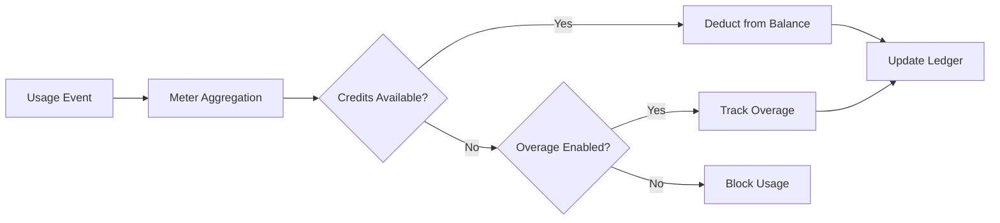

<Info>
Les compteurs convertissent les événements bruts en quantités facturables. Ils filtrent les événements et appliquent des fonctions d’agrégation (Count, Sum, Max, Last) pour calculer l’usage par client.
</Info>

<Frame>

</Frame>

## Ressources API

<AccordionGroup>
<Accordion title="View Meter API References">
<CardGroup cols={2}>
<Card title="Create Meter" icon="plus" href="/api-reference/meters/create-meter">
Créez des compteurs via l’API.
</Card>

<Card title="List Meters" icon="list" href="/api-reference/meters/get-meters">
Récupérez tous les compteurs de votre compte.
</Card>

<Card title="Get Meter" icon="eye" href="/api-reference/meters/retrieve-meter">
Obtenez les détails d’un compteur spécifique par son ID.
</Card>

<Card title="Archive Meter" icon="arrow-rotate-right" href="/api-reference/meters/archive-meter">
Archivez un compteur pour arrêter le suivi d’usage.
</Card>

<Card title="Unarchive Meter" icon="arrow-rotate-left" href="/api-reference/meters/unarchive-meter">
Restaurez un compteur archivé pour reprendre le suivi.
</Card>
</CardGroup>
</Accordion>
</AccordionGroup>

## Création d'un compteur

<Steps>
<Step title="Basic Information">
<ParamField path="Meter Name" type="string" required>
Nom descriptif (par ex. "API Requests", "Token Usage")
</ParamField>

<ParamField path="Event Name" type="string" required>
Nom exact de l’événement à faire correspondre (sensible à la casse). Exemples: `api.call`, `image.generated`
</ParamField>
</Step>

<Step title="Aggregation">
<ParamField path="Aggregation Type" type="string" required>
Choisissez comment les événements sont agrégés :

- **Count**: Nombre total d’événements (appels d’API, téléchargements)
- **Sum**: Additionne des valeurs numériques (tokens, octets)
- **Max**: Valeur la plus élevée sur la période (pic d’utilisateurs)
- **Last**: Valeur la plus récente
</ParamField>

<ParamField path="Over Property" type="string">
Clé de métadonnées à agréger (requis pour tous les types sauf Count). Exemples: `tokens`, `bytes`, `duration_ms`
</ParamField>

<ParamField path="Measurement Unit" type="string" required>
Libellé d’unité pour les factures. Exemples: `calls`, `tokens`, `GB`, `hours`
</ParamField>
</Step>

<Step title="Filtering (Optional)">
<Frame>

</Frame>

Ajoutez des conditions pour filtrer les événements comptés :
- **Logique ET** : Toutes les conditions doivent correspondre
- **Logique OU** : Toute condition peut correspondre

**Comparateurs** : égal, différent, supérieur à, inférieur à, contient

Enable filtering, choose logic, add conditions with property key, comparator, and value.
</Step>

<Step title="Create">
Vérifiez la configuration et cliquez sur **Create Meter**.
</Step>
</Steps>

## Visualisation des analyses

<Frame>

</Frame>

Votre tableau de bord des compteurs montre :
- **Aperçu** : Utilisation totale et graphique d'utilisation
- **Événements** : Événements individuels reçus
- **Clients** : Utilisation et frais par client

## Facturation en crédits plutôt qu'en devise

Par défaut, les compteurs facturent les clients à l’unité en dollars (ou dans la devise que vous avez configurée). Vous pouvez plutôt configurer un compteur pour **déduire d’un solde de crédits** : l’utilisation consomme des crédits plutôt que de générer une charge monétaire.

<Info>
La déduction basée sur les crédits nécessite un [Droit de crédit](/features/credit-based-billing) attaché au même produit. Créez d’abord votre crédit, puis associez-le au compteur.
</Info>

### Quand utiliser la déduction basée sur les crédits

| Scénario | Standard (devise) | Par crédits |
|----------|-------------------|-------------|
| Tarification simple par unité (0,01 $/appel) | ✅ Mieux adapté | Surcharge inutile |
| Packs de crédits prépayés (achetez 10 000 jetons, utilisez-les au fil du temps) | ❌ Impossible à exprimer | ✅ Mieux adapté |
| Utilisation groupée avec des abonnements (le plan Pro inclut 100 000 appels) | Possible via un seuil gratuit | ✅ Préférable - les crédits se reportent, expirent, s’affichent dans le portail |
| Produits multi-compteurs partageant une réserve de crédits | ❌ Chaque compteur facture séparément | ✅ Tous les compteurs déduisent d’un même solde |

### Configurer un compteur pour déduire des crédits

<Steps>
<Step title="Create a Credit Entitlement">
Commencez par créer un crédit dans **Produits → Crédits**. Définissez l’unité (par exemple, « Appels API », « Jetons »), la précision et les paramètres de cycle de vie (expiration, report, dépassement).

Consultez le [guide de facturation basée sur les crédits](/features/credit-based-billing) pour des instructions détaillées.
</Step>

<Step title="Create or Edit a Usage-Based Product">
Accédez à votre produit basé sur l’utilisation et ouvrez la section de configuration du **compteur**.
</Step>

<Step title="Add a Meter">
Cliquez sur le bouton **+** pour joindre un compteur. Configurez comme d’habitude le nom de l’événement, le type d’agrégation et l’unité de mesure.
</Step>

<Step title="Enable 'Bill Usage in Credits'">
Activez **Facturer l’utilisation en crédits** dans la configuration du compteur. Cela affiche les paramètres de crédit :

<Frame caption="Toggle 'Bill usage in Credits' to switch from currency-based to credit-based deduction.">

</Frame>

<ParamField path="Credit Entitlement" type="string" required>
Sélectionnez le droit de crédit dont ce compteur doit déduire.
</ParamField>

<ParamField path="Meter units per credit" type="number" required>
Le nombre d’unités d’utilisation requis pour déduire 1 crédit. Par exemple :
- `1` = chaque événement de compteur déduit 1 crédit
- `100` = 100 événements de compteur déduisent 1 crédit
- `1000` = 1 000 appels API consomment 1 crédit
</ParamField>
</Step>

<Step title="Set the Free Threshold">
Le **seuil gratuit** s’applique toujours : les événements en dessous de ce seuil ne déduisent pas de crédits.

**Exemple** : avec un seuil gratuit de 1 000 et 1 unité de compteur par crédit :
- Le client utilise 2 500 appels API
- Les 1 000 premiers sont gratuits
- Les 1 500 restants déduisent 1 500 crédits de leur solde
</Step>
</Steps>

### Comment fonctionne la déduction de crédits

Une fois configuré, le flux de déduction s’exécute automatiquement :

1. **Les événements arrivent** - Votre application envoie les événements d’utilisation via l’[API d’ingestion d’événements](/features/usage-based-billing/event-ingestion)
2. **Le compteur agrège** - Les événements sont agrégés selon la configuration du compteur (Count, Sum, Max, Last)
3. **Les workers d’arrière-plan traitent** - Toutes les minutes, un worker récupère les nouveaux événements depuis le dernier point de contrôle
4. **Les crédits sont déduits** - L’utilisation agrégée est convertie en crédits en utilisant le taux `meter_units_per_credit` et déduite selon l’**ordre FIFO** (les droits les plus anciens sont consommés en premier)
5. **Le dépassement est suivi** - Si le solde atteint zéro et que le dépassement est activé, l’utilisation continue et le dépassement est géré selon le comportement configuré (réinitialisé, facturé sur la prochaine facture, ou reporté comme déficit)

<Warning>
La déduction des crédits s’exécute de manière asynchrone (toutes les ~1 minute). Un léger délai peut exister entre l’ingestion de l’événement et la déduction du solde. Concevez votre application pour gérer ce délai : ne comptez pas sur des vérifications de solde en temps réel pour contrôler l’accès sur des requêtes individuelles.
</Warning>

### Plusieurs compteurs, une seule réserve de crédits

Vous pouvez lier plusieurs compteurs d’un même produit au **même droit de crédit**. Tous les compteurs déduisent d’un solde partagé unique.

**Exemple** : une plateforme IA avec deux compteurs :
- `text.generation` - 1 crédit pour 1 000 jetons
- `image.generation` - 10 crédits par image

Les deux déduisent de la même réserve « Crédits IA ». Le client voit un solde unifié dans son portail.

<Tip>
Utilisez des taux `meter_units_per_credit` différents selon les compteurs pour exprimer des coûts relatifs. Les opérations coûteuses (génération d’images) consomment moins d’unités de compteur par crédit que les opérations bon marché (complétion de texte).
</Tip>

<CardGroup cols={2}>
<Card title="List Customer Ledger" icon="scroll" href="/api-reference/credit-entitlements/list-customer-ledger">
Affichez l’historique complet de déduction de crédits d’un client.
</Card>
<Card title="Get Customer Balance" icon="wallet" href="/api-reference/credit-entitlements/get-customer-balance">
Vérifiez le solde de crédits actuel d’un client via l’API.
</Card>
</CardGroup>

## Dépannage

<AccordionGroup>
<Accordion title="Events not appearing">
- Le nom de l’événement doit correspondre exactement (sensible à la casse)
- Vérifiez que les filtres du compteur n’excluent pas d’événements
- Assurez-vous que les identifiants de client existent
- Désactivez temporairement les filtres pour tester
</Accordion>

<Accordion title="Aggregation not working">
- Vérifiez que la propriété Over correspond exactement à la clé des métadonnées
- Utilisez des nombres, pas des chaînes : `tokens: 150` et non `"150"`
- Incluez les propriétés requises dans tous les événements
</Accordion>

<Accordion title="Filters not working">
- Respectez la casse
- Utilisez les opérateurs adaptés au type de données
- Assurez-vous que les événements contiennent les propriétés filtrées
</Accordion>

<Accordion title="Wrong usage totals">
- Consultez l’onglet Événements pour comptabiliser les événements réellement reçus
- Vérifiez le type d’agrégation (Count vs Sum)
- Assurez-vous que les valeurs sont numériques pour Sum/Max
</Accordion>
</AccordionGroup>

## Prochaines étapes

<CardGroup cols={2}>

<Card title="Send Events" icon="bolt" href="/features/usage-based-billing/event-ingestion">
Commencez à envoyer des événements d’utilisation depuis votre application vers vos compteurs.
</Card>

<Card title="View Blueprints" icon="copy" href="/features/usage-based-billing/ingestion-blueprints">
Utilisez des configurations de compteurs prêtes à l’emploi pour des cas d’usage courants.
</Card>
</CardGroup>
