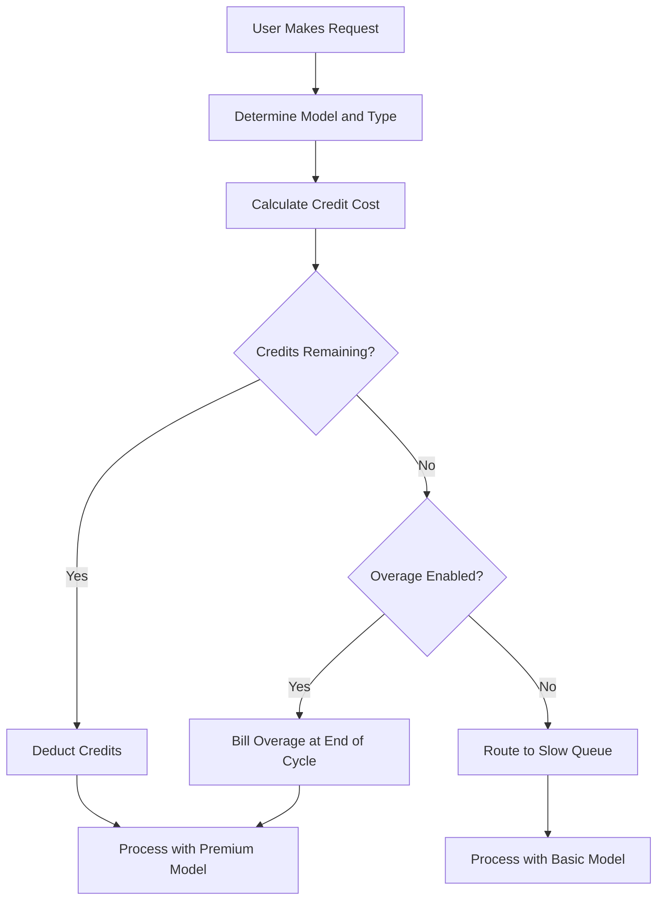

## करसर कैसे बिल करता है

करसर एक हाइब्रिड मॉडल का उपयोग करता है जो मासिक सब्सक्रिप्शन को घटते हुए क्रेडिट पूल के साथ जोड़ता है। यह दृष्टिकोण उपयोगकर्ताओं के लिए एक पूर्वानुमेय मूल्य प्रदान करता है जबकि विभिन्न AI मॉडल की परिवर्तनशील लागतों का प्रबंधन करता है।

**प्राइसिंग टियर्स**: करसर Hobby से Ultra तक टियर्स प्रदान करता है, जो विभिन्न वर्कफ़्लो के अनुरूप प्रीमियम और मानक एक्सेस के बीच संतुलन बनाए रखते हैं।

| Plan | Price | Premium Requests | Slow Requests |
| :--- | :--- | :--- | :--- |
| Hobby | Free | 50/month | Unlimited |
| Pro | \$20/month | 500/month | Unlimited |
| Pro+ | \$60/month | Unlimited premium | - |
| Ultra | \$200/month | Unlimited premium | - |

**मॉडल-वेटेड डिप्लेशन**: विभिन्न अनुरोधों द्वारा विभिन्न मात्रा में क्रेडिट्स खर्च किए जाते हैं, जो अंतर्निहित मॉडल की लागत पर आधारित होते हैं। इससे करसर एक ही सब्सक्रिप्शन में कई प्रदाताओं को शामिल कर सकता है और महंगे ऑपरेशनों का भी हिसाब रखता है।

| Request Type | Model | Credit Cost |
| :--- | :--- | :--- |
| Tab Completion | Default | 0 |
| Chat | GPT-4o Mini | 1 |
| Chat | Claude 3.5 Sonnet | 1 |
| Composer | GPT-4o | 5 |
| Agent | Claude 3.5 Sonnet | 10 |
| Agent | o1-preview | 25 |

**क्रेडिट समाप्ति और ओवरएज**: जब क्रेडिट खत्म हो जाते हैं, तो उपयोगकर्ता "Slow" कतार में चले जाते हैं जिसमें सस्ते मॉडल होते हैं, बजाय इसके कि उन्हें पूरी तरह ब्लॉक किया जाए। वैकल्पिक रूप से, वे उपयोग-आधारित ओवरएज सक्षम कर सकते हैं ताकि निश्चित प्रति-रिक्वेस्ट लागत पर प्रीमियम एक्सेस बना रहे।



4. **एंटरप्राइज़ और बिज़नेस**: टीमें पूल्ड उपयोग का उपयोग करती हैं जहां पूरी संस्था एकल क्रेडिट बकेट साझा करती है। यह प्रबंधन को सरल बनाता है और सुनिश्चित करता है कि भारी उपयोगकर्ता व्यक्तिगत सीमाओं को पार न करें जबकि अन्य के पास अप्रयुक्त क्षमता बनी रहे।

## यह क्या खास बनाता है

करसर का मॉडल उपयोगकर्ता अनुभव को अवसंरचना लागतों के साथ संतुलित करता है और उन समस्याओं को हल करता है जिनके साथ पारंपरिक SaaS बिलिंग मॉडल जूझते हैं।
- **प्रदाता अमूर्तन**: एक ही सब्सक्रिप्शन OpenAI और Anthropic जैसे कई LLM प्रदाताओं को कवर करता है, पीछे की जटिल प्राइसिंग और API कीज़ को संभालता है।
- **वेटेड डिप्लेशन**: लागत मूल्य के अनुसार संरेखित होती है, शक्तिशाली मॉडलों के लिए अधिक चार्ज करके, जिससे सभी उपयोगकर्ताओं के लिए प्राइसिंग निष्पक्ष और पारदर्शी महसूस होती है।
- **नरम डिग्रेडेशन**: "Slow" कतार कठोर कटऑफ़ को रोकती है, जिससे उपयोगकर्ता उत्पाद में बने रहते हैं और बिना दंडात्मक तरीके से अपग्रेड करने के लिए प्रोत्साहित होते हैं।
- **पूल्ड क्रेडिट्स**: टीम-स्तर के बकेट एंटरप्राइज़ ग्राहकों के लिए घर्षण कम करते हैं, जिससे पूरे संगठन में कुशल संसाधन साझा करना संभव होता है।

## इसे Dodo Payments के साथ बनाएं

आप Dodo Payments की क्रेडिट एंटाइटलमेंट्स और उपयोग-आधारित बिलिंग का उपयोग करके इस सटीक मॉडल को दोहरा सकते हैं। निम्नलिखित कदम आपको कार्यान्वयन के माध्यम से मार्गदर्शन करेंगे।

<Steps>
  <Step title="Create a Custom Unit Credit Entitlement">
    पहले, Dodo डैशबोर्ड में क्रेडिट सिस्टम को परिभाषित करें। यह एंटाइटलमेंट उपयोगकर्ताओं को उनकी सब्सक्रिप्शन के साथ मिलने वाले "Premium Requests" का प्रतिनिधित्व करेगा।

    *   **क्रेडिट प्रकार:** कस्टम यूनिट
    *   **यूनिट नाम:** "Premium Requests"
    *   **प्रिसिजन:** 0 (क्योंकि आप आधा अनुरोध उपयोग नहीं कर सकते)
    *   **क्रेडिट समाप्ति:** 30 दिन (यह सुनिश्चित करता है कि हर बिलिंग चक्र में क्रेडिट रीसेट हो जाए)
    *   **रोलओवर:** अक्षम (अप्रयुक्त अनुरोध अगले महीने तक नहीं जाते)
    *   **ओवरएज:** सक्षम
    *   **प्रति यूनिट कीमत:** \$0.04 (प्रारंभिक पूल खत्म होने के बाद प्रत्येक अनुरोध की लागत)
    *   **ओवरएज व्यवहार:** बिलिंग पर ओवरएज बिल करें (यह ओवरएज लागत को अगली इनवॉइस में जोड़ता है)

    यह कॉन्फ़िगरेशन सुनिश्चित करता है कि उपयोगकर्ताओं के पास हर महीने एक निश्चित अनुरोध पूल होता है, और यदि उन्हें ज़रूरत पड़ती है तो वे अधिक का भुगतान कर सकते हैं। यह हाइब्रिड बिलिंग मॉडल की नींव है।
  </Step>

  <Step title="Create Subscription Products">
    प्रत्येक टियर के लिए अलग-अलग उत्पाद बनाएँ। एक ही क्रेडिट एंटाइटलमेंट को प्रत्येक उत्पाद से जोड़ें, लेकिन अलग-अलग मात्रा के साथ। इससे आप एकल क्रेडिट सिस्टम के साथ सभी टियर्स को प्रबंधित कर सकते हैं, जिससे उपयोगकर्ताओं को अपग्रेड या डाउनग्रेड करना आसान हो जाता है।

    *   **Hobby:** \$0/माह, 50 क्रेडिट/चक्र
    *   **Pro:** \$20/माह, 500 क्रेडिट/चक्र
    *   **Pro+:** \$60/माह, 5000 क्रेडिट/चक्र (अधिकांश उपयोग के लिए प्रभावी रूप से अनलिमिटेड)
    *   **Ultra:** \$200/माह, 50000 क्रेडिट/चक्र (प्रभावी रूप से अनलिमिटेड)

    जब कोई उपयोगकर्ता इन उत्पादों में से किसी एक की सदस्यता लेता है, तो Dodo स्वचालित रूप से उनके खाते में संबंधित संख्या में क्रेडिट आवंटित करता है। यह तुरंत होता है, जिससे एक सहज ऑनबोर्डिंग अनुभव मिलता है।
  </Step>

  <Step title="Create a Usage Meter Linked to Credits">
    `ai.request` नामक मीटर बनाएँ जिसमें `credit_cost` प्रॉपर्टी पर **Sum** एग्रीगेशन हो। "Bill usage in Credits" टॉगल को सक्षम करके इस मीटर को अपने क्रेडिट एंटाइटलमेंट से लिंक करें। क्रेडिट के लिए मीटर यूनिट को 1 पर सेट करें।

    मॉडल-वेटेड डिप्लेशन को संभालने के लिए, आप अपनी ऐप्लिकेशन स्तर पर क्रेडिट लागत को प्रबंधित करेंगे। जब उपयोगकर्ता कोई अनुरोध करता है, तो आपका ऐप मॉडल या क्रिया के प्रकार के आधार पर लागत निर्धारित करता है।

    ```typescript
    import DodoPayments from 'dodopayments';
    
    /**
     * Determines the credit cost for a given request type and model.
     * This logic lives in your application and can be updated without
     * changing your billing configuration.
     */
    function getCreditCost(requestType: string, model: string): number {
      const costs: Record<string, Record<string, number>> = {
        'tab_completion': { 'default': 0 },
        'chat': { 'gpt-4o-mini': 1, 'gpt-4o': 1, 'claude-sonnet': 1 },
        'composer': { 'gpt-4o-mini': 2, 'gpt-4o': 5, 'claude-sonnet': 5 },
        'agent': { 'gpt-4o': 10, 'claude-sonnet': 10, 'o1': 25 }
      };
      
      // Default to 1 credit if the combination isn't found
      return costs[requestType]?.[model] ?? 1;
    }
    
    /**
     * Ingests usage events into Dodo Payments.
     * For weighted requests, we send multiple events or use a sum aggregation.
     */
    async function trackRequest(customerId: string, requestType: string, model: string) {
      const creditCost = getCreditCost(requestType, model);
      
      // Tab completions are free, so we don't need to track them for billing
      if (creditCost === 0) return;
      
      const client = new DodoPayments({
        bearerToken: process.env.DODO_PAYMENTS_API_KEY,
      });
      
      await client.usageEvents.ingest({
        events: [{
          event_id: `req_${Date.now()}_${Math.random().toString(36).slice(2)}`,
          customer_id: customerId,
          event_name: 'ai.request',
          timestamp: new Date().toISOString(),
          metadata: {
            request_type: requestType,
            model: model,
            credit_cost: creditCost
          }
        }]
      });
    }
    ```

    <Tip>
      यदि आप वेटेड अनुरोधों के लिए एक ही इवेंट का उपयोग करना चाहते हैं, तो अपने मीटर एग्रीगेशन को **Sum** पर सेट करें और `credit_cost` जैसे किसी प्रॉपर्टी का उपयोग करें जिसे जोड़ने के लिए मान की आवश्यकता हो। यह उच्च मात्रा वाले इनजेशन के लिए अक्सर अधिक कुशल होता है और आपके ऐप्लिकेशन लॉजिक को सरल बनाता है।
    </Tip>
  </Step>

  <Step title="Handle Credit Exhaustion (Slow Queue)">
    Dodo से `credit.balance_low` वेबहुक को सुनें। जब किसी उपयोगकर्ता के क्रेडिट लगभग शून्य हों, तब आप उन्हें अपने ऐप्लिकेशन में एक स्लो कतार में स्थानांतरित कर सकते हैं। यहां आप "नरम डिग्रेडेशन" लॉजिक लागू करते हैं।

    ```typescript
    import DodoPayments from 'dodopayments';
    import express from 'express';
    
    const app = express();
    app.use(express.raw({ type: 'application/json' }));
    
    const client = new DodoPayments({
      bearerToken: process.env.DODO_PAYMENTS_API_KEY,
      webhookKey: process.env.DODO_PAYMENTS_WEBHOOK_KEY,
    });
    
    app.post('/webhooks/dodo', async (req, res) => {
      try {
        const event = client.webhooks.unwrap(req.body.toString(), {
          headers: {
            'webhook-id': req.headers['webhook-id'] as string,
            'webhook-signature': req.headers['webhook-signature'] as string,
            'webhook-timestamp': req.headers['webhook-timestamp'] as string,
          },
        });
        
        if (event.type === 'credit.balance_low') {
          const customerId = event.data.customer_id;
          await updateUserTier(customerId, 'slow');
          await notifyUser(customerId, 'You have used most of your premium requests. Switching to standard models.');
        }
        
        res.json({ received: true });
      } catch (error) {
        res.status(401).json({ error: 'Invalid signature' });
      }
    });
    
    /**
     * Routes a request based on the user's current tier.
     * This function is called before every AI request to determine the model and queue.
     */
    async function routeRequest(customerId: string, requestType: string) {
      const tier = await getUserTier(customerId);
      
      if (tier === 'slow') {
        // Route to a cheaper model and a lower priority queue
        // This saves costs while keeping the user active in the product
        return { model: 'gpt-4o-mini', queue: 'standard' };
      }
      
      // Premium routing for users with remaining credits
      // This provides the best possible performance and model quality
      return { model: 'claude-sonnet', queue: 'priority' };
    }
    ```

  </Step>

  <Step title="Create Checkout">
    अंत में, उपयोगकर्ता के लिए एक चेकआउट सेशन उत्पन्न करें ताकि वे किसी योजना की सदस्यता ले सकें। Dodo भुगतान प्रसंस्करण, कर अनुपालन, और क्रेडिट आवंटन को स्वचालित रूप से संभालता है।

    ```typescript
    import DodoPayments from 'dodopayments';
    
    const client = new DodoPayments({
      bearerToken: process.env.DODO_PAYMENTS_API_KEY,
    });
    
    /**
     * Creates a checkout session for a new subscription.
     * This is typically called when a user clicks an "Upgrade" button.
     */
    const session = await client.checkoutSessions.create({
      product_cart: [
        { product_id: 'prod_cursor_pro', quantity: 1 }
      ],
      customer: { email: 'developer@example.com' },
      return_url: 'https://yourapp.com/dashboard'
    });
    ```

  </Step>
</Steps>

## LLM इनजेशन ब्लूप्रिंट के साथ गति बढ़ाएं

उपरोक्त क्रेडिट-वेटेड बिलिंग आपके मूल मुद्रा रूपांतरण को संभालती है। वास्तविक टोकन खपत के लिए गहरी विश्लेषणात्मक जानकारी के लिए, [LLM Ingestion Blueprint](/developer-resources/ingestion-blueprints/llm) को आपके क्रेडिट सिस्टम के साथ एक साथ चलाया जा सकता है।

```bash
npm install @dodopayments/ingestion-blueprints
```

```typescript
import { createLLMTracker } from '@dodopayments/ingestion-blueprints';
import OpenAI from 'openai';
import Anthropic from '@anthropic-ai/sdk';

// Track raw token usage for analytics alongside credit-weighted billing
const openaiTracker = createLLMTracker({
  apiKey: process.env.DODO_PAYMENTS_API_KEY,
  environment: 'live_mode',
  eventName: 'analytics.openai_tokens',
});

const anthropicTracker = createLLMTracker({
  apiKey: process.env.DODO_PAYMENTS_API_KEY,
  environment: 'live_mode',
  eventName: 'analytics.anthropic_tokens',
});

const openai = new OpenAI({ apiKey: process.env.OPENAI_API_KEY });
const anthropic = new Anthropic({ apiKey: process.env.ANTHROPIC_API_KEY });

// Wrap each provider separately
const trackedOpenAI = openaiTracker.wrap({ client: openai, customerId: 'customer_123' });
const trackedAnthropic = anthropicTracker.wrap({ client: anthropic, customerId: 'customer_123' });

// Token tracking is automatic, credit deduction still uses your weighted system
const response = await trackedOpenAI.chat.completions.create({
  model: 'gpt-4o',
  messages: [{ role: 'user', content: 'Hello!' }],
});
```

यह आपको डेटा की दो परतें देता है: मुद्रीकरण के लिए क्रेडिट-वेटेड बिलिंग और लागत विश्लेषण तथा मार्जिन ट्रैकिंग के लिए कच्चे टोकन गणना।

<Tip>
LLM ब्लूप्रिंट OpenAI, Anthropic, Groq, Google Gemini, और अन्य को सपोर्ट करता है। सभी समर्थित प्रदाताओं के लिए [पूर्ण ब्लूप्रिंट दस्तावेज़](/developer-resources/ingestion-blueprints/llm) देखें।
</Tip>

## पूल्ड टीम क्रेडिट (एंटरप्राइज़)

करसर की बिज़नेस और एंटरप्राइज़ योजनाएं टीम के भीतर क्रेडिट साझा करती हैं। आप Dodo के साथ यह लागू कर सकते हैं, संगठन के लिए एक एकल सदस्यता बनाकर बजाय व्यक्तिगत उपयोगकर्ताओं के। यह सुनिश्चित करता है कि टीम का उपयोग एकीकृत रूप से प्रबंधित हो, जो बड़े ग्राहकों के लिए एक मुख्य आवश्यकता है।

### कार्यान्वयन रणनीति

1.  **संगठन-स्तर ग्राहक:** पूरे संगठन के लिए Dodo में एक एकल `customer_id` बनाएँ। यह ग्राहक टीम के बिलिंग एंटिटी का प्रतिनिधित्व करता है और साझा क्रेडिट पूल रखता है। सभी चालान और क्रेडिट आवंटन इस ID से जुड़े होते हैं।
2.  **सीट-आधारित बिलिंग:** प्रति-उपयोगकर्ता प्लेटफ़ॉर्म शुल्क के लिए Dodo के ऐड-ऑन का उपयोग करें। जब कोई टीम नया सदस्य जोड़ती है, तो आप "Seat" ऐड-ऑन की मात्रा अपडेट करते हैं। यह सुनिश्चित करता है कि उपयोगकर्ताओं की संख्या के साथ आपकी राजस्व वृद्धि होती है, जबकि क्रेडिट पूल अलग रहता है। यह बहु-आयामी बिलिंग को संभालने का एक स्वच्छ तरीका है।
3.  **साझा उपयोग ट्रैकिंग:** सभी टीम सदस्यों के अनुरोध संगठन के `customer_id` का उपयोग करके इनजेस्ट किए जाते हैं। यह सुनिश्चित करता है कि किसी भी टीम सदस्य से कोई भी अनुरोध उसी केंद्रीय क्रेडिट पूल को घटाता है। आप आंतरिक रिपोर्टिंग और विश्लेषण के लिए इवेंट मेटाडेटा में `user_id` शामिल करके व्यक्तिगत उपयोग ट्रैक कर सकते हैं।

यह दृष्टिकोण दोनों का सर्वश्रेष्ठ संयोजन देता है: प्लेटफ़ॉर्म के लिए प्रत्याशित प्रति-उपयोगकर्ता शुल्क और महंगे AI संसाधनों के लिए साझा क्रेडिट पूल। यह टीम सदस्यों के लिए उपयोगकर्ता अनुभव को भी सरल बनाता है, क्योंकि उन्हें अपनी व्यक्तिगत सीमाओं का प्रबंधन नहीं करना पड़ता।

## पारंपरिक SaaS बिलिंग के साथ तुलना

पारंपरिक SaaS बिलिंग आमतौर पर फ्लैट-रेट टियर्स (उदा., 100 यूनिट के लिए \$10/माह) में होती है। यदि किसी उपयोगकर्ता को 101 यूनिट की आवश्यकता होती है, तो अक्सर उन्हें \$50/माह के टियर पर जाना पड़ता है। इससे "चौखट" प्रभाव बनते हैं जो उपयोगकर्ताओं को परेशान कर सकते हैं और चर्न का कारण बन सकते हैं। इसका सामना विभिन्न प्रकार के उपयोग की परिवर्तनशील लागत से भी नहीं होता, जो AI क्षेत्र में महत्वपूर्ण है।

Dodo द्वारा संचालित करसर का मॉडल कहीं अधिक लचीला और निष्पक्ष है:

*   **कोई "चौखट" प्रभाव नहीं:** उपयोगकर्ताओं को सीमा पार करने पर केवल अपग्रेड करना आवश्यक नहीं होता। वे ओवरएज के लिए भुगतान कर सकते हैं या धीमी गति स्वीकार कर सकते हैं। यह उन्हें उत्पाद में बनाए रखता है और घर्षण कम करता है, जिससे ग्राहक संतुष्टि अधिक होती है और चर्न कम होता है।
*   **लागत संरेखण:** आपकी राजस्व सीधे आपकी अवसंरचना लागतों के साथ स्केल करती है। यदि कोई उपयोगकर्ता महंगे मॉडलों का उपयोग करता है, तो वे अधिक भुगतान करते हैं (चाहे क्रेडिट के माध्यम से हो या ओवरएज के माध्यम से)। इससे आपके मार्जिन सुरक्षित रहते हैं और आप महंगे फीचर्स को सतत ढंग से प्रदान कर सकते हैं बिना अपने बिज़नेस मॉडल को जोखिम में डाले।
*   **बेहतर रिटेंशन:** उपयोगकर्ताओं को काटने के बजाय, आप उन्हें उत्पाद के साथ जुड़े रखते हैं भले ही उन्होंने अपनी सीमा पार कर ली हो। वे काम जारी रख सकते हैं, जिससे दीर्घकालिक निष्ठा बनती है और ग्राहक का आजीवन मूल्य बढ़ता है। यह उपयोगकर्ता और प्रदाता दोनों के लिए एक जीत है।

## मॉडल अपडेट और विकास को संभालना

AI बिलिंग के साथ चुनौतियों में से एक यह है कि मॉडल लगातार अपडेट हो रहे हैं या बदल रहे हैं। नए मॉडल में अलग लागत संरचनाएँ या प्रदर्शन विशेषताएँ हो सकती हैं। Dodo के क्रेडिट सिस्टम के साथ, आप इसे ऐप्लिकेशन स्तर पर बिना अपने बिलिंग डेटा को माइग्रेट किए सहज रूप से संभाल सकते हैं।

यदि आप एक नया, अधिक महंगा मॉडल पेश करते हैं, तो आप केवल अपनी `getCreditCost` फ़ंक्शन को अपडेट करते हैं ताकि उसे अधिक लागत आवंटित की जा सके। आपको अपनी बिलिंग कॉन्फ़िगरेशन को बदलने या मौजूदा सदस्यताओं को अपडेट करने की आवश्यकता नहीं होती। बिलिंग और ऐप्लिकेशन लॉजिक का यह पृथक्करण एक बड़ा फायदा है, क्योंकि यह आपको AI की गति से अपने उत्पाद पर पुनरावृति करने की स्वतंत्रता देता है बिना बिलिंग सिस्टम द्वारा सीमित किए जाने के।

## उपयोगकर्ता नोटिफिकेशन और पारदर्शिता

उपयोगकर्ता अनुभव को बेहतर बनाने के लिए, यह आवश्यक है कि उपयोगकर्ताओं को उनके क्रेडिट उपयोग के बारे में सूचित रखा जाए। पारदर्शिता विश्वास बनाती है और उपयोगकर्ताओं को उनकी लागत को प्रभावी ढंग से प्रबंधित करने में मदद करती है। आप विभिन्न थ्रेशोल्ड पर नोटिफिकेशन ट्रिगर करने के लिए Dodo के वेबहुक्स का उपयोग कर सकते हैं (जैसे 50%, 80%, और 100% उपयोग)।

ये नोटिफिकेशन ईमेल, इन-ऐप अलर्ट, या Slack संदेशों के माध्यम से भेजे जा सकते हैं। उपयोग पर वास्तविक समय फ़ीडबैक प्रदान करके, आप उपयोगकर्ताओं को उनके उपयोग को प्रबंधित करने या "slow queue" पर पहुंचने से पहले उनकी योजना अपग्रेड करने के लिए प्रोत्साहित करते हैं। यह सक्रिय दृष्टिकोण समर्थन टिकटों को कम करता है और समग्र उपयोगकर्ता अनुभव को बेहतर बनाता है, जिससे आपका उत्पाद अधिक पेशेवर और उपयोगकर्ता-केंद्रित महसूस होता है।

## सुरक्षा और धोखाधड़ी रोकथाम

क्रेडिट-आधारित सिस्टम को लागू करते समय सुरक्षा और धोखाधड़ी रोकथाम पर विचार करना महत्वपूर्ण है। चूंकि क्रेडिट का प्रत्यक्ष मौद्रिक मूल्य होता है, वे दुर्व्यवहार के लिए लक्ष्य बन सकते हैं।

*   **आइडेम्पोटेंसी:** उपयोग घटनाओं को इनजेस्ट करते समय हमेशा अद्वितीय `event_id` का उपयोग करें ताकि दोहराव से बचा जा सके। यदि आप एक अद्वितीय ID प्रदान करते हैं तो Dodo का इनजेशन API आइडेम्पोटेंसी को स्वचालित रूप से संभालता है, यह सुनिश्चित करते हुए कि एक नेटवर्क पुन: प्रयास उपयोगकर्ता को दो बार चार्ज न करे।
*   **रेट लिमिटिंग:** एकल उपयोगकर्ता को उनकी क्रेडिट (या आपके API बजट) को बहुत जल्दी समाप्त करने से रोकने के लिए ऐप्लिकेशन स्तर पर रेट लिमिटिंग लागू करें। यह आपकी अवसंरचना और उपयोगकर्ता की वॉलेट की सुरक्षा करता है।
*   **मोनीटरिंग:** ऐसे उपयोग पैटर्न की निगरानी करें जो अकाउंट शेयरिंग या ऑटोमेटेड दुरुपयोग का संकेत दे सकते हैं। Dodo के एनालिटिक्स इन पैटर्न को पहचानने में आपकी मदद कर सकते हैं, जिससे आप उन्हें बड़ी समस्या बनने से पहले कार्रवाई कर सकें।

## क्रेडिट सिस्टम के लिए सर्वोत्तम प्रथाएं

जब आप क्रेडिट-आधारित बिलिंग सिस्टम बना रहे हों, तो इन सर्वोत्तम प्रथाओं को ध्यान में रखें:

1.  **इसे सरल रखें:** अपना क्रेडिट सिस्टम बहुत जटिल न बनाएं। उपयोगकर्ताओं को आसानी से समझ आना चाहिए कि एक अनुरोध की लागत कितनी है और उनके पास कितने क्रेडिट बचे हैं।
2.  **मूल्य प्रदान करें:** सुनिश्चित करें कि क्रेडिट उपयोगकर्ता के लिए वास्तविक मूल्य प्रदान करते हैं। यदि एक अनुरोध की लागत बहुत अधिक है, तो उपयोगकर्ता महसूस करेंगे कि उन्हें बार-बार छोटा भुगतान कराया जा रहा है।
3.  **पारदर्शी रहें:** हमेशा उपयोगकर्ता को उनका वर्तमान क्रेडिट बैलेंस और उपयोग इतिहास दिखाएं। यह विश्वास बनाता है और भ्रम को कम करता है।
4.  **सब कुछ ऑटोमेट करें:** बिलिंग प्रक्रिया को अधिक से अधिक ऑटोमेट करने के लिए Dodo के वेबहुक्स और APIs का उपयोग करें। इससे मैन्युअल कार्य कम होता है और आपकी बिलिंग हमेशा सटीक रहती है।

## उपयोग किए गए प्रमुख Dodo फीचर्स

<CardGroup cols={2}>
  <Card title="Credit-Based Billing" icon="coins" href="/features/credit-based-billing">
    घटते हुए क्रेडिट पूल और ओवरएज को कस्टम यूनिट्स के साथ प्रबंधित करें।
  </Card>
  <Card title="Subscriptions" icon="calendar" href="/features/subscription">
    एकीकृत क्रेडिट्स के साथ विभिन्न टियर्स के लिए आवर्ती बिलिंग सेट करें।
  </Card>
  <Card title="Usage-Based Billing" icon="chart-line" href="/features/usage-based-billing/introduction">
    घटनाओं को ट्रैक करें और वास्तविक समय में खपत के आधार पर बिल करें।
  </Card>
  <Card title="Event Ingestion" icon="bolt" href="/features/usage-based-billing/event-ingestion">
    कम विलंबता के साथ Dodo को उच्च मात्रा उपयोग डेटा भेजें।
  </Card>
  <Card title="Webhooks" icon="webhook" href="/developer-resources/webhooks/intents/credit">
    क्रेडिट बैलेंस परिवर्तनों पर प्रतिक्रिया करें और उपयोगकर्ता टियरिंग को स्वचालित करें।
  </Card>
  <Card title="LLM Ingestion Blueprint" icon="brain-circuit" href="/developer-resources/ingestion-blueprints/llm">
    कई LLM प्रदाताओं में स्वचालित टोकन ट्रैकिंग।
  </Card>
</CardGroup>
