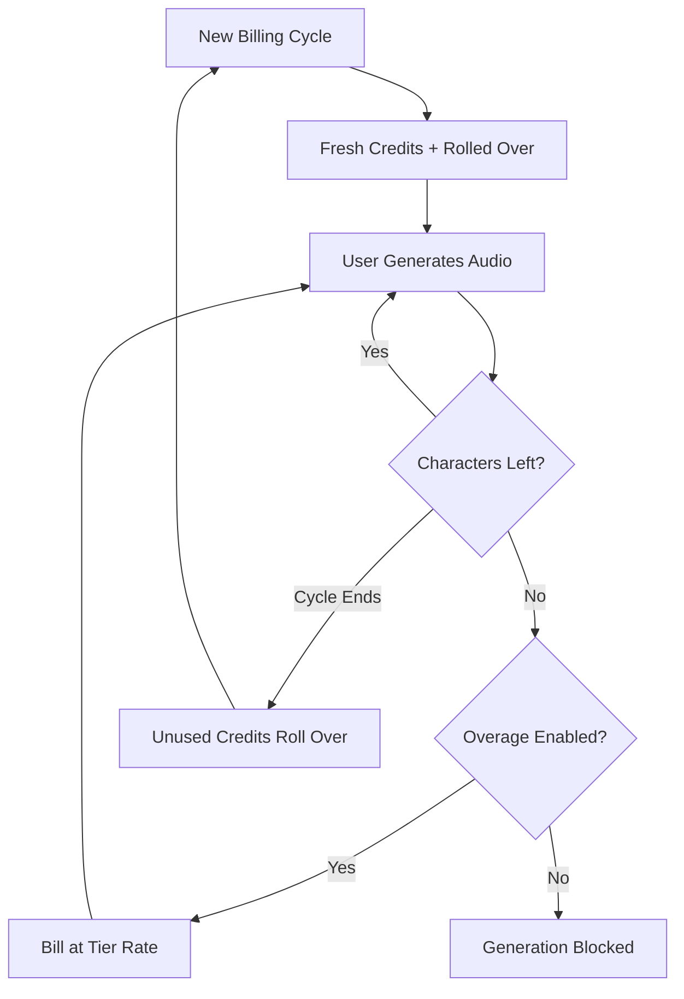

ElevenLabs ने अपनी आवाज़ संश्लेषण जितनी सहज है, उतनी ही तरल बिलिंग बनाकर AI वॉइस स्पेस में एक प्रमुख स्थिति बनाई है। उनका मॉडल एक ही मूल्य इकाई पर केंद्रित है: पात्र। चाहे आप टेक्स्ट-टू-स्पीच जनरेट कर रहे हों, एक आवाज़ क्लोन कर रहे हों, या किसी वीडियो को डब कर रहे हों, आप पात्र क्रेडिट के एकीकृत पूल से खर्च करते हैं।

## ElevenLabs कैसे बिल करता है

ElevenLabs की मूल्य संरचना में सब्सक्रिप्शन स्तरों से जुड़ी निर्धारित मासिक कोटा शामिल हैं। जैसे-जैसे उपयोगकर्ता उच्च स्तर पर जाते हैं, उन्हें अधिक पात्र और व्यावसायिक आवाज़ क्लोनिंग या वाणिज्यिक अधिकार जैसे उन्नत फीचर्स तक पहुंच मिलती है।

| योजना | कीमत | पात्र/महीना | ओवरएज दर |
| :--- | :--- | :--- | :--- |
| मुफ्त | \$0 | 10,000 | उपलब्ध नहीं |
| स्टार्टर | \$5/माह | 30,000 | ~\$0.30/1K पात्र |
| क्रिएटर | \$22/माह | 100,000 | ~\$0.24/1K पात्र |
| प्रो | \$99/माह | 500,000 | ~\$0.15/1K पात्र |
| स्केल | \$330/माह | 2,000,000 | ~\$0.10/1K पात्र |

1. **पात्र-आधारित मूल्य निर्धारण**: पात्र प्लेटफ़ॉर्म भर में सार्वभौमिक मुद्रा हैं। टेक्स्ट-टू-स्पीच, डबिंग, और वॉइस क्लोनिंग सभी इसी शेष राशि से खाते हैं, जिससे उपयोग ट्रैकिंग सरल हो जाती है।
2. **रोलओवर मैकेनिक्स**: अप्रयुक्त पात्र अगले बिलिंग चक्र में रोल ओवर होते हैं, बजाय कि समाप्त होने के। ElevenLabs अनंत संचयन को रोकने के लिए एक कैप लागू करता है, यह सुनिश्चित करके कि उपयोगकर्ता अपनी सदस्यता से मूल्य बनाए रखें।
3. **स्तरीय ओवरएज**: ओवरएज सब्सक्रिप्शन स्तर के आधार पर संभाले जाते हैं। निम्न योजनाओं में डिफ़ॉल्ट रूप से ओवरएज अक्षम रहते हैं सुरक्षा के लिए, जबकि उच्च स्तरों पर सेवा निरंतरता बनाए रखने के लिए चुनने योग्य शुल्क की अनुमति होती है।

## इसे खास क्या बनाता है

कई रणनीतिक विकल्प ElevenLabs के बिलिंग मॉडल को उपयोगकर्ताओं को बनाए रखने और अपग्रेड को प्रेरित करने में विशेष रूप से प्रभावी बनाते हैं।

- **पात्र रोलओवर**: रोलओवर क्रेडिट "उपयोग करो या खो दो" चिंता को कम करते हैं क्योंकि अप्रयुक्त निवेश आगे ले जाया जाता है। इससे कम सक्रियता के दौरान भी सदस्यता मूल्य बनाए रहता है।
- **स्तरीय ओवरएज मूल्य निर्धारण**: जैसे-जैसे योजना आकार बढ़ती है, ओवरएज दरें कम होती जाती हैं, जिससे अपग्रेड करने के लिए मजबूत प्रेरणा बनती है। उपयोगकर्ता अक्सर अधिक उपयोग के लिए उच्च स्तरों को कम लागत के कारण अधिक आकर्षक पाते हैं।
- **एकीकृत उपभोग**: सभी सेवाओं के लिए एक ही पात्र पूल अलग-अलग कोटा प्रबंधन का मानसिक बोझ हटाता है। उपयोगकर्ताओं को बस एक संख्या ट्रैक करनी होती है जिससे उन्हें शेष क्षमता का अंदाजा हो जाता है।
- **चुनें योग्य ओवरएज**: पेशेवर उपयोगकर्ता निरंतरता के लिए ओवरएज सक्षम कर सकते हैं, जबकि आकस्मिक उपयोगकर्ता एक हार्ड कैप की सुरक्षा का लाभ उठाते हैं।



## Dodo Payments के साथ इसे बनाएं

आप Dodo Payments के क्रेडिट-आधारित बिलिंग और उपयोग मीटरिंग का उपयोग करके इस परिष्कृत मॉडल को दोहरा सकते हैं।

<Steps>
<Step title="Create a Custom Unit Credit Entitlement">
पहले, "Characters" यूनिट को परिभाषित करें जो आपके प्लेटफ़ॉर्म की मुद्रा के रूप में कार्य करेगी।

1. अपने Dodo डैशबोर्ड में **Entitlements** पर जाएं।
2. एक नया **Credit Entitlement** बनाएं।
3. **Credit Type** को **Custom Unit** पर सेट करें।
4. यूनिट का नाम "Characters" रखें।
5. **Precision** को 0 पर सेट करें, क्योंकि पात्र हमेशा पूर्णांक होते हैं।
6. **Credit Expiry** को 30 दिन पर सेट करें ताकि यह मासिक बिलिंग चक्र से मेल खाए।
7. निम्न सेटिंग्स के साथ **Rollover** सक्षम करें:
    - **Max Rollover Percentage**: 100% (यह सभी अप्रयुक्त पात्रों को आगे ले जाने की अनुमति देता है)।
    - **Rollover Timeframe**: 1 माह।
    - **Max Rollover Count**: 1 (क्रेडिट एक बार रोल ओवर हो सकते हैं, फिर वे समाप्त हो जाते हैं)।
</Step>

<Step title="Create Tiered Subscription Products">
पांच सब्सक्रिप्शन उत्पाद बनाएं। आप प्रत्येक को एक ही "Characters" एंटाइटलमेंट जोड़ेंगे, लेकिन प्रत्येक स्तर के लिए विभिन्न कॉन्फ़िगरेशन के साथ।

| उत्पाद | कीमत | क्रेडिट/चक्र | ओवरएज सक्षम | ओवरएज मूल्य (प्रति 1K पात्र) |
| :--- | :--- | :--- | :--- | :--- |
| मुफ्त | \$0/माह | 10,000 | नहीं | - |
| स्टार्टर | \$5/माह | 30,000 | हाँ (चयन करें) | \$0.30 |
| क्रिएटर | \$22/माह | 100,000 | हाँ | \$0.24 |
| प्रो | \$99/माह | 500,000 | हाँ | \$0.15 |
| स्केल | \$330/माह | 2,000,000 | हाँ | \$0.10 |

जब आप प्रत्येक उत्पाद से क्रेडिट एंटाइटलमेंट जोड़ते हैं, तो **Import Default Credit Settings** का चयन रद्द करें। इससे आपको उस विशेष स्तर पर ओवरएज के लिए विशिष्ट **Price Per Unit** निर्धारित करने की अनुमति मिलती है। **Overage Behavior** को **Bill overage at billing** पर सेट करें और स्तर के कोटा के 10% पर एक **Low Balance Threshold** स्थापित करें।
</Step>

<Step title="Create a Usage Meter">
उपयोग मीटर आपके अनुप्रयोग की गतिविधि को क्रेडिट सिस्टम से जोड़ता है।

1. `tts.characters` नाम का एक नया मीटर बनाएं।
2. **Aggregation** को **Sum** पर सेट करें। यह आपके द्वारा भेजी गई प्रत्येक घटना से `characters` गुण को जोड़ देगा।
3. इस मीटर को अपने "Characters" क्रेडिट एंटाइटलमेंट से लिंक करें।
4. **Meter units per credit** को 1 पर सेट करें। यह सुनिश्चित करता है कि आपके ऐप में उपयोग किया गया एक पात्र बैलेंस से एक क्रेडिट घटाता है।
</Step>

<Step title="Send Usage Events">
अपने एप्लिकेशन कोड में उपयोग ट्रैकिंग को एकीकृत करें। हर बार जब कोई उपयोगकर्ता ऑडियो जनरेट करे, तो Dodo को एक इवेंट भेजें।

```typescript
import DodoPayments from 'dodopayments';

async function trackGeneration(
  customerId: string,
  text: string, 
  service: 'tts' | 'dubbing' | 'cloning'
) {
  const characterCount = text.length;

  const client = new DodoPayments({
    bearerToken: process.env.DODO_PAYMENTS_API_KEY,
  });

  await client.usageEvents.ingest({
    events: [{
      event_id: `gen_${Date.now()}_${Math.random().toString(36).slice(2)}`,
      customer_id: customerId,
      event_name: 'tts.characters',
      timestamp: new Date().toISOString(),
      metadata: {
        characters: characterCount,
        service: service,
        voice_id: 'voice_abc123'
      }
    }]
  });
}
```

</Step>

<Step title="Handle Low Balance and Overage">
अपने उपयोगकर्ताओं को उनके पात्र उपयोग के बारे में सूचित रखने के लिए वेबहुक्स का उपयोग करें।

```typescript
import DodoPayments from 'dodopayments';
import express from 'express';

const app = express();
app.use(express.raw({ type: 'application/json' }));

const client = new DodoPayments({
  bearerToken: process.env.DODO_PAYMENTS_API_KEY,
  webhookKey: process.env.DODO_PAYMENTS_WEBHOOK_KEY,
});

app.post('/webhooks/dodo', async (req, res) => {
  try {
    const event = client.webhooks.unwrap(req.body.toString(), {
      headers: {
        'webhook-id': req.headers['webhook-id'] as string,
        'webhook-signature': req.headers['webhook-signature'] as string,
        'webhook-timestamp': req.headers['webhook-timestamp'] as string,
      },
    });

    switch (event.type) {
      case 'credit.balance_low':
        await notifyUser(event.data.customer_id, 
          'You are running low on characters. Consider upgrading your plan for more characters and lower overage rates.'
        );
        break;
      case 'credit.deducted':
        await logUsage(event.data);
        break;
      case 'credit.overage_charged':
        await notifyUser(event.data.customer_id,
          'You have exceeded your character quota. Overage charges will appear on your next invoice.'
        );
        break;
    }

    res.json({ received: true });
  } catch (error) {
    res.status(401).json({ error: 'Invalid signature' });
  }
});
```

</Step>

<Step title="Create Checkout">
जब कोई उपयोगकर्ता सदस्यता लेने के लिए तैयार हो, तो चुने हुए स्तर के लिए एक चेकआउट सत्र बनाएं।

```typescript
const session = await client.checkoutSessions.create({
  product_cart: [
    { product_id: 'prod_elevenlabs_pro', quantity: 1 }
  ],
  customer: { email: 'creator@example.com' },
  return_url: 'https://yourapp.com/dashboard'
});
```

</Step>
</Steps>

## Stream Ingestion Blueprint के साथ गति बढ़ाएं

ऑडियो आउटपुट को पात्र-आधारित बिलिंग के साथ ट्रैक करने के लिए, [Stream Ingestion Blueprint](/developer-resources/ingestion-blueprints/stream) बैंडविड्थ खपत को मीटर करने का एक सुव्यवस्थित तरीका प्रदान करता है।

```bash
npm install @dodopayments/ingestion-blueprints
```

```typescript
import { Ingestion, trackStreamBytes } from '@dodopayments/ingestion-blueprints';

const ingestion = new Ingestion({
  apiKey: process.env.DODO_PAYMENTS_API_KEY,
  environment: 'live_mode',
  eventName: 'tts.audio_bytes',
});

// After generating audio, track the output size
const audioBuffer = await generateSpeech(text, voiceId);

await trackStreamBytes(ingestion, {
  customerId: customerId,
  bytes: audioBuffer.byteLength,
  metadata: {
    voice_id: voiceId,
    service: 'tts',
    format: 'mp3',
  },
});
```

Stream Blueprint का उपयोग करके ऑडियो बैंडविड्थ को आपके पात्र-आधारित क्रेडिट सिस्टम के साथ ट्रैक करें। इससे आपको जनरेशन प्रति वास्तविक अवसंरचना लागत का दृश्य मिलता है।

<Tip>
Stream Blueprint उच्च-वॉल्यूम परिदृश्यों के लिए बैचिंग का भी समर्थन करता है। उन्नत उपयोग पैटर्न के लिए [पूर्ण ब्लूप्रिंट प्रलेखन](/developer-resources/ingestion-blueprints/stream) देखें।
</Tip>

## अपग्रेड प्रेरणा: स्तरीय ओवरएज मूल्य निर्धारण

ElevenLabs मॉडल का सबसे प्रसिद्ध हिस्सा यह है कि यह ओवरएज दरों का उपयोग अपग्रेड को प्रेरित करने के लिए कैसे करता है। उच्च स्तरों पर प्रति पात्र लागत को कम करके, वे बातचीत को "मुझे कितने चाहिए?" से बदल कर "मैं कितना बचा सकता हूं?" बनाते हैं।

| स्तर | शामिल पात्र | ओवरएज (प्रति 1K) | 500K पात्र पर प्रभावी लागत |
| :--- | :--- | :--- | :--- |
| क्रिएटर | 100,000 | \$0.24 | \$22 + (400 * \$0.24) = \$118 |
| प्रो | 500,000 | \$0.15 | \$99 (कोई ओवरएज नहीं) |

एक उपयोगकर्ता जो नियमित रूप से Creator योजना पर 500,000 पात्र खर्च करता है, वह सब्सक्रिप्शन और ओवरएज के लिए प्रति माह \$118 का भुगतान करता है। Pro योजना में अपग्रेड करने पर वही उपयोग \$99 में कवर हो जाता है, जिससे प्रति माह \$19 की बचत होती है। उच्च स्तरों पर कम ओवरएज दर का मतलब है कि जैसे-जैसे उपयोग बढ़ता है, अपग्रेड करना स्पष्ट आर्थिक निर्णय बन जाता है।

Dodo Payments के साथ, आप जब भी सब्सक्रिप्शन उत्पादों पर क्रेडिट जोड़ते हैं तो **Import Default Credit Settings** बॉक्स का चयन रद्द करके इसे लागू करते हैं। इससे आपको प्रत्येक विशिष्ट स्तर के लिए **Price Per Unit** पर पूर्ण नियंत्रण मिलता है, जिससे आप अपने सबसे अधिक भुगतान करने वाले ग्राहकों को सर्वोत्तम दरों के साथ पुरस्कृत कर सकते हैं।

## इस्तेमाल किए गए प्रमुख Dodo फीचर्स

<CardGroup cols={2}>
  <Card title="Credit-Based Billing" icon="coins" href="/features/credit-based-billing">
    पात्र कोटा, रोलओवर और समाप्तियों का प्रबंधन करें।
  </Card>
  <Card title="Subscriptions" icon="calendar" href="/features/subscription">
    वे आवर्ती स्तर सेट करें जो मासिक पात्र आवंटन प्रदान करते हैं।
  </Card>
  <Card title="Usage-Based Billing" icon="chart-line" href="/features/usage-based-billing/introduction">
    अपनी सेवाओं में वास्तविक समय पात्र खपत को ट्रैक करें।
  </Card>
  <Card title="Event Ingestion" icon="bolt" href="/features/usage-based-billing/event-ingestion">
    न्यूनतम विलंबता के साथ Dodo को उच्च-वॉल्यूम उपयोग डेटा भेजें।
  </Card>
  <Card title="Webhooks" icon="webhook" href="/developer-resources/webhooks/intents/credit">
    वास्तविक समय में कम बैलेंस और ओवरएज इवेंट्स पर प्रतिक्रिया दें।
  </Card>
  <Card title="Stream Ingestion Blueprint" icon="tower-broadcast" href="/developer-resources/ingestion-blueprints/stream">
    उपयोग-आधारित बिलिंग के लिए ऑडियो स्ट्रीमिंग बैंडविड्थ को ट्रैक करें।
  </Card>
</CardGroup>
