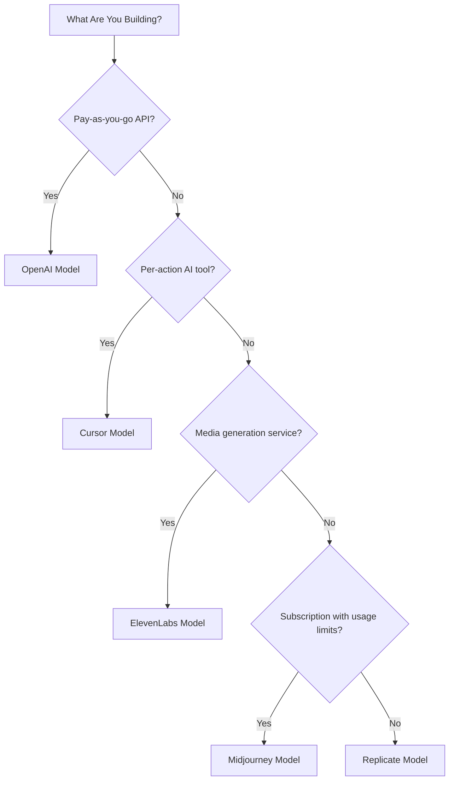

## पाँच मॉडल

| ऐप | प्राथमिक मीट्रिक | अनूठी नवाचार | Dodo सुविधा |
| :--- | :--- | :--- | :--- |
| OpenAI | टोकन (फिएट-नामांकित) | कभी समाप्त न होने वाला संतुलन वाले पूर्व-भुगतानित फिएट क्रेडिट | क्रेडिट-आधारित बिलिंग (फिएट क्रेडिट) |
| Cursor | प्रीमियम अनुरोध | मॉडल-वेटेड क्रेडिट अपचयन (हर मॉडल पर अलग लागत) | क्रेडिट-आधारित बिलिंग (कस्टम यूनिट) |
| ElevenLabs | वर्ण | रोलओवर के साथ वर्ण कोटा + तह-आधारित ओवरएज प्राइसिंग | क्रेडिट-आधारित बिलिंग (रोलओवर + ओवरएज) |
| Midjourney | GPU समय | कोटा के बाद "रिलैक्स मोड" अनलिमिटेड बैकअप | सदस्यता + उपयोग मीटर |
| Replicate | निष्पादन सेकंड | प्रति-सेकंड हार्डवेयर-विशिष्ट शुद्ध मीटरिंग | शुद्ध उपयोग-आधारित बिलिंग |

## क्रेडिट पैटर्न को समझना

| पैटर्न | उदाहरण | Dodo सुविधा | इकाई प्रकार |
| :--- | :--- | :--- | :--- |
| पूर्व-भुगतानित फिएट-नामांकित क्रेडिट | OpenAI API (\$5 क्रेडिट टॉप-अप, कोई निकासी नहीं) | क्रेडिट-आधारित बिलिंग (फिएट क्रेडिट) | डॉलर-नामांकित आभासी इकाइयां |
| आभासी उपयोग क्रेडिट | Cursor प्रीमियम अनुरोध, ElevenLabs वर्ण | क्रेडिट-आधारित बिलिंग (कस्टम यूनिट) | मनमानी इकाइयां (अनुरोध, वर्ण) |
| शुद्ध उपभोग मीटरिंग | Replicate प्रति-सेकंड बिलिंग | उपयोग-आधारित बिलिंग (मीटर) | प्रत्यक्ष मापन (सेकंड, बाइट) |
| सदस्यता + मीटर्ड ओवरएज | Midjourney फास्ट घंटे रिलैक्स बैकअप के साथ | सदस्यता + उपयोग मीटर | मुफ्त सीमा के साथ समय-आधारित |

<Info>
Dodo की क्रेडिट-आधारित बिलिंग में फिएट क्रेडिट प्लेटफ़ॉर्म-नामांकित डॉलर मूल्यों का प्रतिनिधित्व करते हैं जिनका आपके इकोसिस्टम के बाहर कोई मौद्रिक मूल्य नहीं होता। ग्राहक उन्हें नकद के रूप में निकाल नहीं सकते।
</Info>

## आप किस मॉडल का उपयोग करें?

- पेड-एज़-यू-गो API प्लेटफ़ॉर्म बनाना: OpenAI मॉडल (फिएट क्रेडिट)
- प्रति-कार्रवाई मूल्य निर्धारण के साथ AI टूल बनाना: Cursor मॉडल (कस्टम यूनिट क्रेडिट)
- मीडिया निर्माण सेवा बनाना: ElevenLabs मॉडल (रोलओवर क्रेडिट)
- उपयोग सीमाओं के साथ सदस्यता सेवा बनाना: Midjourney मॉडल (सदस्यता + उपयोग मीटर)
- आधारभूत संरचना/कंप्यूट प्लेटफ़ॉर्म बनाना: Replicate मॉडल (शुद्ध मीटरिंग)

<CardGroup cols={2}>
  <Card title="OpenAI" icon="/images/logos/openai.svg" href="/developer-resources/billing-deconstructions/openai">
    टोकन-आधारित पूर्व-भुगतानित क्रेडिट मॉडल को दोहराएं।
  </Card>
  <Card title="Cursor" icon="/images/logos/cursor.svg" href="/developer-resources/billing-deconstructions/cursor">
    मॉडल-वेटेड उपयोग सीमाएँ बनाएं।
  </Card>
  <Card title="ElevenLabs" icon="/images/logos/elevenlabs.svg" href="/developer-resources/billing-deconstructions/elevenlabs">
    रोलओवर और ओवरएज के साथ वर्ण कोटा लागू करें।
  </Card>
  <Card title="Midjourney" icon="/images/logos/midjourney.svg" href="/developer-resources/billing-deconstructions/midjourney">
    सदस्यताओं को उपयोग-आधारित बैकअप के साथ मिलाएं।
  </Card>
  <Card title="Replicate" icon="/images/logos/replicate.svg" href="/developer-resources/billing-deconstructions/replicate">
    प्रति-सेकंड शुद्ध उपभोग मीटरिंग सेट करें।
  </Card>
</CardGroup>

## Dodo सुविधाएँ

<CardGroup cols={2}>
  <Card title="Credit-Based Billing" href="/features/credit-based-billing">
    पूर्व-भुगतानित क्रेडिट और आभासी इकाइयों का प्रबंधन करें।
  </Card>
  <Card title="Usage-Based Billing" href="/features/usage-based-billing/introduction">
    वास्तविक समय में उपभोग की मीटरिंग करें।
  </Card>
  <Card title="Subscriptions" href="/features/subscription">
    आवर्ती बिलिंग और योजना प्रबंधन संभालें।
  </Card>
  <Card title="Hybrid Billing" href="/features/hybrid-billing">
    अधिकतम लचीलापन के लिए कई बिलिंग मॉडलों को संयोजित करें।
  </Card>
</CardGroup>

## इनजेशन ब्लूप्रिंट

प्रत्येक विखंडन में Dodo के [Ingestion Blueprints](/features/usage-based-billing/ingestion-blueprints) के साथ एकीकरण शामिल है, जो प्री-बिल्ट SDK हैं जो स्वतः घटना ट्रैकिंग को संभालते हैं। उपयोग घटनाओं का मैन्युअल निर्माण करने के बजाय, एक ब्लूप्रिंट का उपयोग करें और मिनटों में उत्पादन-तैयार मीटरिंग प्राप्त करें।

<CardGroup cols={3}>
  <Card title="LLM Blueprint" icon="brain-circuit" href="/developer-resources/ingestion-blueprints/llm">
    OpenAI, Anthropic, Groq, और अधिक के लिए स्वचालित टोकन ट्रैकिंग।
  </Card>
  <Card title="Stream Blueprint" icon="tower-broadcast" href="/developer-resources/ingestion-blueprints/stream">
    ऑडियो और वीडियो स्ट्रीमिंग बैंडविड्थ को ट्रैक करें।
  </Card>
  <Card title="Time Range Blueprint" icon="clock" href="/developer-resources/ingestion-blueprints/time-range">
    मिलिसेकंड तक कंप्यूट अवधि द्वारा बिल करें।
  </Card>
</CardGroup>

Each deconstruction includes integration with Dodo's [Ingestion Blueprints](/features/usage-based-billing/ingestion-blueprints), pre-built SDKs that handle event tracking automatically. Instead of manually constructing usage events, use a blueprint to get production-ready metering in minutes.

<CardGroup cols={3}>
  <Card title="LLM Blueprint" icon="brain-circuit" href="/developer-resources/ingestion-blueprints/llm">
    Automatic token tracking for OpenAI, Anthropic, Groq, and more.
  </Card>
  <Card title="Stream Blueprint" icon="tower-broadcast" href="/developer-resources/ingestion-blueprints/stream">
    Track audio and video streaming bandwidth.
  </Card>
  <Card title="Time Range Blueprint" icon="clock" href="/developer-resources/ingestion-blueprints/time-range">
    Bill by compute duration down to the millisecond.
  </Card>
</CardGroup>
