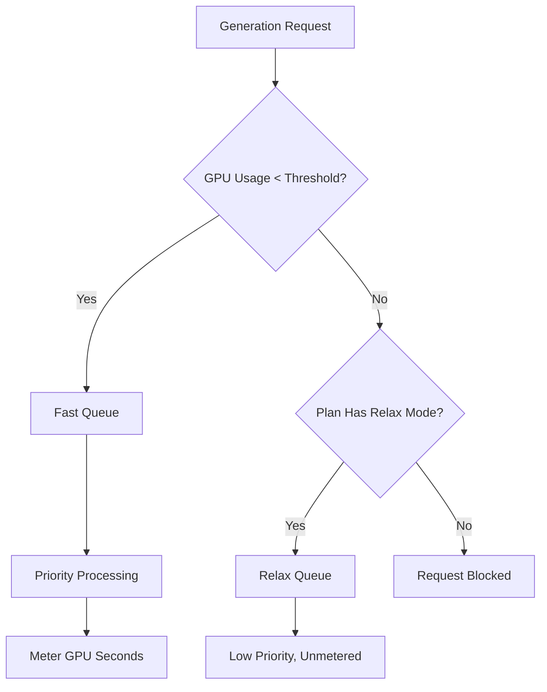

Midjourney एक जनरेटिव AI प्लेटफॉर्म है जो प्रति-इमेज गिनती की बजाय GPU समय पर आधारित एक अनूठा बिलिंग मॉडल उपयोग करता है। यह दृष्टिकोण सुनिश्चित करता है कि जटिल, उच्च-रिज़ॉल्यूशन रेंडर तेज़, कम-रिज़ॉल्यूशन ड्राफ्ट्स की तुलना में अधिक महंगे हों।

## Midjourney कैसे बिल करता है

Midjourney की सब्सक्रिप्शन योजनाएँ उपयोगकर्ताओं को प्रत्येक महीने "Fast GPU Hours" का एक निश्चित संख्या देती हैं। ये घंटे आपके जनरेशन पर आने वाले वास्तविक कम्प्यूटेशनल समय का प्रतिनिधित्व करते हैं।

| योजना | मूल्य | Fast GPU Hours | Relax Mode | Stealth Mode |
| :--- | :--- | :--- | :--- | :--- |
| Basic | \$10/month | ~3.3 hrs | No | No |
| Standard | \$30/month | 15 hrs | Unlimited | No |
| Pro | \$60/month | 30 hrs | Unlimited | Yes |
| Mega | \$120/month | 60 hrs | Unlimited | Yes |

1. **प्राइसिंग टियर्स**: Midjourney चार सब्सक्रिप्शन स्तर प्रदान करता है जो \$10 से \$120 प्रति माह तक हैं, प्रत्येक एक तय मात्रा में Fast GPU घंटे देता है।
2. **Relax Mode**: Standard और उच्चतर योजनाओं में Fast घंटों के समाप्त होने के बाद कम प्राथमिकता कतार के माध्यम से अनलिमिटेड जनरेशन शामिल होता है, जिससे उपयोगकर्ता कभी कठोर उपयोग सीमा तक नहीं पहुँचते।
3. **अतिरिक्त GPU घंटे**: उपयोगकर्ता लगभग \$4 प्रति घंटे के हिसाब से अतिरिक्त Fast GPU समय खरीद सकते हैं यदि उन्हें मासिक आवंटन खत्म होने के बाद तुरंत परिणाम चाहिए।
4. **GPU सेकंड में मीटरिंग**: उपयोग उन वास्तविक कम्प्यूटेशनल समय द्वारा ट्रैक किया जाता है जो जनरेशन पर खर्च होता है, जिसका अर्थ है कि जटिल रेंडर साधारण ड्राफ्ट्स की तुलना में अधिक खर्चीले होते हैं।
5. **कम्युनिटी लूप**: सक्रिय उपयोगकर्ता गैलरी में इमेज को रेट करके बोनस GPU घंटे कमा सकते हैं, जो मॉडल को प्रशिक्षण देने में मदद करते हुए समुदाय को इनाम देता है।
## इसे विशिष्ट क्या बनाता है

Midjourney मॉडल प्रभावी है क्योंकि यह लागत को मूल्य और संसाधन उपयोग के साथ संरेखित करता है।

* **GPU-time billing** लागत को संसाधन उपयोग से जोड़ती है, यह सुनिश्चित करते हुए कि जटिल रेंडर साधारण ड्राफ्ट्स की तुलना में उचित रूप से मूल्यवान हों।
* **Relax Mode** एक अनलिमिटेड फॉलबैक प्रदान करता है जो मासिक सीमाएँ पार करने के बाद भी सेवा पहुँच बनाए रखकर ग्राहक खोने की दर कम करता है।
* **Fast बनाम Relax विभाजन** उन उपयोगकर्ताओं को अपग्रेड करने के लिए प्रेरित करता है जो गति और तात्कालिक परिणाम को महत्व देते हैं क्योंकि उन्हें प्राथमिकता प्राप्त होती है।
* **अतिरिक्त GPU घंटे** जोरदार उपयोगकर्ताओं के लिए एक लचीला टॉप-अप विकल्प पेश करते हैं जिन्हें महीने के मध्य में अतिरिक्त उच्च-प्राथमिकता क्षमता चाहिए।

## Dodo Payments के साथ इसे बनाएं

आप Dodo Payments का उपयोग करके इस मॉडल को सब्सक्रिप्शन, उपयोग मीटर और एप्लिकेशन-स्तर तर्क को मिलाकर दोहरा सकते हैं।

<Steps>

<Step title="Create a Usage Meter">

सबसे पहले, प्रत्येक ग्राहक द्वारा उपयोग किए गए GPU सेकंड को ट्रैक करने के लिए एक मीटर बनाएं।

* **मीटर का नाम**: `gpu.fast_seconds`
* **Aggregation**: **Sum** (हर इवेंट से `gpu_seconds` प्रॉपर्टी का योग करें)

आप केवल उन इवेंट्स को ट्रैक करेंगे जहाँ जनरेशन मोड "fast" है। Relax मोड जनरेशन बिलिंग उद्देश्यों के लिए मीटर नहीं किए जाते।

</Step>

<Step title="Create Subscription Products with Usage Pricing">

अपने सब्सक्रिप्शन उत्पाद बनाएं और उपयोग मीटर के साथ एक मुफ्त थ्रेशोल्ड संलग्न करें।

| Product | Base Price | Free Threshold (seconds) | Overage Rate |
| :--- | :--- | :--- | :--- |
| Basic | \$10/month | 12,000 (3.3 hrs) | N/A (Hard Cap) |
| Standard | \$30/month | 54,000 (15 hrs) | \$0.00 (Relax Mode) |
| Pro | \$60/month | 108,000 (30 hrs) | \$0.00 (Relax Mode) |
| Mega | \$120/month | 216,000 (60 hrs) | \$0.00 (Relax Mode) |

Basic योजना के लिए, आप हार्ड कैप लागू करने के लिए ओवरएज को अक्षम कर देंगे। अन्य योजनाओं के लिए, "Relax Mode" तब हैंडल किया जाता है जब मीटर थ्रेशोल्ड पार करता है, और यह आपके एप्लिकेशन लॉजिक द्वारा नियंत्रित होगा।

</Step>

<Step title="Implement Application-Level Relax Mode">

मुख्य अंतर्दृष्टि यह है कि Relax Mode कोई बिलिंग फीचर नहीं है। यह आपका एप्लिकेशन है जो Dodo उपयोग मीटर जब थ्रेशोल्ड पार हो जाता है तब अनुरोधों को धीमी कतार में भेजता है।

```typescript
async function handleGenerationRequest(customerId: string, prompt: string) {
  const usage = await getCustomerUsage(customerId, 'gpu.fast_seconds');
  const subscription = await getSubscription(customerId);
  const threshold = getThresholdForPlan(subscription.product_id);
  
  if (usage.current >= threshold) {
    if (subscription.product_id === 'prod_basic') {
      throw new Error('Fast GPU hours exhausted. Upgrade to Standard for Relax Mode.');
    }
    
    // Relax Mode. Route to low-priority queue
    return await queueGeneration(customerId, prompt, {
      priority: 'low',
      mode: 'relax',
      model: 'standard'
    });
  }
  
  // Fast Mode. Priority processing
  return await queueGeneration(customerId, prompt, {
    priority: 'high',
    mode: 'fast',
    model: 'premium'
  });
}
```

</Step>

<Step title="Send Usage Events (Fast Mode Only)">

केवल तभी Dodo को उपयोग इवेंट भेजें जब जनरेशन Fast मोड में किया गया हो।

```typescript
import DodoPayments from 'dodopayments';

async function trackFastGeneration(customerId: string, gpuSeconds: number, jobId: string) {
  // Only track Fast mode generations. Relax mode is free and unlimited
  const client = new DodoPayments({
    bearerToken: process.env.DODO_PAYMENTS_API_KEY,
  });

  await client.usageEvents.ingest({
    events: [{
      event_id: `gen_${jobId}`,
      customer_id: customerId,
      event_name: 'gpu.fast_seconds',
      timestamp: new Date().toISOString(),
      metadata: {
        gpu_seconds: gpuSeconds,
        resolution: '1024x1024',
        mode: 'fast'
      }
    }]
  });
}
```

</Step>

<Step title="Sell Extra Fast Hours (One-Time Top-Up)">

"Extra Fast GPU Hour" के लिए एक एक-बारगी भुगतान उत्पाद बनाएं \$4 पर। जब कोई ग्राहक इसे खरीदता है, तो आप अपने एप्लिकेशन में अतिरिक्त थ्रेशोल्ड या क्रेडिट प्रदान कर सकते हैं।

```typescript
// After customer purchases extra hours
const session = await client.checkoutSessions.create({
  product_cart: [
    { product_id: 'prod_extra_gpu_hour', quantity: 5 }
  ],
  customer: { customer_id: customerId },
  return_url: 'https://yourapp.com/dashboard'
});
```

</Step>

<Step title="Create Checkout for Subscription">

आख़िरकार, सब्सक्रिप्शन योजना के लिए एक चेकआउट सत्र तैयार करें।

```typescript
const session = await client.checkoutSessions.create({
  product_cart: [
    { product_id: 'prod_mj_standard', quantity: 1 }
  ],
  customer: { email: 'artist@example.com' },
  return_url: 'https://yourapp.com/studio'
});
```

</Step>

</Steps>

## Time Range Ingestion Blueprint के साथ गति बढ़ाएँ

[Time Range Ingestion Blueprint](/developer-resources/ingestion-blueprints/time-range) GPU समय ट्रैकिंग को सरल बनाता है क्योंकि यह अवधि-आधारित बिलिंग के लिए समर्पित हेल्पर्स प्रदान करता है।

```bash
npm install @dodopayments/ingestion-blueprints
```

```typescript
import { Ingestion, trackTimeRange } from '@dodopayments/ingestion-blueprints';

const ingestion = new Ingestion({
  apiKey: process.env.DODO_PAYMENTS_API_KEY,
  environment: 'live_mode',
  eventName: 'gpu.fast_seconds',
});

// Track generation time after a Fast mode job completes
const startTime = Date.now();
const result = await runGeneration(prompt, settings);
const durationMs = Date.now() - startTime;

await trackTimeRange(ingestion, {
  customerId: customerId,
  durationMs: durationMs,
  metadata: {
    mode: 'fast',
    resolution: '1024x1024',
  },
});
```

Blueprint अवधि रूपांतरण और इवेंट फ़ॉर्मेटिंग को संभालता है। आपको केवल ग्राहक ID और बीता समय प्रदान करना होता है।

<Tip>
Time Range Blueprint मिलीसेकंड, सेकंड और मिनट को सपोर्ट करता है। सभी अवधि विकल्पों और सर्वोत्तम प्रथाओं के लिए [full blueprint documentation](/developer-resources/ingestion-blueprints/time-range) देखें।
</Tip>

## Fast बनाम Relax आर्किटेक्चर

यह डुअल-क्व्यू सिस्टम वर्तमान उपयोग स्थिति के आधार पर अनुरोधों को मार्गदर्शित करता है।



1. सभी अनुरोध आपके एप्लिकेशन के माध्यम से जाते हैं।
2. एप्लिकेशन Dodo उपयोग मीटर को योजना के मुफ्त थ्रेशोल्ड से चेक करता है।
3. यदि उपयोग थ्रेशोल्ड से नीचे है, तो अनुरोध Fast कतार में जाता है और मीटर किया जाता है।
4. यदि उपयोग थ्रेशोल्ड से ऊपर है, तो अनुरोध Relax कतार में जाता है, जो बिना मीटर के और कम प्राथमिकता वाला होता है।
5. Basic योजना में Relax फॉलबैक नहीं है, इसलिए एक बार सीमा पार होने पर अनुरोध ब्लॉक हो जाते हैं।

<Info>
Relax Mode एक एप्लिकेशन-स्तर पैटर्न है, Dodo बिलिंग फीचर नहीं। Dodo आपके Fast GPU उपयोग को ट्रैक करता है और बताता है जब थ्रेशोल्ड पार होता है। आपका एप्लिकेशन तय करता है कि उपयोगकर्ता को ब्लॉक करना है या उन्हें धीमी कतार में भेजना है।
</Info>

## उपयोग किए गए प्रमुख Dodo फीचर

<CardGroup cols={2}>
  <Card title="Subscriptions" icon="calendar" href="/features/subscription">
    आवर्ती बिलिंग और योजना स्तरों का प्रबंधन करें।
  </Card>
  <Card title="Usage-Based Billing" icon="bolt" href="/features/usage-based-billing/introduction">
    वास्तविक संसाधन खपत के आधार पर ट्रैक और बिल करें।
  </Card>
  <Card title="Event Ingestion" icon="input-pipe" href="/features/usage-based-billing/event-ingestion">
    उच्च मात्रा वाले उपयोग इवेंट Dodo API को भेजें।
  </Card>
  <Card title="Meters" icon="gauge" href="/features/usage-based-billing/meters">
    परिभाषित करें कि उपयोग इवेंट्स को कैसे संकलित और बिल किया जाए।
  </Card>
  <Card title="One-Time Payments" icon="credit-card" href="/features/one-time-payment-products">
    अतिरिक्त घंटे या टॉप-अप एक-बारगी खरीद के रूप में बेचें।
  </Card>
  <Card title="Time Range Blueprint" icon="clock" href="/developer-resources/ingestion-blueprints/time-range">
    अवधि-आधारित हेल्पर्स के साथ सरल GPU समय ट्रैकिंग।
  </Card>
</CardGroup>
