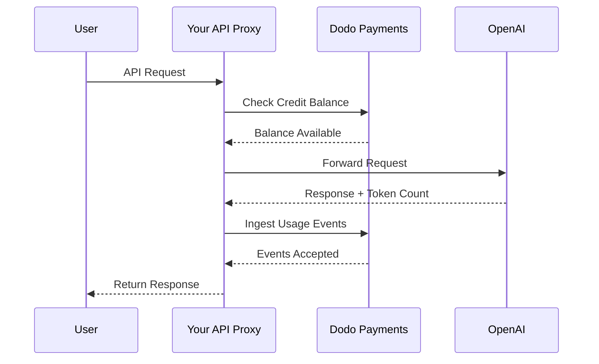
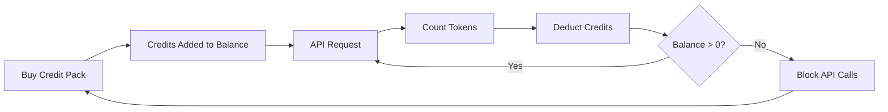

OpenAI का बिलिंग मॉडल AI कंपनियों के लिए स्वर्णिम मानक है। यह API उपयोग के लिए प्रीपेड फिएट क्रेडिट्स को उपभोक्ता उत्पादों के लिए फ्लैट-रेट सब्सक्रिप्शन के साथ जोड़ता है। यह संकर तरीका विश्वसनीय राजस्व सुनिश्चित करता है और डेवलपर्स को बिना रुकावट के अपने उपयोग का स्केल करने देता है।

## क्यों OpenAI का मॉडल मानक है

AI उद्योग को ऐसे विशिष्ट समस्याएँ होती हैं जिन्हें पारंपरिक SaaS बिलिंग हमेशा संबोधित नहीं करती। OpenAI का मॉडल इनमें से कई समस्याओं को एक साथ हल करता है।

1. **पूर्वानुमेय राजस्व और कम जोखिम**: API उपयोग के लिए प्रीपेड क्रेडिट्स की आवश्यकता करके OpenAI उपयोगकर्ताओं के द्वारा बड़ी-बड़ी बिलों को बन जाने का जोखिम खत्म कर देता है जिन्हें वे चुका नहीं सकते। आप अग्रिम में पैसा प्राप्त करते हैं, और उपयोगकर्ता सेवा को उसी समय प्राप्त करता है जब वह इसका उपयोग करता है।
2. **डेवलपर्स के लिए स्केलेबिलिटी**: $5 का टॉप-अप प्रवेश के लिए निम्न बाधा है। जैसे-जैसे उनका एप्लिकेशन बढ़ता है, डेवलपर्स टॉप-अप को स्वचालित कर सकते हैं या बड़े पैक्स खरीद सकते हैं। शुरू करने में घर्षण लगभग शून्य है, लेकिन विकास की सीमा अनंत है।
3. **उपयोगकर्ता मनोविज्ञान**: क्रेडिट को अमूर्त "टोकन" या "पॉइंट्स" की बजाय फिएट मुद्रा (USD) में दर्शाने से मूल्य स्पष्ट होता है। यह AI सेवाओं के लिए बैंक खाते जैसा लगता है, जो विश्वास पैदा करता है और कंपनियों के लिए बजट बनाना आसान बनाता है।

## OpenAI बिल कैसे करता है

OpenAI अलग-अलग उपयोगकर्ता जरूरतों को पूरा करने के लिए दो विशिष्ट बिलिंग मॉडल चलाता है।

1. **API (Pay-as-you-go)**: API प्रीपेड फिएट-निर्धारित क्रेडिट्स का उपयोग करता है। उपयोगकर्ता अपने खाते में $5, $10, $50 या उससे अधिक जोड़ते हैं। ये क्रेडिट्स डॉलर मूल्य दिखाते हैं लेकिन OpenAI के बाहर इनका कोई मौद्रिक मूल्य नहीं होता। OpenAI इनपुट और आउटपुट टोकन के लिए अलग दरों के साथ प्रति-टोकन बिल करता है। क्रेडिट कभी समाप्त नहीं होते, और जब उपयोगकर्ता का बैलेंस $0 हो जाता है तो उनके API कॉल तुरंत विफल हो जाते हैं।
2. **ChatGPT Plus, Team, and Enterprise**: ये फ्लैट-रेट सब्सक्रिप्शन हैं। ChatGPT Plus की कीमत $20 प्रति माह है, जबकि Team प्लान $25 प्रति उपयोगकर्ता प्रति माह है। इन योजनाओं में सॉफ्ट उपयोग कैप होते हैं जहां उपयोगकर्ताओं को ब्लॉक करने के बजाय छोटे मॉडल पर डाउनग्रेड किया जाता है।
3. **खर्च-आधारित दर स्तर**: जैसे-जैसे आप समय के साथ कुल अधिक राशि खर्च करते हैं, आप उच्च API दर सीमाएँ अनलॉक करते हैं। यह आपकी बिलिंग इतिहास से सीधे जुड़ा एक भरोसे पर आधारित एक्सेस स्केलिंग सिस्टम है।

| मॉडल | मूल्य निर्धारण | इनपुट टोकन | आउटपुट टोकन |
| :--- | :--- | :--- | :--- |
| GPT-4o | उपयोग-आधारित | $2.50 / 1M | $10.00 / 1M |
| GPT-4o-mini | उपयोग-आधारित | $0.15 / 1M | $0.60 / 1M |
| o1 | उपयोग-आधारित | $15.00 / 1M | $60.00 / 1M |

| योजना | मूल्य | प्रकार |
| :--- | :--- | :--- |
| Free | $0 | सीमित पहुंच |
| Plus | $20 / mo | सॉफ्ट कैप्स वाला सब्सक्रिप्शन |
| Team | $25 / user / mo | प्रति-सीट सब्सक्रिप्शन |
| Enterprise | कस्टम | इनवॉइस्ड बिलिंग |
## इसे विशिष्ट क्या बनाता है

OpenAI की बिलिंग रणनीति में कई प्रमुख विशेषताएँ हैं जो इसे AI सेवाओं के लिए प्रभावी बनाती हैं।

- **फिएट-निर्धारित क्रेडिट्स**: चूंकि क्रेडिट्स USD में निर्धारित होते हैं, इसलिए ये पैसे जैसा महसूस होता है। यह डेवलपर्स के लिए मूल्य निर्धारण को स्पष्ट और समझने में आसान बनाता है।
- **समाप्ति नहीं**: कभी न समाप्त होने वाला बैलेंस 'इस्तेमाल करो या खो दो' दबाव को कम करता है। उपयोगकर्ता बड़े राशि टॉप-अप करने में सहज महसूस करते हैं क्योंकि उन्हें पता होता है कि मूल्य गायब नहीं होगा।
- **बहु-आयामी मीटरिंग**: इनपुट और आउटपुट टोकन अलग-अलग ट्रैक किए जाते हैं लेकिन उसी क्रेडिट बैलेंस से घटाए जाते हैं। इससे OpenAI महंगे आउटपुट टोकन को सस्ते इनपुट टोकन से अलग दर पर मूल्यांकन कर सकता है।
- **विश्वास स्तर**: कुल खर्च से दर सीमाओं को जोड़ना उपयोगकर्ताओं को प्लेटफॉर्म पर बने रहने के लिए प्रोत्साहित करता है और दीर्घकालिक ग्राहकों को बेहतर प्रदर्शन के साथ इनाम देता है।

## रणनीतिक फायदे

यह मॉडल एक शक्तिशाली फ्लाईव्हील बनाता है। कम प्रवेश लागत डेवलपर्स को आकर्षित करती है। प्रीपेड क्रेडिट्स तुरंत नकदी प्रवाह प्रदान करते हैं। उपयोग-आधारित स्केलिंग यह सुनिश्चित करता है कि जैसे-जैसे डेवलपर्स सफल होते हैं, OpenAI भी सफल होता है। सब्सक्रिप्शन पक्ष गैर-डेवलपर्स से स्थिर, पूर्वानुमेय राजस्व प्रदान करता है।

## Dodo Payments के साथ इसे बनाएं

You can replicate OpenAI's billing model using Dodo Payments. We'll use Credit-Based Billing for the API and standard subscriptions for the ChatGPT Plus side.

<Steps>
  <Step title="Create a Fiat Credit Entitlement">
    अपनी Dodo Payments डैशबोर्ड में एक क्रेडिट अधिकार बनाएँ। यह आपके उपयोगकर्ताओं के लिए केंद्रीय बैलेंस के रूप में कार्य करेगा।

    * **क्रेडिट प्रकार:** फिएट क्रेडिट्स (USD)
    * **क्रेडिट समाप्ति:** कभी नहीं
    * **रोलओवर:** आवश्यक नहीं (क्योंकि ये कभी समाप्त नहीं होते)
    * **ओवरएज:** अक्षम

    ओवरएज को अक्षम करने से सुनिश्चित होता है कि जब बैलेंस $0 पहुँचता है, तो API कॉल उसी तरह विफल हो जाते हैं जैसे OpenAI में होता है।

  <Step title="Create Top-Up Products">
    विभिन्न क्रेडिट पैक्स के लिए एक-बारगी भुगतान उत्पाद बनाएँ। आप $5, $10, $50, और $100 विकल्प प्रदान कर सकते हैं। प्रत्येक उत्पाद से अपने फिएट क्रेडिट अधिकार को जोड़ें।

    प्रति उत्पाद जारी होने वाले क्रेडिट्स को सेंट में सेट करें। $50 पैक के लिए, आप 5000 क्रेडिट जारी करेंगे।

    ```typescript
    import DodoPayments from 'dodopayments';

    const client = new DodoPayments({
      bearerToken: process.env.DODO_PAYMENTS_API_KEY,
    });

    const session = await client.checkoutSessions.create({
      product_cart: [
        { product_id: 'prod_credit_pack_50', quantity: 1 }
      ],
      customer: { email: 'developer@example.com' },
      return_url: 'https://yourapp.com/dashboard'
    });
    ```

  <Step title="Create Usage Meters">
    टोकन उपयोग को ट्रैक करने के लिए दो अलग मीटर बनाएँ。
    * `llm.input_tokens`: `tokens` प्रॉपर्टी पर योग संकलन।
    * `llm.output_tokens`: `tokens` प्रॉपर्टी पर योग संकलन।
    अपने फिएट क्रेडिट अधिकार से दोनों मीटर को लिंक करें। आपको प्रत्येक के लिए "मीटर यूनिट्स पर क्रेडिट" को कॉन्फ़िगर करना होगा。
    ### एक क्रेडिट पर मीटर यूनिट की गणना
    OpenAI के GPT-4o मूल्य निर्धारण ($2.50 प्रति 1M इनपुट टोकन) से मेल खाने के लिए, आपको यह गणना करनी होगी कि $1 (100 सेंट) के लिए कितने टोकन होते हैं।
    * **इनपुट टोकन:** 1,000,000 टोकन / $2.50 = $1 पर 400,000 टोकन।
    * **आउटपुट टोकन:** 1,000,000 टोकन / $10.00 = $1 पर 100,000 टोकन。
    डोडो डैशबोर्ड में, आप इनपुट के लिए "मीटर यूनिट्स पर क्रेडिट" को 400,000 और आउटपुट के लिए 100,000 पर सेट करेंगे।

    ```typescript
    import DodoPayments from 'dodopayments';

    const client = new DodoPayments({
      bearerToken: process.env.DODO_PAYMENTS_API_KEY,
    });

    const session = await client.checkoutSessions.create({
      product_cart: [
        { product_id: 'prod_credit_pack_50', quantity: 1 }
      ],
      customer: { email: 'developer@example.com' },
      return_url: 'https://yourapp.com/dashboard'
    });
    ```

  </Step>

  <Step title="Send Usage Events">
    हर LLM अनुरोध के बाद, उपयोग डेटा को Dodo Payments को भेजें। आप एक ही अनुरोध में इनपुट और आउटपुट दोनों घटनाएँ भेज सकते हैं।

    ```typescript
    await client.usageEvents.ingest({
      events: [{
        event_id: `req_${requestId}`,
        customer_id: customerId,
        event_name: 'llm.input_tokens',
        timestamp: new Date().toISOString(),
        metadata: {
          model: 'gpt-4o',
          tokens: 1500
        }
      }, {
        event_id: `req_${requestId}_out`,
        customer_id: customerId,
        event_name: 'llm.output_tokens',
        timestamp: new Date().toISOString(),
        metadata: {
          model: 'gpt-4o',
          tokens: 800
        }
      }]
    });
    ```

  </Step>

  <Step title="Handle Balance Depletion">
    API अनुरोध को संसाधित करने से पहले उपयोगकर्ता का बैलेंस जांचना चाहिए। यदि बैलेंस शून्य या ऋणात्मक है, तो 402 त्रुटि लौटाएँ।

    ```typescript
    async function checkCreditsBeforeRequest(customerId: string) {
      const balance = await client.creditEntitlements.balances.retrieve(customerId, {
        credit_entitlement_id: 'credit_entitlement_id',
      });

      if (balance.available <= 0) {
        throw new Error('Insufficient credits. Please top up your account.');
      }
    }
    ```

    ### कम बैलेंस वेबहुक्स को संभालना

    जब तक उपयोगकर्ता $0 तक नहीं पहुँचता, तब तक सूचित करने का इंतजार न करें। जब उनका बैलेंस किसी निश्चित सीमा से नीचे गिरता है, तो वेबहुक्स का उपयोग करके ईमेल या इन-ऐप सूचना ट्रिगर करें।

    ```typescript
    import DodoPayments from 'dodopayments';
    import express from 'express';

    const app = express();
    app.use(express.raw({ type: 'application/json' }));

    const client = new DodoPayments({
      bearerToken: process.env.DODO_PAYMENTS_API_KEY,
      webhookKey: process.env.DODO_PAYMENTS_WEBHOOK_KEY,
    });

    app.post('/webhooks/dodo', async (req, res) => {
      try {
        const event = client.webhooks.unwrap(req.body.toString(), {
          headers: {
            'webhook-id': req.headers['webhook-id'] as string,
            'webhook-signature': req.headers['webhook-signature'] as string,
            'webhook-timestamp': req.headers['webhook-timestamp'] as string,
          },
        });

        if (event.type === 'credit.balance_low') {
          const { customer_id, available_balance } = event.data;
          await sendLowBalanceEmail(customer_id, available_balance);
        }

        res.json({ received: true });
      } catch (error) {
        res.status(401).json({ error: 'Invalid signature' });
      }
    });
    ```

    <Tip>
      जब किसी उपयोगकर्ता का बैलेंस लगभग समाप्त हो जाता है, तब OpenAI ये ईमेल भेजता है, जिससे उन्हें बिना सेवा बाधा के टॉप-अप करने का समय मिलता है。
    </Tip>

  </Step>

  <Step title="Build the ChatGPT Subscription Side (Optional)">
    यदि आप ChatGPT Plus जैसे सब्सक्रिप्शन प्लान की पेशकश करना चाहते हैं, तो Dodo Payments में एक अलग सब्सक्रिप्शन उत्पाद बनाएँ। इनको क्रेडिट अधिकारों की आवश्यकता नहीं होती।

    Team प्लान के लिए, प्रत्येक अतिरिक्त उपयोगकर्ता के लिए एड-ऑन जोड़कर सीट-आधारित बिलिंग का उपयोग करें।

    ```typescript
    const session = await client.checkoutSessions.create({
      product_cart: [
        { product_id: 'prod_plus_subscription', quantity: 1 }
      ],
      customer: { email: 'user@example.com' },
      return_url: 'https://yourapp.com/billing'
    });
    ```

    ### सॉफ्ट कैप्स को लागू करना

    OpenAI के सॉफ्ट कैप्स को दोहराने के लिए, आप अपने सब्सक्रिप्शन उपयोगकर्ताओं के लिए उसी मीटर का उपयोग कर सकते हैं लेकिन उन्हें क्रेडिट अधिकार से लिंक नहीं करेंगे। अपने एप्लिकेशन लॉजिक में वर्तमान बिलिंग अवधि के लिए उपयोग की जाँच करें।

    ```typescript
    async function checkSubscriptionUsage(customerId: string) {
      const usage = await getUsageForCurrentPeriod(customerId);
      
      if (usage > SOFT_CAP_THRESHOLD) {
        // Route to a smaller model instead of blocking
        return 'gpt-4o-mini';
      }
      
      return 'gpt-4o';
    }
    ```

  </Step>
</Steps>

## LLM इनजेशन ब्लूप्रिंट के साथ गति बढ़ाएँ

ऊपर दिए गए चरण दिखाते हैं कि उपयोग घटनाओं को मैन्युअल रूप से कैसे बनाया और भेजा जाए। प्रोडक्शन डिप्लॉयमेंट के लिए, [LLM Ingestion Blueprint](/developer-resources/ingestion-blueprints/llm) स्वचालित टोकन ट्रैकिंग प्रदान करता है जो सीधे आपके OpenAI क्लाइंट को रैप करता है।

```bash
npm install @dodopayments/ingestion-blueprints
```

```typescript
import { createLLMTracker } from '@dodopayments/ingestion-blueprints';
import OpenAI from 'openai';

const openai = new OpenAI({ apiKey: process.env.OPENAI_API_KEY });

const tracker = createLLMTracker({
  apiKey: process.env.DODO_PAYMENTS_API_KEY,
  environment: 'live_mode',
  eventName: 'llm.chat_completion',
});

const trackedClient = tracker.wrap({
  client: openai,
  customerId: customerId,
});

// Every API call now automatically tracks token usage
const response = await trackedClient.chat.completions.create({
  model: 'gpt-4o',
  messages: [{ role: 'user', content: prompt }],
});

// inputTokens, outputTokens, and totalTokens are sent automatically
console.log('Tokens used:', response.usage);
```

ब्लूप्रिंट प्रत्येक API प्रतिक्रिया से `inputTokens`, `outputTokens`, और `totalTokens` को कैप्चर करता है और उन्हें इवेंट मेटाडेटा के रूप में भेजता है। अपने मीटर को उपयुक्त टोकन प्रॉपर्टी पर संकलित करने के लिए कॉन्फ़िगर करें।

<Tip>
LLM ब्लूप्रिंट OpenAI, Anthropic, Groq, Google Gemini, OpenRouter, और Vercel AI SDK का समर्थन करता है। प्रदाता-विशिष्ट उदाहरणों और उन्नत कॉन्फ़िगरेशन के लिए [पूर्ण ब्लूप्रिंट दस्तावेज़](/developer-resources/ingestion-blueprints/llm) देखें।
</Tip>

## खर्च-आधारित दर स्तर लागू करना

OpenAI के दर स्तर क्षमता प्रबंधन का एक शक्तिशाली तरीका हैं। आप ग्राहक के कुल जीवनकाल के खर्च को ट्रैक करके इसे लागू कर सकते हैं।

1. **लाइफटाइम खर्च ट्रैक करें:** `payment.succeeded` वेबहुक्स को सुनें और अपने डेटाबेस में उस ग्राहक के लिए `total_spend` फ़ील्ड को अपडेट करें。
2. **टियर्स परिभाषित करें:** खर्च राशियों को दर सीमाओं से जोड़ने वाला मैपिंग बनाएं。
   * Tier 1: $0 - $50 खर्च -> 3 RPM
   * Tier 2: $50 - $250 खर्च -> 10 RPM
   * Tier 3: $250+ खर्च -> 50 RPM
3. **सीमाओं को लागू करें:** अपने API मिडलवेयर में ग्राहक के टियर की जांच करें और संबंधित दर सीमा लागू करें。

```typescript
async function getRateLimitForCustomer(customerId: string) {
  const customer = await db.customers.findUnique({ where: { id: customerId } });
  const totalSpend = customer.total_spend;

  if (totalSpend >= 25000) return TIER_3_LIMITS; // $250.00
  if (totalSpend >= 5000) return TIER_2_LIMITS;  // $50.00
  return TIER_1_LIMITS;
}
```

## पूर्ण कार्यान्वयन उदाहरण: API प्रॉक्सी

एक वास्तविक दुनिया परिदृश्य में, आपके उपयोगकर्ताओं और LLM प्रदाता के बीच एक API प्रॉक्सी हो सकता है। यह प्रॉक्सी प्रमाणीकरण, क्रेडिट जांच, और उपयोग रिपोर्टिंग को संभालती है।



```typescript
import DodoPayments from 'dodopayments';
import OpenAI from 'openai';

const client = new DodoPayments({
  bearerToken: process.env.DODO_PAYMENTS_API_KEY,
});
const openai = new OpenAI({ apiKey: process.env.OPENAI_API_KEY });

export async function handleApiRequest(req, res) {
  const { customerId, prompt, model } = req.body;

  try {
    // 1. Check credit balance
    const balance = await client.creditEntitlements.balances.retrieve(customerId, {
      credit_entitlement_id: 'credit_entitlement_id',
    });

    if (balance.available <= 0) {
      return res.status(402).json({ error: 'Insufficient credits. Please top up.' });
    }

    // 2. Call OpenAI
    const completion = await openai.chat.completions.create({
      model: model,
      messages: [{ role: 'user', content: prompt }],
    });

    const { prompt_tokens, completion_tokens } = completion.usage;

    // 3. Ingest usage events to Dodo
    await client.usageEvents.ingest({
      events: [
        {
          event_id: `req_${completion.id}_in`,
          customer_id: customerId,
          event_name: 'llm.input_tokens',
          timestamp: new Date().toISOString(),
          metadata: { model, tokens: prompt_tokens }
        },
        {
          event_id: `req_${completion.id}_out`,
          customer_id: customerId,
          event_name: 'llm.output_tokens',
          timestamp: new Date().toISOString(),
          metadata: { model, tokens: completion_tokens }
        }
      ]
    });

    // 4. Return response to user
    res.json(completion);

  } catch (error) {
    console.error('API Error:', error);
    res.status(500).json({ error: 'Internal server error' });
  }
}
```

## किनारे के मामलों को संभालना

जब OpenAI जैसे जटिल बिलिंग सिस्टम को बना रहे हों, तो कई किनारे के मामले सामने आते हैं जिन्हें सावधानी से संभालना होता है।

### रेस कंडीशंस

यदि किसी उपयोगकर्ता का बैलेंस बहुत कम है और वह एक साथ कई अनुरोध भेजता है, तो पहले इवेंट को संसाधित करने से पहले वे अपने क्रेडिट सीमा से अधिक हो सकते हैं। इसे रोकने के लिए, आप एक छोटा 'बफ़र' लागू कर सकते हैं या अनुरोध के दौरान ग्राहक के बैलेंस पर वितरित लॉक का उपयोग कर सकते हैं।

### इवेंट इनजेशन विलंबता

Dodo Payments इवेंट्स को असिंक्रोनस रूप से संसाधित करता है। इसका मतलब है कि API कॉल और क्रेडिट कटौती के बीच थोड़ा विलंब हो सकता है। अधिकांश उपयोग मामलों के लिए यह स्वीकार्य है। यदि आपको कड़ी रीयल-टाइम लागू करना है, तो आप उपयोगकर्ता के बैलेंस का स्थानीय कैश रख सकते हैं और इसे आशावादी रूप से अपडेट कर सकते हैं।

### रिफंड हैंडलिंग

यदि आप किसी क्रेडिट पैक खरीद को रिफंड करते हैं, तो Dodo Payments स्वचालित रूप से क्रेडिट अधिकार को संभालेगा यदि इसे कॉन्फ़िगर किया गया हो। हालांकि, आपको यह सुनिश्चित करना चाहिए कि आपका एप्लिकेशन लॉजिक इस परिवर्तन को तुरंत प्रतिबिंबित करे ताकि उपयोगकर्ता उन क्रेडिट्स का उपयोग न करें जो अब उनके पास नहीं हैं।

### बहु-मॉडल समर्थन

यदि आप विभिन्न मूल्य निर्धारण वाले कई मॉडल का समर्थन करते हैं, तो आपके पास दो विकल्प हैं:
1. **अलग मीटर:** प्रत्येक मॉडल के लिए अलग मीटर बनाएँ (उदाहरण के लिए, `gpt-4o.input_tokens`, `gpt-4o-mini.input_tokens`)।
2. **वेटेड इवेंट्स:** एक ही मीटर का उपयोग करें लेकिन `tokens` मान को Dodo को भेजने से पहले एक भार से गुणा करें। उदाहरण के लिए, यदि GPT-4o GPT-4o-mini की तुलना में 10 गुना अधिक महंगा है, तो आप GPT-4o अनुरोधों के लिए टोकन को 10 गुना भेज सकते हैं।

OpenAI स्पष्ट उपयोग रिकॉर्ड बनाए रखने के लिए आंतरिक रूप से अलग मीटर दृष्टिकोण का उपयोग करता है।

## संरचना अवलोकन



मीटर टोकन को ट्रैक करते हैं और आपके कॉन्फ़िगर किए गए दरों के आधार पर उपयोगकर्ता के क्रेडिट बैलेंस से संबंधित मूल्य घटाते हैं।

## निष्कर्ष

OpenAI के बिलिंग मॉडल को Dodo Payments के साथ दोहराने से आपको दोनों दुनियाओं का सर्वश्रेष्ठ मिलता है: उपयोग-आधारित बिलिंग की लचीलापन और प्रीपेड क्रेडिट्स की पूर्वानुमेयता। इस मार्गदर्शिका का पालन करके, आप एक बिलिंग सिस्टम बना सकते हैं जो आपके उपयोगकर्ताओं के साथ स्केल करता है और आपके मार्जिन की रक्षा करता है।

चाहे आप अगला बड़ा LLM बना रहे हों या एक विशेष AI टूल, ये पैटर्न आपको एक पेशेवर, डेवलपर-फ्रेंडली अनुभव बनाने में मदद करेंगे। यह दृष्टिकोण सुनिश्चित करता है कि आपकी बिलिंग संरचना उतनी ही स्केलेबल और विश्वसनीय है जितने AI मॉडल जिन्हें आप अपने ग्राहकों को प्रदान कर रहे हैं।

## उपयोग किए गए प्रमुख Dodo विशेषताएँ

उन सुविधाओं का अन्वेषण करें जो इस कार्यान्वयन को संभव बनाती हैं।

<CardGroup cols={2}>
  <Card title="Credit-Based Billing" icon="coins" href="/features/credit-based-billing">
    अपने उपयोगकर्ताओं के लिए प्रीपेड फिएट क्रेडिट्स और अधिकारों को प्रबंधित करें।
  </Card>
  <Card title="Usage-Based Billing" icon="chart-line" href="/features/usage-based-billing/introduction">
    गहन उपयोग को ट्रैक करें जैसे टोकन और उसे रीयल-टाइम में बिल करें।
  </Card>
  <Card title="One-Time Payments" icon="credit-card" href="/features/one-time-payment-products">
    सरल चेकआउट फ्लो के साथ क्रेडिट पैक्स और टॉप-अप बेचें।
  </Card>
  <Card title="Event Ingestion" icon="bolt" href="/features/usage-based-billing/event-ingestion">
    उच्च-आयतन उपयोग डेटा को आसानी से Dodo Payments को भेजें।
  </Card>
  <Card title="Webhooks" icon="webhook" href="/developer-resources/webhooks/intents/credit">
    क्रेडिट बैलेंस परिवर्तनों और कम बैलेंस अलर्ट पर अपडेट रहें।
  </Card>
  <Card title="LLM Ingestion Blueprint" icon="brain-circuit" href="/developer-resources/ingestion-blueprints/llm">
    OpenAI और अन्य LLM प्रदाताओं के लिए स्वचालित टोकन ट्रैकिंग।
  </Card>
</CardGroup>

## Key Dodo Features Used

Explore the features that make this implementation possible.

<CardGroup cols={2}>
  <Card title="Credit-Based Billing" icon="coins" href="/features/credit-based-billing">
    Manage prepaid fiat credits and entitlements for your users.
  </Card>
  <Card title="Usage-Based Billing" icon="chart-line" href="/features/usage-based-billing/introduction">
    Track granular usage like tokens and bill for it in real-time.
  </Card>
  <Card title="One-Time Payments" icon="credit-card" href="/features/one-time-payment-products">
    Sell credit packs and top-ups with a simple checkout flow.
  </Card>
  <Card title="Event Ingestion" icon="bolt" href="/features/usage-based-billing/event-ingestion">
    Send high-volume usage data to Dodo Payments with ease.
  </Card>
  <Card title="Webhooks" icon="webhook" href="/developer-resources/webhooks/intents/credit">
    Stay updated on credit balance changes and low balance alerts.
  </Card>
  <Card title="LLM Ingestion Blueprint" icon="brain-circuit" href="/developer-resources/ingestion-blueprints/llm">
    Automatic token tracking for OpenAI and other LLM providers.
  </Card>
</CardGroup>
