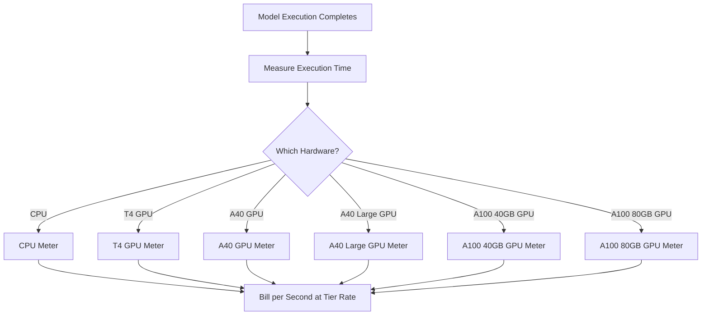

रेप्लिकेट क्लाउड में ओपन-सोर्स मशीन लर्निंग मॉडल चलाने का एक प्लेटफ़ॉर्म है। उनका बिलिंग मॉडल एआई उद्योग में उपयोग-आधारित मूल्य निर्धारण का सबसे स्वच्छ उदाहरणों में से एक है। कोई मासिक सदस्यता शुल्क नहीं है और न ही प्रति मॉडल रन का फ्लैट रेट। इसके बजाय, वे उस सटीक कंप्यूट समय के लिए बिल करते हैं जो उपयोग किया गया, वह भी सेकंड तक, जिसकी दरें अंतर्निहित हार्डवेयर पर आधारित होती हैं।

यह दृष्टिकोण एआई वर्कलोड्स के लिए अच्छा काम करता है क्योंकि निष्पादन समय अप्रत्याशित होते हैं। एक उपयोगकर्ता कुछ सेकंड के लिए हल्का मॉडल चला सकता है या कुछ मिनटों के लिए एक विशाल जनरेटिव मॉडल चला सकता है। लागत को मॉडल के बजाय कंप्यूट संसाधनों से जोड़कर, रेप्लिकेट मूल्य निर्धारण को पारदर्शी और स्केलेबल रखता है।

## रेप्लिकेट कैसे बिल करता है

रेप्लिकेट की मूल्य निर्धारण उस विशिष्ट मॉडल से अलग होती है जिसे चलाया जा रहा है। चाहे आप SDXL के साथ छवि जनरेट कर रहे हों या Llama 3 चला रहे हों, बिलिंग हार्डवेयर टियर और निष्पादन की अवधि द्वारा निर्धारित होती है। इससे वे हजारों ओपन-सोर्स मॉडल होस्ट कर सकते हैं बिना हर एक के लिए अलग मूल्य योजना की आवश्यकता के।

| हार्डवेयर | प्रति सेकंड मूल्य | प्रति घंटा मूल्य |
| :--- | :--- | :--- |
| NVIDIA CPU | \$0.000100 | \$0.36 |
| NVIDIA T4 GPU | \$0.000225 | \$0.81 |
| NVIDIA A40 GPU | \$0.000575 | \$2.07 |
| NVIDIA A40 (Large) GPU | \$0.000725 | \$2.61 |
| NVIDIA A100 (40GB) GPU | \$0.001150 | \$4.14 |
| NVIDIA A100 (80GB) GPU | \$0.001400 | \$5.04 |



1. **हार्डवेयर-विशिष्ट दरें:** प्रति सेकंड लागत उस कंप्यूट संसाधन पर आधारित होती है जिसकी आवश्यकता होती है। हर हार्डवेयर टियर का अलग मूल्य बिंदु होता है।
2. **शुद्ध उपयोग-आधारित मॉडल:** कोई मासिक शुल्क नहीं, कोई ओवरएज नहीं और कोई सीमा नहीं। उपयोगकर्ताओं को सटीक कंप्यूट समय (जैसे "एक A100 पर 12.4 सेकंड") के लिए बिल किया जाता है, न कि प्रति जनरेशन।
3. **प्रति-सेकंड सूक्ष्मता:** पारंपरिक क्लाउड प्रदाता घंटे या मिनट के आधार पर बिल करते हैं, जिससे छोटे कार्यों में वेस्ट होता है। प्रति-सेकंड बिलिंग इस अक्षमता को छोटे प्रयोगों और बड़े प्रोडक्शन वर्कलोड्स दोनों के लिए समाप्त करती है।

<Info>
कोल्ड स्टार्ट्स भी बिल करने योग्य होते हैं। किसी मॉडल के लिए पहली रिक्वेस्ट में अक्सर मॉडल को मेमोरी में लोड करने में 10-30 सेकंड लगते हैं। यह लोडिंग समय निष्पादन समय की समान दर पर बिल किया जाता है।
</Info>
## क्या इसे अलग बनाता है

* **हार्डवेयर-विशिष्ट मीटरिंग:** समान मॉडल बेहतर हार्डवेयर पर अधिक महंगा होता है। उपयोगकर्ता गति और लागत के बीच चुनाव करते हैं। गैर-समय-संवेदनशील कार्यों के लिए T4 GPU काम आता है, जबकि एक A100 वास्तविक-समय अनुप्रयोगों को संभालता है।
* **प्रति-सेकंड सूक्ष्मता:** बिलिंग सेकंड तक गणना की जाती है, इसलिए उपयोगकर्ताओं को छोटे कार्यों के लिए कभी अधिक शुल्क नहीं लिया जाता।
* **कोई सदस्यता नहीं:** शुरू करने के लिए शून्य प्रतिबद्धता। यह उपयोग के साथ अनंत रूप से स्केल करता है, जिससे यह स्टार्टअप्स और विभिन्न मॉडलों के साथ प्रयोग करने वाले डेवलपर्स के लिए आदर्श बनता है।
* **मॉडल-एग्नोस्टिक:** कार्य के प्रकार (छवि जनरेशन, टेक्स्ट प्रोसेसिंग, ऑडियो ट्रांसक्रिप्शन, या वीडियो सिंथेसिस) के बावजूद बिलिंग लॉजिक समान रहता है। इससे प्लेटफ़ॉर्म जटिल मूल्य तालिकाओं के बिना एक विशाल मॉडल इकोसिस्टम को सपोर्ट कर पाता है।

## Dodo Payments के साथ इसे बनाएं

आप Dodo Payments की उपयोग-आधारित बिलिंग सुविधाओं का उपयोग करके इस बिलिंग मॉडल को दोहर सकते हैं। कुंजी यह है कि विभिन्न हार्डवेयर टियर्स को ट्रैक करने के लिए कई मीटरों का उपयोग करें और उन्हें एक ही उत्पाद से जोड़ें।

<Steps>
  <Step title="Create Usage Meters (One Per Hardware Class)">
    प्रत्येक हार्डवेयर टियर के लिए अलग मीटर बनाएं। हर हार्डवेयर प्रकार का प्रति सेकंड अलग मूल्य होता है, इसलिए स्वतंत्र मीटरिंग Dodo को प्रत्येक टियर को अलग से मूल्य देने और वस्तुनिष्ठ बिलिंग प्रदान करने देती है।

    | Meter Name | Event Name | Aggregation | Property |
    | :--- | :--- | :--- | :--- |
    | CPU Compute | `compute.cpu` | Sum | `execution_seconds` |
    | GPU T4 Compute | `compute.gpu_t4` | Sum | `execution_seconds` |
    | GPU A40 Compute | `compute.gpu_a40` | Sum | `execution_seconds` |
    | GPU A40 Large Compute | `compute.gpu_a40_large` | Sum | `execution_seconds` |
    | GPU A100 40GB Compute | `compute.gpu_a100_40` | Sum | `execution_seconds` |
    | GPU A100 80GB Compute | `compute.gpu_a100_80` | Sum | `execution_seconds` |

    `Sum` संग्रहण `execution_seconds` संपत्ति पर बिलिंग अवधि के दौरान प्रत्येक हार्डवेयर टियर के लिए कुल कंप्यूट समय की गणना करता है।
  </Step>

  <Step title="Create a Usage-Based Product">
    Dodo Payments डैशबोर्ड में एक नया उत्पाद बनाएं:

    * **मूल्य प्रकार:** उपयोग-आधारित बिलिंग
    * **बेस प्राइस:** \$0/माह (कोई सदस्यता शुल्क नहीं)
    * **बिलिंग आवृत्ति:** मासिक

    सभी मीटरों को उनके प्रति-यूनिट मूल्य के साथ संलग्न करें:

    | Meter | Price Per Unit (per second) |
    | :--- | :--- |
    | compute.cpu | \$0.000100 |
    | compute.gpu_t4 | \$0.000225 |
    | compute.gpu_a40 | \$0.000575 |
    | compute.gpu_a40_large | \$0.000725 |
    | compute.gpu_a100_40 | \$0.001150 |
    | compute.gpu_a100_80 | \$0.001400 |

    सभी मीटरों के लिए **फ्री थ्रेशोल्ड** को 0 पर सेट करें। निष्पादन के हर सेकंड को बिल किया जाता है।
  </Step>

  <Step title="Send Usage Events">
    जब भी एक मॉडल निष्पादन पूरा हो, Dodo को उपयोग की घटनाएँ भेजें। प्रत्येक प्रेडिक्शन के लिए एक अद्वितीय `event_id` शामिल करें ताकि आइडेम्पोटेंसी सुनिश्चित हो सके।

    ```typescript
    import DodoPayments from 'dodopayments';

    type HardwareTier = 'cpu' | 'gpu_t4' | 'gpu_a40' | 'gpu_a40_large' | 'gpu_a100_40' | 'gpu_a100_80';

    const client = new DodoPayments({
      bearerToken: process.env.DODO_PAYMENTS_API_KEY,
    });

    async function trackModelExecution(
      customerId: string,
      modelId: string,
      hardware: HardwareTier,
      executionSeconds: number,
      predictionId: string
    ) {
      const eventName = `compute.${hardware}`;

      await client.usageEvents.ingest({
        events: [{
          event_id: `pred_${predictionId}`,
          customer_id: customerId,
          event_name: eventName,
          timestamp: new Date().toISOString(),
          metadata: {
            execution_seconds: executionSeconds,
            model_id: modelId,
            hardware: hardware
          }
        }]
      });
    }

    // Example: SDXL image generation on A100
    await trackModelExecution(
      'cus_abc123',
      'stability-ai/sdxl',
      'gpu_a100_80',
      8.3,  // 8.3 seconds of A100 time
      'pred_xyz789'
    );
    ```

  </Step>

  <Step title="Measure Execution Time Precisely">
    `performance.now()` का उपयोग करके अपने मॉडल निष्पादन को सटीक समय से लपेटें। बिलिंग के लिए निकटतम दसवें सेकंड तक राउंड करें।

    ```typescript
    async function runModelWithMetering(
      customerId: string,
      modelId: string,
      hardware: HardwareTier,
      input: Record<string, unknown>
    ) {
      const predictionId = `pred_${Date.now()}`;
      const startTime = performance.now();

      try {
        const result = await executeModel(modelId, input, hardware);
        const executionSeconds = (performance.now() - startTime) / 1000;
        const billedSeconds = Math.round(executionSeconds * 10) / 10;

        await trackModelExecution(
          customerId,
          modelId,
          hardware,
          billedSeconds,
          predictionId
        );

        return result;
      } catch (error) {
        // Still bill for compute time even on failure
        const executionSeconds = (performance.now() - startTime) / 1000;
        if (executionSeconds > 1) {
          await trackModelExecution(
            customerId,
            modelId,
            hardware,
            Math.round(executionSeconds * 10) / 10,
            predictionId
          );
        }
        throw error;
      }
    }
    ```

  </Step>

  <Step title="Create Checkout">
    जब कोई उपयोगकर्ता साइन अप करता है, तो उपयोग-आधारित उत्पाद के लिए एक चेकआउट सेशन बनाएं। Dodo स्वचालित रूप से आवर्ती बिलिंग और इनवॉइसिंग संभालता है।

    ```typescript
    const session = await client.checkoutSessions.create({
      product_cart: [
        { product_id: 'prod_compute_payg', quantity: 1 }
      ],
      customer: { email: 'ml-engineer@company.com' },
      return_url: 'https://yourplatform.com/dashboard'
    });
    ```

  </Step>
</Steps>
## टाइम रेंज इनजेस्टन ब्लूप्रिंट के साथ गति बढ़ाएं

[Time Range Ingestion Blueprint](/developer-resources/ingestion-blueprints/time-range) प्रति सेकंड कंप्यूट ट्रैकिंग को सरल बनाता है। प्रत्येक हार्डवेयर टियर के लिए एक इनजेस्टन इंस्टेंस बनाएं और `trackTimeRange` का उपयोग करें ताकि ईवेंट सबमिशन साफ रहे।

```bash
npm install @dodopayments/ingestion-blueprints
```

```typescript
import { Ingestion, trackTimeRange } from '@dodopayments/ingestion-blueprints';

// Create one ingestion instance per hardware tier
function createHardwareIngestion(hardware: string) {
  return new Ingestion({
    apiKey: process.env.DODO_PAYMENTS_API_KEY,
    environment: 'live_mode',
    eventName: `compute.${hardware}`,
  });
}

const ingestions: Record<string, Ingestion> = {
  cpu: createHardwareIngestion('cpu'),
  gpu_t4: createHardwareIngestion('gpu_t4'),
  gpu_a40: createHardwareIngestion('gpu_a40'),
  gpu_a40_large: createHardwareIngestion('gpu_a40_large'),
  gpu_a100_40: createHardwareIngestion('gpu_a100_40'),
  gpu_a100_80: createHardwareIngestion('gpu_a100_80'),
};

// Track execution after a model run completes
const startTime = performance.now();
const result = await executeModel(modelId, input, hardware);
const durationMs = performance.now() - startTime;

await trackTimeRange(ingestions[hardware], {
  customerId: customerId,
  durationMs: durationMs,
  metadata: {
    model_id: modelId,
    hardware: hardware,
  },
});
```

यह ब्लूप्रिंट अवधि स्वरूपण और ईवेंट निर्माण को संभालता है। प्रति-हार्डवेयर इनजेस्टन इंस्टेंस के साथ संयुक्त होकर, यह पैटर्न रेप्लिकेट के बहु-टियर मीटरिंग से साफ़ मेल खाता है।

<Tip>
लंबे चलने वाले कार्यों के लिए, टाइम रेंज ब्लूप्रिंट को इंटरवल-आधारित हार्टबीट ट्रैकिंग के साथ मिलाएं। उन्नत पैटर्न के लिए [पूर्ण ब्लूप्रिंट दस्तावेज़](/developer-resources/ingestion-blueprints/time-range) देखें।
</Tip>
## उपयोगकर्ताओं के लिए लागत अनुमान

चूंकि उपयोग-आधारित बिलिंग अप्रत्याशित हो सकती है, मॉडल चलाने से पहले उपयोगकर्ताओं को लागत अनुमान प्रदान करें। इससे आश्चर्यजनक बिल कम होते हैं और विश्वास बढ़ता है।

### उदाहरण लागत गणनाएँ

| मॉडल | हार्डवेयर | औसत समय | प्रति रन लागत |
| :--- | :--- | :--- | :--- |
| SDXL (छवि) | A100 80GB | ~8 सेकंड | ~\$0.0112 |
| Llama 3 (टेक्स्ट) | A100 40GB | ~3 सेकंड | ~\$0.0035 |
| Whisper (ऑडियो) | GPU T4 | ~15 सेकंड | ~\$0.0034 |

### लागत कैलकुलेटर बनाना

```typescript
function estimateCost(hardware: HardwareTier, estimatedSeconds: number): number {
  const rates: Record<HardwareTier, number> = {
    'cpu': 0.000100,
    'gpu_t4': 0.000225,
    'gpu_a40': 0.000575,
    'gpu_a40_large': 0.000725,
    'gpu_a100_40': 0.001150,
    'gpu_a100_80': 0.001400
  };

  return Number((rates[hardware] * estimatedSeconds).toFixed(4));
}

// Show the user before running: "This will cost approximately $0.0098"
const estimate = estimateCost('gpu_a100_80', 8.5);
```

## एंटर्प्राइज़: आरक्षित क्षमता

उन एंटर्प्राइज़ ग्राहकों के लिए जिन्हें गारंटीकृत उपलब्धता और कोई कोल्ड स्टार्ट नहीं चाहिए, रेप्लिकेट "प्राइवेट इंस्टेंस" एक निश्चित प्रति घंटे दर पर प्रदान करता है।

Dodo Payments के साथ, इसे एक सब्सक्रिप्शन उत्पाद के रूप में मॉडल करें:

* **उत्पाद प्रकार:** सब्सक्रिप्शन
* **कीमत:** निश्चित मासिक मूल्य (उदा., "आरक्षित A100 इंस्टेंस - \$500/माह")
* **बिलिंग चक्र:** मासिक

आप निगरानी और एनालिटिक्स के लिए उपयोग की घटनाएँ भेजते रह सकते हैं, लेकिन सब्सक्रिप्शन लागत को कवर करता है। जैसे-जैसे किसी उपयोगकर्ता की मात्रा बढ़ती है, पे-एज़-यू-गो से आरक्षित क्षमता में स्विच करना अक्सर अधिक लागत-कुशल हो जाता है।

## उन्नत: हार्टबीट मीटरिंग

ऐसे कार्यों के लिए जो कई मिनट या घंटे लगते हैं, केवल अंत में एक घटना भेजना जोखिम भरा होता है। अगर प्रक्रिया क्रैश हो जाए तो उपयोग डेटा खो जाता है। एक बेहतर तरीका यह है कि निष्पादन के दौरान हर 30-60 सेकंड पर उपयोग की घटनाएँ भेजी जाएँ।

```typescript
async function runLongTaskWithHeartbeat(
  customerId: string,
  modelId: string,
  hardware: HardwareTier
) {
  const predictionId = `pred_${Date.now()}`;
  let totalSeconds = 0;

  const heartbeatInterval = setInterval(async () => {
    try {
      await trackModelExecution(
        customerId,
        modelId,
        hardware,
        30,
        `${predictionId}_${totalSeconds}`
      );
      totalSeconds += 30;
    } catch (error) {
      console.error('Heartbeat tracking failed:', error, { predictionId, totalSeconds });
    }
  }, 30000);

  try {
    await executeLongTask();
  } finally {
    clearInterval(heartbeatInterval);
  }
}
```

## उपयोग किए गए प्रमुख Dodo फीचर्स

<CardGroup cols={2}>
  <Card title="Usage-Based Billing" icon="chart-line" href="/features/usage-based-billing/introduction">
    ऐसे उत्पाद सेट करें जो खपत के आधार पर बिल करते हैं।
  </Card>
  <Card title="Meters" icon="gauge" href="/features/usage-based-billing/meters">
    उन मीट्रिक को परिभाषित करें जिन्हें आप ट्रैक और बिल करना चाहते हैं।
  </Card>
  <Card title="Event Ingestion" icon="bolt" href="/features/usage-based-billing/event-ingestion">
    वास्तविक समय में Dodo को उपयोग डेटा भेजें।
  </Card>
  <Card title="Subscriptions" icon="calendar" href="/features/subscription">
    आरक्षित क्षमता और एंटरप्राइज़ योजनाओं के लिए आवर्ती बिलिंग प्रबंधित करें।
  </Card>
  <Card title="Time Range Blueprint" icon="clock" href="/developer-resources/ingestion-blueprints/time-range">
    अवधि हेल्पर्स के साथ प्रति-सेकंड कंप्यूट ट्रैकिंग।
  </Card>
</CardGroup>

## Key Dodo Features Used

<CardGroup cols={2}>
  <Card title="Usage-Based Billing" icon="chart-line" href="/features/usage-based-billing/introduction">
    Set up products that bill based on consumption.
  </Card>
  <Card title="Meters" icon="gauge" href="/features/usage-based-billing/meters">
    Define the metrics you want to track and bill for.
  </Card>
  <Card title="Event Ingestion" icon="bolt" href="/features/usage-based-billing/event-ingestion">
    Send usage data to Dodo in real-time.
  </Card>
  <Card title="Subscriptions" icon="calendar" href="/features/subscription">
    Manage recurring billing for reserved capacity and enterprise plans.
  </Card>
  <Card title="Time Range Blueprint" icon="clock" href="/developer-resources/ingestion-blueprints/time-range">
    Per-second compute tracking with duration helpers.
  </Card>
</CardGroup>
