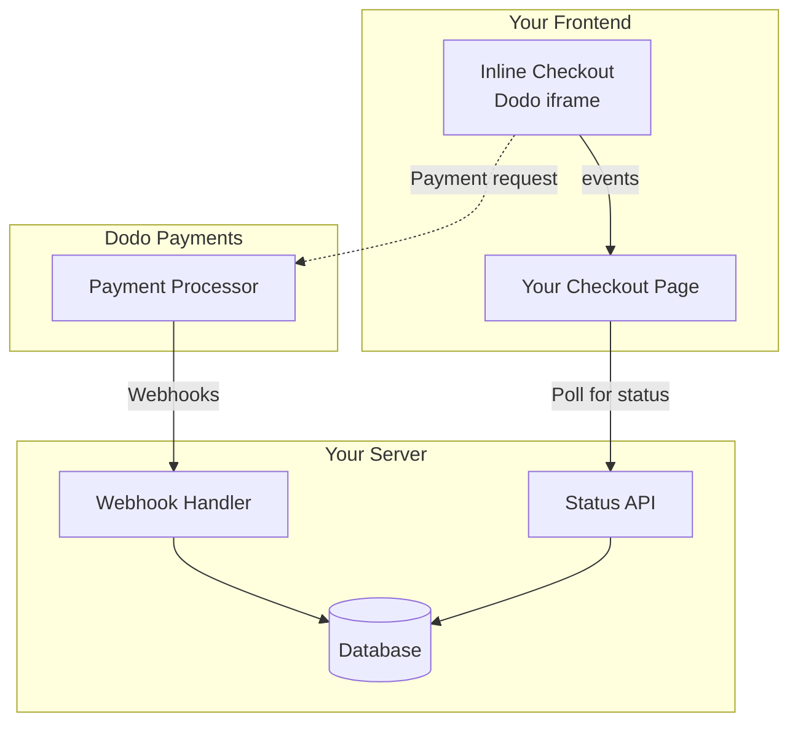

## अवलोकन

इनलाइन चेकआउट आपको पूरी तरह से एकीकृत चेकआउट अनुभव बनाने की अनुमति देता है जो आपकी वेबसाइट या एप्लिकेशन के साथ सहजता से मिश्रित होता है। [ओवरले चेकआउट](/developer-resources/overlay-checkout) के विपरीत, जो आपकी पृष्ठ पर एक मोडल के रूप में खुलता है, इनलाइन चेकआउट भुगतान फॉर्म को सीधे आपकी पृष्ठ लेआउट में एम्बेड करता है।

इनलाइन चेकआउट का उपयोग करके, आप:

- ऐसे चेकआउट अनुभव बनाएं जो आपके ऐप या वेबसाइट के साथ पूरी तरह से एकीकृत हों
- डोडो पेमेंट्स को सुरक्षित रूप से ग्राहक और भुगतान जानकारी एक अनुकूलित चेकआउट फ्रेम में कैप्चर करने दें
- अपनी पृष्ठ पर डोडो पेमेंट्स से आइटम, कुल और अन्य जानकारी प्रदर्शित करें
- उन्नत चेकआउट अनुभव बनाने के लिए SDK विधियों और घटनाओं का उपयोग करें

<Frame>
    
</Frame>

## यह कैसे काम करता है

इनलाइन चेकआउट आपकी वेबसाइट या ऐप में एक सुरक्षित डोडो पेमेंट्स फ्रेम को एम्बेड करके काम करता है।

चेकआउट फ्रेम ग्राहक जानकारी एकत्र करने और भुगतान विवरण कैप्चर करने का काम करता है। आपकी पृष्ठ पर आइटम सूची, कुल और चेकआउट पर जो कुछ है उसे बदलने के विकल्प प्रदर्शित होते हैं। SDK आपकी पृष्ठ और चेकआउट फ्रेम के बीच बातचीत करने की अनुमति देता है।

डोडो पेमेंट्स स्वचालित रूप से एक चेकआउट पूरा होने पर एक सदस्यता बनाता है, जिसे आप प्रावधान करने के लिए तैयार कर सकते हैं।

<Note>
इनलाइन चेकआउट फ्रेम सभी संवेदनशील भुगतान जानकारी को सुरक्षित रूप से संभालता है, आपके अंत में अतिरिक्त प्रमाणन के बिना PCI अनुपालन सुनिश्चित करता है।
</Note>

## एक अच्छा इनलाइन चेकआउट क्या बनाता है?

यह महत्वपूर्ण है कि ग्राहकों को पता हो कि वे किससे खरीद रहे हैं, वे क्या खरीद रहे हैं, और वे कितना भुगतान कर रहे हैं।

एक इनलाइन चेकआउट बनाने के लिए जो अनुपालन में हो और रूपांतरण के लिए अनुकूलित हो, आपकी कार्यान्वयन में शामिल होना चाहिए:

<Frame caption="आवश्यक तत्वों के साथ उदाहरण इनलाइन चेकआउट लेआउट">
    
</Frame>

1. **दोहराने की जानकारी**: यदि यह दोहराने वाला है, तो यह कितनी बार दोहराता है और नवीनीकरण पर कुल कितना भुगतान करना है। यदि यह एक परीक्षण है, तो परीक्षण कितने समय तक चलता है।
2. **आइटम विवरण**: जो खरीदा जा रहा है उसका विवरण।
3. **लेनदेन कुल**: लेनदेन कुल, जिसमें उप-योग, कुल कर, और समग्र कुल शामिल हैं। सुनिश्चित करें कि मुद्रा भी शामिल है।
4. **डोडो पेमेंट्स फ़ुटर**: पूरा इनलाइन चेकआउट फ्रेम, जिसमें चेकआउट फ़ुटर शामिल है जिसमें डोडो पेमेंट्स, हमारी बिक्री की शर्तें, और हमारी गोपनीयता नीति के बारे में जानकारी है।
5. **रिफंड नीति**: आपकी रिफंड नीति का एक लिंक, यदि यह डोडो पेमेंट्स की मानक रिफंड नीति से भिन्न है।

<Warning>
हमेशा पूरा इनलाइन चेकआउट फ्रेम प्रदर्शित करें, जिसमें फ़ुटर शामिल है। कानूनी जानकारी को हटाना या छिपाना अनुपालन आवश्यकताओं का उल्लंघन करता है।
</Warning>

## ग्राहक यात्रा

चेकआउट प्रवाह आपकी चेकआउट सत्र कॉन्फ़िगरेशन द्वारा निर्धारित होता है। जिस तरह से आप चेकआउट सत्र को कॉन्फ़िगर करते हैं, उसके आधार पर, ग्राहक एक चेकआउट का अनुभव करेंगे जो एक ही पृष्ठ पर सभी जानकारी प्रस्तुत कर सकता है या कई चरणों में।

<Steps>
<Step title="ग्राहक चेकआउट खोलता है">

आप आइटम या एक मौजूदा लेनदेन पास करके इनलाइन चेकआउट खोल सकते हैं। पृष्ठ पर जानकारी दिखाने और अपडेट करने के लिए SDK का उपयोग करें, और ग्राहक इंटरैक्शन के आधार पर आइटम अपडेट करने के लिए SDK विधियों का उपयोग करें।
    

</Step>

<Step title="ग्राहक अपने विवरण दर्ज करता है">

इनलाइन चेकआउट पहले ग्राहकों से उनके ईमेल पते, उनके देश का चयन करने, और (जहां आवश्यक हो) उनके ZIP या पोस्टल कोड दर्ज करने के लिए कहता है। यह चरण सभी आवश्यक जानकारी एकत्र करता है ताकि कर और उपलब्ध भुगतान विकल्पों का निर्धारण किया जा सके।

आप ग्राहक विवरण को पूर्व-भर सकते हैं और अनुभव को सरल बनाने के लिए सहेजे गए पते प्रस्तुत कर सकते हैं।

</Step>

<Step title="ग्राहक भुगतान विधि का चयन करता है">

अपने विवरण दर्ज करने के बाद, ग्राहकों को उपलब्ध भुगतान विधियों और भुगतान फॉर्म के साथ प्रस्तुत किया जाता है। विकल्पों में क्रेडिट या डेबिट कार्ड, PayPal, Apple Pay, Google Pay, और उनके स्थान के आधार पर अन्य स्थानीय भुगतान विधियाँ शामिल हो सकती हैं।

यदि उपलब्ध हो तो चेकआउट को तेज़ करने के लिए सहेजे गए भुगतान विधियों को प्रदर्शित करें।


</Step>

<Step title="चेकआउट पूरा हुआ">

डोडो पेमेंट्स हर भुगतान को उस बिक्री के लिए सबसे अच्छे अधिग्रहणकर्ता के पास रूट करता है ताकि सफलता की सबसे अच्छी संभावना मिल सके। ग्राहक एक सफलता कार्यप्रवाह में प्रवेश करते हैं जिसे आप बना सकते हैं।


</Step>

<Step title="डोडो पेमेंट्स सदस्यता बनाता है">

डोडो पेमेंट्स स्वचालित रूप से ग्राहक के लिए एक सदस्यता बनाता है, जिसे आप प्रावधान करने के लिए तैयार कर सकते हैं। ग्राहक द्वारा उपयोग की गई भुगतान विधि नवीनीकरण या सदस्यता परिवर्तनों के लिए फ़ाइल पर रखी जाती है।


</Step>
</Steps>

## त्वरित प्रारंभ

कुछ कोड की पंक्तियों में Dodo Payments इनलाइन चेकआउट के साथ शुरू करें:

```typescript
import { DodoPayments } from "dodopayments-checkout";

// Initialize the SDK for inline mode
DodoPayments.Initialize({
  mode: "test",
  displayType: "inline",
  onEvent: (event) => {
    console.log("Checkout event:", event);
  },
});

// Open checkout in a specific container
DodoPayments.Checkout.open({
  checkoutUrl: "https://test.dodopayments.com/session/cks_123",
  elementId: "dodo-inline-checkout" // ID of the container element
});
```

<Tip>
सुनिश्चित करें कि आपके पृष्ठ पर संबंधित `id` के साथ एक कंटेनर तत्व है: `<div id="dodo-inline-checkout"></div>`.
</Tip>

## चरण-दर-चरण एकीकरण गाइड

<Steps>
<Step title="SDK स्थापित करें">

Dodo Payments चेकआउट SDK स्थापित करें:

<CodeGroup>

```bash npm
npm install dodopayments-checkout
```

```bash yarn
yarn add dodopayments-checkout
```

```bash pnpm
pnpm add dodopayments-checkout
```

</CodeGroup>

</Step>

<Step title="इनलाइन डिस्प्ले के लिए SDK प्रारंभ करें">

SDK को प्रारंभ करें और `displayType: 'inline'` निर्दिष्ट करें। आपको अपने UI को वास्तविक समय में कर और कुल गणनाओं के साथ अपडेट करने के लिए `checkout.breakdown` इवेंट के लिए भी सुनना चाहिए।

```typescript
import { DodoPayments } from "dodopayments-checkout";

DodoPayments.Initialize({
  mode: "test",
  displayType: "inline",
  onEvent: (event) => {
    if (event.event_type === "checkout.breakdown") {
      const breakdown = event.data?.message;
      // Update your UI with breakdown.subTotal, breakdown.tax, breakdown.total, etc.
    }
  },
});
```

</Step>

<Step title="एक कंटेनर तत्व बनाएं">

अपने HTML में एक तत्व जोड़ें जहाँ चेकआउट फ्रेम इंजेक्ट किया जाएगा:

```html
<div id="dodo-inline-checkout"></div>
```

</Step>

<Step title="चेकआउट खोलें">

`DodoPayments.Checkout.open()` के साथ कॉल करें और अपने कंटेनर के `checkoutUrl` और `elementId` के साथ:

```typescript
DodoPayments.Checkout.open({
  checkoutUrl: "https://test.dodopayments.com/session/cks_123",
  elementId: "dodo-inline-checkout"
});
```

</Step>

<Step title="अपने एकीकरण का परीक्षण करें">

1. अपने विकास सर्वर को प्रारंभ करें:

```bash
npm run dev
```

2. चेकआउट प्रवाह का परीक्षण करें:
   - इनलाइन फ्रेम में अपना ईमेल और पता विवरण दर्ज करें।
   - सत्यापित करें कि आपका कस्टम ऑर्डर सारांश वास्तविक समय में अपडेट होता है।
   - परीक्षण क्रेडेंशियल्स का उपयोग करके भुगतान प्रवाह का परीक्षण करें।
   - पुष्टि करें कि रीडायरेक्ट सही ढंग से काम करते हैं।

<Check>
यदि आपने `onEvent` कॉलबैक में एक कंसोल लॉग जोड़ा है, तो आपको अपने ब्राउज़र कंसोल में `checkout.breakdown` इवेंट्स लॉग होते हुए देखने चाहिए।
</Check>

</Step>

<Step title="लाइव जाएं">

जब आप उत्पादन के लिए तैयार हों:

1. मोड को `'live'` में बदलें:

```typescript
DodoPayments.Initialize({
  mode: "live",
  displayType: "inline",
  onEvent: (event) => {
    // Handle events
  }
});
```

2. अपने चेकआउट URLs को अपने बैकएंड से लाइव चेकआउट सत्रों का उपयोग करने के लिए अपडेट करें।
3. उत्पादन में पूरे प्रवाह का परीक्षण करें।

</Step>
</Steps>

## पूर्ण React उदाहरण

यह उदाहरण दिखाता है कि कैसे इनलाइन चेकआउट के साथ एक कस्टम ऑर्डर सारांश को लागू किया जाए, उन्हें `checkout.breakdown` इवेंट का उपयोग करके समन्वयित रखा जाए।

```tsx
"use client";

import { useEffect, useState } from 'react';
import { DodoPayments, CheckoutBreakdownData } from 'dodopayments-checkout';

export default function CheckoutPage() {
  const [breakdown, setBreakdown] = useState<Partial<CheckoutBreakdownData>>({});

  useEffect(() => {
    // 1. Initialize the SDK
    DodoPayments.Initialize({
      mode: 'test',
      displayType: 'inline',
      onEvent: (event) => {
        // 2. Listen for the 'checkout.breakdown' event
        if (event.event_type === "checkout.breakdown") {
          const message = event.data?.message as CheckoutBreakdownData;
          if (message) setBreakdown(message);
        }
      }
    });

    // 3. Open the checkout in the specified container
    DodoPayments.Checkout.open({
      checkoutUrl: 'https://test.dodopayments.com/session/cks_123',
      elementId: 'dodo-inline-checkout'
    });

    return () => DodoPayments.Checkout.close();
  }, []);

  const format = (amt: number | null | undefined, curr: string | null | undefined) => 
    amt != null && curr ? `${curr} ${(amt/100).toFixed(2)}` : '0.00';

  const currency = breakdown.currency ?? breakdown.finalTotalCurrency ?? '';

  return (
    <div className="flex flex-col md:flex-row min-h-screen">
      {/* Left Side - Checkout Form */}
      <div className="w-full md:w-1/2 flex items-center">
        <div id="dodo-inline-checkout" className='w-full' />
      </div>

      {/* Right Side - Custom Order Summary */}
      <div className="w-full md:w-1/2 p-8 bg-gray-50">
        <h2 className="text-2xl font-bold mb-4">Order Summary</h2>
        <div className="space-y-2">
          {breakdown.subTotal && (
            <div className="flex justify-between">
              <span>Subtotal</span>
              <span>{format(breakdown.subTotal, currency)}</span>
            </div>
          )}
          {breakdown.discount && (
            <div className="flex justify-between">
              <span>Discount</span>
              <span>{format(breakdown.discount, currency)}</span>
            </div>
          )}
          {breakdown.tax != null && (
            <div className="flex justify-between">
              <span>Tax</span>
              <span>{format(breakdown.tax, currency)}</span>
            </div>
          )}
          <hr />
          {(breakdown.finalTotal ?? breakdown.total) && (
            <div className="flex justify-between font-bold text-xl">
              <span>Total</span>
              <span>{format(breakdown.finalTotal ?? breakdown.total, breakdown.finalTotalCurrency ?? currency)}</span>
            </div>
          )}
        </div>
      </div>
    </div>
  );
}

```

## API संदर्भ

### कॉन्फ़िगरेशन

#### प्रारंभिक विकल्प

```typescript
interface InitializeOptions {
  mode: "test" | "live";
  displayType: "inline"; // Required for inline checkout
  onEvent: (event: CheckoutEvent) => void;
}
```

| विकल्प | प्रकार | आवश्यक | विवरण |
|--------|------|----------|-------------|
| `mode` | `"test" \| "live"` | हाँ | पर्यावरण मोड। |
| `displayType` | `"inline" \| "overlay"` | हाँ | चेकआउट को एम्बेड करने के लिए इसे `"inline"` पर सेट करना चाहिए। |
| `onEvent` | `function` | हाँ | चेकआउट इवेंट्स को संभालने के लिए कॉलबैक फ़ंक्शन। |

#### चेकआउट विकल्प

```typescript
export type FontSize = "xs" | "sm" | "md" | "lg" | "xl" | "2xl";
export type FontWeight = "normal" | "medium" | "bold" | "extraBold";

interface CheckoutOptions {
  checkoutUrl: string;
  elementId: string; // Required for inline checkout
  options?: {
    showTimer?: boolean;
    showSecurityBadge?: boolean;
    manualRedirect?: boolean;
    themeConfig?: ThemeConfig;
    payButtonText?: string;
    fontSize?: FontSize;
    fontWeight?: FontWeight;
  };
}
```

| विकल्प | प्रकार | आवश्यक | विवरण |
|--------|------|----------|-------------|
| `checkoutUrl` | `string` | हाँ | चेकआउट सत्र URL। |
| `elementId` | `string` | हाँ | चेकआउट को रेंडर करने के लिए DOM तत्व का `id`। |
| `options.showTimer` | `boolean` | नहीं | चेकआउट टाइमर को दिखाएं या छिपाएं। डिफ़ॉल्ट `true` है। जब अक्षम किया जाता है, तो आपको सत्र समाप्त होने पर `checkout.link_expired` इवेंट प्राप्त होगा। |
| `options.showSecurityBadge` | `boolean` | नहीं | सुरक्षा बैज को दिखाएं या छिपाएं। डिफ़ॉल्ट `true` है। |
| `options.manualRedirect` | `boolean` | नहीं | जब सक्षम किया जाता है, तो चेकआउट स्वचालित रूप से पूर्ण होने के बाद पुनर्निर्देशित नहीं होगा। इसके बजाय, आपको `checkout.status` और `checkout.redirect_requested` इवेंट प्राप्त होंगे ताकि आप पुनर्निर्देशन को स्वयं संभाल सकें। |
| `options.themeConfig` | `ThemeConfig` | नहीं | कस्टम थीम कॉन्फ़िगरेशन। |
| `options.payButtonText` | `string` | नहीं | भुगतान बटन पर प्रदर्शित करने के लिए कस्टम पाठ। |
| `options.fontSize` | `FontSize` | नहीं | चेकआउट के लिए वैश्विक फ़ॉन्ट आकार। |
| `options.fontWeight` | `FontWeight` | नहीं | चेकआउट के लिए वैश्विक फ़ॉन्ट वजन। |

### विधियाँ

#### चेकआउट खोलें

निर्दिष्ट कंटेनर में चेकआउट फ्रेम खोलता है।

```typescript
DodoPayments.Checkout.open({
  checkoutUrl: "https://test.dodopayments.com/session/cks_123",
  elementId: "dodo-inline-checkout"
});
```

आप चेकआउट व्यवहार को अनुकूलित करने के लिए अतिरिक्त विकल्प भी पास कर सकते हैं:

```typescript
DodoPayments.Checkout.open({
  checkoutUrl: "https://test.dodopayments.com/session/cks_123",
  elementId: "dodo-inline-checkout",
  options: {
    showTimer: false,
    showSecurityBadge: false,
    manualRedirect: true,
    payButtonText: "Pay Now",
  },
});
```

जब `manualRedirect` का उपयोग करते हैं, तो अपने `onEvent` कॉलबैक में चेकआउट पूर्णता को संभालें:

```typescript
DodoPayments.Initialize({
  mode: "test",
  displayType: "inline",
  onEvent: (event) => {
    if (event.event_type === "checkout.status") {
      const status = event.data?.message?.status;
      // Handle status: "succeeded", "failed", or "processing"
    }
    if (event.event_type === "checkout.redirect_requested") {
      const redirectUrl = event.data?.message?.redirect_to;
      // Redirect the customer manually
      window.location.href = redirectUrl;
    }
    if (event.event_type === "checkout.link_expired") {
      // Handle expired checkout session
    }
  },
});
```

#### चेकआउट बंद करें

प्रोग्रामेटिक रूप से चेकआउट फ्रेम को हटा देता है और इवेंट लिस्नर्स को साफ करता है।

```typescript
DodoPayments.Checkout.close();
```

#### स्थिति की जांच करें

यह लौटाता है कि चेकआउट फ्रेम वर्तमान में इंजेक्ट किया गया है या नहीं।

```typescript
const isOpen = DodoPayments.Checkout.isOpen();
// Returns: boolean
```

### घटनाएँ

SDK वास्तविक समय में घटनाएँ प्रदान करता है `onEvent` कॉलबैक के माध्यम से। इनलाइन चेकआउट के लिए, `checkout.breakdown` विशेष रूप से आपके UI को समन्वयित करने के लिए उपयोगी है।

| इवेंट प्रकार | विवरण |
|------------|-------------|
| `checkout.opened` | चेकआउट फ़्रेम लोड हो गया है। |
| `checkout.breakdown` | जब कीमतें, कर या छूट अपडेट होती हैं, तब फायर किया जाता है। |
| `checkout.customer_details_submitted` | ग्राहक विवरण प्रस्तुत किए गए हैं। |
| `checkout.pay_button_clicked` | जब ग्राहक भुगतान बटन पर क्लिक करता है, तब फायर किया जाता है। विश्लेषण और ट्रैकिंग रूपांतरण फ़नल के लिए उपयोगी। |
| `checkout.redirect` | चेकआउट पुनर्निर्देशित करेगा (जैसे, बैंक पृष्ठ पर)। |
| `checkout.error` | चेकआउट के दौरान एक त्रुटि हुई। |
| `checkout.link_expired` | जब चेकआउट सत्र समाप्त होता है, तब फायर किया जाता है। केवल तब प्राप्त होता है जब `showTimer` को `false` पर सेट किया गया हो। |
| `checkout.status` | जब `manualRedirect` सक्षम होता है, तब फायर किया जाता है। चेकआउट स्थिति को शामिल करता है (`succeeded`, `failed`, या `processing`). |
| `checkout.redirect_requested` | जब `manualRedirect` सक्षम होता है, तब फायर किया जाता है। ग्राहक को पुनर्निर्देशित करने के लिए URL को शामिल करता है। |

#### चेकआउट ब्रेकडाउन डेटा

`checkout.breakdown` इवेंट निम्नलिखित डेटा प्रदान करता है:

```typescript
interface CheckoutBreakdownData {
  subTotal?: number;          // Amount in cents
  discount?: number;         // Amount in cents
  tax?: number;              // Amount in cents
  total?: number;            // Amount in cents
  currency?: string;         // e.g., "USD"
  finalTotal?: number;       // Final amount including adjustments
  finalTotalCurrency?: string; // Currency for the final total
}
```

#### चेकआउट स्थिति घटना डेटा

जब `manualRedirect` सक्षम होता है, तो आपको निम्नलिखित डेटा के साथ `checkout.status` इवेंट प्राप्त होता है:

```typescript
interface CheckoutStatusEventData {
  message: {
    status?: "succeeded" | "failed" | "processing";
  };
}
```

#### चेकआउट पुनर्निर्देशन अनुरोध की गई घटना डेटा

जब `manualRedirect` सक्षम होता है, तो आपको निम्नलिखित डेटा के साथ `checkout.redirect_requested` इवेंट प्राप्त होता है:

```typescript
interface CheckoutRedirectRequestedEventData {
  message: {
    redirect_to?: string;
  };
}
```

#### ब्रेकडाउन घटना को समझना

`checkout.breakdown` इवेंट आपके एप्लिकेशन के UI को Dodo Payments चेकआउट स्थिति के साथ समन्वयित रखने का प्राथमिक तरीका है।

**जब यह फायर होता है:**
- **प्रारंभ में**: चेकआउट फ्रेम लोड होने और तैयार होने के तुरंत बाद।
- **पता परिवर्तन पर**: जब भी ग्राहक एक देश का चयन करता है या एक पोस्टल कोड दर्ज करता है जो कर पुनर्गणना का परिणाम देता है।

**फील्ड विवरण:**

| फ़ील्ड | विवरण |
|-------|-------------|
| `subTotal` | सत्र में सभी लाइन आइटम का योग, जब कोई छूट या कर लागू नहीं होता है। |
| `discount` | सभी लागू छूट का कुल मूल्य। |
| `tax` | गणना की गई कर राशि। `inline` मोड में, यह उपयोगकर्ता के पते के फ़ील्ड के साथ इंटरैक्ट करते समय गतिशील रूप से अपडेट होता है। |
| `total` | सत्र की मूल मुद्रा में `subTotal - discount + tax` का गणितीय परिणाम। |
| `currency` | ISO मुद्रा कोड (जैसे, `"USD"`) मानक उप-योग, छूट और कर मूल्यों के लिए। |
| `finalTotal` | ग्राहक को चार्ज की गई वास्तविक राशि। इसमें अतिरिक्त विदेशी मुद्रा समायोजन या स्थानीय भुगतान विधि शुल्क शामिल हो सकते हैं जो मूल मूल्य विवरण का हिस्सा नहीं हैं। |
| `finalTotalCurrency` | जिस मुद्रा में ग्राहक वास्तव में भुगतान कर रहा है। यदि खरीद शक्ति समानता या स्थानीय मुद्रा रूपांतरण सक्रिय है, तो यह `currency` से भिन्न हो सकता है। |

**मुख्य एकीकरण टिप्स:**

1.  **मुद्रा प्रारूपण**: कीमतें हमेशा सबसे छोटे मुद्रा इकाई (जैसे, USD के लिए सेंट, JPY के लिए येन) में पूर्णांक के रूप में लौटाई जाती हैं। उन्हें प्रदर्शित करने के लिए, 100 (या उपयुक्त 10 की शक्ति) से विभाजित करें या `Intl.NumberFormat` जैसी फ़ॉर्मेटिंग लाइब्रेरी का उपयोग करें।
2.  **प्रारंभिक राज्यों को संभालना**: जब चेकआउट पहली बार लोड होता है, तो `tax` और `discount` `0` या `null` हो सकते हैं जब तक उपयोगकर्ता अपना बिलिंग जानकारी प्रदान नहीं करता या कोड लागू नहीं करता। आपका UI इन राज्यों को सुचारू रूप से संभालना चाहिए (जैसे, एक डैश `—` दिखाना या पंक्ति को छिपाना)।
3.  **"अंतिम कुल" बनाम "कुल"**: जबकि `total` आपको मानक मूल्य गणना देता है, `finalTotal` लेनदेन के लिए सत्य का स्रोत है। यदि `finalTotal` मौजूद है, तो यह ठीक वही दर्शाता है जो ग्राहक के कार्ड पर चार्ज किया जाएगा, जिसमें कोई भी गतिशील समायोजन शामिल है।
4.  **वास्तविक समय फीडबैक**: उपयोगकर्ताओं को दिखाने के लिए `tax` फ़ील्ड का उपयोग करें कि कर वास्तविक समय में गणना की जा रही हैं। यह आपके चेकआउट पृष्ठ को "लाइव" अनुभव प्रदान करता है और पते के प्रवेश चरण के दौरान घर्षण को कम करता है।

## कार्यान्वयन विकल्प

### पैकेज प्रबंधक स्थापना

npm, yarn, या pnpm के माध्यम से स्थापना करें जैसा कि [चरण-दर-चरण एकीकरण गाइड](#step-by-step-integration-guide) में दिखाया गया है।

### CDN कार्यान्वयन

बिना किसी निर्माण चरण के त्वरित एकीकरण के लिए, आप हमारे CDN का उपयोग कर सकते हैं:

```html
<!DOCTYPE html>
<html lang="en">
<head>
    <meta charset="UTF-8">
    <meta name="viewport" content="width=device-width, initial-scale=1.0">
    <title>Dodo Payments Inline Checkout</title>
    
    <!-- Load DodoPayments -->
    <script src="https://cdn.jsdelivr.net/npm/dodopayments-checkout@latest/dist/index.js"></script>
    <script>
        // Initialize the SDK
        DodoPaymentsCheckout.DodoPayments.Initialize({
            mode: "test",
            displayType: "inline",
            onEvent: (event) => {
                console.log('Checkout event:', event);
            }
        });
    </script>
</head>
<body>
    <div id="dodo-inline-checkout"></div>

    <script>
        // Open the checkout
        DodoPaymentsCheckout.DodoPayments.Checkout.open({
            checkoutUrl: "https://test.dodopayments.com/session/cks_123",
            elementId: "dodo-inline-checkout"
        });
    </script>
</body>
</html>
```

### थीम कस्टमाइजेशन

आप चेकआउट की उपस्थिति को कस्टमाइज़ कर सकते हैं, जब चेकआउट खोलते समय `options` पैरामीटर में एक `themeConfig` ऑब्जेक्ट पास करके। थीम कॉन्फ़िगरेशन दोनों हल्के और अंधेरे मोड का समर्थन करता है, जिससे आप रंग, सीमाएँ, पाठ, बटन और सीमा त्रिज्या को कस्टमाइज़ कर सकते हैं।

#### बेसिक थीम कॉन्फ़िगरेशन

```typescript
DodoPayments.Checkout.open({
  checkoutUrl: "https://checkout.dodopayments.com/session/cks_123",
  options: {
    themeConfig: {
      light: {
        bgPrimary: "#FFFFFF",
        textPrimary: "#344054",
        buttonPrimary: "#A6E500",
      },
      dark: {
        bgPrimary: "#0D0D0D",
        textPrimary: "#FFFFFF",
        buttonPrimary: "#A6E500",
      },
      radius: "8px",
    },
  },
});
```

#### पूर्ण थीम कॉन्फ़िगरेशन

सभी उपलब्ध थीम प्रॉपर्टीज़:

```typescript
DodoPayments.Checkout.open({
  checkoutUrl: "https://checkout.dodopayments.com/session/cks_123",
  options: {
    themeConfig: {
      light: {
        // Background colors
        bgPrimary: "#FFFFFF",        // Primary background color
        bgSecondary: "#F9FAFB",      // Secondary background color (e.g., tabs)
        
        // Border colors
        borderPrimary: "#D0D5DD",     // Primary border color
        borderSecondary: "#6B7280",  // Secondary border color
        inputFocusBorder: "#D0D5DD", // Input focus border color
        
        // Text colors
        textPrimary: "#344054",       // Primary text color
        textSecondary: "#6B7280",    // Secondary text color
        textPlaceholder: "#667085",  // Placeholder text color
        textError: "#D92D20",        // Error text color
        textSuccess: "#10B981",      // Success text color
        
        // Button colors
        buttonPrimary: "#A6E500",           // Primary button background
        buttonPrimaryHover: "#8CC500",      // Primary button hover state
        buttonTextPrimary: "#0D0D0D",       // Primary button text color
        buttonSecondary: "#F3F4F6",         // Secondary button background
        buttonSecondaryHover: "#E5E7EB",     // Secondary button hover state
        buttonTextSecondary: "#344054",     // Secondary button text color
      },
      dark: {
        // Background colors
        bgPrimary: "#0D0D0D",
        bgSecondary: "#1A1A1A",
        
        // Border colors
        borderPrimary: "#323232",
        borderSecondary: "#D1D5DB",
        inputFocusBorder: "#323232",
        
        // Text colors
        textPrimary: "#FFFFFF",
        textSecondary: "#909090",
        textPlaceholder: "#9CA3AF",
        textError: "#F97066",
        textSuccess: "#34D399",
        
        // Button colors
        buttonPrimary: "#A6E500",
        buttonPrimaryHover: "#8CC500",
        buttonTextPrimary: "#0D0D0D",
        buttonSecondary: "#2A2A2A",
        buttonSecondaryHover: "#3A3A3A",
        buttonTextSecondary: "#FFFFFF",
      },
      radius: "8px", // Border radius for inputs, buttons, and tabs
    },
  },
});
```

#### केवल लाइट मोड

यदि आप केवल लाइट थीम को कस्टमाइज़ करना चाहते हैं:

```typescript
DodoPayments.Checkout.open({
  checkoutUrl: "https://checkout.dodopayments.com/session/cks_123",
  options: {
    themeConfig: {
      light: {
        bgPrimary: "#FFFFFF",
        textPrimary: "#000000",
        buttonPrimary: "#0070F3",
      },
      radius: "12px",
    },
  },
});
```

#### केवल डार्क मोड

यदि आप केवल डार्क थीम को कस्टमाइज़ करना चाहते हैं:

```typescript
DodoPayments.Checkout.open({
  checkoutUrl: "https://checkout.dodopayments.com/session/cks_123",
  options: {
    themeConfig: {
      dark: {
        bgPrimary: "#000000",
        textPrimary: "#FFFFFF",
        buttonPrimary: "#0070F3",
      },
      radius: "12px",
    },
  },
});
```

#### आंशिक थीम ओवरराइड

आप केवल विशिष्ट प्रॉपर्टीज़ को ओवरराइड कर सकते हैं। चेकआउट उन प्रॉपर्टीज़ के लिए डिफ़ॉल्ट मानों का उपयोग करेगा जिन्हें आप निर्दिष्ट नहीं करते:

```typescript
DodoPayments.Checkout.open({
  checkoutUrl: "https://checkout.dodopayments.com/session/cks_123",
  options: {
    themeConfig: {
      light: {
        buttonPrimary: "#FF6B6B", // Only override primary button color
      },
      radius: "16px", // Override border radius
    },
  },
});
```

#### अन्य विकल्पों के साथ थीम कॉन्फ़िगरेशन

आप थीम कॉन्फ़िगरेशन को अन्य चेकआउट विकल्पों के साथ संयोजित कर सकते हैं:

```typescript
DodoPayments.Checkout.open({
  checkoutUrl: "https://checkout.dodopayments.com/session/cks_123",
  options: {
    showTimer: true,
    showSecurityBadge: true,
    manualRedirect: false,
    themeConfig: {
      light: {
        bgPrimary: "#FFFFFF",
        buttonPrimary: "#A6E500",
      },
      dark: {
        bgPrimary: "#0D0D0D",
        buttonPrimary: "#A6E500",
      },
      radius: "8px",
    },
  },
});
```

#### TypeScript प्रकार

TypeScript उपयोगकर्ताओं के लिए, सभी थीम कॉन्फ़िगरेशन प्रकार निर्यात किए गए हैं:

```typescript
import { ThemeConfig, ThemeModeConfig } from "dodopayments-checkout";

const themeConfig: ThemeConfig = {
  light: {
    bgPrimary: "#FFFFFF",
    // ... other properties
  },
  dark: {
    bgPrimary: "#0D0D0D",
    // ... other properties
  },
  radius: "8px",
};
```

## त्रुटि प्रबंधन

SDK इवेंट सिस्टम के माध्यम से विस्तृत त्रुटि जानकारी प्रदान करता है। हमेशा अपने `onEvent` कॉलबैक में उचित त्रुटि हैंडलिंग लागू करें:

```typescript
DodoPayments.Initialize({
  mode: "test",
  displayType: "inline",
  onEvent: (event: CheckoutEvent) => {
    if (event.event_type === "checkout.error") {
      console.error("Checkout error:", event.data?.message);
      // Handle error appropriately
    }
  }
});
```

<Warning>
जब समस्याएँ होती हैं, तो एक अच्छा उपयोगकर्ता अनुभव प्रदान करने के लिए हमेशा `checkout.error` इवेंट को संभालें।
</Warning>

## सर्वोत्तम प्रथाएँ

1. **उत्तरदायी डिज़ाइन**: सुनिश्चित करें कि आपके कंटेनर तत्व की चौड़ाई और ऊँचाई पर्याप्त है। iframe आमतौर पर अपने कंटेनर को भरने के लिए विस्तारित होगा।
2. **समन्वय**: अपने कस्टम ऑर्डर सारांश या मूल्य तालिकाओं को उस चीज़ के साथ समन्वयित रखने के लिए `checkout.breakdown` इवेंट का उपयोग करें जो उपयोगकर्ता चेकआउट फ़्रेम में देखता है।
3. **स्केलेटन राज्य**: जब तक `checkout.opened` इवेंट फायर नहीं होता, तब तक अपने कंटेनर में एक लोडिंग संकेतक दिखाएँ।
4. **साफ़ करना**: जब आपका घटक अनमाउंट होता है, तो iframe और इवेंट श्रोता को साफ़ करने के लिए `DodoPayments.Checkout.close()` को कॉल करें।

<Info>
अंधेरे मोड कार्यान्वयन के लिए, इनलाइन चेकआउट फ़्रेम के साथ अनुकूल दृश्य एकीकरण के लिए पृष्ठभूमि रंग के रूप में `#0d0d0d` का उपयोग करने की सिफारिश की जाती है।
</Info>

## भुगतान स्थिति सत्यापन

<Warning>
भुगतान की सफलता या विफलता निर्धारित करने के लिए केवल इनलाइन चेकआउट इवेंट पर भरोसा न करें। हमेशा वेबहुक और/या पोलिंग का उपयोग करके सर्वर-साइड सत्यापन लागू करें।
</Warning>

### सर्वर-साइड सत्यापन क्यों आवश्यक है

जबकि इनलाइन चेकआउट इवेंट जैसे `checkout.status` वास्तविक समय में फीडबैक प्रदान करते हैं, उन्हें भुगतान स्थिति के लिए आपका **एकमात्र** सत्य स्रोत नहीं होना चाहिए। नेटवर्क समस्याएँ, ब्राउज़र क्रैश, या उपयोगकर्ताओं द्वारा पृष्ठ बंद करने से इवेंट छूट सकते हैं। विश्वसनीय भुगतान सत्यापन सुनिश्चित करने के लिए:

1. **आपका सर्वर वेबहुक इवेंट सुनना चाहिए** - Dodo Payments भुगतान स्थिति परिवर्तनों के लिए वेबहुक भेजता है
2. **एक पोलिंग तंत्र लागू करें** - आपका फ्रंटेंड स्थिति अपडेट के लिए अपने सर्वर को पोल करना चाहिए
3. **दोनों दृष्टिकोणों को संयोजित करें** - प्राथमिक स्रोत के रूप में वेबहुक का उपयोग करें और बैकअप के रूप में पोलिंग करें

### अनुशंसित आर्किटेक्चर



### कार्यान्वयन चरण

**1. चेकआउट इवेंट्स के लिए सुनें** - जब उपयोगकर्ता भुगतान पर क्लिक करता है, तो स्थिति सत्यापित करने के लिए तैयारी शुरू करें:

```typescript
onEvent: (event) => {
  if (event.event_type === 'checkout.status') {
    // Start polling your server for confirmed status
    startPolling();
  }
}
```

**2. अपने सर्वर को पोल करें** - एक एंडपॉइंट बनाएं जो आपके डेटाबेस में भुगतान स्थिति की जांच करता है (वेबहुक द्वारा अपडेट किया गया):

```typescript
// Poll every 2 seconds until status is confirmed
const interval = setInterval(async () => {
  const { status } = await fetch(`/api/payments/${paymentId}/status`).then(r => r.json());
  if (status === 'succeeded' || status === 'failed') {
    clearInterval(interval);
    handlePaymentResult(status);
  }
}, 2000);
```

**3. सर्वर-साइड पर वेबहुक संभालें** - जब Dodo `payment.succeeded` या `payment.failed` वेबहुक भेजता है, तो अपने डेटाबेस को अपडेट करें। विवरण के लिए हमारे [वेबहुक दस्तावेज़](/developer-resources/webhooks) को देखें।

### पुनर्निर्देशित करना (3DS, Google Pay, UPI)

जब `manualRedirect: true` का उपयोग करते हैं, तो कुछ भुगतान विधियों के लिए प्रमाणीकरण के लिए उपयोगकर्ता को आपके पृष्ठ से पुनर्निर्देशित करने की आवश्यकता होती है:

- **3D सुरक्षित (3DS)** - कार्ड प्रमाणीकरण
- **Google Pay** - कुछ प्रवाहों पर वॉलेट प्रमाणीकरण
- **UPI** - भारतीय भुगतान विधि पुनर्निर्देशित करती है

जब पुनर्निर्देशन की आवश्यकता होती है, तो आपको `checkout.redirect_requested` इवेंट प्राप्त होगा। उपयोगकर्ता को प्रदान किए गए URL पर पुनर्निर्देशित करें:

```typescript
if (event.event_type === 'checkout.redirect_requested') {
  const redirectUrl = event.data?.message?.redirect_to;
  // Save payment ID before redirect, then redirect
  sessionStorage.setItem('pendingPaymentId', paymentId);
  window.location.href = redirectUrl;
}
```

प्रमाणीकरण पूरा होने के बाद (सफलता या विफलता), उपयोगकर्ता आपके पृष्ठ पर लौटता है। **सफलता का अनुमान न लगाएं क्योंकि उपयोगकर्ता लौट आया।** इसके बजाय:

1. जांचें कि क्या उपयोगकर्ता पुनर्निर्देशन से लौट रहा है (जैसे, `sessionStorage` के माध्यम से)
2. पुष्टि की गई भुगतान स्थिति के लिए अपने सर्वर को पोल करना शुरू करें
3. पोलिंग के दौरान "भुगतान की पुष्टि कर रहा है..." स्थिति दिखाएँ
4. सर्वर-निश्चित स्थिति के आधार पर सफलता/विफलता UI प्रदर्शित करें

<Tip>
पुनर्निर्देशनों के बाद हमेशा सर्वर-साइड पर भुगतान स्थिति की पुष्टि करें। आपके पृष्ठ पर लौटने का मतलब केवल प्रमाणीकरण पूरा होना है—यह यह संकेत नहीं देता है कि भुगतान सफल या विफल हुआ।
</Tip>

## समस्या निवारण

<AccordionGroup>
<Accordion title="चेकआउट फ़्रेम प्रकट नहीं हो रहा है">
- सुनिश्चित करें कि `elementId` एक ऐसे `div` के `id` से मेल खाता है जो वास्तव में DOM में मौजूद है।
- सुनिश्चित करें कि `displayType: 'inline'` को `Initialize` में पास किया गया था।
- सुनिश्चित करें कि `checkoutUrl` मान्य है।
</Accordion>

<Accordion title="कर मेरी UI में अपडेट नहीं हो रहे हैं">
- सुनिश्चित करें कि आप `checkout.breakdown` इवेंट के लिए सुन रहे हैं।
- कर केवल तब गणना की जाती हैं जब उपयोगकर्ता चेकआउट फ़्रेम में एक मान्य देश और डाक कोड दर्ज करता है।
</Accordion>
</AccordionGroup>

## डिजिटल वॉलेट सक्षम करना

एप्पल पे, गूगल पे, और अन्य डिजिटल वॉलेट सेटअप करने के बारे में विस्तृत जानकारी के लिए, <a href="/features/payment-methods/digital-wallets">डिजिटल वॉलेट्स</a> पृष्ठ देखें।

### एप्पल पे के लिए त्वरित सेटअप

<Steps>
<Step title="डोमेन एसोसिएशन फ़ाइल डाउनलोड करें">
[एप्पल पे डोमेन एसोसिएशन फ़ाइल](http://checkout.dodopayments.com/.well-known/apple-developer-merchantid-domain-association) डाउनलोड करें।
</Step>

<Step title="सक्रियकरण का अनुरोध करें">
अपनी उत्पादन डोमेन URL के साथ **support@dodopayments.com** पर ईमेल करें और एप्पल पे सक्रियण का अनुरोध करें।
</Step>

<Step title="पुष्टिकरण के बाद परीक्षण करें">
एक बार पुष्टि होने के बाद, सुनिश्चित करें कि एप्पल पे चेकआउट में दिखाई दे रहा है और पूरी प्रक्रिया का परीक्षण करें।
</Step>
</Steps>

<Warning>
एप्पल पे के उत्पादन में दिखाई देने से पहले डोमेन सत्यापन की आवश्यकता होती है। यदि आप एप्पल पे की पेशकश करने की योजना बना रहे हैं, तो लाइव जाने से पहले समर्थन से संपर्क करें।
</Warning>

## ब्राउज़र समर्थन

डोडो पेमेंट्स चेकआउट SDK निम्नलिखित ब्राउज़रों का समर्थन करता है:

- क्रोम (नवीनतम)
- फ़ायरफ़ॉक्स (नवीनतम)
- सफारी (नवीनतम)
- एज (नवीनतम)
- IE11+

## इनलाइन बनाम ओवरले चेकआउट

अपने उपयोग के मामले के लिए सही चेकआउट प्रकार चुनें:

| विशेषता | इनलाइन चेकआउट | ओवरले चेकआउट |
|---------|-----------------|------------------|
| एकीकरण की गहराई | पृष्ठ में पूरी तरह से एम्बेडेड | पृष्ठ के शीर्ष पर मॉडल |
| लेआउट नियंत्रण | पूरा नियंत्रण | सीमित |
| ब्रांडिंग | निर्बाध | पृष्ठ से अलग |
| कार्यान्वयन प्रयास | अधिक | कम |
| के लिए सर्वश्रेष्ठ | कस्टम चेकआउट पेज, उच्च-परिवर्तन प्रवाह | त्वरित एकीकरण, मौजूदा पृष्ठ |

<Tip>
जब आप चेकआउट अनुभव और निर्बाध ब्रांडिंग पर अधिकतम नियंत्रण चाहते हैं, तो **इनलाइन चेकआउट** का उपयोग करें। मौजूदा पृष्ठों में न्यूनतम बदलाव के साथ तेज़ एकीकरण के लिए **ओवरले चेकआउट** का उपयोग करें।
</Tip>

## संबंधित संसाधन

<CardGroup cols={2}>
<Card title="ओवरले चेकआउट" icon="layer-group" href="/developer-resources/overlay-checkout">
    त्वरित मॉडल-आधारित एकीकरण के लिए ओवरले चेकआउट का उपयोग करें।
</Card>

<Card title="चेकआउट सत्र API" icon="code" href="/api-reference/checkout-sessions/create">
    अपने चेकआउट अनुभवों को संचालित करने के लिए चेकआउट सत्र बनाएँ।
</Card>

<Card title="वेबहुक" icon="webhook" href="/developer-resources/webhooks">
    वेबहुक के साथ सर्वर-पक्ष पर भुगतान घटनाओं को संभालें।
</Card>

<Card title="एकीकरण गाइड" icon="book" href="/developer-resources/integration-guide">
    डोडो पेमेंट्स एकीकरण के लिए पूर्ण गाइड।
</Card>
</CardGroup>

अधिक सहायता के लिए, हमारे [डिस्कॉर्ड समुदाय](https://discord.gg/bYqAp4ayYh) पर जाएँ या हमारे डेवलपर समर्थन टीम से संपर्क करें.
