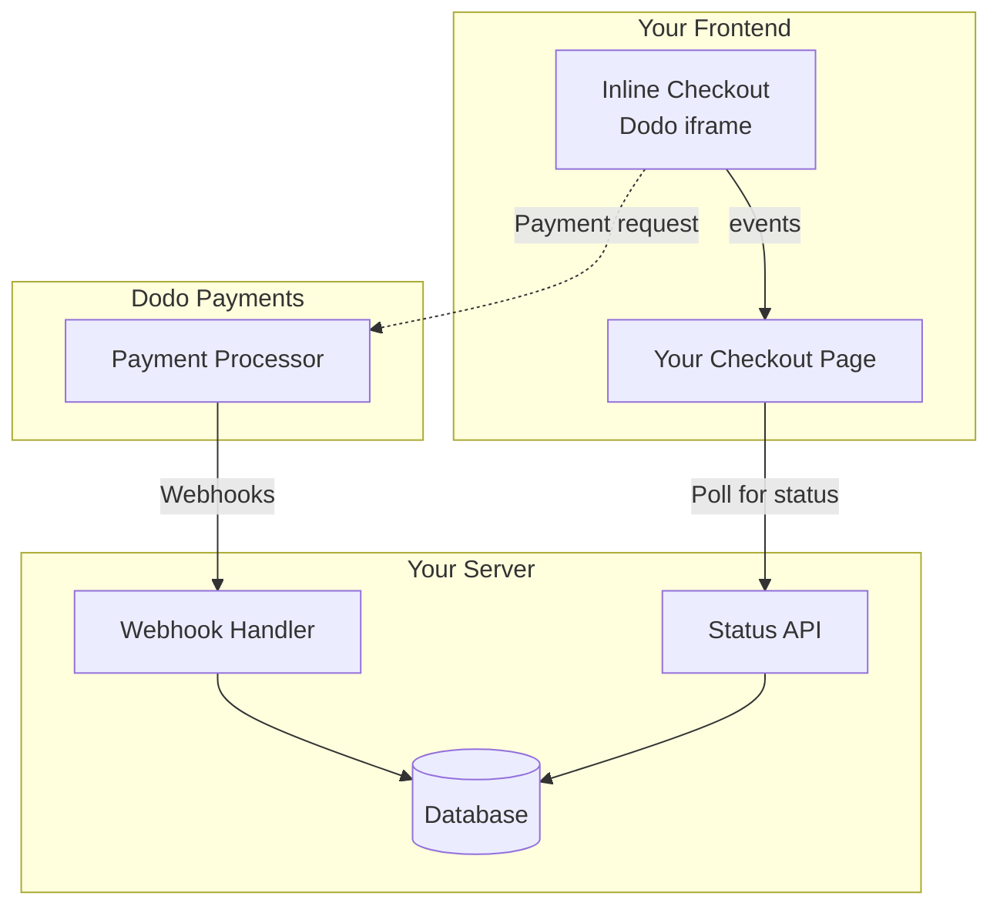

## अवलोकन

इनलाइन चेकआउट आपको पूरी तरह से एकीकृत चेकआउट अनुभव बनाने की अनुमति देता है जो आपकी वेबसाइट या एप्लिकेशन के साथ सहजता से मिश्रित होता है। [ओवरले चेकआउट](/developer-resources/overlay-checkout) के विपरीत, जो आपकी पृष्ठ पर एक मोडल के रूप में खुलता है, इनलाइन चेकआउट भुगतान फॉर्म को सीधे आपकी पृष्ठ लेआउट में एम्बेड करता है।

इनलाइन चेकआउट का उपयोग करके, आप:

- ऐसे चेकआउट अनुभव बनाएं जो आपके ऐप या वेबसाइट के साथ पूरी तरह से एकीकृत हों
- डोडो पेमेंट्स को सुरक्षित रूप से ग्राहक और भुगतान जानकारी एक अनुकूलित चेकआउट फ्रेम में कैप्चर करने दें
- अपनी पृष्ठ पर डोडो पेमेंट्स से आइटम, कुल और अन्य जानकारी प्रदर्शित करें
- उन्नत चेकआउट अनुभव बनाने के लिए SDK विधियों और घटनाओं का उपयोग करें

<Frame>
    
</Frame>

## यह कैसे काम करता है

इनलाइन चेकआउट आपकी वेबसाइट या ऐप में एक सुरक्षित डोडो पेमेंट्स फ्रेम को एम्बेड करके काम करता है।

चेकआउट फ्रेम ग्राहक जानकारी एकत्र करने और भुगतान विवरण कैप्चर करने का काम करता है। आपकी पृष्ठ पर आइटम सूची, कुल और चेकआउट पर जो कुछ है उसे बदलने के विकल्प प्रदर्शित होते हैं। SDK आपकी पृष्ठ और चेकआउट फ्रेम के बीच बातचीत करने की अनुमति देता है।

डोडो पेमेंट्स स्वचालित रूप से एक चेकआउट पूरा होने पर एक सदस्यता बनाता है, जिसे आप प्रावधान करने के लिए तैयार कर सकते हैं।

<Note>
इनलाइन चेकआउट फ्रेम सभी संवेदनशील भुगतान जानकारी को सुरक्षित रूप से संभालता है, आपके पक्ष पर अतिरिक्त प्रमाणपत्र के बिना PCI अनुपालन सुनिश्चित करता है।
</Note>

## एक अच्छा इनलाइन चेकआउट क्या बनाता है?

यह महत्वपूर्ण है कि ग्राहकों को पता हो कि वे किससे खरीद रहे हैं, वे क्या खरीद रहे हैं, और वे कितना भुगतान कर रहे हैं।

एक इनलाइन चेकआउट बनाने के लिए जो अनुपालन में हो और रूपांतरण के लिए अनुकूलित हो, आपकी कार्यान्वयन में शामिल होना चाहिए:

<Frame caption="Example inline checkout layout showing required elements">
    
</Frame>

1. **दोहराने की जानकारी**: यदि यह दोहराने वाला है, तो यह कितनी बार दोहराता है और नवीनीकरण पर कुल कितना भुगतान करना है। यदि यह एक परीक्षण है, तो परीक्षण कितने समय तक चलता है।
2. **आइटम विवरण**: जो खरीदा जा रहा है उसका विवरण।
3. **लेनदेन कुल**: लेनदेन कुल, जिसमें उप-योग, कुल कर, और समग्र कुल शामिल हैं। सुनिश्चित करें कि मुद्रा भी शामिल है।
4. **डोडो पेमेंट्स फ़ुटर**: पूरा इनलाइन चेकआउट फ्रेम, जिसमें चेकआउट फ़ुटर शामिल है जिसमें डोडो पेमेंट्स, हमारी बिक्री की शर्तें, और हमारी गोपनीयता नीति के बारे में जानकारी है।
5. **रिफंड नीति**: आपकी रिफंड नीति का एक लिंक, यदि यह डोडो पेमेंट्स की मानक रिफंड नीति से भिन्न है।

<Warning>
हमेशा पूरा इनलाइन चेकआउट फ़्रेम, फ़ूटर सहित, प्रदर्शित करें। कानूनी जानकारी को हटाना या छिपाना अनुपालन आवश्यकताओं का उल्लंघन करता है।
</Warning>

## ग्राहक यात्रा

चेकआउट प्रवाह आपकी चेकआउट सत्र कॉन्फ़िगरेशन द्वारा निर्धारित होता है। जिस तरह से आप चेकआउट सत्र को कॉन्फ़िगर करते हैं, उसके आधार पर, ग्राहक एक चेकआउट का अनुभव करेंगे जो एक ही पृष्ठ पर सभी जानकारी प्रस्तुत कर सकता है या कई चरणों में।

<Steps>
<Step title="Customer opens checkout">

आप आइटम या एक मौजूदा लेनदेन पास करके इनलाइन चेकआउट खोल सकते हैं। पृष्ठ पर जानकारी दिखाने और अपडेट करने के लिए SDK का उपयोग करें, और ग्राहक इंटरैक्शन के आधार पर आइटम अपडेट करने के लिए SDK विधियों का उपयोग करें।
    

</Step>

<Step title="Customer enters their details">

इनलाइन चेकआउट पहले ग्राहकों से उनके ईमेल पते, उनके देश का चयन करने, और (जहां आवश्यक हो) उनके ZIP या पोस्टल कोड दर्ज करने के लिए कहता है। यह चरण सभी आवश्यक जानकारी एकत्र करता है ताकि कर और उपलब्ध भुगतान विकल्पों का निर्धारण किया जा सके।

आप ग्राहक विवरण को पूर्व-भर सकते हैं और अनुभव को सरल बनाने के लिए सहेजे गए पते प्रस्तुत कर सकते हैं।

</Step>

<Step title="Customer selects payment method">

अपने विवरण दर्ज करने के बाद, ग्राहकों को उपलब्ध भुगतान विधियों और भुगतान फॉर्म के साथ प्रस्तुत किया जाता है। विकल्पों में क्रेडिट या डेबिट कार्ड, PayPal, Apple Pay, Google Pay, और उनके स्थान के आधार पर अन्य स्थानीय भुगतान विधियाँ शामिल हो सकती हैं।

यदि उपलब्ध हो तो चेकआउट को तेज़ करने के लिए सहेजे गए भुगतान विधियों को प्रदर्शित करें।


</Step>

<Step title="Checkout completed">

डोडो पेमेंट्स हर भुगतान को उस बिक्री के लिए सबसे अच्छे अधिग्रहणकर्ता के पास रूट करता है ताकि सफलता की सबसे अच्छी संभावना मिल सके। ग्राहक एक सफलता कार्यप्रवाह में प्रवेश करते हैं जिसे आप बना सकते हैं।


</Step>

<Step title="Dodo Payments creates subscription">

डोडो पेमेंट्स स्वचालित रूप से ग्राहक के लिए एक सदस्यता बनाता है, जिसे आप प्रावधान करने के लिए तैयार कर सकते हैं। ग्राहक द्वारा उपयोग की गई भुगतान विधि नवीनीकरण या सदस्यता परिवर्तनों के लिए फ़ाइल पर रखी जाती है।


</Step>
</Steps>

## त्वरित प्रारंभ

कुछ कोड की पंक्तियों में Dodo Payments इनलाइन चेकआउट के साथ शुरू करें:

```typescript
import { DodoPayments } from "dodopayments-checkout";

// Initialize the SDK for inline mode
DodoPayments.Initialize({
  mode: "test",
  displayType: "inline",
  onEvent: (event) => {
    console.log("Checkout event:", event);
  },
});

// Open checkout in a specific container
DodoPayments.Checkout.open({
  checkoutUrl: "https://test.dodopayments.com/session/cks_123",
  elementId: "dodo-inline-checkout" // ID of the container element
});
```

<Tip>
सुनिश्चित करें कि आपके पेज पर संबंधित `id` वाला एक container element मौजूद है: `<div id="dodo-inline-checkout"></div>`।
</Tip>

## चरण-दर-चरण एकीकरण गाइड

<Steps>
<Step title="Install the SDK">

Dodo Payments चेकआउट SDK स्थापित करें:

<CodeGroup>

```bash npm
npm install dodopayments-checkout
```

```bash yarn
yarn add dodopayments-checkout
```

```bash pnpm
pnpm add dodopayments-checkout
```

</CodeGroup>

</Step>

<Step title="Initialize the SDK for Inline Display">

SDK को इनिशियलाइज़ करें और `displayType: 'inline'` निर्दिष्ट करें। आपको `checkout.breakdown` इवेंट को भी सुनना चाहिए ताकि आप अपने UI को वास्तविक समय के कर और कुल गणनाओं के साथ अपडेट कर सकें।

```typescript
import { DodoPayments } from "dodopayments-checkout";

DodoPayments.Initialize({
  mode: "test",
  displayType: "inline",
  onEvent: (event) => {
    if (event.event_type === "checkout.breakdown") {
      const breakdown = event.data?.message;
      // Update your UI with breakdown.subTotal, breakdown.tax, breakdown.total, etc.
    }
  },
});
```

</Step>

<Step title="Create a Container Element">

अपने HTML में एक तत्व जोड़ें जहाँ चेकआउट फ्रेम इंजेक्ट किया जाएगा:

```html
<div id="dodo-inline-checkout"></div>
```

</Step>

<Step title="Open the Checkout">

अपने कंटेनर के `checkoutUrl` और `elementId` के साथ `DodoPayments.Checkout.open()` कॉल करें:

```typescript
DodoPayments.Checkout.open({
  checkoutUrl: "https://test.dodopayments.com/session/cks_123",
  elementId: "dodo-inline-checkout"
});
```

</Step>

<Step title="Test Your Integration">

1. अपने विकास सर्वर को प्रारंभ करें:

```bash
npm run dev
```

2. चेकआउट प्रवाह का परीक्षण करें:
   - इनलाइन फ्रेम में अपना ईमेल और पता विवरण दर्ज करें।
   - सत्यापित करें कि आपका कस्टम ऑर्डर सारांश वास्तविक समय में अपडेट होता है।
   - परीक्षण क्रेडेंशियल्स का उपयोग करके भुगतान प्रवाह का परीक्षण करें।
   - पुष्टि करें कि रीडायरेक्ट सही ढंग से काम करते हैं।

<Check>
यदि आपने `onEvent` कॉलबैक में एक कंसोल लॉग जोड़ा है, तो आपको ब्राउज़र कंसोल में `checkout.breakdown` इवेंट्स लॉग होते हुए दिखने चाहिए।
</Check>

</Step>

<Step title="Go Live">

जब आप उत्पादन के लिए तैयार हों:

1. मोड को `'live'` में बदलें:

```typescript
DodoPayments.Initialize({
  mode: "live",
  displayType: "inline",
  onEvent: (event) => {
    // Handle events
  }
});
```

2. अपने चेकआउट URLs को अपने बैकएंड से लाइव चेकआउट सत्रों का उपयोग करने के लिए अपडेट करें।
3. उत्पादन में पूरे प्रवाह का परीक्षण करें।

</Step>
</Steps>

## पूर्ण React उदाहरण

यह उदाहरण दिखाता है कि कैसे इनलाइन चेकआउट के साथ एक कस्टम ऑर्डर सारांश को लागू किया जाए, `checkout.breakdown` इवेंट का उपयोग करके उन्हें सिंक में रखा जाए।

```tsx
"use client";

import { useEffect, useState } from 'react';
import { DodoPayments, CheckoutBreakdownData } from 'dodopayments-checkout';

export default function CheckoutPage() {
  const [breakdown, setBreakdown] = useState<Partial<CheckoutBreakdownData>>({});

  useEffect(() => {
    // 1. Initialize the SDK
    DodoPayments.Initialize({
      mode: 'test',
      displayType: 'inline',
      onEvent: (event) => {
        // 2. Listen for the 'checkout.breakdown' event
        if (event.event_type === "checkout.breakdown") {
          const message = event.data?.message as CheckoutBreakdownData;
          if (message) setBreakdown(message);
        }
      }
    });

    // 3. Open the checkout in the specified container
    DodoPayments.Checkout.open({
      checkoutUrl: 'https://test.dodopayments.com/session/cks_123',
      elementId: 'dodo-inline-checkout'
    });

    return () => DodoPayments.Checkout.close();
  }, []);

  const format = (amt: number | null | undefined, curr: string | null | undefined) => 
    amt != null && curr ? `${curr} ${(amt/100).toFixed(2)}` : '0.00';

  const currency = breakdown.currency ?? breakdown.finalTotalCurrency ?? '';

  return (
    <div className="flex flex-col md:flex-row min-h-screen">
      {/* Left Side - Checkout Form */}
      <div className="w-full md:w-1/2 flex items-center">
        <div id="dodo-inline-checkout" className='w-full' />
      </div>

      {/* Right Side - Custom Order Summary */}
      <div className="w-full md:w-1/2 p-8 bg-gray-50">
        <h2 className="text-2xl font-bold mb-4">Order Summary</h2>
        <div className="space-y-2">
          {breakdown.subTotal && (
            <div className="flex justify-between">
              <span>Subtotal</span>
              <span>{format(breakdown.subTotal, currency)}</span>
            </div>
          )}
          {breakdown.discount && (
            <div className="flex justify-between">
              <span>Discount</span>
              <span>{format(breakdown.discount, currency)}</span>
            </div>
          )}
          {breakdown.tax != null && (
            <div className="flex justify-between">
              <span>Tax</span>
              <span>{format(breakdown.tax, currency)}</span>
            </div>
          )}
          <hr />
          {(breakdown.finalTotal ?? breakdown.total) && (
            <div className="flex justify-between font-bold text-xl">
              <span>Total</span>
              <span>{format(breakdown.finalTotal ?? breakdown.total, breakdown.finalTotalCurrency ?? currency)}</span>
            </div>
          )}
        </div>
      </div>
    </div>
  );
}

```

## API संदर्भ

### कॉन्फ़िगरेशन

#### प्रारंभिक विकल्प

```typescript
interface InitializeOptions {
  mode: "test" | "live";
  displayType: "inline"; // Required for inline checkout
  onEvent: (event: CheckoutEvent) => void;
}
```

| विकल्प | प्रकार | आवश्यक | विवरण |
|--------|------|----------|-------------|
| `mode` | `"test" \| "live"` | Yes | Environment mode. |
| `displayType` | `"inline" \| "overlay"` | Yes | Must be set to `"inline"` to embed the checkout. |
| `onEvent` | `function` | Yes | Callback function for handling checkout events. |

#### चेकआउट विकल्प

```typescript
export type FontSize = "xs" | "sm" | "md" | "lg" | "xl" | "2xl";
export type FontWeight = "normal" | "medium" | "bold" | "extraBold";

interface CheckoutOptions {
  checkoutUrl: string;
  elementId: string; // Required for inline checkout
  options?: {
    showTimer?: boolean;
    showSecurityBadge?: boolean;
    manualRedirect?: boolean;
    payButtonText?: string;
    fontSize?: FontSize;
    fontWeight?: FontWeight;
  };
}
```

| विकल्प | प्रकार | आवश्यक | विवरण |
|--------|------|----------|-------------|
| `checkoutUrl` | `string` | हाँ | चेकआउट सेशन URL। |
| `elementId` | `string` | हाँ | उस DOM एलिमेंट का `id` जहां चेकआउट रेंडर किया जाना चाहिए। |
| `options.showTimer` | `boolean` | नहीं | चेकआउट टाइमर को दिखाएँ या छिपाएँ। डिफ़ॉल्ट `true` है। जब अक्षम हो, तो SESSION समाप्त होने पर `checkout.link_expired` इवेंट प्राप्त होगा। |
| `options.showSecurityBadge` | `boolean` | नहीं | सुरक्षा बैज को दिखाएँ या छिपाएँ। डिफ़ॉल्ट `true` है। |
| `options.manualRedirect` | `boolean` | नहीं | सक्षम होने पर, चेकआउट पूरा होने के बाद स्वचालित रूप से रीडायरेक्ट नहीं करेगा। इसके बजाय, आप स्वयं रीडायरेक्ट संभालने के लिए `checkout.status` और `checkout.redirect_requested` इवेंट्स प्राप्त करेंगे। |
| `options.payButtonText` | `string` | नहीं | पे बटन पर दिखाने के लिए कस्टम टेक्स्ट। |
| `options.fontSize` | `FontSize` | नहीं | चेकआउट के लिए ग्लोबल फॉन्ट साइज। |
| `options.fontWeight` | `FontWeight` | नहीं | चेकआउट के लिए ग्लोबल फॉन्ट वेट। |

### विधियाँ

#### चेकआउट खोलें

निर्दिष्ट कंटेनर में चेकआउट फ्रेम खोलता है।

```typescript
DodoPayments.Checkout.open({
  checkoutUrl: "https://test.dodopayments.com/session/cks_123",
  elementId: "dodo-inline-checkout"
});
```

आप चेकआउट व्यवहार को अनुकूलित करने के लिए अतिरिक्त विकल्प भी पास कर सकते हैं:

```typescript
DodoPayments.Checkout.open({
  checkoutUrl: "https://test.dodopayments.com/session/cks_123",
  elementId: "dodo-inline-checkout",
  options: {
    showTimer: false,
    showSecurityBadge: false,
    manualRedirect: true,
    payButtonText: "Pay Now",
  },
});
```

`manualRedirect` का उपयोग करते समय, अपने `onEvent` कॉलबैक में चेकआउट पूर्णता को संभालें:

```typescript
DodoPayments.Initialize({
  mode: "test",
  displayType: "inline",
  onEvent: (event) => {
    if (event.event_type === "checkout.status") {
      const status = event.data?.message?.status;
      // Handle status: "succeeded", "failed", or "processing"
    }
    if (event.event_type === "checkout.redirect_requested") {
      const redirectUrl = event.data?.message?.redirect_to;
      // Redirect the customer manually
      window.location.href = redirectUrl;
    }
    if (event.event_type === "checkout.link_expired") {
      // Handle expired checkout session
    }
  },
});
```

#### चेकआउट बंद करें

प्रोग्रामेटिक रूप से चेकआउट फ्रेम को हटा देता है और इवेंट लिस्नर्स को साफ करता है।

```typescript
DodoPayments.Checkout.close();
```

#### स्थिति की जांच करें

यह लौटाता है कि चेकआउट फ्रेम वर्तमान में इंजेक्ट किया गया है या नहीं।

```typescript
const isOpen = DodoPayments.Checkout.isOpen();
// Returns: boolean
```

### घटनाएँ

SDK `onEvent` कॉलबैक के माध्यम से वास्तविक समय की घटनाएँ प्रदान करता है। इनलाइन चेकआउट के लिए, `checkout.breakdown` आपका UI सिंक करने में विशेष रूप से उपयोगी है।

| घटना प्रकार | विवरण |
|------------|-------------|
| `checkout.opened` | चेकआउट फ़्रेम लोड हो चुका है। |
| `checkout.form_ready` | चेकआउट फ़ॉर्म उपयोगकर्ता इनपुट लेने के लिए तैयार है। लोडिंग स्टेट्स छिपाने और चेकआउट UI दिखाने के लिए उपयोगी। |
| `checkout.breakdown` | जब कीमतें, कर या छूट अपडेट होती हैं तो ट्रिगर होता है। |
| `checkout.customer_details_submitted` | ग्राहक विवरण सबमिट हो चुके हैं। |
| `checkout.pay_button_clicked` | जब ग्राहक पे बटन पर क्लिक करता है तो ट्रिगर होता है। एनालिटिक्स और कन्वर्शन फ़नलों की ट्रैकिंग के लिए उपयोगी। |
| `checkout.redirect` | चेकआउट रीडायरेक्ट करेगा (जैसे बैंक पेज पर)। |
| `checkout.error` | चेकआउट के दौरान त्रुटि हुई। |
| `checkout.link_expired` | जब चेकआउट सत्र समाप्त हो जाता है तब ट्रिगर होता है। केवल तब प्राप्त होता है जब `showTimer` `false` पर सेट हो। |
| `checkout.status` | जब `manualRedirect` सक्षम होता है तो ट्रिगर होता है। इसमें चेकआउट स्थिति (`succeeded`, `failed`, या `processing`) शामिल होती है। |
| `checkout.redirect_requested` | जब `manualRedirect` सक्षम होता है तो ट्रिगर होता है। इसमें ग्राहक को रीडायरेक्ट करने के लिए URL शामिल होता है। |

#### चेकआउट ब्रेकडाउन डेटा

`checkout.breakdown` इवेंट निम्न डेटा प्रदान करता है:

```typescript
interface CheckoutBreakdownData {
  subTotal?: number;          // Amount in cents
  discount?: number;         // Amount in cents
  tax?: number;              // Amount in cents
  total?: number;            // Amount in cents
  currency?: string;         // e.g., "USD"
  finalTotal?: number;       // Final amount including adjustments
  finalTotalCurrency?: string; // Currency for the final total
}
```

#### चेकआउट स्थिति घटना डेटा

जब `manualRedirect` सक्षम होता है, तो आपको निम्न डेटा के साथ `checkout.status` इवेंट प्राप्त होता है:

```typescript
interface CheckoutStatusEventData {
  message: {
    status?: "succeeded" | "failed" | "processing";
  };
}
```

#### चेकआउट पुनर्निर्देशन अनुरोध की गई घटना डेटा

जब `manualRedirect` सक्षम होता है, तो आपको निम्न डेटा के साथ `checkout.redirect_requested` इवेंट प्राप्त होता है:

```typescript
interface CheckoutRedirectRequestedEventData {
  message: {
    redirect_to?: string;
  };
}
```

#### ब्रेकडाउन घटना को समझना

`checkout.breakdown` इवेंट आपके एप्लिकेशन के UI को Dodo Payments चेकआउट स्थिति के साथ सिंक में रखने का प्राथमिक तरीका है।

**जब यह फायर होता है:**
- **प्रारंभ में**: चेकआउट फ्रेम लोड होने और तैयार होने के तुरंत बाद।
- **पता परिवर्तन पर**: जब भी ग्राहक एक देश का चयन करता है या एक पोस्टल कोड दर्ज करता है जो कर पुनर्गणना का परिणाम देता है।

**फील्ड विवरण:**

| फील्ड | विवरण |
|-------|-------------|
| `subTotal` | सत्र में सभी लाइन आइटम्स का योग, किसी भी छूट या कर लागू होने से पहले। |
| `discount` | लागू की गई सभी छूटों का कुल मूल्य। |
| `tax` | गणना किया गया कर राशि। `inline` मोड में, जैसे-जैसे उपयोगकर्ता पता फ़ील्ड के साथ इंटरैक्ट करता है यह गतिशील रूप से अपडेट होता है। |
| `total` | सत्र की बेस करेंसी में `subTotal - discount + tax` का गणितीय परिणाम। |
| `currency` | ISO मुद्रा कोड (उदा., `"USD"`) मानक सबटोटल, छूट, और कर मानों के लिए। |
| `finalTotal` | वास्तविक राशि जो ग्राहक से चार्ज की जाती है। इसमें अतिरिक्त विदेशी विनिमय समायोजन या स्थानीय भुगतान विधि शुल्क शामिल हो सकते हैं जो मूल मूल्य ब्रेकडाउन का हिस्सा नहीं होते। |
| `finalTotalCurrency` | वह मुद्रा जिसमें ग्राहक वास्तव में भुगतान कर रहा है। यदि क्रय शक्ति समता या स्थानीय मुद्रा रूपांतरण सक्रिय है, तो यह `currency` से अलग हो सकती है। |

**मुख्य एकीकरण टिप्स:**

1.  **Currency Formatting**: Prices are always returned as integers in the smallest currency unit (e.g., cents for USD, yen for JPY). To display them, divide by 100 (or the appropriate power of 10) or use a formatting library like `Intl.NumberFormat`.
2.  **Handling Initial States**: When the checkout first loads, `tax` and `discount` may be `0` or `null` until the user provides their billing information or applies a code. Your UI should handle these states gracefully (e.g., showing a dash `—` or hiding the row).
3.  **The "Final Total" vs "Total"**: While `total` gives you the standard price calculation, `finalTotal` is the source of truth for the transaction. If `finalTotal` is present, it reflects exactly what will be charged to the customer's card, including any dynamic adjustments.
4.  **Real-time Feedback**: Use the `tax` field to show users that taxes are being calculated in real-time. This provides a "live" feel to your checkout page and reduces friction during the address entry step.

## कार्यान्वयन विकल्प

### पैकेज प्रबंधक स्थापना

npm, yarn, या pnpm के माध्यम से स्थापना करें जैसा कि [चरण-दर-चरण एकीकरण गाइड](#step-by-step-integration-guide) में दिखाया गया है।

### CDN कार्यान्वयन

बिना किसी निर्माण चरण के त्वरित एकीकरण के लिए, आप हमारे CDN का उपयोग कर सकते हैं:

```html
<!DOCTYPE html>
<html lang="en">
<head>
    <meta charset="UTF-8">
    <meta name="viewport" content="width=device-width, initial-scale=1.0">
    <title>Dodo Payments Inline Checkout</title>
    
    <!-- Load DodoPayments -->
    <script src="https://cdn.jsdelivr.net/npm/dodopayments-checkout@latest/dist/index.js"></script>
    <script>
        // Initialize the SDK
        DodoPaymentsCheckout.DodoPayments.Initialize({
            mode: "test",
            displayType: "inline",
            onEvent: (event) => {
                console.log('Checkout event:', event);
            }
        });
    </script>
</head>
<body>
    <div id="dodo-inline-checkout"></div>

    <script>
        // Open the checkout
        DodoPaymentsCheckout.DodoPayments.Checkout.open({
            checkoutUrl: "https://test.dodopayments.com/session/cks_123",
            elementId: "dodo-inline-checkout"
        });
    </script>
</body>
</html>
```

## भुगतान विधि अपडेट करें

इनलाइन चेकआउट सबस्क्रिप्शन के लिए **भुगतान विधि अपडेट** का समर्थन करता है। जब किसी ग्राहक को अपनी भुगतान विधि अपडेट करनी हो — चाहे वह सक्रिय सबस्क्रिप्शन के लिए हो या ऑन-होल्ड सबस्क्रिप्शन को पुनः सक्रिय करने के लिए — आप अपडेट फ्लो को सीधे अपने पेज लेआउट में रेंडर कर सकते हैं।

### यह कैसे काम करता है

1. [Update Payment Method API](/features/subscription#update-payment-method-for-active-subscription) को कॉल करें ताकि आप `payment_link` प्राप्त कर सकें:

```typescript
const response = await client.subscriptions.updatePaymentMethod('sub_123', {
  type: 'new',
  return_url: 'https://example.com/return'
});
```

2. लौटाए गए `payment_link` को `checkoutUrl` के रूप में पास करें ताकि इनलाइन चेकआउट खुल जाए:

```typescript
DodoPayments.Checkout.open({
  checkoutUrl: response.payment_link,
  elementId: "dodo-inline-checkout"
});
```

इनलाइन फ्रेम केवल भुगतान विधि संग्रह फॉर्म रेंडर करता है। ग्राहक नई कार्ड विवरण दर्ज कर सकते हैं या बिना आपका पेज छोड़े एक सहेजी गई भुगतान विधि चुन सकते हैं।

### ऑन-होल्ड सबस्क्रिप्शनों के लिए

जब `on_hold` स्थिति में किसी सबस्क्रिप्शन के लिए भुगतान विधि अपडेट की जाती है, तो Dodo Payments स्वचालित रूप से किसी भी शेष बकाया के लिए चार्ज बनाता है। पुनक्रियान्वयन की पुष्टि के लिए `payment.succeeded` और `subscription.active` वेबहुक्स की निगरानी करें।

```typescript
const response = await client.subscriptions.updatePaymentMethod('sub_123', {
  type: 'new',
  return_url: 'https://example.com/return'
});

if (response.payment_id) {
  // Charge created for remaining dues
  // Open inline checkout for payment collection
  DodoPayments.Checkout.open({
    checkoutUrl: response.payment_link,
    elementId: "dodo-inline-checkout"
  });
}
```

<Tip>
नए विवरण एकत्र करने के बजाय मौजूदा सहेजी गई भुगतान विधि का उपयोग भी कर सकते हैं, Update Payment Method API को `type: 'existing'` के साथ `payment_method_id` पास करके।
</Tip>

## त्रुटि प्रबंधन

SDK इवेंट सिस्टम के माध्यम से विस्तृत त्रुटि जानकारी प्रदान करता है। अपने `onEvent` कॉलबैक में हमेशा उचित त्रुटि प्रबंधन लागू करें:

```typescript
DodoPayments.Initialize({
  mode: "test",
  displayType: "inline",
  onEvent: (event: CheckoutEvent) => {
    if (event.event_type === "checkout.error") {
      console.error("Checkout error:", event.data?.message);
      // Handle error appropriately
    }
  }
});
```

<Warning>
जब समस्याएँ उत्पन्न हों तो अच्छा उपयोगकर्ता अनुभव देने के लिए हमेशा `checkout.error` इवेंट को संभालें।
</Warning>

## सर्वोत्तम अभ्यास

1. **रिस्पॉन्सिव डिज़ाइन**: सुनिश्चित करें कि आपके कंटेनर एलिमेंट की चौड़ाई और ऊँचाई पर्याप्त हो। iframe आमतौर पर अपने कंटेनर को भरने के लिए फैलता है।
2. **सिंक**: `checkout.breakdown` इवेंट का उपयोग करके अपने कस्टम ऑर्डर सारांश या प्राइसिंग टेबल को चेकआउट फ्रेम में दिख रही चीज़ों के साथ सिंक में रखें।
3. **स्केलेटन स्टेट्स**: `checkout.opened` इवेंट फायर होने तक अपने कंटेनर में लोडिंग संकेत दिखाएँ।
4. **क्लीनअप**: अपने कंपोनेंट के अनमाउंट होने पर `DodoPayments.Checkout.close()` कॉल करें ताकि iframe और इवेंट लिसनर्स साफ़ हो जाएँ।

<Info>
डार्क मोड कार्यान्वयन के लिए, इनलाइन चेकआउट फ्रेम के साथ बेहतर दृश्य एकीकरण के लिए पृष्ठभूमि रंग के रूप में `#0d0d0d` का उपयोग करने की सिफारिश की जाती है।
</Info>

## भुगतान स्थिति सत्यापन

<Warning>
सिर्फ इनलाइन चेकआउट इवेंट्स पर भरोसा न करें कि भुगतान सफल हुआ या विफल। हमेशा वेबहुक्स और/या पोलिंग का उपयोग करके सर्वर-साइड सत्यापन लागू करें।
</Warning>

### सर्वर-साइड सत्यापन क्यों आवश्यक है

`checkout.status` जैसी इनलाइन चेकआउट इवेंट्स वास्तविक समय प्रतिक्रिया देती हैं, फिर भी वे भुगतान स्थिति के लिए आपका एकमात्र सत्यता स्रोत नहीं होनी चाहिए। नेटवर्क समस्याएँ, ब्राउज़र क्रैश या उपयोगकर्ता पेज बंद करने से इवेंट्स छूट सकती हैं। विश्वसनीय भुगतान सत्यापन सुनिश्चित करने के लिए:

1. **आपका सर्वर वेबहुक इवेंट्स सुनना चाहिए** - Dodo Payments भुगतान स्थिति परिवर्तनों के लिए वेबहुक्स भेजता है
2. **एक पोलिंग मैकेनिज़्म लागू करें** - आपका फ्रंटएंड स्थिति अपडेट्स के लिए आपके सर्वर को पोल करे
3. **दोनों तरीकों को मिलाएं** - वेबहुक्स को प्राथमिक स्रोत के रूप में उपयोग करें और पोलिंग को बैकअप के रूप में

### अनुशंसित संरचना



### कार्यान्वयन चरण

**1. चेकआउट इवेंट्स सुनें** - जब उपयोगकर्ता पे पर क्लिक करे, तो स्थिति की पुष्टि की तैयारी शुरू करें:

```typescript
onEvent: (event) => {
  if (event.event_type === 'checkout.status') {
    // Start polling your server for confirmed status
    startPolling();
  }
}
```

**2. अपने सर्वर को पोल करें** - एक एंडपॉइंट बनाएं जो आपके डेटाबेस में भुगतान स्थिति (जो वेबहुक्स द्वारा अपडेट होती है) जांचे:


```typescript
// Poll every 2 seconds until status is confirmed
const interval = setInterval(async () => {
  const { status } = await fetch(`/api/payments/${paymentId}/status`).then(r => r.json());
  if (status === 'succeeded' || status === 'failed') {
    clearInterval(interval);
    handlePaymentResult(status);
  }
}, 2000);
```

**3. सर्वर-साइड वेबहुक्स संभालें** - जब Dodo `payment.succeeded` या `payment.failed` वेबहुक्स भेजे, तो अपने डेटाबेस को अपडेट करें। विस्तृत जानकारी के लिए हमारी [Webhooks documentation](/developer-resources/webhooks) देखें।

### रीडायरेक्ट्स संभालना (3DS, Google Pay, UPI)

जब `manualRedirect: true` का उपयोग कर रहे हों, तो कुछ भुगतान विधियों को प्रमाणीकरण के लिए उपयोगकर्ता को आपके पेज से दूर रीडायरेक्ट करने की आवश्यकता होती है:

- **3D Secure (3DS)** - कार्ड प्रमाणीकरण
- **Google Pay** - कुछ फ्लो में वॉलेट प्रमाणीकरण
- **UPI** - भारतीय भुगतान विधि रीडायरेक्ट्स

जब रीडायरेक्ट आवश्यक हो, तो आपको `checkout.redirect_requested` इवेंट प्राप्त होगा। दिए गए URL पर उपयोगकर्ता को रीडायरेक्ट करें:

```typescript
if (event.event_type === 'checkout.redirect_requested') {
  const redirectUrl = event.data?.message?.redirect_to;
  // Save payment ID before redirect, then redirect
  sessionStorage.setItem('pendingPaymentId', paymentId);
  window.location.href = redirectUrl;
}
```

प्रमाणीकरण पूरा होने के बाद (सफलता या विफलता), उपयोगकर्ता आपके पेज पर वापस आता है। **केवल इस आधार पर सफलता मानने से बचें कि उपयोगकर्ता वापस आ गया।** इसके बजाय:

1. जांचें कि क्या उपयोगकर्ता किसी रीडायरेक्ट से लौट रहा है (उदा. `sessionStorage` के माध्यम से)
2. पुष्टि किए गए भुगतान स्थिति के लिए अपने सर्वर को पोल करना शुरू करें
3. पोलिंग के दौरान “भुगतान की पुष्टि कर रहे हैं...” स्थिति दिखाएँ
4. सर्वर-पुष्टि की गई स्थिति के आधार पर सफलता/विफलता UI दिखाएँ

<Tip>
रीडायरेक्ट्स के बाद हमेशा सर्वर-साइड पर भुगतान स्थिति सत्यापित करें। उपयोगकर्ता का अपने पेज पर लौटना केवल प्रमाणीकरण पूरा होने का संकेत देता है — यह भुगतान की सफलता या विफलता नहीं दर्शाता।
</Tip>

## समस्या निवारण

<AccordionGroup>
<Accordion title="Checkout frame is not appearing">
- सत्यापित करें कि `elementId` उस `id` से मेल खाता है जो DOM में वास्तव में मौजूद `div` से संबंधित है।
- सुनिश्चित करें कि `displayType: 'inline'` `Initialize` को पास किया गया था।
- चेक करें कि `checkoutUrl` मान्य है।
</Accordion>

<Accordion title="Taxes are not updating in my UI">
- सुनिश्चित करें कि आप `checkout.breakdown` इवेंट सुन रहे हैं।
- कर केवल तभी गणना किए जाते हैं जब उपयोगकर्ता चेकआउट फ्रेम में एक मान्य देश और पोस्टल कोड दर्ज करे।
</Accordion>
</AccordionGroup>

## डिजिटल वॉलेट सक्षम करना

Apple Pay, Google Pay और अन्य डिजिटल वॉलेट्स सेटअप के बारे में विस्तृत जानकारी के लिए <a href="/features/payment-methods/digital-wallets">Digital Wallets</a> पेज देखें।

### Apple Pay के लिए त्वरित सेटअप

<Steps>
<Step title="Download domain association file">
[Apple Pay domain association file](http://checkout.dodopayments.com/.well-known/apple-developer-merchantid-domain-association) डाउनलोड करें।
</Step>

<Step title="Request activation">
अपने प्रोडक्शन डोमेन URL के साथ **support@dodopayments.com** को ईमेल करें और Apple Pay सक्रियण का अनुरोध करें।
</Step>

<Step title="Test after confirmation">
एक बार पुष्टि हो जाए, तो सुनिश्चित करें कि चेकआउट में Apple Pay दिखाई दे रहा है और संपूर्ण फ्लो का परीक्षण करें।
</Step>
</Steps>

<Warning>
Apple Pay को प्रोडक्शन में दिखने से पहले डोमेन सत्यापन की आवश्यकता होती है। यदि आप Apple Pay ऑफ़र करने की योजना बना रहे हैं, तो लाइव होने से पहले सपोर्ट से संपर्क करें।
</Warning>

## ब्राउज़र समर्थन

Dodo Payments Checkout SDK निम्न ब्राउज़रों का समर्थन करता है:

- Chrome (latest)
- Firefox (latest)
- Safari (latest)
- Edge (latest)
- IE11+

## इनलाइन बनाम ओवरले चेकआउट

अपने उपयोग के मामले के लिए सही चेकआउट प्रकार चुनें:

| विशेषता | इनलाइन चेकआउट | ओवरले चेकआउट |
|---------|-----------------|------------------|
| एकीकरण की गहराई | पेज में पूरी तरह एम्बेडेड | पेज के ऊपर मोडल |
| लेआउट नियंत्रण | पूरा नियंत्रण | सीमित |
| ब्रांडिंग | सहज | पेज से अलग |
| कार्यान्वयन प्रयास | अधिक | कम |
| सर्वश्रेष्ठ के लिए | कस्टम चेकआउट पेज, उच्च कन्वर्ज़न फ्लो | त्वरित एकीकरण, मौजूदा पेज |


<Tip>
जब आप चेकआउट अनुभव पर अधिकतम नियंत्रण और सहज ब्रांडिंग चाहते हों तो **इनलाइन चेकआउट** का उपयोग करें। तेज़ एकीकरण और मौजूदा पेज में न्यूनतम बदलाव के लिए **ओवरले चेकआउट** का उपयोग करें।
</Tip>

## संबंधित संसाधन

<CardGroup cols={2}>
<Card title="Overlay Checkout" icon="layer-group" href="/developer-resources/overlay-checkout">
    त्वरित मॉडलकृत एकीकरण के लिए ओवरले चेकआउट का उपयोग करें।
</Card>

<Card title="Checkout Sessions API" icon="code" href="/api-reference/checkout-sessions/create">
    अपने चेकआउट अनुभवों को चलाने के लिए चेकआउट सेशन बनाएं।
</Card>

<Card title="Webhooks" icon="webhook" href="/developer-resources/webhooks">
    वेबहुक्स के साथ सर्वर-साइड पर भुगतान इवेंट्स संभालें।
</Card>

<Card title="Integration Guide" icon="book" href="/developer-resources/integration-guide">
    Dodo Payments को एकीकृत करने के लिए पूर्ण मार्गदर्शिका।
</Card>
</CardGroup>

अधिक सहायता के लिए, हमारी [Discord community](https://discord.gg/bYqAp4ayYh) पर जाएँ या हमारे डेवलपर सपोर्ट टीम से संपर्क करें।
