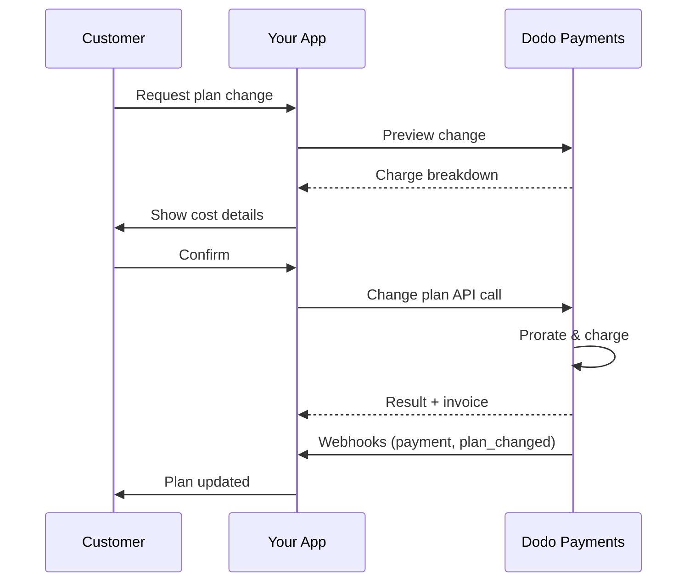
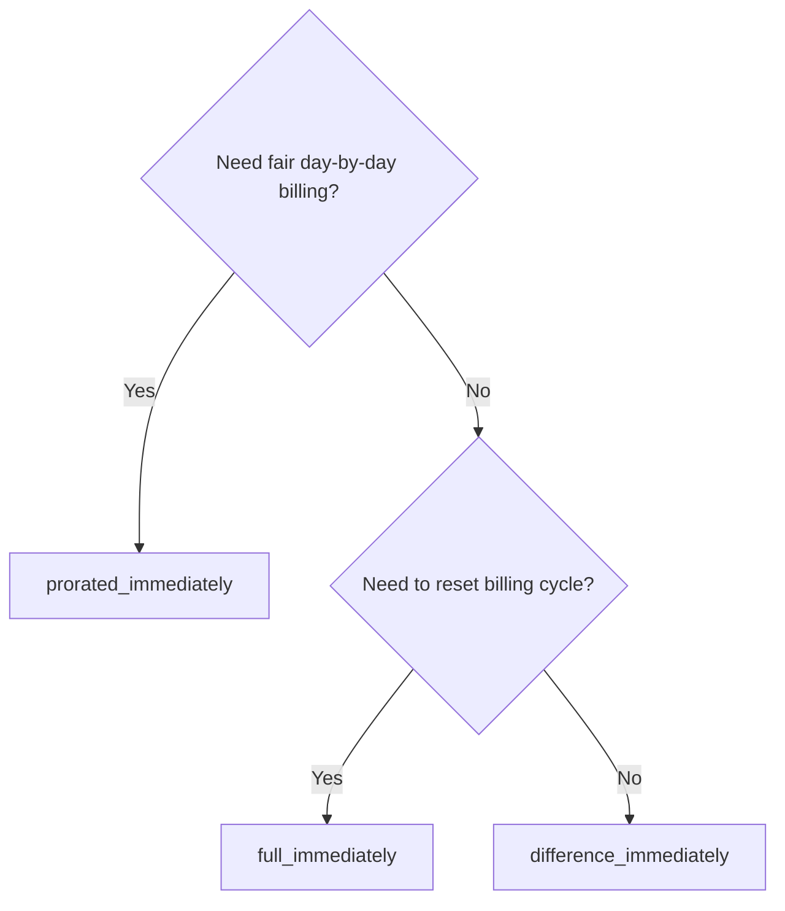
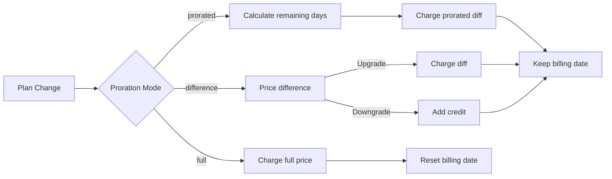

{/* LOCKED_PATTERN_6d744560e4135463c359b094ae69cd5f */}
{/* LOCKED_PATTERN_e019618386b2aca726eb1801e3e74076 */}
  सदस्यताओं को अपडेट करने के लिए पूर्ण API दस्तावेज़।
</Card>
{/* LOCKED_PATTERN_1e8b2499d330dcc44e5e284a3600fd11 */}
  योजना बदलने से पहले शुल्क राशियाँ देखें।
</Card>
{/* LOCKED_PATTERN_782a37ccd4cc5a4159c5497e7f1d4c54 */}
  सब्सक्रिप्शन सेटअप चरणबद्ध रूप से।
</Card>
</CardGroup>

## सदस्यता उन्नयन या डाउनग्रेड क्या है?

योजनाएँ बदलने से आप ग्राहक को सदस्यता स्तरों या मात्राओं के बीच स्थानांतरित कर सकते हैं। इसका उपयोग करें:
- उपयोग या सुविधाओं के अनुरूप मूल्य निर्धारण को संरेखित करें
- मासिक से वार्षिक (या इसके विपरीत) में स्थानांतरित करें
- सीट-आधारित उत्पादों के लिए मात्रा समायोजित करें

<Info>
आपके चयनित प्रोराटा मोड के आधार पर योजना परिवर्तन तत्क्षण शुल्क उत्पन्न कर सकते हैं।
</Info>

## योजना परिवर्तनों का उपयोग कब करें

- जब ग्राहक को अधिक सुविधाएँ, उपयोग या सीट्स की आवश्यकता हो तो अपग्रेड करें
- जब उपयोग घटे तो डाउनग्रेड करें
- बिना सदस्यता रद्द किए उपयोगकर्ताओं को नए उत्पाद या मूल्य पर माइग्रेट करें

## योजना परिवर्तन प्रवाह



## पूर्वापेक्षाएँ

सदस्यता योजना परिवर्तनों को लागू करने से पहले, सुनिश्चित करें कि आपके पास है:

- सक्रिय सदस्यता उत्पादों के साथ एक डोडो पेमेंट्स व्यापारी खाता
- डैशबोर्ड से API क्रेडेंशियल (API कुंजी और वेबहुक गुप्त कुंजी)
- संशोधित करने के लिए एक मौजूदा सक्रिय सदस्यता
- सदस्यता घटनाओं को संभालने के लिए वेबहुक एंडपॉइंट कॉन्फ़िगर किया गया है

<Info>
विस्तृत सेटअप निर्देशों के लिए, हमारे [एकीकरण मार्गदर्शिका](/developer-resources/integration-guide#dashboard-setup) को देखें।
</Info>

## चरण-दर-चरण कार्यान्वयन गाइड

अपने एप्लिकेशन में सदस्यता योजना परिवर्तनों को लागू करने के लिए इस व्यापक गाइड का पालन करें:

<Steps>
{/* LOCKED_PATTERN_b0d6d45bb453480975a9fb2d18d04caf */}
लागू करने से पहले, निर्धारित करें:
- कौन से सदस्यता उत्पाद किन अन्य उत्पादों में बदले जा सकते हैं
- आपका व्यवसाय मॉडल किस प्रोराटा मोड से अनुकूल है
- विफल योजना परिवर्तनों को सुंदर ढंग से कैसे संभालें
- राज्य प्रबंधन के लिए किन वेबहुक घटनाओं को ट्रैक करना है

<Tip>
उत्पादन में लागू करने से पहले परीक्षण मोड में योजना परिवर्तनों का पूरी तरह परीक्षण करें।
</Tip>
</Step>

{/* LOCKED_PATTERN_44f780199a4b76d6c063b33d8f599e9a */}
अपने व्यवसाय की ज़रूरतों के अनुरूप बिलिंग दृष्टिकोण चुनें:

<Tabs>
<Tab title="prorated_immediately">
सर्वश्रेष्ठ के लिए: SaaS अनुप्रयोग जो अप्रयुक्त समय के लिए उचित शुल्क लेना चाहते हैं
- शेष चक्र समय के आधार पर सटीक प्रोराटेड राशि की गणना करता है
- चक्र में शेष अप्रयुक्त समय के आधार पर प्रोराटेड राशि वसूलता है
- ग्राहकों को पारदर्शी बिलिंग प्रदान करता है
</Tab>

<Tab title="difference_immediately">
सर्वश्रेष्ठ के लिए: स्पष्ट अपग्रेड/डाउनग्रेड परिदृश्य
- अपग्रेड: तत्काल अंतर वसूलें (उदा., $30→$80 = $50 वसूलें)
- डाउनग्रेड: भविष्य के नवीनीकरण के लिए शेष मूल्य को क्रेडिट करें
- बिलिंग लॉजिक और ग्राहक संचार को सरल बनाता है
</Tab>

<Tab title="full_immediately">
सर्वश्रेष्ठ के लिए: जब आप बिलिंग चक्र रीसेट करना चाहते हैं
- नए योजना की पूरी राशि तुरंत वसूलता है
- पुराने योजना के शेष समय की अनदेखी करता है
- वार्षिक से मासिक संक्रमण के लिए उपयोगी है
</Tab>
</Tabs>
</Step>

{/* LOCKED_PATTERN_62685552c5becb87cfeddbb400a3e69b */}
सदस्यता विवरण संशोधित करने के लिए Change Plan API का उपयोग करें:

<ParamField path="subscription_id" type="string" required>
संशोधित करने के लिए सक्रिय सदस्यता की ID।
</ParamField>

<ParamField path="product_id" type="string" required>
जिस उत्पाद में सदस्यता बदलनी है उसका नया उत्पाद ID।
</ParamField>

<ParamField path="quantity" type="integer" default="1">
नए योजना के लिए इकाइयों की संख्या (सीट-आधारित उत्पादों के लिए)।
</ParamField>

<ParamField path="proration_billing_mode" type="string" required>
तत्काल बिलिंग को कैसे संभालें: `prorated_immediately`, `full_immediately`, या `difference_immediately`।
</ParamField>

<ParamField path="addons" type="array">
नए योजना के लिए वैकल्पिक ऐडऑन। इसे खाली छोड़ने पर किसी भी मौजूदा ऐडऑन को हटाया जाता है।
</ParamField>

{/* LOCKED_PATTERN_dbe6ce0c854d65ccfe8e10a6cd58e3a8 */}
जब योजना परिवर्तन भुगतान विफल होता है तो व्यवहार को नियंत्रित करता है:
- `prevent_change`: भुगतान सफल होने तक सदस्यता को वर्तमान योजना पर रखें
- `apply_change` (डिफ़ॉल्ट): भुगतान के परिणाम की परवाह किए बिना योजना परिवर्तन तुरंत लागू करें
यदि निर्दिष्ट नहीं किया गया है, तो व्यापार स्तर की डिफ़ॉल्ट सेटिंग का उपयोग होता है।

</ParamField>
</Step>

{/* LOCKED_PATTERN_5c8c73c93c2f49c93ec60fbfa164dd3a */}
योजना परिवर्तन परिणामों को ट्रैक करने के लिए वेबहुक हैंडलिंग सेट करें:

- `subscription.active`: योजना परिवर्तन सफल रहा, सदस्यता अपडेट की गई
- `subscription.plan_changed`: सदस्यता योजना बदली गई (अपग्रेड/डाउनग्रेड/ऐडऑन अपडेट)
- `subscription.on_hold`: योजना परिवर्तन शुल्क विफल हुआ, सदस्यता रोकी गई
- `payment.succeeded`: योजना परिवर्तन के लिए तत्काल शुल्क सफल रहा
- `payment.failed`: तत्काल शुल्क विफल हुआ

<Warning>
हमेशा वेबहुक सिग्नेचर सत्यापित करें और idempotent ईवेंट प्रोसेसिंग लागू करें।
</Warning>
</Step>

{/* LOCKED_PATTERN_df7c84793753eaba82a0d637e200faa6 */}
वेबहुक घटनाओं के आधार पर अपने एप्लिकेशन को अपडेट करें:
- नई योजना के अनुसार सुविधाओं को प्रदान/निकालें
- नए योजना विवरण के साथ ग्राहक डैशबोर्ड अपडेट करें
- योजना परिवर्तनों के बारे में पुष्टि ईमेल भेजें
- ऑडिट उद्देश्यों के लिए बिलिंग परिवर्तनों को लॉग करें
</Step>

{/* LOCKED_PATTERN_bee75f9c04c9720f2dc211cbed62a7c6 */}
अपने कार्यान्वयन का गहन परीक्षण करें:
- विभिन्न परिदृश्यों के साथ सभी प्रोराटा मोड का परीक्षण करें
- सत्यापित करें कि वेबहुक हैंडलिंग सही तरीके से काम करती है
- योजना परिवर्तन सफलता दरों पर नजर रखें
- विफल योजना परिवर्तनों के लिए अलर्ट सेट करें
<Check>
आपका सदस्यता योजना परिवर्तन कार्यान्वयन अब उत्पादन उपयोग के लिए तैयार है।
</Check>
</Step>
</Steps>


## योजना परिवर्तनों का पूर्वावलोकन

योजना परिवर्तन को अंतिम रूप देने से पहले, Preview API का उपयोग करके ग्राहकों को ठीक वही राशि दिखाएँ जो उनसे वसूली जाएगी:

<Tabs>
<Tab title="Node.js SDK">

```javascript
const preview = await client.subscriptions.previewChangePlan('sub_123', {
  product_id: 'prod_pro',
  quantity: 1,
  proration_billing_mode: 'prorated_immediately'
});

// Show customer the charge before confirming
console.log('Immediate charge:', preview.immediate_charge.summary);
console.log('New plan details:', preview.new_plan);
```

</Tab>

<Tab title="Python SDK">

```python
preview = client.subscriptions.preview_change_plan(
    subscription_id="sub_123",
    product_id="prod_pro",
    quantity=1,
    proration_billing_mode="prorated_immediately"
)

# Show customer the charge before confirming
print("Immediate charge:", preview.immediate_charge.summary)
print("New plan details:", preview.new_plan)
```

</Tab>
</Tabs>

<Tip>
Preview API का उपयोग करके पुष्टिकरण संवाद बनाएँ जो ग्राहकों को योजना परिवर्तन की पुष्टि करने से पहले ठीक वही राशि दिखाएँ जिसे उनसे वसूला जाएगा।
</Tip>

## Change Plan API

एक सक्रिय सदस्यता के लिए उत्पाद, मात्रा और प्रोराटा व्यवहार संशोधित करने के लिए Change Plan API का उपयोग करें।

### त्वरित प्रारंभ उदाहरण

<Tabs>
  <Tab title="Node.js SDK">

    ```javascript
    import DodoPayments from 'dodopayments';

    const client = new DodoPayments({
      bearerToken: process.env.DODO_PAYMENTS_API_KEY,
      environment: 'test_mode', // defaults to 'live_mode'
    });

    async function changePlan() {
      const result = await client.subscriptions.changePlan('sub_123', {
        product_id: 'prod_new',
        quantity: 3,
        proration_billing_mode: 'prorated_immediately',
        on_payment_failure: 'prevent_change', // Optional: control behavior on payment failure
      });
      console.log(result.status, result.invoice_id, result.payment_id);
    }

    changePlan();
    ```

  </Tab>
  <Tab title="Python SDK">

    ```python
    import os
    from dodopayments import DodoPayments

    client = DodoPayments(
        bearer_token=os.environ.get("DODO_PAYMENTS_API_KEY"),
        environment="test_mode",  # defaults to "live_mode"
    )

    result = client.subscriptions.change_plan(
        subscription_id="sub_123",
        product_id="prod_new",
        quantity=3,
        proration_billing_mode="prorated_immediately",
        on_payment_failure="prevent_change",  # Optional: control behavior on payment failure
    )
    print(result.status, result.get("invoice_id"), result.get("payment_id"))
    ```

  </Tab>
  <Tab title="Go SDK">

    ```go
    package main

    import (
      "context"
      "fmt"
      "github.com/dodopayments/dodopayments-go"
      "github.com/dodopayments/dodopayments-go/option"
    )

    func main() {
      client := dodopayments.NewClient(option.WithBearerToken("YOUR_TOKEN"))
      res, err := client.Subscriptions.ChangePlan(context.TODO(), dodopayments.SubscriptionChangePlanParams{
        SubscriptionID: dodopayments.F("sub_123"),
        ProductID:             dodopayments.F("prod_new"),
        Quantity:              dodopayments.F(int64(3)),
        ProrationBillingMode:  dodopayments.F(dodopayments.SubscriptionChangePlanParamsProrationBillingModeProratedImmediately),
        OnPaymentFailure:      dodopayments.F(dodopayments.OnPaymentFailurePreventChange), // Optional
      })
      if err != nil { panic(err) }
      fmt.Println(res.Status, res.InvoiceID, res.PaymentID)
    }
    ```

  </Tab>
  <Tab title="HTTP">

    ```bash
    curl -X POST "$DODO_API_BASE/subscriptions/sub_123/change-plan" \
      -H "Authorization: Bearer $DODO_PAYMENTS_API_KEY" \
      -H "Content-Type: application/json" \
      -d '{
        "product_id": "prod_new",
        "quantity": 3,
        "proration_billing_mode": "prorated_immediately",
        "on_payment_failure": "prevent_change"
      }'
    ```

  </Tab>
</Tabs>

```json Success
{
  "status": "processing",
  "subscription_id": "sub_123",
  "invoice_id": "inv_789",
  "payment_id": "pay_456",
  "proration_billing_mode": "prorated_immediately"
}
```

<Note>
ऐसे फ़ील्ड जैसे <code>invoice_id</code> और <code>payment_id</code> केवल तब लौटाए जाते हैं जब योजना परिवर्तन के दौरान तत्काल शुल्क और/या इनवॉइस बनाया जाता है। परिणामों की पुष्टि के लिए हमेशा वेबहुक घटनाओं (जैसे <code>payment.succeeded</code>, <code>subscription.plan_changed</code>) पर भरोसा करें।
</Note>

<Warning>
यदि तत्काल शुल्क विफल हो जाता है, तो सदस्यता `subscription.on_hold` में तब तक जा सकती है जब तक भुगतान सफल नहीं हो जाता।
</Warning>

## ऐडऑन प्रबंधन

सदस्यता योजनाओं को बदलते समय, आप ऐडऑन को भी संशोधित कर सकते हैं:

```javascript
// Add addons to the new plan
await client.subscriptions.changePlan('sub_123', {
  product_id: 'prod_new',
  quantity: 1,
  proration_billing_mode: 'difference_immediately',
  addons: [
    { addon_id: 'addon_123', quantity: 2 }
  ]
});

// Remove all existing addons
await client.subscriptions.changePlan('sub_123', {
  product_id: 'prod_new',
  quantity: 1,
  proration_billing_mode: 'difference_immediately',
  addons: [] // Empty array removes all existing addons
});
```

<Info>
ऐडऑन प्रोराटा गणना में शामिल होते हैं और चयनित प्रोराटा मोड के अनुसार शुल्क लगाए जाएंगे।
</Info>

## प्रोराटा मोड

योजना बदलते समय ग्राहक को बिल कैसे करें यह चुनें:

#### `prorated_immediately`
- वर्तमान चक्र में आंशिक अंतर के लिए शुल्क वसूलता है
- यदि परीक्षण में है, तो तुरंत शुल्क वसूलता है और अब नए योजना पर स्विच करता है
- डाउनग्रेड: भविष्य के नवीनीकरणों पर लागू होने वाला प्रोराटेड क्रेडिट बना सकता है

#### `full_immediately`
- नए योजना की पूरी राशि तुरंत वसूलता है
- पुराने योजना के शेष समय को अनदेखा करता है

<Info>
<code>difference_immediately</code> का उपयोग करके डाउनग्रेड से बनाए गए क्रेडिट सदस्यता-विशिष्ट होते हैं और <a href="/features/customer-credit">Customer Credits</a> से अलग होते हैं। वे समान सदस्यता के भविष्य के नवीनीकरणों पर स्वचालित रूप से लागू होते हैं और सदस्याओं के बीच हस्तांतरित नहीं किए जा सकते।
</Info>

#### `difference_immediately`
- अपग्रेड: पुराने और नए योजनाओं के बीच मूल्य अंतर को तुरंत वसूलें
- डाउनग्रेड: शेष मूल्य को सदस्यता में आंतरिक क्रेडिट के रूप में जोड़ें और नवीनीकरणों पर स्वचालित रूप से लागू करें

| Feature | `prorated_immediately` | `difference_immediately` | `full_immediately` |
|---------|----------------------|------------------------|-------------------|
| **अपग्रेड शुल्क** | शेष दिनों के लिए प्रोराटेड अंतर | योजनाओं के बीच पूर्ण मूल्य अंतर | नए योजना की पूर्ण कीमत |
| **डाउनग्रेड क्रेडिट** | शेष दिनों के लिए प्रोराटेड क्रेडिट | पूर्ण मूल्य अंतर को क्रेडिट के रूप में | कोई क्रेडिट नहीं |
| **बिलिंग चक्र** | अपरिवर्तित | अपरिवर्तित | आज पर रीसेट होता है |
| **परीक्षण व्यवहार** | परीक्षण समाप्त करता है, तुरंत शुल्क वसूलता है | परीक्षण समाप्त करता है, तुरंत शुल्क वसूलता है | परीक्षण समाप्त करता है, पूरी राशि वसूलता है |
| **सर्वश्रेष्ठ के लिए** | निष्पक्ष समय-आधारित बिलिंग | सरल अपग्रेड/डाउनग्रेड गणित | बिलिंग चक्रों को रीसेट करना |
| **जटिलता** | मध्यम (दिन गणना) | कम (सरल घटाव) | कम (पूर्ण शुल्क) |



### उदाहरण परिदृश्य

इन मानक संख्याओं का लगातार उपयोग करें:
- वर्तमान योजना: **Basic** पर **$30/माह**
- अपग्रेड लक्ष्य: **Pro** पर **$80/माह**
- डाउनग्रेड लक्ष्य (Pro से): **Starter** पर **$20/माह**
- बिलिंग चक्र: **30 दिन**, जो **1 जनवरी** को शुरू हुआ
- योजना परिवर्तन **16 जनवरी** को होता है (15 दिन शेष, 15 दिन उपयोग किए गए)

<AccordionGroup>
  {/* LOCKED_PATTERN_1a58b4dbcc060de029ff28c82c80a6fe */}

    ```
    Step 1: Calculate unused credit from current plan
      Unused days = 15 out of 30 days
      Credit = $30 × (15/30) = $15.00

    Step 2: Calculate prorated cost of new plan
      Remaining days = 15 out of 30 days
      New plan cost = $80 × (15/30) = $40.00

    Step 3: Calculate immediate charge
      Charge = New plan cost − Credit
      Charge = $40.00 − $15.00 = $25.00

    → Customer pays $25.00 now
    → Next renewal (Feb 1): $80.00/month
    ```

    ```javascript
    await client.subscriptions.changePlan('sub_123', {
      product_id: 'prod_pro',
      quantity: 1,
      proration_billing_mode: 'prorated_immediately'
    })
    ```

  </Accordion>

  {/* LOCKED_PATTERN_807a82fa1b52ee9a606ce1f9c1d8b613 */}

    ```
    Step 1: Calculate unused credit from current plan
      Unused days = 15 out of 30 days
      Credit = $80 × (15/30) = $40.00

    Step 2: Calculate prorated cost of new plan
      Remaining days = 15 out of 30 days
      New plan cost = $20 × (15/30) = $10.00

    Step 3: Calculate credit balance
      Credit = $40.00 − $10.00 = $30.00

    → No charge — $30.00 credit added to subscription
    → Credit auto-applies to future renewals
    → Next renewal (Feb 1): $20.00 − $30.00 credit = $0.00
    → Following renewal (Mar 1): $20.00 − $10.00 remaining credit = $10.00
    ```

    ```javascript
    await client.subscriptions.changePlan('sub_123', {
      product_id: 'prod_starter',
      quantity: 1,
      proration_billing_mode: 'prorated_immediately'
    })
    ```

  </Accordion>

  {/* LOCKED_PATTERN_67905dd0e892a1412bd0f1a567dd0a62 */}

    ```
    Immediate charge = New plan price − Old plan price
                     = $80 − $30
                     = $50.00

    → Customer pays $50.00 now (regardless of cycle position)
    → Next renewal (Feb 1): $80.00/month
    ```

    ```javascript
    await client.subscriptions.changePlan('sub_123', {
      product_id: 'prod_pro',
      quantity: 1,
      proration_billing_mode: 'difference_immediately'
    })
    ```

  </Accordion>

  {/* LOCKED_PATTERN_b17ed67d3062fadb798904adf781b844 */}

    ```
    Credit = Old plan price − New plan price
           = $80 − $20
           = $60.00

    → No charge — $60.00 credit added to subscription
    → Credit auto-applies to future renewals
    → Next renewal: $20.00 − $20.00 (from credit) = $0.00
    → Following renewal: $20.00 − $20.00 (from credit) = $0.00
    → Third renewal: $20.00 − $20.00 (from remaining credit) = $0.00
    ```

    ```javascript
    await client.subscriptions.changePlan('sub_123', {
      product_id: 'prod_starter',
      quantity: 1,
      proration_billing_mode: 'difference_immediately'
    })
    ```

  </Accordion>

  {/* LOCKED_PATTERN_0cb1a5657302a3970059ca925841dcd5 */}

    ```
    Immediate charge = Full new plan price = $80.00

    → Customer pays $80.00 now
    → No credit for unused time on old plan
    → Billing cycle resets to today (January 16)
    → Next renewal: February 16 at $80.00/month
    ```

    ```javascript
    await client.subscriptions.changePlan('sub_123', {
      product_id: 'prod_pro',
      quantity: 1,
      proration_billing_mode: 'full_immediately'
    })
    ```

  </Accordion>

  {/* LOCKED_PATTERN_6edab7762bdaeaf6cef5f85bafdb8832 */}

    ```
    Current: Basic plan ($30/month), no add-ons
    New: Pro plan ($80/month) + Extra Seats add-on ($10/seat × 3 seats = $30/month)
    Change on day 16 of 30 (15 days remaining)

    Step 1: Credit from current plan
      Credit = $30 × (15/30) = $15.00

    Step 2: Prorated cost of new plan + add-ons
      New plan = $80 × (15/30) = $40.00
      Add-ons = $30 × (15/30) = $15.00
      Total new = $55.00

    Step 3: Immediate charge
      Charge = $55.00 − $15.00 = $40.00

    → Customer pays $40.00 now
    → Next renewal: $80.00 + $30.00 = $110.00/month
    ```

    ```javascript
    await client.subscriptions.changePlan('sub_123', {
      product_id: 'prod_pro',
      quantity: 1,
      proration_billing_mode: 'prorated_immediately',
      addons: [
        { addon_id: 'addon_seats', quantity: 3 }
      ]
    })
    ```

  </Accordion>
</AccordionGroup>

### प्रत्येक मोड बिलिंग को कैसे संसाधित करता है



<Tip>
निष्पक्ष-समय की गणना के लिए `prorated_immediately` चुनें; बिलिंग को रीस्टार्ट करने के लिए `full_immediately` चुनें; सरल अपग्रेड और डाउनग्रेड पर स्वचालित क्रेडिट के लिए `difference_immediately` का उपयोग करें।
</Tip>

## भुगतान विफलताओं को संभालना

`on_payment_failure` पैरामीटर का उपयोग करके नियंत्रित करें कि योजना परिवर्तन भुगतान विफल होने पर क्या होता है।

### भुगतान विफलता मोड

<Tabs>
{/* LOCKED_PATTERN_9a289e347ae0d2762cd8b5bae425d96d */}
**व्यवहार**: जब तक भुगतान सफल नहीं होता, सदस्यता को वर्तमान योजना पर रखें।

- योजना परिवर्तन को "लंबित" के रूप में चिह्नित किया जाता है
- ग्राहक अपनी वर्तमान योजना तक पहुँच बनाए रखता है
- सदस्यता केवल सफल भुगतान के बाद `active` अवस्था में जाती है
- जब आप उन्नत सुविधाएँ प्रदान करने से पहले भुगतान सुनिश्चित करना चाहते हैं तो उपयोगी

```javascript
await client.subscriptions.changePlan('sub_123', {
  product_id: 'prod_pro',
  quantity: 1,
  proration_billing_mode: 'prorated_immediately',
  on_payment_failure: 'prevent_change'
});
```

</Tab>

{/* LOCKED_PATTERN_389bf4efb62466ceba65070629169973 */}
**व्यवहार**: भुगतान परिणाम की परवाह किए बिना योजना परिवर्तन तुरंत लागू करें।

- भुगतान विफल होने पर भी योजना परिवर्तन लागू कर दिया जाता है
- ग्राहक को नए योजना तक तात्कालिक पहुँच मिलती है
- यदि भुगतान विफल होता है तो सदस्यता `on_hold` में जा सकती है
- गैर-महत्वपूर्ण अपग्रेड के लिए या जब आप ग्राहक पर भरोसा करते हैं तो यह अच्छा है

```javascript
await client.subscriptions.changePlan('sub_123', {
  product_id: 'prod_pro',
  quantity: 1,
  proration_billing_mode: 'prorated_immediately',
  on_payment_failure: 'apply_change' // This is the default
});
```

</Tab>
</Tabs>

<Info>
यदि निर्दिष्ट नहीं किया गया है, तो `on_payment_failure` पैरामीटर डैशबोर्ड में कॉन्फ़िगर किए गए व्यापार-स्तरीय डिफ़ॉल्ट सेटिंग का उपयोग करता है।
</Info>

### प्रत्येक मोड का उपयोग कब करें

| Scenario | Recommended Mode | Reason |
|----------|------------------|--------|
| प्रीमियम सुविधाओं के लिए अपग्रेड करना | `prevent_change` | पहुँच देने से पहले भुगतान सुनिश्चित करें |
| मात्रा वृद्धि (अधिक सीटें) | `prevent_change` | भुगतान के बिना उपयोग को रोकें |
| योजनाओं को डाउनग्रेड करना | `apply_change` | ग्राहक खर्च कम कर रहा है |
| विश्वसनीय एंटरप्राइज़ ग्राहक | `apply_change` | गैर-भुगतान का जोखिम कम |
| परीक्षण से भुगतानयुक्त रूपांतरण | `prevent_change` | महत्वपूर्ण भुगतान क्षण |

## वेबहुक को संभालना

योजना परिवर्तनों और भुगतानों की पुष्टि के लिए वेबहुक के माध्यम से सदस्यता स्थिति ट्रैक करें।

### संभालने के लिए ईवेंट प्रकार
- `subscription.active`: सदस्यता सक्रिय की गई
- `subscription.plan_changed`: सदस्यता योजना बदली गई (अपग्रेड/डाउनग्रेड/ऐडऑन परिवर्तन)
- `subscription.on_hold`: शुल्क विफल हुआ, सदस्यता रोक दी गई
- `subscription.renewed`: नवीनीकरण सफल रहा
- `payment.succeeded`: योजना परिवर्तन या नवीनीकरण के लिए भुगतान सफल रहा
- `payment.failed`: भुगतान विफल हुआ

<Info>
हम सुझाव देते हैं कि सदस्यता घटनाओं से व्यावसायिक लॉजिक चलाएँ और पुष्टि व मिलान के लिए भुगतान घटनाओं का उपयोग करें।
</Info>

### सिग्नेचर सत्यापित करें और इरादों को संभालें

<Tabs>
  {/* LOCKED_PATTERN_ad56e9578b99d8d029bf3ec794be6fc4 */}

    ```javascript
    import { NextRequest, NextResponse } from 'next/server';
    
    export async function POST(req) {
      const webhookId = req.headers.get('webhook-id');
      const webhookSignature = req.headers.get('webhook-signature');
      const webhookTimestamp = req.headers.get('webhook-timestamp');
      const secret = process.env.DODO_WEBHOOK_SECRET;
    
      const payload = await req.text();
      // verifySignature is a placeholder – in production, use a Standard Webhooks library
      const { valid, event } = await verifySignature(
        payload,
        { id: webhookId, signature: webhookSignature, timestamp: webhookTimestamp },
        secret
      );
      if (!valid) return NextResponse.json({ error: 'Invalid signature' }, { status: 400 });
    
      switch (event.type) {
        case 'subscription.active':
          // mark subscription active in your DB
          break;
        case 'subscription.plan_changed':
          // refresh entitlements and reflect the new plan in your UI
          break;
        case 'subscription.on_hold':
          // notify user to update payment method
          break;
        case 'subscription.renewed':
          // extend access window
          break;
        case 'payment.succeeded':
          // reconcile payment for plan change
          break;
        case 'payment.failed':
          // log and alert
          break;
        default:
          // ignore unknown events
          break;
      }
    
      return NextResponse.json({ received: true });
    }
    ```

  </Tab>
  <Tab title="Express.js">

    ```javascript
    import express from 'express';
    
    const app = express();
    app.post('/webhooks/dodo', express.raw({ type: 'application/json' }), async (req, res) => {
      const webhookId = req.header('webhook-id');
      const webhookSignature = req.header('webhook-signature');
      const webhookTimestamp = req.header('webhook-timestamp');
      const secret = process.env.DODO_WEBHOOK_SECRET;
      const payload = req.body.toString('utf8');
    
      const { valid, event } = await verifySignature(
        payload,
        { id: webhookId, signature: webhookSignature, timestamp: webhookTimestamp },
        secret
      );
      if (!valid) return res.status(400).send('Invalid signature');
    
      // handle events like above
      res.json({ received: true });
    });
    
    app.listen(3000);
    ```

  </Tab>
</Tabs>

<Note>
विस्तृत पेलोड स्कीमाओं के लिए, देखें <a href="/developer-resources/webhooks/intents/subscription">Subscription webhook payloads</a> और <a href="/developer-resources/webhooks/intents/payment">Payment webhook payloads</a>।
</Note>

## सर्वोत्तम अभ्यास

विश्वसनीय सदस्यता योजना परिवर्तनों के लिए इन सिफारिशों का पालन करें:

### योजना परिवर्तन रणनीति
- **पूरी तरह परीक्षण करें**: उत्पादन में उपयोग से पहले हमेशा परीक्षण मोड में योजना परिवर्तनों का परीक्षण करें
- **प्रोराटा को सावधानी से चुनें**: वह मोड चुनें जो आपके व्यवसाय मॉडल के अनुरूप हो
- **विफलताओं को सुंदरता से संभालें**: उचित त्रुटि हैंडलिंग और पुनः प्रयास लॉजिक लागू करें
- **सफलता दरों की निगरानी करें**: योजना परिवर्तन की सफलता/विफलता दरें ट्रैक करें और मुद्दों की जांच करें

### वेबहुक कार्यान्वयन
- **सिग्नेचर सत्यापित करें**: प्रामाणिकता सुनिश्चित करने के लिए हमेशा वेबहुक सिग्नेचर मान्य करें
- **आईडेम्पोटेंसी लागू करें**: डुप्लिकेट वेबहुक घटनाओं को सुंदर ढंग से संभालें
- **असिंक्रोनस रूप से प्रोसेस करें**: भारी संचालन के साथ वेबहुक प्रतिक्रियाओं को ब्लॉक न करें
- **सब कुछ लॉग करें**: डिबग और ऑडिट उद्देश्यों के लिए विस्तृत लॉग बनाए रखें

### उपयोगकर्ता अनुभव
- **स्पष्ट रूप से संवाद करें**: ग्राहकों को बिलिंग परिवर्तनों और समय के बारे में सूचित करें
- **पुष्टियाँ प्रदान करें**: सफल योजना परिवर्तनों के लिए ईमेल पुष्टियाँ भेजें
- **एज केस संभालें**: परीक्षण अवधि, प्रोराटा, और विफल भुगतानों पर विचार करें
- **UI को तुरंत अपडेट करें**: अपने एप्लिकेशन इंटरफ़ेस में योजना परिवर्तनों को प्रतिबिंबित करें

## सामान्य समस्याएँ और समाधान

सदस्यता योजना परिवर्तनों के दौरान आने वाली सामान्य समस्याओं को हल करें:

<AccordionGroup>
{/* LOCKED_PATTERN_112861435a085998aa537e347e24f368 */}
**लक्षण**: API कॉल सफल होता है लेकिन सदस्यता पुरानी योजना पर बनी रहती है

**सामान्य कारण**:
- वेबहुक प्रोसेसिंग विफल हुई या देरी हुई
- वेबहुक प्राप्त करने के बाद ऐप्लिकेशन स्थिति अपडेट नहीं हुई
- स्थिति अपडेट के दौरान डेटाबेस लेन-देन समस्याएं

**समाधान**:
- पुनः प्रयास लॉजिक के साथ मजबूत वेबहुक हैंडलिंग लागू करें
- स्थिति अपडेट के लिए आईडेम्पोटेंट ऑपरेशन्स का उपयोग करें
- छूटे हुए वेबहुक घटनाओं का पता लगाने और अलर्ट करने के लिए निगरानी जोड़ें
- सत्यापित करें कि वेबहुक एंडपॉइंट उपलब्ध है और सही प्रतिक्रिया दे रहा है
</Accordion>

{/* LOCKED_PATTERN_653656c823b0f191581a523ab18f0f3f */}
**लक्षण**: ग्राहक डाउनग्रेड करता है लेकिन क्रेडिट बैलेंस नहीं दिखता

**सामान्य कारण**:
- प्रोराटा मोड अपेक्षाएँ: `difference_immediately` के साथ डाउनग्रेड पूरे योजना मूल्य अंतर को क्रेडिट करता है, जबकि `prorated_immediately` चक्र में शेष समय के आधार पर प्रोराटेड क्रेडिट बनाता है
- क्रेडिट सदस्यता-विशिष्ट होते हैं और सदस्यताओं के बीच हस्तांतरित नहीं होते
- ग्राहक डैशबोर्ड में क्रेडिट बैलेंस दिखाई नहीं देता

**समाधान**:
- जब आप ऑटोमैटिक क्रेडिट चाहते हैं तब डाउनग्रेड के लिए `difference_immediately` का उपयोग करें
- ग्राहकों को समझाएँ कि क्रेडिट उसी सदस्यता के भविष्य के नवीनीकरणों पर लागू होते हैं
- क्रेडिट बैलेंस दिखाने के लिए ग्राहक पोर्टल लागू करें
- लागू क्रेडिट देखने के लिए अगले इनवॉइस पूर्वावलोकन की जांच करें
</Accordion>

{/* LOCKED_PATTERN_1b0516ec68b4083dc4d6ae9b330f3f1a */}
**लक्षण**: वेबहुक घटनाएँ अमान्य सिग्नेचर के कारण अस्वीकृत होती हैं

**सामान्य कारण**:
- वेबहुक गुप्त कुंजी गलत
- सिग्नेचर सत्यापन से पहले कच्चा अनुरोध बॉडी संशोधित किया गया
- सिग्नेचर सत्यापन एल्गोरिदम गलत

**समाधान**:
- सुनिश्चित करें कि आप डैशबोर्ड से सही `DODO_WEBHOOK_SECRET` का उपयोग कर रहे हैं
- किसी भी JSON पार्सिंग मिडलवेयर से पहले कच्चा अनुरोध बॉडी पढ़ें
- अपने प्लेटफ़ॉर्म के लिए मानक वेबहुक सत्यापन पुस्तकालय का उपयोग करें
- विकास परिवेश में वेबहुक सिग्नेचर सत्यापन का परीक्षण करें
</Accordion>

{/* LOCKED_PATTERN_638d7c911003cceda8c7d34ff8a2c381 */}
**लक्षण**: API 422 Unprocessable Entity त्रुटि लौटाती है

**सामान्य कारण**:
- अमान्य सदस्यता ID या उत्पाद ID
- सदस्यता सक्रिय स्थिति में नहीं है
- आवश्यक पैरामीटर गायब हैं
- योजना परिवर्तनों के लिए उत्पाद उपलब्ध नहीं है

**समाधान**:
- सत्यापित करें कि सदस्यता मौजूद और सक्रिय है
- जांचें कि उत्पाद ID मान्य और उपलब्ध है
- सुनिश्चित करें कि सभी आवश्यक पैरामीटर प्रदान किए गए हैं
- पैरामीटर आवश्यकताओं के लिए API दस्तावेज़ की समीक्षा करें
</Accordion>

{/* LOCKED_PATTERN_7917a64bf4b26c933f2e4649e9278a56 */}
**लक्षण**: योजना परिवर्तन शुरू किया गया लेकिन तत्काल शुल्क विफल हो गया

**सामान्य कारण**:
- ग्राहक के भुगतान विधि में अपर्याप्त धन
- भुगतान विधि की अवधि समाप्त या अमान्य
- बैंक ने लेनदेन अस्वीकार कर दिया
- धोखाधड़ी का पता लगाने ने शुल्क को अवरुद्ध कर दिया

**समाधान**:
- `payment.failed` वेबहुक घटनाओं को उपयुक्त रूप से संभालें
- ग्राहक को भुगतान विधि अपडेट करने की सूचना दें
- अस्थायी विफलताओं के लिए पुनः प्रयास लॉजिक लागू करें
- तुरंत शुल्क विफल होने पर भी योजना परिवर्तन की अनुमति देने पर विचार करें
</Accordion>

{/* LOCKED_PATTERN_20276630e99e95ac9f5cdd0b347713bb */}
**लक्षण**: योजना परिवर्तन शुल्क विफल होता है और सदस्यता `on_hold` स्थिति में चली जाती है

**क्या होता है**:
जब योजना परिवर्तन शुल्क विफल होता है, तो सदस्यता स्वचालित रूप से `on_hold` स्थिति में रखी जाती है। जब तक भुगतान विधि अपडेट नहीं होती, सदस्यता स्वचालित रूप से नवीनीकरण नहीं होगी।

**समाधान**: सदस्यता को पुनः सक्रिय करने के लिए भुगतान विधि अपडेट करें

`on_hold` स्थिति से सदस्यता को पुनः सक्रिय करने के लिए:
1. Update Payment Method API का उपयोग करके भुगतान विधि अपडेट करें
2. स्वचालित शुल्क निर्माण: API शेष बकाया के लिए स्वचालित रूप से एक शुल्क बनाता है
3. इनवॉइस निर्माण: शुल्क के लिए एक इनवॉइस उत्पन्न होता है
4. भुगतान प्रसंस्करण: नया भुगतान विधि उपयोग करके भुगतान प्रक्रिया की जाती है
5. पुनः सक्रियण: सफल भुगतान पर सदस्यता `active` स्थिति में पुनः सक्रिय हो जाती है

<CodeGroup>
```javascript Node.js
// Reactivate subscription from on_hold after failed plan change
async function reactivateAfterFailedPlanChange(subscriptionId) {
  // Update payment method - automatically creates charge for remaining dues
  const response = await client.subscriptions.updatePaymentMethod(subscriptionId, {
    type: 'new',
    return_url: 'https://example.com/return'
  });
  
  if (response.payment_id) {
    console.log('Charge created for remaining dues:', response.payment_id);
    console.log('Payment link:', response.payment_link);
    
    // Redirect customer to payment_link to complete payment
    // Monitor webhooks for:
    // 1. payment.succeeded - charge succeeded
    // 2. subscription.active - subscription reactivated
  }
  
  return response;
}

// Or use existing payment method if available
async function reactivateWithExistingPaymentMethod(subscriptionId, paymentMethodId) {
  const response = await client.subscriptions.updatePaymentMethod(subscriptionId, {
    type: 'existing',
    payment_method_id: paymentMethodId
  });
  
  // Monitor webhooks for payment.succeeded and subscription.active
  return response;
}
```

<CodeGroup>

```python Python
# Reactivate subscription from on_hold after failed plan change
def reactivate_after_failed_plan_change(subscription_id):
    # Update payment method - automatically creates charge for remaining dues
    response = client.subscriptions.update_payment_method(
        subscription_id=subscription_id,
        type="new",
        return_url="https://example.com/return"
    )
    
    if response.payment_id:
        print("Charge created for remaining dues:", response.payment_id)
        print("Payment link:", response.payment_link)
        
        # Redirect customer to payment_link to complete payment
        # Monitor webhooks for:
        # 1. payment.succeeded - charge succeeded
        # 2. subscription.active - subscription reactivated
    
    return response

# Or use existing payment method if available
def reactivate_with_existing_payment_method(subscription_id, payment_method_id):
    response = client.subscriptions.update_payment_method(
        subscription_id=subscription_id,
        type="existing",
        payment_method_id=payment_method_id
    )
    
    # Monitor webhooks for payment.succeeded and subscription.active
    return response
```

</CodeGroup>


**निगरानी के लिए वेबहुक घटनाएँ**:
- `subscription.on_hold`: योजना परिवर्तन शुल्क विफल होने पर प्राप्त होने पर सदस्यता होल्ड पर रखी जाती है
- `payment.succeeded`: भुगतान विधि अपडेट करने के बाद शेष बकाया के लिए भुगतान सफल रहा
- `subscription.active`: सफल भुगतान के बाद सदस्यता पुनः सक्रिय हुई

**सर्वश्रेष्ठ अभ्यास**:
- जब योजना परिवर्तन शुल्क विफल हो जाए तो ग्राहकों को तुरंत सूचित करें
- उन्हें भुगतान विधि कैसे अपडेट करनी है इसकी स्पष्ट निर्देश प्रदान करें
- पुनः सक्रियण स्थिति ट्रैक करने के लिए वेबहुक घटनाओं की निगरानी करें
- अस्थायी भुगतान विफलताओं के लिए स्वचालित पुनः प्रयास लॉजिक लागू करने पर विचार करें

{/* LOCKED_PATTERN_d215ea1d00e95d5e9d5b4b6085f2443f */}
भुगतान विधियों को अपडेट करने और सदस्यताओं को पुनः सक्रिय करने के लिए पूर्ण API दस्तावेज़ देखें।
</Card>
</Accordion>
</AccordionGroup>

## अपने कार्यान्वयन का परीक्षण

अपने सदस्यता योजना परिवर्तन कार्यान्वयन का गहन परीक्षण करने के लिए इन चरणों का पालन करें:

<Steps>
{/* LOCKED_PATTERN_f5ce79c6f425de558f6fdd6cea5793f5 */}
- परीक्षण API कुंजियाँ और परीक्षण उत्पादों का उपयोग करें
- विभिन्न योजना प्रकारों के साथ परीक्षण सदस्यताएँ बनाएँ
- परीक्षण वेबहुक एंडपॉइंट को कॉन्फ़िगर करें
- निगरानी और लॉगिंग सेट करें
</Step>

{/* LOCKED_PATTERN_3705b8701c8873992c57281c42adf8d6 */}
- विभिन्न बिलिंग चक्र स्थितियों के साथ `prorated_immediately` का परीक्षण करें
- अपग्रेड और डाउनग्रेड के लिए `difference_immediately` का परीक्षण करें
- बिलिंग चक्रों को रीसेट करने के लिए `full_immediately` का परीक्षण करें
- सत्यापित करें कि क्रेडिट गणनाएँ सही हैं
</Step>

{/* LOCKED_PATTERN_9fb1eaf73e8951f61d7daf19366cdfdf */}
- सुनिश्चित करें कि सभी संबंधित वेबहुक घटनाएँ प्राप्त होती हैं
- वेबहुक सिग्नेचर सत्यापन का परीक्षण करें
- डुप्लिकेट वेबहुक घटनाओं को सुंदरता से संभालें
- वेबहुक प्रोसेसिंग विफलता परिदृश्यों का परीक्षण करें
</Step>

{/* LOCKED_PATTERN_7d448c9309210902a86e740b08deae34 */}
- अमान्य सदस्यता IDs के साथ परीक्षण करें
- एक्सपायर भुगतान विधियों के साथ परीक्षण करें
- नेटवर्क विफलताओं और टाइमआउट्स का परीक्षण करें
- अपर्याप्त धन के साथ परीक्षण करें
</Step>

{/* LOCKED_PATTERN_099bec4eb7633497929a085e7b0160cd */}
- विफल योजना परिवर्तनों के लिए अलर्ट सेट करें
- वेबहुक प्रोसेसिंग समय की निगरानी करें
- योजना परिवर्तन सफलता दरों को ट्रैक करें
- योजना परिवर्तन समस्याओं के लिए ग्राहक सहायता टिकट की समीक्षा करें
</Step>
</Steps>

## त्रुटि हस्तपद्धति

अपने कार्यान्वयन में सामान्य API त्रुटियों को सुंदरता से संभालें:

### HTTP स्थिति कोड

<AccordionGroup>
<Accordion title="200 OK">
योजना परिवर्तन अनुरोध सफलतापूर्वक संसाधित किया गया। सदस्यता अपडेट हो रही है और भुगतान प्रसंस्करण शुरू हो गया है।
</Accordion>

<Accordion title="400 Bad Request">
अमान्य अनुरोध पैरामीटर। जांचें कि सभी आवश्यक फ़ील्ड प्रदान किए गए हैं और सही प्रारूप में हैं।
</Accordion>

<Accordion title="401 Unauthorized">
अमान्य या गायब API कुंजी। सत्यापित करें कि आपका `DODO_PAYMENTS_API_KEY` सही है और उसमें उचित अनुमतियाँ हैं।
</Accordion>

<Accordion title="404 Not Found">
सदस्यता ID नहीं मिली या आपकी खाते की नहीं है।
</Accordion>

<Accordion title="422 Unprocessable Entity">
सदस्यता को बदला नहीं जा सकता (उदा., पहले ही रद्द, उत्पाद उपलब्ध नहीं, आदि)।
</Accordion>

<Accordion title="500 Internal Server Error">
सर्वर त्रुटि हुई। थोड़ी देर बाद अनुरोध पुनः प्रयास करें।
</Accordion>
</AccordionGroup>

### त्रुटि प्रतिक्रिया प्रारूप

```json
{
  "error": {
    "code": "subscription_not_found",
    "message": "The subscription with ID 'sub_123' was not found",
    "details": {
      "subscription_id": "sub_123"
    }
  }
}
```

## अगले कदम

- Review the <a href="/api-reference/subscriptions/change-plan">Change Plan API</a>
- Explore <a href="/features/customer-credit">Customer Credits</a>
- Implement alerts for `subscription.on_hold`
- Check out our <a href="/developer-resources/webhooks">Webhook Integration Guide</a>
