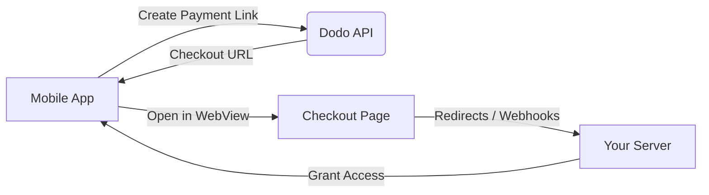

## परिचय

Dodo Payments डेवलपर्स को iOS ऐप्स में डिजिटल सामान और सेवाओं को बेचने के लिए सशक्त बनाता है, जो कर अनुपालन, मुद्रा रूपांतरण, और भुगतान जैसे जटिल पहलुओं को संभालता है। यह व्यापक गाइड आपके iOS ऐप में Dodo Payments को एकीकृत करने के तरीके का विवरण देती है, विशेष रूप से SaaS उपकरणों, सामग्री सब्सक्रिप्शन, और डिजिटल उपयोगिताओं के लिए।

## अवलोकन

Dodo Payments आपके **Merchant of Record (MoR)** के रूप में कार्य करता है, आपके डिजिटल व्यवसाय के महत्वपूर्ण पहलुओं का प्रबंधन करता है:

<Tabs>
{/* LOCKED_PATTERN_7b95db5ad22ff10e01a4218d7aa6d6be */}
- कर संग्रहण और भुगतान (वैट, जीएसटी, और अन्य क्षेत्रीय कर)
- नीतियों और स्थानीय भुगतान विधियों के अनुसार वैश्विक भुगतान
- मुद्रा रूपांतरण और विदेशी विनिमय
- चार्जबैक और धोखाधड़ी रोकथाम
- अंतिम ग्राहक के बिलिंग और रसीदें
- क्षेत्रीय नियमों के साथ अनुपालन
</Tab>

{/* LOCKED_PATTERN_da399a11cc5287c02436800c294d28be */}
- वेब और मोबाइल प्लेटफ़ॉर्म के लिए एकीकृत एपीआई
- इन-ऐप चेकआउट का समर्थन (UPI, कार्ड, वॉलेट, BNPL)
- वैश्विक भुगतान समर्थन (Payoneer, Wise, स्थानीय बैंक ट्रांसफर)
- एनालिटिक्स और रिपोर्टिंग डैशबोर्ड
- सुरक्षित भुगतान प्रक्रिया
</Tab>
</Tabs>

## उपयोग के मामले

<CardGroup cols={2}>
{/* LOCKED_PATTERN_25273516451e819dcf5729a5b31c3fb9 */}
- प्रीमियम सामग्री या फीचर एक्सेस
- लचीले विकल्पों के साथ आवर्ती बिलिंग, मुफ्त परीक्षण, प्रोरैशन, या अपग्रेड और डाउंग्रेड
</Card>

{/* LOCKED_PATTERN_032df751886a698341277e548837215d */}
- कोर्स-प्रति-पे एक्सेस
- बंडल्ड सामग्री पैकेज
- जीवन भर या नवीनीकरण योग्य लाइसेंस
- प्रगति ट्रैकिंग एकीकरण
</Card>

{/* LOCKED_PATTERN_88cb7887605391efc00e89ceac393617 */}
- एकमुश्त खरीदारी (PDFs, music, tools)
- डिजिटल संपत्ति वितरण
- लाइसेंस कुंजी प्रबंधन
</Card>

{/* LOCKED_PATTERN_53b689678a845fbab7f78be1484fe51d */}
- Software-as-a-Service सदस्यताएँ
- उपयोग-आधारित बिलिंग
- टीम और एंटरप्राइज़ प्लान
</Card>
</CardGroup>

## एकीकरण प्रवाह

आप हमारे होस्टेड चेकआउट या इन-ऐप ब्राउज़र समाधान का उपयोग करके अपने ऐप में Dodo Payments को एकीकृत कर सकते हैं।

### एकीकरण चरण

<Steps>
{/* LOCKED_PATTERN_eaf7186d297d5feae774885072c1deff */}
यह प्रक्रिया मोबाइल ऐप द्वारा डोडो एपीआई के साथ इंटरैक्ट करके भुगतान लिंक बनाने के साथ शुरू होती है।
</Step>

{/* LOCKED_PATTERN_b32fbf0225071fa4e66b7da8eafe9ef9 */}
डोडो एपीआई प्रतिक्रिया में मोबाइल ऐप को एक चेकआउट URL प्रदान करता है।
</Step>

{/* LOCKED_PATTERN_d976b5e50a0a8a20a8206d907f16914f */}
फिर मोबाइल ऐप इस चेकआउट URL को एक WebView के भीतर खोलता है, जिससे उपयोगकर्ता चेकआउट पृष्ठ पर जाता है।
</Step>

{/* LOCKED_PATTERN_44d5bb8ba746348cda77bbdfc76b7fa5 */}
चेकआउट प्रक्रिया पूरी होने पर, चेकआउट पृष्ठ रीडायरेक्ट या वेबहुक के माध्यम से आपके सर्वर के साथ संवाद करता है।
</Step>

{/* LOCKED_PATTERN_5f4ad8be947cf24adc5f501029294d3c */}
अंत में, आपका सर्वर खरीदी गई सामग्री या सेवा तक पहुंच प्रदान करता है, जो मोबाइल ऐप में लेनदेन चक्र को पूरा करता है।
</Step>
</Steps>

{/* LOCKED_PATTERN_b9b6430ebe2f8c301db006aee204f66d */}
पूर्ण डेवलपर वॉकथ्रू के लिए, हमारे मोबाइल एकीकरण गाइड का अन्वेषण करें।
</Card>

## क्षेत्रीय उपलब्धता

Dodo Payments केवल उन ऐप स्टोर क्षेत्रों में वैकल्पिक इन-ऐप खरीदारी प्रवाह को सक्षम करता है जहां Apple स्पष्ट रूप से बाहरी भुगतान की अनुमति देता है, या जहां कोई नियामक या अदालत का आदेश इसे अनिवार्य करता है।

### समर्थित क्षेत्र

<AccordionGroup>
{/* LOCKED_PATTERN_2d6a072cfe841357c870b65ab28b5291 */}
वर्तमान न्यायालय आदेशों और एप्पल के अद्यतित दिशानिर्देशों द्वारा अनुमत सीमा तक समर्थित।

- विशिष्ट न्यायालय-आदेशित प्रावधानों के तहत उपलब्ध
- एप्पल के कानूनी आवश्यकताओं के साथ अनुपालन के अधीन
- एप्पल के कार्यान्वयन दिशानिर्देशों का पालन करना आवश्यक है
</Accordion>

{/* LOCKED_PATTERN_4ec7a4d0b0e955daa950f2acd6b96083 */}
एप्पल के ईयू वैकल्पिक नियमों और External Purchase Entitlement के माध्यम से समर्थित।

- एप्पल के EU Alternative Terms के माध्यम से सक्षम
- External Purchase Entitlement अनुमोदन की आवश्यकता
- EU Digital Markets Act की आवश्यकताओं का पालन करना अनिवार्य
</Accordion>

{/* LOCKED_PATTERN_6bb22099c6c9aa7ba0a1c7dba319d124 */}
StoreKit External Purchase Entitlement के माध्यम से कोरिया-केवल बाइनरीज़ समर्थित।

- StoreKit External Purchase Entitlement के माध्यम से उपलब्ध
- कोरिया-विशिष्ट ऐप बाइनरी की आवश्यकता
- कोरियाई दूरसंचार कानून का पालन करना आवश्यक
</Accordion>
</AccordionGroup>

<Warning>
किसी भी स्टोरफ्रंट के लिए डोडो पेमेंट्स सक्षम करने से पहले हमेशा एप्पल के क्षेत्र-विशिष्ट अधिकारों और App Store Connect आवश्यकताओं की समीक्षा करें और उनका पालन करें। असमर्थित क्षेत्रों में वैकल्पिक भुगतान प्रवाह का उपयोग करने पर ऐप को अस्वीकार या हटाया जा सकता है।
</Warning>

<Note>
कुछ व्यावसायिक मॉडलों के लिए - जैसे सेवाएँ या सामग्री की कुछ श्रेणियाँ - एप्पल इन-ऐप खरीद (IAP) का उपयोग बिल्कुल भी आवश्यक नहीं मान सकता है। डोडो पेमेंट्स इन मॉडलों का भी समर्थन करता है। यह निर्धारित करने के लिए कि आपके उपयोग के मामले में IAP आवश्यक है या नहीं, हमेशा अपने ऐप के वर्गीकरण और एप्पल के नवीनतम दिशानिर्देशों की पुष्टि करें।
</Note>

### अधिक जानें

वैश्विक नीतियों, कानूनी पूर्ववृत्तों, और ऐप स्टोर शुल्कों को बायपास करने के लिए रणनीतिक दृष्टिकोणों का विस्तृत विवरण देखने के लिए, हमारे व्यापक गाइड को देखें:

{/* LOCKED_PATTERN_4c4ef7dc147bdbe9f5385b01ed7a302b */}
जानें कि आप वैकल्पिक भुगतान प्रवाह कहां और कैसे कानूनी रूप से लागू कर सकते हैं, साथ ही अद्यतित क्षेत्रीय मार्गदर्शन और अनुपालन सुझाव।
</Card>