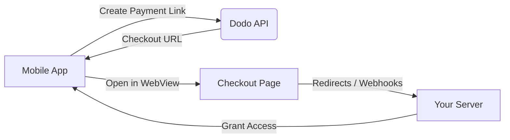

## परिचय

Dodo Payments डेवलपर्स को iOS ऐप्स में डिजिटल सामान और सेवाओं को बेचने के लिए सशक्त बनाता है, जो कर अनुपालन, मुद्रा रूपांतरण, और भुगतान जैसे जटिल पहलुओं को संभालता है। यह व्यापक गाइड आपके iOS ऐप में Dodo Payments को एकीकृत करने के तरीके का विवरण देती है, विशेष रूप से SaaS उपकरणों, सामग्री सब्सक्रिप्शन, और डिजिटल उपयोगिताओं के लिए।

## अवलोकन

Dodo Payments आपके **Merchant of Record (MoR)** के रूप में कार्य करता है, आपके डिजिटल व्यवसाय के महत्वपूर्ण पहलुओं का प्रबंधन करता है:

<Tabs>
<Tab title="हम क्या संभालते हैं">
- कर संग्रह और भुगतान (VAT, GST, और अन्य क्षेत्रीय कर)
- नीतियों और स्थानीय भुगतान विधियों के अनुसार वैश्विक भुगतान
- मुद्रा रूपांतरण और विदेशी विनिमय
- चार्जबैक और धोखाधड़ी रोकथाम
- अंतिम ग्राहक चालान और रसीदें
- क्षेत्रीय नियमों के साथ अनुपालन
</Tab>

<Tab title="आपको क्या मिलता है">
- वेब और मोबाइल प्लेटफार्मों के लिए एकीकृत API
- इन-ऐप चेकआउट (UPI, कार्ड, वॉलेट, BNPL) के लिए समर्थन
- वैश्विक भुगतान समर्थन (Payoneer, Wise, स्थानीय बैंक ट्रांसफर)
- एनालिटिक्स और रिपोर्टिंग डैशबोर्ड
- सुरक्षित भुगतान प्रसंस्करण
</Tab>
</Tabs>

## उपयोग के मामले

<CardGroup cols={2}>
<Card title="सब्सक्रिप्शन" icon="repeat">
- प्रीमियम सामग्री या फीचर एक्सेस
- लचीले विकल्पों के साथ आवर्ती बिलिंग, मुफ्त परीक्षण, प्रोरशन, या अपग्रेड और डाउनग्रेड
</Card>

<Card title="कोर्स और अध्ययन" icon="graduation-cap">
- प्रति-कोर्स एक्सेस
- बंडल सामग्री पैकेज
- जीवनकाल या नवीकरणीय लाइसेंस
- प्रगति ट्रैकिंग एकीकरण
</Card>

<Card title="डिजिटल डाउनलोड" icon="download">
- एक बार की खरीद (PDF, संगीत, उपकरण)
- डिजिटल संपत्ति वितरण
- लाइसेंस कुंजी प्रबंधन
</Card>

<Card title="SaaS उपकरण" icon="screwdriver-wrench">
- सॉफ़्टवेयर-के-रूप में-सेवा सब्सक्रिप्शन
- उपयोग-आधारित बिलिंग
- टीम और उद्यम योजनाएँ
</Card>
</CardGroup>

## एकीकरण प्रवाह

आप हमारे होस्टेड चेकआउट या इन-ऐप ब्राउज़र समाधान का उपयोग करके अपने ऐप में Dodo Payments को एकीकृत कर सकते हैं।

### एकीकरण चरण

<Steps>
<Step title="मोबाइल ऐप से Dodo API">
प्रक्रिया मोबाइल ऐप द्वारा Dodo API के साथ बातचीत करके एक भुगतान लिंक बनाने के साथ शुरू होती है।
</Step>

<Step title="Dodo API से मोबाइल ऐप">
Dodo API मोबाइल ऐप को चेकआउट URL प्रदान करके प्रतिक्रिया करता है।
</Step>

<Step title="मोबाइल ऐप से चेकआउट पृष्ठ">
मोबाइल ऐप फिर इस चेकआउट URL को एक WebView के भीतर खोलता है, जिससे उपयोगकर्ता चेकआउट पृष्ठ पर जाता है।
</Step>

<Step title="चेकआउट पृष्ठ से आपके सर्वर">
चेकआउट प्रक्रिया पूरी होने पर, चेकआउट पृष्ठ आपके सर्वर के साथ रीडायरेक्ट या वेबहुक के माध्यम से संवाद करता है।
</Step>

<Step title="आपके सर्वर से मोबाइल ऐप">
अंत में, आपका सर्वर खरीदी गई सामग्री या सेवा तक पहुंच प्रदान करता है, मोबाइल ऐप में लेनदेन चक्र को पूरा करता है।
</Step>
</Steps>

<Card title="मोबाइल एकीकरण गाइड" icon="mobile" href="/developer-resources/mobile-integration">
पूर्ण डेवलपर वॉकथ्रू के लिए, हमारे मोबाइल एकीकरण गाइड का अन्वेषण करें।
</Card>

## क्षेत्रीय उपलब्धता

Dodo Payments केवल उन ऐप स्टोर क्षेत्रों में वैकल्पिक इन-ऐप खरीदारी प्रवाह को सक्षम करता है जहां Apple स्पष्ट रूप से बाहरी भुगतान की अनुमति देता है, या जहां कोई नियामक या अदालत का आदेश इसे अनिवार्य करता है।

### समर्थित क्षेत्र

<AccordionGroup>
<Accordion title="संयुक्त राज्य अमेरिका">
वर्तमान अदालत के आदेशों और Apple के अद्यतन दिशानिर्देशों द्वारा अनुमत सीमा तक समर्थित।

- विशिष्ट अदालत-निर्धारित प्रावधानों के तहत उपलब्ध
- Apple के कानूनी आवश्यकताओं के अनुपालन के अधीन
- Apple के कार्यान्वयन दिशानिर्देशों का पालन करना आवश्यक है
</Accordion>

<Accordion title="यूरोपीय संघ (EU) ऐप स्टोर">
Apple के EU वैकल्पिक शर्तों और बाहरी खरीद अधिकार के माध्यम से समर्थित।

- Apple के EU वैकल्पिक शर्तों के माध्यम से सक्षम
- बाहरी खरीद अधिकार की स्वीकृति की आवश्यकता है
- EU डिजिटल मार्केट्स अधिनियम की आवश्यकताओं का पालन करना आवश्यक है
</Accordion>

<Accordion title="दक्षिण कोरिया">
कोरिया-विशिष्ट बाइनरी के लिए StoreKit बाहरी खरीद अधिकार के माध्यम से समर्थित।

- StoreKit बाहरी खरीद अधिकार के माध्यम से उपलब्ध
- कोरिया-विशिष्ट ऐप बाइनरी की आवश्यकता है
- कोरियाई दूरसंचार कानून का पालन करना आवश्यक है
</Accordion>
</AccordionGroup>

<Warning>
Dodo Payments को किसी भी स्टोरफ्रंट के लिए सक्षम करने से पहले हमेशा Apple के क्षेत्र-विशिष्ट अधिकारों और ऐप स्टोर कनेक्ट आवश्यकताओं की समीक्षा और अनुपालन करें। असमर्थित क्षेत्रों में वैकल्पिक भुगतान प्रवाह का उपयोग करने से ऐप अस्वीकृति या हटाने का परिणाम हो सकता है।
</Warning>

<Note>
कुछ व्यावसायिक मॉडलों के लिए - जैसे सेवाएँ या सामग्री की कुछ श्रेणियाँ - Apple इन-ऐप खरीदारी (IAP) के उपयोग की आवश्यकता नहीं कर सकता है। Dodo Payments इन मॉडलों का भी समर्थन करता है। हमेशा अपने ऐप की वर्गीकरण और Apple के नवीनतम दिशानिर्देशों की पुष्टि करें ताकि यह निर्धारित किया जा सके कि क्या आपके उपयोग के मामले के लिए IAP अनिवार्य है।
</Note>

### अधिक जानें

वैश्विक नीतियों, कानूनी पूर्ववृत्तों, और ऐप स्टोर शुल्कों को बायपास करने के लिए रणनीतिक दृष्टिकोणों का विस्तृत विवरण देखने के लिए, हमारे व्यापक गाइड को देखें:

<Card title="ऐप स्टोर और प्ले स्टोर शुल्कों को बायपास करना: एक रणनीतिक और कानूनी प्लेबुक" icon="shield-check" href="/features/bypassing-app-store-fees">
जानें कि आप वैकल्पिक भुगतान प्रवाह को कानूनी रूप से कहां और कैसे लागू कर सकते हैं, अद्यतन क्षेत्रीय मार्गदर्शन और अनुपालन टिप्स के साथ।
</Card>