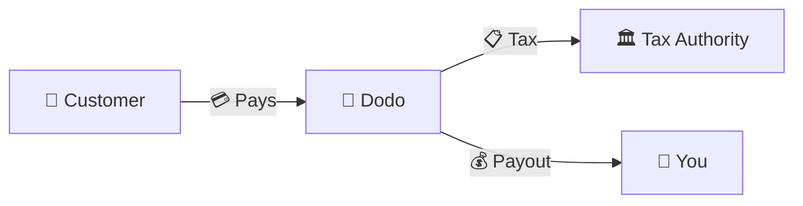
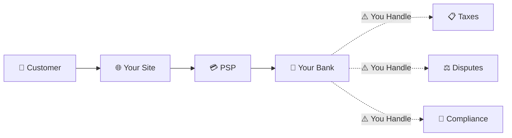
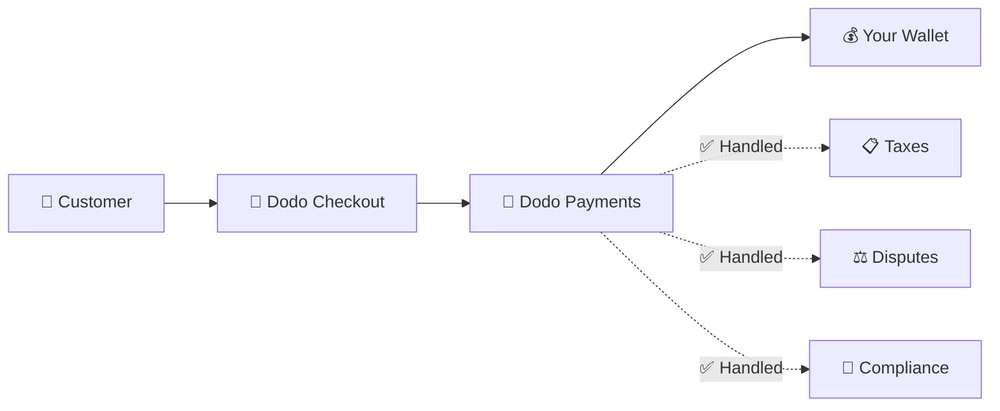
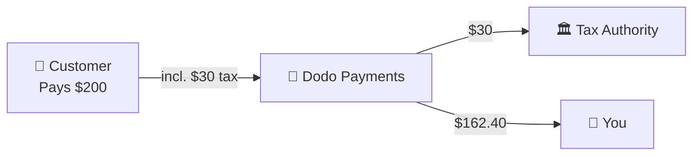

Dodo Payments एक **Merchant of Record (MoR)** के रूप में कार्य करता है — हम आपके डिजिटल उत्पादों के कानूनी विक्रेता बन जाते हैं, भुगतान, कर, धोखाधड़ी, और अनुपालन की जिम्मेदारी लेते हैं ताकि आप पूरी तरह से अपने उत्पाद को बनाने पर ध्यान केंद्रित कर सकें।

<CardGroup cols={3}>
{/* LOCKED_PATTERN_0dfe8c9e68953181aad63120292193bb */}
कर अनुपालन स्वचालित रूप से प्रबंधित किया जाता है
</Card>

{/* LOCKED_PATTERN_a7f32ee62695527a537b82d99f01c4bc */}
कार्ड, वॉलेट, और स्थानीय विधियाँ
</Card>

{/* LOCKED_PATTERN_cb6e35d755bb02c3f1254b1c5a9c4c73 */}
हम सभी रेमिटेंस संभालते हैं
</Card>
</CardGroup>

## Merchant of Record क्या है?

एक **Merchant of Record** वह कानूनी इकाई है जो आपके ग्राहक के क्रेडिट कार्ड विवरण पर दिखाई देती है और लेनदेन की जिम्मेदारी लेती है। जब आप Dodo Payments का उपयोग MoR के रूप में करते हैं:

- **हम कानूनी विक्रेता हैं** — Dodo बैंक विवरण और रसीदों पर दिखाई देता है
- **आप उत्पाद निर्माता हैं** — आप अपने उत्पाद को बनाते, मूल्य निर्धारण करते, और वितरित करते हैं
- **हम बैक ऑफिस संभालते हैं** — कर, विवाद, अनुपालन, और बिलिंग समर्थन
- **आप शुद्ध भुगतान प्राप्त करते हैं** — राजस्व सीधे आपके खाते में जमा होता है

<Note>
Merchant of Record को एक वैश्विक वित्त टीम को नियुक्त करने के रूप में सोचें जो इनवॉइसिंग, कर, और बिलिंग हर देश में संभाले — बिना आपकी कोई मेहनत के.
</Note>

## Merchant of Record का उपयोग क्यों करें?

वैश्विक स्तर पर डिजिटल उत्पाद बेचना यूरोप में VAT, ऑस्ट्रेलिया में GST, अमेरिका में बिक्री कर, और अनगिनत अन्य आवश्यकताओं को नेविगेट करने का मतलब है। प्रत्येक क्षेत्र के अलग-अलग नियम, दरें, थ्रेशोल्ड, और फाइलिंग की समयसीमा होती है।

| आपकी जिम्मेदारी | बिना MoR | Dodo के साथ MoR |
|---------------------|:-----------:|:----------------:|
| VAT/GST पंजीकरण | ❌ आप | ✅ Dodo |
| कर गणना | ❌ आप | ✅ Dodo |
| कर फाइलिंग और रेमिटेंस | ❌ आप | ✅ Dodo |
| चार्जबैक देनदारी | ❌ आप | ✅ Dodo |
| PCI अनुपालन | ❌ आप | ✅ Dodo |
| मल्टी-करेंसी समर्थन | ❌ जटिल | ✅ अंतर्निहित |
| स्थानीय भुगतान विधियाँ | ❌ प्रत्येक को एकीकृत करें | ✅ 30+ शामिल |

<Tip>
**उदाहरण**: एक फ्रांसीसी ग्राहक को €50/माह की सदस्यता बेचना?

**बिना MoR**: फ्रांसीसी VAT के लिए पंजीकरण करें, €60 (20% VAT) चार्ज करें, तिमाही फ्रांसीसी रिटर्न फाइल करें, ऑडिट संभालें—फ्रेंच में।

**Dodo के साथ**: हम €60 जमा करते हैं, फ्रांस को €10 VAT भुगतान करते हैं, और आपको €50 माइनस फीस देते हैं। आप कोड लिखते हैं.
</Tip>

## PSP बनाम MoR: मुख्य अंतर

**भुगतान सेवा प्रदाता** (जैसे Stripe) और **Merchant of Record** के बीच का अंतर समझना आवश्यक है।

### भुगतान सेवा प्रदाता (PSP)

एक PSP लेनदेन को संसाधित करता है लेकिन आपको कानूनी विक्रेता के रूप में छोड़ देता है:

<Warning>
एक PSP के साथ, **आप** हर क्षेत्राधिकार में जहां आपके ग्राहक हैं, वहां कर पंजीकरण, संग्रहण, फ़ाइलिंग, और सत्यापन के लिए जिम्मेदार होते हैं.
</Warning>

### Merchant of Record (Dodo)

एक MoR कानूनी विक्रेता बन जाता है, अनुपालन को अंत से अंत तक संभालता है:

<Check>
Dodo को MoR के रूप में होने पर, हम कर, विवाद, और अनुपालन को संभालते हैं। आपको शून्य कागजी कार्रवाई के साथ नेट भुगतान मिलते हैं.
</Check>

### साइड-बाय-साइड तुलना

| पहलू | PSP (Stripe, आदि) | MoR (Dodo) |
|--------|:------------------:|:----------:|
| कानूनी विक्रेता | आपकी कंपनी | Dodo |
| ग्राहक विवरण पर | आपका नाम | Dodo |
| कर पंजीकरण | ❌ आप | ✅ Dodo |
| कर गणना | ❌ आप | ✅ Dodo |
| कर रेमिटेंस | ❌ आप | ✅ Dodo |
| चार्जबैक जोखिम | ❌ आप | ✅ Dodo |
| PCI अनुपालन | ❌ आप | ✅ Dodo |
| वैश्विक सेटअप | जटिल | सरल |

<Info>
**महत्वपूर्ण**: PSP और MoR दोनों भुगतान प्रक्रिया संभालते हैं। मुख्य अंतर यह है कि **कौन कानूनी रूप से जिम्मेदार** है कर अनुपालन और लेन-देन दायित्व के लिए.
</Info>

## कर अनुपालन कैसे काम करता है

Dodo स्वचालित रूप से पूरे कर जीवनचक्र को संभालता है:

<Steps>
{/* LOCKED_PATTERN_9939f53f87faa28f5e85c7bcd4aa5d90 */}
हम ग्राहक का देश पहचानते हैं और निर्धारित करते हैं कि कौन से कर नियम लागू होते हैं — VAT, GST, Sales Tax, या अन्य स्थानीय आवश्यकताएँ.
</Step>

{/* LOCKED_PATTERN_70142fc485c0e1d535a43e599b490143 */}
सही कर दर उत्पाद प्रकार, ग्राहक स्थान, और B2B/B2C स्थिति के आधार पर गणना की जाती है। वैध VAT नंबर वाले EU व्यापार ग्राहक रिवर्स चार्ज लागू होते हैं.
</Step>

{/* LOCKED_PATTERN_44b82b1d71e9f255cf562f67916ee9b7 */}
कर समय पर स्पष्ट रूप से प्रदर्शित तथा चेकआउट पर एकत्र किया जाता है। ग्राहक ठीक वही देखते हैं जो वे भुगतान कर रहे हैं.
</Step>

{/* LOCKED_PATTERN_1a778e95cb3812007334c0b47194f9ac */}
हम रिटर्न दायर करते हैं और संबंधित प्राधिकरणों को निर्धारित समय पर एकत्रित कर का भुगतान करते हैं। आप कभी भी कोई कर फॉर्म नहीं देखते.
</Step>
</Steps>

## राजस्व प्रवाह

यहाँ यह है कि पैसा ग्राहक से आपके खाते में कैसे जाता है:

### उदाहरण भुगतान विवरण

| लाइन आइटम | राशि |
|-----------|-------:|
| ग्राहक भुगतान | $200.00 |
| बिक्री कर (15% VAT) | −$30.00 |
| Dodo प्लेटफ़ॉर्म शुल्क (4%) | −$8.00 |
| भुगतान प्रसंस्करण | −$0.60 |
| **आपका भुगतान** | **$162.40** |

## MoR बनाम PSP कब चुनें

<Tabs>
{/* LOCKED_PATTERN_1d2e428d12b1ee53f2d946d9302bede1 */}
**Dodo Payments आदर्श है यदि आप:**

- डिजिटल उत्पाद, SaaS, या सदस्यताएँ बेचते हैं
- कई देशों में ग्राहक हैं
- कर पंजीकरण की पेचीदगियों से बचना चाहते हैं
- अनुमानित, आउटसोर्स किए गए अनुपालन को प्राथमिकता देते हैं
- अधिकतम नियंत्रण की तुलना में बाजार में तेजी को महत्व देते हैं
- विवाद और धोखाधड़ी का प्रबंधन नहीं करना चाहते
</Tab>

{/* LOCKED_PATTERN_9020967e8e2c9a3ebc575f4072e18e76 */}
**एक PSP आपके लिए उपयुक्त हो सकता है यदि आप:**

- मुख्य रूप से एक देश में संचालित करते हैं
- इन-हाउस वित्त और अनुपालन टीमें हैं
- चेकआउट UX पर पूर्ण नियंत्रण चाहिए
- बहुत कम मार्जिन पर काम करते हैं
- भौतिक वस्तुएँ बेचते हैं (MoR डिजिटल पर केंद्रित होते हैं)
</Tab>
</Tabs>

<Note>
कई व्यवसाय PSP के साथ शुरू होते हैं और अंतरराष्ट्रीय स्तर पर विस्तार के साथ MoR पर स्विच करते हैं। Dodo इस संक्रमण को निर्बाध बनाने के लिए माइग्रेशन सहायता प्रदान करता है.
</Note>

## अक्सर पूछे जाने वाले प्रश्न

<AccordionGroup>
{/* LOCKED_PATTERN_03db007d1397fc75cc7c059a12f7514d */}
Dodo Payments व्यापारी के रूप में प्रकट होता है। जब वर्ण सीमा अनुमति देती है तो हम आपके उत्पाद/ब्रांड संदर्भ शामिल करते हैं, और ग्राहकों को आपके उत्पाद जानकारी दिखाती विस्तृत रसीदें मिलती हैं.
</Accordion>

{/* LOCKED_PATTERN_14efbd55af6b9971cc9bb290118d1ce5 */}
हाँ। आप मूल्य निर्धारण, ब्रांडिंग, उत्पाद वितरण, और प्रत्यक्ष संचार को नियंत्रित करते हैं। Dodo बिलिंग मैकेनिक्स संभालता है, लेकिन ग्राहक जानते हैं कि वे आपसे खरीद रहे हैं। आपका ब्रांड चेकआउट, ईमेल, और चालानों में प्रमुखता से दिखाई देता है.
</Accordion>

{/* LOCKED_PATTERN_5e87ff5ce15f8c25ec293008878ec1c8 */}
EU में B2B बिक्री के लिए, ग्राहक चेकआउट पर अपना VAT नंबर दर्ज कर सकते हैं। हम इसकी पुष्टि करते हैं और स्वचालित रूप से रिवर्स चार्ज लागू करते हैं — कर खरीदार के VAT रिटर्न पर स्थानांतरित हो जाता है बजाय इसके कि उसे एकत्र किया जाए.
</Accordion>

{/* LOCKED_PATTERN_828a96aed23c294d40585d542017c689 */}
Dodo हमारी भुगतान अवसंरचना का उपयोग करते हुए एक पूर्ण समाधान के रूप में संचालित होता है। यह एकीकरण हमें कर और धोखाधड़ी दायित्व स्वीकार करने की अनुमति देता है। हम भविष्य में अन्य भुगतान प्रोसेसर के साथ एक एकीकरण प्रदान करने पर काम कर रहे हैं.
</Accordion>

{/* LOCKED_PATTERN_7d718a1b657f28e952148f962ca6593e */}
अपने डैशबोर्ड से रिफंड आरंभ करें। हम ग्राहक की मूल भुगतान विधि और मुद्रा में रिफंड प्रक्रिया करते हैं। कर राशि स्वचालित रूप से समायोजित और मेल खाती हैं.
</Accordion>

{/* LOCKED_PATTERN_dc7f113144600495109fc2c229c89f70 */}
Dodo ग्राहक लेनदेन पर **सेल्स टैक्स** (VAT, GST, Sales Tax) संभालता है। आप अपने व्यवसाय के आयकर, कॉर्पोरेट टैक्स, और जो भुगतान आप प्राप्त करते हैं उन पर कर दायित्व के लिए जिम्मेदार बने रहते हैं.
</Accordion>

{/* LOCKED_PATTERN_04ec30ba2875e1ca25e9a1ae1dcc112d */}
हम 220+ देशों और क्षेत्रों से भुगतान स्वीकार करते हैं और निरंतर विस्तार कर रहे हैं। पूर्ण सूची देखें:
{/* LOCKED_PATTERN_1baa59aa331aff639990872bb61046bd */}

{/* LOCKED_PATTERN_1baa59aa331aff639990872bb61046bd */}
उन सभी 220+ देशों और क्षेत्रों को देखें जहां हम भुगतान स्वीकार करते हैं。
</Card>
</Accordion>
</AccordionGroup>

## शुरू करें

<CardGroup cols={2}>
{/* LOCKED_PATTERN_a6e00712f4bf1e0645985bccec8d5def */}
निःशुल्क साइन अप करें और मिनटों में वैश्विक भुगतान स्वीकार करें।
</Card>

{/* LOCKED_PATTERN_d858044e80838a32f52c51b21b17f5eb */}
उदाहरणों और उपयोग के मामलों के साथ विस्तृत तुलना।
</Card>

{/* LOCKED_PATTERN_4e501d9df0a1b75ab7c08a16b87219c5 */}
जानें कि हम किन व्यवसायों का समर्थन करते हैं।
</Card>

{/* LOCKED_PATTERN_6053eaa23d9fa4210c02c58e94af8536 */}
हमारी टीम से व्यक्तिगत मार्गदर्शन प्राप्त करें।
</Card>
</CardGroup>
