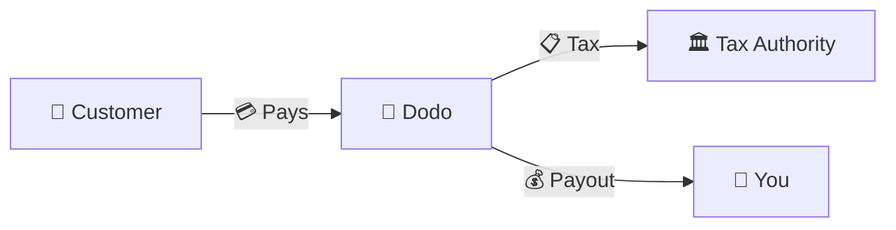
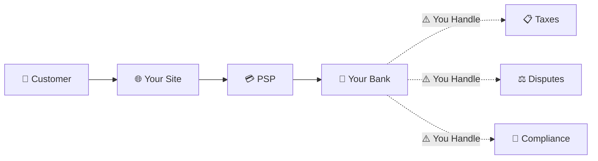
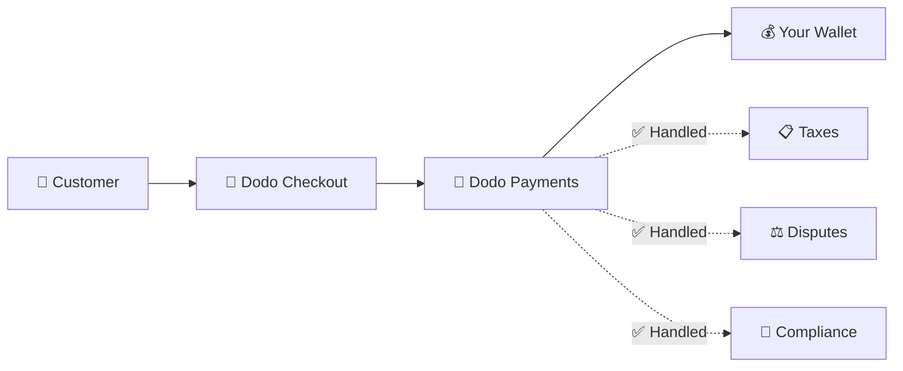
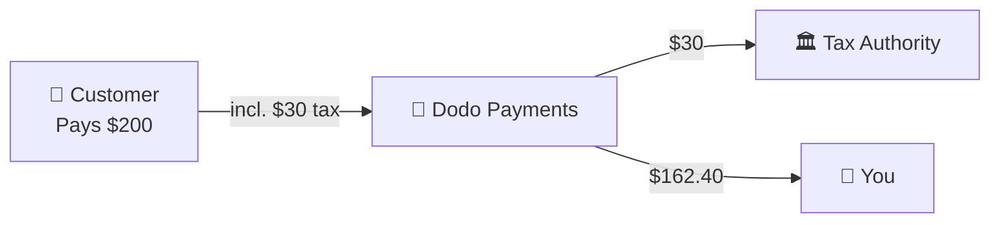

Dodo Payments एक **Merchant of Record (MoR)** के रूप में कार्य करता है — हम आपके डिजिटल उत्पादों के कानूनी विक्रेता बन जाते हैं, भुगतान, कर, धोखाधड़ी, और अनुपालन की जिम्मेदारी लेते हैं ताकि आप पूरी तरह से अपने उत्पाद को बनाने पर ध्यान केंद्रित कर सकें।

<CardGroup cols={3}>
<Card title="220+ क्षेत्र" icon="globe">
कर अनुपालन स्वचालित रूप से संभाला जाता है
</Card>

<Card title="30+ भुगतान विधियाँ" icon="credit-card">
कार्ड, वॉलेट, और स्थानीय विधियाँ
</Card>

<Card title="शून्य कर फाइलिंग" icon="file-invoice">
हम सभी रेमिटेंस संभालते हैं
</Card>
</CardGroup>

## Merchant of Record क्या है?

एक **Merchant of Record** वह कानूनी इकाई है जो आपके ग्राहक के क्रेडिट कार्ड विवरण पर दिखाई देती है और लेनदेन की जिम्मेदारी लेती है। जब आप Dodo Payments का उपयोग MoR के रूप में करते हैं:

- **हम कानूनी विक्रेता हैं** — Dodo बैंक विवरण और रसीदों पर दिखाई देता है
- **आप उत्पाद निर्माता हैं** — आप अपने उत्पाद को बनाते, मूल्य निर्धारण करते, और वितरित करते हैं
- **हम बैक ऑफिस संभालते हैं** — कर, विवाद, अनुपालन, और बिलिंग समर्थन
- **आप शुद्ध भुगतान प्राप्त करते हैं** — राजस्व सीधे आपके खाते में जमा होता है

<Note>
Merchant of Record को एक वैश्विक वित्तीय टीम के रूप में सोचें जो हर देश में इनवॉइसिंग, कर, और बिलिंग को संभालती है — बिना आपके एक उंगली उठाए।
</Note>

## Merchant of Record का उपयोग क्यों करें?

वैश्विक स्तर पर डिजिटल उत्पाद बेचना यूरोप में VAT, ऑस्ट्रेलिया में GST, अमेरिका में बिक्री कर, और अनगिनत अन्य आवश्यकताओं को नेविगेट करने का मतलब है। प्रत्येक क्षेत्र के अलग-अलग नियम, दरें, थ्रेशोल्ड, और फाइलिंग की समयसीमा होती है।

| आपकी जिम्मेदारी | बिना MoR | Dodo के साथ MoR |
|---------------------|:-----------:|:----------------:|
| VAT/GST पंजीकरण | ❌ आप | ✅ Dodo |
| कर गणना | ❌ आप | ✅ Dodo |
| कर फाइलिंग और रेमिटेंस | ❌ आप | ✅ Dodo |
| चार्जबैक देनदारी | ❌ आप | ✅ Dodo |
| PCI अनुपालन | ❌ आप | ✅ Dodo |
| मल्टी-करेंसी समर्थन | ❌ जटिल | ✅ अंतर्निहित |
| स्थानीय भुगतान विधियाँ | ❌ प्रत्येक को एकीकृत करें | ✅ 30+ शामिल |

<Tip>
**उदाहरण**: एक फ्रांसीसी ग्राहक को €50/महीने की सदस्यता बेच रहे हैं?

**बिना MoR**: फ्रांसीसी VAT के लिए पंजीकरण करें, €60 (20% VAT) चार्ज करें, तिमाही फ्रांसीसी रिटर्न फाइल करें, ऑडिट संभालें—फ्रेंच में।

**Dodo के साथ**: हम €60 एकत्र करते हैं, €10 VAT फ्रांस को भेजते हैं, और आपको शुल्क घटाकर €50 का भुगतान करते हैं। आप कोड लिखते हैं।
</Tip>

## PSP बनाम MoR: मुख्य अंतर

**भुगतान सेवा प्रदाता** (जैसे Stripe) और **Merchant of Record** के बीच का अंतर समझना आवश्यक है।

### भुगतान सेवा प्रदाता (PSP)

एक PSP लेनदेन को संसाधित करता है लेकिन आपको कानूनी विक्रेता के रूप में छोड़ देता है:

<Warning>
PSP के साथ, **आप** हर क्षेत्र में कर पंजीकरण, संग्रह, फाइलिंग, और रेमिटेंस के लिए जिम्मेदार हैं जहाँ आपके ग्राहक हैं।
</Warning>

### Merchant of Record (Dodo)

एक MoR कानूनी विक्रेता बन जाता है, अनुपालन को अंत से अंत तक संभालता है:

<Check>
Dodo के साथ MoR के रूप में, हम कर, विवाद, और अनुपालन को संभालते हैं। आप बिना किसी कागजी कार्रवाई के शुद्ध भुगतान प्राप्त करते हैं।
</Check>

### साइड-बाय-साइड तुलना

| पहलू | PSP (Stripe, आदि) | MoR (Dodo) |
|--------|:------------------:|:----------:|
| कानूनी विक्रेता | आपकी कंपनी | Dodo |
| ग्राहक विवरण पर | आपका नाम | Dodo |
| कर पंजीकरण | ❌ आप | ✅ Dodo |
| कर गणना | ❌ आप | ✅ Dodo |
| कर रेमिटेंस | ❌ आप | ✅ Dodo |
| चार्जबैक जोखिम | ❌ आप | ✅ Dodo |
| PCI अनुपालन | ❌ आप | ✅ Dodo |
| वैश्विक सेटअप | जटिल | सरल |

<Info>
**महत्वपूर्ण**: PSPs और MoRs दोनों भुगतान प्रसंस्करण को संभालते हैं। मुख्य अंतर यह है कि **कौन कानूनी रूप से जिम्मेदार** है कर अनुपालन और लेनदेन की देनदारी के लिए।
</Info>

## कर अनुपालन कैसे काम करता है

Dodo स्वचालित रूप से पूरे कर जीवनचक्र को संभालता है:

<Steps>
<Step title="ग्राहक स्थान">
हम ग्राहक के देश का पता लगाते हैं और यह निर्धारित करते हैं कि कौन से कर नियम लागू होते हैं — VAT, GST, बिक्री कर, या अन्य स्थानीय आवश्यकताएँ।
</Step>

<Step title="दर गणना">
सही कर दर उत्पाद प्रकार, ग्राहक स्थान, और B2B/B2C स्थिति के आधार पर गणना की जाती है। EU व्यापार ग्राहक जिनके पास वैध VAT नंबर हैं, उन्हें रिवर्स चार्ज लागू किया जाता है।
</Step>

<Step title="चेकआउट पर संग्रह">
कर स्पष्ट रूप से प्रदर्शित किया जाता है और चेकआउट पर एकत्र किया जाता है। ग्राहक ठीक से देखते हैं कि वे क्या भुगतान कर रहे हैं।
</Step>

<Step title="फाइलिंग और रेमिटेंस">
हम रिटर्न फाइल करते हैं और एकत्र किए गए करों का भुगतान संबंधित अधिकारियों को समय पर करते हैं। आप कभी भी कर फॉर्म नहीं देखते।
</Step>
</Steps>

## राजस्व प्रवाह

यहाँ यह है कि पैसा ग्राहक से आपके खाते में कैसे जाता है:

### उदाहरण भुगतान विवरण

| लाइन आइटम | राशि |
|-----------|-------:|
| ग्राहक भुगतान | $200.00 |
| बिक्री कर (15% VAT) | −$30.00 |
| Dodo प्लेटफ़ॉर्म शुल्क (4%) | −$8.00 |
| भुगतान प्रसंस्करण | −$0.60 |
| **आपका भुगतान** | **$162.40** |

## MoR बनाम PSP कब चुनें

<Tabs>
<Tab title="Dodo चुनें (MoR)">
**Dodo Payments आपके लिए आदर्श है यदि आप:**

- डिजिटल उत्पाद, SaaS, या सदस्यताएँ बेचते हैं
- कई देशों में ग्राहक हैं
- कर पंजीकरण की सिरदर्द से बचना चाहते हैं
- पूर्वानुमानित, आउटसोर्स किए गए अनुपालन को प्राथमिकता देते हैं
- अधिकतम नियंत्रण की तुलना में बाजार में तेजी को महत्व देते हैं
- विवाद और धोखाधड़ी को प्रबंधित नहीं करना चाहते
</Tab>

<Tab title="PSP पर विचार करें">
**यदि आप एक PSP का उपयोग कर सकते हैं यदि आप:**

- मुख्य रूप से एक देश में कार्य करते हैं
- आपके पास इन-हाउस वित्त और अनुपालन टीमें हैं
- चेकआउट UX पर पूर्ण नियंत्रण की आवश्यकता है
- अत्यधिक पतले मार्जिन के साथ काम करते हैं
- भौतिक वस्तुएँ बेचते हैं (MoRs डिजिटल पर ध्यान केंद्रित करते हैं)
</Tab>
</Tabs>

<Note>
कई व्यवसाय PSP के साथ शुरू करते हैं और जैसे-जैसे वे अंतरराष्ट्रीय स्तर पर बढ़ते हैं, MoR पर स्विच करते हैं। Dodo इस संक्रमण को सुगम बनाने के लिए माइग्रेशन समर्थन प्रदान करता है।
</Note>

## अक्सर पूछे जाने वाले प्रश्न

<AccordionGroup>
<Accordion title="मेरे ग्राहक के क्रेडिट कार्ड विवरण पर क्या दिखाई देता है?">
Dodo Payments व्यापारी के रूप में दिखाई देता है। हम आपके उत्पाद/ब्रांड संदर्भ को शामिल करते हैं जहाँ वर्णन सीमा अनुमति देती है, और ग्राहकों को आपके उत्पाद की जानकारी दिखाने वाली विस्तृत रसीदें मिलती हैं।
</Accordion>

<Accordion title="क्या मैं अभी भी ग्राहक संबंध का मालिक हूँ?">
हाँ। आप मूल्य निर्धारण, ब्रांडिंग, उत्पाद वितरण, और प्रत्यक्ष संचार को नियंत्रित करते हैं। Dodo बिलिंग तंत्र को संभालता है, लेकिन ग्राहक जानते हैं कि वे आपसे खरीद रहे हैं। आपकी ब्रांड चेकआउट, ईमेल, और चालानों में प्रमुखता से दिखाई देती है।
</Accordion>

<Accordion title="B2B VAT रिवर्स चार्ज कैसे काम करता है?">
EU में B2B बिक्री के लिए, ग्राहक चेकआउट पर अपना VAT नंबर दर्ज कर सकते हैं। हम इसे मान्य करते हैं और स्वचालित रूप से रिवर्स चार्ज लागू करते हैं — कर खरीदार के VAT रिटर्न में स्थानांतरित हो जाता है बजाय इसके कि इसे एकत्र किया जाए।
</Accordion>

<Accordion title="क्या मैं अपने स्वयं के भुगतान प्रोसेसर का उपयोग कर सकता हूँ?">
Dodo हमारे भुगतान बुनियादी ढाँचे का उपयोग करके एक पूर्ण समाधान के रूप में कार्य करता है। यह एकीकरण हमें कर और धोखाधड़ी की देनदारी को मानने की अनुमति देता है। हम भविष्य में अन्य भुगतान प्रोसेसर के साथ एकीकरण प्रदान करने पर काम कर रहे हैं।
</Accordion>

<Accordion title="रिफंड कैसे काम करते हैं?">
अपने डैशबोर्ड से रिफंड शुरू करें। हम ग्राहक के मूल भुगतान विधि और मुद्रा में रिफंड संसाधित करते हैं। कर की राशि स्वचालित रूप से समायोजित और समन्वयित की जाती है।
</Accordion>

<Accordion title="मेरे आय कर के बारे में क्या?">
Dodo ग्राहक लेनदेन पर **बिक्री कर** (VAT, GST, बिक्री कर) को संभालता है। आप अपने व्यवसाय के आय कर, कॉर्पोरेट कर, और प्राप्त भुगतान पर कर दायित्व के लिए जिम्मेदार रहते हैं।
</Accordion>

<Accordion title="मैं किन देशों में बेच सकता हूँ?">
हम 220+ देशों और क्षेत्रों से भुगतान स्वीकार करते हैं और निरंतर विस्तार कर रहे हैं। पूरी सूची देखें:

<Card title="समर्थित क्षेत्र" icon="globe" href="/miscellaneous/list-of-countries-we-accept-payments-from">
उन 220+ देशों और क्षेत्रों की पूरी सूची देखें जहाँ हम भुगतान स्वीकार करते हैं।
</Card>
</Accordion>
</AccordionGroup>

## शुरू करें

<CardGroup cols={2}>
<Card title="खाता बनाएं" icon="rocket" href="https://app.dodopayments.com/signup">
मुफ्त में साइन अप करें और कुछ ही मिनटों में वैश्विक भुगतान स्वीकार करें।
</Card>

<Card title="MoR बनाम PG गहन अध्ययन" icon="scale-balanced" href="/features/mor-vs-pg">
उदाहरणों और उपयोग के मामलों के साथ विस्तृत तुलना।
</Card>

<Card title="स्वीकृति नीति" icon="building-shield" href="/miscellaneous/merchant-acceptance">
जानें कि हम किन व्यवसायों का समर्थन करते हैं।
</Card>

<Card title="हमसे बात करें" icon="envelope" href="mailto:founders@dodopayments.com">
हमारी टीम से व्यक्तिगत मार्गदर्शन प्राप्त करें।
</Card>
</CardGroup>
