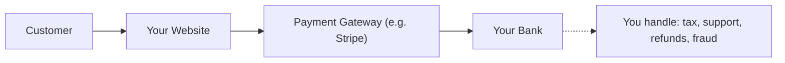
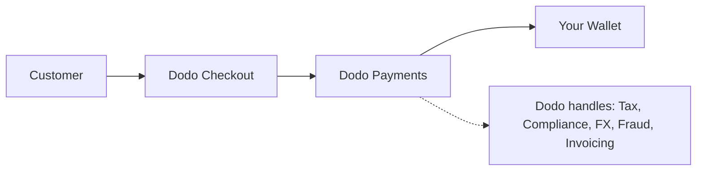

## परिचय

यह गाइड MoR मॉडल की तुलना पारंपरिक पेमेंट गेटवे दृष्टिकोण से करती है, जिससे आपको यह समझने में मदद मिलती है कि Dodo Payments आपके व्यवसाय के लिए क्या लाभ लाता है।

## मुख्य अंतर

| विशेषता                          | MoR (Dodo Payments)         | पेमेंट गेटवे (पारंपरिक PG)           |
|----------------------------------|--------------------------------------------|--------------------------------------------|
| कानूनी विक्रेता                     | Dodo Payments (MoR)                        | आपकी कंपनी                               |
| कर संग्रहण और भुगतान            | Dodo द्वारा संभाला गया                            | आप जिम्मेदार हैं                        |
| अनुपालन और नियामक बोझ          | Dodo जिम्मेदारी लेता है                     | आप स्थानीय कानूनों और चार्जबैक को संभालते हैं      |
| निपटान मुद्रा                   | USD, EUR, INR, और 25+ अन्य समर्थित    | आपके व्यापारी खाते पर निर्भर           |
| जोखिम प्रबंधन                   | अंतर्निहित धोखाधड़ी और चार्जबैक सुरक्षा   | आप अपने उपकरण सेट करते हैं (जैसे, Stripe Radar) |
| भुगतान                         | समेकित और सरल वैश्विक भुगतान   | सीधे PG से आपको, बैंक सेटअप के साथ     |

## आपके लिए इसका क्या मतलब है

**Dodo को MoR के रूप में**, हम आपके ग्राहकों के लिए कानूनी विक्रेता बन जाते हैं, जिससे आप:

- स्थानीय संस्थाओं की स्थापना से बच सकते हैं
- VAT, GST, या बिक्री कर को संभालने से बच सकते हैं
- वैश्विक स्तर पर अधिक भुगतान विधियाँ प्रदान कर सकते हैं
- कानूनी जोखिम को कम कर सकते हैं
- नए बाजारों में तेजी से लॉन्च कर सकते हैं

<Note>
कल्पना करें कि आप फ्रांस में एक उपयोगकर्ता को एक डिजिटल सदस्यता बेच रहे हैं। Dodo Payments के साथ, हम भुगतान एकत्र करते हैं, फ्रांसीसी अधिकारियों के साथ VAT फाइल करते हैं, और आपको शुद्ध राजस्व भेजते हैं। कोई कर की सिरदर्दी नहीं। कोई वकील नहीं। केवल विकास।
</Note>

इसके अतिरिक्त, MoR मॉडल आपके पूरे बैक ऑफिस को सरल बनाता है। आपके MoR के रूप में, Dodo PCI अनुपालन, धोखाधड़ी पहचान, मुद्रा रूपांतरण, और यहां तक कि ग्राहक बिलिंग समर्थन को संभालता है, जिससे आपकी टीम को उत्पाद और विकास पर ध्यान केंद्रित करने की स्वतंत्रता मिलती है।

## दृश्य तुलना

**राजस्व प्रवाह: पेमेंट गेटवे**

**राजस्व प्रवाह: मर्चेंट ऑफ रिकॉर्ड (Dodo)**

## यह SaaS और डिजिटल व्यवसायों के लिए क्यों महत्वपूर्ण है

जैसे-जैसे आपका व्यवसाय बढ़ता है, करों, अनुपालन, और वैश्विक भुगतान प्राथमिकताओं का प्रबंधन करना भारी हो सकता है। एक पेमेंट गेटवे के साथ, आप जिम्मेदार हैं:

- कई न्यायालयों में VAT/GST पंजीकरण और फाइलिंग
- मुद्रा रूपांतरण और चार्जबैक का प्रबंधन
- स्थानीयकृत चेकआउट और भुगतान विधियाँ प्रदान करना

Dodo Payments को आपके MoR के रूप में:
- आप बिना स्थानीय संस्थाएँ स्थापित किए वैश्विक स्तर पर विस्तार करते हैं
- कर आपके लिए गणना, संग्रहित, और भुगतान किए जाते हैं
- आपको अपने ग्राहकों के लिए अनुकूलित भुगतान विधियों की एक लाइब्रेरी तक पहुंच मिलती है
- हम आपके कानूनी बफर और संचालन भागीदार के रूप में कार्य करते हैं

<Tip>
"एक पेमेंट गेटवे को एक सुरंग के रूप में सोचें। अब कल्पना करें कि मर्चेंट ऑफ रिकॉर्ड एक सुरंग, ट्रेन, चालक, और टिकटिंग स्टाफ सभी एक में है।"
</Tip>

## MoR का उपयोग किसे करना चाहिए?

Dodo Payments निम्नलिखित के लिए आदर्श है:
- SaaS और डिजिटल उत्पाद कंपनियाँ
- स्वतंत्र निर्माता और सोलोप्रेनर्स
- 100+ देशों में ग्राहकों के साथ वैश्विक व्यवसाय
- कंपनियाँ जो घर में करों और अनुपालन का प्रबंधन नहीं करना चाहतीं

यदि आप अंतरराष्ट्रीय स्तर पर विस्तार कर रहे हैं, सदस्यताएँ बेच रहे हैं, या केवल संचालन की सिरदर्दी को कम करना चाहते हैं, तो MoR एक समझदारी भरा विकल्प है।

## इसके बजाय पेमेंट गेटवे का उपयोग कब करें

कुछ मामलों में केवल एक पेमेंट गेटवे का उपयोग करना समझ में आ सकता है:
- आपका व्यवसाय केवल एक देश में संचालित होता है
- आपके पास पहले से ही आंतरिक वित्त और अनुपालन संसाधन हैं
- आपको ग्राहक बिलिंग अनुभव पर पूर्ण नियंत्रण की आवश्यकता है
- आप लागत-संवेदनशील हैं और पैमाने पर पतले मार्जिन हैं

<Note>
कई स्टार्टअप के लिए, प्रारंभ में एक गेटवे का उपयोग करना पर्याप्त हो सकता है - लेकिन जैसे-जैसे जटिलता बढ़ती है, MoR में स्विच करना समय बचा सकता है, जोखिम को कम कर सकता है, और अंतरराष्ट्रीय विकास को तेज कर सकता है।
</Note>

## Dodo Payments को क्यों चुनें

Dodo Payments प्रदान करता है:
- सभी-एक में भुगतान, कर, और अनुपालन स्टैक
- वास्तविक समय FX और बहु-मुद्रा समर्थन
- 30+ भुगतान विधियों तक पहुंच
- सीट-आधारित बिलिंग, सदस्यताएँ, और एक बार के भुगतान
- 150+ देशों में स्वचालित कर प्रबंधन
- अंतर्निहित धोखाधड़ी रोकथाम और PCI अनुपालन

चाहे आप एक एकल संस्थापक हों या एक बढ़ती हुई SaaS टीम, Dodo वैश्विक स्तर पर बिक्री की जटिलताओं को सरल बनाता है।

## अधिक जानें

<CardGroup cols={2}>
<Card title="अनुकूलनशील मुद्रा समर्थन" icon="money-bill-wave" href="/features/adaptive-currency">
जानें कि Dodo कैसे स्वचालित रूप से आपके ग्राहकों की स्थानीय मुद्राओं में कीमतें प्रस्तुत करता है
</Card>

<Card title="समर्थित भुगतान विधियाँ" icon="credit-card" href="/features/payment-methods">
Dodo Payments के माध्यम से उपलब्ध 30+ भुगतान विधियों का पता लगाएँ
</Card>
</CardGroup>

## स्विच करने के लिए तैयार हैं?

3,000+ डिजिटल व्यवसायों में शामिल हों जो Dodo Payments का उपयोग करके वैश्विक स्तर पर बिक्री कर रहे हैं, बिना सीमाओं या बाधाओं के।

<CardGroup cols={2}>
<Card title="मुफ्त में साइन अप करें" icon="user-plus" href="https://app.dodopayments.com/signup">
अपना Dodo Payments खाता बनाएं और आज ही वैश्विक स्तर पर बिक्री शुरू करें
</Card>

<Card title="सेल्स से बात करें" icon="envelope" href="mailto:founders@dodopayments.com">
हमारी टीम से व्यक्तिगत मार्गदर्शन प्राप्त करें
</Card>
</CardGroup>

<Tip>
Dodo को कठिन चीजों को संभालने दें - ताकि आप एक शानदार उत्पाद बनाने पर ध्यान केंद्रित कर सकें।
</Tip>