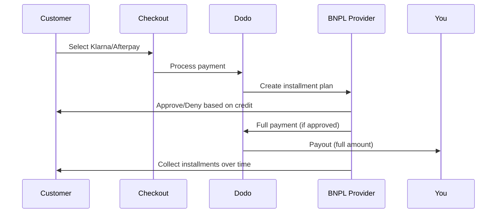

Buy Now Pay Later (BNPL) ग्राहकों को खरीदारी को ब्याज-मुक्त किस्तों में विभाजित करने देता है, योग्य लेनदेन के लिए औसत ऑर्डर मूल्य में 20-50% और रूपांतरण दरों में 10-30% तक वृद्धि करता है।

## BNPL क्यों प्रस्तावित करें?

<CardGroup cols={3}>
<Card title="Higher AOV" icon="chart-line">
ग्राहक अधिक खर्च करते हैं जब वे भुगतान को समय के साथ फैलाने में सक्षम होते हैं। औसत ऑर्डर मूल्य 20-50% तक बढ़ता है।
</Card>

<Card title="Better Conversion" icon="percent">
चेकआउट पर भुगतान गति कम करना। उच्च-मूल्य वस्तुओं के लिए रूपांतरण दरें 10-30% तक सुधरती हैं।
</Card>

<Card title="Zero Risk" icon="shield-check">
BNPL प्रदाता क्रेडिट जोखिम और वसूली का प्रबंधन करते हैं। आपको पूरा भुगतान अग्रिम में प्राप्त होता है।
</Card>
</CardGroup>

## समर्थित प्रदाता

### Klarna

| Feature | Details |
| :------ | :------ |
| **Availability** | US + 19 European countries |
| **Currencies** | USD, EUR, GBP, DKK, NOK, SEK, CZK, RON, PLN, CHF |
| **Minimum** | $50.01 (or equivalent) |
| **Subscriptions** | No |

**Supported Countries:** Austria, Belgium, Czech Republic, Denmark, Finland, France, Germany, Greece, Ireland, Italy, Netherlands, Norway, Poland, Portugal, Romania, Spain, Sweden, Switzerland, United Kingdom, United States

**Payment Options:**
- **Pay in 4** — Split into 4 interest-free payments
- **Pay in 30 days** — Full payment due in 30 days
- **Financing** — Longer-term installment plans

### Afterpay (Clearpay)

| Feature | Details |
| :------ | :------ |
| **Availability** | US, UK |
| **Currencies** | USD, GBP |
| **Minimum** | $50.01 (or equivalent) |
| **Subscriptions** | No |

**Payment Options:**
- **Pay in 4** — 4 interest-free payments every 2 weeks

<Note>
In the UK, Afterpay operates as "Clearpay" but uses the same API type (`afterpay_clearpay`).
</Note>

### Billie

| Feature | Details |
| :------ | :------ |
| **Availability** | Global |
| **Currencies** | GBP |
| **Minimum** | None |
| **Subscriptions** | No |

**About Billie:**
Billie एक B2B Buy Now Pay Later समाधान है जो व्यवसायों को अपने ग्राहकों को लचीले भुगतान शर्तें प्रदान करने में सक्षम बनाता है। यह व्यापार से व्यापार लेनदेन के लिए डिज़ाइन किया गया है जहाँ खरीदारों को चालान-आधारित भुगतान विकल्पों की आवश्यकता होती है।

**Payment Options:**
- **Invoice Payment** — सहमत भुगतान शर्तों के भीतर भुगतान करें
- **Flexible Terms** — व्यवसाय-हितैषी भुगतान अनुसूचियाँ

## कॉन्फ़िगरेशन

### API मेथड प्रकार

| Type | Provider |
| :--- | :------- |
| `klarna` | Klarna |
| `afterpay_clearpay` | Afterpay / Clearpay |
| `billie` | Billie (B2B) |

### उदाहरण

```javascript
const session = await client.checkoutSessions.create({
  product_cart: [{ product_id: 'prod_123', quantity: 1 }],
  allowed_payment_method_types: [
    'klarna',
    'afterpay_clearpay',
    'credit',
    'debit'
  ],
  customer: {
    email: 'customer@example.com',
    name: 'Jane Smith'
  },
  billing_address: {
    country: 'US',
    zipcode: '10001'
  },
  return_url: 'https://example.com/success'
});
```

<Warning>
हमेशा `credit` और `debit` को फॉलबैक के रूप में शामिल करें। सभी ग्राहक BNPL के लिए पात्र नहीं होते, और $50.01 से कम लेनदेन योग्य नहीं होते।
</Warning>

## न्यूनतम लेनदेन राशि

**Klarna और Afterpay दोनों के लिए न्यूनतम $50.01 USD** (या समर्थित मुद्राओं में समतुल्य) आवश्यक है।

इस सीमा से नीचे लेनदेन:
- चेकआउट पर BNPL विकल्प दिखाई नहीं देंगे
- कोई त्रुटि नहीं होती — विकल्प बस नहीं दिखते
- कार्ड भुगतान उपलब्ध रहते हैं

यह अपेक्षित व्यवहार है। $50 से कम उत्पादों के लिए `allowed_payment_method_types` में BNPL शामिल न करें।

## किस्तें कैसे काम करती हैं



**मुख्य बिंदु:**
- आपको BNPL प्रदाता से **पूरी राशि अग्रिम में** मिलती है
- BNPL प्रदाता **क्रेडिट जोखिम और वसूली** का प्रबंधन करता है
- ग्राहक आमतौर पर **4 किस्तों** में सीधे प्रदाता को भुगतान करता है
- **किस्त विफलता पर चार्जबैक नहीं** — यह प्रदाता का जोखिम है

## परीक्षण

### Klarna परीक्षण डेटा

टेस्ट मोड में इन विवरणों का उपयोग करें:

| Field | Approved | Denied |
| :---- | :------- | :----- |
| **Date of Birth** | 07-10-1970 | 07-10-1970 |
| **First Name** | Test | Test |
| **Last Name** | Person-us | Person-us |
| **Email** | customer@email.us | customer+denied@email.us |
| **Street** | Amsterdam Ave | Amsterdam Ave |
| **House Number** | 509 | 509 |
| **City** | New York | New York |
| **State** | New York | New York |
| **Postal Code** | 10024-3941 | 10024-3941 |
| **Phone** | +13106683312 | +13106354386 |

<Note>
लेनदेन कम से कम $50 होना चाहिए ताकि Klarna विकल्प के रूप में दिखाई दे सके।
</Note>

### Afterpay परीक्षण

<Steps>
<Step title="Select Afterpay">
चेकआउट में Afterpay चुनें और "Pay" पर क्लिक करें।
</Step>

<Step title="Successful payment">
कोई भी वैध ईमेल और शिपिंग पता उपयोग करें।
</Step>

<Step title="Failed authentication">
असफलता का परीक्षण करने के लिए: रीडायरेक्ट पेज पर Afterpay मोडल को बंद करें। भुगतान स्थिति `requires_payment_method` में बदल जाती है।
</Step>
</Steps>

## सर्वोत्तम अभ्यास

<AccordionGroup>
<Accordion title="Target high-ticket items">
BNPL $100-$1000 के उत्पादों के लिए सबसे प्रभावी रहता है। "समय पर भुगतान" का मूल्य प्रस्तुति इसी रेंज में सबसे प्रभावशाली होता है।
</Accordion>

<Accordion title="Show installment amounts">
"4 भुगतान $25 के" की तुलना में "$100 के साथ Klarna" अधिक आकर्षक है। संभव हो तो प्रति-भुगतान राशि दिखाएँ।
</Accordion>

<Accordion title="Don't force BNPL for low-value products">
$50 से कम में BNPL वैसे भी दिखाई नहीं देगा। $100 से कम में अधिकांश ग्राहक कार्ड पसंद करते हैं। उच्च-मूल्य वस्तुओं पर BNPL प्रचार पर ध्यान दें।
</Accordion>

<Accordion title="Collect billing address">
BNPL प्रदाता क्रेडिट जांच के लिए बिलिंग जानकारी की आवश्यकता रखते हैं। सुनिश्चित करें कि आपका चेकआउट पूरा पता विवरण एकत्र करता है।
</Accordion>

<Accordion title="Set clear expectations">
ग्राहक को समझना चाहिए कि वे Klarna/Afterpay के साथ एक क्रेडिट समझौता कर रहे हैं, आपके साथ नहीं।
</Accordion>
</AccordionGroup>

## सीमाएँ

### कोई सब्स्क्रिप्शन नहीं
BNPL भुगतान विधियाँ **दोहराए जाने वाले भुगतानों का समर्थन नहीं करतीं**। सब्स्क्रिप्शन उत्पादों के लिए कार्ड या अन्य दोहराने योग्य-समर्थ विधियाँ उपयोग करें।

### क्रेडिट-आधारित अनुमोदन
BNPL प्रदाता तात्कालिक क्रेडिट जांच करते हैं। सभी ग्राहकों को अनुमोदन नहीं मिलेगा। अनुमोदन दरें निम्न पर निर्भर करती हैं:
- प्रदाता के साथ ग्राहक का क्रेडिट इतिहास
- लेनदेन राशि
- ग्राहक का स्थान

### मुद्रा और देश मैपिंग

प्रत्येक मुद्रा उसकी संबंधित क्षेत्र तक सीमित है:

| Currency | Supported Countries |
| :------- | :------------------ |
| **USD** | United States only |
| **EUR** | All supported European countries (Austria, Belgium, Czech Republic, Denmark, Finland, France, Germany, Greece, Ireland, Italy, Netherlands, Norway, Poland, Portugal, Romania, Spain, Sweden, Switzerland) |
| **GBP** | United Kingdom and all supported European countries |

अन्य Klarna-समर्थित मुद्राएँ (DKK, NOK, SEK, CZK, RON, PLN, CHF) अपने-अपने देशों में काम करती हैं।

<Info>
उदाहरण के लिए, एक USD लेनदेन केवल US में ग्राहकों को BNPL विकल्प दिखाएगा। EUR लेनदेन सभी समर्थित यूरोपीय देशों में BNPL विकल्प दिखाएगा। GBP लेनदेन UK और सभी समर्थित यूरोपीय देशों के ग्राहकों को BNPL विकल्प दिखाएगा।
</Info>

| Provider | Supported Currencies |
| :------- | :------------------- |
| Klarna | USD, EUR, GBP, DKK, NOK, SEK, CZK, RON, PLN, CHF |
| Afterpay | USD (US), GBP (UK) |

## समस्या निवारण

<AccordionGroup>
<Accordion title="BNPL not appearing at checkout">
**जाँच करें:**
1. लेनदेन राशि कम से कम $50.01 है?
2. ग्राहक स्थान समर्थित देश में है?
3. मुद्रा BNPL प्रदाता द्वारा समर्थित है?
4. BNPL विधि `allowed_payment_method_types` में शामिल है?

**समाधान:** सामान्यतः, लेनदेन न्यूनतम सीमा से कम होता है। सुनिश्चित करें कि राशि $50.01 सीमा को पूरा करती है।
</Accordion>

<Accordion title="Customer denied by BNPL provider">
**कारण:**
- प्रदाता के साथ अपर्याप्त क्रेडिट इतिहास
- बहुत अधिक सक्रिय किस्त योजनाएँ
- पहचान सत्यापन विफल

**समाधान:** यह कुछ ग्राहकों के लिए अपेक्षित है। सुनिश्चित करें कि कार्ड फॉलबैक उपलब्ध हैं। विशिष्ट अस्वीकृति कारण उजागर न करें।
</Accordion>

<Accordion title="Payment stuck in pending">
**कारण:** ग्राहक ने BNPL प्रदाता के साथ प्रमाणीकरण प्रवाह पूरा नहीं किया।

**समाधान:** भुगतान समय समाप्त होगा और विफल हो जाएगा। ग्राहक पुनः प्रयास कर सकता है या कोई अन्य विधि चुन सकता है।
</Accordion>
</AccordionGroup>

## संबंधित पृष्ठ

<CardGroup cols={2}>
<Card title="Payment Methods Overview" icon="credit-card" href="/features/payment-methods">
सभी समर्थित भुगतान विधियाँ देखें।
</Card>

<Card title="Checkout Guide" icon="book" href="/developer-resources/checkout-session">
पूर्ण चेकआउट कार्यान्वयन गाइड।
</Card>

<Card title="Testing Process" icon="flask" href="/miscellaneous/testing-process">
भुगतान विधियों के लिए सभी परीक्षण डेटा।
</Card>

<Card title="Adaptive Currency" icon="globe" href="/features/adaptive-currency">
मुद्रा समर्थन और रूपांतरण।
</Card>
</CardGroup>