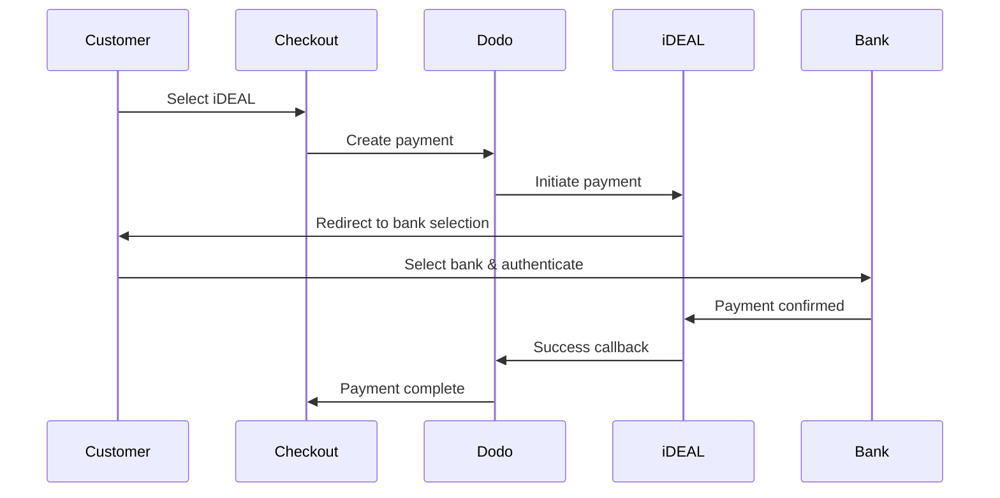

यूरोपीय ग्राहक अपने बैंकिंग सिस्टम के साथ एकीकृत स्थानीय भुगतान विधियों को प्राथमिकता देते हैं। इन विधियों की पेशकश करने से लक्षित बाजारों में रूपांतरण दर 20-40% बढ़ सकती है।

## स्थानीय यूरोपीय भुगतान विधियाँ क्यों?

<CardGroup cols={3}>
{/* LOCKED_PATTERN_efcf455d16a3d54177d3ce475c882342 */}
iDEAL डच ऑनलाइन भुगतान का लगभग 60% हिस्सा लेता है। इसे नहीं देने का मतलब है ग्राहकों को खो देना।
</Card>

{/* LOCKED_PATTERN_6b22bf3bf0cf724ac8ed217c65843a32 */}
बैंक प्रमाणित भुगतान में लगभग शून्य धोखाधड़ी दर होती है और कोई चार्जबैक नहीं होता।
</Card>

{/* LOCKED_PATTERN_4a1acead7202a8a596c7a76e46cacb00 */}
अधिकांश यूरोपीय विधियाँ तत्काल भुगतान पुष्टि प्रदान करती हैं।
</Card>
</CardGroup>

## समर्थित विधियाँ

| विधि | देश | बाजार हिस्सेदारी | मुद्रा | सदस्यताएँ |
| :----- | :------ | :----------- | :------- | :-----------: |
| **iDEAL** | नीदरलैंड्स | ~60% | EUR | नहीं |
| **Bancontact** | बेल्जियम | ~50% | EUR | नहीं |
| **EPS** | ऑस्ट्रिया | ~30% | EUR | नहीं |
| **Multibanco** | पुर्तगाल | ~40% | EUR | नहीं |

## iDEAL (नीदरलैंड्स)

iDEAL नीदरलैंड्स में प्रमुख ऑनलाइन भुगतान विधि है, जो सभी प्रमुख डच बैंकों से सीधे जुड़ी है।

### यह कैसे काम करता है



### समर्थित बैंक

सभी प्रमुख डच बैंक समर्थित हैं:
- ABN AMRO
- ASN बैंक
- Bunq
- ING
- Knab
- Rabobank
- RegioBank
- Revolut
- SNS
- Triodos बैंक
- Van Lanschot

### कॉन्फ़िगरेशन

```javascript
const session = await client.checkoutSessions.create({
  product_cart: [{ product_id: 'prod_123', quantity: 1 }],
  allowed_payment_method_types: ['ideal', 'credit', 'debit'],
  billing_currency: 'EUR',
  billing_address: {
    country: 'NL',
    zipcode: '1012JS'
  },
  return_url: 'https://example.com/success'
});
```

## Bancontact (बेल्जियम)

Bancontact बेल्जियम की राष्ट्रीय भुगतान योजना है, जिसका उपयोग लगभग सभी बेल्जियाई बैंकों द्वारा ऑनलाइन भुगतान के लिए किया जाता है।

### विशेषताएँ
- मौजूदा बेल्जीयम डेबिट कार्ड के साथ काम करता है
- मोबाइल ऐप समर्थन (Payconiq द्वारा Bancontact)
- तत्काल भुगतान पुष्टि
- ग्राहकों के लिए कोई अतिरिक्त पंजीकरण की आवश्यकता नहीं

### कॉन्फ़िगरेशन

```javascript
const session = await client.checkoutSessions.create({
  product_cart: [{ product_id: 'prod_123', quantity: 1 }],
  allowed_payment_method_types: ['bancontact_card', 'credit', 'debit'],
  billing_currency: 'EUR',
  billing_address: {
    country: 'BE',
    zipcode: '1000'
  },
  return_url: 'https://example.com/success'
});
```

## EPS (ऑस्ट्रिया)

EPS (इलेक्ट्रॉनिक भुगतान मानक) ऑस्ट्रियाई ग्राहकों के लिए सीधे ऑनलाइन बैंक ट्रांसफर की अनुमति देता है।

### विशेषताएँ
- ऑस्ट्रियाई बैंकों के साथ सीधा एकीकरण
- वास्तविक समय भुगतान पुष्टि
- ऑस्ट्रियाई उपभोक्ताओं के बीच उच्च विश्वास
- कोई चार्जबैक नहीं

### समर्थित बैंक

प्रमुख ऑस्ट्रियाई बैंक जिनमें शामिल हैं:
- Erste बैंक
- बैंक ऑस्ट्रिया
- Raiffeisen
- BAWAG
- Volksbank

### कॉन्फ़िगरेशन

```javascript
const session = await client.checkoutSessions.create({
  product_cart: [{ product_id: 'prod_123', quantity: 1 }],
  allowed_payment_method_types: ['eps', 'credit', 'debit'],
  billing_currency: 'EUR',
  billing_address: {
    country: 'AT',
    zipcode: '1010'
  },
  return_url: 'https://example.com/success'
});
```

## Multibanco (पुर्तगाल)

Multibanco पुर्तगाल का इंटरबैंक नेटवर्क है, जो ऑनलाइन भुगतान और एटीएम-आधारित भुगतान दोनों की पेशकश करता है।

### भुगतान विकल्प

1. **ऑनलाइन बैंकिंग** — इंटरनेट बैंकिंग के माध्यम से सीधे बैंक ट्रांसफर
2. **एटीएम भुगतान** — ग्राहक किसी भी Multibanco एटीएम पर भुगतान करने के लिए एक संदर्भ प्राप्त करता है
3. **मोबाइल बैंकिंग** — बैंक मोबाइल ऐप्स के माध्यम से भुगतान

### एटीएम भुगतान कैसे काम करता है

एटीएम भुगतानों के लिए, ग्राहकों को एक भुगतान संदर्भ प्राप्त होता है:

```
Entity: 12345
Reference: 123 456 789
Amount: €50.00
Expiry: 24 hours
```

ग्राहक इस संदर्भ का उपयोग करते हुए किसी भी पुर्तगाली एटीएम या ऑनलाइन बैंकिंग के माध्यम से भुगतान कर सकते हैं।

### कॉन्फ़िगरेशन

```javascript
const session = await client.checkoutSessions.create({
  product_cart: [{ product_id: 'prod_123', quantity: 1 }],
  allowed_payment_method_types: ['multibanco', 'credit', 'debit'],
  billing_currency: 'EUR',
  billing_address: {
    country: 'PT',
    zipcode: '1000-001'
  },
  return_url: 'https://example.com/success'
});
```

<Note>
Multibanco ATM भुगतान में चेकआउट और वास्तविक भुगतान के बीच देरी हो सकती है। भुगतान पुष्टि के लिए वेबहुक की निगरानी करें।
</Note>

## API विधि प्रकार

| प्रकार | विधि | देश |
| :--- | :----- | :------ |
| `ideal` | iDEAL | Netherlands |
| `bancontact_card` | Bancontact | Belgium |
| `eps` | EPS | Austria |
| `multibanco` | Multibanco | Portugal |

## बहु-देशीय यूरोपीय चेकआउट

कई यूरोपीय देशों की सेवा करने वाले व्यवसायों के लिए, सभी क्षेत्रीय विधियों को शामिल करें:

```javascript
const session = await client.checkoutSessions.create({
  product_cart: [{ product_id: 'prod_123', quantity: 1 }],
  allowed_payment_method_types: [
    'ideal',           // Netherlands
    'bancontact_card', // Belgium
    'eps',             // Austria
    'multibanco',      // Portugal
    'credit',          // Fallback
    'debit'            // Fallback
  ],
  billing_currency: 'EUR',
  return_url: 'https://example.com/success'
});
```

Dodo स्वचालित रूप से केवल प्रासंगिक विधियों को ग्राहक के स्थान के आधार पर दिखाता है। एक डच ग्राहक iDEAL देखेगा; एक बेल्जियन ग्राहक Bancontact देखेगा।

## परीक्षण

यूरोपीय भुगतान विधियों का परीक्षण सैंडबॉक्स मोड में किया जा सकता है। परीक्षण प्रवाह बैंक प्रमाणीकरण प्रक्रिया का अनुकरण करता है।

<Steps>
{/* LOCKED_PATTERN_540056f13df545529727751bb5b93f77 */}
अपने Dodo Payments परीक्षण API कुंजियाँ उपयोग करें।
</Step>

{/* LOCKED_PATTERN_7920d15f7caeeea70ea62bd0d8d57403 */}
भुगतान विधि से मिलाने हेतु बिलिंग पता देश सेट करें:
- `NL` iDEAL के लिए
- `BE` Bancontact के लिए
- `AT` EPS के लिए
- `PT` Multibanco के लिए
</Step>

{/* LOCKED_PATTERN_69cef9ebb6025284f3e6858b286f99d9 */}
परीक्षण वातावरण में अनुकरण किए गए बैंक प्रमाणीकरण प्रवाह का पालन करें।
</Step>
</Steps>

## सर्वोत्तम प्रथाएँ

<AccordionGroup>
{/* LOCKED_PATTERN_6e39e352c5d82a18aefb4abc54215eac */}
यदि आप डच ग्राहकों को बेचते हैं, तो iDEAL शामिल करें। ऐसा न करने पर यह ऐसे होगा जैसे अमेरिका में वीज़ा स्वीकार न करना — आप महत्वपूर्ण बिक्री खो देंगे।
</Accordion>

{/* LOCKED_PATTERN_9c635a5b2c09ad8acceb0ae222fad819 */}
यूरोपीय भुगतान विधियाँ EUR की मांग करती हैं। सुनिश्चित करें कि आपकी मूल्य निर्धारण यूरो लेनदेन का समर्थन करती है।
</Accordion>

{/* LOCKED_PATTERN_5a50cae3439b9921374aaa8c0461b4a3 */}
सभी यूरोपीय विधियाँ बैंक साइटों पर रीडायरेक्ट करती हैं। सुनिश्चित करें कि आपके रिटर्न URL का संचालन मजबूत है और उन उपयोगकर्ताओं को ध्यान में रखता है जो प्रवाह के मध्य में छोड़ देते हैं।
</Accordion>

{/* LOCKED_PATTERN_3a32b87fb89df99c7fb6cbcd532fcd01 */}
सभी यूरोपीय ग्राहकों को ये क्षेत्रीय विधियाँ उपलब्ध नहीं होतीं (पर्यटक, प्रवासी आदि)। हमेशा `credit` और `debit` को बैकअप के रूप में शामिल करें।
</Accordion>

{/* LOCKED_PATTERN_f4321c6674f862219007fe7c6201edc2 */}
Multibanco ATM भुगतान पूरा होने में घंटों लग सकते हैं। तत्काल भुगतान पर पूर्ति को अवरुद्ध न करें — असिंक्रोनस पुष्टि के लिए वेबहुक का उपयोग करें।
</Accordion>
</AccordionGroup>

## समस्या निवारण

<AccordionGroup>
{/* LOCKED_PATTERN_ccd66af742dc9530dea0480f544f049c */}
**जांचें:**
1. क्या ग्राहक का बिलिंग देश विधि के देश से मेल खाता है?
2. क्या मुद्रा EUR पर सेट है?
3. क्या विधि `allowed_payment_method_types` में शामिल है?

**समाधान:** यूरोपीय विधियाँ सख्ती से क्षेत्रीय होती हैं। बिलिंग देश `DE` (जर्मनी) वाला ग्राहक iDEAL नहीं देखेगा, जो केवल नीदरलैंड्स में उपलब्ध है।
</Accordion>

{/* LOCKED_PATTERN_e65da29a30abf8b0bab16429c0abbf51 */}
**कारण:**
- ग्राहक ने बैंक प्रमाणीकरण के दौरान रद्द किया
- बैंक की प्रमाणीकरण प्रणाली अस्थायी रूप से उपलब्ध नहीं थी
- ग्राहक ने गलत प्रमाण-पत्र दर्ज किए

**समाधान:** ग्राहक को पुनः प्रयास करना चाहिए। यदि समस्या बनी रहती है, तो एक अलग भुगतान विधि आज़माने का सुझाव दें।
</Accordion>

{/* LOCKED_PATTERN_6ec718ef8b359d908bb220922e56ef7a */}
**कारण:**
- ग्राहक ने बैंक रीडायरेक्ट के दौरान ब्राउज़र बंद किया
- प्रमाणीकरण के दौरान नेटवर्क समस्या
- रिटर्न URL गलत तरीके से कॉन्फ़िगर किया गया

**समाधान:** सुनिश्चित करें कि रिटर्न URL सही और पहुँच योग्य है। यह दोनों सफलता और विफलता स्थितियों को संभाले।
</Accordion>

{/* LOCKED_PATTERN_fc8a3a43e2635e2d30bc6ced94d88e30 */}
**कारण:** ग्राहक को भुगतान संदर्भ मिला है लेकिन उसने अभी तक भुगतान नहीं किया है।

**समाधान:** यह ATM आधारित भुगतानों के लिए अपेक्षित है। वेबहुक पुष्टि की प्रतीक्षा करें। संदर्भ आमतौर पर 24-72 घंटों में समाप्त हो जाता है।
</Accordion>
</AccordionGroup>

## PSD2 अनुपालन

सभी यूरोपीय भुगतान विधियाँ PSD2 (पेयमेंट सर्विसेज डायरेक्टिव 2) नियमों का पालन करती हैं:

- **मजबूत ग्राहक प्रमाणीकरण (SCA)** — बैंक प्रमाणीकरण प्रवाह में अंतर्निहित
- **सुरक्षित संचार** — सभी डेटा सुरक्षित चैनलों के माध्यम से संचारित किया जाता है
- **उपभोक्ता संरक्षण** — EU उपभोक्ता अधिकारों के साथ पूर्ण रूप से अनुपालन

## संबंधित पृष्ठ

<CardGroup cols={2}>
{/* LOCKED_PATTERN_014d7e4ef5d99df996cbbae24da710a6 */}
सभी समर्थित भुगतान विधियाँ देखें।
</Card>

{/* LOCKED_PATTERN_0da642f750ba9399c6c82f3cf51c812c */}
मुद्रा समर्थन और स्वचालित रूपांतरण।
</Card>

{/* LOCKED_PATTERN_15f99901a394e4ce133a078d90e6360d */}
पूर्ण चेकआउट कार्यान्वयन मार्गदर्शिका।
</Card>

{/* LOCKED_PATTERN_4fdc255b113f889a339d4227d31c920b */}
भुगतान पुष्टियों को असिंक्रोनस रूप से संभालें।
</Card>
</CardGroup>