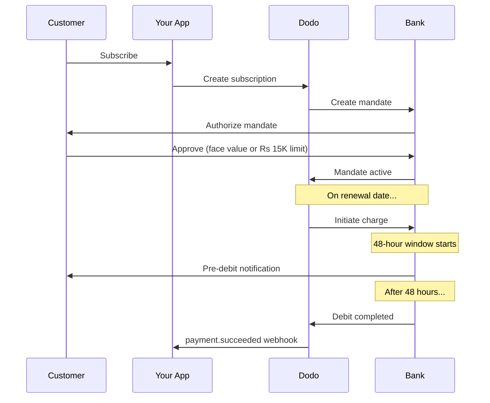

भारत की भुगतान अवसंरचना UPI (60%+ डिजिटल लेनदेन) और रुपे कार्ड द्वारा संचालित होती है। डोडो पेमेंट्स दोनों को RBI अनुरूपता के साथ सब्सक्रिप्शन मण्डेट के लिए समर्थन देता है।

## भारत भुगतान विधियाँ क्यों महत्वपूर्ण हैं

<CardGroup cols={3}>
<Card title="UPI Dominance" icon="mobile">
UPI हर माह 10B+ लेनदेन संसाधित करता है। कई भारतीय ग्राहकों के पास अंतरराष्ट्रीय कार्ड नहीं होते।
</Card>

<Card title="Low Transaction Costs" icon="indian-rupee-sign">
UPI की लेनदेन शुल्क लगभग शून्य है। उच्च मात्रा, कम मूल्य के लेनदेन के लिए उत्तम।
</Card>

<Card title="Subscription Support" icon="repeat">
अधिकांश वैकल्पिक भुगतान विधियों के विपरीत, UPI और रुपे RBI मण्डेट के माध्यम से आवर्ती भुगतानों का समर्थन करती हैं।
</Card>
</CardGroup>

## समर्थित विधियाँ

| विधि | प्रकार | सब्सक्रिप्शन | न्यूनतम राशि |
| :----- | :--- | :-----------: | :--------- |
| **UPI Collect** | QR कोड / VPA | हाँ* | ₹1 |
| **Rupay Credit** | कार्ड | हाँ* | ₹1 |
| **Rupay Debit** | कार्ड | हाँ* | ₹1 |

*सब्सक्रिप्शन को विशेष प्रोसेसिंग नियमों के साथ RBI-अनुरूप मण्डेट की आवश्यकता होती है।

## विन्यास

### API विधि प्रकार

| प्रकार | विवरण |
| :--- | :---------- |
| `upi_collect` | QR कोड या VPA प्रविष्टि के माध्यम से UPI |
| `credit` | रुपे सहित क्रेडिट कार्ड |
| `debit` | रुपे सहित डेबिट कार्ड |

### उदाहरण: भारत-केंद्रित चेकआउट

```javascript
const session = await client.checkoutSessions.create({
  product_cart: [{ product_id: 'prod_123', quantity: 1 }],
  allowed_payment_method_types: [
    'upi_collect',
    'credit',
    'debit'
  ],
  billing_currency: 'INR',
  customer: {
    email: 'customer@example.in',
    name: 'Priya Sharma',
    phone_number: '+919876543210'
  },
  billing_address: {
    country: 'IN',
    zipcode: '560001'
  },
  return_url: 'https://example.com/success'
});
```

### UPI के लिए आवश्यकताएँ

चेकआउट पर UPI दिखाने के लिए:
1. **बिलिंग देश** भारत होना चाहिए (`IN`)
2. **मुद्रा** INR होनी चाहिए
3. गैर-भारतीय व्यापारियों के लिए: **Adaptive Currency** सक्षम होना चाहिए

<Warning>
यदि आप गैर-भारतीय व्यापारी हैं और Adaptive Currency सक्षम नहीं है, तो आपके ग्राहकों के लिए UPI उपलब्ध नहीं होगा।
</Warning>

## RBI मण्डेट के साथ सब्सक्रिप्शन

भारतीय भुगतान विधि सब्सक्रिप्शन RBI (भारतीय रिज़र्व बैंक) नियमों के अधीन एक विशिष्ट आवश्यकताओं के साथ संचालित होते हैं।

### RBI मण्डेट कैसे काम करते हैं



### मण्डेट प्रकार

| सब्सक्रिप्शन राशि | मण्डेट प्रकार | सीमा |
| :------------------ | :----------- | :---- |
| **15,000 रु. से नीचे** | ऑन-डिमांड मण्डेट | 15,000 रु. |
| **15,000 रु. या उससे ऊपर** | फिक्स्ड-एमाउंट मण्डेट | सटीक सब्सक्रिप्शन राशि |

**योजना परिवर्तन के लिए महत्वपूर्ण:** यदि अपग्रेड के कारण नया शुल्क मौजूदा मण्डेट सीमा से अधिक हो जाता है, तो शुल्क विफल हो जाएगा और ग्राहक को पुनः अधिकृत करना होगा।

### 48-घंटे की प्रोसेसिंग देरी

यह अंतरराष्ट्रीय कार्ड भुगतानों से सबसे बड़ा अंतर है:

<Steps>
<Step title="Charge Initiated (Day 0)">
निर्धारित नवीनीकरण तिथि पर, डोडो बैंक के साथ शुल्क आरंभ करता है।
</Step>

<Step title="Pre-Debit Notification">
ग्राहक को उनके बैंक से आगामी डेबिट के बारे में सूचना प्राप्त होती है।
</Step>

<Step title="48-Hour Window">
ग्राहक इस अवधि के दौरान अपने बैंकिंग ऐप के माध्यम से मण्डेट रद्द कर सकता है।
</Step>

<Step title="Debit Completed (~48-51 hours)">
48 घंटे के बाद (बैंक प्रोसेसिंग के लिए अतिरिक्त 3 घंटे तक) धनराशि डेबिट हो जाती है।
</Step>

<Step title="Webhook Sent">
`payment.succeeded` वेबहुक वास्तविक डेबिट के बाद भेजा जाता है, आरंभ के समय नहीं।
</Step>
</Steps>

<Warning>
**शुल्क आरंभ होने पर लाभ न दें।** `payment.succeeded` वेबहुक का इंतजार करें, जो निर्धारित शुल्क तिथि के लगभग 48-51 घंटे बाद आता है।
</Warning>

### 48-घंटे की खिड़की को संभालना

```javascript
// DON'T do this:
async function handleSubscriptionRenewal(subscription) {
  // ❌ Bad: Granting access immediately when charge is initiated
  grantPremiumAccess(subscription.customer_id);
}

// DO this:
async function handlePaymentWebhook(event) {
  if (event.type === 'payment.succeeded') {
    // ✅ Good: Only grant access after payment is confirmed
    grantPremiumAccess(event.data.customer_id);
  }
  
  if (event.type === 'payment.failed') {
    // Handle failed payment (mandate cancelled, insufficient funds)
    revokePremiumAccess(event.data.customer_id);
  }
}
```

### भारतीय सब्सक्रिप्शन के लिए वेबहुक ईवेंट

| ईवेंट | कब | कार्रवाई |
| :---- | :--- | :----- |
| `subscription.created` | मण्डेट अधिकृत | सब्सक्रिप्शन शुरू रिकॉर्ड करें |
| `payment.succeeded` | शुल्क तिथि के ~48 घंटे बाद | एक्सेस प्रदान/जारी रखें |
| `payment.failed` | डेबिट विफल | ग्राहक को सूचित करें, एक्सेस रोकें |
| `subscription.on_hold` | भुगतान विफल | भुगतान विधि अपडेट करने के लिए कहें |
| `subscription.active` | भुगतान के बाद पुनः सक्रिय | एक्सेस बहाल करें |

## परीक्षण

### UPI परीक्षण आईडी

| स्थिति | UPI ID |
| :----- | :----- |
| सफल | `success@upi` |
| विफल | `failure@upi` |

### भारतीय कार्ड परीक्षण संख्या

| ब्रांड | परिदृश्य | कार्ड नंबर | समाप्ति | CVV |
| :---- | :------- | :---------- | :----- | :-- |
| Visa | सफल | `4576238912771450` | 06/32 | 123 |
| Visa | अस्वीकृत | `4706131211212123` | 06/32 | 123 |
| Mastercard | सफल | `5409162669381034` | 06/32 | 123 |
| Mastercard | अस्वीकृत | `5105105105105100` | 06/32 | 123 |

## सर्वोत्तम अभ्यास

<AccordionGroup>
<Accordion title="Plan for the 48-hour delay">
अपने एप्लिकेशन को शुल्क आरंभ होने और वास्तविक भुगतान के बीच अंतर को संभालने के लिए बनाएं। विचार करें:
- सब्सक्रिप्शन एक्सेस के लिए गरस समय
- प्रोसेसिंग समय के बारे में ग्राहकों को स्पष्ट संवाद
- वेबहुक-संचालित पूर्ति, तारीख-संचालित नहीं
</Accordion>

<Accordion title="Handle mandate cancellations">
ग्राहक कभी भी अपने बैंक ऐप के माध्यम से मण्डेट रद्द कर सकते हैं। `subscription.on_hold` वेबहुक पर नजर रखें और ग्राहकों को पुनः सदस्यता लेने या भुगतान विधि अपडेट करने के लिए प्रोत्साहित करें।
</Accordion>

<Accordion title="Set appropriate mandate amounts">
परिवर्तनीय मूल्य निर्धारण (उदा. उपयोग-आधारित) के लिए, विचार करें कि 15,000 रु. का ऑन-डिमांड मण्डेट पर्याप्त है या नहीं। यदि शुल्क इससे अधिक हो सकते हैं, तो ग्राहकों को पुनः अधिकृत होना पड़ेगा।
</Accordion>

<Accordion title="Offer UPI prominently">
भारतीय ग्राहकों के लिए, UPI प्राथमिक भुगतान विकल्प होना चाहिए। कई उपयोगकर्ता परिचितता और कम अड़चन के कारण इसे कार्ड से प्राथमिकता देते हैं।
</Accordion>
</AccordionGroup>

## समस्या निवारण

<AccordionGroup>
<Accordion title="UPI not appearing at checkout">
**जांच:**
1. बिलिंग देश `IN` सेट है?
2. मुद्रा `INR` सेट है?
3. यदि गैर-भारतीय व्यापारी: Adaptive Currency सक्षम है?
4. `upi_collect` `allowed_payment_method_types` में शामिल है?

**समाधान:** सत्यापित करें कि बिलिंग पता `country: "IN"` और `billing_currency: "INR"` है।
</Accordion>

<Accordion title="Subscription charge failed after upgrade">
**कारण:** नया शुल्क राशि मौजूदा मण्डेट सीमा (15,000 रु. सीमा) से अधिक है।

**समाधान:** ग्राहक को सही सीमा के साथ नया मण्डेट स्थापित करने के लिए भुगतान विधि अपडेट करनी चाहिए।
</Accordion>

<Accordion title="Subscription on hold but customer claims they didn't cancel">
**कारण:** ग्राहक ने 48-घंटे की खिड़की के दौरान मण्डेट रद्द किया हो सकता है, या उनके बैंक ने डेबिट अस्वीकृत कर दिया होगा।

**समाधान:** ग्राहक को मण्डेट पुनः अधिकृत करने या भुगतान विधि अपडेट करने की आवश्यकता है।
</Accordion>

<Accordion title="Payment deduction delayed beyond 48 hours">
**कारण:** बैंक API विलंब प्रोसेसिंग को 2-3 अतिरिक्त घंटे तक बढ़ा सकते हैं।

**समाधान:** यह अपेक्षित है। अपने सिस्टम को कुल ~51 घंटे तक के चर विलंब को संभालने के लिए निर्मित करें।
</Accordion>

<Accordion title="Mandate cancelled but subscription still active">
**कारण:** RBI नियमों में एक एज केस — प्रोसेसिंग विंडो के दौरान मण्डेट रद्द करने से सब्सक्रिप्शन तुरंत रद्द नहीं होता।

**समाधान:** अगला शुल्क विफल होगा और सब्सक्रिप्शन `on_hold` में चला जाएगा। `payment.failed` वेबहुक पर निगरानी रखें।
</Accordion>
</AccordionGroup>

## संबंधित पृष्ठ

<CardGroup cols={2}>
<Card title="Payment Methods Overview" icon="credit-card" href="/features/payment-methods">
सभी समर्थित भुगतान विधियाँ देखें।
</Card>

<Card title="Subscriptions" icon="repeat" href="/features/subscription">
RBI मण्डेट सहित पूर्ण सब्सक्रिप्शन दस्तावेज़ीकरण।
</Card>

<Card title="Webhooks" icon="webhook" href="/developer-resources/webhooks">
भुगतान ईवेंट्स के लिए वेबहुक हैंडलिंग।
</Card>

<Card title="Testing Process" icon="flask" href="/miscellaneous/testing-process">
सभी परीक्षण डेटा सहित UPI ID और भारतीय कार्ड।
</Card>
</CardGroup>