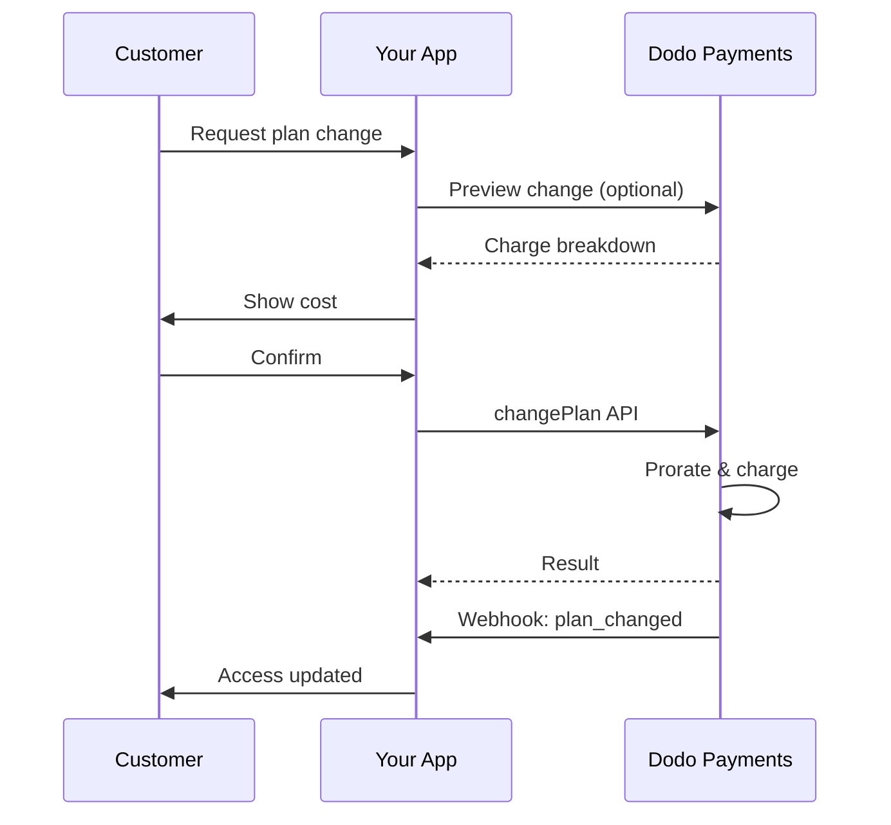
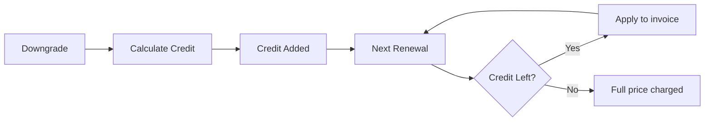

<Info>
सब्सक्रिप्शन आपको स्वचालित नवीनीकरण के साथ लगातार एक्सेस बेचने देता है। लचीले बिलिंग चक्र, मुफ्त ट्रायल, प्लान परिवर्तन और ऐड-ऑन का उपयोग करके प्रत्येक ग्राहक के लिए मूल्य निर्धारण को अनुकूलित करें।
</Info>

<CardGroup cols={2}>
<Card title="Upgrade & Downgrade" icon="repeat" href="/developer-resources/subscription-upgrade-downgrade">
प्रोरेशन और मात्रा अपडेट के साथ प्लान परिवर्तनों को नियंत्रित करें।
</Card>

<Card title="On‑Demand Subscriptions" icon="bolt" href="/developer-resources/ondemand-subscriptions">
एक आदेश को अभी अधिकृत करें और बाद में कस्टम राशि के साथ चार्ज करें।
</Card>

<Card title="Customer Portal" icon="id-card" href="/features/customer-portal">
ग्राहक योजना, बिलिंग और रद्द करने का प्रबंधन खुद कर सकें।
</Card>

<Card title="Subscription Webhooks" icon="code" href="/developer-resources/webhooks/intents/subscription">
बनाए गए, नवीनीकृत और रद्द किए गए जैसे जीवनचक्र इवेंट्स पर प्रतिक्रिया दें।
</Card>
</CardGroup>

## सदस्यताएँ क्या हैं?

सदस्यताएँ आवर्ती उत्पाद हैं जिन्हें ग्राहक एक कार्यक्रम पर खरीदते हैं। ये निम्नलिखित के लिए आदर्श हैं:

- **SaaS लाइसेंस**: ऐप्स, APIs, या प्लेटफ़ॉर्म पहुंच
- **सदस्यताएँ**: समुदाय, कार्यक्रम, या क्लब
- **डिजिटल सामग्री**: पाठ्यक्रम, मीडिया, या प्रीमियम सामग्री
- **समर्थन योजनाएँ**: SLA, सफलता पैकेज, या रखरखाव

## प्रमुख लाभ

- **पूर्वानुमानित राजस्व**: स्वचालित नवीनीकरण के साथ आवर्ती बिलिंग
- **लचीले चक्र**: मासिक, वार्षिक, कस्टम अंतराल, और परीक्षण
- **योजना चपलता**: अपग्रेड और डाउनग्रेड के लिए प्रोरशन
- **ऐड-ऑन और सीटें**: वैकल्पिक, मात्रात्मक अपग्रेड संलग्न करें
- **सहज चेकआउट**: होस्टेड चेकआउट और ग्राहक पोर्टल
- **डेवलपर-प्रथम**: निर्माण, परिवर्तन, और उपयोग ट्रैकिंग के लिए स्पष्ट APIs

## सदस्यताएँ बनाना

अपने डोडो पेमेंट्स डैशबोर्ड में सदस्यता उत्पाद बनाएं, फिर उन्हें चेकआउट या अपने API के माध्यम से बेचें। सक्रिय सदस्यताओं से उत्पादों को अलग करना आपको मूल्य निर्धारण को संस्करणित करने, ऐड-ऑन संलग्न करने, और प्रदर्शन को स्वतंत्र रूप से ट्रैक करने की अनुमति देता है।

### सदस्यता उत्पाद निर्माण

डैशबोर्ड में फ़ील्ड कॉन्फ़िगर करें ताकि यह परिभाषित किया जा सके कि आपकी सदस्यता कैसे बेची जाती है, नवीनीकरण होती है, और बिल की जाती है। नीचे के अनुभाग सीधे निर्माण फ़ॉर्म में जो आप देखते हैं, से मेल खाते हैं।

#### उत्पाद विवरण

- **उत्पाद नाम** (आवश्यक): चेकआउट, ग्राहक पोर्टल, और चालानों में प्रदर्शित नाम।
- **उत्पाद विवरण** (आवश्यक): एक स्पष्ट मूल्य वक्तव्य जो चेकआउट और चालानों में दिखाई देता है।
- **उत्पाद छवि** (आवश्यक): PNG/JPG/WebP 3 MB तक। चेकआउट और चालानों पर उपयोग किया जाता है।
- **ब्रांड**: थीमिंग और ईमेल के लिए उत्पाद को एक विशिष्ट ब्रांड से जोड़ें।
- **कर श्रेणी** (आवश्यक): कर नियम निर्धारित करने के लिए श्रेणी चुनें (उदाहरण के लिए, SaaS)।

<Tip>
सही कर संग्रह सुनिश्चित करने के लिए सबसे सटीक कर श्रेणी चुनें।
</Tip>

#### मूल्य निर्धारण

- **मूल्य निर्धारण प्रकार**: <b>सदस्यता</b> चुनें (यह गाइड)। विकल्प हैं एकल भुगतान और उपयोग आधारित बिलिंग।
- **मूल्य** (आवश्यक): मुद्रा के साथ आधार आवर्ती मूल्य।
- **छूट लागू (%)**: आधार मूल्य पर लागू वैकल्पिक प्रतिशत छूट; चेकआउट और चालानों में दर्शाई गई।
- **हर** (आवश्यक): नवीनीकरण के लिए अंतराल, जैसे, हर 1 महीना। ताल (महीने या वर्ष) और मात्रा चुनें।
- **सदस्यता अवधि** (आवश्यक): कुल अवधि जिसके लिए सदस्यता सक्रिय रहती है (जैसे, 10 वर्ष)। इस अवधि के समाप्त होने के बाद, नवीनीकरण रुक जाते हैं जब तक कि इसे बढ़ाया न जाए।
- **परीक्षण अवधि दिन** (आवश्यक): दिनों में परीक्षण की लंबाई सेट करें। परीक्षणों को अक्षम करने के लिए 0 का उपयोग करें। पहली चार्ज स्वचालित रूप से तब होती है जब परीक्षण समाप्त होता है।
- **ऐड-ऑन चुनें**: 10 तक के ऐड-ऑन संलग्न करें जिन्हें ग्राहक आधार योजना के साथ खरीद सकते हैं।

<Warning>
एक सक्रिय उत्पाद पर मूल्य निर्धारण बदलने से नए खरीदारी प्रभावित होती है। मौजूदा सब्सक्रिप्शन आपके प्लान-चेंज और प्रोरेशन सेटिंग्स का पालन करते हैं।
</Warning>

<Info>
ऐड-ऑन सीटों या स्टोरेज जैसे मापने योग्य अतिरिक्तों के लिए आदर्श होते हैं। जब ग्राहक उन्हें बदलते हैं, तो आप अनुमत मात्रा और प्रोरेशन व्यवहार को नियंत्रित कर सकते हैं।
</Info>

#### उन्नत सेटिंग्स

- **कर समावेशी मूल्य निर्धारण**: लागू करों सहित मूल्य प्रदर्शित करें। अंतिम कर गणना अभी भी ग्राहक के स्थान के अनुसार भिन्न होती है।
- **लाइसेंस कुंजी उत्पन्न करें**: प्रत्येक ग्राहक को खरीद के बाद एक अद्वितीय कुंजी जारी करें। <a href="/features/license-keys">लाइसेंस कुंजी</a> गाइड देखें।
- **डिजिटल उत्पाद वितरण**: खरीद के बाद फ़ाइलें या सामग्री स्वचालित रूप से वितरित करें। <a href="/features/digital-product-delivery">डिजिटल उत्पाद वितरण</a> में और जानें।
- **मेटाडेटा**: आंतरिक टैगिंग या क्लाइंट एकीकरण के लिए कस्टम कुंजी-मूल्य जोड़े। <a href="/api-reference/metadata">मेटाडेटा</a> देखें।

<Tip>
मेटाडेटा का उपयोग अपने सिस्टम (जैसे accountId) से पहचानकर्ता संग्रहीत करने के लिए करें ताकि आप बाद में ईवेंट्स और चालानों का मिलान कर सकें।
</Tip>

## सदस्यता परीक्षण

परीक्षण ग्राहकों को बिना तत्काल भुगतान के सदस्यताओं तक पहुंच प्रदान करते हैं। पहली चार्ज स्वचालित रूप से तब होती है जब परीक्षण समाप्त होता है।

### परीक्षण कॉन्फ़िगर करना

उत्पाद मूल्य निर्धारण अनुभाग में **Trial Period Days** सेट करें (अक्षम करने के लिए `0` का उपयोग करें)। आप सब्सक्रिप्शन बनाते समय इसे अधिलेखित कर सकते हैंः

```typescript
// Via subscription creation
const subscription = await client.subscriptions.create({
  customer_id: 'cus_123',
  product_id: 'prod_monthly',
  trial_period_days: 14  // Overrides product's trial period
});

// Via checkout session
const session = await client.checkoutSessions.create({
  product_cart: [{ product_id: 'prod_monthly', quantity: 1 }],
  subscription_data: { trial_period_days: 14 }
});
```

<Warning>
`trial_period_days` मान 0 से 10,000 दिनों के बीच होना चाहिए।
</Warning>

### परीक्षण स्थिति का पता लगाना

<Warning>
वर्तमान में ट्रायल स्थिति पता करने के लिए कोई प्रत्यक्ष फ़ील्ड नहीं है। निम्नलिखित एक वर्कअराउंड है जिसमें भुगतान क्वेरी करना होता है, जो अकार्यक्षम है। हम एक अधिक कुशल समाधान पर काम कर रहे हैं।
</Warning>

यह निर्धारित करने के लिए कि क्या सदस्यता परीक्षण में है, सदस्यता के लिए भुगतान की सूची प्राप्त करें। यदि एक ही भुगतान है जिसकी राशि 0 है, तो सदस्यता परीक्षण अवधि में है:

```typescript
const subscription = await client.subscriptions.retrieve('sub_123');
const payments = await client.payments.list({
  subscription_id: subscription.subscription_id
});

// Check if subscription is in trial
const isInTrial = payments.items.length === 1 && 
                  payments.items[0].total_amount === 0;
```

### परीक्षण अवधि को अपडेट करना

`next_billing_date` को अपडेट करके ट्रायल बढ़ाएं:


```typescript
await client.subscriptions.update('sub_123', {
  next_billing_date: '2025-02-15T00:00:00Z'  // New trial end date
});
```

<Warning>
`next_billing_date` को अतीत का समय नहीं सेट कर सकते। दिनांक भविष्य में होना चाहिए।
</Warning>

## सदस्यता योजना परिवर्तन

योजना परिवर्तन आपको सदस्यताओं को अपग्रेड या डाउनग्रेड करने, मात्राएँ समायोजित करने, या विभिन्न उत्पादों में माइग्रेट करने की अनुमति देते हैं। प्रत्येक परिवर्तन आपके द्वारा चुने गए प्रोरशन मोड के आधार पर तत्काल शुल्क को ट्रिगर करता है।

<Tip>
आप Dodo Payments डैशबोर्ड से सीधे सब्सक्रिप्शन प्लान बदल सकते हैं और अगले बिलिंग दिनांक को अपडेट कर सकते हैं। यह ग्राहक सहायता अनुरोधों, प्रोमोशनल अपग्रेड, या प्लान माइग्रेशन के लिए API कॉल किए बिना सब्सक्रिप्शन समायोजित करने का एक त्वरित तरीका प्रदान करता है।
</Tip>

<Tip>
**स्वयं सेवा प्लान परिवर्तनों को सक्षम करें:** क्या आप चाहते हैं कि ग्राहक Customer Portal के माध्यम से अपने स्वयं के सब्सक्रिप्शन अपग्रेड या डाउनग्रेड करें? अपने सब्सक्रिप्शन उत्पादों को एक Product Collection में जोड़ें और Subscription Settings में “Allow Subscription Updates” सक्षम करें।
</Tip>



<Card title="Product Collections" icon="layer-group" href="/features/product-collections">
  Customer Portal में निर्बाध अपग्रेड/डाउनग्रेड पाथ सक्षम करने के लिए संबंधित उत्पादों को कलेक्शनों में समूहित करें।
</Card>

### Proration Modes

जब ग्राहक प्लान बदलते हैं तो बिलिंग कैसे होती है चुनेंः

<Info>
**तीन प्रोरशन मोड्स की त्वरित तुलना:**

| | `prorated_immediately` | `difference_immediately` | `full_immediately` |
|---|---|---|---|
| **Upgrade** | शेष दिनों के आधार पर प्रोरिशन चार्ज | पूर्ण मूल्य अंतर तुरंत चार्ज | नया प्लान पूरा चार्ज |
| **Downgrade** | शेष दिनों के लिए प्रोरिशन क्रेडिट | भविष्य के नवीनीकरण के लिए पूर्ण मूल्य अंतर क्रेडिट | कोई क्रेडिट नहीं, पूरा चार्ज |
| **Billing cycle** | वही रहता है | वही रहता है | आज से रीसेट होता है |
| **Best for** | उपयोग न किए समय के लिए निष्पक्ष बिलिंग | सरल स्तर परिवर्तन | बिलिंग चक्र रीसेट |
</Info>

#### `prorated_immediately`
वर्तमान बिलिंग चक्र के शेष समय के आधार पर प्रोरिशन राशि चार्ज करता है। अप्रयुक्त समय को ध्यान में रखते हुए निष्पक्ष बिलिंग के लिए सर्वोत्तम।

```typescript
await client.subscriptions.changePlan('sub_123', {
  product_id: 'prod_pro',
  quantity: 1,
  proration_billing_mode: 'prorated_immediately'
});
```

#### `difference_immediately`
मूल्य अंतर को तुरंत चार्ज करता है (अपग्रेड) या भविष्य के नवीनीकरणों के लिए क्रेडिट जोड़ता है (डाउनग्रेड)। सरल अपग्रेड/डाउनग्रेड परिदृश्यों के लिए सर्वश्रेष्ठ।

```typescript
// Upgrade: charges $50 (difference between $30 and $80)
// Downgrade: credits remaining value, auto-applied to renewals
await client.subscriptions.changePlan('sub_123', {
  product_id: 'prod_pro',
  quantity: 1,
  proration_billing_mode: 'difference_immediately'
});
```

<Info>
`difference_immediately` का उपयोग करके डाउनग्रेड से प्राप्त क्रेडिट सब्सक्रिप्शन-स्कोप्ड होते हैं और भविष्य के नवीनीकरणों पर स्वचालित रूप से लागू होते हैं। ये <a href="/features/customer-credit">Customer Credits</a> से अलग होते हैं।
</Info>

जब ग्राहक `difference_immediately` के साथ डाउनग्रेड करते हैं, तो अप्रयुक्त मूल्य एक सब्सक्रिप्शन-स्कोप्ड क्रेडिट बन जाता है जो स्वचालित रूप से भविष्य के नवीनीकरणों को ऑफसेट करता हैः



#### `full_immediately`
शेष समय की परवाह किए बिना नया प्लान पूरा राशि तुरंत चार्ज करता है। बिलिंग चक्र रीसेट करने के लिए सर्वोत्तम।

```typescript
await client.subscriptions.changePlan('sub_123', {
  product_id: 'prod_monthly',
  quantity: 1,
  proration_billing_mode: 'full_immediately'
});
```

<AccordionGroup>
<Accordion title="Example: Prorated upgrade calculation">

**परिदृश्य**: Basic ($30/माह) पर ग्राहक 30-दिन के चक्र के दिन 16 पर `prorated_immediately` का उपयोग करके Pro ($80/माह) में अपग्रेड करता है।

```
Unused credit from Basic = $30 × (15 remaining / 30 total) = $15.00
Prorated cost of Pro     = $80 × (15 remaining / 30 total) = $40.00
────────────────────────────────────────────────────────────────────
Immediate charge         = $40.00 − $15.00 = $25.00
```

अगला नवीनीकरण मूल बिलिंग तारीख को: **$80.00/माह**।

<Tip>
अधिक विस्तृत गणना उदाहरणों और किनारे के मामलों के लिए, हमारी पूरी [Upgrade & Downgrade Guide](/developer-resources/subscription-upgrade-downgrade) देखें।
</Tip>

</Accordion>
<Accordion title="Example: Downgrade credit calculation">

**परिदृश्य**: Pro ($80/माह) पर ग्राहक `difference_immediately` का उपयोग करके Starter ($20/माह) में डाउनग्रेड करता है।

```
Credit = Old plan − New plan = $80 − $20 = $60.00
```

$60 क्रेडिट स्वचालित रूप से भविष्य के नवीनीकरणों पर लागू होता है:
- नवीनीकरण 1: $20 − $20 (क्रेडिट) = **$0.00** ($40 क्रेडिट शेष)
- नवीनीकरण 2: $20 − $20 (क्रेडिट) = **$0.00** ($20 क्रेडिट शेष)  
- नवीनीकरण 3: $20 − $20 (क्रेडिट) = **$0.00** (क्रेडिट समाप्त)
- नवीनीकरण 4: **$20.00** (पूरा मूल्य)

<Info>
क्रेडिट कैसे प्रबंधित किए जाते हैं इसके बारे में अधिक जानने के लिए [Upgrade & Downgrade Guide](/developer-resources/subscription-upgrade-downgrade) देखें।
</Info>

</Accordion>
</AccordionGroup>

### Add-ons के साथ प्लान बदलना

प्लान बदलते समय ऐड-ऑन को संशोधित करें। ऐड-ऑन प्रोरेशन गणनाओं में शामिल होते हैंः

```typescript
await client.subscriptions.changePlan('sub_123', {
  product_id: 'prod_pro',
  quantity: 1,
  proration_billing_mode: 'difference_immediately',
  addons: [{ addon_id: 'addon_extra_seats', quantity: 2 }]  // Add add-ons
  // addons: []  // Empty array removes all existing add-ons
});
```

<Info>
प्लान परिवर्तन तुरंत शुल्क उत्पन्न करते हैं। विफल शुल्क सब्सक्रिप्शन को `on_hold` स्थिति में डाल सकते हैं। `subscription.plan_changed` वेबहुक ईवेंट्स के माध्यम से परिवर्तनों को ट्रैक करें।
</Info>

### प्लान परिवर्तनों का पूर्वावलोकन

प्लान परिवर्तन को अंतिम रूप देने से पहले सटीक शुल्क और परिणामस्वरूप सब्सक्रिप्शन का पूर्वावलोकन करेंः

```typescript
const preview = await client.subscriptions.previewChangePlan('sub_123', {
  product_id: 'prod_pro',
  quantity: 1,
  proration_billing_mode: 'prorated_immediately'
});

// Show customer the charge before confirming
console.log('You will be charged:', preview.immediate_charge.summary);
```

<Card title="Preview Change Plan API" icon="eye" href="/api-reference/subscriptions/preview-change-plan">
  इन्हें प्रतिबद्ध करने से पहले प्लान परिवर्तनों का पूर्वावलोकन करें।
</Card>

## सब्सक्रिप्शन स्थितियाँ

सब्सक्रिप्शन अपने जीवनचक्र के दौरान विभिन्न स्थितियों में हो सकते हैंः

- **`active`**: सब्सक्रिप्शन सक्रिय है और स्वचालित रूप से नवीनीकृत होगा
- **`on_hold`**: भुगतान विफल होने के कारण सब्सक्रिप्शन होल्ड पर है। इसे पुनः सक्रिय करने के लिए भुगतान विधि अपडेट करना आवश्यक
- **`cancelled`**: सब्सक्रिप्शन रद्द कर दी गई है और नवीनीकृत नहीं होगा
- **`expired`**: सब्सक्रिप्शन अपनी समाप्ति तिथि पर पहुँच चुकी है
- **`pending`**: सब्सक्रिप्शन बनाई जा रही है या संसाधित की जा रही है

### ऑन होल्ड स्थिति

जब निम्नलिखित होता है तो सब्सक्रिप्शन `on_hold` स्थिति में जाता हैः

- नवीनीकरण भुगतान विफल हो जाता है (अपर्याप्त धन, एक्सपायर कार्ड, आदि)
- प्लान परिवर्तन शुल्क विफल होता है
- भुगतान विधि अधिकरण विफल होती है

<Warning>
जब सब्सक्रिप्शन `on_hold` स्थिति में होता है, यह स्वचालित रूप से नवीनीकृत नहीं होगा। आपको सब्सक्रिप्शन पुनः सक्रिय करने के लिए भुगतान विधि अपडेट करनी होगी।
</Warning>

### ऑन होल्ड से पुनः सक्रिय करना

`on_hold` स्थिति से सब्सक्रिप्शन पुनः सक्रिय करने के लिए भुगतान विधि अपडेट करें। यह स्वतः ही:


1. शेष बकाया राशि के लिए एक चार्ज बनाता है
2. एक इनवॉइस उत्पन्न करता है
3. नए भुगतान विधि का उपयोग करके भुगतान को संसाधित करता है
4. सफल भुगतान पर सब्सक्रिप्शन को `active` स्थिति में पुनः सक्रिय करता है

```typescript
// Reactivate subscription from on_hold
const response = await client.subscriptions.updatePaymentMethod('sub_123', {
  type: 'new',
  return_url: 'https://example.com/return'
});

// For on_hold subscriptions, a charge is automatically created
if (response.payment_id) {
  console.log('Charge created:', response.payment_id);
  // Redirect customer to response.payment_link to complete payment
  // Monitor webhooks for payment.succeeded and subscription.active
}
```

<Info>
`on_hold` सब्सक्रिप्शन के लिए भुगतान विधि सफलतापूर्वक अपडेट करने के बाद, आपको `payment.succeeded` के बाद `subscription.active` वेबहुक ईवेंट्स प्राप्त होंगे।
</Info>

## API प्रबंधन

<AccordionGroup>
<Accordion title="Create subscriptions">
उत्पादों से प्रोग्रामैटिक रूप से सब्सक्रिप्शन बनाने के लिए `POST /subscriptions` का उपयोग करें, वैकल्पिक ट्रायल्स और ऐड-ऑन के साथ।


<Card title="API Reference" icon="code" href="/api-reference/subscriptions/post-subscriptions">
सृजन सब्सक्रिप्शन API देखें।
</Card>
</Accordion>

<Accordion title="Update subscriptions">
मात्राएँ अपडेट करने, अगले बिलिंग दिनांक पर रद्द करने, या मेटाडेटा संशोधित करने के लिए `PATCH /subscriptions/{id}` का उपयोग करें।


<Card title="API Reference" icon="code" href="/api-reference/subscriptions/patch-subscriptions">
सब्सक्रिप्शन विवरण कैसे अपडेट करें जानें।
</Card>
</Accordion>

<Accordion title="Change plans (proration)">
प्रोरशन नियंत्रणों के साथ सक्रिय उत्पाद और मात्राएँ बदलें।

<Card title="API Reference" icon="code" href="/api-reference/subscriptions/change-plan">
प्लान परिवर्तन विकल्पों की समीक्षा करें।
</Card>
</Accordion>

<Accordion title="On‑demand charges">
मांग पर सब्सक्रिप्शन के लिए, मांग पर विशिष्ट राशि चार्ज करें।


<Card title="API Reference" icon="code" href="/api-reference/subscriptions/create-charge">
एक मांग पर सब्सक्रिप्शन चार्ज करें।
</Card>
</Accordion>

<Accordion title="List and retrieve">
सभी सब्सक्रिप्शन सूचीबद्ध करने के लिए `GET /subscriptions` और एक प्राप्त करने के लिए `GET /subscriptions/{id}` का उपयोग करें।
<Card title="API Reference" icon="code" href="/api-reference/subscriptions/get-subscriptions">
लिस्टिंग और पुनर्प्राप्ति API ब्राउज़ करें।
</Card>
</Accordion>

### होल्ड से सब्सक्रिप्शन को पुनः सक्रिय करें
एक सब्सक्रिप्शन को पुनः सक्रिय करें जो असफल भुगतान के कारण होल्ड पर चला गया था:

<Accordion title="Usage history">
मीटर किए गए या हाइब्रिड मूल्य निर्धारण मॉडलों के लिए रिकॉर्ड किए गए उपयोग को फ़ेच करें।
<Card title="API Reference" icon="code" href="/api-reference/subscriptions/get-usage-history">
उपयोग इतिहास API देखें।
</Card>
</Accordion>

## RBI-अनुरूप आदेशों के साथ सब्सक्रिप्शन

<Accordion title="Update payment method">
सब्सक्रिप्शन के लिए भुगतान विधि अपडेट करें। सक्रिय सब्सक्रिप्शन के लिए, यह भविष्य के नवीनीकरणों के लिए भुगतान विधि अपडेट करता है। `on_hold` स्थिति में सब्सक्रिप्शन के लिए, यह शेष बकाया राशि के लिए एक चार्ज बनाकर सब्सक्रिप्शन को पुनः सक्रिय करता है।


<Card title="API Reference" icon="code" href="/api-reference/subscriptions/update-payment-method">
भुगतान विधियों को अपडेट करने और सब्सक्रिप्शन को पुनः सक्रिय करने के बारे में जानें।
</Card>
</Accordion>
</AccordionGroup>

## सामान्य उपयोग मामले

- **SaaS और API**: सीट या उपयोग के लिए ऐड-ऑन के साथ स्तरित एक्सेस
- **सामग्री और मीडिया**: परिचयात्मक ट्रायल के साथ मासिक एक्सेस
- **B2B समर्थन योजनाएं**: प्रीमियम समर्थन ऐड-ऑन के साथ वार्षिक अनुबंध
- **उपकरण और प्लगइन्स**: लाइसेंस कुंजी और संस्करण को रिलीज।

## एकीकरण उदाहरण

### चेकआउट सत्र (सब्सक्रिप्शन)
चेकआउट सत्र बनाते समय, अपने सब्सक्रिप्शन उत्पाद और वैकल्पिक ऐड-ऑन शामिल करेंः

```typescript
const session = await client.checkoutSessions.create({
  product_cart: [
    {
      product_id: 'prod_subscription',
      quantity: 1
    }
  ]
});
```

### प्रोरशन के साथ प्लान परिवर्तन
एक सब्सक्रिप्शन अपग्रेड या डाउनग्रेड करें और प्रोरशन व्यवहार को नियंत्रित करेंः

```typescript
await client.subscriptions.changePlan('sub_123', {
  product_id: 'prod_new',
  quantity: 1,
  proration_billing_mode: 'difference_immediately'
});
```

### अगले बिलिंग दिनांक पर रद्द करें
एक रद्दीकरण शेड्यूल करें जो वर्तमान बिलिंग अवधि के अंत में प्रभावी हो:


```typescript
await client.subscriptions.update('sub_123', {
  cancel_at_next_billing_date: true
});
```

### मांग पर सब्सक्रिप्शन
एक मांग पर सब्सक्रिप्शन बनाएं और आवश्यकता के अनुसार बाद में चार्ज करेंः

```typescript
const onDemand = await client.subscriptions.create({
  customer_id: 'cus_123',
  product_id: 'prod_on_demand',
  on_demand: true
});

await client.subscriptions.createCharge(onDemand.id, {
  amount: 4900,
  currency: 'USD',
  description: 'Extra usage for September'
});
```

### सक्रिय सब्सक्रिप्शन के लिए भुगतान विधि अपडेट करें
एक सक्रिय सब्सक्रिप्शन के लिए भुगतान विधि अपडेट करेंः

```typescript
// Update with new payment method
const response = await client.subscriptions.updatePaymentMethod('sub_123', {
  type: 'new',
  return_url: 'https://example.com/return'
});

// Or use existing payment method
await client.subscriptions.updatePaymentMethod('sub_123', {
  type: 'existing',
  payment_method_id: 'pm_abc123'
});
```

### on_hold से सब्सक्रिप्शन पुनः सक्रिय करें
विफल भुगतान के कारण होल्ड पर गए सब्सक्रिप्शन को पुनः सक्रिय करेंः

```typescript
// Update payment method - automatically creates charge for remaining dues
const response = await client.subscriptions.updatePaymentMethod('sub_123', {
  type: 'new',
  return_url: 'https://example.com/return'
});

if (response.payment_id) {
  // Charge created for remaining dues
  // Redirect customer to response.payment_link
  // Monitor webhooks: payment.succeeded → subscription.active
}
```

## RBI अनुपालक मंडेट के साथ सब्सक्रिप्शन

  UPI और भारतीय कार्ड सब्सक्रिप्शन RBI (Reserve Bank of India) विनियमों के तहत विशिष्ट मंडेट आवश्यकताओं के साथ संचालित होते हैंः

  ### मंडेट सीमाएँ

  मंडेट प्रकार और राशि आपके सब्सक्रिप्शन के आवर्ती शुल्क पर निर्भर करती हैः

  - **₹15,000 से कम शुल्क:** हम ₹15,000 INR के लिए एक मांग पर मंडेट बनाते हैं। सब्सक्रिप्शन राशि आपके सब्सक्रिप्शन आवृत्ति के अनुसार आवधिक रूप से चार्ज होती है, मंडेट सीमा तक।
  - **₹15,000 या अधिक शुल्क:** हम सटीक सब्सक्रिप्शन राशि के लिए एक सब्सक्रिप्शन मंडेट (या मांग पर मंडेट) बनाते हैं।

भारतीय भुगतान विधियों के लिए RBI-अनुपालक मंडेट्स के बारे में विस्तृत जानकारी के लिए, <a href="/features/payment-methods/india">India Payment Methods</a> पृष्ठ देखें।

  ### अपग्रेड और डाउनग्रेड विचार

  **महत्वपूर्ण:** सब्सक्रिप्शन अपग्रेड या डाउनग्रेड करते समय मंडेट सीमाओं पर सावधानीपूर्वक विचार करेंः

  - यदि अपग्रेड/डाउनग्रेड का परिणाम ₹15,000 से अधिक चार्ज राशि में होता है और मौजूदा मांग पर भुगतान सीमा से आगे निकल जाता है, तो लेनदेन शुल्क विफल हो सकता है।
  - ऐसे मामलों में, ग्राहक को अपनी भुगतान विधि अपडेट करनी पड़ सकती है या सही सीमा के साथ नया मंडेट स्थापित करने के लिए सब्सक्रिप्शन को फिर से बदलना पड़ सकता है।

  ### उच्च-मान शुल्क के लिए अधिकरण

  ₹15,000 या अधिक के सब्सक्रिप्शन शुल्क के लिएः

  - बैंक द्वारा ग्राहक को लेनदेन अधिकरण करने के लिए कहा जाएगा।
  - यदि ग्राहक लेनदेन अधिकरण करने में विफल रहता है, तो लेनदेन विफल हो जाएगा और सब्सक्रिप्शन होल्ड पर चला जाएगा।

  ### 48-घंटे प्रसंस्करण विलंब

  **प्रसंस्करण समयरेखा:** भारतीय कार्ड और UPI सब्सक्रिप्शन पर आवर्ती शुल्क एक अनूठे प्रसंस्करण पैटर्न का पालन करते हैंः

  - शुल्क आपकी सब्सक्रिप्शन आवृत्ति के अनुसार निर्धारित तिथि को **प्रारंभ** होते हैं।
  - ग्राहक के खाते से वास्तविक **कटौती** केवल भुगतान प्रारंभ होने के **48 घंटे** बाद होती है।
  - यह 48-घंटे की विंडो बैंक API प्रतिक्रियाओं के आधार पर **2-3 अतिरिक्त घंटे** तक बढ़ सकती है।

  ### मंडेट रद्दीकरण विंडो

  48-घंटे की प्रसंस्करण विंडो के दौरानः

  - ग्राहक अपने बैंकिंग ऐप्स के माध्यम से मंडेट रद्द कर सकते हैं।
  - यदि ग्राहक इस अवधि के दौरान मंडेट रद्द करता है, तो सब्सक्रिप्शन **सक्रिय** बनी रहेगी (यह भारतीय कार्ड और UPI AutoPay सब्सक्रिप्शन के लिए विशिष्ट किनारे का मामला है)।
  - हालांकि, वास्तविक कटौती विफल हो सकती है, और ऐसे मामले में, हम सब्सक्रिप्शन को **होल्ड** पर रख देंगे।

  **किनारे के मामले के लिए प्रबंधन:** यदि आप ग्राहक को चार्ज शुरू होने पर तुरंत लाभ, क्रेडिट, या सब्सक्रिप्शन उपयोग प्रदान करते हैं, तो आपको अपने एप्लिकेशन में इस 48-घंटे की विंडो को उपयुक्त रूप से संभालना चाहिए। विचार करेंः

  - भुगतान पुष्टि होने तक लाभ सक्रियण में देरी करना
  - ग्रेस पीरियड या अस्थायी पहुंच लागू करना
  - मंडेट रद्दीकरण के लिए सब्सक्रिप्शन स्थिति की निगरानी करना
  - अपने एप्लिकेशन लॉजिक में सब्सक्रिप्शन होल्ड स्थितियों को संभालना

  <Tip>
  भुगतान स्थिति परिवर्तनों को ट्रैक करने और 48-घंटे की विंडो के दौरान मंडेट रद्दीकरण के किनारे मामलों को संभालने के लिए सब्सक्रिप्शन वेबहुक्स की निगरानी करें।
  </Tip>

## सर्वोत्तम प्रथाएँ

- **स्पष्ट स्तरों के साथ शुरू करें**: 2-3 योजनाएँ जिनमें स्पष्ट अंतर हों
- **मूल्य निर्धारण संप्रेषित करें**: कुल, प्रोरशन और अगली नवीनीकरण दिखाएँ
- **ट्रायल का सोच-समझकर उपयोग करें**: केवल समय नहीं, ऑनबोर्डिंग के साथ कन्वर्ट करें
- **ऐड-ऑन का लाभ उठाएँ**: मूल योजनाओं को सरल रखें और अतिरिक्तों को अपसेल करें
- **परिवर्तनों का परीक्षण करें**: परीक्षण मोड में प्लान परिवर्तन और प्रोरशन को मान्य करें
<Info>
सब्सक्रिप्शन आवर्ती राजस्व के लिए एक लचीला आधार हैं। सरल शुरुआत करें, पूरी तरह परीक्षण करें, और अपनाने, चर्न और विस्तार मेट्रिक्स के आधार पर पुनरावृत्ति करें।
</Info>

<Info>
Subscriptions are a flexible foundation for recurring revenue. Start simple, test thoroughly, and iterate based on adoption, churn, and expansion metrics.
</Info>