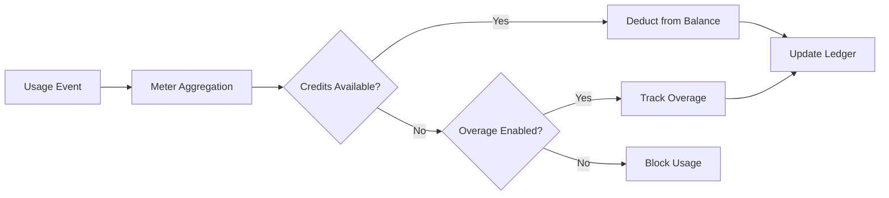

<Info>
मीटर कच्चे इवेंट्स को बिल योग्य मात्राओं में बदलते हैं। वे इवेंट्स को फ़िल्टर करते हैं और ग्राहक के अनुसार उपयोग को गणना करने के लिए एग्रीगेशन फ़ंक्शंस (Count, Sum, Max, Last) लागू करते हैं।
</Info>

<Frame>

</Frame>

## API संसाधन

<AccordionGroup>
<Accordion title="View Meter API References">
<CardGroup cols={2}>
<Card title="Create Meter" icon="plus" href="/api-reference/meters/create-meter">
API के माध्यम से प्रोग्रामेटिक रूप से मीटर बनाएं।
</Card>

<Card title="List Meters" icon="list" href="/api-reference/meters/get-meters">
अपने खाते में सभी मीटर प्राप्त करें।
</Card>

<Card title="Get Meter" icon="eye" href="/api-reference/meters/retrieve-meter">
ID द्वारा किसी विशिष्ट मीटर के विवरण प्राप्त करें।
</Card>

<Card title="Archive Meter" icon="arrow-rotate-right" href="/api-reference/meters/archive-meter">
उपयोग ट्रैकिंग बंद करने के लिए मीटर को आर्काइव करें।
</Card>

<Card title="Unarchive Meter" icon="arrow-rotate-left" href="/api-reference/meters/unarchive-meter">
ट्रैकिंग फिर से शुरू करने के लिए एक आर्काइव किए गए मीटर को पुनर्स्थापित करें।
</Card>
</CardGroup>
</Accordion>
</AccordionGroup>

## मीटर बनाना

<Steps>
<Step title="Basic Information">
<ParamField path="Meter Name" type="string" required>
वर्णनात्मक नाम (जैसे, "API Requests", "Token Usage")
</ParamField>

<ParamField path="Event Name" type="string" required>
मिलाने के लिए सटीक इवेंट नाम (केस-सेंसिटिव). उदाहरण: `api.call`, `image.generated`
</ParamField>
</Step>

<Step title="Aggregation">
<ParamField path="Aggregation Type" type="string" required>
निर्धारित करें कि इवेंट्स को कैसे एग्रीगेट किया जाता है:

- **Count**: इवेंट्स की कुल संख्या (API कॉल्स, अपलोड्स)
- **Sum**: संख्यात्मक मान जोड़ें (टोकन, बाइट्स)
- **Max**: अवधि में उच्चतम मान (पीक उपयोगकर्ता)
- **Last**: सबसे हाल का मान
</ParamField>

<ParamField path="Over Property" type="string">
एग्रीगेट करने के लिए मेटाडेटा की (Count को छोड़कर सभी प्रकारों के लिए आवश्यक)। उदाहरण: `tokens`, `bytes`, `duration_ms`
</ParamField>

<ParamField path="Measurement Unit" type="string" required>
चालानों के लिए यूनिट लेबल। उदाहरण: `calls`, `tokens`, `GB`, `hours`
</ParamField>
</Step>

<Step title="Filtering (Optional)">
<Frame>

</Frame>

उन घटनाओं को फ़िल्टर करने के लिए शर्तें जोड़ें जिन्हें गिना जाएगा:
- **AND लॉजिक**: सभी शर्तें मेल खानी चाहिए
- **OR लॉजिक**: कोई भी शर्त मेल खा सकती है

**तुलनात्मक**: समान, असमान, बड़ा, छोटा, शामिल है

फ़िल्टरिंग सक्षम करें, लॉजिक चुनें, प्रॉपर्टी की, कंपेरटर, और मान के साथ शर्तें जोड़ें।
</Step>

<Step title="Create">
कॉन्फ़िगरेशन की समीक्षा करें और **Create Meter** पर क्लिक करें।
</Step>
</Steps>

## विश्लेषण देखना

<Frame>

</Frame>

आपका मीटर डैशबोर्ड दिखाता है:
- **अवलोकन**: कुल उपयोग और उपयोग चार्ट
- **घटनाएँ**: प्राप्त व्यक्तिगत घटनाएँ
- **ग्राहक**: प्रति ग्राहक उपयोग और शुल्क

## मुद्रा के बजाय क्रेडिट में बिलिंग

डिफ़ॉल्ट रूप से, मीटर ग्राहकों से प्रति-यूनिट डॉलर (या आपके द्वारा कॉन्फ़िगर की गई मुद्रा) में शुल्क लेते हैं। आप इसके बजाय मीटर को **क्रेडिट बैलेंस से घटाने** के लिए कॉन्फ़िगर कर सकते हैं — ताकि उपयोग क्रेडिट कम करे न कि मौद्रिक शुल्क उत्पन्न करे।

<Info>
Credit-based deduction requires a [Credit Entitlement](/features/credit-based-billing) attached to the same product. Create your credit first, then link it to the meter.
</Info>

### क्रेडिट-आधारित कटौती कब उपयोग करें

| परिदृश्य | मानक (मुद्रा) | क्रेडिट-आधारित |
|----------|-------------------|----------------|
| सरल प्रति-यूनिट मूल्य निर्धारण ($0.01/कॉल) | ✅ सर्वश्रेष्ठ अनुकूल | अनावश्यक ओवरहेड |
| पूर्वभुगतान क्रेडिट पैक (10K टोकन खरीदें, समय के साथ उपयोग करें) | ❌ व्यक्त नहीं किया जा सकता | ✅ सर्वश्रेष्ठ अनुकूल |
| सब्सक्रिप्शन के साथ बंडल किया गया उपयोग (Pro प्लान में 100K कॉल शामिल) | निःशुल्क सीमा के माध्यम से संभव | ✅ बेहतर - क्रेडिट रोल ओवर होते हैं, समाप्त होते हैं, पोर्टल में दिखते हैं |
| बहु-मीटर उत्पाद जो एक ही क्रेडिट पूल साझा करते हैं | ❌ प्रत्येक मीटर अलग बिल करता है | ✅ सभी मीटर एक ही बैलेंस से घटाते हैं |

### क्रेडिट घटाने के लिए मीटर को कॉन्फ़िगर करना

<Steps>
<Step title="Create a Credit Entitlement">
सबसे पहले, **Products → Credits** में एक क्रेडिट बनाएं। इकाई (जैसे "API Calls", "Tokens"), सटीकता और जीवनचक्र सेटिंग्स (समाप्ति, रोलओवर, ओवरेज) को परिभाषित करें।

विस्तृत निर्देशों के लिए [Credit-Based Billing guide](/features/credit-based-billing) देखें।
</Step>

<Step title="Create or Edit a Usage-Based Product">
अपने उपयोग-आधारित उत्पाद पर जाएं और **Meter** कॉन्फ़िगरेशन सेक्शन खोलें।
</Step>

<Step title="Add a Meter">
मीटर संलग्न करने के लिए **+** बटन क्लिक करें। जैसा कि हमेशा होता है, इवेंट का नाम, समेकन प्रकार और मापन इकाई कॉन्फ़िगर करें।
</Step>

<Step title="Enable 'Bill Usage in Credits'">
मीटर कॉन्फ़िगरेशन में **Bill usage in Credits** टॉगल चालू करें। इससे क्रेडिट सेटिंग्स दिखती हैं:

<Frame caption="Toggle 'Bill usage in Credits' to switch from currency-based to credit-based deduction.">

</Frame>

<ParamField path="Credit Entitlement" type="string" required>
निर्धारित करें कि यह मीटर किस क्रेडिट एंटाइटलमेंट से घटाना चाहिए।
</ParamField>

<ParamField path="Meter units per credit" type="number" required>
1 क्रेडिट घटाने के लिए आवश्यक उपयोग इकाइयों की संख्या। उदाहरण के लिए:
- `1` = प्रत्येक मीटर इवेंट 1 क्रेडिट घटाता है
- `100` = 100 मीटर इवेंट 1 क्रेडिट घटाते हैं
- `1000` = 1,000 API कॉल 1 क्रेडिट का उपभोग करते हैं
</ParamField>
</Step>

<Step title="Set the Free Threshold">
**Free Threshold** अभी भी लागू होता है - इस सीमा के नीचे के इवेंट क्रेडिट नहीं घटाते।

**उदाहरण**: 1,000 की फ्री थ्रेशहोल्ड और 1 मीटर-यूनिट-प्रति-क्रेडिट के साथ:
- ग्राहक 2,500 API कॉल उपयोग करता है
- पहले 1,000 मुफ्त हैं
- शेष 1,500 उनके बैलेंस से 1,500 क्रेडिट घटाते हैं
</Step>
</Steps>

### क्रेडिट कटौती कैसे काम करती है

एक बार कॉन्फ़िगर होने पर, कटौती पाइपलाइन स्वतः चलती है:

1. **इवेंट आते हैं** - आपका एप्लिकेशन [Event Ingestion API](/features/usage-based-billing/event-ingestion) के माध्यम से उपयोग इवेंट भेजता है
2. **मीटर समेकित करता है** - इवेंट आपकी मीटर कॉन्फ़िगरेशन के अनुसार (Count, Sum, Max, Last) समेकित किए जाते हैं
3. **बैकग्राउंड वर्कर प्रोसेस** - हर मिनट, एक वर्कर पिछले चेकपॉइंट से नए इवेंट्स लाता है
4. **क्रेडिट घटाए जाते हैं** - समेकित उपयोग `meter_units_per_credit` दर का उपयोग करके क्रेडिट में परिवर्तित होता है और **FIFO ordering** (पुराने अनुदानों को पहले खपत) के साथ घटाया जाता है
5. **ओवरेज ट्रैक होता है** - यदि बैलेंस शून्य हो जाता है और ओवरेज सक्षम है, तो उपयोग जारी रहता है और व्यवहार के अनुसार ओवरेज को संभाला जाता है (रीसेट पर माफ़, अगले इनवॉइस पर बिल, या घाटे के रूप में आगे ले जाना)

<Warning>
क्रेडिट कटौती असिंक्रोनस रूप से चलती है (लगभग हर 1 मिनट)। इवेंट इनजेशन और बैलेंस कटौती के बीच थोड़ी देरी हो सकती है। अपने एप्लिकेशन को इस देरी को संभालने के लिए डिज़ाइन करें - व्यक्तिगत अनुरोधों पर एक्सेस कंट्रोल के लिए रीयल-टाइम बैलेंस चेक पर भरोसा न करें।
</Warning>

### कई मीटर, एक क्रेडिट पूल

आप एक ही उत्पाद पर कई मीटर को **एक ही क्रेडिट एंटाइटलमेंट** से लिंक कर सकते हैं। सभी मीटर एक साझा बैलेंस से घटाते हैं।

**उदाहरण**: एक AI प्लेटफ़ॉर्म जिसमें दो मीटर हैं:
- `text.generation` - 1,000 टोकन पर 1 क्रेडिट
- `image.generation` - प्रति इमेज 10 क्रेडिट

दोनों एक ही "AI Credits" पूल से घटाते हैं। ग्राहक अपने पोर्टल में एक एकीकृत बैलेंस देखते हैं।

<Tip>
विभिन्न मीटरों में `meter_units_per_credit` दरों का उपयोग करके सापेक्ष लागत व्यक्त करें। महंगे ऑपरेशन (इमेज जनरेशन) सस्ते ऑपरेशन (टेक्स्ट कम्प्लीशन) की तुलना में प्रति क्रेडिट कम मीटर यूनिट लेते हैं।
</Tip>

<CardGroup cols={2}>
<Card title="List Customer Ledger" icon="scroll" href="/api-reference/credit-entitlements/list-customer-ledger">
एक ग्राहक के लिए पूर्ण क्रेडिट कटौती इतिहास देखें।
</Card>
<Card title="Get Customer Balance" icon="wallet" href="/api-reference/credit-entitlements/get-customer-balance">
API के माध्यम से ग्राहक का वर्तमान क्रेडिट बैलेंस जांचें।
</Card>
</CardGroup>

## समस्या निवारण

<AccordionGroup>
<Accordion title="Events not appearing">
- इवेंट नाम बिल्कुल मेल खाना चाहिए (केस-सेंसिटिव)
- सुनिश्चित करें कि मीटर फ़िल्टर इवेंट्स को बाहर नहीं कर रहे
- ग्राहक ID मौजूद हैं या नहीं यह सत्यापित करें
- परीक्षण के लिए अस्थायी रूप से फ़िल्टर को अक्षम करें
</Accordion>

<Accordion title="Aggregation not working">
- सत्यापित करें कि Over Property मेटाडेटा कुंजी से बिल्कुल मेल खाती है
- स्ट्रिंग की बजाय संख्याओं का उपयोग करें: `tokens: 150` न कि `"150"`
- सभी इवेंट्स में आवश्यक प्रॉपर्टीज़ शामिल करें
</Accordion>

<Accordion title="Filters not working">
- केस को ठीक से मिलाएं
- डेटा प्रकार के लिए सही ऑपरेटर का उपयोग करें
- सुनिश्चित करें कि इवेंट्स में फ़िल्टर की गई प्रॉपर्टीज़ शामिल हैं
</Accordion>

<Accordion title="Wrong usage totals">
- वास्तविक रूप से प्राप्त इवेंट्स की गिनती के लिए Events टैब जांचें
- समेकन प्रकार (Count vs Sum) सत्यापित करें
- Sum/Max के लिए मान संख्यात्मक हों यह सुनिश्चित करें
</Accordion>
</AccordionGroup>

## अगले चरण

<CardGroup cols={2}>

<Card title="Send Events" icon="bolt" href="/features/usage-based-billing/event-ingestion">
अपने एप्लिकेशन से अपने मीटरों को उपयोग इवेंट भेजना शुरू करें।
</Card>

<Card title="View Blueprints" icon="copy" href="/features/usage-based-billing/ingestion-blueprints">
सामान्य उपयोग मामलों के लिए रेडी-मेड मीटर कॉन्फ़िगरेशन का उपयोग करें।
</Card>
</CardGroup>
