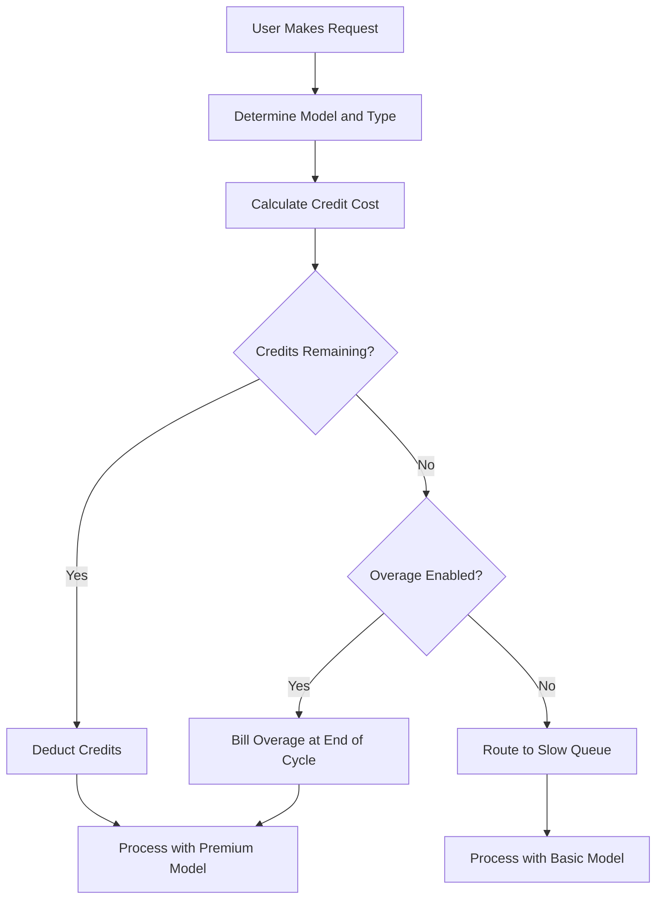

## Bagaimana Cursor Menagih

Cursor menggunakan model hibrida yang menggabungkan langganan bulanan dengan kumpulan kredit yang berkurang. Pendekatan ini memberikan harga yang dapat diprediksi bagi pengguna sambil mengelola biaya variabel dari berbagai model AI.

**Lapisan Harga**: Cursor menawarkan lapisan dari Hobby hingga Ultra, menyeimbangkan akses premium dan standar agar sesuai dengan alur kerja yang berbeda.

| Plan | Price | Premium Requests | Slow Requests |
| :--- | :--- | :--- | :--- |
| Hobby | Free | 50/month | Unlimited |
| Pro | \$20/month | 500/month | Unlimited |
| Pro+ | \$60/month | Unlimited premium | - |
| Ultra | \$200/month | Unlimited premium | - |

**Penarikan Berbobot Model**: Permintaan yang berbeda mengonsumsi jumlah kredit berbeda berdasarkan biaya model yang mendasarinya. Ini memungkinkan Cursor menawarkan satu langganan yang mencakup banyak penyedia sambil memastikan operasi mahal tercatat dengan benar.

| Request Type | Model | Credit Cost |
| :--- | :--- | :--- |
| Tab Completion | Default | 0 |
| Chat | GPT-4o Mini | 1 |
| Chat | Claude 3.5 Sonnet | 1 |
| Composer | GPT-4o | 5 |
| Agent | Claude 3.5 Sonnet | 10 |
| Agent | o1-preview | 25 |

**Kehabisan Kredit dan Biaya Tambahan**: Ketika kredit habis, pengguna dipindahkan ke antrean "Slow" dengan model yang lebih murah alih-alih diputus. Atau, mereka dapat mengaktifkan biaya tambahan berbasis pemakaian untuk mempertahankan akses premium dengan biaya per permintaan tetap.



4. **Enterprise dan Business**: Tim menggunakan pemakaian bersama di mana seluruh organisasi berbagi satu wadah kredit. Ini menyederhanakan pengelolaan dan memastikan pengguna berat tidak mencapai batas individu sementara yang lain memiliki kapasitas yang tidak terpakai.

## Apa yang Membuatnya Unik

Model Cursor menyeimbangkan pengalaman pengguna dengan biaya infrastruktur dengan memecahkan masalah yang sulit diatasi oleh model penagihan SaaS tradisional.
- **Abstraksi Penyedia**: Satu langganan membungkus beberapa penyedia LLM seperti OpenAI dan Anthropic, menangani harga kompleks dan kunci API di balik layar.
- **Penarikan Berbobot**: Biaya selaras dengan nilai dengan mengenakan lebih banyak untuk model yang kuat, membuat harga terasa adil dan transparan bagi semua pengguna.
- **Degradasi yang Halus**: Antrean "Slow" mencegah pemutusan mendadak, menjaga pengguna tetap berada di produk dan mendorong peningkatan tanpa bersikap hukuman.
- **Kredit Gabungan**: Wadah tingkat tim mengurangi gesekan bagi pelanggan perusahaan dengan memungkinkan berbagi sumber daya secara efisien di seluruh organisasi.

## Bangun Ini dengan Dodo Payments

Anda dapat mereplikasi model ini secara tepat menggunakan hak kredit dan penagihan berbasis pemakaian Dodo Payments. Langkah-langkah berikut akan memandu Anda melalui implementasinya.

<Steps>
  <Step title="Create a Custom Unit Credit Entitlement">
    Pertama, definisikan sistem kredit di dashboard Dodo. Hak ini akan mewakili "Premium Requests" yang diperoleh pengguna bersama langganan mereka.

    *   **Jenis Kredit:** Custom Unit
    *   **Nama Unit:** "Premium Requests"
    *   **Presisi:** 0 (karena Anda tidak bisa menggunakan setengah permintaan)
    *   **Kedaluwarsa Kredit:** 30 hari (ini memastikan kredit direset setiap siklus penagihan)
    *   **Rollover:** Dinonaktifkan (permintaan yang tidak digunakan tidak berpindah ke bulan berikutnya)
    *   **Biaya Tambahan:** Diaktifkan
    *   **Harga Per Unit:** \$0.04 (biaya untuk setiap permintaan setelah kumpulan awal habis)
    *   **Perilaku Biaya Tambahan:** Tagih biaya tambahan saat penagihan (ini menambahkan biaya tambahan ke faktur berikutnya)

    Konfigurasi ini memastikan pengguna memiliki kumpulan permintaan tetap setiap bulan, dengan opsi membayar lebih jika mereka membutuhkannya. Ini adalah dasar dari model penagihan hibrida.
  </Step>

  <Step title="Create Subscription Products">
    Buat produk terpisah untuk setiap lapisan. Lampirkan hak kredit yang sama ke setiap produk, tetapi dengan jumlah yang berbeda. Ini memungkinkan Anda mengelola semua lapisan dengan satu sistem kredit, membuatnya mudah untuk meningkatkan atau menurunkan tingkat pengguna.

    *   **Hobby:** \$0/bulan, 50 kredit/putaran
    *   **Pro:** \$20/bulan, 500 kredit/putaran
    *   **Pro+:** \$60/bulan, 5000 kredit/putaran (secara efektif tak terbatas untuk kebanyakan pengguna)
    *   **Ultra:** \$200/bulan, 50000 kredit/putaran (secara efektif tak terbatas)

    Ketika pengguna berlangganan salah satu produk ini, Dodo secara otomatis mengalokasikan jumlah kredit yang sesuai ke akun mereka. Ini terjadi secara instan, memberikan pengalaman onboarding yang mulus.
  </Step>

  <Step title="Create a Usage Meter Linked to Credits">
    Buat meter bernama `ai.request` dengan agregasi **Sum** pada properti `credit_cost`. Kaitkan meter ini ke hak kredit Anda dengan mengaktifkan toggle "Bill usage in Credits". Atur unit meter per kredit menjadi 1.

    Untuk menangani penarikan berbobot model, Anda akan mengelola biaya kredit di tingkat aplikasi. Ketika pengguna melakukan permintaan, aplikasi Anda menentukan biayanya berdasarkan model atau jenis tindakan.

    ```typescript
    import DodoPayments from 'dodopayments';
    
    /**
     * Determines the credit cost for a given request type and model.
     * This logic lives in your application and can be updated without
     * changing your billing configuration.
     */
    function getCreditCost(requestType: string, model: string): number {
      const costs: Record<string, Record<string, number>> = {
        'tab_completion': { 'default': 0 },
        'chat': { 'gpt-4o-mini': 1, 'gpt-4o': 1, 'claude-sonnet': 1 },
        'composer': { 'gpt-4o-mini': 2, 'gpt-4o': 5, 'claude-sonnet': 5 },
        'agent': { 'gpt-4o': 10, 'claude-sonnet': 10, 'o1': 25 }
      };
      
      // Default to 1 credit if the combination isn't found
      return costs[requestType]?.[model] ?? 1;
    }
    
    /**
     * Ingests usage events into Dodo Payments.
     * For weighted requests, we send multiple events or use a sum aggregation.
     */
    async function trackRequest(customerId: string, requestType: string, model: string) {
      const creditCost = getCreditCost(requestType, model);
      
      // Tab completions are free, so we don't need to track them for billing
      if (creditCost === 0) return;
      
      const client = new DodoPayments({
        bearerToken: process.env.DODO_PAYMENTS_API_KEY,
      });
      
      await client.usageEvents.ingest({
        events: [{
          event_id: `req_${Date.now()}_${Math.random().toString(36).slice(2)}`,
          customer_id: customerId,
          event_name: 'ai.request',
          timestamp: new Date().toISOString(),
          metadata: {
            request_type: requestType,
            model: model,
            credit_cost: creditCost
          }
        }]
      });
    }
    ```

    <Tip>
      Jika Anda ingin menggunakan satu event untuk permintaan berbobot, atur agregasi meter ke **Sum** dan gunakan properti seperti `credit_cost` sebagai nilai yang dijumlahkan. Ini sering lebih efisien untuk ingesting volume tinggi dan menyederhanakan logika aplikasi Anda.
    </Tip>
  </Step>

  <Step title="Handle Credit Exhaustion (Slow Queue)">
    Dengarkan webhook `credit.balance_low` dari Dodo. Ketika kredit pengguna hampir habis, Anda dapat memindahkan mereka ke antrean lambat di aplikasi Anda. Di sinilah Anda menerapkan logika "degradasi yang halus".

    ```typescript
    import DodoPayments from 'dodopayments';
    import express from 'express';
    
    const app = express();
    app.use(express.raw({ type: 'application/json' }));
    
    const client = new DodoPayments({
      bearerToken: process.env.DODO_PAYMENTS_API_KEY,
      webhookKey: process.env.DODO_PAYMENTS_WEBHOOK_KEY,
    });
    
    app.post('/webhooks/dodo', async (req, res) => {
      try {
        const event = client.webhooks.unwrap(req.body.toString(), {
          headers: {
            'webhook-id': req.headers['webhook-id'] as string,
            'webhook-signature': req.headers['webhook-signature'] as string,
            'webhook-timestamp': req.headers['webhook-timestamp'] as string,
          },
        });
        
        if (event.type === 'credit.balance_low') {
          const customerId = event.data.customer_id;
          await updateUserTier(customerId, 'slow');
          await notifyUser(customerId, 'You have used most of your premium requests. Switching to standard models.');
        }
        
        res.json({ received: true });
      } catch (error) {
        res.status(401).json({ error: 'Invalid signature' });
      }
    });
    
    /**
     * Routes a request based on the user's current tier.
     * This function is called before every AI request to determine the model and queue.
     */
    async function routeRequest(customerId: string, requestType: string) {
      const tier = await getUserTier(customerId);
      
      if (tier === 'slow') {
        // Route to a cheaper model and a lower priority queue
        // This saves costs while keeping the user active in the product
        return { model: 'gpt-4o-mini', queue: 'standard' };
      }
      
      // Premium routing for users with remaining credits
      // This provides the best possible performance and model quality
      return { model: 'claude-sonnet', queue: 'priority' };
    }
    ```

  </Step>

  <Step title="Create Checkout">
    Terakhir, buat sesi checkout untuk pengguna agar berlangganan suatu paket. Dodo menangani pemrosesan pembayaran, kepatuhan pajak, dan alokasi kredit secara otomatis.

    ```typescript
    import DodoPayments from 'dodopayments';
    
    const client = new DodoPayments({
      bearerToken: process.env.DODO_PAYMENTS_API_KEY,
    });
    
    /**
     * Creates a checkout session for a new subscription.
     * This is typically called when a user clicks an "Upgrade" button.
     */
    const session = await client.checkoutSessions.create({
      product_cart: [
        { product_id: 'prod_cursor_pro', quantity: 1 }
      ],
      customer: { email: 'developer@example.com' },
      return_url: 'https://yourapp.com/dashboard'
    });
    ```

  </Step>
</Steps>

## Percepat dengan LLM Ingestion Blueprint

Penagihan berbobot kredit di atas menangani monetisasi inti Anda. Untuk analitik lebih dalam tentang konsumsi token aktual lintas penyedia, [LLM Ingestion Blueprint](/developer-resources/ingestion-blueprints/llm) dapat berjalan bersamaan dengan sistem kredit Anda.

```bash
npm install @dodopayments/ingestion-blueprints
```

```typescript
import { createLLMTracker } from '@dodopayments/ingestion-blueprints';
import OpenAI from 'openai';
import Anthropic from '@anthropic-ai/sdk';

// Track raw token usage for analytics alongside credit-weighted billing
const openaiTracker = createLLMTracker({
  apiKey: process.env.DODO_PAYMENTS_API_KEY,
  environment: 'live_mode',
  eventName: 'analytics.openai_tokens',
});

const anthropicTracker = createLLMTracker({
  apiKey: process.env.DODO_PAYMENTS_API_KEY,
  environment: 'live_mode',
  eventName: 'analytics.anthropic_tokens',
});

const openai = new OpenAI({ apiKey: process.env.OPENAI_API_KEY });
const anthropic = new Anthropic({ apiKey: process.env.ANTHROPIC_API_KEY });

// Wrap each provider separately
const trackedOpenAI = openaiTracker.wrap({ client: openai, customerId: 'customer_123' });
const trackedAnthropic = anthropicTracker.wrap({ client: anthropic, customerId: 'customer_123' });

// Token tracking is automatic, credit deduction still uses your weighted system
const response = await trackedOpenAI.chat.completions.create({
  model: 'gpt-4o',
  messages: [{ role: 'user', content: 'Hello!' }],
});
```

Ini memberi Anda dua lapisan data: penagihan berbobot kredit untuk monetisasi dan hitungan token mentah untuk analisis biaya dan pelacakan margin.

<Tip>
Blueprint LLM mendukung OpenAI, Anthropic, Groq, Google Gemini, dan lainnya. Lihat [dokumentasi blueprint lengkap](/developer-resources/ingestion-blueprints/llm) untuk semua penyedia yang didukung.
</Tip>

## Kredit Tim Terpadu (Enterprise)

Rencana Business dan Enterprise Cursor menggabungkan kredit di seluruh tim. Anda dapat mengimplementasikan ini dengan Dodo dengan membuat satu langganan untuk organisasi daripada individu. Ini memastikan pemakaian tim dikonsolidasikan dan dikelola sebagai satu entitas, yang merupakan persyaratan utama bagi pelanggan besar.

### Strategi Implementasi

1.  **Pelanggan Tingkat Organisasi:** Buat satu `customer_id` di Dodo untuk seluruh organisasi. Pelanggan ini mewakili entitas penagihan untuk tim dan memegang kumpulan kredit bersama. Semua faktur dan alokasi kredit terkait dengan ID ini.
2.  **Penagihan Berdasarkan Kursi:** Gunakan add-on Dodo untuk mengenakan biaya platform per pengguna. Ketika tim menambahkan anggota baru, Anda memperbarui kuantitas add-on "Seat". Ini memastikan pendapatan Anda skala seiring jumlah pengguna sambil menjaga kumpulan kredit tetap terpisah. Ini cara bersih untuk menangani penagihan multidimensi.
3.  **Pelacakan Pemakaian Bersama:** Semua permintaan anggota tim diunggah menggunakan `customer_id` organisasi. Ini memastikan setiap permintaan dari anggota tim mana pun mengurangi kumpulan kredit pusat yang sama. Anda masih dapat melacak pemakaian pengguna individu dengan menyertakan `user_id` dalam metadata event untuk pelaporan internal dan analitik.

Pendekatan ini memberi Anda kombinasi terbaik: biaya per pengguna yang dapat diprediksi untuk platform dan kumpulan kredit bersama untuk sumber daya AI yang mahal. Ini juga menyederhanakan pengalaman pengguna bagi anggota tim, karena mereka tidak perlu mengelola batasan individu mereka sendiri.

## Perbandingan dengan Penagihan SaaS Tradisional

Penagihan SaaS tradisional biasanya melibatkan lapisan tarif tetap (misalnya, \$10/bulan untuk 100 unit). Jika pengguna membutuhkan 101 unit, mereka sering harus naik ke lapisan \$50/bulan. Ini menciptakan efek "jurang" yang dapat membuat pengguna frustrasi dan menyebabkan churn. Ini juga tidak memperhitungkan biaya variabel dari jenis pemakaian yang berbeda, yang krusial di ruang AI.

Model Cursor, yang didukung oleh Dodo, jauh lebih fleksibel dan adil:

*   **Tidak Ada Efek "Jurang":** Pengguna tidak harus naik tingkat hanya karena mencapai batas. Mereka dapat membayar biaya tambahan atau menerima performa yang lebih lambat. Ini menjaga mereka tetap berada di produk dan mengurangi gesekan, menghasilkan kepuasan pelanggan lebih tinggi dan churn lebih rendah.
*   **Keselarasan Biaya:** Pendapatan Anda meningkat seiring biaya infrastruktur. Jika pengguna menggunakan model yang mahal, mereka membayar lebih (baik melalui kredit atau biaya tambahan). Ini melindungi margin Anda dan memungkinkan Anda menawarkan fitur berbiaya tinggi secara berkelanjutan tanpa membahayakan model bisnis Anda.
*   **Retensi Lebih Baik:** Dengan tidak memutus pengguna, Anda menjaga mereka tetap terlibat dengan produk bahkan ketika mereka mencapai batasnya. Mereka dapat terus bekerja, yang membangun loyalitas jangka panjang dan meningkatkan nilai seumur hidup pelanggan. Ini situasi menang-menang bagi pengguna dan penyedia.

## Menangani Pembaruan dan Evolusi Model

Salah satu tantangan dengan penagihan AI adalah model terus diperbarui atau diganti. Model baru mungkin memiliki struktur biaya atau karakteristik performa yang berbeda. Dengan sistem kredit Dodo, Anda dapat menangani ini secara halus di tingkat aplikasi tanpa perlu memigrasikan data penagihan Anda.

Jika Anda memperkenalkan model baru yang lebih mahal, Anda cukup memperbarui fungsi `getCreditCost` Anda untuk menetapkan biaya yang lebih tinggi. Anda tidak perlu mengubah konfigurasi penagihan atau memperbarui langganan yang ada. Pemisahan antara penagihan dan logika aplikasi ini merupakan keuntungan besar, karena memungkinkan Anda beriterasi pada produk secepat AI tanpa terbebani oleh sistem penagihan Anda.

## Notifikasi Pengguna dan Transparansi

Untuk memberikan pengalaman pengguna yang hebat, penting untuk menjaga pengguna tetap diberitahu tentang penggunaan kredit mereka. Transparansi membangun kepercayaan dan membantu pengguna mengelola biaya secara efektif. Anda dapat menggunakan webhook Dodo untuk memicu notifikasi pada berbagai ambang batas (misalnya, 50%, 80%, dan 100% pemakaian).

Notifikasi ini dapat dikirim melalui email, pemberitahuan dalam aplikasi, atau pesan Slack. Dengan memberikan umpan balik waktu nyata tentang pemakaian, Anda mendorong pengguna mengelola konsumsi mereka atau meningkatkan paket sebelum mereka memasuki "antrean lambat". Pendekatan proaktif ini mengurangi tiket dukungan dan meningkatkan pengalaman pengguna secara keseluruhan, membuat produk Anda terasa lebih profesional dan terfokus pada pengguna.

## Keamanan dan Pencegahan Penipuan

Saat menerapkan sistem berbasis kredit, penting untuk mempertimbangkan keamanan dan pencegahan penipuan. Karena kredit memiliki nilai moneter langsung, mereka bisa menjadi target penyalahgunaan.

*   **Idempoten:** Selalu gunakan `event_id` unik saat mengunggah event penggunaan untuk mencegah perhitungan ganda. API ingest Dodo menangani idempoten secara otomatis jika Anda menyediakan ID unik, memastikan retry jaringan tidak membebani pengguna dua kali.
*   **Pembatasan Laju:** Terapkan pembatasan laju di tingkat aplikasi untuk mencegah satu pengguna menghabiskan kredit mereka (atau anggaran API Anda) terlalu cepat. Ini melindungi infrastruktur Anda dan dompet pengguna.
*   **Pemantauan:** Pantau pola pemakaian untuk anomali yang mungkin menunjukkan pembagian akun atau penyalahgunaan otomatis. Analitik Dodo dapat membantu Anda mengidentifikasi pola ini, memungkinkan Anda mengambil tindakan sebelum menjadi masalah besar.

## Praktik Terbaik untuk Sistem Kredit

Saat membangun sistem penagihan berbasis kredit, simpan praktik terbaik berikut dalam pikiran:

1.  **Jaga agar Tetap Sederhana:** Jangan membuat sistem kredit Anda terlalu kompleks. Pengguna harus dapat dengan mudah memahami berapa biaya sebuah permintaan dan berapa kredit yang tersisa.
2.  **Berikan Nilai:** Pastikan kredit memberikan nilai nyata kepada pengguna. Jika biaya permintaan terlalu tinggi, pengguna akan merasa seperti sedang diperas.
3.  **Bersikap Transparan:** Selalu tunjukkan saldo kredit dan riwayat pemakaian pengguna. Ini membangun kepercayaan dan mengurangi kebingungan.
4.  **Otomatisasi Segalanya:** Gunakan webhook dan API Dodo untuk mengotomatisasi sebanyak mungkin proses penagihan. Ini mengurangi pekerjaan manual dan memastikan penagihan Anda selalu akurat.

## Fitur Utama Dodo yang Digunakan

<CardGroup cols={2}>
  <Card title="Credit-Based Billing" icon="coins" href="/features/credit-based-billing">
    Kelola kumpulan kredit yang menipis dan biaya tambahan dengan unit kustom.
  </Card>
  <Card title="Subscriptions" icon="calendar" href="/features/subscription">
    Atur penagihan berulang untuk lapisan berbeda dengan kredit terintegrasi.
  </Card>
  <Card title="Usage-Based Billing" icon="chart-line" href="/features/usage-based-billing/introduction">
    Lacak event dan tagih berdasarkan konsumsi secara waktu nyata.
  </Card>
  <Card title="Event Ingestion" icon="bolt" href="/features/usage-based-billing/event-ingestion">
    Kirim data pemakaian volume tinggi ke Dodo dengan latensi rendah.
  </Card>
  <Card title="Webhooks" icon="webhook" href="/developer-resources/webhooks/intents/credit">
    Tanggapi perubahan saldo kredit dan otomatisasi pengelompokan pengguna.
  </Card>
  <Card title="LLM Ingestion Blueprint" icon="brain-circuit" href="/developer-resources/ingestion-blueprints/llm">
    Pelacakan token otomatis di berbagai penyedia LLM.
  </Card>
</CardGroup>
