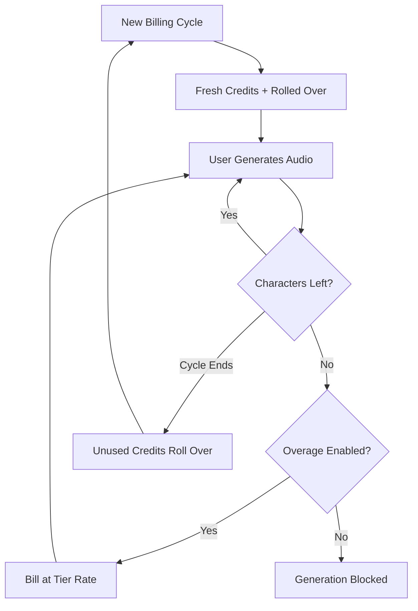

ElevenLabs telah membangun posisi dominan di ranah suara AI dengan membuat penagihan mereka senyaman sintesis ucapan mereka. Model mereka berpusat pada satu unit nilai: karakter. Baik Anda menghasilkan teks-ke-ucapan, mengkloning suara, atau mendubbing video, Anda mengonsumsi dari kumpulan kredit karakter yang terpadu.

## Bagaimana ElevenLabs Menagih

Struktur harga ElevenLabs menggunakan kuota bulanan tetap yang terkait dengan tingkat langganan. Saat pengguna berpindah ke tingkat yang lebih tinggi, mereka mendapatkan lebih banyak karakter dan akses ke fitur lanjutan seperti kloning suara profesional atau hak komersial.

| Paket | Harga | Karakter/Bulan | Tarif Overage |
| :--- | :--- | :--- | :--- |
| Free | \$0 | 10.000 | Tidak tersedia |
| Starter | \$5/bulan | 30.000 | ~\$0,30/1K karakter |
| Creator | \$22/bulan | 100.000 | ~\$0,24/1K karakter |
| Pro | \$99/bulan | 500.000 | ~\$0,15/1K karakter |
| Scale | \$330/bulan | 2.000.000 | ~\$0,10/1K karakter |

1. **Penetapan harga berbasis karakter**: Karakter adalah mata uang universal di seluruh platform. Text-to-Speech, Dubbing, dan Kloning Suara semuanya mengambil dari saldo yang sama, menyederhanakan pelacakan penggunaan.
2. **Mekanisme rollover**: Karakter yang tidak terpakai dibawa ke siklus tagihan berikutnya daripada kedaluwarsa. ElevenLabs menerapkan batas untuk mencegah akumulasi tak terbatas, memastikan pengguna tetap mendapatkan nilai dari langganan mereka.
3. **Overage bertingkat**: Overage ditangani berdasarkan tingkat langganan. Paket yang lebih rendah memiliki overage dinonaktifkan secara default demi keamanan, sementara tingkat yang lebih tinggi memungkinkan tagihan opsional untuk menjaga kontinuitas layanan.

## Apa yang Membuatnya Unik

Beberapa pilihan strategis membuat model penagihan ElevenLabs sangat efektif untuk mempertahankan pengguna dan mendorong peningkatan tingkat.

- **Rollover Karakter**: Kredit rollover mengurangi kekhawatiran "gunakan atau hilang" dengan membawa investasi yang tidak terpakai ke depan. Ini mempertahankan nilai langganan bahkan selama periode aktivitas rendah.
- **Harga Overage Bertingkat**: Tarif overage turun seiring ukuran paket meningkat, menciptakan insentif kuat untuk naik tingkat. Pengguna sering menganggap tingkat yang lebih tinggi lebih menarik karena biaya tambahan penggunaan lebih rendah.
- **Konsumsi Terpadu**: Satu kumpulan karakter untuk semua layanan menghilangkan beban kognitif dalam mengelola kuota terpisah. Pengguna hanya perlu memantau satu angka untuk memahami kapasitas tersisa mereka.
- **Overage Opsional**: Pengguna profesional dapat mengaktifkan overage untuk kontinuitas, sementara pengguna kasual mendapat keuntungan dari batas keras.



## Bangun Ini dengan Dodo Payments

Anda dapat meniru model canggih ini menggunakan penagihan berbasis kredit dan pengukuran penggunaan dari Dodo Payments.

<Steps>
<Step title="Create a Custom Unit Credit Entitlement">
Pertama, definisikan unit "Characters" yang akan menjadi mata uang di platform Anda.

1. Buka **Entitlements** di dasbor Dodo Anda.
2. Buat **Credit Entitlement** baru.
3. Tetapkan **Credit Type** ke **Custom Unit**.
4. Namai unit tersebut "Characters".
5. Setel **Precision** ke 0, karena karakter selalu merupakan unit utuh.
6. Setel **Credit Expiry** ke 30 hari untuk menyamakan siklus penagihan bulanan.
7. Aktifkan **Rollover** dengan pengaturan berikut:
    - **Max Rollover Percentage**: 100% (memungkinkan semua karakter yang tidak terpakai dibawa ke depan).
    - **Rollover Timeframe**: 1 Bulan.
    - **Max Rollover Count**: 1 (kredit dapat bergulir sekali, lalu kedaluwarsa).
</Step>

<Step title="Create Tiered Subscription Products">
Buat lima produk langganan. Anda akan melampirkan entitlement "Characters" yang sama pada masing-masing, namun dengan konfigurasi berbeda untuk setiap tingkat.

| Produk | Harga | Kredit/Siklus | Overage Diaktifkan | Harga Overage (per 1K karakter) |
| :--- | :--- | :--- | :--- | :--- |
| Free | \$0/bulan | 10.000 | Tidak | - |
| Starter | \$5/bulan | 30.000 | Ya (opsional) | \$0,30 |
| Creator | \$22/bulan | 100.000 | Ya | \$0,24 |
| Pro | \$99/bulan | 500.000 | Ya | \$0,15 |
| Scale | \$330/bulan | 2.000.000 | Ya | \$0,10 |

Saat Anda melampirkan entitlement kredit ke setiap produk, hilangkan centang pada **Import Default Credit Settings**. Ini memungkinkan Anda mengatur **Price Per Unit** khusus untuk overage di tingkat tersebut. Setel **Overage Behavior** ke **Bill overage at billing** dan konfigurasikan **Low Balance Threshold** pada 10% dari kuota tingkat tersebut.
</Step>

<Step title="Create a Usage Meter">
Pengukur penggunaan menghubungkan aktivitas aplikasi Anda ke sistem kredit.

1. Buat meter baru bernama `tts.characters`.
2. Setel **Aggregation** ke **Sum**. Ini akan menjumlahkan properti `characters` dari setiap event yang Anda kirim.
3. Hubungkan meter ini dengan entitlement kredit "Characters" Anda.
4. Setel **Meter units per credit** ke 1. Ini memastikan bahwa satu karakter yang digunakan dalam aplikasi Anda setara dengan satu kredit yang dikurangi dari saldo.
</Step>

<Step title="Send Usage Events">
Integrasikan pelacakan penggunaan ke dalam kode aplikasi Anda. Setiap kali pengguna menghasilkan audio, kirim event ke Dodo.

```typescript
import DodoPayments from 'dodopayments';

async function trackGeneration(
  customerId: string,
  text: string, 
  service: 'tts' | 'dubbing' | 'cloning'
) {
  const characterCount = text.length;

  const client = new DodoPayments({
    bearerToken: process.env.DODO_PAYMENTS_API_KEY,
  });

  await client.usageEvents.ingest({
    events: [{
      event_id: `gen_${Date.now()}_${Math.random().toString(36).slice(2)}`,
      customer_id: customerId,
      event_name: 'tts.characters',
      timestamp: new Date().toISOString(),
      metadata: {
        characters: characterCount,
        service: service,
        voice_id: 'voice_abc123'
      }
    }]
  });
}
```

</Step>

<Step title="Handle Low Balance and Overage">
Gunakan webhook untuk memberi tahu pengguna tentang penggunaan karakter mereka.

```typescript
import DodoPayments from 'dodopayments';
import express from 'express';

const app = express();
app.use(express.raw({ type: 'application/json' }));

const client = new DodoPayments({
  bearerToken: process.env.DODO_PAYMENTS_API_KEY,
  webhookKey: process.env.DODO_PAYMENTS_WEBHOOK_KEY,
});

app.post('/webhooks/dodo', async (req, res) => {
  try {
    const event = client.webhooks.unwrap(req.body.toString(), {
      headers: {
        'webhook-id': req.headers['webhook-id'] as string,
        'webhook-signature': req.headers['webhook-signature'] as string,
        'webhook-timestamp': req.headers['webhook-timestamp'] as string,
      },
    });

    switch (event.type) {
      case 'credit.balance_low':
        await notifyUser(event.data.customer_id, 
          'You are running low on characters. Consider upgrading your plan for more characters and lower overage rates.'
        );
        break;
      case 'credit.deducted':
        await logUsage(event.data);
        break;
      case 'credit.overage_charged':
        await notifyUser(event.data.customer_id,
          'You have exceeded your character quota. Overage charges will appear on your next invoice.'
        );
        break;
    }

    res.json({ received: true });
  } catch (error) {
    res.status(401).json({ error: 'Invalid signature' });
  }
});
```

</Step>

<Step title="Create Checkout">
Saat pengguna siap berlangganan, buat sesi checkout untuk tingkat yang dipilih.

```typescript
const session = await client.checkoutSessions.create({
  product_cart: [
    { product_id: 'prod_elevenlabs_pro', quantity: 1 }
  ],
  customer: { email: 'creator@example.com' },
  return_url: 'https://yourapp.com/dashboard'
});
```

</Step>
</Steps>

## Percepat dengan Blueprint Stream Ingestion

Untuk melacak output audio bersama penagihan berbasis karakter, [Stream Ingestion Blueprint](/developer-resources/ingestion-blueprints/stream) menyediakan cara yang ramping untuk mengukur konsumsi bandwidth.

```bash
npm install @dodopayments/ingestion-blueprints
```

```typescript
import { Ingestion, trackStreamBytes } from '@dodopayments/ingestion-blueprints';

const ingestion = new Ingestion({
  apiKey: process.env.DODO_PAYMENTS_API_KEY,
  environment: 'live_mode',
  eventName: 'tts.audio_bytes',
});

// After generating audio, track the output size
const audioBuffer = await generateSpeech(text, voiceId);

await trackStreamBytes(ingestion, {
  customerId: customerId,
  bytes: audioBuffer.byteLength,
  metadata: {
    voice_id: voiceId,
    service: 'tts',
    format: 'mp3',
  },
});
```

Gunakan Blueprint Stream untuk melacak bandwidth audio bersama sistem kredit berbasis karakter Anda. Ini memberi Anda visibilitas terhadap biaya infrastruktur aktual per generasi.

<Tip>
Blueprint Stream juga mendukung batching untuk skenario volume tinggi. Lihat [dokumentasi blueprint lengkap](/developer-resources/ingestion-blueprints/stream) untuk pola penggunaan lanjutan.
</Tip>

## Insentif Upgrade: Harga Overage Bertingkat

Bagian paling brilian dari model ElevenLabs adalah bagaimana mereka menggunakan tarif overage untuk mendorong upgrade. Dengan membuat biaya per karakter lebih murah di tingkat yang lebih tinggi, mereka mengubah percakapan dari "berapa banyak yang saya butuhkan?" menjadi "berapa banyak yang bisa saya hemat?".

| Tingkat | Karakter Termasuk | Overage (per 1K) | Biaya Efektif pada 500K Karakter |
| :--- | :--- | :--- | :--- |
| Creator | 100.000 | \$0,24 | \$22 + (400 * \$0,24) = \$118 |
| Pro | 500.000 | \$0,15 | \$99 (Tanpa overage) |

Pengguna yang secara rutin mengonsumsi 500.000 karakter pada paket Creator membayar \$118 per bulan untuk langganan ditambah overage. Naik ke paket Pro mencakup penggunaan yang sama dengan \$99, menghemat \$19 per bulan. Tarif overage yang lebih rendah di tingkat yang lebih tinggi berarti saat penggunaan meningkat, upgrade menjadi keputusan finansial yang jelas.

Dengan Dodo Payments, Anda menerapkannya dengan menghilangkan centang pada kotak **Import Default Credit Settings** saat melampirkan kredit ke produk langganan Anda. Ini memberi Anda kontrol penuh atas **Price Per Unit** untuk setiap tingkat tertentu, memungkinkan Anda memberi penghargaan kepada pelanggan dengan pembayaran tertinggi dengan tarif terbaik.

## Fitur Utama Dodo yang Digunakan

<CardGroup cols={2}>
  <Card title="Credit-Based Billing" icon="coins" href="/features/credit-based-billing">
    Kelola kuota karakter, rollover, dan kedaluwarsa.
  </Card>
  <Card title="Subscriptions" icon="calendar" href="/features/subscription">
    Siapkan tingkat berulang yang menyediakan kuota karakter bulanan.
  </Card>
  <Card title="Usage-Based Billing" icon="chart-line" href="/features/usage-based-billing/introduction">
    Lacak konsumsi karakter waktu nyata di seluruh layanan Anda.
  </Card>
  <Card title="Event Ingestion" icon="bolt" href="/features/usage-based-billing/event-ingestion">
    Kirim data penggunaan volume tinggi ke Dodo dengan latensi minimal.
  </Card>
  <Card title="Webhooks" icon="webhook" href="/developer-resources/webhooks/intents/credit">
    Tanggapi saldo rendah dan event overage secara waktu nyata.
  </Card>
  <Card title="Stream Ingestion Blueprint" icon="tower-broadcast" href="/developer-resources/ingestion-blueprints/stream">
    Lacak bandwidth streaming audio untuk penagihan berbasis penggunaan.
  </Card>
</CardGroup>
