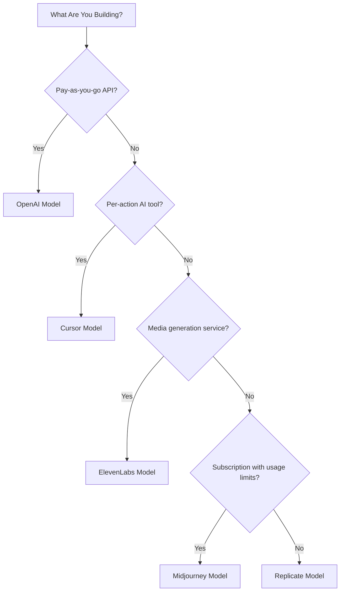

## Lima Model
| Aplikasi | Metrik Utama | Inovasi Unik | Fitur Dodo |
| :--- | :--- | :--- | :--- |
| OpenAI | Token (dinarasikan dalam fiat) | Kredit fiat prabayar dengan saldo yang tidak pernah kedaluwarsa | Penagihan Berbasis Kredit (Kredit Fiat) |
| Cursor | Permintaan Premium | Pengurangan kredit berbobot model (biaya berbeda per model) | Penagihan Berbasis Kredit (Unit Kustom) |
| ElevenLabs | Karakter | Kuota karakter dengan rollover + harga kelebihan bertingkat | Penagihan Berbasis Kredit (Rollover + Kelebihan) |
| Midjourney | Waktu GPU | "Mode Santai" fallback tak terbatas setelah kuota | Langganan + Meteran Penggunaan |
| Replicate | Detik Eksekusi | Pengukuran murni per detik spesifik perangkat keras | Penagihan Berdasarkan Penggunaan Murni |

## Memahami Pola Kredit
| Pola | Contoh | Fitur Dodo | Jenis Unit |
| :--- | :--- | :--- | :--- |
| Kredit fiat prabayar | OpenAI API (pengisian ulang kredit $5, tidak dapat ditarik) | Penagihan Berbasis Kredit (Kredit Fiat) | Unit virtual bernilai dolar |
| Kredit penggunaan virtual | Permintaan Premium Cursor, Karakter ElevenLabs | Penagihan Berbasis Kredit (Unit Kustom) | Unit arbitrer (permintaan, karakter) |
| Pengukuran konsumsi murni | Penagihan per detik Replicate | Penagihan Berdasarkan Penggunaan (Meteran) | Pengukuran langsung (detik, byte) |
| Langganan + kelebihan yang dimeterai | Jam Cepat Midjourney dengan fallback Relax | Langganan + Meteran Penggunaan | Berbasis waktu dengan ambang bebas |

{"LOCKED_PATTERN_6fa96040307d68e9fa44436559d63ee8"}
Kredit Fiat dalam Penagihan Berbasis Kredit Dodo merepresentasikan nilai dolar yang dinominasikan platform tanpa nilai moneter di luar ekosistem Anda. Pelanggan tidak bisa menariknya sebagai uang tunai.
{"LOCKED_PATTERN_07427f62e4e59df6149fbd24d60de439"}

## Model Mana yang Harus Anda Gunakan?

- Membangun platform API bayar sesuai penggunaan: model OpenAI (Kredit Fiat)
- Membangun alat AI dengan harga per tindakan: model Cursor (Unit Kredit Kustom)
- Membangun layanan pembuatan media: model ElevenLabs (Kredit Rollover)
- Membangun layanan langganan dengan batas penggunaan: model Midjourney (Langganan + Meteran Penggunaan)
- Membangun platform infrastruktur/komputasi: model Replicate (Meteran Murni)

{"LOCKED_PATTERN_bd3b9ce11ef978f59c6eb5461169b62d"}
  {"LOCKED_PATTERN_6957b85548c2db1367172e59014f3628"}
    Replikasikan model kredit prabayar berbasis token.
  {"LOCKED_PATTERN_4ceaf3811b39bde3b7bfedbcf0487a0b"}
  {"LOCKED_PATTERN_5bb17a801868ff752d685ac3501d0b00"}
    Bangun batas penggunaan berbobot model.
  {"LOCKED_PATTERN_4ceaf3811b39bde3b7bfedbcf0487a0b"}
  {"LOCKED_PATTERN_098f1b6e0324b15f9e21997a59986106"}
    Terapkan kuota karakter dengan rollover dan kelebihan.
  {"LOCKED_PATTERN_4ceaf3811b39bde3b7bfedbcf0487a0b"}
  {"LOCKED_PATTERN_438713e7c1c12f7f5cb16e5b1cfd0a9a"}
    Gabungkan langganan dengan fallback berbasis penggunaan.
  {"LOCKED_PATTERN_4ceaf3811b39bde3b7bfedbcf0487a0b"}
  {"LOCKED_PATTERN_d0a9a1da00a568f8a11d058aad58f0de"}
    Siapkan pengukuran konsumsi murni per detik.
  {"LOCKED_PATTERN_4ceaf3811b39bde3b7bfedbcf0487a0b"}
{"LOCKED_PATTERN_639ec37665c9a30d7ddbd3a284a688a5"}

## Fitur Dodo

{"LOCKED_PATTERN_bd3b9ce11ef978f59c6eb5461169b62d"}
  {"LOCKED_PATTERN_ebadc250a73a38695fac56c03ad4e4fe"}
    Kelola kredit prabayar dan unit virtual.
  {"LOCKED_PATTERN_4ceaf3811b39bde3b7bfedbcf0487a0b"}
  {"LOCKED_PATTERN_cdfd5030b1d7fc3dd2f86283f446faa3"}
    Meter konsumsi secara real-time.
  {"LOCKED_PATTERN_4ceaf3811b39bde3b7bfedbcf0487a0b"}
  {"LOCKED_PATTERN_7aa24a0a1757c2c2884b063983fad16a"}
    Tangani penagihan berulang dan manajemen paket.
  {"LOCKED_PATTERN_4ceaf3811b39bde3b7bfedbcf0487a0b"}
  {"LOCKED_PATTERN_7d9b18c40d119959170172b24a772cc4"}
    Gabungkan berbagai model penagihan untuk fleksibilitas maksimum.
  {"LOCKED_PATTERN_4ceaf3811b39bde3b7bfedbcf0487a0b"}
{"LOCKED_PATTERN_639ec37665c9a30d7ddbd3a284a688a5"}

## Cetak Biru Pengambilan

Setiap dekonstruksi menyertakan integrasi dengan [Ingestion Blueprints](/features/usage-based-billing/ingestion-blueprints) Dodo, SDK pra-bangun yang menangani pelacakan event secara otomatis. Alih-alih menyusun event penggunaan secara manual, gunakan cetak biru untuk mendapatkan pengukuran siap produksi dalam hitungan menit.

{"LOCKED_PATTERN_6d744560e4135463c359b094ae69cd5f"}
  {"LOCKED_PATTERN_cb13d34a0150ce3dde4b528bdfa94b98"}
    Pelacakan token otomatis untuk OpenAI, Anthropic, Groq, dan lainnya.
  {"LOCKED_PATTERN_4ceaf3811b39bde3b7bfedbcf0487a0b"}
  {"LOCKED_PATTERN_0f4a45fb9633cc3bd68e5b3cf5632206"}
    Lacak bandwidth streaming audio dan video.
  {"LOCKED_PATTERN_4ceaf3811b39bde3b7bfedbcf0487a0b"}
  {"LOCKED_PATTERN_157cd69ec190e067606fc563773ef69d"}
    Tagih berdasarkan durasi komputasi hingga milidetik.
  {"LOCKED_PATTERN_4ceaf3811b39bde3b7bfedbcf0487a0b"}
{"LOCKED_PATTERN_639ec37665c9a30d7ddbd3a284a688a5"}

Each deconstruction includes integration with Dodo's [Ingestion Blueprints](/features/usage-based-billing/ingestion-blueprints), pre-built SDKs that handle event tracking automatically. Instead of manually constructing usage events, use a blueprint to get production-ready metering in minutes.

<CardGroup cols={3}>
  <Card title="LLM Blueprint" icon="brain-circuit" href="/developer-resources/ingestion-blueprints/llm">
    Automatic token tracking for OpenAI, Anthropic, Groq, and more.
  </Card>
  <Card title="Stream Blueprint" icon="tower-broadcast" href="/developer-resources/ingestion-blueprints/stream">
    Track audio and video streaming bandwidth.
  </Card>
  <Card title="Time Range Blueprint" icon="clock" href="/developer-resources/ingestion-blueprints/time-range">
    Bill by compute duration down to the millisecond.
  </Card>
</CardGroup>
