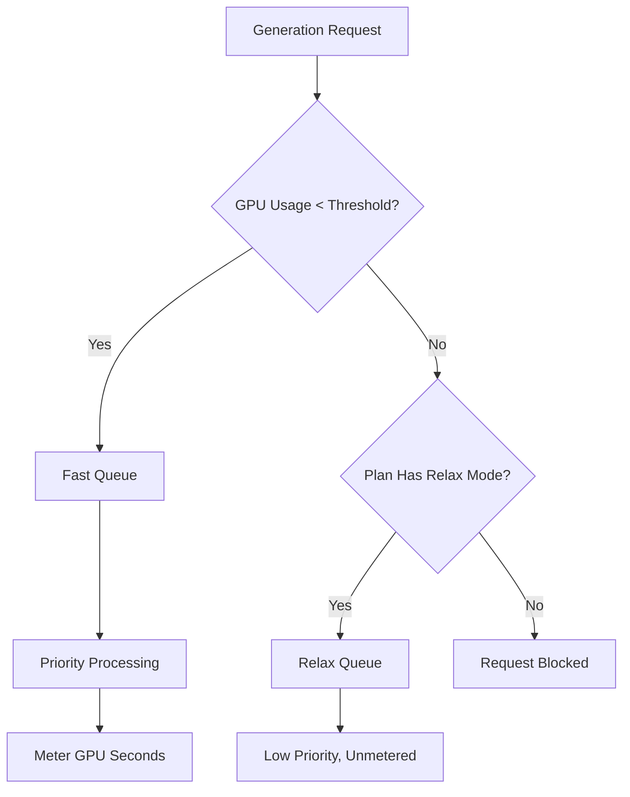

Midjourney adalah platform AI generatif yang menggunakan model penagihan unik berbasis waktu GPU daripada hitungan per-gambar sederhana. Pendekatan ini memastikan render kompleks beresolusi tinggi dikenai biaya lebih tinggi dibandingkan draf cepat beresolusi rendah.

## Cara Midjourney Menagih

Paket langganan Midjourney memberi pengguna jumlah "Jam GPU Cepat" tertentu setiap bulan. Jam ini mewakili waktu komputasi aktual yang digunakan untuk generasi Anda.

| Plan | Price | Fast GPU Hours | Relax Mode | Stealth Mode |
| :--- | :--- | :--- | :--- | :--- |
| Basic | \$10/month | ~3.3 hrs | No | No |
| Standard | \$30/month | 15 hrs | Unlimited | No |
| Pro | \$60/month | 30 hrs | Unlimited | Yes |
| Mega | \$120/month | 60 hrs | Unlimited | Yes |

1. **Pricing Tiers**: Midjourney menawarkan empat tingkat langganan mulai dari \$10 hingga \$120 per bulan, masing-masing menyediakan jumlah Jam GPU Cepat tertentu.
2. **Relax Mode**: Paket Standard dan di atasnya mencakup generasi tanpa batas melalui antrean prioritas rendah setelah jam Cepat habis, memastikan pengguna tidak pernah menghadapi batas penggunaan keras.
3. **Extra GPU Hours**: Pengguna dapat membeli tambahan waktu GPU Cepat sekitar \$4 per jam jika membutuhkan hasil instan setelah kuota bulanan habis.
4. **Metering in GPU Seconds**: Penggunaan dilacak berdasarkan waktu komputasi aktual yang digunakan pada generasi, artinya render kompleks dikenai biaya lebih tinggi dibandingkan draf sederhana.
5. **Community Loop**: Pengguna aktif dapat memperoleh jam GPU bonus dengan memberi peringkat gambar di galeri, yang membantu melatih model sekaligus memberikan hadiah kepada komunitas.
## Apa yang Membuatnya Unik

Model Midjourney efektif karena menyelaraskan biaya dengan nilai dan penggunaan sumber daya.

* **Penagihan waktu GPU** menyelaraskan biaya dengan penggunaan sumber daya, memastikan render kompleks dihargai secara adil dibandingkan draf sederhana.
* **Relax Mode** menawarkan fallback tanpa batas yang mengurangi churn dengan mempertahankan akses layanan bahkan setelah batas bulanan tercapai.
* **Perbedaan Fast vs Relax** mendorong upgrade dengan menawarkan pemrosesan prioritas untuk pengguna yang menghargai kecepatan dan hasil instan.
* **Extra GPU Hours** memberikan opsi top-up fleksibel bagi pengguna berat yang membutuhkan kapasitas prioritas tinggi tambahan di tengah bulan.

## Bangun Ini dengan Dodo Payments

Anda dapat mereplikasi model ini menggunakan Dodo Payments dengan menggabungkan langganan dengan meter pemakaian dan logika tingkat aplikasi.

<Steps>

<Step title="Create a Usage Meter">

Pertama, buat meter untuk melacak detik GPU yang digunakan oleh setiap pelanggan.

* **Meter name**: `gpu.fast_seconds`
* **Aggregation**: **Sum** (jumlah properti `gpu_seconds` dari setiap peristiwa)

Anda hanya akan melacak peristiwa di mana mode generasi adalah "fast". Generasi mode relax tidak dimeter untuk keperluan penagihan.

</Step>

<Step title="Create Subscription Products with Usage Pricing">

Buat produk langganan Anda dan lampirkan meter pemakaian dengan ambang bebas biaya.

| Produk | Base Price | Free Threshold (seconds) | Overage Rate |
| :--- | :--- | :--- | :--- |
| Basic | \$10/month | 12,000 (3.3 hrs) | N/A (Hard Cap) |
| Standard | \$30/month | 54,000 (15 hrs) | \$0.00 (Relax Mode) |
| Pro | \$60/month | 108,000 (30 hrs) | \$0.00 (Relax Mode) |
| Mega | \$120/month | 216,000 (60 hrs) | \$0.00 (Relax Mode) |

Untuk paket Basic, Anda akan menonaktifkan kelebihan batas untuk menerapkan cap keras. Untuk paket lainnya, "Relax Mode" ditangani oleh logika aplikasi Anda saat meter menunjukkan ambang telah terlampaui.

</Step>

<Step title="Implement Application-Level Relax Mode">

Wawasan utamanya adalah bahwa Relax Mode bukan fitur penagihan. Ini adalah aplikasi Anda yang mengarahkan permintaan ke antrean lebih lambat saat meter penggunaan Dodo menunjukkan ambang tercapai.

```typescript
async function handleGenerationRequest(customerId: string, prompt: string) {
  const usage = await getCustomerUsage(customerId, 'gpu.fast_seconds');
  const subscription = await getSubscription(customerId);
  const threshold = getThresholdForPlan(subscription.product_id);
  
  if (usage.current >= threshold) {
    if (subscription.product_id === 'prod_basic') {
      throw new Error('Fast GPU hours exhausted. Upgrade to Standard for Relax Mode.');
    }
    
    // Relax Mode. Route to low-priority queue
    return await queueGeneration(customerId, prompt, {
      priority: 'low',
      mode: 'relax',
      model: 'standard'
    });
  }
  
  // Fast Mode. Priority processing
  return await queueGeneration(customerId, prompt, {
    priority: 'high',
    mode: 'fast',
    model: 'premium'
  });
}
```

</Step>

<Step title="Send Usage Events (Fast Mode Only)">

Hanya kirimkan peristiwa penggunaan ke Dodo ketika generasi dilakukan dalam mode Fast.

```typescript
import DodoPayments from 'dodopayments';

async function trackFastGeneration(customerId: string, gpuSeconds: number, jobId: string) {
  // Only track Fast mode generations. Relax mode is free and unlimited
  const client = new DodoPayments({
    bearerToken: process.env.DODO_PAYMENTS_API_KEY,
  });

  await client.usageEvents.ingest({
    events: [{
      event_id: `gen_${jobId}`,
      customer_id: customerId,
      event_name: 'gpu.fast_seconds',
      timestamp: new Date().toISOString(),
      metadata: {
        gpu_seconds: gpuSeconds,
        resolution: '1024x1024',
        mode: 'fast'
      }
    }]
  });
}
```

</Step>

<Step title="Sell Extra Fast Hours (One-Time Top-Up)">

Buat produk pembayaran satu kali untuk "Extra Fast GPU Hour" seharga \$4. Saat pelanggan membeli ini, Anda dapat memberikan ambang tambahan atau kredit di aplikasi Anda.

```typescript
// After customer purchases extra hours
const session = await client.checkoutSessions.create({
  product_cart: [
    { product_id: 'prod_extra_gpu_hour', quantity: 5 }
  ],
  customer: { customer_id: customerId },
  return_url: 'https://yourapp.com/dashboard'
});
```

</Step>

<Step title="Create Checkout for Subscription">

Terakhir, buat sesi checkout untuk paket langganan.

```typescript
const session = await client.checkoutSessions.create({
  product_cart: [
    { product_id: 'prod_mj_standard', quantity: 1 }
  ],
  customer: { email: 'artist@example.com' },
  return_url: 'https://yourapp.com/studio'
});
```

</Step>

</Steps>

## Percepat dengan Time Range Ingestion Blueprint

[Time Range Ingestion Blueprint](/developer-resources/ingestion-blueprints/time-range) menyederhanakan pelacakan waktu GPU dengan menyediakan helper khusus untuk penagihan berbasis durasi.

```bash
npm install @dodopayments/ingestion-blueprints
```

```typescript
import { Ingestion, trackTimeRange } from '@dodopayments/ingestion-blueprints';

const ingestion = new Ingestion({
  apiKey: process.env.DODO_PAYMENTS_API_KEY,
  environment: 'live_mode',
  eventName: 'gpu.fast_seconds',
});

// Track generation time after a Fast mode job completes
const startTime = Date.now();
const result = await runGeneration(prompt, settings);
const durationMs = Date.now() - startTime;

await trackTimeRange(ingestion, {
  customerId: customerId,
  durationMs: durationMs,
  metadata: {
    mode: 'fast',
    resolution: '1024x1024',
  },
});
```

Blueprint ini menangani konversi durasi dan format peristiwa. Anda hanya perlu memberikan ID pelanggan dan waktu yang telah berlalu.

<Tip>
Time Range Blueprint mendukung milidetik, detik, dan menit. Lihat [dokumentasi blueprint lengkap](/developer-resources/ingestion-blueprints/time-range) untuk semua opsi durasi dan praktik terbaik.
</Tip>

## Arsitektur Fast vs Relax

Sistem antrean ganda bekerja dengan mengarahkan permintaan berdasarkan status penggunaan saat ini.



1. Semua permintaan melewati aplikasi Anda.
2. Aplikasi memeriksa meter penggunaan Dodo terhadap ambang bebas biaya paket.
3. Jika penggunaan di bawah ambang, permintaan masuk ke antrean Fast dan dimeter.
4. Jika penggunaan melewati ambang, permintaan dialihkan ke antrean Relax, yang tidak dimeter dan memiliki prioritas lebih rendah.
5. Paket Basic tidak memiliki fallback Relax, sehingga permintaan diblokir setelah batas tercapai.

<Info>
Relax Mode adalah pola tingkat aplikasi, bukan fitur penagihan Dodo. Dodo melacak penggunaan GPU Cepat Anda dan memberi tahu saat ambang terlampaui. Aplikasi Anda yang memutuskan apakah akan memblokir pengguna atau mengarahkan mereka ke antrean yang lebih lambat.
</Info>

## Fitur Utama Dodo yang Digunakan

<CardGroup cols={2}>
  <Card title="Subscriptions" icon="calendar" href="/features/subscription">
    Atur penagihan berulang dan tingkat paket.
  </Card>
  <Card title="Usage-Based Billing" icon="bolt" href="/features/usage-based-billing/introduction">
    Lacak dan tagih berdasarkan konsumsi sumber daya aktual.
  </Card>
  <Card title="Event Ingestion" icon="input-pipe" href="/features/usage-based-billing/event-ingestion">
    Kirim peristiwa penggunaan volume tinggi ke API Dodo.
  </Card>
  <Card title="Meters" icon="gauge" href="/features/usage-based-billing/meters">
    Tentukan bagaimana peristiwa penggunaan diagregasi dan ditagih.
  </Card>
  <Card title="One-Time Payments" icon="credit-card" href="/features/one-time-payment-products">
    Jual jam ekstra atau top-up sebagai pembelian satu kali.
  </Card>
  <Card title="Time Range Blueprint" icon="clock" href="/developer-resources/ingestion-blueprints/time-range">
    Pelacakan waktu GPU yang disederhanakan dengan helper berbasis durasi.
  </Card>
</CardGroup>
