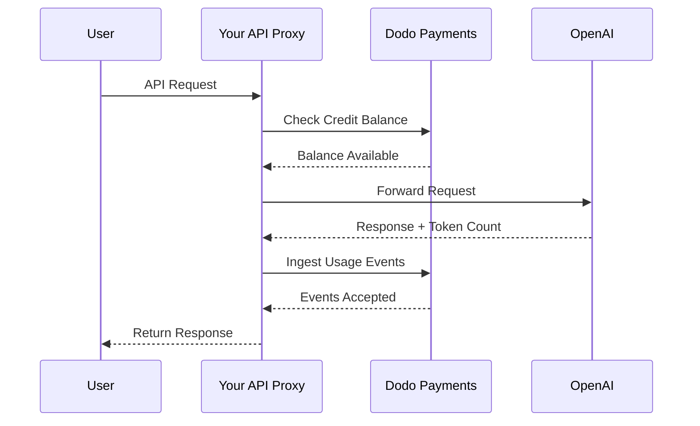
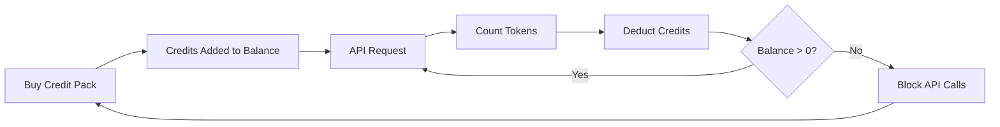

Model penagihan OpenAI adalah standar emas untuk perusahaan AI. Ini menggabungkan kredit fiat prabayar untuk penggunaan API dengan langganan tarif tetap untuk produk konsumen. Pendekatan hibrida ini memastikan pendapatan yang dapat diprediksi sekaligus memungkinkan pengembang untuk meningkatkan penggunaan tanpa hambatan.

## Mengapa Model OpenAI adalah Standar

Industri AI menghadapi tantangan unik yang tidak selalu diatasi oleh penagihan SaaS tradisional. Model OpenAI menyelesaikan beberapa masalah ini secara bersamaan.

1. **Pendapatan yang Dapat Diprediksi dan Risiko Rendah**: Dengan mewajibkan kredit prabayar untuk penggunaan API, OpenAI menghilangkan risiko pengguna menumpuk tagihan besar yang tidak bisa mereka bayar. Anda memperoleh uang di muka, dan pengguna mendapatkan layanan saat mereka menggunakannya.
2. **Skalabilitas untuk Pengembang**: Isi ulang \$5 adalah hambatan masuk yang rendah. Saat aplikasi mereka tumbuh, pengembang bisa mengotomatisasi isi ulang atau membeli paket yang lebih besar. Friksi untuk memulai hampir nol, tetapi batas atas untuk pertumbuhan tidak terbatas.
3. **Psikologi Pengguna**: Menyatakan kredit dalam mata uang fiat (USD) alih-alih "token" atau "poin" abstrak membuat nilainya jelas. Rasanya seperti rekening bank untuk layanan AI, yang membangun kepercayaan dan memudahkan perusahaan merencanakan anggaran.

## Cara OpenAI Menagih

OpenAI menjalankan dua model penagihan berbeda yang melayani kebutuhan pengguna yang berbeda.

1. **API (Bayar sesuai penggunaan)**: API menggunakan kredit prabayar yang dinyatakan dalam fiat. Pengguna mengisi ulang akun mereka dengan \$5, \$10, \$50, atau lebih. Kredit ini menunjukkan nilai dolar tetapi tidak memiliki nilai moneter di luar OpenAI. OpenAI menagih per-token dengan tarif berbeda antara token input dan output. Kredit tidak pernah kedaluwarsa, dan ketika saldo pengguna mencapai \$0, panggilan API mereka langsung gagal.
2. **ChatGPT Plus, Team, dan Enterprise**: Ini adalah langganan tarif tetap. ChatGPT Plus harganya \$20 per bulan, sedangkan paket Team adalah \$25 per pengguna per bulan. Paket ini memiliki batas penggunaan lunak di mana pengguna diturunkan ke model yang lebih kecil daripada diblokir.
3. **Tingkatan tarif berbasis pengeluaran**: Saat Anda menghabiskan lebih banyak uang total dari waktu ke waktu, Anda membuka batas tarif API yang lebih tinggi. Ini adalah sistem penskalaan akses berbasis kepercayaan yang terikat langsung pada riwayat penagihan Anda.

| Model | Harga | Token Input | Token Output |
| :--- | :--- | :--- | :--- |
| GPT-4o | Berbasis penggunaan | \$2.50 / 1M | \$10.00 / 1M |
| GPT-4o-mini | Berbasis penggunaan | \$0.15 / 1M | \$0.60 / 1M |
| o1 | Berbasis penggunaan | \$15.00 / 1M | \$60.00 / 1M |

| Paket | Harga | Jenis |
| :--- | :--- | :--- |
| Gratis | \$0 | Akses terbatas |
| Plus | \$20 / bln | Langganan dengan batas lunak |
| Team | \$25 / pengguna / bln | Langganan per kursi |
| Enterprise | Kustom | Penagihan melalui faktur |
## Apa yang Membuatnya Unik

Strategi penagihan OpenAI memiliki beberapa karakteristik utama yang membuatnya efektif untuk layanan AI.

- **Kredit bernilai fiat**: Kredit terasa seperti uang karena dinyatakan dalam USD. Ini membuat harga transparan dan mudah dipahami oleh pengembang.
- **Tidak ada kedaluwarsa**: Saldo yang tidak pernah kedaluwarsa mengurangi tekanan "gunakan atau hilang". Pengguna merasa nyaman mengisi ulang jumlah besar karena mereka tahu nilainya tidak akan hilang.
- **Meter multi-dimensi**: Token input dan output dilacak secara terpisah tetapi dikurangi dari saldo kredit yang sama. Ini memungkinkan OpenAI memberikan harga berbeda untuk token output yang mahal dibanding token input yang lebih murah.
- **Tingkatan kepercayaan**: Mengaitkan batas tarif dengan total pengeluaran mendorong pengguna tetap berada di platform dan memberi penghargaan kepada pelanggan jangka panjang dengan performa yang lebih baik.
## Keuntungan Strategis

Model ini menciptakan efek flywheel yang kuat. Biaya masuk yang rendah menarik pengembang. Kredit prabayar memberikan arus kas langsung. Skala berbasis penggunaan memastikan bahwa saat pengembang berhasil, OpenAI juga berhasil. Sisi langganan menyediakan dasar pendapatan yang stabil dan dapat diprediksi dari non-pengembang.

## Bangun Ini dengan Dodo Payments

Anda dapat mereplikasi model penagihan OpenAI menggunakan Dodo Payments. Kami akan menggunakan Penagihan Berbasis Kredit untuk API dan langganan standar untuk sisi ChatGPT Plus.

<Steps>
  <Step title="Create a Fiat Credit Entitlement">
    Mulailah dengan membuat hak kredit di dasbor Dodo Payments Anda. Ini akan menjadi saldo pusat untuk pengguna Anda.

    * **Jenis Kredit:** Kredit Fiat (USD)
    * **Kedaluwarsa Kredit:** Tidak pernah
    * **Rollover:** Tidak diperlukan (karena tidak pernah kedaluwarsa)
    * **Overage:** Dinonaktifkan

    Menonaktifkan overage memastikan panggilan API gagal ketika saldo mencapai \$0, persis seperti OpenAI.
  </Step>

  <Step title="Create Top-Up Products">
    Buat produk pembayaran sekali untuk berbagai paket kredit. Anda bisa menawarkan opsi \$5, \$10, \$50, dan \$100. Lampirkan hak kredit fiat Anda ke setiap produk.

    Tetapkan kredit yang diberikan per produk dalam sen. Untuk paket \$50, Anda akan memberikan 5000 kredit.

    ```typescript
    import DodoPayments from 'dodopayments';

    const client = new DodoPayments({
      bearerToken: process.env.DODO_PAYMENTS_API_KEY,
    });

    const session = await client.checkoutSessions.create({
      product_cart: [
        { product_id: 'prod_credit_pack_50', quantity: 1 }
      ],
      customer: { email: 'developer@example.com' },
      return_url: 'https://yourapp.com/dashboard'
    });
    ```

  </Step>

  <Step title="Create Usage Meters">
    Buat dua meter terpisah untuk melacak penggunaan token.

    * `llm.input_tokens`: Agregasi sum pada properti `tokens`.
    * `llm.output_tokens`: Agregasi sum pada properti `tokens`.
    Hubungkan kedua meter ke hak kredit fiat Anda. Anda perlu mengonfigurasi "Meter units per credit" untuk masing-masing.

    ### Menghitung Satuan Meter per Kredit

    Untuk menyesuaikan harga GPT-4o OpenAI (\$2.50 per 1M token input), Anda perlu menghitung berapa banyak token yang setara dengan \$1 (100 sen).

    * **Token Input:** 1.000.000 token / \$2.50 = 400.000 token per \$1.
    * **Token Output:** 1.000.000 token / \$10.00 = 100.000 token per \$1.

    Di dasbor Dodo, Anda akan menetapkan "Meter units per credit" menjadi 400.000 untuk input dan 100.000 untuk output.
  </Step>

  <Step title="Send Usage Events">
    Setelah setiap permintaan LLM, kirim data penggunaan ke Dodo Payments. Anda dapat mengirim event input dan output dalam satu permintaan.


    ```typescript
    await client.usageEvents.ingest({
      events: [{
        event_id: `req_${requestId}`,
        customer_id: customerId,
        event_name: 'llm.input_tokens',
        timestamp: new Date().toISOString(),
        metadata: {
          model: 'gpt-4o',
          tokens: 1500
        }
      }, {
        event_id: `req_${requestId}_out`,
        customer_id: customerId,
        event_name: 'llm.output_tokens',
        timestamp: new Date().toISOString(),
        metadata: {
          model: 'gpt-4o',
          tokens: 800
        }
      }]
    });
    ```

  </Step>

  <Step title="Handle Balance Depletion">
    Anda harus memeriksa saldo pengguna sebelum memproses permintaan API. Jika saldo nol atau negatif, kembalikan error 402.

    ```typescript
    async function checkCreditsBeforeRequest(customerId: string) {
      const balance = await client.creditEntitlements.balances.retrieve(customerId, {
        credit_entitlement_id: 'credit_entitlement_id',
      });

      if (balance.available <= 0) {
        throw new Error('Insufficient credits. Please top up your account.');
      }
    }
    ```

    ### Menangani Webhook Saldo Rendah

    Jangan menunggu hingga pengguna mencapai \$0 untuk memberi tahu mereka. Gunakan webhook untuk memicu email atau notifikasi dalam aplikasi saat saldo mereka turun di bawah ambang tertentu.

    ```typescript
    import DodoPayments from 'dodopayments';
    import express from 'express';

    const app = express();
    app.use(express.raw({ type: 'application/json' }));

    const client = new DodoPayments({
      bearerToken: process.env.DODO_PAYMENTS_API_KEY,
      webhookKey: process.env.DODO_PAYMENTS_WEBHOOK_KEY,
    });

    app.post('/webhooks/dodo', async (req, res) => {
      try {
        const event = client.webhooks.unwrap(req.body.toString(), {
          headers: {
            'webhook-id': req.headers['webhook-id'] as string,
            'webhook-signature': req.headers['webhook-signature'] as string,
            'webhook-timestamp': req.headers['webhook-timestamp'] as string,
          },
        });

        if (event.type === 'credit.balance_low') {
          const { customer_id, available_balance } = event.data;
          await sendLowBalanceEmail(customer_id, available_balance);
        }

        res.json({ received: true });
      } catch (error) {
        res.status(401).json({ error: 'Invalid signature' });
      }
    });
    ```

    <Tip>
      OpenAI mengirimkan email ini saat saldo pengguna hampir habis, memberi mereka waktu untuk mengisi ulang tanpa gangguan layanan.
    </Tip>
  </Step>

  <Step title="Build the ChatGPT Subscription Side (Optional)">
    Jika Anda ingin menawarkan paket langganan seperti ChatGPT Plus, buat produk langganan terpisah di Dodo Payments. Ini tidak perlu hak kredit.


    Untuk paket Team, gunakan penagihan berbasis kursi dengan menambahkan addon untuk setiap pengguna tambahan.

    ```typescript
    const session = await client.checkoutSessions.create({
      product_cart: [
        { product_id: 'prod_plus_subscription', quantity: 1 }
      ],
      customer: { email: 'user@example.com' },
      return_url: 'https://yourapp.com/billing'
    });
    ```

    ### Menerapkan Batas Lunak

    Untuk meniru batas lunak OpenAI, Anda dapat melacak penggunaan pengguna langganan menggunakan meter yang sama tetapi tanpa mengaitkannya ke hak kredit. Dalam logika aplikasi Anda, periksa penggunaan untuk periode penagihan saat ini.

    ```typescript
    async function checkSubscriptionUsage(customerId: string) {
      const usage = await getUsageForCurrentPeriod(customerId);
      
      if (usage > SOFT_CAP_THRESHOLD) {
        // Route to a smaller model instead of blocking
        return 'gpt-4o-mini';
      }
      
      return 'gpt-4o';
    }
    ```

  </Step>
</Steps>

## Percepat dengan Blueprint Ingesti LLM

Langkah-langkah di atas menunjukkan cara membangun dan mengirim event penggunaan secara manual. Untuk deployment produksi, [Blueprint Ingesti LLM](/developer-resources/ingestion-blueprints/llm) menyediakan pelacakan token otomatis yang membungkus klien OpenAI Anda secara langsung.

```bash
npm install @dodopayments/ingestion-blueprints
```

```typescript
import { createLLMTracker } from '@dodopayments/ingestion-blueprints';
import OpenAI from 'openai';

const openai = new OpenAI({ apiKey: process.env.OPENAI_API_KEY });

const tracker = createLLMTracker({
  apiKey: process.env.DODO_PAYMENTS_API_KEY,
  environment: 'live_mode',
  eventName: 'llm.chat_completion',
});

const trackedClient = tracker.wrap({
  client: openai,
  customerId: customerId,
});

// Every API call now automatically tracks token usage
const response = await trackedClient.chat.completions.create({
  model: 'gpt-4o',
  messages: [{ role: 'user', content: prompt }],
});

// inputTokens, outputTokens, and totalTokens are sent automatically
console.log('Tokens used:', response.usage);
```

Blueprint menangkap `inputTokens`, `outputTokens`, dan `totalTokens` dari setiap respons API dan mengirimkannya sebagai metadata event. Konfigurasikan meter Anda untuk mengagregasi pada properti token yang sesuai.

<Tip>
Blueprint LLM mendukung OpenAI, Anthropic, Groq, Google Gemini, OpenRouter, dan Vercel AI SDK. Lihat [dokumentasi blueprint lengkap](/developer-resources/ingestion-blueprints/llm) untuk contoh spesifik penyedia dan konfigurasi lanjutan.
</Tip>

## Menerapkan Tingkatan Tarif Berbasis Pengeluaran

Tingkatan tarif OpenAI adalah cara yang ampuh untuk mengelola kapasitas. Anda dapat menerapkannya dengan melacak total pengeluaran seumur hidup pelanggan.

1. **Lacak Pengeluaran Seumur Hidup:** Dengarkan webhook `payment.succeeded` dan perbarui field `total_spend` di basis data Anda untuk pelanggan tersebut.
2. **Tentukan Tingkatan:** Buat pemetaan jumlah pengeluaran ke batas tarif.
   * Tingkat 1: Pengeluaran \$0 - \$50 -> 3 RPM
   * Tingkat 2: Pengeluaran \$50 - \$250 -> 10 RPM
   * Tingkat 3: Pengeluaran \$250+ -> 50 RPM
3. **Terapkan Batas:** Dalam middleware API Anda, periksa tingkat pelanggan dan terapkan batas tarif yang sesuai.

```typescript
async function getRateLimitForCustomer(customerId: string) {
  const customer = await db.customers.findUnique({ where: { id: customerId } });
  const totalSpend = customer.total_spend;

  if (totalSpend >= 25000) return TIER_3_LIMITS; // $250.00
  if (totalSpend >= 5000) return TIER_2_LIMITS;  // $50.00
  return TIER_1_LIMITS;
}
```

## Contoh Implementasi Lengkap: Proxy API

Dalam skenario dunia nyata, Anda kemungkinan memiliki proxy API yang berada di antara pengguna Anda dan penyedia LLM. Proxy ini menangani otentikasi, pemeriksaan kredit, dan pelaporan penggunaan.



```typescript
import DodoPayments from 'dodopayments';
import OpenAI from 'openai';

const client = new DodoPayments({
  bearerToken: process.env.DODO_PAYMENTS_API_KEY,
});
const openai = new OpenAI({ apiKey: process.env.OPENAI_API_KEY });

export async function handleApiRequest(req, res) {
  const { customerId, prompt, model } = req.body;

  try {
    // 1. Check credit balance
    const balance = await client.creditEntitlements.balances.retrieve(customerId, {
      credit_entitlement_id: 'credit_entitlement_id',
    });

    if (balance.available <= 0) {
      return res.status(402).json({ error: 'Insufficient credits. Please top up.' });
    }

    // 2. Call OpenAI
    const completion = await openai.chat.completions.create({
      model: model,
      messages: [{ role: 'user', content: prompt }],
    });

    const { prompt_tokens, completion_tokens } = completion.usage;

    // 3. Ingest usage events to Dodo
    await client.usageEvents.ingest({
      events: [
        {
          event_id: `req_${completion.id}_in`,
          customer_id: customerId,
          event_name: 'llm.input_tokens',
          timestamp: new Date().toISOString(),
          metadata: { model, tokens: prompt_tokens }
        },
        {
          event_id: `req_${completion.id}_out`,
          customer_id: customerId,
          event_name: 'llm.output_tokens',
          timestamp: new Date().toISOString(),
          metadata: { model, tokens: completion_tokens }
        }
      ]
    });

    // 4. Return response to user
    res.json(completion);

  } catch (error) {
    console.error('API Error:', error);
    res.status(500).json({ error: 'Internal server error' });
  }
}
```

## Menangani Kasus Tepi

Saat membangun sistem penagihan yang serumit milik OpenAI, Anda akan menemukan beberapa kasus tepi yang perlu ditangani dengan hati-hati.

### Kondisi Perlombaan

Jika pengguna memiliki saldo sangat rendah dan mengirim beberapa permintaan sekaligus, mereka mungkin melebihi batas kredit sebelum event pertama diproses. Untuk mencegah ini, Anda bisa menerapkan "buffer" kecil atau menggunakan kunci terdistribusi pada saldo pelanggan selama permintaan.

### Latensi Ingesti Event

Dodo Payments memproses event secara asinkron. Ini berarti mungkin ada sedikit keterlambatan antara panggilan API dan pengurangan kredit. Untuk sebagian besar kasus, ini dapat diterima. Jika Anda membutuhkan penegakan waktu nyata yang ketat, Anda bisa mempertahankan cache lokal saldo pengguna dan memperbaruinya secara optimis.

### Penanganan Pengembalian Dana

Jika Anda mengembalikan pembelian paket kredit, Dodo Payments secara otomatis akan menangani hak kredit jika dikonfigurasi. Namun, Anda harus memastikan logika aplikasi mencerminkan perubahan ini segera agar pengguna tidak menggunakan kredit yang tidak lagi mereka miliki.

### Dukungan Multi-Model

Jika Anda mendukung beberapa model dengan harga berbeda, Anda memiliki dua opsi:
1. **Meter Terpisah:** Buat meter terpisah untuk setiap model (misalnya `gpt-4o.input_tokens`, `gpt-4o-mini.input_tokens`).
2. **Event Berbobot:** Gunakan satu meter tetapi kalikan nilai `tokens` dengan bobot sebelum mengirimkannya ke Dodo. Misalnya, jika GPT-4o 10x lebih mahal daripada GPT-4o-mini, Anda bisa mengirim 10x token untuk permintaan GPT-4o.
OpenAI menggunakan pendekatan meter terpisah secara internal untuk mempertahankan catatan penggunaan per model yang jelas.

## Ikhtisar Arsitektur



Meter melacak token dan mengurangi nilai yang sesuai dari saldo kredit pengguna berdasarkan tarif yang Anda konfigurasikan.

## Kesimpulan

Mereplikasi model penagihan OpenAI dengan Dodo Payments memberi Anda yang terbaik dari kedua dunia: fleksibilitas penagihan berbasis penggunaan dan keterprediksian kredit prabayar. Dengan mengikuti panduan ini, Anda dapat membangun sistem penagihan yang tumbuh seiring pengguna Anda sambil melindungi margin Anda.

Apakah Anda membangun LLM besar berikutnya atau alat AI khusus, pola ini akan membantu Anda menciptakan pengalaman profesional yang ramah pengembang. Pendekatan ini memastikan infrastruktur penagihan Anda seberkembang dan seandal model AI yang Anda sediakan untuk pelanggan Anda.

## Fitur Kunci Dodo yang Digunakan

Jelajahi fitur yang membuat implementasi ini mungkin.

<CardGroup cols={2}>
  <Card title="Credit-Based Billing" icon="coins" href="/features/credit-based-billing">
    Kelola kredit fiat prabayar dan hak untuk pengguna Anda.
  </Card>
  <Card title="Usage-Based Billing" icon="chart-line" href="/features/usage-based-billing/introduction">
    Lacak penggunaan terperinci seperti token dan tagih secara waktu nyata.
  </Card>
  <Card title="One-Time Payments" icon="credit-card" href="/features/one-time-payment-products">
    Jual paket kredit dan isi ulang dengan alur checkout sederhana.
  </Card>
  <Card title="Event Ingestion" icon="bolt" href="/features/usage-based-billing/event-ingestion">
    Kirim data penggunaan volume tinggi ke Dodo Payments dengan mudah.
  </Card>
  <Card title="Webhooks" icon="webhook" href="/developer-resources/webhooks/intents/credit">
    Tetap diperbarui tentang perubahan saldo kredit dan peringatan saldo rendah.
  </Card>
  <Card title="LLM Ingestion Blueprint" icon="brain-circuit" href="/developer-resources/ingestion-blueprints/llm">
    Pelacakan token otomatis untuk OpenAI dan penyedia LLM lainnya.
  </Card>
</CardGroup>

Explore the features that make this implementation possible.

<CardGroup cols={2}>
  <Card title="Credit-Based Billing" icon="coins" href="/features/credit-based-billing">
    Manage prepaid fiat credits and entitlements for your users.
  </Card>
  <Card title="Usage-Based Billing" icon="chart-line" href="/features/usage-based-billing/introduction">
    Track granular usage like tokens and bill for it in real-time.
  </Card>
  <Card title="One-Time Payments" icon="credit-card" href="/features/one-time-payment-products">
    Sell credit packs and top-ups with a simple checkout flow.
  </Card>
  <Card title="Event Ingestion" icon="bolt" href="/features/usage-based-billing/event-ingestion">
    Send high-volume usage data to Dodo Payments with ease.
  </Card>
  <Card title="Webhooks" icon="webhook" href="/developer-resources/webhooks/intents/credit">
    Stay updated on credit balance changes and low balance alerts.
  </Card>
  <Card title="LLM Ingestion Blueprint" icon="brain-circuit" href="/developer-resources/ingestion-blueprints/llm">
    Automatic token tracking for OpenAI and other LLM providers.
  </Card>
</CardGroup>
