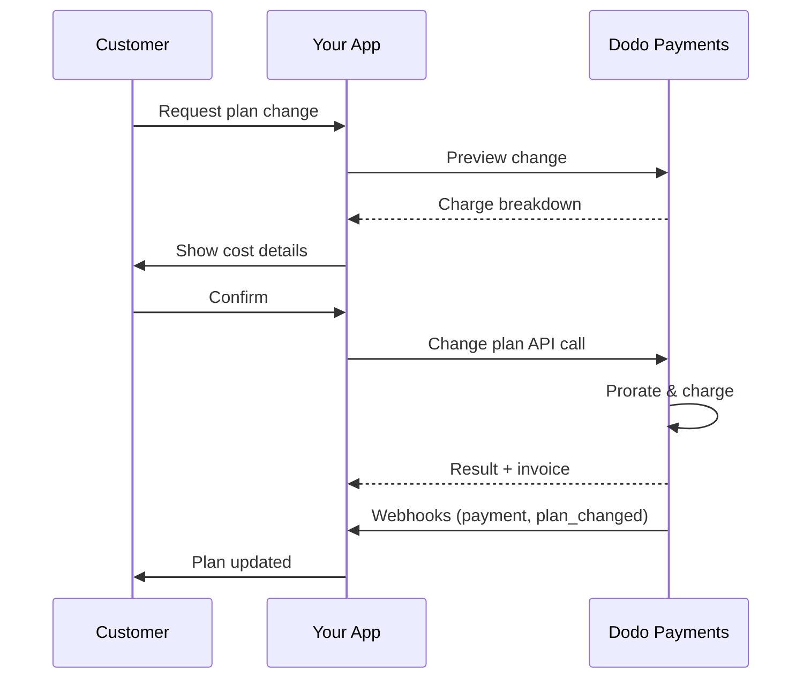
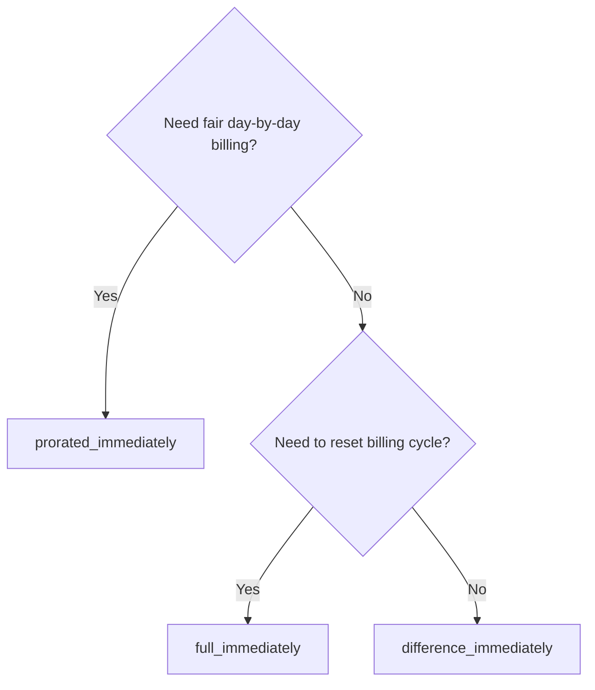
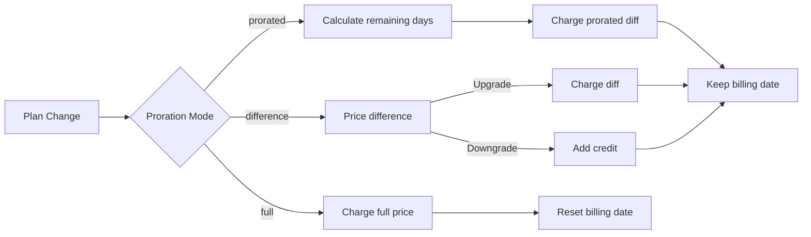

{/* LOCKED_PATTERN_6d744560e4135463c359b094ae69cd5f */}
{/* LOCKED_PATTERN_e019618386b2aca726eb1801e3e74076 */}
  Dokumentasi API lengkap untuk memperbarui langganan.
</Card>
{/* LOCKED_PATTERN_1e8b2499d330dcc44e5e284a3600fd11 */}
  Lihat jumlah tagihan sebelum mengubah paket.
</Card>
{/* LOCKED_PATTERN_782a37ccd4cc5a4159c5497e7f1d4c54 */}
  Panduan langkah demi langkah pengaturan langganan.
</Card>
</CardGroup>

## Apa itu peningkatan atau penurunan langganan?

Perubahan paket memungkinkan Anda memindahkan pelanggan antar tingkatan atau jumlah langganan. Gunakan ini untuk:
- Menyelaraskan harga dengan penggunaan atau fitur
- Beralih dari bulanan ke tahunan (atau sebaliknya)
- Menyesuaikan jumlah untuk produk berbasis kursi

Perubahan paket dapat memicu tagihan langsung tergantung pada mode prorata yang Anda pilih.

## Kapan menggunakan perubahan paket

- Tingkatkan saat pelanggan membutuhkan lebih banyak fitur, penggunaan, atau kursi
- Turunkan saat penggunaan menurun
- Migrasikan pengguna ke produk atau harga baru tanpa membatalkan langganan mereka

## Alur Perubahan Paket



## Prasyarat

Sebelum menerapkan perubahan rencana langganan, pastikan Anda memiliki:

- Akun pedagang Dodo Payments dengan produk langganan aktif
- Kredensial API (kunci API dan kunci rahasia webhook) dari dasbor
- Langganan aktif yang ada untuk dimodifikasi
- Titik akhir webhook yang dikonfigurasi untuk menangani peristiwa langganan

<Info>
Untuk petunjuk penyiapan terperinci, lihat [Panduan Integrasi](/developer-resources/integration-guide#dashboard-setup).
</Info>

## Panduan Implementasi Langkah-demi-Langkah

Ikuti panduan komprehensif ini untuk menerapkan perubahan rencana langganan di aplikasi Anda:

<Steps>
{/* LOCKED_PATTERN_b0d6d45bb453480975a9fb2d18d04caf */}
Sebelum mengimplementasikan, tentukan:
- Produk langganan mana yang bisa diubah ke produk lain
- Mode prorata apa yang sesuai dengan model bisnis Anda
- Cara menangani perubahan paket yang gagal dengan baik
- Event webhook mana yang harus dilacak untuk manajemen status

<Tip>
Uji perubahan paket secara menyeluruh dalam mode uji sebelum menerapkannya di produksi.
</Tip>
</Step>

{/* LOCKED_PATTERN_44f780199a4b76d6c063b33d8f599e9a */}
Pilih pendekatan penagihan yang sesuai dengan kebutuhan bisnis Anda:

<Tabs>
<Tab title="prorated_immediately">
Terbaik untuk: aplikasi SaaS yang ingin menagih secara adil untuk waktu yang tidak terpakai
- Menghitung jumlah prorata yang tepat berdasarkan sisa waktu siklus
- Menagih jumlah prorata berdasarkan waktu yang belum digunakan dalam siklus
- Memberikan penagihan yang transparan kepada pelanggan
</Tab>

<Tab title="difference_immediately">
Terbaik untuk: skenario upgrade/downgrade yang jelas
- Upgrade: Kenakan selisih secara langsung (misalnya, $30→$80 = kenakan $50)
- Downgrade: Kreditkan nilai sisa untuk perpanjangan berikutnya
- Mempermudah logika penagihan dan komunikasi kepada pelanggan
</Tab>

<Tab title="full_immediately">
Terbaik untuk: Saat Anda ingin mengatur ulang siklus penagihan
- Menagih jumlah penuh paket baru segera
- Mengabaikan sisa waktu dari paket lama
- Berguna untuk transisi dari tahunan ke bulanan
</Tab>
</Tabs>
</Step>

{/* LOCKED_PATTERN_62685552c5becb87cfeddbb400a3e69b */}
Gunakan Change Plan API untuk memodifikasi detail langganan:

<ParamField path="subscription_id" type="string" required>
ID langganan aktif yang akan diubah.
</ParamField>

<ParamField path="product_id" type="string" required>
ID produk baru untuk mengganti langganan.
</ParamField>

<ParamField path="quantity" type="integer" default="1">
Jumlah unit untuk paket baru (untuk produk berbasis kursi).
</ParamField>

<ParamField path="proration_billing_mode" type="string" required>
Cara menangani penagihan langsung: `prorated_immediately`, `full_immediately`, atau `difference_immediately`.
</ParamField>

<ParamField path="addons" type="array">
Addon opsional untuk paket baru. Membiarkannya kosong akan menghapus semua addon yang ada.
</ParamField>

{/* LOCKED_PATTERN_dbe6ce0c854d65ccfe8e10a6cd58e3a8 */}
Mengontrol perilaku ketika pembayaran perubahan paket gagal:
- `prevent_change`: Pertahankan langganan pada paket saat ini sampai pembayaran berhasil
- `apply_change` (default): Terapkan perubahan paket segera tanpa memedulikan hasil pembayaran

Jika tidak ditentukan, menggunakan pengaturan default tingkat bisnis.
</ParamField>
</Step>

{/* LOCKED_PATTERN_5c8c73c93c2f49c93ec60fbfa164dd3a */}
Atur penanganan webhook untuk melacak hasil perubahan paket:

- `subscription.active`: Perubahan paket berhasil, langganan diperbarui
- `subscription.plan_changed`: Paket langganan berubah (upgrade/downgrade/pembaruan addon)
- `subscription.on_hold`: Tagihan perubahan paket gagal, langganan dijeda
- `payment.succeeded`: Tagihan langsung untuk perubahan paket berhasil
- `payment.failed`: Tagihan langsung gagal

<Warning>
Selalu verifikasi tanda tangan webhook dan terapkan pemrosesan event bersifat idempoten.
</Warning>
</Step>

{/* LOCKED_PATTERN_df7c84793753eaba82a0d637e200faa6 */}
Berdasarkan event webhook, perbarui aplikasi Anda:
- Berikan/cabut fitur berdasarkan paket baru
- Perbarui dashboard pelanggan dengan detail paket baru
- Kirim email konfirmasi tentang perubahan paket
- Catat perubahan penagihan untuk keperluan audit
</Step>

{/* LOCKED_PATTERN_bee75f9c04c9720f2dc211cbed62a7c6 */}
Uji implementasi Anda secara menyeluruh:
- Uji semua mode prorata dengan berbagai skenario
- Verifikasi penanganan webhook berjalan dengan baik
- Pantau tingkat keberhasilan perubahan paket
- Siapkan pemberitahuan untuk perubahan paket yang gagal
<Check>

<Check>
Implementasi perubahan paket langganan Anda sekarang siap digunakan di produksi.
</Check>
</Step>
</Steps>

## Pratinjau Perubahan Paket

Sebelum menyetujui perubahan paket, gunakan Preview API untuk menunjukkan kepada pelanggan berapa tepatnya yang akan ditagihkan:

<Tabs>
<Tab title="Node.js SDK">

```javascript
const preview = await client.subscriptions.previewChangePlan('sub_123', {
  product_id: 'prod_pro',
  quantity: 1,
  proration_billing_mode: 'prorated_immediately'
});

// Show customer the charge before confirming
console.log('Immediate charge:', preview.immediate_charge.summary);
console.log('New plan details:', preview.new_plan);
```

</Tab>

<Tab title="Python SDK">

```python
preview = client.subscriptions.preview_change_plan(
    subscription_id="sub_123",
    product_id="prod_pro",
    quantity=1,
    proration_billing_mode="prorated_immediately"
)

# Show customer the charge before confirming
print("Immediate charge:", preview.immediate_charge.summary)
print("New plan details:", preview.new_plan)
```

</Tab>
</Tabs>

<Tip>
Gunakan Preview API untuk membangun dialog konfirmasi yang menunjukkan jumlah pasti yang akan ditagihkan kepada pelanggan sebelum mereka mengonfirmasi perubahan paket.
</Tip>

## Change Plan API

Gunakan Change Plan API untuk memodifikasi produk, kuantitas, dan perilaku prorata untuk langganan aktif.

### Contoh mulai cepat

<Tabs>
  <Tab title="Node.js SDK">

    ```javascript
    import DodoPayments from 'dodopayments';

    const client = new DodoPayments({
      bearerToken: process.env.DODO_PAYMENTS_API_KEY,
      environment: 'test_mode', // defaults to 'live_mode'
    });

    async function changePlan() {
      const result = await client.subscriptions.changePlan('sub_123', {
        product_id: 'prod_new',
        quantity: 3,
        proration_billing_mode: 'prorated_immediately',
        on_payment_failure: 'prevent_change', // Optional: control behavior on payment failure
      });
      console.log(result.status, result.invoice_id, result.payment_id);
    }

    changePlan();
    ```

  </Tab>
  <Tab title="Python SDK">

    ```python
    import os
    from dodopayments import DodoPayments

    client = DodoPayments(
        bearer_token=os.environ.get("DODO_PAYMENTS_API_KEY"),
        environment="test_mode",  # defaults to "live_mode"
    )

    result = client.subscriptions.change_plan(
        subscription_id="sub_123",
        product_id="prod_new",
        quantity=3,
        proration_billing_mode="prorated_immediately",
        on_payment_failure="prevent_change",  # Optional: control behavior on payment failure
    )
    print(result.status, result.get("invoice_id"), result.get("payment_id"))
    ```

  </Tab>
  <Tab title="Go SDK">

    ```go
    package main

    import (
      "context"
      "fmt"
      "github.com/dodopayments/dodopayments-go"
      "github.com/dodopayments/dodopayments-go/option"
    )

    func main() {
      client := dodopayments.NewClient(option.WithBearerToken("YOUR_TOKEN"))
      res, err := client.Subscriptions.ChangePlan(context.TODO(), dodopayments.SubscriptionChangePlanParams{
        SubscriptionID: dodopayments.F("sub_123"),
        ProductID:             dodopayments.F("prod_new"),
        Quantity:              dodopayments.F(int64(3)),
        ProrationBillingMode:  dodopayments.F(dodopayments.SubscriptionChangePlanParamsProrationBillingModeProratedImmediately),
        OnPaymentFailure:      dodopayments.F(dodopayments.OnPaymentFailurePreventChange), // Optional
      })
      if err != nil { panic(err) }
      fmt.Println(res.Status, res.InvoiceID, res.PaymentID)
    }
    ```

  </Tab>
  <Tab title="HTTP">

    ```bash
    curl -X POST "$DODO_API_BASE/subscriptions/sub_123/change-plan" \
      -H "Authorization: Bearer $DODO_PAYMENTS_API_KEY" \
      -H "Content-Type: application/json" \
      -d '{
        "product_id": "prod_new",
        "quantity": 3,
        "proration_billing_mode": "prorated_immediately",
        "on_payment_failure": "prevent_change"
      }'
    ```

  </Tab>
</Tabs>

```json Success
{
  "status": "processing",
  "subscription_id": "sub_123",
  "invoice_id": "inv_789",
  "payment_id": "pay_456",
  "proration_billing_mode": "prorated_immediately"
}
```

<Note>
Field seperti <code>invoice_id</code> dan <code>payment_id</code> hanya dikembalikan ketika tagihan langsung dan/atau faktur dibuat selama perubahan paket. Selalu andalkan event webhook (misalnya <code>payment.succeeded</code>, <code>subscription.plan_changed</code>) untuk mengonfirmasi hasil.
</Note>

<Warning>
Jika tagihan langsung gagal, langganan mungkin berpindah ke `subscription.on_hold` sampai pembayaran berhasil.
</Warning>

## Mengelola Addon

Saat mengubah paket langganan, Anda juga dapat memodifikasi addon:

```javascript
// Add addons to the new plan
await client.subscriptions.changePlan('sub_123', {
  product_id: 'prod_new',
  quantity: 1,
  proration_billing_mode: 'difference_immediately',
  addons: [
    { addon_id: 'addon_123', quantity: 2 }
  ]
});

// Remove all existing addons
await client.subscriptions.changePlan('sub_123', {
  product_id: 'prod_new',
  quantity: 1,
  proration_billing_mode: 'difference_immediately',
  addons: [] // Empty array removes all existing addons
});
```

<Info>
Addon termasuk dalam perhitungan prorata dan akan ditagih sesuai mode prorata yang dipilih.
</Info>

## Mode prorata

Pilih cara menagih pelanggan ketika mengubah paket:

#### `prorated_immediately`
- Menagih selisih parsial dalam siklus saat ini
- Jika dalam masa percobaan, langsung dikenai biaya dan beralih ke paket baru sekarang
- Downgrade: dapat menghasilkan kredit prorata yang diterapkan pada perpanjangan mendatang

#### `full_immediately`
- Menagih jumlah penuh paket baru segera
- Mengabaikan sisa waktu dari paket lama

<Info>
Kredit yang dibuat oleh downgrade menggunakan <code>difference_immediately</code> bersifat terbatas pada langganan dan berbeda dari <a href="/features/customer-credit">Customer Credits</a>. Mereka secara otomatis diterapkan ke perpanjangan berikutnya dari langganan yang sama dan tidak dapat dipindahkan antar langganan.
</Info>

#### `difference_immediately`
- Upgrade: segera kenakan selisih harga antara paket lama dan baru
- Downgrade: tambahkan nilai sisa sebagai kredit internal ke langganan dan terapkan secara otomatis pada perpanjangan

| Fitur | `prorated_immediately` | `difference_immediately` | `full_immediately` |
|---------|----------------------|------------------------|-------------------|
| **Tagihan upgrade** | Selisih prorata untuk hari yang tersisa | Selisih harga penuh antar paket | Harga penuh paket baru |
| **Kredit downgrade** | Kredit prorata untuk hari yang tersisa | Selisih harga penuh sebagai kredit | Tidak ada kredit |
| **Siklus penagihan** | Tidak berubah | Tidak berubah | Diatur ulang ke hari ini |
| **Perilaku percobaan** | Mengakhiri percobaan, menagih segera | Mengakhiri percobaan, menagih segera | Mengakhiri percobaan, menagih jumlah penuh |
| **Terbaik untuk** | Penagihan berbasis waktu yang adil | Matematika upgrade/downgrade sederhana | Mengatur ulang siklus penagihan |
| **Kompleksitas** | Sedang (perhitungan hari) | Rendah (pengurangan sederhana) | Rendah (penagihan penuh) |



### Skenario contoh

Gunakan angka kanonik ini secara konsisten:
- Paket saat ini: **Basic** seharga **$30/bulan**
- Target upgrade: **Pro** seharga **$80/bulan**
- Target downgrade (dari Pro): **Starter** seharga **$20/bulan**
- Siklus penagihan: **30 hari**, dimulai pada **1 Januari**
- Perubahan paket terjadi pada **16 Januari** (15 hari tersisa, 15 hari telah digunakan)

<AccordionGroup>
  {/* LOCKED_PATTERN_1a58b4dbcc060de029ff28c82c80a6fe */}

    ```
    Step 1: Calculate unused credit from current plan
      Unused days = 15 out of 30 days
      Credit = $30 × (15/30) = $15.00

    Step 2: Calculate prorated cost of new plan
      Remaining days = 15 out of 30 days
      New plan cost = $80 × (15/30) = $40.00

    Step 3: Calculate immediate charge
      Charge = New plan cost − Credit
      Charge = $40.00 − $15.00 = $25.00

    → Customer pays $25.00 now
    → Next renewal (Feb 1): $80.00/month
    ```

    ```javascript
    await client.subscriptions.changePlan('sub_123', {
      product_id: 'prod_pro',
      quantity: 1,
      proration_billing_mode: 'prorated_immediately'
    })
    ```

  </Accordion>

  {/* LOCKED_PATTERN_807a82fa1b52ee9a606ce1f9c1d8b613 */}

    ```
    Step 1: Calculate unused credit from current plan
      Unused days = 15 out of 30 days
      Credit = $80 × (15/30) = $40.00

    Step 2: Calculate prorated cost of new plan
      Remaining days = 15 out of 30 days
      New plan cost = $20 × (15/30) = $10.00

    Step 3: Calculate credit balance
      Credit = $40.00 − $10.00 = $30.00

    → No charge — $30.00 credit added to subscription
    → Credit auto-applies to future renewals
    → Next renewal (Feb 1): $20.00 − $30.00 credit = $0.00
    → Following renewal (Mar 1): $20.00 − $10.00 remaining credit = $10.00
    ```

    ```javascript
    await client.subscriptions.changePlan('sub_123', {
      product_id: 'prod_starter',
      quantity: 1,
      proration_billing_mode: 'prorated_immediately'
    })
    ```

  </Accordion>

  {/* LOCKED_PATTERN_67905dd0e892a1412bd0f1a567dd0a62 */}

    ```
    Immediate charge = New plan price − Old plan price
                     = $80 − $30
                     = $50.00

    → Customer pays $50.00 now (regardless of cycle position)
    → Next renewal (Feb 1): $80.00/month
    ```

    ```javascript
    await client.subscriptions.changePlan('sub_123', {
      product_id: 'prod_pro',
      quantity: 1,
      proration_billing_mode: 'difference_immediately'
    })
    ```

  </Accordion>

  {/* LOCKED_PATTERN_b17ed67d3062fadb798904adf781b844 */}

    ```
    Credit = Old plan price − New plan price
           = $80 − $20
           = $60.00

    → No charge — $60.00 credit added to subscription
    → Credit auto-applies to future renewals
    → Next renewal: $20.00 − $20.00 (from credit) = $0.00
    → Following renewal: $20.00 − $20.00 (from credit) = $0.00
    → Third renewal: $20.00 − $20.00 (from remaining credit) = $0.00
    ```

    ```javascript
    await client.subscriptions.changePlan('sub_123', {
      product_id: 'prod_starter',
      quantity: 1,
      proration_billing_mode: 'difference_immediately'
    })
    ```

  </Accordion>

  {/* LOCKED_PATTERN_0cb1a5657302a3970059ca925841dcd5 */}

    ```
    Immediate charge = Full new plan price = $80.00

    → Customer pays $80.00 now
    → No credit for unused time on old plan
    → Billing cycle resets to today (January 16)
    → Next renewal: February 16 at $80.00/month
    ```

    ```javascript
    await client.subscriptions.changePlan('sub_123', {
      product_id: 'prod_pro',
      quantity: 1,
      proration_billing_mode: 'full_immediately'
    })
    ```

  </Accordion>

  {/* LOCKED_PATTERN_6edab7762bdaeaf6cef5f85bafdb8832 */}

    ```
    Current: Basic plan ($30/month), no add-ons
    New: Pro plan ($80/month) + Extra Seats add-on ($10/seat × 3 seats = $30/month)
    Change on day 16 of 30 (15 days remaining)

    Step 1: Credit from current plan
      Credit = $30 × (15/30) = $15.00

    Step 2: Prorated cost of new plan + add-ons
      New plan = $80 × (15/30) = $40.00
      Add-ons = $30 × (15/30) = $15.00
      Total new = $55.00

    Step 3: Immediate charge
      Charge = $55.00 − $15.00 = $40.00

    → Customer pays $40.00 now
    → Next renewal: $80.00 + $30.00 = $110.00/month
    ```

    ```javascript
    await client.subscriptions.changePlan('sub_123', {
      product_id: 'prod_pro',
      quantity: 1,
      proration_billing_mode: 'prorated_immediately',
      addons: [
        { addon_id: 'addon_seats', quantity: 3 }
      ]
    })
    ```

  </Accordion>
</AccordionGroup>

### Bagaimana setiap mode memproses penagihan



<Tip>
Pilih `prorated_immediately` untuk akuntansi waktu yang adil; pilih `full_immediately` untuk memulai ulang penagihan; gunakan `difference_immediately` untuk upgrade sederhana dan kredit otomatis pada downgrade.
</Tip>

## Menangani Kegagalan Pembayaran

Kontrol apa yang terjadi ketika pembayaran perubahan paket gagal menggunakan parameter `on_payment_failure`.

### Mode Kegagalan Pembayaran

<Tabs>
{/* LOCKED_PATTERN_9a289e347ae0d2762cd8b5bae425d96d */}
**Perilaku**: Pertahankan langganan pada paket saat ini sampai pembayaran berhasil.

- Perubahan paket ditandai sebagai "tertunda"
- Pelanggan tetap memiliki akses ke paket saat ini
- Langganan berpindah ke `active` hanya setelah pembayaran berhasil
- Berguna ketika Anda ingin memastikan pembayaran sebelum memberikan fitur yang ditingkatkan

```javascript
await client.subscriptions.changePlan('sub_123', {
  product_id: 'prod_pro',
  quantity: 1,
  proration_billing_mode: 'prorated_immediately',
  on_payment_failure: 'prevent_change'
});
```

</Tab>

{/* LOCKED_PATTERN_389bf4efb62466ceba65070629169973 */}
**Perilaku**: Terapkan perubahan paket segera tanpa memedulikan hasil pembayaran.

- Perubahan paket diterapkan bahkan jika pembayaran gagal
- Pelanggan mendapatkan akses langsung ke paket baru
- Langganan mungkin beralih ke `on_hold` jika pembayaran gagal
- Baik untuk upgrade yang tidak kritis atau ketika Anda mempercayai pelanggan

```javascript
await client.subscriptions.changePlan('sub_123', {
  product_id: 'prod_pro',
  quantity: 1,
  proration_billing_mode: 'prorated_immediately',
  on_payment_failure: 'apply_change' // This is the default
});
```

</Tab>
</Tabs>

<Info>
Jika tidak ditentukan, parameter `on_payment_failure` menggunakan pengaturan default tingkat bisnis Anda yang dikonfigurasi di dasbor.
</Info>

### Kapan Menggunakan Setiap Mode

| Skenario | Mode yang Direkomendasikan | Alasan |
|----------|------------------|--------|
| Meng-upgrade ke fitur premium | `prevent_change` | Pastikan pembayaran sebelum memberikan akses |
| Penambahan jumlah (lebih banyak kursi) | `prevent_change` | Cegah penggunaan tanpa pembayaran |
| Menurunkan paket | `apply_change` | Pelanggan mengurangi pengeluaran |
| Pelanggan enterprise tepercaya | `apply_change` | Risiko tidak bayar lebih rendah |
| Konversi dari uji coba ke berbayar | `prevent_change` | Momen pembayaran kritis |

## Menangani webhook

Lacak status langganan melalui webhook untuk mengonfirmasi perubahan paket dan pembayaran.

### Jenis event yang harus ditangani
- `subscription.active`: langganan diaktifkan
- `subscription.plan_changed`: paket langganan berubah (upgrade/downgrade/perubahan addon)
- `subscription.on_hold`: tagihan gagal, langganan dijeda
- `subscription.renewed`: perpanjangan berhasil
- `payment.succeeded`: pembayaran untuk perubahan paket atau perpanjangan berhasil
- `payment.failed`: pembayaran gagal

<Info>
Kami menyarankan mendorong logika bisnis dari event langganan dan menggunakan event pembayaran untuk konfirmasi serta rekonsiliasi.
</Info>

### Verifikasi tanda tangan dan tangani intent

<Tabs>
  <Tab title="Next.js Route Handler">

    ```javascript
    import { NextRequest, NextResponse } from 'next/server';
    
    export async function POST(req) {
      const webhookId = req.headers.get('webhook-id');
      const webhookSignature = req.headers.get('webhook-signature');
      const webhookTimestamp = req.headers.get('webhook-timestamp');
      const secret = process.env.DODO_WEBHOOK_SECRET;
    
      const payload = await req.text();
      // verifySignature is a placeholder – in production, use a Standard Webhooks library
      const { valid, event } = await verifySignature(
        payload,
        { id: webhookId, signature: webhookSignature, timestamp: webhookTimestamp },
        secret
      );
      if (!valid) return NextResponse.json({ error: 'Invalid signature' }, { status: 400 });
    
      switch (event.type) {
        case 'subscription.active':
          // mark subscription active in your DB
          break;
        case 'subscription.plan_changed':
          // refresh entitlements and reflect the new plan in your UI
          break;
        case 'subscription.on_hold':
          // notify user to update payment method
          break;
        case 'subscription.renewed':
          // extend access window
          break;
        case 'payment.succeeded':
          // reconcile payment for plan change
          break;
        case 'payment.failed':
          // log and alert
          break;
        default:
          // ignore unknown events
          break;
      }
    
      return NextResponse.json({ received: true });
    }
    ```

  </Tab>
  <Tab title="Express.js">

    ```javascript
    import express from 'express';
    
    const app = express();
    app.post('/webhooks/dodo', express.raw({ type: 'application/json' }), async (req, res) => {
      const webhookId = req.header('webhook-id');
      const webhookSignature = req.header('webhook-signature');
      const webhookTimestamp = req.header('webhook-timestamp');
      const secret = process.env.DODO_WEBHOOK_SECRET;
      const payload = req.body.toString('utf8');
    
      const { valid, event } = await verifySignature(
        payload,
        { id: webhookId, signature: webhookSignature, timestamp: webhookTimestamp },
        secret
      );
      if (!valid) return res.status(400).send('Invalid signature');
    
      // handle events like above
      res.json({ received: true });
    });
    
    app.listen(3000);
    ```

  </Tab>
</Tabs>

<Note>
Untuk skema payload terperinci, lihat <a href="/developer-resources/webhooks/intents/subscription">Payload webhook langganan</a> dan <a href="/developer-resources/webhooks/intents/payment">Payload webhook pembayaran</a>.
</Note>

## Praktik Terbaik

Ikuti rekomendasi ini untuk perubahan paket langganan yang andal:

### Strategi Perubahan Paket
- **Uji secara menyeluruh**: Selalu uji perubahan paket dalam mode uji sebelum produksi
- **Pilih prorata dengan hati-hati**: Pilih mode prorata yang sesuai dengan model bisnis Anda
- **Tangani kegagalan dengan baik**: Terapkan penanganan error dan logika pengulangan yang tepat
- **Pantau tingkat keberhasilan**: Lacak tingkat keberhasilan/kegagalan perubahan paket dan selidiki masalah

### Implementasi Webhook
- **Verifikasi tanda tangan**: Selalu validasi tanda tangan webhook untuk memastikan keaslian
- **Terapkan idempoten**: Tangani event webhook duplikat dengan baik
- **Proses secara asinkron**: Jangan blokir respon webhook dengan operasi berat
- **Catat semuanya**: Pertahankan log detail untuk tujuan debugging dan audit

### Pengalaman Pengguna
- **Komunikasikan dengan jelas**: Beritahu pelanggan tentang perubahan penagihan dan waktunya
- **Berikan konfirmasi**: Kirim konfirmasi email untuk perubahan paket yang sukses
- **Tangani kasus khusus**: Pertimbangkan periode uji coba, prorata, dan pembayaran yang gagal
- **Perbarui antarmuka segera**: Tampilkan perubahan paket di antarmuka aplikasi Anda

## Masalah Umum dan Solusinya

Atasi masalah khas yang ditemui selama perubahan paket langganan:

<AccordionGroup>
{/* LOCKED_PATTERN_112861435a085998aa537e347e24f368 */}
**Gejala**: Panggilan API berhasil tetapi langganan tetap pada paket lama

**Penyebab umum**:
- Pemrosesan webhook gagal atau tertunda
- Status aplikasi tidak diperbarui setelah menerima webhook
- Masalah transaksi basis data saat memperbarui status

**Solusi**:
- Terapkan penanganan webhook yang kokoh dengan logika pengulangan
- Gunakan operasi idempoten untuk pembaruan status
- Tambahkan pemantauan untuk mendeteksi dan memberi peringatan pada event webhook yang terlewat
- Verifikasi endpoint webhook dapat diakses dan merespons dengan benar
</Accordion>

{/* LOCKED_PATTERN_653656c823b0f191581a523ab18f0f3f */}
**Gejala**: Pelanggan turun kelas tetapi tidak melihat saldo kredit

**Penyebab umum**:
- Harapan mode prorata: downgrade memberi kredit selisih harga penuh dengan `difference_immediately`, sedangkan `prorated_immediately` membuat kredit prorata berdasarkan waktu sisa dalam siklus
- Kredit bersifat spesifik langganan dan tidak dapat dipindahkan antar langganan
- Saldo kredit tidak terlihat di dashboard pelanggan

**Solusi**:
- Gunakan `difference_immediately` untuk downgrade ketika Anda menginginkan kredit otomatis
- Jelaskan kepada pelanggan bahwa kredit berlaku untuk perpanjangan masa depan dari langganan yang sama
- Terapkan portal pelanggan untuk menampilkan saldo kredit
- Periksa pratinjau faktur berikutnya untuk melihat kredit yang diterapkan
</Accordion>

{/* LOCKED_PATTERN_1b0516ec68b4083dc4d6ae9b330f3f1a */}
**Gejala**: Event webhook ditolak karena tanda tangan tidak valid

**Penyebab umum**:
- Kunci rahasia webhook yang salah
- Body permintaan mentah dimodifikasi sebelum verifikasi tanda tangan
- Algoritma verifikasi tanda tangan yang salah

**Solusi**:
- Verifikasi bahwa Anda menggunakan `DODO_WEBHOOK_SECRET` yang benar dari dasbor
- Baca body permintaan mentah sebelum middleware parsing JSON
- Gunakan pustaka verifikasi webhook standar untuk platform Anda
- Uji verifikasi tanda tangan webhook di lingkungan pengembangan
</Accordion>

{/* LOCKED_PATTERN_638d7c911003cceda8c7d34ff8a2c381 */}
**Gejala**: API mengembalikan error 422 Unprocessable Entity

**Penyebab umum**:
- ID langganan atau ID produk tidak valid
- Langganan tidak dalam status aktif
- Parameter wajib hilang
- Produk tidak tersedia untuk perubahan paket

**Solusi**:
- Verifikasi langganan ada dan aktif
- Periksa ID produk valid dan tersedia
- Pastikan semua parameter wajib disediakan
- Tinjau dokumentasi API untuk persyaratan parameter
</Accordion>

{/* LOCKED_PATTERN_7917a64bf4b26c933f2e4649e9278a56 */}
**Gejala**: Perubahan paket dimulai tetapi biaya langsung gagal

**Penyebab umum**:
- Dana tidak cukup di metode pembayaran pelanggan
- Metode pembayaran kedaluwarsa atau tidak valid
- Bank menolak transaksi
- Deteksi penipuan memblokir biaya

**Solusi**:
- Tangani peristiwa webhook `payment.failed` dengan tepat
- Beri tahu pelanggan untuk memperbarui metode pembayaran
- Terapkan logika pengulangan untuk kegagalan sementara
- Pertimbangkan mengizinkan perubahan paket meskipun biaya langsung gagal
</Accordion>

{/* LOCKED_PATTERN_20276630e99e95ac9f5cdd0b347713bb */}
**Gejala**: Biaya perubahan paket gagal dan langganan berpindah ke status `on_hold`

**Apa yang terjadi**:
Saat biaya perubahan paket gagal, langganan otomatis ditempatkan dalam status `on_hold`. Langganan tidak akan diperpanjang secara otomatis sampai metode pembayaran diperbarui.

**Solusi**: Perbarui metode pembayaran untuk mengaktifkan kembali langganan

Untuk mengaktifkan kembali langganan dari status `on_hold` setelah perubahan paket gagal:

1. **Perbarui metode pembayaran** menggunakan Update Payment Method API
2. **Pembuatan biaya otomatis**: API secara otomatis membuat biaya untuk sisa tunggakan
3. **Pembuatan faktur**: Faktur dibuat untuk biaya tersebut
4. **Pemrosesan pembayaran**: Pembayaran diproses menggunakan metode pembayaran baru
5. **Reaktivasi**: Setelah pembayaran berhasil, langganan diaktifkan kembali ke status `active`

<CodeGroup>

```javascript Node.js
// Reactivate subscription from on_hold after failed plan change
async function reactivateAfterFailedPlanChange(subscriptionId) {
  // Update payment method - automatically creates charge for remaining dues
  const response = await client.subscriptions.updatePaymentMethod(subscriptionId, {
    type: 'new',
    return_url: 'https://example.com/return'
  });
  
  if (response.payment_id) {
    console.log('Charge created for remaining dues:', response.payment_id);
    console.log('Payment link:', response.payment_link);
    
    // Redirect customer to payment_link to complete payment
    // Monitor webhooks for:
    // 1. payment.succeeded - charge succeeded
    // 2. subscription.active - subscription reactivated
  }
  
  return response;
}

// Or use existing payment method if available
async function reactivateWithExistingPaymentMethod(subscriptionId, paymentMethodId) {
  const response = await client.subscriptions.updatePaymentMethod(subscriptionId, {
    type: 'existing',
    payment_method_id: paymentMethodId
  });
  
  // Monitor webhooks for payment.succeeded and subscription.active
  return response;
}
```

```python Python
# Reactivate subscription from on_hold after failed plan change
def reactivate_after_failed_plan_change(subscription_id):
    # Update payment method - automatically creates charge for remaining dues
    response = client.subscriptions.update_payment_method(
        subscription_id=subscription_id,
        type="new",
        return_url="https://example.com/return"
    )
    
    if response.payment_id:
        print("Charge created for remaining dues:", response.payment_id)
        print("Payment link:", response.payment_link)
        
        # Redirect customer to payment_link to complete payment
        # Monitor webhooks for:
        # 1. payment.succeeded - charge succeeded
        # 2. subscription.active - subscription reactivated
    
    return response

# Or use existing payment method if available
def reactivate_with_existing_payment_method(subscription_id, payment_method_id):
    response = client.subscriptions.update_payment_method(
        subscription_id=subscription_id,
        type="existing",
        payment_method_id=payment_method_id
    )
    
    # Monitor webhooks for payment.succeeded and subscription.active
    return response
```

</CodeGroup>
**Peristiwa webhook yang perlu dipantau**:
- `subscription.on_hold`: Langganan ditangguhkan (dikirim saat biaya perubahan paket gagal)
- `payment.succeeded`: Pembayaran untuk sisa tunggakan berhasil (setelah memperbarui metode pembayaran)
- `subscription.active`: Langganan diaktifkan kembali setelah pembayaran berhasil

**Praktik terbaik**:
- Beri tahu pelanggan segera ketika biaya perubahan paket gagal
- Berikan instruksi jelas tentang cara memperbarui metode pembayaran
- Pantau peristiwa webhook untuk melacak status reaktivasi
- Pertimbangkan menerapkan logika pengulangan otomatis untuk kegagalan pembayaran sementara

{/* LOCKED_PATTERN_d215ea1d00e95d5e9d5b4b6085f2443f */}
Lihat dokumentasi API lengkap untuk memperbarui metode pembayaran dan mengaktifkan kembali langganan.
</Card>
</Accordion>
</AccordionGroup>

**Webhook events to monitor**:
- `subscription.on_hold`: Subscription placed on hold (received when plan change charge fails)
- `payment.succeeded`: Payment for remaining dues succeeded (after updating payment method)
- `subscription.active`: Subscription reactivated after successful payment

**Best practices**:
- Notify customers immediately when a plan change charge fails
- Provide clear instructions on how to update their payment method
- Monitor webhook events to track reactivation status
- Consider implementing automatic retry logic for temporary payment failures

{/* LOCKED_PATTERN_d215ea1d00e95d5e9d5b4b6085f2443f */}
View the complete API documentation for updating payment methods and reactivating subscriptions.
</Card>
</Accordion>
</AccordionGroup>

## Menguji Implementasi Anda

Ikuti langkah-langkah ini untuk menguji secara menyeluruh implementasi perubahan paket langganan Anda:

<Steps>
{/* LOCKED_PATTERN_f5ce79c6f425de558f6fdd6cea5793f5 */}
- Gunakan kunci API pengujian dan produk pengujian
- Buat langganan pengujian dengan berbagai jenis paket
- Konfigurasikan endpoint webhook pengujian
- Siapkan pemantauan dan perekaman log
</Step>

{/* LOCKED_PATTERN_3705b8701c8873992c57281c42adf8d6 */}
- Uji `prorated_immediately` dengan berbagai posisi siklus penagihan
- Uji `difference_immediately` untuk upgrade dan downgrade
- Uji `full_immediately` untuk mengatur ulang siklus penagihan
- Verifikasi perhitungan kredit sudah benar
</Step>

{/* LOCKED_PATTERN_9fb1eaf73e8951f61d7daf19366cdfdf */}
- Verifikasi semua peristiwa webhook relevan diterima
- Uji verifikasi tanda tangan webhook
- Tangani duplikasi peristiwa webhook dengan baik
- Uji skenario kegagalan pemrosesan webhook
</Step>

{/* LOCKED_PATTERN_7d448c9309210902a86e740b08deae34 */}
- Uji dengan ID langganan tidak valid
- Uji dengan metode pembayaran yang kedaluwarsa
- Uji kegagalan jaringan dan time out
- Uji dengan dana tidak mencukupi
</Step>

{/* LOCKED_PATTERN_099bec4eb7633497929a085e7b0160cd */}
- Siapkan peringatan untuk perubahan paket yang gagal
- Pantau waktu pemrosesan webhook
- Lacak tingkat keberhasilan perubahan paket
- Tinjau tiket dukungan pelanggan untuk masalah perubahan paket
</Step>
</Steps>

## Penanganan Kesalahan

Tangani kesalahan API umum dengan elegan dalam implementasi Anda:

### Kode Status HTTP

<AccordionGroup>
<Accordion title="200 OK">
Permintaan perubahan paket diproses dengan berhasil. Langganan sedang diperbarui dan pemrosesan pembayaran telah dimulai.
</Accordion>

<Accordion title="400 Bad Request">
Parameter permintaan tidak valid. Periksa bahwa semua bidang wajib disediakan dan diformat dengan benar.
</Accordion>

{/* LOCKED_PATTERN_618fe88bddcc0059b0b92c4342a4dcfc */}
Kunci API tidak valid atau hilang. Verifikasi bahwa `DODO_PAYMENTS_API_KEY` Anda benar dan memiliki izin yang tepat.
</Accordion>

<Accordion title="404 Not Found">
ID langganan tidak ditemukan atau tidak dimiliki oleh akun Anda.
</Accordion>

<Accordion title="422 Unprocessable Entity">
Langganan tidak dapat diubah (misalnya, sudah dibatalkan, produk tidak tersedia, dll.).
</Accordion>

<Accordion title="500 Internal Server Error">
Terjadi kesalahan server. Coba ulang permintaan setelah jeda singkat.
</Accordion>
</AccordionGroup>

### Format Respon Kesalahan

```json
{
  "error": {
    "code": "subscription_not_found",
    "message": "The subscription with ID 'sub_123' was not found",
    "details": {
      "subscription_id": "sub_123"
    }
  }
}
```
