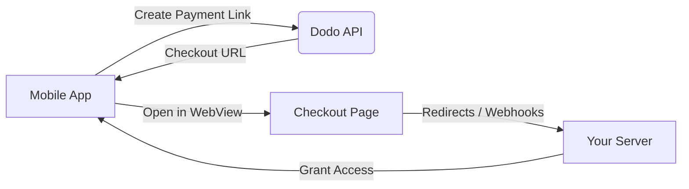

## Pendahuluan

Dodo Payments memberdayakan pengembang untuk menjual barang dan layanan digital di aplikasi iOS, menangani aspek kompleks seperti kepatuhan pajak, konversi mata uang, dan pembayaran. Panduan komprehensif ini menjelaskan cara mengintegrasikan Dodo Payments ke dalam aplikasi iOS Anda, khususnya untuk alat SaaS, langganan konten, dan utilitas digital.

## Ikhtisar

Dodo Payments berfungsi sebagai **Merchant of Record (MoR)** Anda, mengelola aspek kritis dari bisnis digital Anda:

<Tabs>
<Tab title="What We Handle">
- Pengumpulan dan pelunasan pajak (PPN, GST, dan pajak regional lainnya)
- Pembayaran global sesuai kebijakan dan metode pembayaran lokal
- Konversi mata uang dan valuta asing
- Chargeback dan pencegahan penipuan
- Penagihan dan tanda terima bagi pelanggan akhir
- Kepatuhan terhadap regulasi regional
</Tab>

<Tab title="What You Get">
- API terpadu untuk platform web dan seluler
- Dukungan untuk checkout di dalam aplikasi (UPI, kartu, dompet, BNPL)
- Dukungan pembayaran global (Payoneer, Wise, transfer bank lokal)
- Dasbor analitik dan pelaporan
- Pemrosesan pembayaran yang aman
</Tab>
</Tabs>

## Kasus Penggunaan

<CardGroup cols={2}>
<Card title="Subscriptions" icon="repeat">
- Akses konten atau fitur premium
- Penagihan berulang dengan opsi fleksibel, uji coba gratis, prorata, atau peningkatan dan penurunan
</Card>

<Card title="Courses and Learning" icon="graduation-cap">
- Akses bayar per kursus
- Paket konten bundel
- Lisensi seumur hidup atau dapat diperbarui
- Integrasi pelacakan kemajuan
</Card>

<Card title="Digital Downloads" icon="download">
- Pembelian sekali bayar (PDF, musik, alat)
- Pengiriman aset digital
- Manajemen kunci lisensi
</Card>

<Card title="SaaS Tools" icon="screwdriver-wrench">
- Langganan Software-as-a-Service
- Penagihan berdasarkan penggunaan
- Rencana tim dan perusahaan
</Card>
</CardGroup>

## Alur Integrasi

Anda dapat mengintegrasikan Dodo Payments ke dalam aplikasi Anda menggunakan checkout yang dihosting atau solusi browser dalam aplikasi.

### Langkah-langkah Integrasi

<Steps>
<Step title="Mobile App to Dodo API">
Proses dimulai dengan aplikasi seluler membuat tautan pembayaran dengan berinteraksi dengan API Dodo.
</Step>

<Step title="Dodo API to Mobile App">
API Dodo merespons dengan memberikan URL checkout kembali ke aplikasi seluler.
</Step>

<Step title="Mobile App to Checkout Page">
Aplikasi seluler kemudian membuka URL checkout ini dalam WebView, membawa pengguna ke halaman checkout.
</Step>

<Step title="Checkout Page to Your Server">
Setelah proses checkout selesai, halaman checkout berkomunikasi dengan server Anda melalui pengalihan atau webhook.
</Step>

<Step title="Your Server to Mobile App">
Akhirnya, server Anda memberikan akses ke konten atau layanan yang dibeli, menyelesaikan siklus transaksi kembali di aplikasi seluler.
</Step>
</Steps>

<Card title="Mobile Integration Guide" icon="mobile" href="/developer-resources/mobile-integration">
Untuk panduan lengkap bagi pengembang, jelajahi Panduan Integrasi Mobile kami.
</Card>

## Ketersediaan Regional

Dodo Payments memungkinkan alur pembelian dalam aplikasi alternatif hanya di wilayah App Store di mana Apple secara eksplisit mengizinkan pembayaran eksternal, atau di mana regulator atau perintah pengadilan memerintahkannya.

### Wilayah yang Didukung

<AccordionGroup>
<Accordion title="United States">
Didukung sejauh diizinkan oleh perintah pengadilan saat ini dan pedoman terbaru Apple.

- Tersedia di bawah ketentuan tertentu yang diwajibkan pengadilan
- Tergantung pada kepatuhan Apple terhadap persyaratan hukum
- Harus mengikuti pedoman implementasi Apple
</Accordion>

<Accordion title="European Union (EU) App Store">
Didukung melalui Ketentuan Alternatif UE Apple dan Hak Pembelian Eksternal.

- Diaktifkan melalui Ketentuan Alternatif UE Apple
- Memerlukan persetujuan Hak Pembelian Eksternal
- Harus mematuhi persyaratan Undang-Undang Pasar Digital UE
</Accordion>

<Accordion title="South Korea">
Didukung melalui Hak Pembelian Eksternal StoreKit untuk binari khusus Korea.

- Tersedia melalui Hak Pembelian Eksternal StoreKit
- Memerlukan binari aplikasi khusus Korea
- Harus mematuhi undang-undang telekomunikasi Korea
</Accordion>
</AccordionGroup>

<Warning>
Selalu tinjau dan patuhi hak khusus wilayah Apple serta persyaratan App Store Connect sebelum mengaktifkan Dodo Payments untuk toko mana pun. Menggunakan alur pembayaran alternatif di wilayah yang tidak didukung dapat menyebabkan penolakan atau penghapusan aplikasi.
</Warning>

<Note>
Untuk beberapa model bisnis - seperti layanan atau kategori konten tertentu - Apple mungkin tidak mewajibkan penggunaan pembelian dalam aplikasi (IAP) sama sekali. Dodo Payments juga mendukung model-model ini. Selalu verifikasi klasifikasi aplikasi Anda dan pedoman terbaru Apple untuk menentukan apakah IAP wajib untuk kasus penggunaan Anda.
</Note>

### Pelajari Lebih Lanjut

Untuk rincian mendalam tentang kebijakan global, preseden hukum, dan pendekatan strategis untuk menghindari biaya App Store, lihat panduan komprehensif kami:

<Card title="Bypassing App Store & Play Store Fees: A Strategic and Legal Playbook" icon="shield-check" href="/features/bypassing-app-store-fees">
Pelajari di mana dan bagaimana Anda dapat secara legal menerapkan alur pembayaran alternatif, dengan panduan regional terkini dan tips kepatuhan.
</Card>